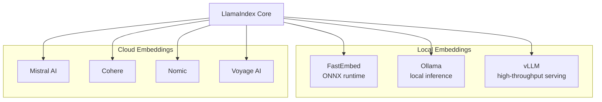
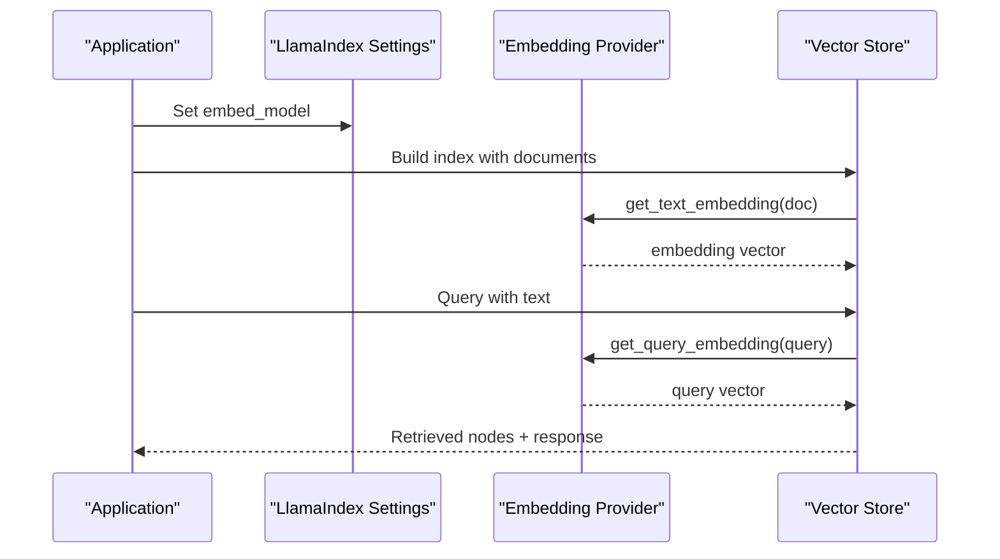
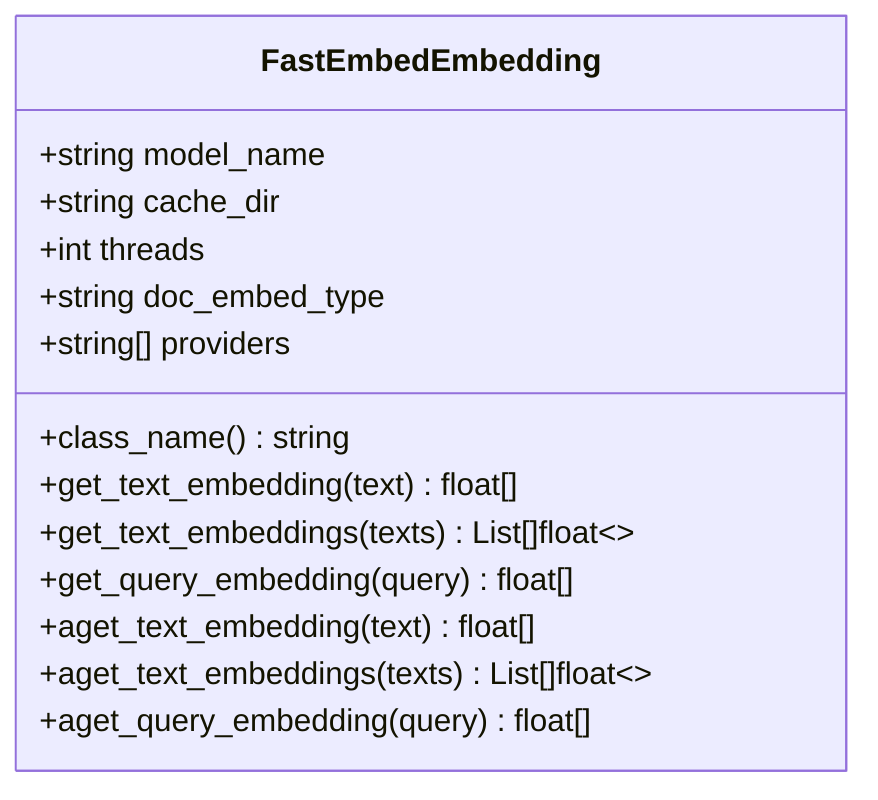
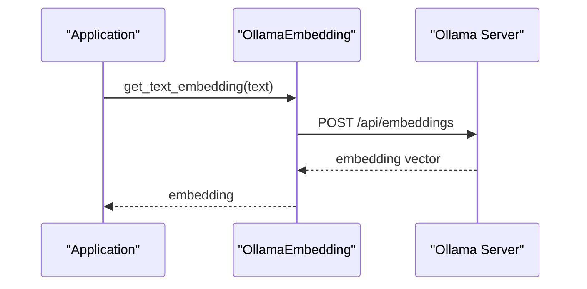
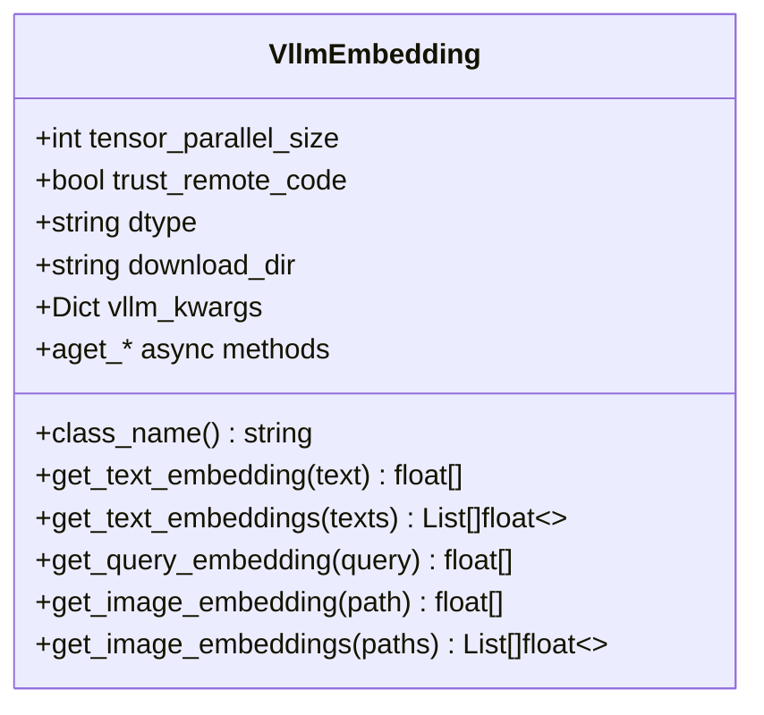
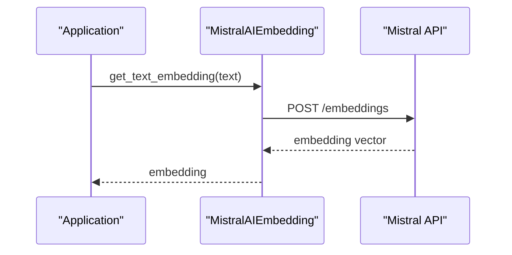
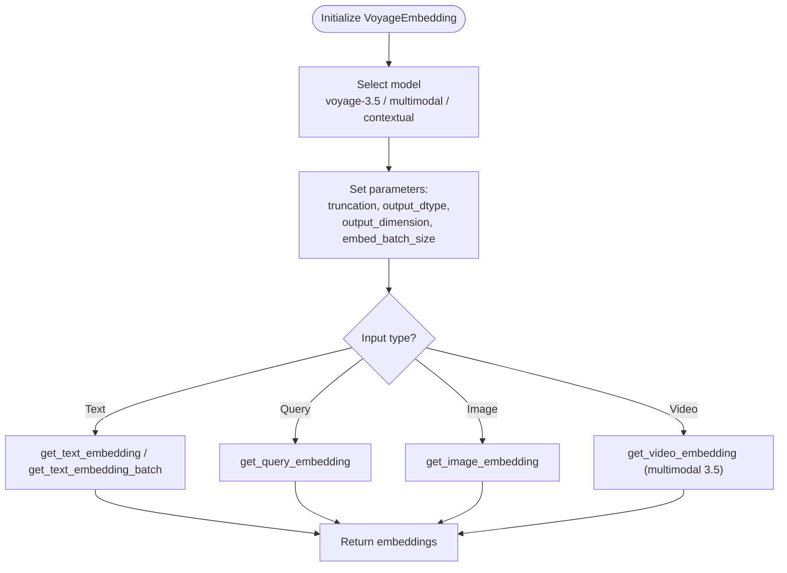
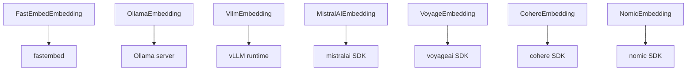
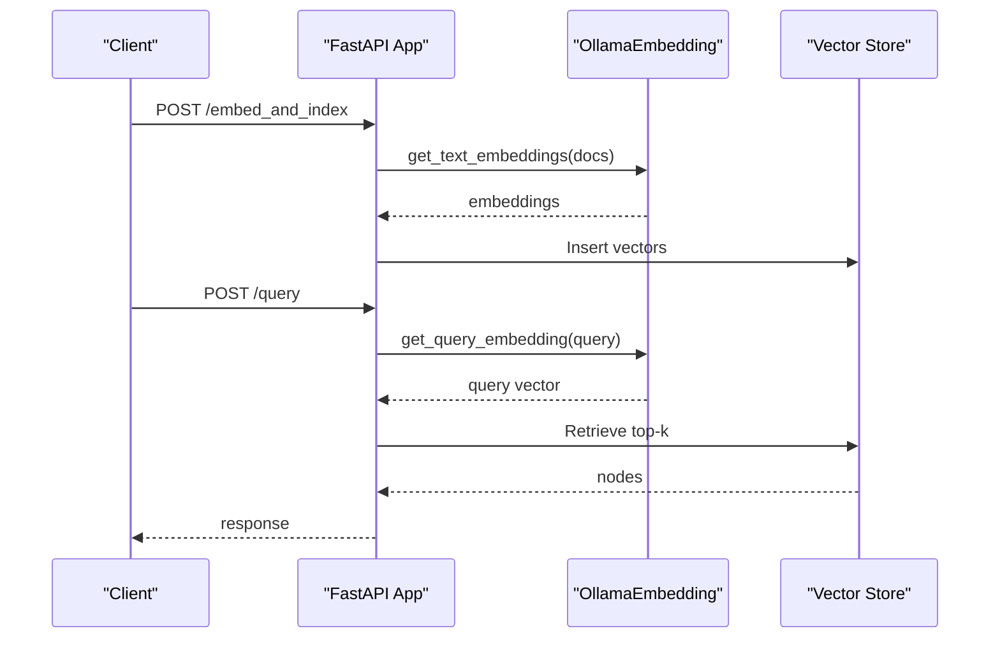

# Local and Specialized Embeddings

<cite>
**Referenced Files in This Document**
- [README.md](file://llama-index-integrations/embeddings/llama-index-embeddings-fastembed/README.md)
- [base.py](file://llama-index-integrations/embeddings/llama-index-embeddings-fastembed/llama_index/embeddings/fastembed/base.py)
- [README.md](file://llama-index-integrations/embeddings/llama-index-embeddings-ollama/README.md)
- [README.md](file://llama-index-integrations/embeddings/llama-index-embeddings-vllm/README.md)
- [base.py](file://llama-index-integrations/embeddings/llama-index-embeddings-vllm/llama_index/embeddings/vllm/base.py)
- [README.md](file://llama-index-integrations/embeddings/llama-index-embeddings-mistralai/README.md)
- [base.py](file://llama-index-integrations/embeddings/llama-index-embeddings-mistralai/llama_index/embeddings/mistralai/base.py)
- [README.md](file://llama-index-integrations/embeddings/llama-index-embeddings-cohere/README.md)
- [README.md](file://llama-index-integrations/embeddings/llama-index-embeddings-nomic/README.md)
- [README.md](file://llama-index-integrations/embeddings/llama-index-embeddings-voyageai/README.md)
- [README.md](file://examples/fastapi_rag_ollama/README.md)
- [app.py](file://examples/fastapi_rag_ollama/app.py)
- [requirements.txt](file://examples/fastapi_rag_ollama/requirements.txt)
</cite>

## Table of Contents
1. [Introduction](#introduction)
2. [Project Structure](#project-structure)
3. [Core Components](#core-components)
4. [Architecture Overview](#architecture-overview)
5. [Detailed Component Analysis](#detailed-component-analysis)
6. [Dependency Analysis](#dependency-analysis)
7. [Performance Considerations](#performance-considerations)
8. [Troubleshooting Guide](#troubleshooting-guide)
9. [Conclusion](#conclusion)
10. [Appendices](#appendices)

## Introduction
This document provides comprehensive API documentation for local and specialized embedding implementations integrated with LlamaIndex. It covers:
- High-performance local embeddings via FastEmbed
- Local model inference via Ollama
- Efficient serving via vLLM
- Specialized embedding providers: Mistral AI, Cohere, Nomic, and Voyage AI
- Hardware acceleration support (Intel, Gaudi), quantization options, and memory optimization techniques
- Model selection criteria, performance benchmarks, and deployment strategies for edge computing scenarios

The goal is to help developers choose the right embedding provider, configure it effectively, and deploy it efficiently for both local and cloud environments.

## Project Structure
The repository organizes embedding integrations under dedicated packages. For local and specialized embeddings:
- FastEmbed: local, ONNX-backed embeddings
- Ollama: local inference server for embeddings and LLMs
- vLLM: high-throughput local embedding serving
- Mistral AI, Cohere, Nomic, Voyage AI: cloud-hosted embedding APIs

**Section sources**
- [README.md](file://llama-index-integrations/embeddings/llama-index-embeddings-fastembed/README.md#L1-L2)
- [README.md](file://llama-index-integrations/embeddings/llama-index-embeddings-ollama/README.md#L1-L242)
- [README.md](file://llama-index-integrations/embeddings/llama-index-embeddings-vllm/README.md#L1-L2)
- [README.md](file://llama-index-integrations/embeddings/llama-index-embeddings-mistralai/README.md#L1-L2)
- [README.md](file://llama-index-integrations/embeddings/llama-index-embeddings-cohere/README.md#L1-L2)
- [README.md](file://llama-index-integrations/embeddings/llama-index-embeddings-nomic/README.md#L1-L2)
- [README.md](file://llama-index-integrations/embeddings/llama-index-embeddings-voyageai/README.md#L1-L348)

## Core Components
- FastEmbedEmbedding: local, ONNX-backed embeddings with configurable providers and threading
- OllamaEmbedding: local embeddings powered by Ollama server with instruction tuning and async support
- VllmEmbedding: local embedding serving via vLLM with retry, multimodal support, and GPU parallelism
- MistralAIEmbedding: cloud embeddings via Mistral AI SDK
- CohereEmbedding: cloud embeddings via Cohere API
- NomicEmbedding: cloud embeddings via Nomic API
- VoyageEmbedding: cloud embeddings with multimodal and contextual variants

Key capabilities:
- Batch embedding generation
- Async APIs for improved throughput
- Instruction-based query/document embeddings
- Multimodal embeddings (images, video)
- Output dtype/dimension reduction
- Retry and error handling

**Section sources**
- [base.py](file://llama-index-integrations/embeddings/llama-index-embeddings-fastembed/llama_index/embeddings/fastembed/base.py#L12-L126)
- [README.md](file://llama-index-integrations/embeddings/llama-index-embeddings-ollama/README.md#L30-L242)
- [base.py](file://llama-index-integrations/embeddings/llama-index-embeddings-vllm/llama_index/embeddings/vllm/base.py#L18-L253)
- [base.py](file://llama-index-integrations/embeddings/llama-index-embeddings-mistralai/llama_index/embeddings/mistralai/base.py#L16-L110)
- [README.md](file://llama-index-integrations/embeddings/llama-index-embeddings-voyageai/README.md#L25-L348)

## Architecture Overview
The embedding pipeline integrates with LlamaIndex’s Settings to supply embeddings to VectorStoreIndex and query engines. Providers differ in locality and API characteristics:
- Local providers (FastEmbed, Ollama, vLLM) run without external network calls
- Cloud providers (Mistral AI, Cohere, Nomic, Voyage AI) require API keys and network connectivity

**Diagram sources**
- [README.md](file://llama-index-integrations/embeddings/llama-index-embeddings-ollama/README.md#L65-L110)
- [README.md](file://llama-index-integrations/embeddings/llama-index-embeddings-voyageai/README.md#L203-L230)

## Detailed Component Analysis

### FastEmbed
FastEmbed provides high-performance local embeddings using ONNX runtime. It supports configurable providers, threading, and document embedding modes.

Key configuration:
- model_name: Select a supported FastEmbed model
- cache_dir: Model cache location
- threads: Thread count for ONNX sessions
- doc_embed_type: "default" or "passage" embedding mode
- providers: ONNX runtime providers (e.g., CPU, CUDA)

Usage highlights:
- Batch and async APIs
- Seamless integration with LlamaIndex vector stores

**Diagram sources**
- [base.py](file://llama-index-integrations/embeddings/llama-index-embeddings-fastembed/llama_index/embeddings/fastembed/base.py#L12-L126)

**Section sources**
- [base.py](file://llama-index-integrations/embeddings/llama-index-embeddings-fastembed/llama_index/embeddings/fastembed/base.py#L12-L126)
- [README.md](file://llama-index-integrations/embeddings/llama-index-embeddings-fastembed/README.md#L1-L2)

### Ollama
Ollama enables local embedding generation with optional instruction tuning and async support. It integrates with LlamaIndex by setting the global embed_model.

Configuration options:
- model_name: Name of the Ollama embedding model
- base_url: Ollama server endpoint
- embed_batch_size: Batch size for embeddings
- keep_alive: Model memory retention
- query_instruction/text_instruction: Prepend instructions to improve retrieval
- ollama_additional_kwargs/client_kwargs: Extra parameters for API/client

Common models:
- nomic-embed-text
- embeddinggemma
- mxbai-embed-large

**Diagram sources**
- [README.md](file://llama-index-integrations/embeddings/llama-index-embeddings-ollama/README.md#L30-L127)

**Section sources**
- [README.md](file://llama-index-integrations/embeddings/llama-index-embeddings-ollama/README.md#L30-L242)

### vLLM
VllmEmbedding runs embedding models locally with GPU parallelism and retry logic. It supports text and image embeddings.

Key parameters:
- tensor_parallel_size: GPU parallelism
- trust_remote_code: Allow remote code during model load
- dtype: Data type for weights and activations
- download_dir: Weights cache directory
- vllm_kwargs: Additional vLLM initialization parameters

Retry and cleanup:
- Built-in retry with exponential backoff
- GPU cleanup hooks on exit

**Diagram sources**
- [base.py](file://llama-index-integrations/embeddings/llama-index-embeddings-vllm/llama_index/embeddings/vllm/base.py#L18-L253)

**Section sources**
- [base.py](file://llama-index-integrations/embeddings/llama-index-embeddings-vllm/llama_index/embeddings/vllm/base.py#L18-L253)
- [README.md](file://llama-index-integrations/embeddings/llama-index-embeddings-vllm/README.md#L1-L2)

### Mistral AI
MistralAIEmbedding provides cloud embeddings via the Mistral AI SDK. It requires an API key and supports batch and async operations.

Configuration:
- model_name: Embedding model identifier
- api_key: Mistral API key (via parameter or environment)
- embed_batch_size: Batch size for requests
- callback_manager: Observability hooks

**Diagram sources**
- [base.py](file://llama-index-integrations/embeddings/llama-index-embeddings-mistralai/llama_index/embeddings/mistralai/base.py#L16-L110)

**Section sources**
- [base.py](file://llama-index-integrations/embeddings/llama-index-embeddings-mistralai/llama_index/embeddings/mistralai/base.py#L16-L110)
- [README.md](file://llama-index-integrations/embeddings/llama-index-embeddings-mistralai/README.md#L1-L2)

### Cohere
Cohere embeddings are available via the Cohere integration package. Typical usage involves initializing an embedding model and generating embeddings for text or batches.

- Initialization and basic usage patterns are documented in the integration package
- Supports batch operations and async variants where applicable

**Section sources**
- [README.md](file://llama-index-integrations/embeddings/llama-index-embeddings-cohere/README.md#L1-L2)

### Nomic
Nomic embeddings are available via the Nomic integration package. Typical usage involves initializing an embedding model and generating embeddings for text or batches.

- Initialization and basic usage patterns are documented in the integration package
- Supports batch operations and async variants where applicable

**Section sources**
- [README.md](file://llama-index-integrations/embeddings/llama-index-embeddings-nomic/README.md#L1-L2)

### Voyage AI
Voyage AI offers a broad range of embedding models, including multimodal and contextual variants. It supports dynamic batching, token limits, and flexible output formats.

Capabilities:
- Dynamic batching respecting per-model token limits
- Multimodal embeddings (text + image; video with 3.5)
- Contextual embeddings for enhanced context awareness
- Flexible output dtype and dimension reduction
- Async support for improved throughput

**Diagram sources**
- [README.md](file://llama-index-integrations/embeddings/llama-index-embeddings-voyageai/README.md#L269-L318)

**Section sources**
- [README.md](file://llama-index-integrations/embeddings/llama-index-embeddings-voyageai/README.md#L25-L348)

## Dependency Analysis
Provider-specific dependencies and integration points:

Notes:
- FastEmbed requires ONNX runtime and optional GPU support
- Ollama requires a running Ollama server and pulled models
- vLLM requires GPU drivers and compatible model weights
- Cloud providers require API keys and network connectivity

**Diagram sources**
- [base.py](file://llama-index-integrations/embeddings/llama-index-embeddings-fastembed/llama_index/embeddings/fastembed/base.py#L82-L97)
- [base.py](file://llama-index-integrations/embeddings/llama-index-embeddings-vllm/llama_index/embeddings/vllm/base.py#L71-L87)
- [base.py](file://llama-index-integrations/embeddings/llama-index-embeddings-mistralai/llama_index/embeddings/mistralai/base.py#L45-L52)
- [README.md](file://llama-index-integrations/embeddings/llama-index-embeddings-voyageai/README.md#L5-L23)

**Section sources**
- [base.py](file://llama-index-integrations/embeddings/llama-index-embeddings-fastembed/llama_index/embeddings/fastembed/base.py#L82-L97)
- [base.py](file://llama-index-integrations/embeddings/llama-index-embeddings-vllm/llama_index/embeddings/vllm/base.py#L71-L87)
- [base.py](file://llama-index-integrations/embeddings/llama-index-embeddings-mistralai/llama_index/embeddings/mistralai/base.py#L45-L52)
- [README.md](file://llama-index-integrations/embeddings/llama-index-embeddings-voyageai/README.md#L5-L23)

## Performance Considerations
- FastEmbed
  - Use appropriate providers (CPU/GPU) and tune threads for workload
  - Prefer "passage" embedding mode for document retrieval tasks
- Ollama
  - Adjust embed_batch_size and keep_alive to balance latency and memory usage
  - Use query_instruction/text_instruction to improve retrieval quality
- vLLM
  - Increase tensor_parallel_size for multi-GPU setups
  - Set dtype to reduce memory footprint (e.g., float16 on supported GPUs)
  - Use retry and batching to handle transient failures
- Cloud providers
  - Leverage dynamic batching and token limits to optimize cost and throughput
  - Use output dtype/dimension reduction judiciously to trade off accuracy for speed

[No sources needed since this section provides general guidance]

## Troubleshooting Guide
- FastEmbed
  - Ensure fastembed is installed; use fastembed-gpu for GPU acceleration
  - Verify model_name exists in supported models
- Ollama
  - Confirm Ollama server is running and reachable
  - Pull the required embedding model before use
  - Validate base_url and model_name
- vLLM
  - Check GPU availability and drivers
  - Review tensor_parallel_size and dtype compatibility
  - Inspect retry logs for transient failures
- Voyage AI
  - Verify VOYAGE_API_KEY environment variable or explicit key
  - Respect model-specific token limits and batch sizes
  - Enable truncation for multimodal models

**Section sources**
- [base.py](file://llama-index-integrations/embeddings/llama-index-embeddings-fastembed/llama_index/embeddings/fastembed/base.py#L82-L97)
- [README.md](file://llama-index-integrations/embeddings/llama-index-embeddings-ollama/README.md#L221-L239)
- [base.py](file://llama-index-integrations/embeddings/llama-index-embeddings-vllm/llama_index/embeddings/vllm/base.py#L109-L144)
- [README.md](file://llama-index-integrations/embeddings/llama-index-embeddings-voyageai/README.md#L326-L335)

## Conclusion
Choosing the right embedding provider depends on locality needs, performance targets, and feature sets:
- Use FastEmbed for pure local, high-throughput text embeddings
- Use Ollama for flexible local inference with instruction tuning
- Use vLLM for high-throughput local serving with GPU parallelism
- Use Mistral AI, Cohere, Nomic, and Voyage AI for specialized models, multimodality, and advanced features

For edge deployments, prioritize local providers (FastEmbed, Ollama, vLLM) and apply quantization, dtype tuning, and memory optimization to meet resource constraints.

[No sources needed since this section summarizes without analyzing specific files]

## Appendices

### Deployment Strategies for Edge Computing
- FastEmbed
  - Package models with application; cache_dir for persistent storage
  - Use CPU provider for minimal footprint; switch to CUDA provider for speed
- Ollama
  - Run as a service on edge devices; pre-pull models to reduce cold-start latency
  - Use keep_alive to maintain models in memory
- vLLM
  - Containerize with GPU drivers; set tensor_parallel_size to match device topology
  - Monitor GPU memory and adjust batch sizes accordingly

**Section sources**
- [README.md](file://llama-index-integrations/embeddings/llama-index-embeddings-fastembed/README.md#L1-L2)
- [README.md](file://llama-index-integrations/embeddings/llama-index-embeddings-ollama/README.md#L17-L30)
- [README.md](file://llama-index-integrations/embeddings/llama-index-embeddings-vllm/README.md#L1-L2)

### Example Integration: FastAPI RAG with Ollama
A practical example demonstrates integrating Ollama embeddings with a FastAPI-based RAG application.

**Diagram sources**
- [README.md](file://examples/fastapi_rag_ollama/README.md#L1-L200)
- [app.py](file://examples/fastapi_rag_ollama/app.py#L1-L200)

**Section sources**
- [README.md](file://examples/fastapi_rag_ollama/README.md#L1-L200)
- [app.py](file://examples/fastapi_rag_ollama/app.py#L1-L200)
- [requirements.txt](file://examples/fastapi_rag_ollama/requirements.txt#L1-L200)