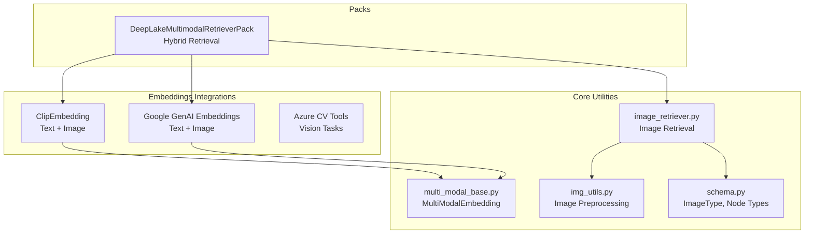
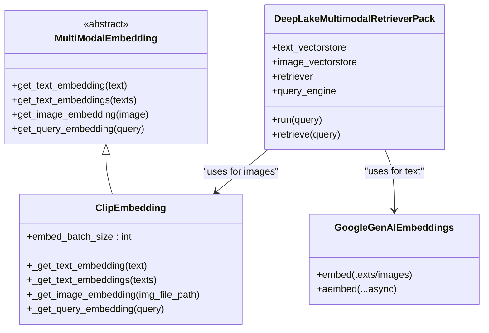
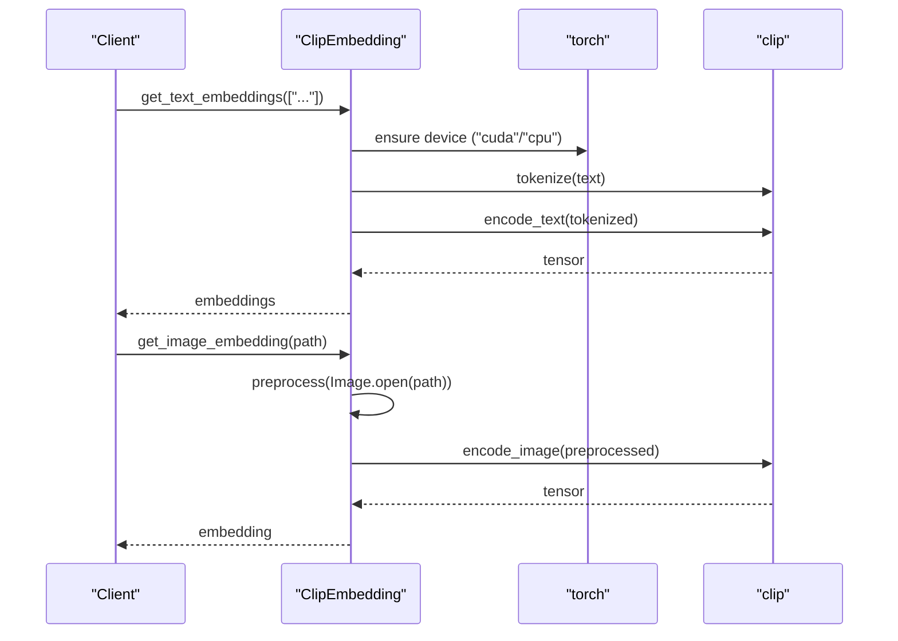
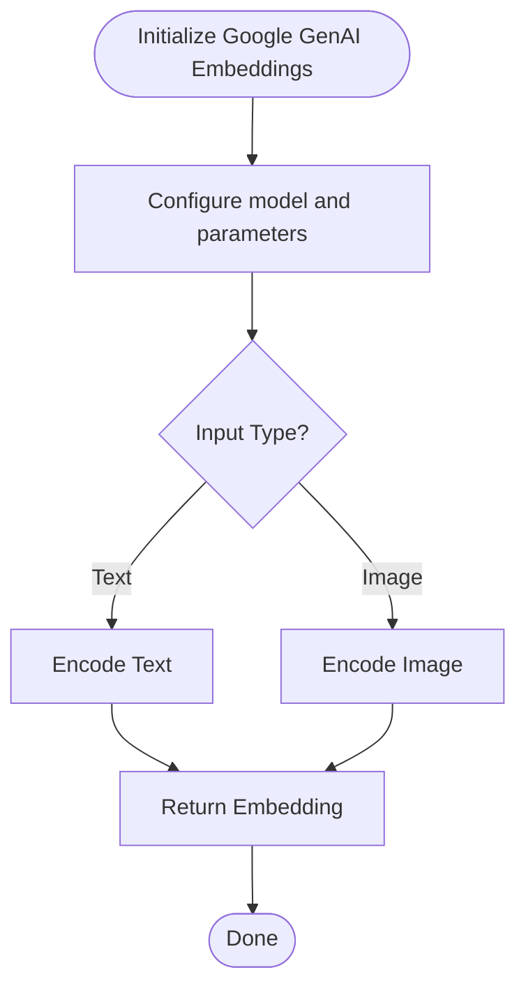
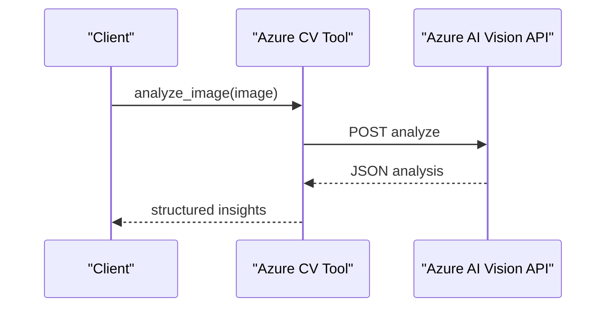
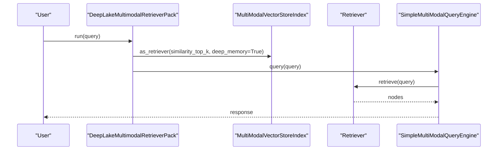
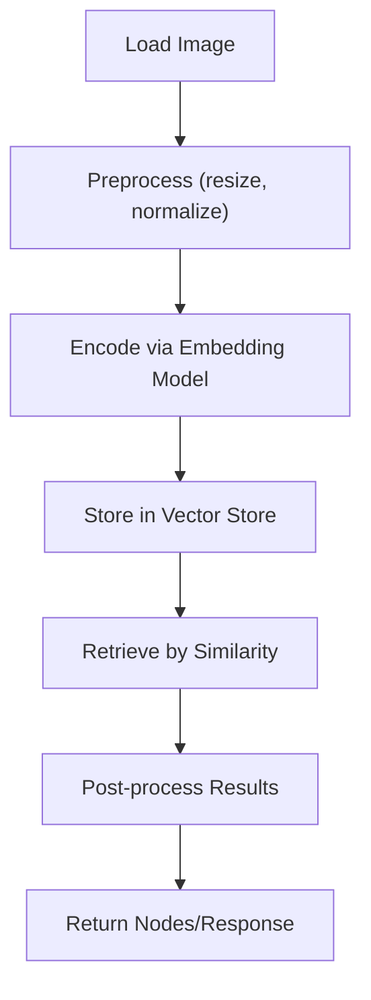
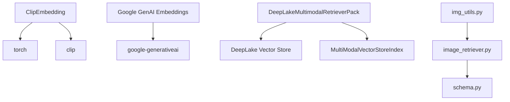

# Multi-modal Embeddings

<cite>
**Referenced Files in This Document**
- [clip.md](file://docs/api_reference/api_reference/embeddings/clip.md)
- [__init__.py](file://llama-index-integrations/embeddings/llama-index-embeddings-clip/llama_index/embeddings/clip/__init__.py)
- [base.py](file://llama-index-integrations/embeddings/llama-index-embeddings-clip/llama_index/embeddings/clip/base.py)
- [README.md](file://llama-index-integrations/embeddings/llama-index-embeddings-clip/README.md)
- [multimodal.md](file://docs/src/content/docs/framework/use_cases/multimodal.md)
- [README.md](file://llama-index-packs/llama-index-packs-deeplake-multimodal-retrieval/README.md)
- [base.py](file://llama-index-packs/llama-index-packs-deeplake-multimodal-retrieval/llama_index/packs/deeplake_multimodal_retrieval/base.py)
- [google_genai.md](file://docs/api_reference/api_reference/embeddings/google_genai.md)
- [base.py](file://llama-index-integrations/embeddings/llama-index-embeddings-google-genai/llama_index/embeddings/google_genai/base.py)
- [azure_cv.md](file://docs/api_reference/api_reference/tools/azure_cv.md)
- [azure_vision.ipynb](file://llama-index-integrations/tools/llama-index-tools-azure-cv/examples/azure_vision.ipynb)
- [img_utils.py](file://llama-index-core/llama_index/core/img_utils.py)
- [image_retriever.py](file://llama-index-core/llama_index/core/image_retriever.py)
- [multi_modal_base.py](file://llama-index-core/llama_index/core/embeddings/multi_modal_base.py)
- [schema.py](file://llama-index-core/llama_index/core/schema.py)
- [__init__.py](file://llama-index-core/llama_index/core/__init__.py)
</cite>

## Table of Contents
1. [Introduction](#introduction)
2. [Project Structure](#project-structure)
3. [Core Components](#core-components)
4. [Architecture Overview](#architecture-overview)
5. [Detailed Component Analysis](#detailed-component-analysis)
6. [Dependency Analysis](#dependency-analysis)
7. [Performance Considerations](#performance-considerations)
8. [Troubleshooting Guide](#troubleshooting-guide)
9. [Conclusion](#conclusion)
10. [Appendices](#appendices)

## Introduction
This document provides comprehensive API documentation for multi-modal embedding integrations within the LlamaIndex ecosystem, focusing on text, image, and video processing. It covers CLIP embeddings, Google Multimodal (Gemini), and Azure AI Vision integrations. The guide details image preprocessing, resolution handling, cross-modal similarity computation, and practical workflows such as hybrid search systems combining text and visual content, image retrieval, and video frame extraction. It also includes batch processing strategies for heterogeneous multi-modal inputs, memory management for large media files, and optimization recommendations.

## Project Structure
The multi-modal embedding capabilities are implemented across three primary areas:
- CLIP embeddings integration for text-image encoding
- Google Multimodal embeddings integration for Gemini-based multi-modal inputs
- Azure AI Vision tools for image analysis and vision tasks
- Core utilities for image preprocessing, image retrieval, and multi-modal base abstractions
- A LlamaPack for DeepLake-based multimodal retrieval using CLIP and GPT-4V

**Diagram sources**
- [base.py](file://llama-index-integrations/embeddings/llama-index-embeddings-clip/llama_index/embeddings/clip/base.py#L17-L132)
- [base.py](file://llama-index-integrations/embeddings/llama-index-embeddings-google-genai/llama_index/embeddings/google_genai/base.py)
- [base.py](file://llama-index-packs/llama-index-packs-deeplake-multimodal-retrieval/llama_index/packs/deeplake_multimodal_retrieval/base.py#L13-L85)
- [img_utils.py](file://llama-index-core/llama_index/core/img_utils.py)
- [image_retriever.py](file://llama-index-core/llama_index/core/image_retriever.py)
- [multi_modal_base.py](file://llama-index-core/llama_index/core/embeddings/multi_modal_base.py)
- [schema.py](file://llama-index-core/llama_index/core/schema.py)

**Section sources**
- [clip.md](file://docs/api_reference/api_reference/embeddings/clip.md#L1-L4)
- [README.md](file://llama-index-integrations/embeddings/llama-index-embeddings-clip/README.md#L1-L2)
- [multimodal.md](file://docs/src/content/docs/framework/use_cases/multimodal.md#L1-L83)
- [README.md](file://llama-index-packs/llama-index-packs-deeplake-multimodal-retrieval/README.md#L1-L62)

## Core Components
- ClipEmbedding: Implements multi-modal text and image embedding using CLIP. Supports batched text embeddings and single-image embeddings with automatic device selection (GPU/CPU).
- Google GenAI Embeddings: Provides multi-modal embedding support leveraging Google’s GenAI/Gemini models for text and image inputs.
- Azure CV Tools: Offers vision-related tools for image analysis and processing, enabling integration with Azure AI Vision APIs.
- DeepLakeMultimodalRetrieverPack: A LlamaPack that indexes multimodal content (text and images) into DeepLake and performs hybrid retrieval using CLIP and GPT-4V.
- Core Utilities:
  - img_utils.py: Image preprocessing helpers for resizing, normalization, and format conversions.
  - image_retriever.py: Image retrieval interfaces and workflows.
  - multi_modal_base.py: Base abstraction for multi-modal embeddings.
  - schema.py: Defines ImageType and related node types used across multi-modal workflows.

Key capabilities:
- Cross-modal similarity computation via shared embedding spaces
- Batch processing for multi-modal inputs
- Memory-efficient handling of large media assets
- Hybrid search combining textual and visual signals

**Section sources**
- [base.py](file://llama-index-integrations/embeddings/llama-index-embeddings-clip/llama_index/embeddings/clip/base.py#L17-L132)
- [base.py](file://llama-index-integrations/embeddings/llama-index-embeddings-google-genai/llama_index/embeddings/google_genai/base.py)
- [base.py](file://llama-index-packs/llama-index-packs-deeplake-multimodal-retrieval/llama_index/packs/deeplake_multimodal_retrieval/base.py#L13-L85)
- [img_utils.py](file://llama-index-core/llama_index/core/img_utils.py)
- [image_retriever.py](file://llama-index-core/llama_index/core/image_retriever.py)
- [multi_modal_base.py](file://llama-index-core/llama_index/core/embeddings/multi_modal_base.py)
- [schema.py](file://llama-index-core/llama_index/core/schema.py)

## Architecture Overview
The multi-modal embedding architecture integrates provider-specific embedding models with a unified multi-modal base class. Retrieval and query engines leverage these embeddings to enable cross-modal similarity search.

**Diagram sources**
- [multi_modal_base.py](file://llama-index-core/llama_index/core/embeddings/multi_modal_base.py)
- [base.py](file://llama-index-integrations/embeddings/llama-index-embeddings-clip/llama_index/embeddings/clip/base.py#L17-L132)
- [base.py](file://llama-index-integrations/embeddings/llama-index-embeddings-google-genai/llama_index/embeddings/google_genai/base.py)
- [base.py](file://llama-index-packs/llama-index-packs-deeplake-multimodal-retrieval/llama_index/packs/deeplake_multimodal_retrieval/base.py#L13-L85)

## Detailed Component Analysis

### CLIP Embeddings Integration
- Purpose: Encode text and images into a shared embedding space for cross-modal similarity.
- Key Methods:
  - Text embedding: single and batch variants
  - Image embedding: single image via file path with preprocessing and GPU/CPU device selection
- Batch Processing: Configurable batch size with defaults aligned to core constants.
- Device Management: Automatically selects CUDA if available, otherwise falls back to CPU.

**Diagram sources**
- [base.py](file://llama-index-integrations/embeddings/llama-index-embeddings-clip/llama_index/embeddings/clip/base.py#L95-L131)

**Section sources**
- [clip.md](file://docs/api_reference/api_reference/embeddings/clip.md#L1-L4)
- [__init__.py](file://llama-index-integrations/embeddings/llama-index-embeddings-clip/llama_index/embeddings/clip/__init__.py#L1-L4)
- [base.py](file://llama-index-integrations/embeddings/llama-index-embeddings-clip/llama_index/embeddings/clip/base.py#L17-L132)

### Google Multimodal Embeddings Integration
- Purpose: Provide multi-modal embeddings using Google’s GenAI/Gemini models for text and images.
- Integration Points:
  - Embedding API surface aligns with multi-modal base abstractions.
  - Supports asynchronous embedding for improved throughput.

**Diagram sources**
- [google_genai.md](file://docs/api_reference/api_reference/embeddings/google_genai.md)
- [base.py](file://llama-index-integrations/embeddings/llama-index-embeddings-google-genai/llama_index/embeddings/google_genai/base.py)

**Section sources**
- [google_genai.md](file://docs/api_reference/api_reference/embeddings/google_genai.md)
- [base.py](file://llama-index-integrations/embeddings/llama-index-embeddings-google-genai/llama_index/embeddings/google_genai/base.py)

### Azure AI Vision Integration
- Purpose: Enable vision tasks such as image analysis and OCR via Azure AI Vision APIs.
- Example Notebook: Demonstrates Azure Vision usage in a multi-modal context.

**Diagram sources**
- [azure_cv.md](file://docs/api_reference/api_reference/tools/azure_cv.md)
- [azure_vision.ipynb](file://llama-index-integrations/tools/llama-index-tools-azure-cv/examples/azure_vision.ipynb)

**Section sources**
- [azure_cv.md](file://docs/api_reference/api_reference/tools/azure_cv.md)
- [azure_vision.ipynb](file://llama-index-integrations/tools/llama-index-tools-azure-cv/examples/azure_vision.ipynb)

### DeepLake Multimodal Retrieval Pack
- Purpose: Index and retrieve multimodal content (text and images) using DeepLake vector stores.
- Workflow:
  - Separate text and image vector stores
  - MultiModalVectorStoreIndex for hybrid indexing
  - DeepMemory-enabled retriever and SimpleMultiModalQueryEngine for queries

**Diagram sources**
- [README.md](file://llama-index-packs/llama-index-packs-deeplake-multimodal-retrieval/README.md#L1-L62)
- [base.py](file://llama-index-packs/llama-index-packs-deeplake-multimodal-retrieval/llama_index/packs/deeplake_multimodal_retrieval/base.py#L13-L85)

**Section sources**
- [README.md](file://llama-index-packs/llama-index-packs-deeplake-multimodal-retrieval/README.md#L1-L62)
- [base.py](file://llama-index-packs/llama-index-packs-deeplake-multimodal-retrieval/llama_index/packs/deeplake_multimodal_retrieval/base.py#L13-L85)

### Image Preprocessing and Resolution Handling
- img_utils.py provides utilities for image preprocessing, including resizing and normalization.
- image_retriever.py defines retrieval interfaces and workflows that rely on standardized image types.

**Diagram sources**
- [img_utils.py](file://llama-index-core/llama_index/core/img_utils.py)
- [image_retriever.py](file://llama-index-core/llama_index/core/image_retriever.py)
- [schema.py](file://llama-index-core/llama_index/core/schema.py)

**Section sources**
- [img_utils.py](file://llama-index-core/llama_index/core/img_utils.py)
- [image_retriever.py](file://llama-index-core/llama_index/core/image_retriever.py)
- [schema.py](file://llama-index-core/llama_index/core/schema.py)

## Dependency Analysis
- ClipEmbedding depends on the CLIP library and torch for device-aware inference.
- Google GenAI embeddings integrate with Google’s GenAI SDK.
- DeepLakeMultimodalRetrieverPack depends on DeepLake vector stores and multi-modal index infrastructure.
- Core utilities (img_utils, image_retriever, multi_modal_base, schema) underpin all multi-modal workflows.

**Diagram sources**
- [base.py](file://llama-index-integrations/embeddings/llama-index-embeddings-clip/llama_index/embeddings/clip/base.py#L68-L88)
- [base.py](file://llama-index-integrations/embeddings/llama-index-embeddings-google-genai/llama_index/embeddings/google_genai/base.py)
- [base.py](file://llama-index-packs/llama-index-packs-deeplake-multimodal-retrieval/llama_index/packs/deeplake_multimodal_retrieval/base.py#L13-L85)
- [img_utils.py](file://llama-index-core/llama_index/core/img_utils.py)
- [image_retriever.py](file://llama-index-core/llama_index/core/image_retriever.py)
- [schema.py](file://llama-index-core/llama_index/core/schema.py)

**Section sources**
- [base.py](file://llama-index-integrations/embeddings/llama-index-embeddings-clip/llama_index/embeddings/clip/base.py#L68-L88)
- [base.py](file://llama-index-integrations/embeddings/llama-index-embeddings-google-genai/llama_index/embeddings/google_genai/base.py)
- [base.py](file://llama-index-packs/llama-index-packs-deeplake-multimodal-retrieval/llama_index/packs/deeplake_multimodal_retrieval/base.py#L13-L85)
- [img_utils.py](file://llama-index-core/llama_index/core/img_utils.py)
- [image_retriever.py](file://llama-index-core/llama_index/core/image_retriever.py)
- [schema.py](file://llama-index-core/llama_index/core/schema.py)

## Performance Considerations
- Batch Processing:
  - Use configurable batch sizes for text embeddings to reduce overhead and improve throughput.
  - Keep batch sizes within provider limits and memory constraints.
- Device Selection:
  - Prefer GPU acceleration when available; fallback to CPU gracefully.
- Memory Management:
  - Preprocess images to target resolutions to reduce memory footprint.
  - Stream large media assets where possible and avoid loading entire datasets into memory.
- Cross-modal Similarity:
  - Normalize embeddings to unit vectors to stabilize cosine similarity computations.
  - Cache frequently accessed embeddings to minimize repeated inference.
- Hybrid Retrieval:
  - Combine textual and visual scores using weighted fusion strategies.
  - Tune top-k and similarity thresholds for balanced recall/precision.

[No sources needed since this section provides general guidance]

## Troubleshooting Guide
- CLIP Embedding Initialization Failures:
  - Ensure the CLIP library and torch are installed and importable.
  - Verify model name compatibility and availability.
- Device Availability:
  - Confirm CUDA availability; otherwise, CPU fallback is used automatically.
- Embedding Dimension Mismatches:
  - Validate that embeddings produced by different providers are compatible in dimensionality before fusion.
- DeepLake Retrieval Issues:
  - Confirm dataset paths and overwrite flags are correctly configured.
  - Ensure vector stores are initialized before indexing or retrieval.

**Section sources**
- [base.py](file://llama-index-integrations/embeddings/llama-index-embeddings-clip/llama_index/embeddings/clip/base.py#L68-L88)
- [README.md](file://llama-index-packs/llama-index-packs-deeplake-multimodal-retrieval/README.md#L1-L62)

## Conclusion
The LlamaIndex multi-modal embedding stack enables robust text-image cross-modal workflows through provider integrations (CLIP, Google GenAI, Azure AI Vision), unified base abstractions, and production-ready packs like DeepLakeMultimodalRetrieverPack. By leveraging batch processing, device-aware inference, and efficient image preprocessing, developers can build scalable hybrid search systems, image retrieval pipelines, and vision-augmented RAG applications.

[No sources needed since this section summarizes without analyzing specific files]

## Appendices

### Practical Workflows and Examples
- Hybrid Search Systems:
  - Combine text and image embeddings using shared vector stores and weighted similarity scoring.
- Image Retrieval:
  - Preprocess images, compute embeddings, index into vector stores, and retrieve by cross-modal similarity.
- Video Frame Extraction:
  - Extract frames at regular intervals, treat each frame as an image, and embed/ingest for temporal retrieval.

[No sources needed since this section provides general guidance]