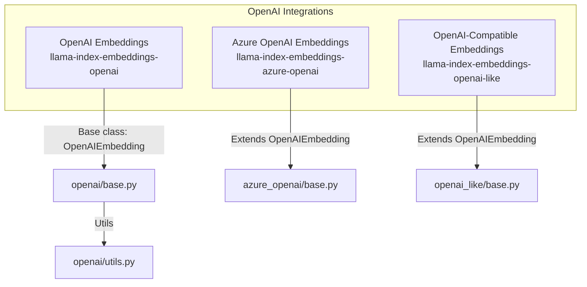
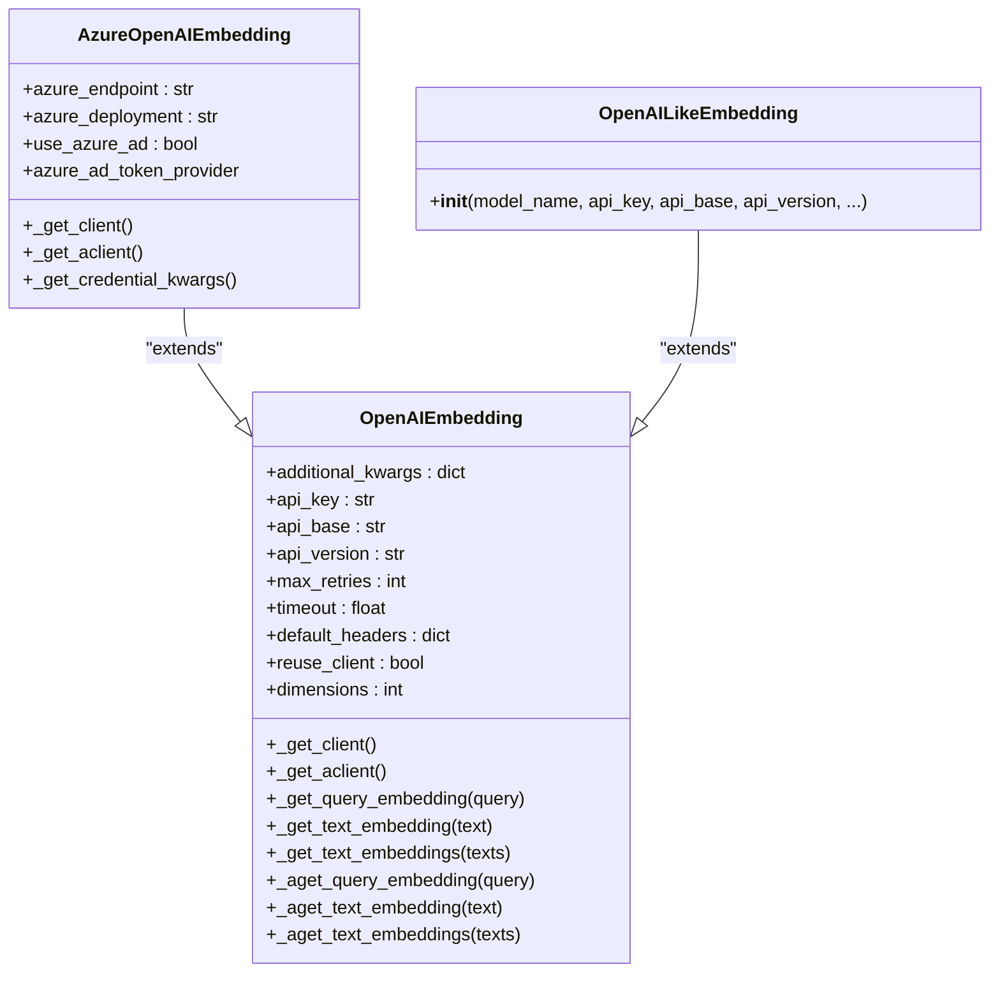
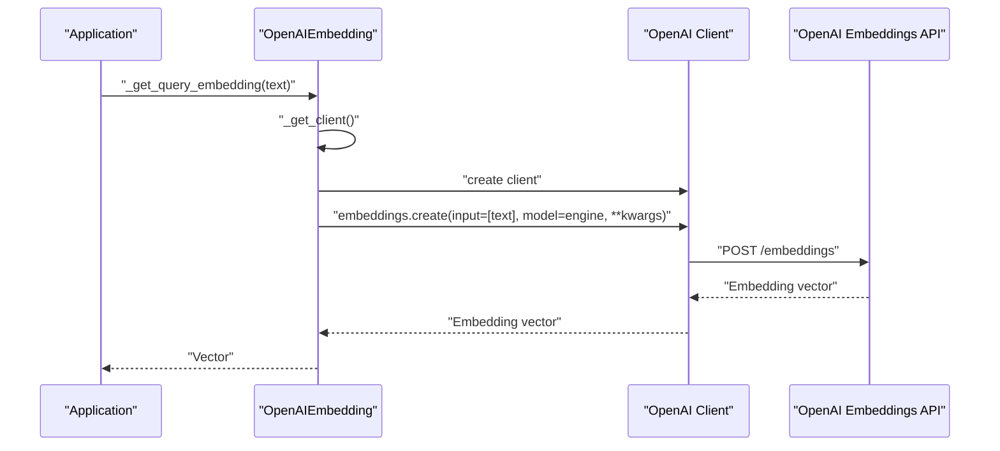
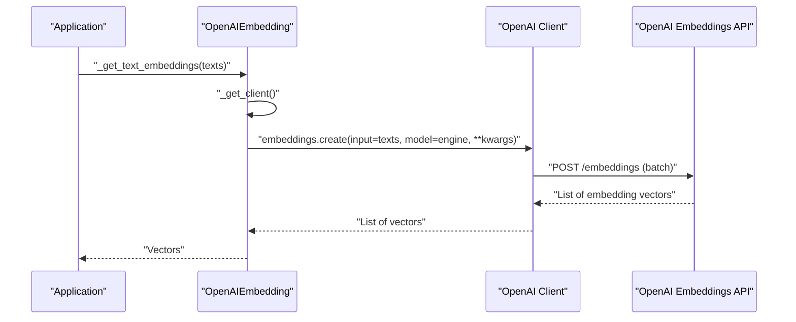
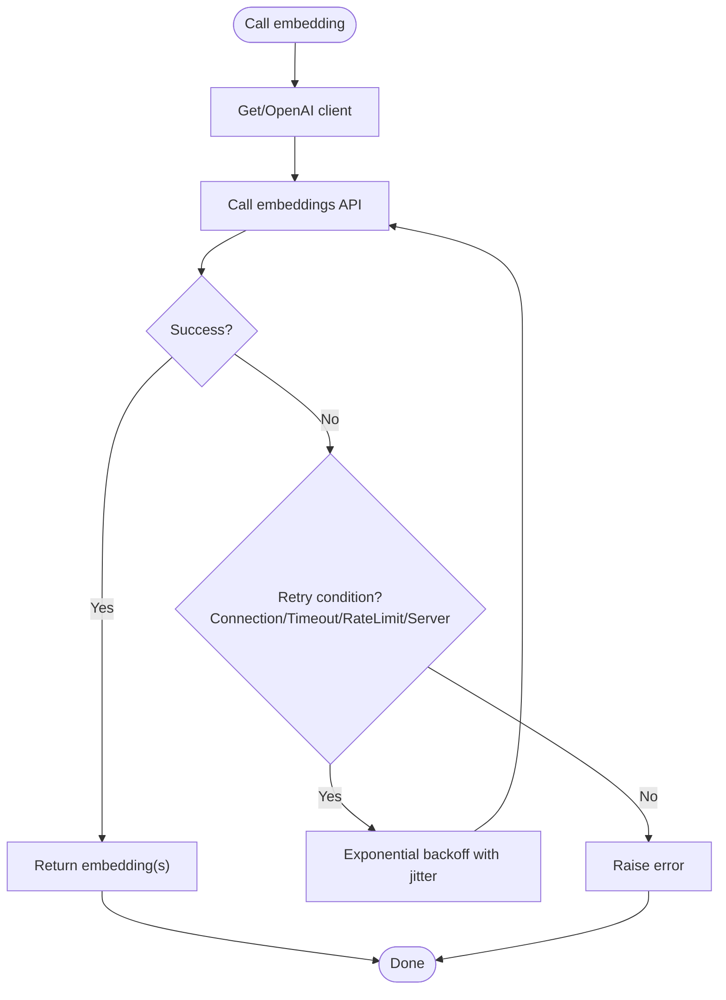
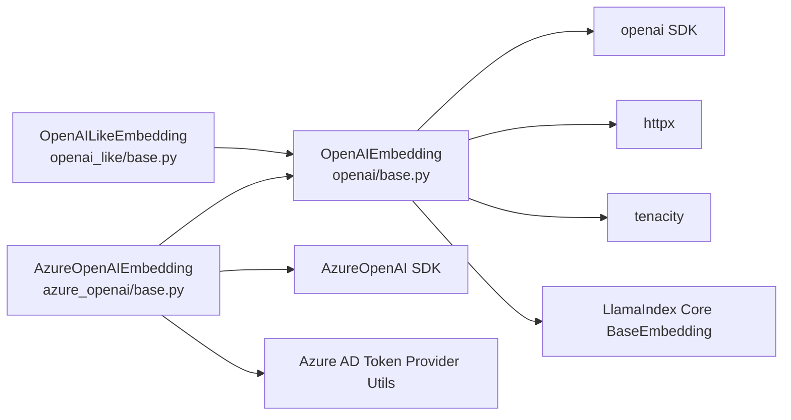

# OpenAI Embeddings

<cite>
**Referenced Files in This Document**
- [base.py](file://llama-index-integrations/embeddings/llama-index-embeddings-openai/llama_index/embeddings/openai/base.py)
- [utils.py](file://llama-index-integrations/embeddings/llama-index-embeddings-openai/llama_index/embeddings/openai/utils.py)
- [__init__.py](file://llama-index-integrations/embeddings/llama-index-embeddings-openai/llama_index/embeddings/openai/__init__.py)
- [base.py](file://llama-index-integrations/embeddings/llama-index-embeddings-azure-openai/llama_index/embeddings/azure_openai/base.py)
- [__init__.py](file://llama-index-integrations/embeddings/llama-index-embeddings-azure-openai/llama_index/embeddings/azure_openai/__init__.py)
- [base.py](file://llama-index-integrations/embeddings/llama-index-embeddings-openai-like/llama_index/embeddings/openai_like/base.py)
- [__init__.py](file://llama-index-integrations/embeddings/llama-index-embeddings-openai-like/llama_index/embeddings/openai_like/__init__.py)
</cite>

## Table of Contents
1. [Introduction](#introduction)
2. [Project Structure](#project-structure)
3. [Core Components](#core-components)
4. [Architecture Overview](#architecture-overview)
5. [Detailed Component Analysis](#detailed-component-analysis)
6. [Dependency Analysis](#dependency-analysis)
7. [Performance Considerations](#performance-considerations)
8. [Troubleshooting Guide](#troubleshooting-guide)
9. [Conclusion](#conclusion)

## Introduction
This document provides comprehensive API documentation for OpenAI embedding integrations in the LlamaIndex ecosystem. It covers:
- OpenAI embeddings
- Azure OpenAI embeddings
- OpenAI-compatible provider embeddings

It focuses on the OpenAIEmbedding class, configuration parameters, API key management, rate limiting, supported models, dimension handling, and batch processing. It also includes examples of initialization, embedding generation, error handling, and cost optimization strategies, along with authentication methods, proxy configurations, and fallback mechanisms for production deployments.

## Project Structure
The OpenAI embedding implementations are organized across three packages:
- OpenAI embeddings: llama-index-embeddings-openai
- Azure OpenAI embeddings: llama-index-embeddings-azure-openai
- OpenAI-compatible embeddings: llama-index-embeddings-openai-like

**Diagram sources**
- [base.py](file://llama-index-integrations/embeddings/llama-index-embeddings-openai/llama_index/embeddings/openai/base.py#L214-L489)
- [base.py](file://llama-index-integrations/embeddings/llama-index-embeddings-azure-openai/llama_index/embeddings/azure_openai/base.py#L34-L195)
- [base.py](file://llama-index-integrations/embeddings/llama-index-embeddings-openai-like/llama_index/embeddings/openai_like/base.py#L10-L99)
- [utils.py](file://llama-index-integrations/embeddings/llama-index-embeddings-openai/llama_index/embeddings/openai/utils.py#L1-L105)

**Section sources**
- [__init__.py](file://llama-index-integrations/embeddings/llama-index-embeddings-openai/llama_index/embeddings/openai/__init__.py#L1-L14)
- [__init__.py](file://llama-index-integrations/embeddings/llama-index-embeddings-azure-openai/llama_index/embeddings/azure_openai/__init__.py#L1-L8)
- [__init__.py](file://llama-index-integrations/embeddings/llama-index-embeddings-openai-like/llama_index/embeddings/openai_like/__init__.py#L1-L8)

## Core Components
- OpenAIEmbedding: The primary class for OpenAI embeddings, supporting synchronous and asynchronous embedding generation, batch processing, retry logic, and optional dimensionality control for v3 models.
- AzureOpenAIEmbedding: Extends OpenAIEmbedding with Azure-specific parameters (endpoint, deployment, Azure AD token provider) and credential resolution tailored for Azure OpenAI.
- OpenAILikeEmbedding: A generic OpenAI-compatible provider that allows custom api_base and model_name for non-OpenAI endpoints.

Key capabilities:
- Supported models: text-embedding-ada-002, text-embedding-3-small, text-embedding-3-large
- Dimension handling: optional dimensions parameter for v3 models
- Batch processing: batch size limit enforced at 2048 per request
- Rate limiting and retries: configurable retry decorator covering connection errors, timeouts, rate limits, and server errors
- Authentication: API key resolution via parameters, environment variables, or global OpenAI module; Azure AD token support for Azure OpenAI
- Proxy and HTTP client customization: optional httpx clients for advanced networking

**Section sources**
- [base.py](file://llama-index-integrations/embeddings/llama-index-embeddings-openai/llama_index/embeddings/openai/base.py#L20-L76)
- [base.py](file://llama-index-integrations/embeddings/llama-index-embeddings-openai/llama_index/embeddings/openai/base.py#L214-L489)
- [base.py](file://llama-index-integrations/embeddings/llama-index-embeddings-azure-openai/llama_index/embeddings/azure_openai/base.py#L34-L195)
- [base.py](file://llama-index-integrations/embeddings/llama-index-embeddings-openai-like/llama_index/embeddings/openai_like/base.py#L10-L99)

## Architecture Overview
The embedding classes share a common base (OpenAIEmbedding) and extend it for provider-specific needs. The Azure variant adds Azure-specific credential resolution and client instantiation. The OpenAI-compatible variant reuses the base for non-OpenAI endpoints.

**Diagram sources**
- [base.py](file://llama-index-integrations/embeddings/llama-index-embeddings-openai/llama_index/embeddings/openai/base.py#L214-L489)
- [base.py](file://llama-index-integrations/embeddings/llama-index-embeddings-azure-openai/llama_index/embeddings/azure_openai/base.py#L34-L195)
- [base.py](file://llama-index-integrations/embeddings/llama-index-embeddings-openai-like/llama_index/embeddings/openai_like/base.py#L10-L99)

## Detailed Component Analysis

### OpenAIEmbedding
- Purpose: Provides OpenAI embeddings with support for query and document text embeddings, batch processing, and robust retry logic.
- Supported models:
  - text-embedding-ada-002
  - text-embedding-3-small
  - text-embedding-3-large
- Modes:
  - similarity
  - text_search
- Dimension handling: Optional dimensions parameter for v3 models; passed via additional_kwargs.
- Batch processing: Enforces a maximum batch size of 2048 per request.
- Retry logic: Configurable exponential backoff with jitter and stop conditions for connection errors, timeouts, rate limits, and server errors.
- Clients: Synchronous and asynchronous OpenAI clients; optional reuse for performance or stability.

Initialization parameters (selected):
- mode: similarity or text_search
- model: one of the supported models
- embed_batch_size: default batch size for embedding calls
- dimensions: optional output dimension for v3 models
- additional_kwargs: additional arguments forwarded to the embeddings API
- api_key: OpenAI API key
- api_base: base URL for the OpenAI API
- api_version: API version
- max_retries: maximum retry attempts
- timeout: per-request timeout
- reuse_client: whether to reuse the underlying client
- default_headers: default HTTP headers
- http_client, async_http_client: optional custom httpx clients
- num_workers: optional worker count for parallelism

Usage patterns:
- Single embedding: _get_query_embedding or _get_text_embedding
- Batch embedding: _get_text_embeddings
- Asynchronous variants: _aget_* methods

Error handling:
- Validation of mode/model combinations
- Assertion on batch size
- Retry decorator wraps embedding calls

Cost optimization:
- Use smaller embed_batch_size for memory-bound environments
- Prefer reuse_client for reduced connection overhead
- Limit dimensions to required precision for v3 models

**Section sources**
- [base.py](file://llama-index-integrations/embeddings/llama-index-embeddings-openai/llama_index/embeddings/openai/base.py#L20-L76)
- [base.py](file://llama-index-integrations/embeddings/llama-index-embeddings-openai/llama_index/embeddings/openai/base.py#L214-L489)
- [utils.py](file://llama-index-integrations/embeddings/llama-index-embeddings-openai/llama_index/embeddings/openai/utils.py#L36-L105)

### AzureOpenAIEmbedding
- Purpose: Adds Azure-specific configuration and authentication to OpenAI embeddings.
- Azure parameters:
  - azure_endpoint: Azure OpenAI resource endpoint
  - azure_deployment: Deployment name for the model
  - use_azure_ad: toggle for Azure AD authentication
  - azure_ad_token_provider: callback to provide Azure AD tokens
- Credential resolution:
  - Supports API key or Azure AD token
  - Validates presence of api_version and proper endpoint configuration
- Client instantiation:
  - Uses AzureOpenAI and AsyncAzureOpenAI clients
  - Resolves credentials via _get_credential_kwargs

Initialization parameters (selected):
- Inherits all OpenAIEmbedding parameters
- azure_endpoint, azure_deployment, use_azure_ad, azure_ad_token_provider

Production tips:
- Use Azure AD tokens for secure, rotating authentication
- Set api_version explicitly
- Configure http_client/async_http_client for proxy or custom TLS settings

**Section sources**
- [base.py](file://llama-index-integrations/embeddings/llama-index-embeddings-azure-openai/llama_index/embeddings/azure_openai/base.py#L34-L195)

### OpenAILikeEmbedding
- Purpose: Enables OpenAI-compatible providers by allowing custom api_base and model_name.
- Initialization parameters:
  - model_name: the model identifier used by the provider
  - api_key, api_base, api_version: provider-specific credentials and endpoints
  - Other parameters inherited from OpenAIEmbedding

Use cases:
- Self-hosted OpenAI-compatible servers
- Third-party providers exposing OpenAI-compatible APIs

**Section sources**
- [base.py](file://llama-index-integrations/embeddings/llama-index-embeddings-openai-like/llama_index/embeddings/openai_like/base.py#L10-L99)

### Sequence: Embedding Generation (OpenAI)

**Diagram sources**
- [base.py](file://llama-index-integrations/embeddings/llama-index-embeddings-openai/llama_index/embeddings/openai/base.py#L388-L402)
- [base.py](file://llama-index-integrations/embeddings/llama-index-embeddings-openai/llama_index/embeddings/openai/base.py#L115-L131)

### Sequence: Batch Embedding (OpenAI)

**Diagram sources**
- [base.py](file://llama-index-integrations/embeddings/llama-index-embeddings-openai/llama_index/embeddings/openai/base.py#L452-L472)
- [base.py](file://llama-index-integrations/embeddings/llama-index-embeddings-openai/llama_index/embeddings/openai/base.py#L155-L174)

### Flowchart: Retry Decorator (OpenAI)

**Diagram sources**
- [utils.py](file://llama-index-integrations/embeddings/llama-index-embeddings-openai/llama_index/embeddings/openai/utils.py#L36-L68)
- [base.py](file://llama-index-integrations/embeddings/llama-index-embeddings-openai/llama_index/embeddings/openai/base.py#L364-L372)

## Dependency Analysis
- OpenAIEmbedding depends on:
  - OpenAI SDK (synchronous and asynchronous clients)
  - httpx for optional custom HTTP clients
  - tenacity for retry logic
  - LlamaIndex core embedding base class
- AzureOpenAIEmbedding extends OpenAIEmbedding and adds:
  - AzureOpenAI and AsyncAzureOpenAI clients
  - Azure AD token provider utilities
  - Environment and parameter resolution helpers
- OpenAILikeEmbedding extends OpenAIEmbedding and relies on:
  - Custom api_base and model_name

**Diagram sources**
- [base.py](file://llama-index-integrations/embeddings/llama-index-embeddings-openai/llama_index/embeddings/openai/base.py#L17-L18)
- [base.py](file://llama-index-integrations/embeddings/llama-index-embeddings-azure-openai/llama_index/embeddings/azure_openai/base.py#L23-L24)
- [base.py](file://llama-index-integrations/embeddings/llama-index-embeddings-openai-like/llama_index/embeddings/openai_like/base.py#L7)

**Section sources**
- [base.py](file://llama-index-integrations/embeddings/llama-index-embeddings-openai/llama_index/embeddings/openai/base.py#L1-L20)
- [base.py](file://llama-index-integrations/embeddings/llama-index-embeddings-azure-openai/llama_index/embeddings/azure_openai/base.py#L1-L25)
- [base.py](file://llama-index-integrations/embeddings/llama-index-embeddings-openai-like/llama_index/embeddings/openai_like/base.py#L1-L8)

## Performance Considerations
- Client reuse: Enable reuse_client to reduce connection overhead; disable for high-volume async workloads to improve stability.
- Batch size: Keep embed_batch_size under the enforced limit (2048) to avoid assertion failures.
- Dimensions: For v3 models, specify only the required dimensions to reduce payload size.
- Retries: Tune max_retries and timeout to balance reliability and latency.
- Concurrency: Use asynchronous methods (_aget_*) for concurrent embedding generation.
- Proxies/TLS: Provide custom http_client/async_http_client for corporate proxies or specialized TLS requirements.

[No sources needed since this section provides general guidance]

## Troubleshooting Guide
Common issues and resolutions:
- Missing API key:
  - Ensure OPENAI_API_KEY is set or pass api_key explicitly.
  - For Azure OpenAI, ensure AZURE_OPENAI_API_KEY or Azure AD token is configured.
- Invalid mode/model combination:
  - Verify mode is similarity or text_search and model is one of the supported models.
- Batch size exceeded:
  - Reduce embed_batch_size to ≤ 2048.
- Rate limits:
  - Increase max_retries and timeout; consider backoff tuning.
- Azure configuration:
  - Set azure_endpoint and api_version; ensure use_azure_ad is correct and token provider is supplied when needed.

**Section sources**
- [utils.py](file://llama-index-integrations/embeddings/llama-index-embeddings-openai/llama_index/embeddings/openai/utils.py#L71-L105)
- [base.py](file://llama-index-integrations/embeddings/llama-index-embeddings-azure-openai/llama_index/embeddings/azure_openai/base.py#L133-L148)
- [base.py](file://llama-index-integrations/embeddings/llama-index-embeddings-openai/llama_index/embeddings/openai/base.py#L168-L169)

## Conclusion
The OpenAI embedding integrations provide a robust, extensible foundation for generating embeddings across OpenAI, Azure OpenAI, and OpenAI-compatible providers. By leveraging the OpenAIEmbedding base class and its extensions, developers can configure authentication, customize dimensions, manage batch sizes, and apply resilient retry logic. Production deployments benefit from client reuse, careful batching, and secure authentication (including Azure AD), while still maintaining compatibility with diverse provider ecosystems.