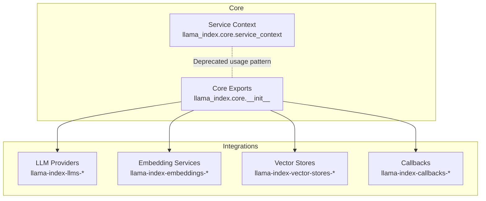
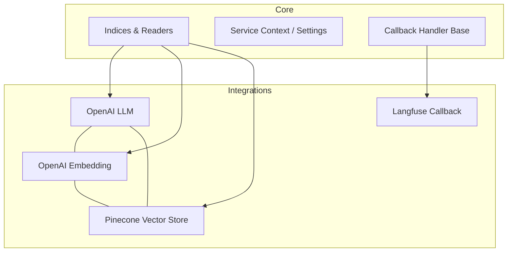
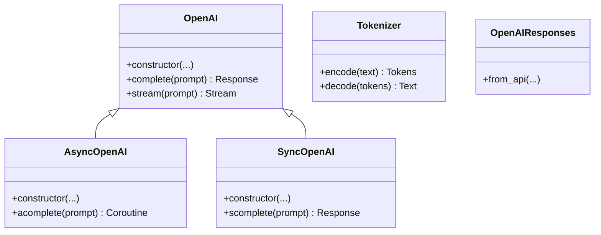
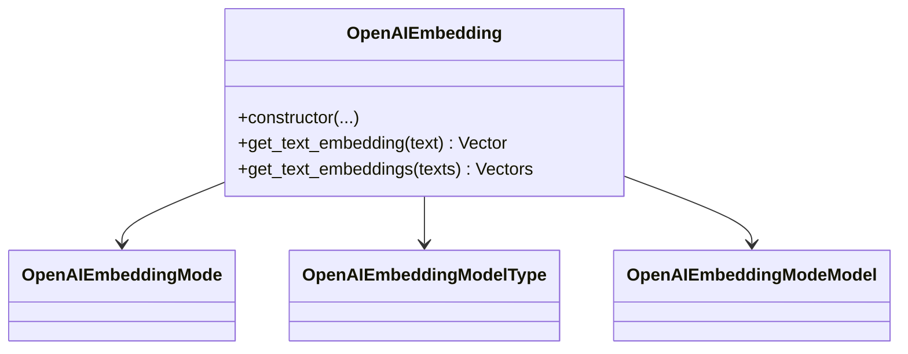
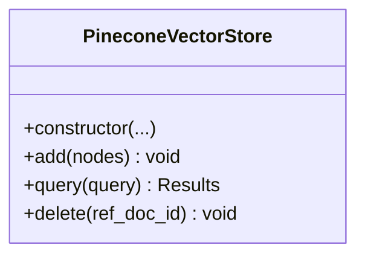
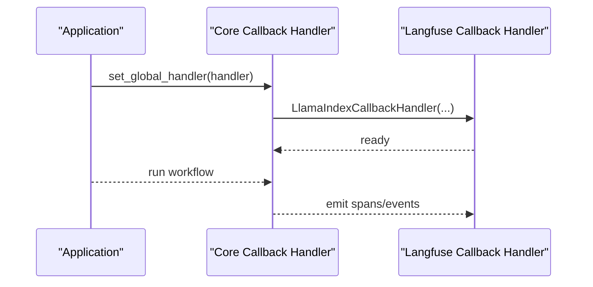
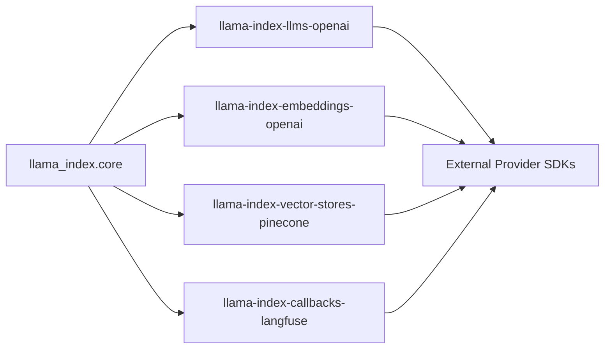

# Integration APIs

<cite>
**Referenced Files in This Document**
- [README.md](file://llama-index-integrations/README.md)
- [__init__.py](file://llama_index_core/llama_index/core/__init__.py)
- [service_context.py](file://llama_index_core/llama_index/core/service_context.py)
- [__init__.py](file://llama_index_integrations/llms/llama-index-llms-openai/llama_index/llms/openai/__init__.py)
- [__init__.py](file://llama_index_integrations/embeddings/llama-index-embeddings-openai/llama_index/embeddings/openai/__init__.py)
- [__init__.py](file://llama_index_integrations/vector_stores/llama-index-vector-stores-pinecone/llama_index/vector_stores/pinecone/__init__.py)
- [base.py](file://llama_index_integrations/callbacks/llama-index-callbacks-langfuse/llama_index/callbacks/langfuse/base.py)
</cite>

## Table of Contents
1. [Introduction](#introduction)
2. [Project Structure](#project-structure)
3. [Core Components](#core-components)
4. [Architecture Overview](#architecture-overview)
5. [Detailed Component Analysis](#detailed-component-analysis)
6. [Dependency Analysis](#dependency-analysis)
7. [Performance Considerations](#performance-considerations)
8. [Troubleshooting Guide](#troubleshooting-guide)
9. [Conclusion](#conclusion)
10. [Appendices](#appendices)

## Introduction
This document describes the Integration layer APIs that enable third-party services for LLM providers, embedding services, vector stores, and callback systems. It explains how to configure and load integrations, how the plugin architecture works across providers, and how to implement custom integrations. It also covers authentication, rate limiting, error handling, and performance monitoring for integrated services.

## Project Structure
The Integration layer is organized as separate Python packages grouped by domain:
- LLM providers: llama-index-llms-*
- Embedding services: llama-index-embeddings-*
- Vector stores: llama-index-vector-stores-*
- Callback systems: llama-index-callbacks-*
- Other integrations: readers, retrievers, indices, etc.

Key top-level entry points:
- Integrations overview and categorization
- Core module exports for indices, readers, service context, and settings
- Domain-specific integration packages expose public APIs via their package __init__.py

**Diagram sources**
- [README.md](file://llama-index-integrations/README.md#L1-L5)
- [__init__.py](file://llama_index_core/llama_index/core/__init__.py#L1-L162)
- [service_context.py](file://llama_index_core/llama_index/core/service_context.py#L1-L49)

**Section sources**
- [README.md](file://llama-index-integrations/README.md#L1-L5)
- [__init__.py](file://llama_index_core/llama_index/core/__init__.py#L1-L162)
- [service_context.py](file://llama_index_core/llama_index/core/service_context.py#L1-L49)

## Core Components
- LLM Provider APIs: Each provider package exposes a public class (e.g., OpenAI) and related types. These are imported and re-exported from the package’s __init__.py.
- Embedding Service APIs: Each embedding provider package exposes an embedding model class (e.g., OpenAIEmbedding) and related enums/types.
- Vector Store APIs: Each vector store package exposes a vector store class (e.g., PineconeVectorStore).
- Callback System APIs: Each callback package exposes a factory or handler creation function returning a BaseCallbackHandler compatible with the core callback system.

Examples of public API exposure:
- LLMs: OpenAI, AsyncOpenAI, SyncOpenAI, Tokenizer, OpenAIResponses
- Embeddings: OpenAIEmbedding, OpenAIEmbeddingMode, OpenAIEmbeddingModelType, OpenAIEmbeddingModeModel
- Vector Stores: PineconeVectorStore
- Callbacks: langfuse_callback_handler returning a LlamaIndexCallbackHandler

These APIs are intended to be imported directly from the integration packages’ __init__.py files.

**Section sources**
- [__init__.py](file://llama_index_integrations/llms/llama-index-llms-openai/llama_index/llms/openai/__init__.py#L1-L5)
- [__init__.py](file://llama_index_integrations/embeddings/llama-index-embeddings-openai/llama_index/embeddings/openai/__init__.py#L1-L14)
- [__init__.py](file://llama_index_integrations/vector_stores/llama-index-vector-stores-pinecone/llama_index/vector_stores/pinecone/__init__.py#L1-L4)
- [base.py](file://llama_index_integrations/callbacks/llama-index-callbacks-langfuse/llama_index/callbacks/langfuse/base.py#L1-L12)

## Architecture Overview
The Integration layer follows a plugin-style architecture:
- Each integration is a self-contained package that exposes a small, focused API surface.
- Core LlamaIndex provides generic abstractions (indices, readers, service context, callbacks).
- Integrations plug into these abstractions by implementing the expected interfaces and exposing them via their package __init__.py.

**Diagram sources**
- [__init__.py](file://llama_index_core/llama_index/core/__init__.py#L1-L162)
- [__init__.py](file://llama_index_integrations/llms/llama-index-llms-openai/llama_index/llms/openai/__init__.py#L1-L5)
- [__init__.py](file://llama_index_integrations/embeddings/llama-index-embeddings-openai/llama_index/embeddings/openai/__init__.py#L1-L14)
- [__init__.py](file://llama_index_integrations/vector_stores/llama-index-vector-stores-pinecone/llama_index/vector_stores/pinecone/__init__.py#L1-L4)
- [base.py](file://llama_index_integrations/callbacks/llama-index-callbacks-langfuse/llama_index/callbacks/langfuse/base.py#L1-L12)

## Detailed Component Analysis

### LLM Provider APIs
- Purpose: Provide LLM clients and response types for various providers.
- Example: OpenAI LLM exposes synchronous and asynchronous client classes and a tokenizer.
- Loading and configuration: Import the provider class from the integration package’s __init__.py and pass credentials via constructor parameters or environment variables supported by the underlying SDK.

**Diagram sources**
- [__init__.py](file://llama_index_integrations/llms/llama-index-llms-openai/llama_index/llms/openai/__init__.py#L1-L5)

**Section sources**
- [__init__.py](file://llama_index_integrations/llms/llama-index-llms-openai/llama_index/llms/openai/__init__.py#L1-L5)

### Embedding Service APIs
- Purpose: Provide embedding model clients for generating and managing vector embeddings.
- Example: OpenAI embeddings expose model selection and mode configuration via enums and a dedicated embedding class.
- Loading and configuration: Import the embedding class from the integration package’s __init__.py and supply credentials and model parameters.

**Diagram sources**
- [__init__.py](file://llama_index_integrations/embeddings/llama-index-embeddings-openai/llama_index/embeddings/openai/__init__.py#L1-L14)

**Section sources**
- [__init__.py](file://llama_index_integrations/embeddings/llama-index-embeddings-openai/llama_index/embeddings/openai/__init__.py#L1-L14)

### Vector Store APIs
- Purpose: Provide persistent storage and retrieval of embeddings with query capabilities.
- Example: Pinecone vector store exposes a class for upsert, query, and delete operations.
- Loading and configuration: Import the vector store class from the integration package’s __init__.py and initialize with connection parameters.

**Diagram sources**
- [__init__.py](file://llama_index_integrations/vector_stores/llama-index-vector-stores-pinecone/llama_index/vector_stores/pinecone/__init__.py#L1-L4)

**Section sources**
- [__init__.py](file://llama_index_integrations/vector_stores/llama-index-vector-stores-pinecone/llama_index/vector_stores/pinecone/__init__.py#L1-L4)

### Callback System APIs
- Purpose: Integrate observability and evaluation platforms into the LlamaIndex callback pipeline.
- Example: Langfuse callback handler factory returns a LlamaIndexCallbackHandler compatible with the core callback system.
- Loading and configuration: Import the callback handler factory from the integration package and attach it globally or per operation.

**Diagram sources**
- [base.py](file://llama_index_integrations/callbacks/llama-index-callbacks-langfuse/llama_index/callbacks/langfuse/base.py#L1-L12)

**Section sources**
- [base.py](file://llama_index_integrations/callbacks/llama-index-callbacks-langfuse/llama_index/callbacks/langfuse/base.py#L1-L12)

### Plugin Architecture and Third-Party Integration
- Pattern: Each integration package defines a small, stable API surface and re-exports it from its __init__.py. This enables:
  - Easy discovery of provider classes and types
  - Consistent initialization via constructor parameters
  - Environment-based credential configuration supported by underlying SDKs
- Extending with custom integrations:
  - Implement a class that adheres to the expected interface (e.g., LLM, Embedding, Vector Store, or Callback Handler).
  - Expose the class via your package’s __init__.py.
  - Document configuration parameters and environment variables.
  - Provide examples and tests for common scenarios.

[No sources needed since this section provides general guidance]

## Dependency Analysis
- Core depends on integrations for concrete implementations.
- Integrations depend on external provider SDKs (e.g., OpenAI, Pinecone).
- Callback integrations depend on their respective vendor SDKs and the core callback handler base.

**Diagram sources**
- [__init__.py](file://llama_index_core/llama_index/core/__init__.py#L1-L162)
- [__init__.py](file://llama_index_integrations/llms/llama-index-llms-openai/llama_index/llms/openai/__init__.py#L1-L5)
- [__init__.py](file://llama_index_integrations/embeddings/llama-index-embeddings-openai/llama_index/embeddings/openai/__init__.py#L1-L14)
- [__init__.py](file://llama_index_integrations/vector_stores/llama-index-vector-stores-pinecone/llama_index/vector_stores/pinecone/__init__.py#L1-L4)
- [base.py](file://llama_index_integrations/callbacks/llama-index-callbacks-langfuse/llama_index/callbacks/langfuse/base.py#L1-L12)

**Section sources**
- [__init__.py](file://llama_index_core/llama_index/core/__init__.py#L1-L162)
- [__init__.py](file://llama_index_integrations/llms/llama-index-llms-openai/llama_index/llms/openai/__init__.py#L1-L5)
- [__init__.py](file://llama_index_integrations/embeddings/llama-index-embeddings-openai/llama_index/embeddings/openai/__init__.py#L1-L14)
- [__init__.py](file://llama_index_integrations/vector_stores/llama-index-vector-stores-pinecone/llama_index/vector_stores/pinecone/__init__.py#L1-L4)
- [base.py](file://llama_index_integrations/callbacks/llama-index-callbacks-langfuse/llama_index/callbacks/langfuse/base.py#L1-L12)

## Performance Considerations
- Batch operations: Prefer batch embedding and upsert operations where supported by the provider to reduce overhead.
- Caching: Use caching layers for repeated queries and embeddings when appropriate.
- Connection pooling: Reuse connections and clients across requests to minimize handshake costs.
- Asynchronous execution: Use async LLM clients for concurrent workloads.
- Monitoring: Attach callback handlers to capture latency, throughput, and error metrics.

[No sources needed since this section provides general guidance]

## Troubleshooting Guide
- Authentication failures:
  - Verify credentials are configured via environment variables or constructor parameters expected by the integration.
  - Confirm endpoint URLs and API keys match the provider’s requirements.
- Rate limiting:
  - Implement retry with exponential backoff and jitter.
  - Monitor provider-side rate limits and adjust concurrency.
- Error handling:
  - Wrap provider calls with try/except blocks and log meaningful errors.
  - Use callback handlers to capture and report detailed traces.
- Service availability:
  - Validate network connectivity and firewall rules.
  - Test endpoints independently using provider SDKs.

[No sources needed since this section provides general guidance]

## Conclusion
The Integration layer offers a consistent, modular approach to connecting LlamaIndex with external services. By following the established patterns—clear API surfaces, environment-based configuration, and callback-driven observability—you can integrate new providers and services efficiently while maintaining reliability and performance.

[No sources needed since this section summarizes without analyzing specific files]

## Appendices

### A. Loading and Configuration APIs
- LLMs: Import the provider class from the integration package’s __init__.py and initialize with credentials and model parameters.
- Embeddings: Import the embedding class from the integration package’s __init__.py and configure model and deployment settings.
- Vector Stores: Import the vector store class from the integration package’s __init__.py and initialize with connection parameters.
- Callbacks: Import the callback handler factory from the integration package and attach it to the global handler.

**Section sources**
- [__init__.py](file://llama_index_integrations/llms/llama-index-llms-openai/llama_index/llms/openai/__init__.py#L1-L5)
- [__init__.py](file://llama_index_integrations/embeddings/llama-index-embeddings-openai/llama_index/embeddings/openai/__init__.py#L1-L14)
- [__init__.py](file://llama_index_integrations/vector_stores/llama-index-vector-stores-pinecone/llama_index/vector_stores/pinecone/__init__.py#L1-L4)
- [base.py](file://llama_index_integrations/callbacks/llama-index-callbacks-langfuse/llama_index/callbacks/langfuse/base.py#L1-L12)

### B. Authentication Mechanisms
- Environment variables: Many integrations support standard environment variables for credentials.
- Constructor parameters: Pass credentials and endpoints directly during initialization.
- Provider SDK defaults: Integrations often delegate to provider SDKs that support standardized auth flows.

**Section sources**
- [__init__.py](file://llama_index_integrations/llms/llama-index-llms-openai/llama_index/llms/openai/__init__.py#L1-L5)
- [__init__.py](file://llama_index_integrations/embeddings/llama-index-embeddings-openai/llama_index/embeddings/openai/__init__.py#L1-L14)
- [__init__.py](file://llama_index_integrations/vector_stores/llama-index-vector-stores-pinecone/llama_index/vector_stores/pinecone/__init__.py#L1-L4)
- [base.py](file://llama_index_integrations/callbacks/llama-index-callbacks-langfuse/llama_index/callbacks/langfuse/base.py#L1-L12)

### C. Rate Limiting and Error Handling
- Implement retries with exponential backoff for transient errors.
- Respect provider rate limits and implement client-side throttling.
- Use callback handlers to capture and analyze errors and latency.

**Section sources**
- [base.py](file://llama_index_integrations/callbacks/llama-index-callbacks-langfuse/llama_index/callbacks/langfuse/base.py#L1-L12)

### D. Monitoring APIs
- Attach callback handlers to record spans and events.
- Export metrics to external observability platforms via the callback integrations.

**Section sources**
- [base.py](file://llama_index_integrations/callbacks/llama-index-callbacks-langfuse/llama_index/callbacks/langfuse/base.py#L1-L12)