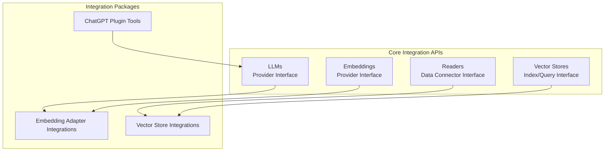
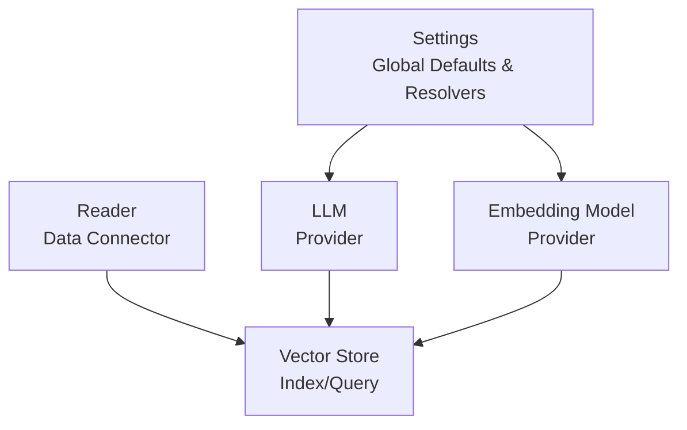
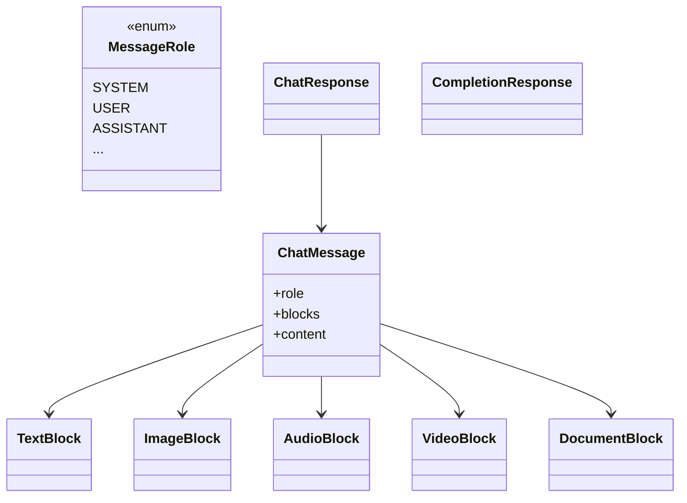
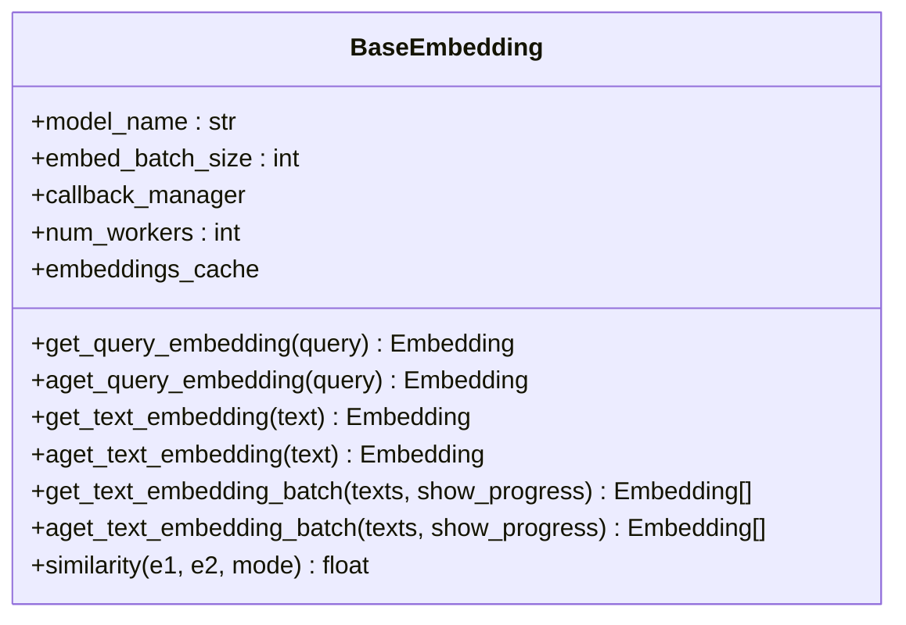
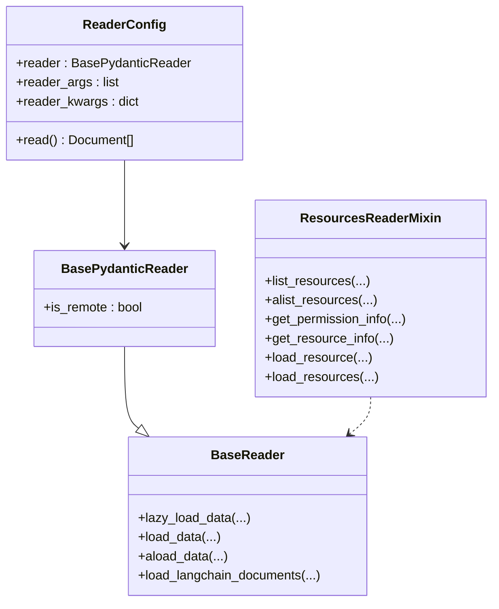
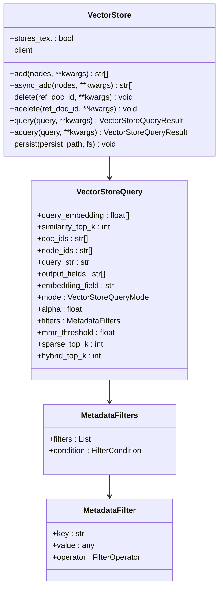
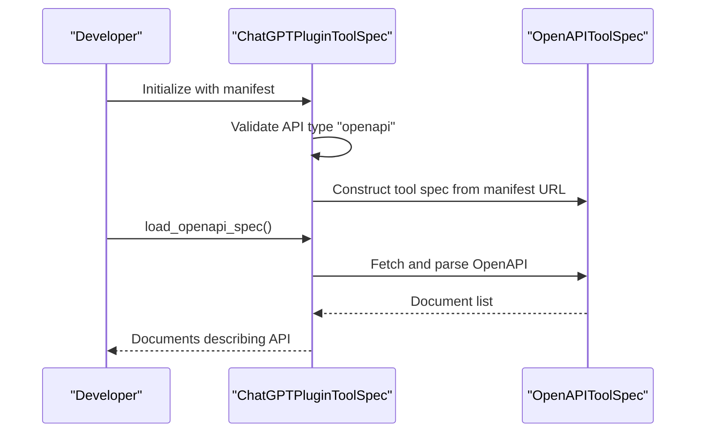
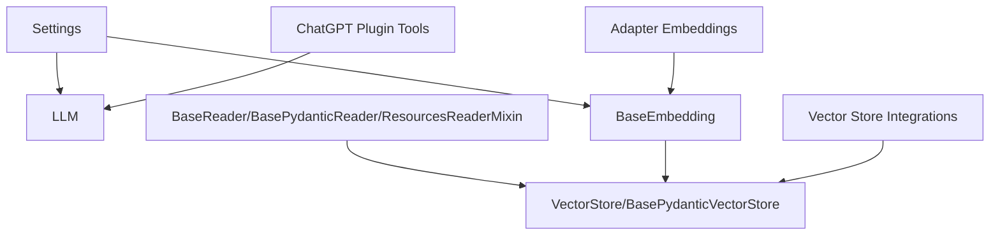
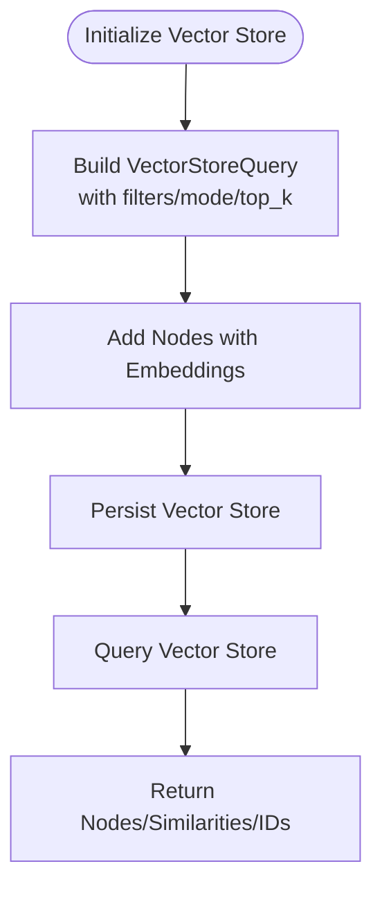

# Integration APIs

<cite>
**Referenced Files in This Document**
- [llama_index\core\__init__.py](file://llama-index-core/llama_index/core/__init__.py)
- [llama_index\core\settings.py](file://llama-index-core/llama_index/core/settings.py)
- [llama_index\core\llms\__init__.py](file://llama-index-core/llama_index/core/llms/__init__.py)
- [llama_index\core\base\llms\types.py](file://llama-index-core/llama_index/core/base/llms/types.py)
- [llama_index\core\embeddings\__init__.py](file://llama-index-core/llama_index/core/embeddings/__init__.py)
- [llama_index\core\base\embeddings\base.py](file://llama-index-core/llama_index/core/base/embeddings/base.py)
- [llama_index\core\readers\__init__.py](file://llama-index-core/llama_index/core/readers/__init__.py)
- [llama_index\core\readers\base.py](file://llama-index-core/llama_index/core/readers/base.py)
- [llama_index\core\vector_stores\__init__.py](file://llama-index-core/llama_index/core/vector_stores/__init__.py)
- [llama_index\core\vector_stores\types.py](file://llama-index-core/llama_index/core/vector_stores/types.py)
- [llama_index-integrations\embeddings\llama-index-embeddings-adapter\llama_index\embeddings\adapter\__init__.py](file://llama-index-integrations/embeddings/llama-index-embeddings-adapter/llama_index/embeddings/adapter/__init__.py)
- [llama-index-integrations\tools\llama-index-tools-chatgpt-plugin\llama_index\tools\chatgpt_plugin\base.py](file://llama-index-integrations/tools/llama-index-tools-chatgpt-plugin/llama_index/tools/chatgpt_plugin/base.py)
- [llama-index-integrations\tools\llama-index-tools-chatgpt-plugin\tests\test_tools_chatgpt_plugin.py](file://llama-index-integrations/tools/llama-index-tools-chatgpt-plugin/tests/test_tools_chatgpt_plugin.py)
- [llama-index-integrations\vector_stores\llama-index-vector-stores-awsdocdb\README.md](file://llama-index-integrations/vector_stores/llama-index-vector-stores-awsdocdb/README.md)
- [docs\src\content\docs\framework\community\integrations\vector_stores.md](file://docs/src/content/docs/framework/community/integrations/vector_stores.md)
- [llama-index-core\llama_index\core\ingestion\data_sinks.py](file://llama-index-core/llama_index/core/ingestion/data_sinks.py)
- [llama-index-cli\llama_index\cli\new_package\base.py](file://llama-index-cli/llama_index/cli/new_package/base.py)
</cite>

## Table of Contents
1. [Introduction](#introduction)
2. [Project Structure](#project-structure)
3. [Core Components](#core-components)
4. [Architecture Overview](#architecture-overview)
5. [Detailed Component Analysis](#detailed-component-analysis)
6. [Dependency Analysis](#dependency-analysis)
7. [Performance Considerations](#performance-considerations)
8. [Troubleshooting Guide](#troubleshooting-guide)
9. [Conclusion](#conclusion)
10. [Appendices](#appendices)

## Introduction
This document describes the Integration APIs for LlamaIndex across LLM providers, embedding models, data connectors, and vector stores. It covers provider interfaces, adapter patterns, and plugin development frameworks. It provides complete API specifications for integration points, authentication methods, configuration options, and practical guidance for building custom integrations, extending existing providers, and developing new connector types. It also addresses migration patterns, compatibility requirements, error handling, rate limiting, and performance optimization.

## Project Structure
LlamaIndex organizes integration APIs around four primary domains:
- LLM providers: standardized interfaces for text and multimodal generation
- Embedding models: standardized interfaces for embedding generation and similarity
- Data connectors: standardized interfaces for loading documents from diverse sources
- Vector stores: standardized interfaces for storing and querying embeddings

```mermaid
graph TB
subgraph "Core Integration APIs"
LLMs["LLMs<br/>Provider Interface"]
Embeds["Embeddings<br/>Provider Interface"]
Readers["Readers<br/>Data Connector Interface"]
VStore["Vector Stores<br/>Index/Query Interface"]
end
subgraph "Integration Packages"
Adapters["Embedding Adapter Integrations"]
Plugins["ChatGPT Plugin Tools"]
VSProviders["Vector Store Integrations"]
end
LLMs --> Adapters
Embeds --> Adapters
Readers --> VSProviders
VStore --> VSProviders
Plugins --> LLMs
```

**Diagram sources**
- [llama_index\core\llms\__init__.py](file://llama-index-core/llama_index/core/llms/__init__.py#L1-L49)
- [llama_index\core\embeddings\__init__.py](file://llama-index-core/llama_index/core/embeddings/__init__.py#L1-L16)
- [llama_index\core\readers\__init__.py](file://llama-index-core/llama_index/core/readers/__init__.py#L1-L33)
- [llama_index\core\vector_stores\__init__.py](file://llama-index-core/llama_index/core/vector_stores/__init__.py#L1-L28)

**Section sources**
- [llama_index\core\__init__.py](file://llama-index-core/llama_index/core/__init__.py#L1-L162)
- [llama-index-core/llama_index/core/llms/__init__.py](file://llama-index-core/llama_index/core/llms/__init__.py#L1-L49)
- [llama-index-core/llama_index/core/embeddings/__init__.py](file://llama-index-core/llama_index/core/embeddings/__init__.py#L1-L16)
- [llama-index-core/llama_index/core/readers/__init__.py](file://llama-index-core/llama_index/core/readers/__init__.py#L1-L33)
- [llama-index-core/llama_index/core/vector_stores/__init__.py](file://llama-index-core/llama_index/core/vector_stores/__init__.py#L1-L28)

## Core Components
This section outlines the foundational interfaces and abstractions that enable integrations.

- LLM Provider Interfaces
  - Core LLM types define message roles, content blocks, chat/completion responses, and metadata.
  - These types standardize how multimodal inputs (text, images, audio, video, documents) are represented and processed.

- Embedding Provider Interfaces
  - BaseEmbedding defines synchronous and asynchronous embedding generation, batch processing, caching, and similarity computation.
  - Provides hooks for instrumentation and callback management.

- Data Connector Interfaces
  - BaseReader defines synchronous and asynchronous loading of Documents from various sources.
  - BasePydanticReader adds serialization and remote capability flags.
  - ResourcesReaderMixin extends readers to enumerate/list resources, fetch permissions, and load specific resources.

- Vector Store Interfaces
  - VectorStore and BasePydanticVectorStore define add/query/delete/clear operations and persistence.
  - VectorStoreQuery encapsulates query semantics including similarity top-k, filters, modes (dense/sparse/hybrid), and optional MMR parameters.

**Section sources**
- [llama-index-core/llama_index/core/base/llms/types.py](file://llama-index-core/llama_index/core/base/llms/types.py#L39-L747)
- [llama-index-core/llama_index/core/base/embeddings/base.py](file://llama-index-core/llama_index/core/base/embeddings/base.py#L72-L619)
- [llama-index-core/llama_index/core/readers/base.py](file://llama-index-core/llama_index/core/readers/base.py#L19-L250)
- [llama-index-core/llama_index/core/vector_stores/types.py](file://llama-index-core/llama_index/core/vector_stores/types.py#L268-L439)

## Architecture Overview
The integration architecture centers on pluggable components that adhere to shared interfaces. The Settings singleton orchestrates defaults and global configuration for LLMs, embeddings, tokenizers, node parsers, and prompt helpers.

```mermaid
graph TB
Settings["Settings<br/>Global Defaults & Resolvers"]
LLM["LLM<br/>Provider"]
Embed["Embedding Model<br/>Provider"]
Reader["Reader<br/>Data Connector"]
VStore["Vector Store<br/>Index/Query"]
Settings --> LLM
Settings --> Embed
Reader --> VStore
LLM --> VStore
Embed --> VStore
```

**Diagram sources**
- [llama-index-core/llama_index/core/settings.py](file://llama-index-core/llama_index/core/settings.py#L17-L249)

**Section sources**
- [llama-index-core/llama_index/core/settings.py](file://llama-index-core/llama_index/core/settings.py#L17-L249)

## Detailed Component Analysis

### LLM Provider Interfaces
- Roles and Content Blocks
  - MessageRole enumerates roles for chat contexts.
  - Content blocks include TextBlock, ImageBlock, AudioBlock, VideoBlock, DocumentBlock, CachePoint, CitableBlock, CitationBlock, ThinkingBlock, and ToolCallBlock.
  - ChatMessage aggregates blocks and supports legacy content compatibility.
  - Responses are standardized via ChatResponse and CompletionResponse with streaming generators.

- Provider Contract
  - Implementations should expose synchronous and asynchronous completion/chat methods, metadata (context window, output tokens, function calling support, model name, system role).
  - Support multimodal inputs via content blocks.

```mermaid
classDiagram
class MessageRole {
<<enum>>
SYSTEM
USER
ASSISTANT
...
}
class TextBlock
class ImageBlock
class AudioBlock
class VideoBlock
class DocumentBlock
class ChatMessage {
+role
+blocks
+content
}
class ChatResponse
class CompletionResponse
ChatMessage --> TextBlock
ChatMessage --> ImageBlock
ChatMessage --> AudioBlock
ChatMessage --> VideoBlock
ChatMessage --> DocumentBlock
ChatResponse --> ChatMessage
```

**Diagram sources**
- [llama-index-core/llama_index/core/base/llms/types.py](file://llama-index-core/llama_index/core/base/llms/types.py#L39-L747)

**Section sources**
- [llama-index-core/llama_index/core/base/llms/types.py](file://llama-index-core/llama_index/core/base/llms/types.py#L39-L747)
- [llama-index-core/llama_index/core/llms/__init__.py](file://llama-index-core/llama_index/core/llms/__init__.py#L1-L49)

### Embedding Provider Interfaces
- BaseEmbedding
  - Synchronous/asynchronous query and text embedding methods.
  - Batch embedding with configurable batch size and progress reporting.
  - Optional KVStore-backed cache for embeddings.
  - Aggregation helpers (mean) and similarity metrics (cosine, dot product, euclidean).
  - Instrumentation and callback events for embedding lifecycle.

- Configuration Options
  - embed_batch_size: controls batch size for embedding calls.
  - num_workers: enables concurrent embedding generation for async batches.
  - embeddings_cache: optional BaseKVStore for caching.

```mermaid
classDiagram
class BaseEmbedding {
+model_name : str
+embed_batch_size : int
+callback_manager
+num_workers : int
+embeddings_cache
+get_query_embedding(query) Embedding
+aget_query_embedding(query) Embedding
+get_text_embedding(text) Embedding
+aget_text_embedding(text) Embedding
+get_text_embedding_batch(texts, show_progress) Embedding[]
+aget_text_embedding_batch(texts, show_progress) Embedding[]
+similarity(e1, e2, mode) float
}
```

**Diagram sources**
- [llama-index-core/llama_index/core/base/embeddings/base.py](file://llama-index-core/llama_index/core/base/embeddings/base.py#L72-L619)

**Section sources**
- [llama-index-core/llama_index/core/base/embeddings/base.py](file://llama-index-core/llama_index/core/base/embeddings/base.py#L72-L619)
- [llama-index-core/llama_index/core/embeddings/__init__.py](file://llama-index-core/llama_index/core/embeddings/__init__.py#L1-L16)

### Data Connector Interfaces
- BaseReader
  - Lazy and eager loading of Documents.
  - Async variants using threads for non-native async implementations.
  - Optional conversion to LangChain Document format.

- BasePydanticReader
  - Serializable reader with a flag indicating remote vs local data sources.

- ResourcesReaderMixin
  - Resource enumeration, permission info, and resource-specific loading.
  - Supports listing resources with info and asynchronous variants.

- ReaderConfig
  - Encapsulates a reader instance and its arguments for serialization and execution.

```mermaid
classDiagram
class BaseReader {
+lazy_load_data(...)
+load_data(...)
+aload_data(...)
+load_langchain_documents(...)
}
class BasePydanticReader {
+is_remote : bool
}
class ResourcesReaderMixin {
+list_resources(...)
+alist_resources(...)
+get_permission_info(...)
+get_resource_info(...)
+load_resource(...)
+load_resources(...)
}
class ReaderConfig {
+reader : BasePydanticReader
+reader_args : list
+reader_kwargs : dict
+read() Document[]
}
BasePydanticReader --|> BaseReader
ResourcesReaderMixin ..> BaseReader
ReaderConfig --> BasePydanticReader
```

**Diagram sources**
- [llama-index-core/llama_index/core/readers/base.py](file://llama-index-core/llama_index/core/readers/base.py#L19-L250)

**Section sources**
- [llama-index-core/llama_index/core/readers/base.py](file://llama-index-core/llama_index/core/readers/base.py#L19-L250)
- [llama-index-core/llama_index/core/readers/__init__.py](file://llama-index-core/llama_index/core/readers/__init__.py#L1-L33)

### Vector Store Interfaces
- VectorStore and BasePydanticVectorStore
  - Add, delete, query, and clear operations.
  - Asynchronous variants with fallback to synchronous.
  - Persistence hook for saving/loading vector store state.

- VectorStoreQuery and Filters
  - Query semantics: similarity_top_k, doc_ids, node_ids, query_str, output_fields, embedding_field, mode (default/sparse/hybrid/text_search/semantic_hybrid/MMR).
  - Metadata filtering with operators (EQ, GT, LT, NE, GTE, LTE, IN, NIN, ANY, ALL, TEXT_MATCH, TEXT_MATCH_INSENSITIVE, CONTAINS, IS_EMPTY) and conditions (AND/OR/NOT).
  - Hybrid search parameters (alpha, sparse_top_k, hybrid_top_k) and MMR threshold.

```mermaid
classDiagram
class VectorStoreQuery {
+query_embedding : float[]
+similarity_top_k : int
+doc_ids : str[]
+node_ids : str[]
+query_str : str
+output_fields : str[]
+embedding_field : str
+mode : VectorStoreQueryMode
+alpha : float
+filters : MetadataFilters
+mmr_threshold : float
+sparse_top_k : int
+hybrid_top_k : int
}
class MetadataFilter {
+key : str
+value : any
+operator : FilterOperator
}
class MetadataFilters {
+filters : List
+condition : FilterCondition
}
class VectorStore {
+stores_text : bool
+client
+add(nodes, **kwargs) str[]
+async_add(nodes, **kwargs) str[]
+delete(ref_doc_id, **kwargs) void
+adelete(ref_doc_id, **kwargs) void
+query(query, **kwargs) VectorStoreQueryResult
+aquery(query, **kwargs) VectorStoreQueryResult
+persist(persist_path, fs) void
}
VectorStore --> VectorStoreQuery
VectorStoreQuery --> MetadataFilters
MetadataFilters --> MetadataFilter
```

**Diagram sources**
- [llama-index-core/llama_index/core/vector_stores/types.py](file://llama-index-core/llama_index/core/vector_stores/types.py#L240-L439)

**Section sources**
- [llama-index-core/llama_index/core/vector_stores/types.py](file://llama-index-core/llama_index/core/vector_stores/types.py#L240-L439)
- [llama-index-core/llama_index/core/vector_stores/__init__.py](file://llama-index-core/llama_index/core/vector_stores/__init__.py#L1-L28)

### Adapter Patterns and Plugin Development Frameworks
- Embedding Adapter Integration
  - AdapterEmbeddingModel and LinearAdapterEmbeddingModel enable adapting embeddings from one model family to another.
  - Utilities include BaseAdapter and LinearLayer for transformation.

- ChatGPT Plugin Tool Specification
  - Validates OpenAPI manifests, enforces supported API types, and constructs tool specs for plugin-based agents.
  - Provides methods to load OpenAPI specs and describe plugins.

```mermaid
sequenceDiagram
participant Dev as "Developer"
participant Spec as "ChatGPTPluginToolSpec"
participant OpenAPI as "OpenAPIToolSpec"
Dev->>Spec : Initialize with manifest
Spec->>Spec : Validate API type "openapi"
Spec->>OpenAPI : Construct tool spec from manifest URL
Dev->>Spec : load_openapi_spec()
Spec->>OpenAPI : Fetch and parse OpenAPI
OpenAPI-->>Spec : Document list
Spec-->>Dev : Documents describing API
```

**Diagram sources**
- [llama-index-integrations/tools/llama-index-tools-chatgpt-plugin/llama_index/tools/chatgpt_plugin/base.py](file://llama-index-integrations/tools/llama-index-tools-chatgpt-plugin/llama_index/tools/chatgpt_plugin/base.py#L37-L74)

**Section sources**
- [llama-index-integrations/embeddings/llama-index-embeddings-adapter/llama_index/embeddings/adapter/__init__.py](file://llama-index-integrations/embeddings/llama-index-embeddings-adapter/llama_index/embeddings/adapter/__init__.py#L1-L13)
- [llama-index-integrations/tools/llama-index-tools-chatgpt-plugin/llama_index/tools/chatgpt_plugin/base.py](file://llama-index-integrations/tools/llama-index-tools-chatgpt-plugin/llama_index/tools/chatgpt_plugin/base.py#L37-L74)
- [llama-index-integrations/tools/llama-index-tools-chatgpt-plugin/tests/test_tools_chatgpt_plugin.py](file://llama-index-integrations/tools/llama-index-tools-chatgpt-plugin/tests/test_tools_chatgpt_plugin.py#L1-L7)

### Implementing Custom Integrations and Extending Providers
- Creating a New LLM Provider
  - Implement the LLM interface with chat/completion methods and metadata.
  - Use ChatMessage and ContentBlock types for multimodal inputs.
  - Register the provider via Settings or resolver mechanisms.

- Creating a New Embedding Provider
  - Implement BaseEmbedding with synchronous and asynchronous embedding methods.
  - Configure embed_batch_size and optionally num_workers for concurrency.
  - Optionally integrate embeddings_cache for KVStore-backed caching.

- Creating a New Data Connector
  - Implement BaseReader or extend BasePydanticReader for serialization.
  - If applicable, implement ResourcesReaderMixin for resource enumeration and loading.
  - Expose ReaderConfig for configuration and execution.

- Creating a New Vector Store Provider
  - Implement VectorStore or BasePydanticVectorStore with add/query/delete/clear.
  - Support VectorStoreQuery semantics and MetadataFilters.
  - Implement persistence if needed.

- Developing a Plugin Tool
  - Validate OpenAPI manifest and construct OpenAPIToolSpec.
  - Use ChatGPTPluginToolSpec to describe and load plugin capabilities.

**Section sources**
- [llama-index-core/llama_index/core/base/llms/types.py](file://llama-index-core/llama_index/core/base/llms/types.py#L538-L747)
- [llama-index-core/llama_index/core/base/embeddings/base.py](file://llama-index-core/llama_index/core/base/embeddings/base.py#L112-L619)
- [llama-index-core/llama_index/core/readers/base.py](file://llama-index-core/llama_index/core/readers/base.py#L19-L250)
- [llama-index-core/llama_index/core/vector_stores/types.py](file://llama-index-core/llama_index/core/vector_stores/types.py#L268-L439)
- [llama-index-integrations/tools/llama-index-tools-chatgpt-plugin/llama_index/tools/chatgpt_plugin/base.py](file://llama-index-integrations/tools/llama-index-tools-chatgpt-plugin/llama_index/tools/chatgpt_plugin/base.py#L37-L74)

### Migration Patterns and Compatibility
- Legacy Names and Backward Compatibility
  - Global exports maintain legacy names for indices and utilities.
  - Settings resolves defaults lazily and wires callback managers to components.

- Vector Store Integration Enumeration
  - Data sink enumeration dynamically discovers available vector store integrations and gracefully handles missing dependencies.

**Section sources**
- [llama-index-core/llama_index/core/__init__.py](file://llama-index-core/llama_index/core/__init__.py#L93-L150)
- [llama-index-core/llama_index/core/settings.py](file://llama-index-core/llama_index/core/settings.py#L17-L249)
- [llama-index-core/llama_index/core/ingestion/data_sinks.py](file://llama-index-core/llama_index/core/ingestion/data_sinks.py#L81-L134)

## Dependency Analysis
This section maps dependencies among core integration interfaces and integration packages.

```mermaid
graph TB
Settings["Settings"]
LLM["LLM"]
Embed["BaseEmbedding"]
Reader["BaseReader/BasePydanticReader/ResourcesReaderMixin"]
VStore["VectorStore/BasePydanticVectorStore"]
Adapter["Adapter Embeddings"]
Plugin["ChatGPT Plugin Tools"]
VSProv["Vector Store Integrations"]
Settings --> LLM
Settings --> Embed
Reader --> VStore
Embed --> VStore
Adapter --> Embed
Plugin --> LLM
VSProv --> VStore
```

**Diagram sources**
- [llama-index-core/llama_index/core/settings.py](file://llama-index-core/llama_index/core/settings.py#L17-L249)
- [llama-index-core/llama_index/core/base/embeddings/base.py](file://llama-index-core/llama_index/core/base/embeddings/base.py#L72-L619)
- [llama-index-core/llama_index/core/readers/base.py](file://llama-index-core/llama_index/core/readers/base.py#L19-L250)
- [llama-index-core/llama_index/core/vector_stores/types.py](file://llama-index-core/llama_index/core/vector_stores/types.py#L268-L439)
- [llama-index-integrations/embeddings/llama-index-embeddings-adapter/llama_index/embeddings/adapter/__init__.py](file://llama-index-integrations/embeddings/llama-index-embeddings-adapter/llama_index/embeddings/adapter/__init__.py#L1-L13)
- [llama-index-integrations/tools/llama-index-tools-chatgpt-plugin/llama_index/tools/chatgpt_plugin/base.py](file://llama-index-integrations/tools/llama-index-tools-chatgpt-plugin/llama_index/tools/chatgpt_plugin/base.py#L37-L74)

**Section sources**
- [llama-index-core/llama_index/core/settings.py](file://llama-index-core/llama_index/core/settings.py#L17-L249)
- [llama-index-core/llama_index/core/base/embeddings/base.py](file://llama-index-core/llama_index/core/base/embeddings/base.py#L72-L619)
- [llama-index-core/llama_index/core/readers/base.py](file://llama-index-core/llama_index/core/readers/base.py#L19-L250)
- [llama-index-core/llama_index/core/vector_stores/types.py](file://llama-index-core/llama_index/core/vector_stores/types.py#L268-L439)
- [llama-index-integrations/embeddings/llama-index-embeddings-adapter/llama_index/embeddings/adapter/__init__.py](file://llama-index-integrations/embeddings/llama-index-embeddings-adapter/llama_index/embeddings/adapter/__init__.py#L1-L13)
- [llama-index-integrations/tools/llama-index-tools-chatgpt-plugin/llama_index/tools/chatgpt_plugin/base.py](file://llama-index-integrations/tools/llama-index-tools-chatgpt-plugin/llama_index/tools/chatgpt_plugin/base.py#L37-L74)

## Performance Considerations
- Embedding Batching and Concurrency
  - Use embed_batch_size to tune throughput; larger batches reduce overhead but increase latency per call.
  - num_workers enables concurrent embedding generation for async batches; balance worker count against I/O and provider limits.

- Caching
  - Enable embeddings_cache with a BaseKVStore to avoid recomputation for identical inputs.

- Vector Store Queries
  - Prefer appropriate VectorStoreQueryMode (sparse/hybrid) and filters to reduce search space.
  - Tune similarity_top_k and MMR parameters to balance precision and recall.

- I/O and Threading
  - Reader async methods fall back to threaded execution; implement native async methods for heavy I/O.

[No sources needed since this section provides general guidance]

## Troubleshooting Guide
- Authentication and Authorization
  - ChatGPT plugin manifests must specify supported API types and authentication policies; unsupported auth types will raise errors during initialization.
  - Ensure provider credentials are configured via environment variables or explicit settings.

- Rate Limiting and Quota Management
  - Respect provider rate limits; implement retries with backoff and circuit breaker patterns.
  - Use batching and caching to minimize requests.

- Error Handling Patterns
  - Validate inputs early (e.g., content blocks, query strings).
  - Wrap external calls with timeouts and retry logic.
  - Use callback and instrumentation events to capture failures and timings.

- Vector Store Compatibility
  - Some vector stores support only exact-match filters; use MetadataFilter with FilterOperator.EQ for compatibility.
  - For hybrid search, ensure alpha and top-k parameters align with provider capabilities.

**Section sources**
- [llama-index-integrations/tools/llama-index-tools-chatgpt-plugin/llama_index/tools/chatgpt_plugin/base.py](file://llama-index-integrations/tools/llama-index-tools-chatgpt-plugin/llama_index/tools/chatgpt_plugin/base.py#L37-L74)
- [llama-index-core/llama_index/core/vector_stores/types.py](file://llama-index-core/llama_index/core/vector_stores/types.py#L94-L201)

## Conclusion
LlamaIndex’s Integration APIs provide robust, extensible interfaces for LLM providers, embeddings, data connectors, and vector stores. By adhering to standardized types and protocols, developers can build adapters, plugins, and new integrations that interoperate seamlessly. Proper configuration of batching, caching, and filters, combined with thoughtful error handling and rate-limiting strategies, ensures reliable and performant systems.

[No sources needed since this section summarizes without analyzing specific files]

## Appendices

### Authentication Methods and Configuration Options
- LLM Providers
  - Configure via Settings or provider-specific constructors.
  - Use MessageRole and ContentBlock types for multimodal inputs.

- Embedding Providers
  - Set embed_batch_size, num_workers, and embeddings_cache.
  - Use similarity modes (cosine/dot/euclidean) as needed.

- Data Connectors
  - Use ReaderConfig to serialize and execute readers with arguments.
  - Implement async methods for I/O-bound sources.

- Vector Stores
  - Configure VectorStoreQuery with filters and modes.
  - Persist vector stores when needed.

**Section sources**
- [llama-index-core/llama_index/core/settings.py](file://llama-index-core/llama_index/core/settings.py#L17-L249)
- [llama-index-core/llama_index/core/base/llms/types.py](file://llama-index-core/llama_index/core/base/llms/types.py#L39-L747)
- [llama-index-core/llama_index/core/base/embeddings/base.py](file://llama-index-core/llama_index/core/base/embeddings/base.py#L72-L619)
- [llama-index-core/llama_index/core/readers/base.py](file://llama-index-core/llama_index/core/readers/base.py#L223-L250)
- [llama-index-core/llama_index/core/vector_stores/types.py](file://llama-index-core/llama_index/core/vector_stores/types.py#L240-L439)

### Example Workflows

#### Vector Store Integration Overview

```mermaid
flowchart TD
Start(["Initialize Vector Store"]) --> Query["Build VectorStoreQuery<br/>with filters/mode/top_k"]
Query --> Add["Add Nodes with Embeddings"]
Add --> Persist["Persist Vector Store"]
Persist --> Search["Query Vector Store"]
Search --> Results["Return Nodes/Similarities/IDs"]
```

**Diagram sources**
- [docs/src/content/docs/framework/community/integrations/vector_stores.md](file://docs/src/content/docs/framework/community/integrations/vector_stores.md#L1-L8)
- [llama-index-core/llama_index/core/vector_stores/types.py](file://llama-index-core/llama_index/core/vector_stores/types.py#L240-L439)

#### CLI Package Scaffold
- Use the CLI to scaffold new integration packages with standardized templates and files.

**Section sources**
- [llama-index-cli/llama_index/cli/new_package/base.py](file://llama-index-cli/llama_index/cli/new_package/base.py#L90-L120)

### Vector Store Provider Notes
- AWS Document DB Vector Store integration package README indicates availability and purpose.

**Section sources**
- [llama-index-integrations/vector_stores/llama-index-vector-stores-awsdocdb/README.md](file://llama-index-integrations/vector_stores/llama-index-vector-stores-awsdocdb/README.md#L1-L2)