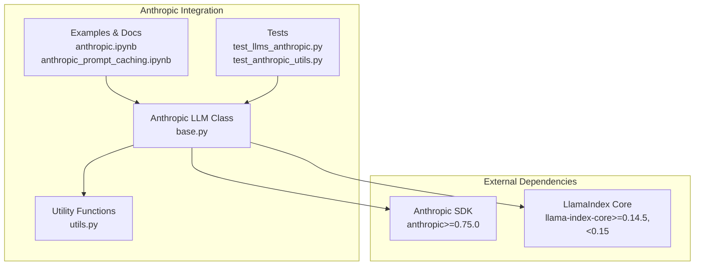
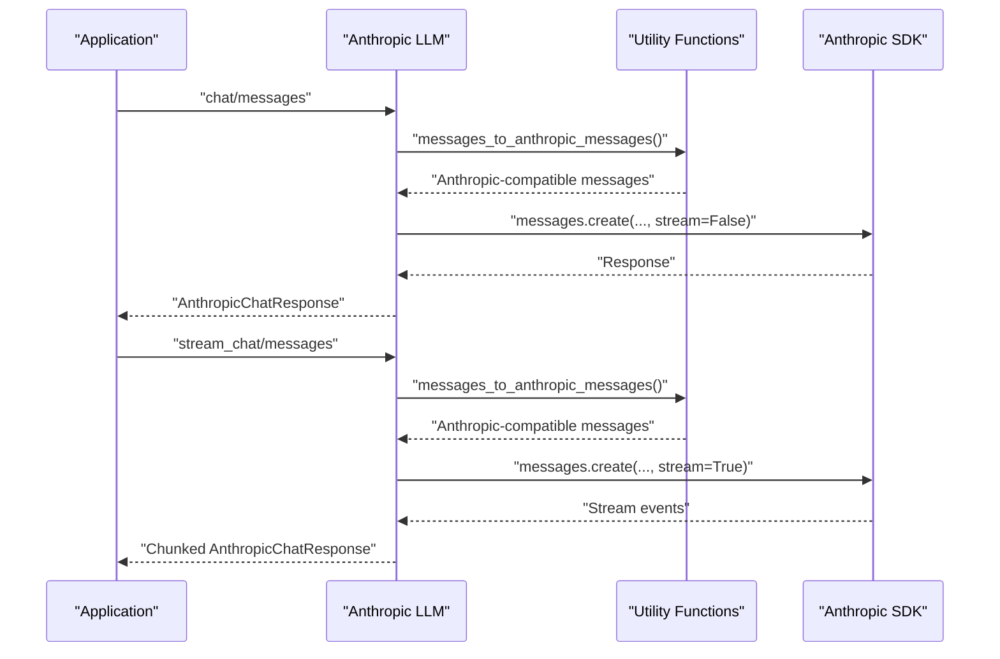
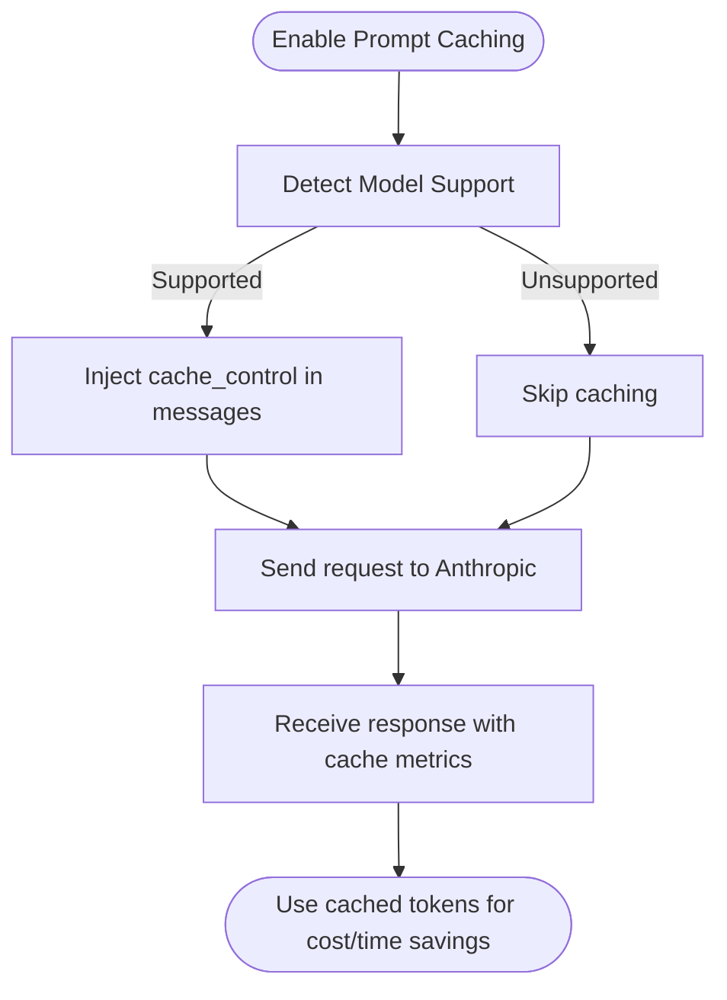
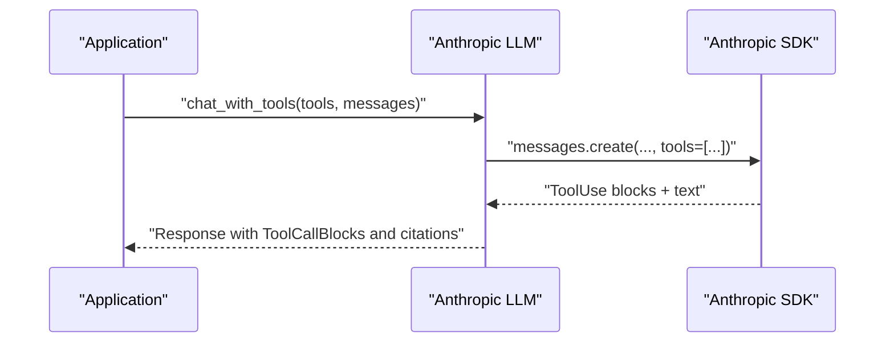
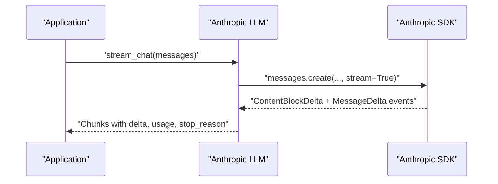
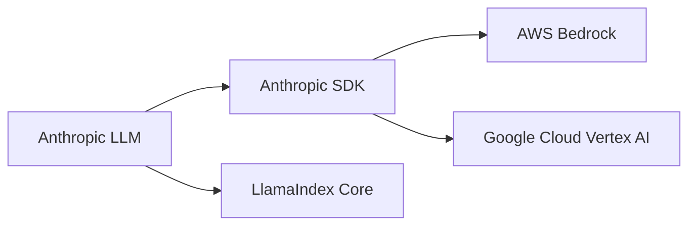

# Anthropic Providers

<cite>
**Referenced Files in This Document**
- [base.py](file://llama-index-integrations/llms/llama-index-llms-anthropic/llama_index/llms/anthropic/base.py)
- [utils.py](file://llama-index-integrations/llms/llama-index-llms-anthropic/llama_index/llms/anthropic/utils.py)
- [README.md](file://llama-index-integrations/llms/llama-index-llms-anthropic/README.md)
- [anthropic.md](file://docs/api_reference/api_reference/llms/anthropic.md)
- [anthropic.ipynb](file://docs/examples/llm/anthropic.ipynb)
- [anthropic_prompt_caching.ipynb](file://docs/examples/llm/anthropic_prompt_caching.ipynb)
- [test_llms_anthropic.py](file://llama-index-integrations/llms/llama-index-llms-anthropic/tests/test_llms_anthropic.py)
- [test_anthropic_utils.py](file://llama-index-integrations/llms/llama-index-llms-anthropic/tests/test_anthropic_utils.py)
- [pyproject.toml](file://llama-index-integrations/llms/llama-index-llms-anthropic/pyproject.toml)
</cite>

## Table of Contents
1. [Introduction](#introduction)
2. [Project Structure](#project-structure)
3. [Core Components](#core-components)
4. [Architecture Overview](#architecture-overview)
5. [Detailed Component Analysis](#detailed-component-analysis)
6. [Dependency Analysis](#dependency-analysis)
7. [Performance Considerations](#performance-considerations)
8. [Troubleshooting Guide](#troubleshooting-guide)
9. [Conclusion](#conclusion)
10. [Appendices](#appendices)

## Introduction
This document provides comprehensive API documentation for Anthropic Claude LLM providers integrated via LlamaIndex. It covers authentication using API keys, model selection across Claude-3 and Claude-4 variants, provider-specific features such as prompt caching, function/tool calling, streaming responses, structured outputs, and multi-modal capabilities. It also outlines safety and moderation considerations, rate limiting, error handling, and retry mechanisms, along with configuration examples for different use cases.

## Project Structure
The Anthropic integration consists of:
- A primary LLM class implementing chat, completion, streaming, async operations, and tool/function calling
- Utility functions for message conversion, prompt caching support detection, structured output support, and tool call updates
- Examples and tests demonstrating authentication, model selection, prompt caching, tool use, streaming, and structured outputs
- Documentation and notebooks showcasing practical usage patterns

**Diagram sources**
- [base.py](file://llama-index-integrations/llms/llama-index-llms-anthropic/llama_index/llms/anthropic/base.py#L116-L714)
- [utils.py](file://llama-index-integrations/llms/llama-index-llms-anthropic/llama_index/llms/anthropic/utils.py#L1-L663)
- [pyproject.toml](file://llama-index-integrations/llms/llama-index-llms-anthropic/pyproject.toml#L36-L39)

**Section sources**
- [base.py](file://llama-index-integrations/llms/llama-index-llms-anthropic/llama_index/llms/anthropic/base.py#L1-L120)
- [utils.py](file://llama-index-integrations/llms/llama-index-llms-anthropic/llama_index/llms/anthropic/utils.py#L1-L120)
- [README.md](file://llama-index-integrations/llms/llama-index-llms-anthropic/README.md#L1-L218)
- [anthropic.md](file://docs/api_reference/api_reference/llms/anthropic.md#L1-L4)

## Core Components
- Anthropic LLM class: Provides chat, completion, streaming, async methods, tokenizer, metadata, and tool/function calling support
- Utility functions: Convert messages to Anthropic-compatible formats, detect prompt caching and structured output support, manage tool calls, and map tool choices
- Authentication: Supports API key via environment variable or constructor parameter; also supports Vertex AI and AWS Bedrock clients
- Provider-specific features: Prompt caching, structured outputs, thinking (chain-of-thought), citations, and multi-modal inputs

Key implementation references:
- LLM class definition and methods: [Anthropic](file://llama-index-integrations/llms/llama-index-llms-anthropic/llama_index/llms/anthropic/base.py#L116-L714)
- Utility functions for models, caching, and tool mapping: [Utils](file://llama-index-integrations/llms/llama-index-llms-anthropic/llama_index/llms/anthropic/utils.py#L114-L663)
- Authentication and provider selection: [Anthropic constructor](file://llama-index-integrations/llms/llama-index-llms-anthropic/llama_index/llms/anthropic/base.py#L198-L299)
- Examples and usage patterns: [Anthropic Notebook](file://docs/examples/llm/anthropic.ipynb#L1-L1390), [Prompt Caching Notebook](file://docs/examples/llm/anthropic_prompt_caching.ipynb#L1-L358)

**Section sources**
- [base.py](file://llama-index-integrations/llms/llama-index-llms-anthropic/llama_index/llms/anthropic/base.py#L116-L714)
- [utils.py](file://llama-index-integrations/llms/llama-index-llms-anthropic/llama_index/llms/anthropic/utils.py#L114-L663)
- [anthropic.ipynb](file://docs/examples/llm/anthropic.ipynb#L1-L1390)
- [anthropic_prompt_caching.ipynb](file://docs/examples/llm/anthropic_prompt_caching.ipynb#L1-L358)

## Architecture Overview
The Anthropic integration wraps the Anthropic SDK and exposes a unified LlamaIndex LLM interface. It supports:
- Standard chat/completion with optional streaming
- Async operations
- Tool/function calling with server-side tool use and citations
- Prompt caching for supported models
- Structured outputs for compatible models
- Multi-modal inputs (text, images)
- Vertex AI and AWS Bedrock clients

**Diagram sources**
- [base.py](file://llama-index-integrations/llms/llama-index-llms-anthropic/llama_index/llms/anthropic/base.py#L416-L441)
- [base.py](file://llama-index-integrations/llms/llama-index-llms-anthropic/llama_index/llms/anthropic/base.py#L451-L653)
- [utils.py](file://llama-index-integrations/llms/llama-index-llms-anthropic/llama_index/llms/anthropic/utils.py#L314-L371)

## Detailed Component Analysis

### Authentication and Provider Selection
- API key: Provided via environment variable or constructor parameter
- Vertex AI: Use region and project_id to select Anthropic through Vertex AI
- AWS Bedrock: Use aws_region and optional credentials to select Anthropic through Bedrock
- Timeout, max_retries, and additional kwargs are configurable

References:
- [Environment variable usage](file://docs/examples/llm/anthropic.ipynb#L82-L107)
- [Vertex AI setup](file://docs/examples/llm/anthropic.ipynb#L364-L394)
- [Bedrock setup](file://docs/examples/llm/anthropic.ipynb#L395-L417)
- [Constructor parameters](file://llama-index-integrations/llms/llama-index-llms-anthropic/llama_index/llms/anthropic/base.py#L198-L299)

**Section sources**
- [base.py](file://llama-index-integrations/llms/llama-index-llms-anthropic/llama_index/llms/anthropic/base.py#L198-L299)
- [anthropic.ipynb](file://docs/examples/llm/anthropic.ipynb#L364-L417)

### Model Selection and Metadata
- Supported models include Claude-3 and Claude-4 variants across API, Vertex AI, and Bedrock identifiers
- Context window sizes are derived from model names
- Function calling capability is inferred from model name patterns

References:
- [Model context mapping](file://llama-index-integrations/llms/llama-index-llms-anthropic/llama_index/llms/anthropic/utils.py#L114-L141)
- [Model identifiers](file://llama-index-integrations/llms/llama-index-llms-anthropic/llama_index/llms/anthropic/utils.py#L54-L111)
- [Metadata exposure](file://llama-index-integrations/llms/llama-index-llms-anthropic/llama_index/llms/anthropic/base.py#L304-L312)

**Section sources**
- [utils.py](file://llama-index-integrations/llms/llama-index-llms-anthropic/llama_index/llms/anthropic/utils.py#L54-L141)
- [base.py](file://llama-index-integrations/llms/llama-index-llms-anthropic/llama_index/llms/anthropic/base.py#L304-L312)

### Prompt Caching
- Enable caching by marking blocks with CachePoint or setting cache_idx on the LLM
- Supported models include Claude-4 Opus, Claude-4 Sonnet, Claude-3.7 Sonnet, Claude-3.5 Sonnet/Haiku, and Claude-3 Haiku
- Caching reduces latency and cost by reusing computed attention for repeated prefixes

References:
- [Prompt caching notebook](file://docs/examples/llm/anthropic_prompt_caching.ipynb#L1-L358)
- [Cache support detection](file://llama-index-integrations/llms/llama-index-llms-anthropic/llama_index/llms/anthropic/utils.py#L633-L647)
- [Message conversion with cache control](file://llama-index-integrations/llms/llama-index-llms-anthropic/llama_index/llms/anthropic/utils.py#L314-L371)

**Diagram sources**
- [utils.py](file://llama-index-integrations/llms/llama-index-llms-anthropic/llama_index/llms/anthropic/utils.py#L633-L647)
- [utils.py](file://llama-index-integrations/llms/llama-index-llms-anthropic/llama_index/llms/anthropic/utils.py#L314-L371)

**Section sources**
- [anthropic_prompt_caching.ipynb](file://docs/examples/llm/anthropic_prompt_caching.ipynb#L1-L358)
- [utils.py](file://llama-index-integrations/llms/llama-index-llms-anthropic/llama_index/llms/anthropic/utils.py#L633-L647)

### Function Calling and Tool Use
- Direct tool/function calling with server-side tool use and citations
- Tool choice mapping supports auto/any with optional parallel tool use
- Citations are exposed as CitationBlocks in the response

References:
- [Tool calling examples](file://docs/examples/llm/anthropic.ipynb#L827-L1061)
- [Tool choice mapping](file://llama-index-integrations/llms/llama-index-llms-anthropic/tests/test_llms_anthropic.py#L337-L361)
- [Citations parsing](file://llama-index-integrations/llms/llama-index-llms-anthropic/llama_index/llms/anthropic/base.py#L364-L414)

**Diagram sources**
- [base.py](file://llama-index-integrations/llms/llama-index-llms-anthropic/llama_index/llms/anthropic/base.py#L364-L414)
- [anthropic.ipynb](file://docs/examples/llm/anthropic.ipynb#L827-L1061)

**Section sources**
- [anthropic.ipynb](file://docs/examples/llm/anthropic.ipynb#L827-L1061)
- [test_llms_anthropic.py](file://llama-index-integrations/llms/llama-index-llms-anthropic/tests/test_llms_anthropic.py#L337-L361)

### Streaming Responses
- Streaming chat and completion return incremental chunks with delta text
- Usage metadata and stop_reason are captured from stream events
- Async streaming counterparts are available

References:
- [Streaming examples](file://docs/examples/llm/anthropic.ipynb#L200-L277)
- [Stream implementation](file://llama-index-integrations/llms/llama-index-llms-anthropic/llama_index/llms/anthropic/base.py#L451-L653)
- [Async streaming](file://llama-index-integrations/llms/llama-index-llms-anthropic/llama_index/llms/anthropic/base.py#L704-L714)

**Diagram sources**
- [base.py](file://llama-index-integrations/llms/llama-index-llms-anthropic/llama_index/llms/anthropic/base.py#L451-L653)

**Section sources**
- [anthropic.ipynb](file://docs/examples/llm/anthropic.ipynb#L200-L277)
- [base.py](file://llama-index-integrations/llms/llama-index-llms-anthropic/llama_index/llms/anthropic/base.py#L451-L653)

### Structured Outputs
- Compatible models can produce structured JSON aligned to a Pydantic schema
- Two approaches: as_structured_llm() wrapper or structured_predict()

References:
- [Structured prediction examples](file://docs/examples/llm/anthropic.ipynb#L518-L648)
- [Structured output support detection](file://llama-index-integrations/llms/llama-index-llms-anthropic/llama_index/llms/anthropic/utils.py#L594-L662)

**Section sources**
- [anthropic.ipynb](file://docs/examples/llm/anthropic.ipynb#L518-L648)
- [utils.py](file://llama-index-integrations/llms/llama-index-llms-anthropic/llama_index/llms/anthropic/utils.py#L594-L662)

### Multi-Modal Inputs
- Accepts text, images, and documents in chat messages
- Images are converted to base64; PDFs are handled as documents

References:
- [Multi-modal example](file://docs/examples/llm/anthropic.ipynb#L423-L471)
- [Block conversions](file://llama-index-integrations/llms/llama-index-llms-anthropic/llama_index/llms/anthropic/utils.py#L159-L195)

**Section sources**
- [anthropic.ipynb](file://docs/examples/llm/anthropic.ipynb#L423-L471)
- [utils.py](file://llama-index-integrations/llms/llama-index-llms-anthropic/llama_index/llms/anthropic/utils.py#L159-L195)

### Safety, Moderation, and Content Filtering
- The integration does not implement explicit safety filters or moderation logic
- Anthropic models inherently include content filtering and safety features; consult Anthropic documentation for policy details
- For downstream moderation, integrate external moderation services or Anthropic’s moderation endpoints as needed

[No sources needed since this section provides general guidance]

### Rate Limiting, Error Handling, and Retries
- The underlying Anthropic SDK handles rate limits and retries; configure max_retries and timeout in the LLM constructor
- Streaming responses capture usage metadata and stop_reason from SDK events
- Tests demonstrate robust streaming behavior and async patterns

References:
- [Constructor retry/timeout](file://llama-index-integrations/llms/llama-index-llms-anthropic/llama_index/llms/anthropic/base.py#L153-L155)
- [Streaming usage and stop_reason](file://llama-index-integrations/llms/llama-index-llms-anthropic/tests/test_llms_anthropic.py#L653-L753)

**Section sources**
- [base.py](file://llama-index-integrations/llms/llama-index-llms-anthropic/llama_index/llms/anthropic/base.py#L153-L155)
- [test_llms_anthropic.py](file://llama-index-integrations/llms/llama-index-llms-anthropic/tests/test_llms_anthropic.py#L653-L753)

## Dependency Analysis
The integration depends on:
- Anthropic SDK (with bedrock and vertex extras)
- LlamaIndex core for abstractions and utilities

**Diagram sources**
- [pyproject.toml](file://llama-index-integrations/llms/llama-index-llms-anthropic/pyproject.toml#L36-L39)

**Section sources**
- [pyproject.toml](file://llama-index-integrations/llms/llama-index-llms-anthropic/pyproject.toml#L36-L39)

## Performance Considerations
- Prompt caching: Enable for repeated or long prefixes to reduce latency and cost
- Streaming: Use streaming for real-time UX and to progressively render responses
- Structured outputs: Reduce post-processing overhead by constraining model output to JSON schemas
- Token counting: Use the provided tokenizer to estimate context usage

[No sources needed since this section provides general guidance]

## Troubleshooting Guide
Common issues and resolutions:
- Unknown model name: Ensure the model identifier matches supported variants
- Missing API key: Set ANTHROPIC_API_KEY or pass api_key to the constructor
- Streaming usage metadata: Verify RawMessageDeltaEvent handling for usage and stop_reason
- Tool choice conflicts: When thinking is enabled, tool_choice mapping differs; adjust parameters accordingly

References:
- [Model support validation](file://llama-index-integrations/llms/llama-index-llms-anthropic/llama_index/llms/anthropic/utils.py#L118-L141)
- [Environment variable setup](file://docs/examples/llm/anthropic.ipynb#L82-L107)
- [Streaming usage capture](file://llama-index-integrations/llms/llama-index-llms-anthropic/tests/test_llms_anthropic.py#L653-L753)
- [Tool choice mapping](file://llama-index-integrations/llms/llama-index-llms-anthropic/tests/test_llms_anthropic.py#L337-L361)

**Section sources**
- [utils.py](file://llama-index-integrations/llms/llama-index-llms-anthropic/llama_index/llms/anthropic/utils.py#L118-L141)
- [anthropic.ipynb](file://docs/examples/llm/anthropic.ipynb#L82-L107)
- [test_llms_anthropic.py](file://llama-index-integrations/llms/llama-index-llms-anthropic/tests/test_llms_anthropic.py#L653-L753)

## Conclusion
The Anthropic integration in LlamaIndex provides a robust, extensible interface to Anthropic Claude models with support for streaming, tool/function calling, structured outputs, prompt caching, and multi-modal inputs. By leveraging the provided utilities and examples, developers can configure authentication, optimize performance with caching, and implement reliable tooling and moderation strategies tailored to their use cases.

[No sources needed since this section summarizes without analyzing specific files]

## Appendices

### Configuration Examples
- Basic usage with API key and tokenizer: [Example](file://docs/examples/llm/anthropic.ipynb#L60-L110)
- Vertex AI and Bedrock setup: [Example](file://docs/examples/llm/anthropic.ipynb#L364-L417)
- Prompt caching with CachePoint: [Example](file://docs/examples/llm/anthropic_prompt_caching.ipynb#L164-L190)
- Tool use with citations: [Example](file://docs/examples/llm/anthropic.ipynb#L1038-L1061)
- Structured outputs: [Example](file://docs/examples/llm/anthropic.ipynb#L530-L586)

**Section sources**
- [anthropic.ipynb](file://docs/examples/llm/anthropic.ipynb#L60-L110)
- [anthropic.ipynb](file://docs/examples/llm/anthropic.ipynb#L364-L417)
- [anthropic_prompt_caching.ipynb](file://docs/examples/llm/anthropic_prompt_caching.ipynb#L164-L190)
- [anthropic.ipynb](file://docs/examples/llm/anthropic.ipynb#L1038-L1061)
- [anthropic.ipynb](file://docs/examples/llm/anthropic.ipynb#L530-L586)