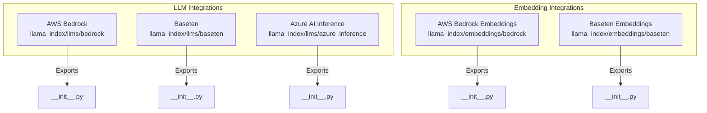
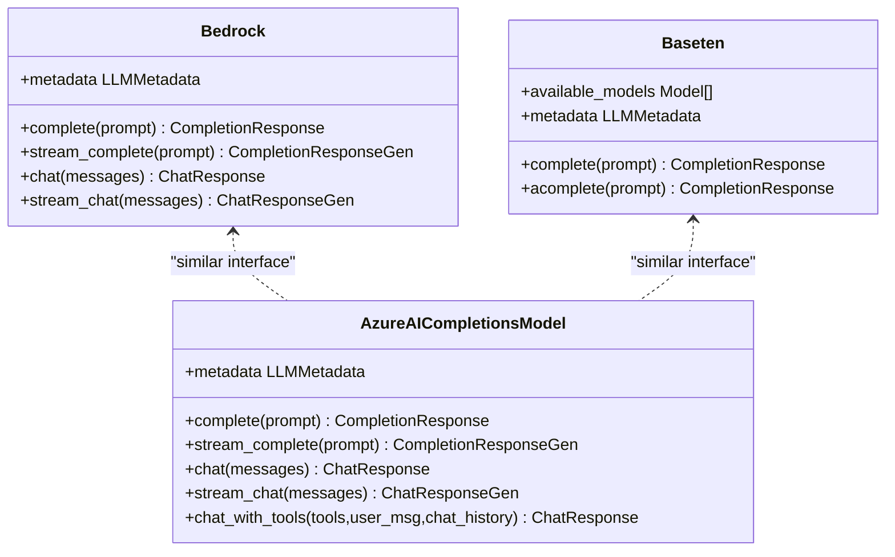
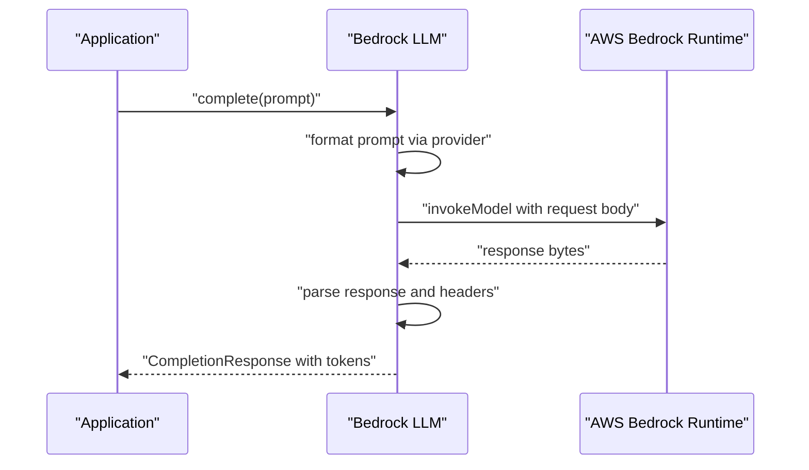
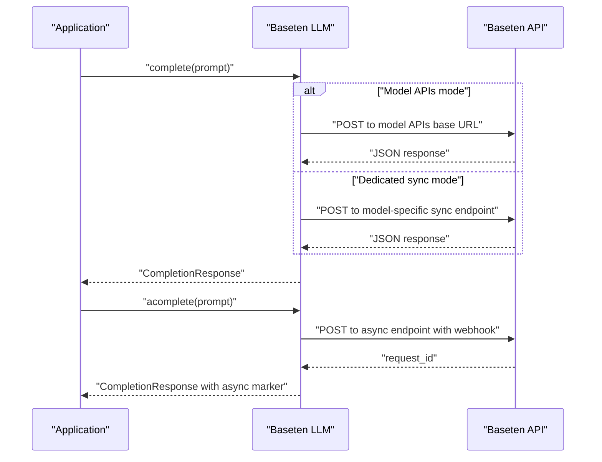
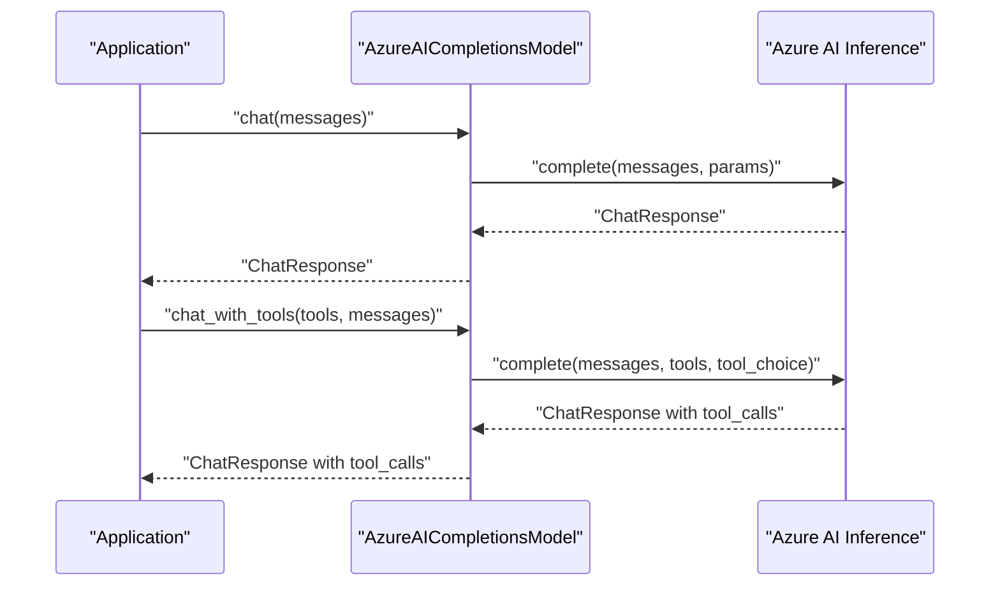
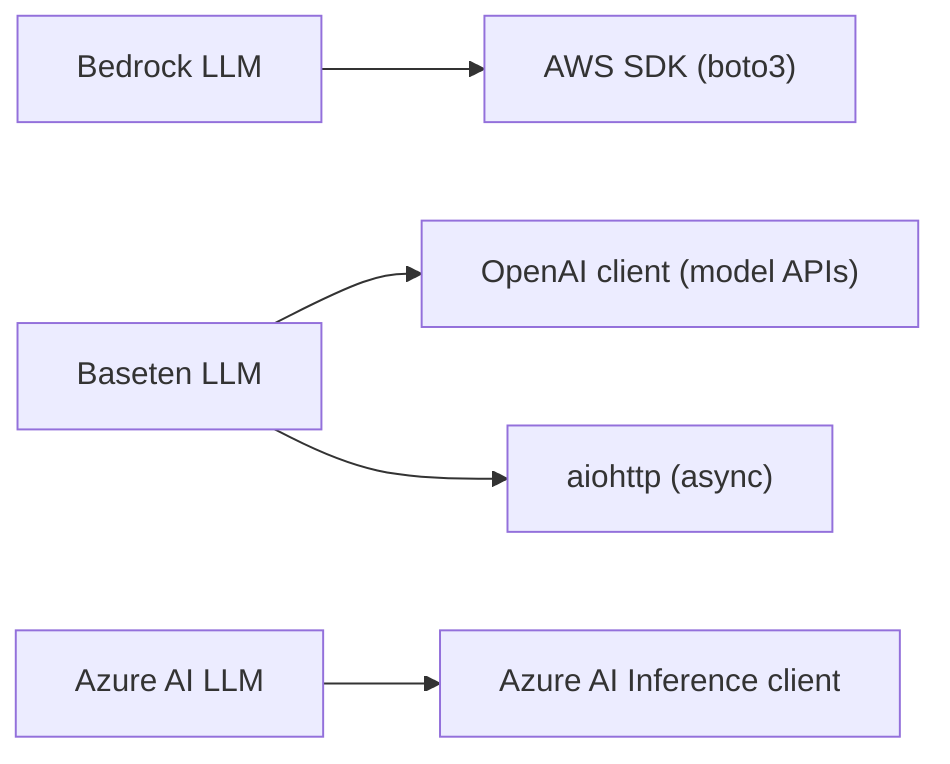

# Enterprise and Specialized Providers

<cite>
**Referenced Files in This Document**
- [base.py](file://llama-index-integrations/llms/llama-index-llms-bedrock/llama_index/llms/bedrock/base.py)
- [__init__.py](file://llama-index-integrations/llms/llama-index-llms-bedrock/llama_index/llms/bedrock/__init__.py)
- [base.py](file://llama-index-integrations/llms/llama-index-llms-baseten/llama_index/llms/baseten/base.py)
- [__init__.py](file://llama-index-integrations/llms/llama-index-llms-baseten/llama_index/llms/baseten/__init__.py)
- [base.py](file://llama-index-integrations/llms/llama-index-llms-azure-inference/llama_index/llms/azure_inference/base.py)
- [__init__.py](file://llama-index-integrations/llms/llama-index-llms-azure-inference/llama_index/llms/azure_inference/__init__.py)
- [base.py](file://llama-index-integrations/embeddings/llama-index-embeddings-bedrock/llama_index/embeddings/bedrock/base.py)
- [__init__.py](file://llama-index-integrations/embeddings/llama-index-embeddings-bedrock/llama_index/embeddings/bedrock/__init__.py)
- [base.py](file://llama-index-integrations/embeddings/llama-index-embeddings-baseten/llama_index/embeddings/baseten/base.py)
- [__init__.py](file://llama-index-integrations/embeddings/llama-index-embeddings-baseten/llama_index/embeddings/baseten/__init__.py)
</cite>

## Table of Contents
1. [Introduction](#introduction)
2. [Project Structure](#project-structure)
3. [Core Components](#core-components)
4. [Architecture Overview](#architecture-overview)
5. [Detailed Component Analysis](#detailed-component-analysis)
6. [Dependency Analysis](#dependency-analysis)
7. [Performance Considerations](#performance-considerations)
8. [Troubleshooting Guide](#troubleshooting-guide)
9. [Conclusion](#conclusion)

## Introduction
This document provides enterprise-focused API documentation for specialized Large Language Model (LLM) providers integrated via LlamaIndex. It covers AWS Bedrock, Baseten, and Azure AI Inference for LLMs, and highlights embedding integrations for AWS Bedrock and Baseten. The focus is on enterprise-grade capabilities such as authentication, multi-region deployment, compliance, security, audit logging, governance controls, managed service features, auto-scaling, and cost optimization strategies. Guidance is provided for integrating these providers into enterprise infrastructure while maintaining data privacy and governance.

## Project Structure
The relevant enterprise integrations are organized under the LlamaIndex integrations tree:
- LLM providers: AWS Bedrock, Baseten, Azure AI Inference
- Embedding providers: AWS Bedrock, Baseten
Each provider exposes a public module interface and an internal implementation class that extends LlamaIndex’s LLM abstractions.

**Diagram sources**
- [__init__.py](file://llama-index-integrations/llms/llama-index-llms-bedrock/llama_index/llms/bedrock/__init__.py#L1-L14)
- [__init__.py](file://llama-index-integrations/llms/llama-index-llms-baseten/llama_index/llms/baseten/__init__.py#L1-L4)
- [__init__.py](file://llama-index-integrations/llms/llama-index-llms-azure-inference/llama_index/llms/azure_inference/__init__.py#L1-L4)
- [__init__.py](file://llama-index-integrations/embeddings/llama-index-embeddings-bedrock/llama_index/embeddings/bedrock/__init__.py#L1-L4)
- [__init__.py](file://llama-index-integrations/embeddings/llama-index-embeddings-baseten/llama_index/embeddings/baseten/__init__.py#L1-L4)

**Section sources**
- [__init__.py](file://llama-index-integrations/llms/llama-index-llms-bedrock/llama_index/llms/bedrock/__init__.py#L1-L14)
- [__init__.py](file://llama-index-integrations/llms/llama-index-llms-baseten/llama_index/llms/baseten/__init__.py#L1-L4)
- [__init__.py](file://llama-index-integrations/llms/llama-index-llms-azure-inference/llama_index/llms/azure_inference/__init__.py#L1-L4)
- [__init__.py](file://llama-index-integrations/embeddings/llama-index-embeddings-bedrock/llama_index/embeddings/bedrock/__init__.py#L1-L4)
- [__init__.py](file://llama-index-integrations/embeddings/llama-index-embeddings-baseten/llama_index/embeddings/baseten/__init__.py#L1-L4)

## Core Components
- AWS Bedrock LLM: Implements a Bedrock class that supports completion and chat, with optional guardrails and tracing. It integrates with AWS SDK sessions and supports retry and timeout configurations.
- Baseten LLM: Implements a Baseten class extending OpenAI-compatible behavior, supporting model APIs and dedicated endpoints, with optional async webhook-based invocation.
- Azure AI Inference LLM: Implements an AzureAICompletionsModel class that wraps Azure AI Inference clients, supporting chat, streaming, function/tool calling, and multiple authentication modes.
- AWS Bedrock Embeddings: Provides embedding generation via Bedrock runtime.
- Baseten Embeddings: Provides embedding generation via Baseten’s inference endpoints.

Key enterprise features exposed by these components include:
- Authentication: AWS credentials/profile/session, Azure API key or Entra ID, Baseten API keys.
- Multi-region: AWS region selection; Azure endpoint configuration; Baseten model APIs vs dedicated endpoints.
- Compliance and governance: Guardrails and tracing for Bedrock; model metadata and provider identification for Azure; model validation for Baseten.
- Managed service features: Dedicated endpoints for Baseten; Azure-managed inference endpoints; Bedrock managed foundation models.
- Auto-scaling and cost optimization: Built-in retry/backoff; configurable timeouts; token usage reporting for Bedrock; async webhook pattern for Baseten.

**Section sources**
- [base.py](file://llama-index-integrations/llms/llama-index-llms-bedrock/llama_index/llms/bedrock/base.py#L49-L400)
- [base.py](file://llama-index-integrations/llms/llama-index-llms-baseten/llama_index/llms/baseten/base.py#L25-L228)
- [base.py](file://llama-index-integrations/llms/llama-index-llms-azure-inference/llama_index/llms/azure_inference/base.py#L147-L601)
- [base.py](file://llama-index-integrations/embeddings/llama-index-embeddings-bedrock/llama_index/embeddings/bedrock/base.py)
- [base.py](file://llama-index-integrations/embeddings/llama-index-embeddings-baseten/llama_index/embeddings/baseten/base.py)

## Architecture Overview
The integrations follow a consistent pattern:
- Provider-specific client initialization with authentication and endpoint configuration.
- Unified LlamaIndex LLM interface methods: complete, chat, stream_complete, stream_chat, async variants.
- Optional advanced features: tool/function calling (Azure), guardrails/tracing (Bedrock), model validation (Baseten), and metadata retrieval (Azure).

**Diagram sources**
- [base.py](file://llama-index-integrations/llms/llama-index-llms-bedrock/llama_index/llms/bedrock/base.py#L283-L386)
- [base.py](file://llama-index-integrations/llms/llama-index-llms-baseten/llama_index/llms/baseten/base.py#L177-L227)
- [base.py](file://llama-index-integrations/llms/llama-index-llms-azure-inference/llama_index/llms/azure_inference/base.py#L352-L538)

## Detailed Component Analysis

### AWS Bedrock LLM
- Purpose: Invoke Amazon Bedrock foundation and custom models with unified LlamaIndex interface.
- Authentication and regions: Supports AWS session configuration, region selection, and optional explicit credentials.
- Advanced features:
  - Guardrails: Identifier and version for Bedrock guardrails.
  - Tracing: Enable Bedrock trace for diagnostics.
  - Streaming: Limited to supported models; otherwise raises an error.
  - Token usage: Parses Bedrock headers for prompt and completion token counts.
- Enterprise considerations:
  - Multi-region: Configure region_name per environment.
  - Compliance: Use guardrails and tracing for auditability.
  - Cost optimization: Monitor token counts; tune max_tokens and temperature; leverage retries with bounded backoff.

**Diagram sources**
- [base.py](file://llama-index-integrations/llms/llama-index-llms-bedrock/llama_index/llms/bedrock/base.py#L283-L309)

**Section sources**
- [base.py](file://llama-index-integrations/llms/llama-index-llms-bedrock/llama_index/llms/bedrock/base.py#L49-L400)

### Baseten LLM
- Purpose: Unified LlamaIndex interface to Baseten’s inference endpoints.
- Modes:
  - Model APIs: Validates model availability dynamically; uses a shared model APIs base URL.
  - Dedicated endpoints: Per-model sync endpoint; supports async via webhook.
- Authentication: API key via constructor or environment variable.
- Enterprise considerations:
  - Managed service: Dedicated endpoints for custom models; model APIs for standardized slugs.
  - Governance: Dynamic model validation reduces misconfiguration risk.
  - Async operations: Use webhook_endpoint for fire-and-forget async invocations.
  - Cost optimization: Prefer model APIs for shared resource efficiency; dedicated endpoints for isolation and capacity guarantees.

**Diagram sources**
- [base.py](file://llama-index-integrations/llms/llama-index-llms-baseten/llama_index/llms/baseten/base.py#L177-L218)

**Section sources**
- [base.py](file://llama-index-integrations/llms/llama-index-llms-baseten/llama_index/llms/baseten/base.py#L25-L228)

### Azure AI Inference LLM
- Purpose: Azure-hosted model inference with OpenAI-like interface and function/tool calling.
- Authentication:
  - API key via AzureKeyCredential.
  - Microsoft Entra ID via DefaultAzureCredential (sync) and async variant for async calls.
- Features:
  - Chat and streaming chat.
  - Function/tool calling with automatic tool choice enforcement.
  - Metadata retrieval for model type/provider identification.
- Enterprise considerations:
  - Multi-region: Endpoint URL determines region and tenant boundaries.
  - Security: Prefer Entra ID for federated environments; API key for simpler setups.
  - Audit/logging: Use callback manager and provider metadata for observability.

**Diagram sources**
- [base.py](file://llama-index-integrations/llms/llama-index-llms-azure-inference/llama_index/llms/azure_inference/base.py#L352-L538)

**Section sources**
- [base.py](file://llama-index-integrations/llms/llama-index-llms-azure-inference/llama_index/llms/azure_inference/base.py#L147-L601)

### AWS Bedrock Embeddings
- Purpose: Generate embeddings via AWS Bedrock runtime.
- Notes: Exposed via the embeddings module; integrates with Bedrock’s embedding models.

**Section sources**
- [__init__.py](file://llama-index-integrations/embeddings/llama-index-embeddings-bedrock/llama_index/embeddings/bedrock/__init__.py#L1-L4)

### Baseten Embeddings
- Purpose: Generate embeddings via Baseten’s inference endpoints.
- Notes: Exposed via the embeddings module; supports model APIs and dedicated endpoints similar to LLMs.

**Section sources**
- [__init__.py](file://llama-index-integrations/embeddings/llama-index-embeddings-baseten/llama_index/embeddings/baseten/__init__.py#L1-L4)

## Dependency Analysis
- AWS Bedrock LLM depends on the AWS SDK (boto3) and Bedrock runtime client; supports retries and timeouts.
- Baseten LLM depends on OpenAI-compatible client for model APIs and aiohttp for async operations; validates model availability dynamically.
- Azure AI Inference LLM depends on Azure AI Inference client libraries; supports both API key and Entra ID credentials.

**Diagram sources**
- [base.py](file://llama-index-integrations/llms/llama-index-llms-bedrock/llama_index/llms/bedrock/base.py#L176-L194)
- [base.py](file://llama-index-integrations/llms/llama-index-llms-baseten/llama_index/llms/baseten/base.py#L125-L157)
- [base.py](file://llama-index-integrations/llms/llama-index-llms-azure-inference/llama_index/llms/azure_inference/base.py#L46-L56)

**Section sources**
- [base.py](file://llama-index-integrations/llms/llama-index-llms-bedrock/llama_index/llms/bedrock/base.py#L176-L194)
- [base.py](file://llama-index-integrations/llms/llama-index-llms-baseten/llama_index/llms/baseten/base.py#L125-L157)
- [base.py](file://llama-index-integrations/llms/llama-index-llms-azure-inference/llama_index/llms/azure_inference/base.py#L46-L56)

## Performance Considerations
- Retries and timeouts: Configure max_retries and timeout to balance reliability and latency.
- Streaming: Use streaming for long responses to reduce perceived latency; ensure downstream consumers handle incremental deltas.
- Token usage: Utilize provider-provided token counts for cost attribution and budgeting.
- Async operations: Use Baseten async webhook for non-blocking invocations; manage request IDs for correlation.
- Model selection: Choose appropriate models for workload characteristics (generation vs chat vs function calling).

[No sources needed since this section provides general guidance]

## Troubleshooting Guide
- AWS Bedrock
  - Missing context window: Ensure context_size is provided for non-foundation models.
  - Streaming unsupported: Some models do not support streaming; verify model capability.
  - Token counts missing: Not all providers return usage headers; fall back to estimates.
- Baseten
  - Async requires webhook: Provide webhook_endpoint for async operations; model APIs do not support async.
  - Model validation failures: Dynamic validation ensures model availability; adjust model_id or endpoint mode.
- Azure AI Inference
  - Endpoint/credential errors: Verify endpoint URL and credential type; use Entra ID for federated scenarios.
  - Tool/function calling: Enforce single tool call if parallel tool calls are not desired.

**Section sources**
- [base.py](file://llama-index-integrations/llms/llama-index-llms-bedrock/llama_index/llms/bedrock/base.py#L160-L165)
- [base.py](file://llama-index-integrations/llms/llama-index-llms-bedrock/llama_index/llms/bedrock/base.py#L315-L317)
- [base.py](file://llama-index-integrations/llms/llama-index-llms-baseten/llama_index/llms/baseten/base.py#L179-L187)
- [base.py](file://llama-index-integrations/llms/llama-index-llms-azure-inference/llama_index/llms/azure_inference/base.py#L255-L266)

## Conclusion
These integrations enable enterprises to securely and efficiently consume specialized LLM providers with a unified interface. By leveraging provider-specific authentication, multi-region configuration, guardrails/tracing, and model validation, organizations can meet compliance and governance requirements. Managed service features such as Baseten dedicated endpoints and Azure-managed inference simplify scaling and operations. Performance and cost optimization are achievable through retries/timeouts, streaming, token usage tracking, and async patterns.