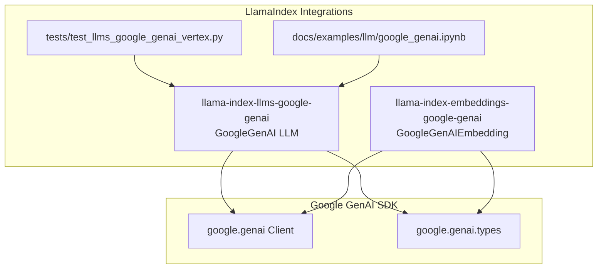
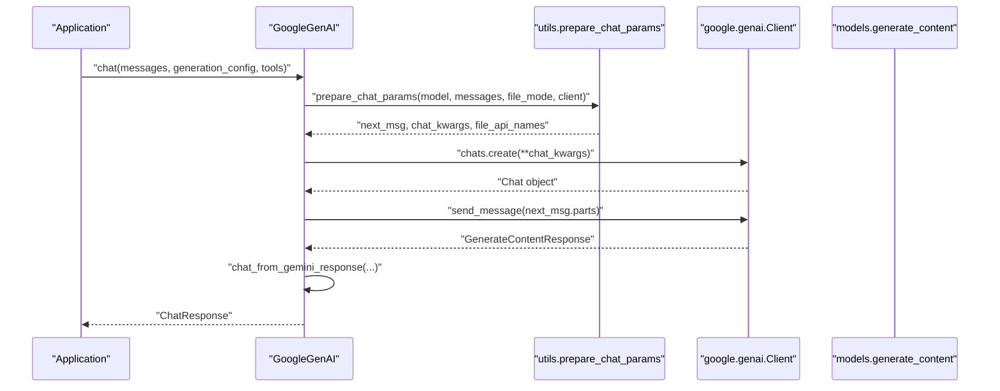
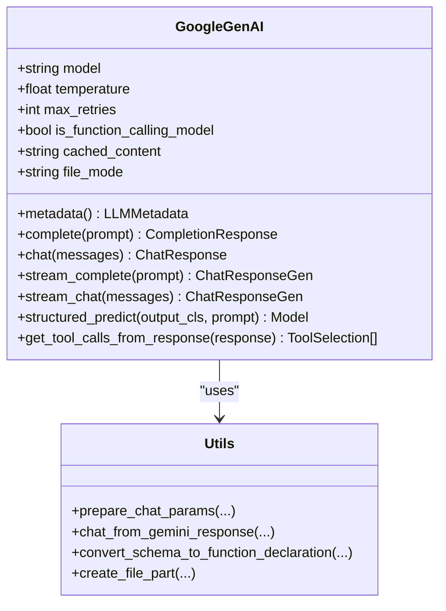
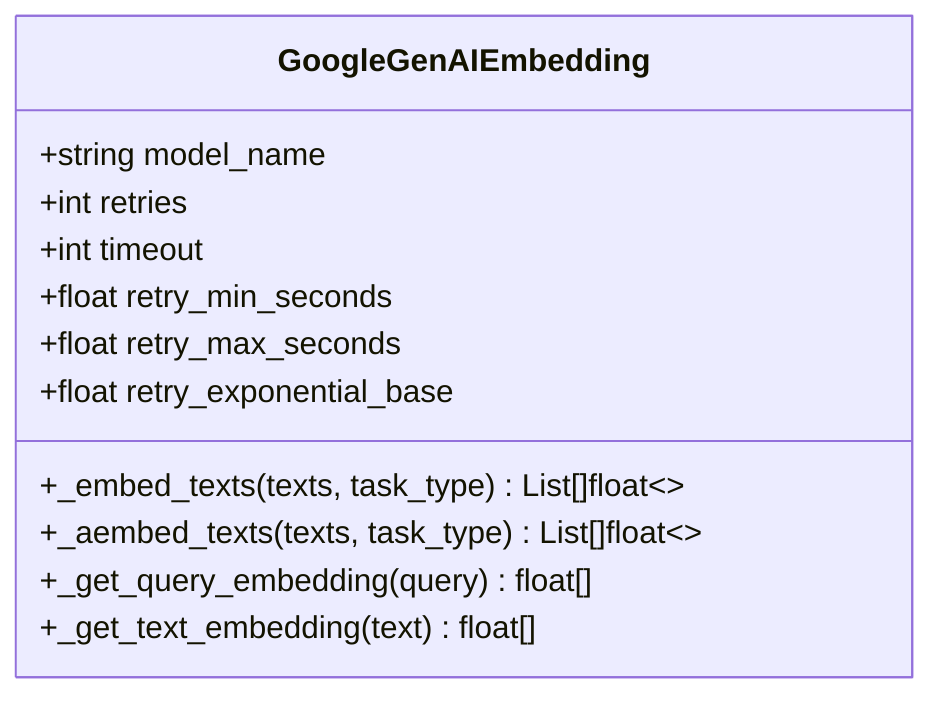
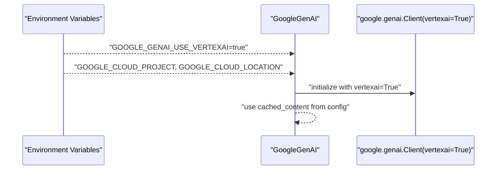
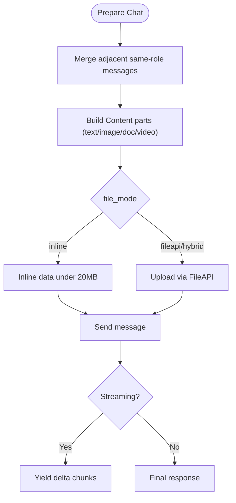
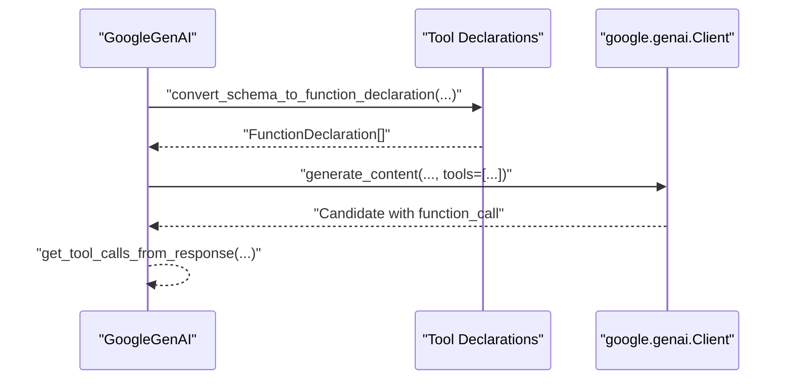
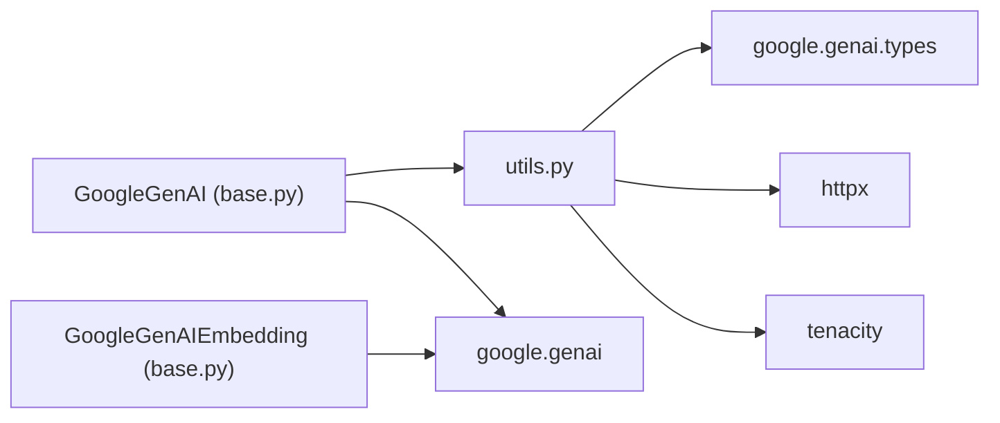

# Google Providers

<cite>
**Referenced Files in This Document**
- [base.py](file://llama-index-integrations/llms/llama-index-llms-google-genai/llama_index/llms/google_genai/base.py)
- [utils.py](file://llama-index-integrations/llms/llama-index-llms-google-genai/llama_index/llms/google_genai/utils.py)
- [base.py](file://llama-index-integrations/embeddings/llama-index-embeddings-google-genai/llama_index/embeddings/google_genai/base.py)
- [test_llms_google_genai_vertex.py](file://llama-index-integrations/llms/llama-index-llms-google-genai/tests/test_llms_google_genai_vertex.py)
- [google_genai.ipynb](file://docs/examples/llm/google_genai.ipynb)
</cite>

## Table of Contents
1. [Introduction](#introduction)
2. [Project Structure](#project-structure)
3. [Core Components](#core-components)
4. [Architecture Overview](#architecture-overview)
5. [Detailed Component Analysis](#detailed-component-analysis)
6. [Dependency Analysis](#dependency-analysis)
7. [Performance Considerations](#performance-considerations)
8. [Troubleshooting Guide](#troubleshooting-guide)
9. [Conclusion](#conclusion)
10. [Appendices](#appendices)

## Introduction
This document provides comprehensive API documentation for Google LLM providers integrated with LlamaIndex, focusing on:
- Google GenAI hosted models and Vertex AI endpoints
- Authentication via Google Cloud credentials and service accounts
- Model selection, multimodal capabilities, and provider-specific features
- Function calling, safety settings, and streaming responses
- Quota management, regional endpoints, and enterprise deployment options
- Integration with Google Cloud services and billing considerations

It consolidates implementation details from the Google GenAI LLM and embedding integrations, along with example notebooks and tests to guide practical usage.

## Project Structure
The Google provider integrations are organized as separate packages under the LlamaIndex ecosystem:
- LLM integration: google-genai LLM wrapper around Google GenAI client
- Embedding integration: Google GenAI embeddings with retry and batch support
- Tests and examples demonstrate Vertex AI usage, cached content, multimodal inputs, and streaming

**Diagram sources**
- [base.py](file://llama-index-integrations/llms/llama-index-llms-google-genai/llama_index/llms/google_genai/base.py#L101-L274)
- [base.py](file://llama-index-integrations/embeddings/llama-index-embeddings-google-genai/llama_index/embeddings/google_genai/base.py#L119-L248)
- [utils.py](file://llama-index-integrations/llms/llama-index-llms-google-genai/llama_index/llms/google_genai/utils.py#L1-L649)
- [test_llms_google_genai_vertex.py](file://llama-index-integrations/llms/llama-index-llms-google-genai/tests/test_llms_google_genai_vertex.py#L1-L215)
- [google_genai.ipynb](file://docs/examples/llm/google_genai.ipynb#L1-L1438)

**Section sources**
- [base.py](file://llama-index-integrations/llms/llama-index-llms-google-genai/llama_index/llms/google_genai/base.py#L1-L837)
- [base.py](file://llama-index-integrations/embeddings/llama-index-embeddings-google-genai/llama_index/embeddings/google_genai/base.py#L1-L337)
- [utils.py](file://llama-index-integrations/llms/llama-index-llms-google-genai/llama_index/llms/google_genai/utils.py#L1-L649)
- [test_llms_google_genai_vertex.py](file://llama-index-integrations/llms/llama-index-llms-google-genai/tests/test_llms_google_genai_vertex.py#L1-L215)
- [google_genai.ipynb](file://docs/examples/llm/google_genai.ipynb#L1-L1438)

## Core Components
- GoogleGenAI (LLM)
  - Supports chat, completion, streaming, async variants, and structured prediction
  - Function calling via tool declarations and automatic function calling configuration
  - Multimodal inputs (images, documents, videos) via ChatMessage blocks
  - Vertex AI integration via environment variables or explicit config
  - Cached content support for performance and cost reduction
  - Retry decorator for transient failures
- GoogleGenAIEmbedding (Embeddings)
  - Batched embedding generation with configurable retry/backoff
  - Task-type-aware embedding configuration
  - Vertex AI support via environment or config
- Utilities
  - Role mapping, message merging, and response parsing
  - File upload helpers for multimodal content
  - Retry decorators for robust API calls

Key implementation references:
- LLM class definition and metadata: [base.py](file://llama-index-integrations/llms/llama-index-llms-google-genai/llama_index/llms/google_genai/base.py#L101-L290)
- Chat and streaming methods: [base.py](file://llama-index-integrations/llms/llama-index-llms-google-genai/llama_index/llms/google_genai/base.py#L320-L468)
- Structured prediction and tool calling: [base.py](file://llama-index-integrations/llms/llama-index-llms-google-genai/llama_index/llms/google_genai/base.py#L470-L712)
- Multimodal conversion and file handling: [utils.py](file://llama-index-integrations/llms/llama-index-llms-google-genai/llama_index/llms/google_genai/utils.py#L330-L447)
- Embedding client and retry logic: [base.py](file://llama-index-integrations/embeddings/llama-index-embeddings-google-genai/llama_index/embeddings/google_genai/base.py#L119-L337)

**Section sources**
- [base.py](file://llama-index-integrations/llms/llama-index-llms-google-genai/llama_index/llms/google_genai/base.py#L101-L712)
- [utils.py](file://llama-index-integrations/llms/llama-index-llms-google-genai/llama_index/llms/google_genai/utils.py#L330-L447)
- [base.py](file://llama-index-integrations/embeddings/llama-index-embeddings-google-genai/llama_index/embeddings/google_genai/base.py#L119-L337)

## Architecture Overview
The Google providers integrate with the Google GenAI client and types to expose a unified LlamaIndex interface. The LLM handles chat, streaming, and structured prediction, while the embeddings module provides batched vector generation with retry logic. Vertex AI is enabled through environment variables or explicit configuration.

**Diagram sources**
- [base.py](file://llama-index-integrations/llms/llama-index-llms-google-genai/llama_index/llms/google_genai/base.py#L320-L399)
- [utils.py](file://llama-index-integrations/llms/llama-index-llms-google-genai/llama_index/llms/google_genai/utils.py#L481-L587)

**Section sources**
- [base.py](file://llama-index-integrations/llms/llama-index-llms-google-genai/llama_index/llms/google_genai/base.py#L320-L399)
- [utils.py](file://llama-index-integrations/llms/llama-index-llms-google-genai/llama_index/llms/google_genai/utils.py#L481-L587)

## Detailed Component Analysis

### GoogleGenAI (LLM)
- Initialization and authentication
  - Supports API key or environment-based OAuth
  - Vertex AI mode via environment variables or explicit config
  - HTTP headers include a client identifier for tracing
- Model metadata and limits
  - Context window and max output tokens derived from model metadata
  - Temperature and max output tokens configurable
- Chat and streaming
  - Synchronous and asynchronous chat methods
  - Streaming variants emit deltas progressively
- Structured prediction
  - JSON schema-driven structured outputs
  - Flexible model handling for partial JSON
- Function calling
  - Tool declarations from Pydantic schemas
  - Automatic function calling configuration
  - Tool selection modes: auto, none, any
- Multimodal inputs
  - Images, documents, videos via ChatMessage blocks
  - Inline vs FileAPI handling with size thresholds
- Safety and early termination
  - Raises on unsafe or blocked responses
  - Safety ratings included in feedback when relevant
- Retry and robustness
  - Decorator-based retries for transient errors
  - Backoff strategies configurable

**Diagram sources**
- [base.py](file://llama-index-integrations/llms/llama-index-llms-google-genai/llama_index/llms/google_genai/base.py#L101-L712)
- [utils.py](file://llama-index-integrations/llms/llama-index-llms-google-genai/llama_index/llms/google_genai/utils.py#L481-L587)

**Section sources**
- [base.py](file://llama-index-integrations/llms/llama-index-llms-google-genai/llama_index/llms/google_genai/base.py#L101-L712)
- [utils.py](file://llama-index-integrations/llms/llama-index-llms-google-genai/llama_index/llms/google_genai/utils.py#L143-L273)

### GoogleGenAIEmbedding (Embeddings)
- Initialization and authentication
  - Supports API key or environment-based OAuth
  - Vertex AI mode via environment variables or explicit config
- Embedding configuration
  - Task-type aware (e.g., retrieval query/document)
  - Batched embedding generation
- Retry and backoff
  - Configurable retry attempts and exponential backoff
  - Async and sync embedding methods

**Diagram sources**
- [base.py](file://llama-index-integrations/embeddings/llama-index-embeddings-google-genai/llama_index/embeddings/google_genai/base.py#L119-L337)

**Section sources**
- [base.py](file://llama-index-integrations/embeddings/llama-index-embeddings-google-genai/llama_index/embeddings/google_genai/base.py#L119-L337)

### Vertex AI Integration
- Environment-based activation
  - Enable Vertex AI via environment variables for project and location
- Cached content
  - Instance-level and request-level cached content configuration
  - Extraction and propagation in response metadata
- Example usage
  - Structured prediction with nested schemas
  - Cached content lifecycle management

**Diagram sources**
- [test_llms_google_genai_vertex.py](file://llama-index-integrations/llms/llama-index-llms-google-genai/tests/test_llms_google_genai_vertex.py#L18-L134)
- [base.py](file://llama-index-integrations/llms/llama-index-llms-google-genai/llama_index/llms/google_genai/base.py#L174-L221)

**Section sources**
- [test_llms_google_genai_vertex.py](file://llama-index-integrations/llms/llama-index-llms-google-genai/tests/test_llms_google_genai_vertex.py#L18-L134)
- [base.py](file://llama-index-integrations/llms/llama-index-llms-google-genai/llama_index/llms/google_genai/base.py#L174-L221)

### Multimodal Inputs and Streaming
- Multimodal inputs
  - Images, documents, and videos via ChatMessage blocks
  - Inline vs FileAPI upload with size thresholds
- Streaming
  - Delta-based streaming for both completion and chat
  - Async streaming variants available

**Diagram sources**
- [utils.py](file://llama-index-integrations/llms/llama-index-llms-google-genai/llama_index/llms/google_genai/utils.py#L78-L120)
- [utils.py](file://llama-index-integrations/llms/llama-index-llms-google-genai/llama_index/llms/google_genai/utils.py#L276-L447)
- [base.py](file://llama-index-integrations/llms/llama-index-llms-google-genai/llama_index/llms/google_genai/base.py#L371-L420)

**Section sources**
- [utils.py](file://llama-index-integrations/llms/llama-index-llms-google-genai/llama_index/llms/google_genai/utils.py#L78-L120)
- [utils.py](file://llama-index-integrations/llms/llama-index-llms-google-genai/llama_index/llms/google_genai/utils.py#L276-L447)
- [base.py](file://llama-index-integrations/llms/llama-index-llms-google-genai/llama_index/llms/google_genai/base.py#L371-L420)

### Function Calling and Safety Settings
- Function calling
  - Tool declarations generated from Pydantic schemas
  - Modes: auto, none, any; enforced via function calling config
- Safety settings
  - Early termination on unsafe or blocked responses
  - Safety ratings surfaced in prompt feedback when applicable

**Diagram sources**
- [base.py](file://llama-index-integrations/llms/llama-index-llms-google-genai/llama_index/llms/google_genai/base.py#L470-L536)
- [utils.py](file://llama-index-integrations/llms/llama-index-llms-google-genai/llama_index/llms/google_genai/utils.py#L450-L472)
- [utils.py](file://llama-index-integrations/llms/llama-index-llms-google-genai/llama_index/llms/google_genai/utils.py#L123-L141)

**Section sources**
- [base.py](file://llama-index-integrations/llms/llama-index-llms-google-genai/llama_index/llms/google_genai/base.py#L470-L536)
- [utils.py](file://llama-index-integrations/llms/llama-index-llms-google-genai/llama_index/llms/google_genai/utils.py#L450-L472)
- [utils.py](file://llama-index-integrations/llms/llama-index-llms-google-genai/llama_index/llms/google_genai/utils.py#L123-L141)

## Dependency Analysis
- Internal dependencies
  - LLM depends on utils for message preparation, response parsing, and file handling
  - Embeddings depend on retry utilities for robust API calls
- External dependencies
  - google.genai client and types
  - httpx for retry conditions
  - tenacity for retry decorators

**Diagram sources**
- [base.py](file://llama-index-integrations/llms/llama-index-llms-google-genai/llama_index/llms/google_genai/base.py#L53-L62)
- [utils.py](file://llama-index-integrations/llms/llama-index-llms-google-genai/llama_index/llms/google_genai/utils.py#L1-L50)
- [base.py](file://llama-index-integrations/embeddings/llama-index-embeddings-google-genai/llama_index/embeddings/google_genai/base.py#L22-L26)

**Section sources**
- [base.py](file://llama-index-integrations/llms/llama-index-llms-google-genai/llama_index/llms/google_genai/base.py#L53-L62)
- [utils.py](file://llama-index-integrations/llms/llama-index-llms-google-genai/llama_index/llms/google_genai/utils.py#L1-L50)
- [base.py](file://llama-index-integrations/embeddings/llama-index-embeddings-google-genai/llama_index/embeddings/google_genai/base.py#L22-L26)

## Performance Considerations
- Streaming reduces latency by yielding incremental tokens
- Cached content minimizes repeated input token costs for large contexts
- FileAPI uploads bypass inline size limits for larger files
- Retry backoff prevents thundering herd on transient failures
- Structured prediction with JSON schema improves reliability and reduces parsing overhead

[No sources needed since this section provides general guidance]

## Troubleshooting Guide
- Authentication
  - Ensure GOOGLE_API_KEY is set or environment-based OAuth is configured
  - For Vertex AI, set GOOGLE_GENAI_USE_VERTEXAI, GOOGLE_CLOUD_PROJECT, and GOOGLE_CLOUD_LOCATION
- Function calling
  - Tool declarations require fn_schema; verify schema presence
  - Tool choice modes must be one of auto, none, or any
- Safety and early termination
  - Responses terminated early due to safety reasons raise runtime errors
  - Review safety ratings in prompt feedback for details
- File uploads
  - Inline mode enforces a 20MB limit; use hybrid or fileapi for larger files
  - Uploaded files are cleaned up automatically after chat completion

**Section sources**
- [base.py](file://llama-index-integrations/llms/llama-index-llms-google-genai/llama_index/llms/google_genai/base.py#L174-L221)
- [utils.py](file://llama-index-integrations/llms/llama-index-llms-google-genai/llama_index/llms/google_genai/utils.py#L123-L141)
- [utils.py](file://llama-index-integrations/llms/llama-index-llms-google-genai/llama_index/llms/google_genai/utils.py#L276-L327)

## Conclusion
The Google provider integrations offer a robust, production-ready interface to Google GenAI and Vertex AI, supporting multimodal inputs, structured outputs, function calling, and streaming. With built-in retry logic, cached content, and Vertex AI alignment, they are suitable for enterprise deployments requiring scalability, safety, and performance.

[No sources needed since this section summarizes without analyzing specific files]

## Appendices

### API Reference Highlights
- GoogleGenAI
  - Initialization parameters: model, api_key, temperature, max_tokens, context_window, max_retries, vertexai_config, http_options, debug_config, generation_config, callback_manager, is_function_calling_model, cached_content, built_in_tool, file_mode
  - Methods: complete, chat, stream_complete, stream_chat, acomplete, achat, astream_complete, astream_chat, structured_predict, astructured_predict, stream_structured_predict, astream_structured_predict
- GoogleGenAIEmbedding
  - Initialization parameters: model_name, api_key, embedding_config, vertexai_config, http_options, debug_config, embed_batch_size, callback_manager, retries, timeout, retry_min_seconds, retry_max_seconds, retry_exponential_base
  - Methods: _embed_texts, _aembed_texts, _get_query_embedding, _get_text_embedding, _get_text_embeddings, aget_query_embedding, aget_text_embedding, aget_text_embeddings

**Section sources**
- [base.py](file://llama-index-integrations/llms/llama-index-llms-google-genai/llama_index/llms/google_genai/base.py#L155-L274)
- [base.py](file://llama-index-integrations/embeddings/llama-index-embeddings-google-genai/llama_index/embeddings/google_genai/base.py#L168-L248)

### Examples and Guides
- Basic usage, streaming, async, Vertex AI, cached content, multimodal inputs, and structured prediction are demonstrated in the example notebook.

**Section sources**
- [google_genai.ipynb](file://docs/examples/llm/google_genai.ipynb#L36-L782)