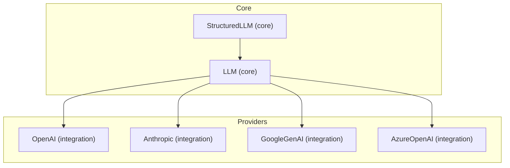
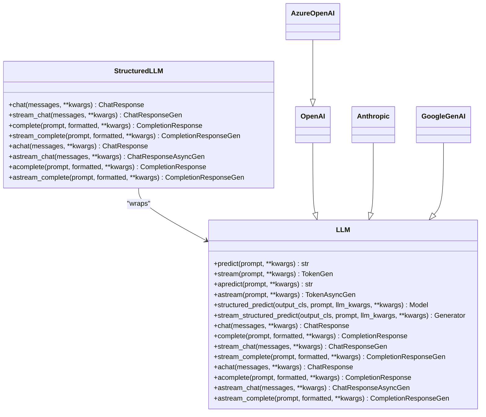
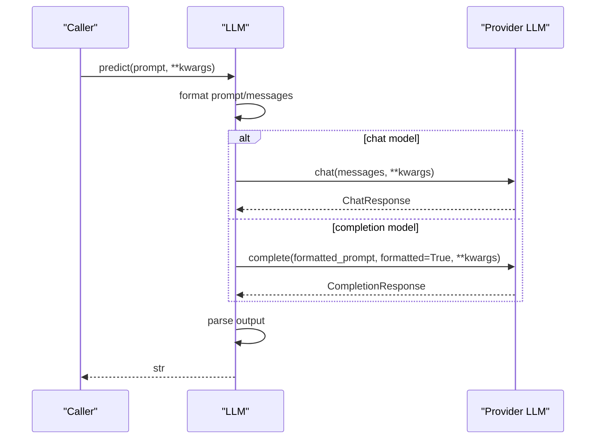
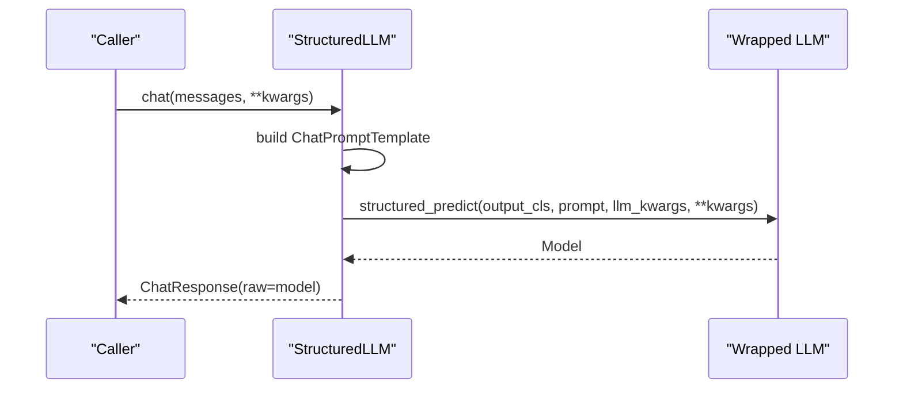
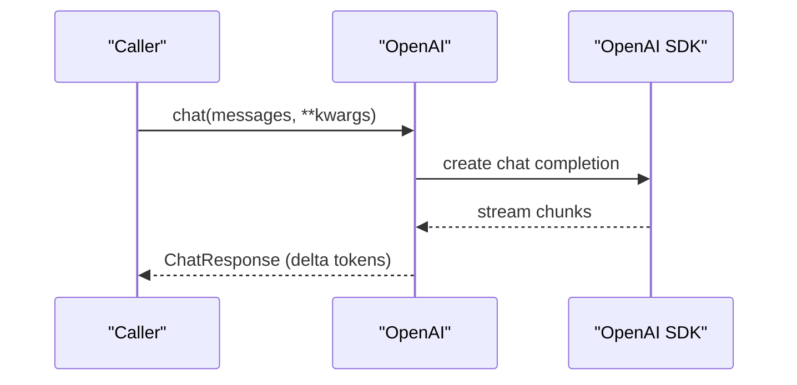
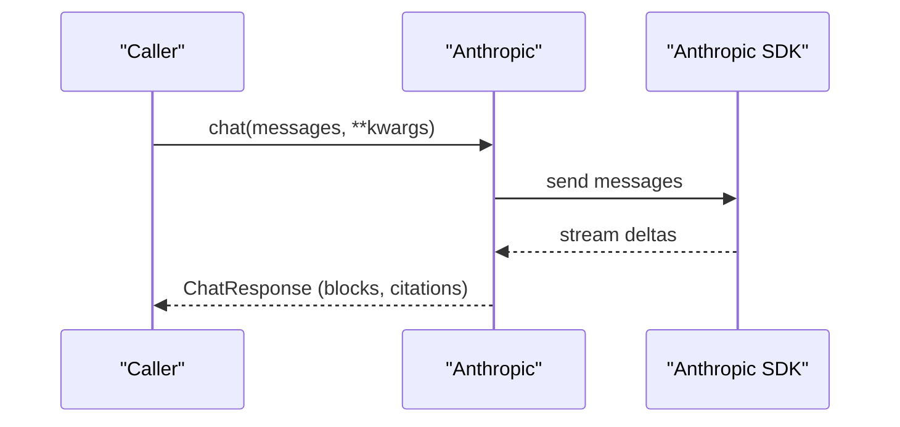
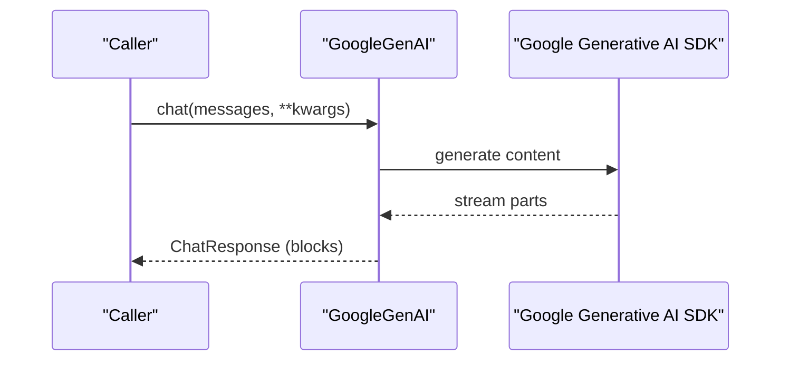
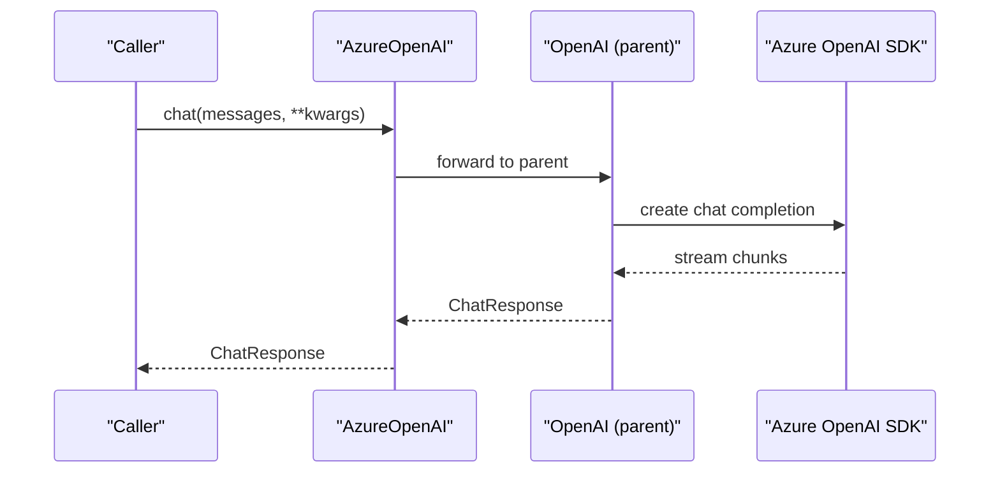
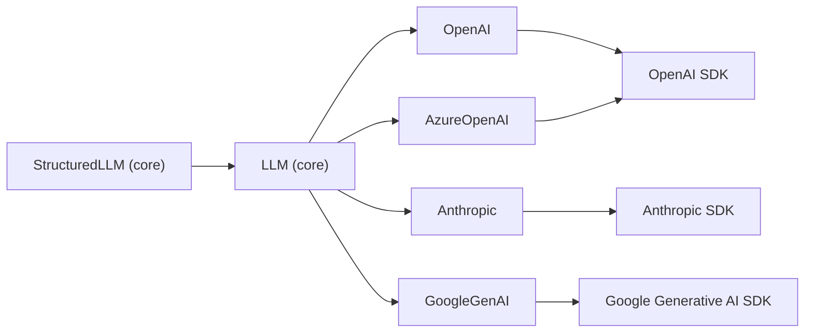

# LLM Provider APIs

<cite>
**Referenced Files in This Document**
- [llm.py](file://llama-index-core/llama_index/core/llms/llm.py)
- [structured_llm.py](file://llama-index-core/llama_index/core/llms/structured_llm.py)
- [base.py (OpenAI)](file://llama-index-integrations/llms/llama-index-llms-openai/llama_index/llms/openai/base.py)
- [base.py (Anthropic)](file://llama-index-integrations/llms/llama-index-llms-anthropic/llama_index/llms/anthropic/base.py)
- [base.py (GoogleGenAI)](file://llama-index-integrations/llms/llama-index-llms-google-genai/llama_index/llms/google_genai/base.py)
- [base.py (AzureOpenAI)](file://llama-index-integrations/llms/llama-index-llms-azure-openai/llama_index/llms/azure_openai/base.py)
- [__init__.py (OpenAI)](file://llama-index-integrations/llms/llama-index-llms-openai/llama_index/llms/openai/__init__.py)
- [__init__.py (Anthropic)](file://llama-index-integrations/llms/llama-index-llms-anthropic/llama_index/llms/anthropic/__init__.py)
- [__init__.py (GoogleGenAI)](file://llama-index-integrations/llms/llama-index-llms-google-genai/llama_index/llms/google_genai/__init__.py)
- [__init__.py (AzureOpenAI)](file://llama-index-integrations/llms/llama-index-llms-azure-openai/llama_index/llms/azure_openai/__init__.py)
</cite>

## Table of Contents
1. [Introduction](#introduction)
2. [Project Structure](#project-structure)
3. [Core Components](#core-components)
4. [Architecture Overview](#architecture-overview)
5. [Detailed Component Analysis](#detailed-component-analysis)
6. [Dependency Analysis](#dependency-analysis)
7. [Performance Considerations](#performance-considerations)
8. [Troubleshooting Guide](#troubleshooting-guide)
9. [Conclusion](#conclusion)

## Introduction
This document describes the unified LLM interface and provider implementations for OpenAI, Anthropic, Google GenAI, Azure OpenAI, and local models. It covers authentication, API endpoints, configuration options, rate limiting, error handling, retry mechanisms, streaming responses, function calling, structured output parsing, and provider-specific features such as prompt caching and vision capabilities. It also provides performance optimization and cost management strategies.

## Project Structure
The unified LLM interface is defined in the core module and provider-specific adapters live under the integrations tree. Providers expose consistent methods for chat, completion, streaming, and structured outputs while encapsulating provider-specific authentication and endpoint logic.

**Diagram sources**
- [llm.py](file://llama-index-core/llama_index/core/llms/llm.py#L163-L775)
- [structured_llm.py](file://llama-index-core/llama_index/core/llms/structured_llm.py#L32-L164)
- [base.py (OpenAI)](file://llama-index-integrations/llms/llama-index-llms-openai/llama_index/llms/openai/base.py#L139-L200)
- [base.py (Anthropic)](file://llama-index-integrations/llms/llama-index-llms-anthropic/llama_index/llms/anthropic/base.py#L116-L200)
- [base.py (GoogleGenAI)](file://llama-index-integrations/llms/llama-index-llms-google-genai/llama_index/llms/google_genai/base.py#L101-L200)
- [base.py (AzureOpenAI)](file://llama-index-integrations/llms/llama-index-llms-azure-openai/llama_index/llms/azure_openai/base.py#L20-L100)

**Section sources**
- [llm.py](file://llama-index-core/llama_index/core/llms/llm.py#L163-L775)
- [structured_llm.py](file://llama-index-core/llama_index/core/llms/structured_llm.py#L32-L164)
- [base.py (OpenAI)](file://llama-index-integrations/llms/llama-index-llms-openai/llama_index/llms/openai/base.py#L139-L200)
- [base.py (Anthropic)](file://llama-index-integrations/llms/llama-index-llms-anthropic/llama_index/llms/anthropic/base.py#L116-L200)
- [base.py (GoogleGenAI)](file://llama-index-integrations/llms/llama-index-llms-google-genai/llama_index/llms/google_genai/base.py#L101-L200)
- [base.py (AzureOpenAI)](file://llama-index-integrations/llms/llama-index-llms-azure-openai/llama_index/llms/azure_openai/base.py#L20-L100)

## Core Components
- Unified LLM interface: Provides predict, stream, apredict, astream, and structured prediction methods. Handles prompt/message formatting, system prompts, and output parsing.
- StructuredLLM: Wraps another LLM to enforce a fixed output schema for chat and streaming responses.
- Provider adapters: Implement provider-specific authentication, endpoint selection, function/tool calling, and streaming.

Key responsibilities:
- LLM: orchestration of prompts/messages, streaming token conversion, structured prediction, async variants, and tool selection fallback.
- StructuredLLM: converts chat messages into a prompt template and delegates to underlying LLM’s structured_predict/streamed variants.
- Providers: encapsulate SDK clients, authentication, retries, and provider-specific features.

**Section sources**
- [llm.py](file://llama-index-core/llama_index/core/llms/llm.py#L163-L775)
- [structured_llm.py](file://llama-index-core/llama_index/core/llms/structured_llm.py#L32-L164)

## Architecture Overview
The unified LLM interface exposes synchronous and asynchronous methods for chat and completion, plus streaming variants. Providers subclass the unified LLM to implement provider-specific logic. StructuredLLM composes an LLM to enforce a schema.

**Diagram sources**
- [llm.py](file://llama-index-core/llama_index/core/llms/llm.py#L163-L775)
- [structured_llm.py](file://llama-index-core/llama_index/core/llms/structured_llm.py#L32-L164)
- [base.py (OpenAI)](file://llama-index-integrations/llms/llama-index-llms-openai/llama_index/llms/openai/base.py#L139-L200)
- [base.py (Anthropic)](file://llama-index-integrations/llms/llama-index-llms-anthropic/llama_index/llms/anthropic/base.py#L116-L200)
- [base.py (GoogleGenAI)](file://llama-index-integrations/llms/llama-index-llms-google-genai/llama_index/llms/google_genai/base.py#L101-L200)
- [base.py (AzureOpenAI)](file://llama-index-integrations/llms/llama-index-llms-azure-openai/llama_index/llms/azure_openai/base.py#L20-L100)

## Detailed Component Analysis

### Unified LLM Interface (LLM)
- Methods:
  - Predict/stream/predict_and_call: orchestrates prompt formatting, system prompt injection, and output parsing.
  - Structured prediction: supports sync/async/streaming variants with a target schema.
  - Streaming token conversion: converts Chat/Completion streams to token generators.
- Configuration:
  - system_prompt, messages_to_prompt, completion_to_prompt, output_parser, pydantic_program_mode.
- Instrumentation and callbacks: events for templating and predictions.

**Diagram sources**
- [llm.py](file://llama-index-core/llama_index/core/llms/llm.py#L588-L631)

**Section sources**
- [llm.py](file://llama-index-core/llama_index/core/llms/llm.py#L163-L775)

### StructuredLLM
- Wraps an LLM to enforce a fixed output schema.
- Converts messages to a ChatPromptTemplate and delegates to structured_predict/streamed variants.
- Supports both sync and async streaming.

**Diagram sources**
- [structured_llm.py](file://llama-index-core/llama_index/core/llms/structured_llm.py#L52-L88)

**Section sources**
- [structured_llm.py](file://llama-index-core/llama_index/core/llms/structured_llm.py#L32-L164)

### OpenAI Provider
- Authentication:
  - API key via environment variable or constructor.
  - Optional custom base URL and version.
- Configuration:
  - model, temperature, max_tokens, logprobs/top_logprobs, additional_kwargs, max_retries, timeout, reuse_client, callback_manager, default_headers, http_client, async_http_client.
- Endpoints:
  - Chat/completion endpoints via OpenAI SDK.
- Function calling:
  - Uses FunctionCallingLLM utilities and tool choice resolution.
- Streaming:
  - Implements stream_chat/stream_complete and token conversion helpers.
- Retry:
  - Decorator-based retry with exponential backoff.

**Diagram sources**
- [base.py (OpenAI)](file://llama-index-integrations/llms/llama-index-llms-openai/llama_index/llms/openai/base.py#L139-L200)
- [llm.py](file://llama-index-core/llama_index/core/llms/llm.py#L634-L679)

**Section sources**
- [base.py (OpenAI)](file://llama-index-integrations/llms/llama-index-llms-openai/llama_index/llms/openai/base.py#L139-L200)
- [__init__.py (OpenAI)](file://llama-index-integrations/llms/llama-index-llms-openai/llama_index/llms/openai/__init__.py#L1-L5)

### Anthropic Provider
- Authentication:
  - API key or configured client; supports base_url override.
- Configuration:
  - model, temperature, max_tokens, timeout, max_retries, additional_kwargs, cache_idx (prompt caching), thinking_dict, tools, mcp_servers.
- Endpoints:
  - Uses Anthropic SDK; supports chat-style interactions and streaming deltas.
- Function calling:
  - Tool selection and tool call updates handled via provider utilities.
- Streaming:
  - Supports streaming with content blocks and thinking blocks.
- Retry:
  - Decorator-based retry with exponential backoff.

**Diagram sources**
- [base.py (Anthropic)](file://llama-index-integrations/llms/llama-index-llms-anthropic/llama_index/llms/anthropic/base.py#L116-L200)
- [llm.py](file://llama-index-core/llama_index/core/llms/llm.py#L634-L679)

**Section sources**
- [base.py (Anthropic)](file://llama-index-integrations/llms/llama-index-llms-anthropic/llama_index/llms/anthropic/base.py#L116-L200)
- [__init__.py (Anthropic)](file://llama-index-integrations/llms/llama-index-llms-anthropic/llama_index/llms/anthropic/__init__.py#L1-L4)

### Google GenAI Provider
- Authentication:
  - API key or Vertex AI credentials; supports OAuth and environment-based detection.
- Configuration:
  - model, temperature, context_window, max_retries, is_function_calling_model, cached_content, built_in_tool, file_mode (inline/fileapi/hybrid).
- Endpoints:
  - Uses Google Generative AI SDK; supports chat and completion via decorators.
- Function calling:
  - Schema conversion and flexible model handling for structured outputs.
- Streaming:
  - Streaming with flexible model handling for partial results.
- Retry:
  - Decorator-based retry with exponential backoff.

**Diagram sources**
- [base.py (GoogleGenAI)](file://llama-index-integrations/llms/llama-index-llms-google-genai/llama_index/llms/google_genai/base.py#L101-L200)
- [llm.py](file://llama-index-core/llama_index/core/llms/llm.py#L634-L679)

**Section sources**
- [base.py (GoogleGenAI)](file://llama-index-integrations/llms/llama-index-llms-google-genai/llama_index/llms/google_genai/base.py#L101-L200)
- [__init__.py (GoogleGenAI)](file://llama-index-integrations/llms/llama-index-llms-google-genai/llama_index/llms/google_genai/__init__.py#L1-L4)

### Azure OpenAI Provider
- Authentication:
  - Supports API key or Azure AD token provider; requires endpoint and API version.
- Configuration:
  - Inherits OpenAI configuration; adds engine/azure_endpoint/azure_deployment/use_azure_ad/azure_ad_token_provider/api_base.
- Endpoints:
  - Uses Azure OpenAI SDK; routes to appropriate deployment/engine.
- Validation:
  - Validates presence of required environment variables and API version.

**Diagram sources**
- [base.py (AzureOpenAI)](file://llama-index-integrations/llms/llama-index-llms-azure-openai/llama_index/llms/azure_openai/base.py#L20-L100)
- [base.py (OpenAI)](file://llama-index-integrations/llms/llama-index-llms-openai/llama_index/llms/openai/base.py#L139-L200)

**Section sources**
- [base.py (AzureOpenAI)](file://llama-index-integrations/llms/llama-index-llms-azure-openai/llama_index/llms/azure_openai/base.py#L20-L100)
- [__init__.py (AzureOpenAI)](file://llama-index-integrations/llms/llama-index-llms-azure-openai/llama_index/llms/azure_openai/__init__.py#L1-L8)

### Local Models
Local model integrations are available via dedicated packages (e.g., llama-cpp, ollama, lmstudio, localai). They typically expose the same unified LLM interface and can be used interchangeably with cloud providers.

[No sources needed since this section does not analyze specific files]

## Dependency Analysis
- LLM depends on core abstractions for messages, responses, and metadata.
- StructuredLLM depends on LLM and a target schema.
- Providers depend on their respective SDKs and share common patterns for retries, streaming, and function calling.

**Diagram sources**
- [llm.py](file://llama-index-core/llama_index/core/llms/llm.py#L163-L775)
- [structured_llm.py](file://llama-index-core/llama_index/core/llms/structured_llm.py#L32-L164)
- [base.py (OpenAI)](file://llama-index-integrations/llms/llama-index-llms-openai/llama_index/llms/openai/base.py#L139-L200)
- [base.py (Anthropic)](file://llama-index-integrations/llms/llama-index-llms-anthropic/llama_index/llms/anthropic/base.py#L116-L200)
- [base.py (GoogleGenAI)](file://llama-index-integrations/llms/llama-index-llms-google-genai/llama_index/llms/google_genai/base.py#L101-L200)
- [base.py (AzureOpenAI)](file://llama-index-integrations/llms/llama-index-llms-azure-openai/llama_index/llms/azure_openai/base.py#L20-L100)

**Section sources**
- [llm.py](file://llama-index-core/llama_index/core/llms/llm.py#L163-L775)
- [structured_llm.py](file://llama-index-core/llama_index/core/llms/structured_llm.py#L32-L164)
- [base.py (OpenAI)](file://llama-index-integrations/llms/llama-index-llms-openai/llama_index/llms/openai/base.py#L139-L200)
- [base.py (Anthropic)](file://llama-index-integrations/llms/llama-index-llms-anthropic/llama_index/llms/anthropic/base.py#L116-L200)
- [base.py (GoogleGenAI)](file://llama-index-integrations/llms/llama-index-llms-google-genai/llama_index/llms/google_genai/base.py#L101-L200)
- [base.py (AzureOpenAI)](file://llama-index-integrations/llms/llama-index-llms-azure-openai/llama_index/llms/azure_openai/base.py#L20-L100)

## Performance Considerations
- Streaming:
  - Prefer streaming for latency-sensitive applications; convert to token streams using provided helpers.
- Retries:
  - Configure max_retries and timeouts per provider; exponential backoff reduces thundering herd.
- Client reuse:
  - Reuse clients for high-volume async calls to reduce overhead.
- Output parsing:
  - Avoid output parsers with streaming; they are not supported for streaming responses.
- Structured outputs:
  - Use StructuredLLM to reduce parsing overhead and ensure schema compliance.
- Cost management:
  - Monitor token usage via provider logs and context windows; cap max_tokens and tune temperature.
  - Use function/tool calling to minimize back-and-forth and reduce total tokens.

[No sources needed since this section provides general guidance]

## Troubleshooting Guide
- Authentication failures:
  - Verify environment variables and API keys for each provider.
  - For Azure OpenAI, confirm endpoint, API version, and token provider configuration.
- Rate limits and timeouts:
  - Increase max_retries and adjust timeout; implement backoff strategies.
- Streaming issues:
  - Ensure output parser is not set for streaming; structured streaming is supported but not with output parser.
- Function/tool calling:
  - Confirm provider supports function calling and tool definitions; validate tool_choice and schema compatibility.
- Structured outputs:
  - Ensure the target schema matches provider capabilities; use StructuredLLM for consistent behavior.

**Section sources**
- [base.py (OpenAI)](file://llama-index-integrations/llms/llama-index-llms-openai/llama_index/llms/openai/base.py#L139-L200)
- [base.py (Anthropic)](file://llama-index-integrations/llms/llama-index-llms-anthropic/llama_index/llms/anthropic/base.py#L116-L200)
- [base.py (GoogleGenAI)](file://llama-index-integrations/llms/llama-index-llms-google-genai/llama_index/llms/google_genai/base.py#L101-L200)
- [base.py (AzureOpenAI)](file://llama-index-integrations/llms/llama-index-llms-azure-openai/llama_index/llms/azure_openai/base.py#L20-L100)
- [llm.py](file://llama-index-core/llama_index/core/llms/llm.py#L634-L679)

## Conclusion
The unified LLM interface enables consistent interaction across providers while preserving provider-specific capabilities. By leveraging structured outputs, streaming, and robust retry mechanisms, applications can achieve high performance and reliability. Choose providers based on feature needs (function calling, vision, caching) and operational constraints (authentication, latency, cost).