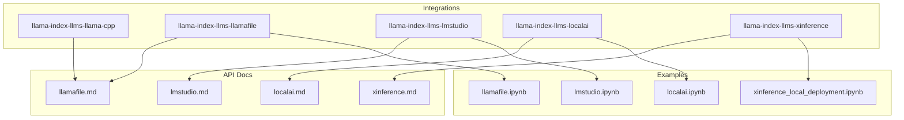
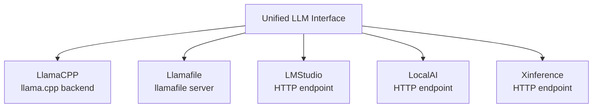
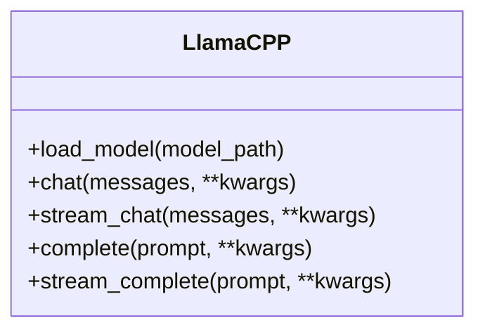
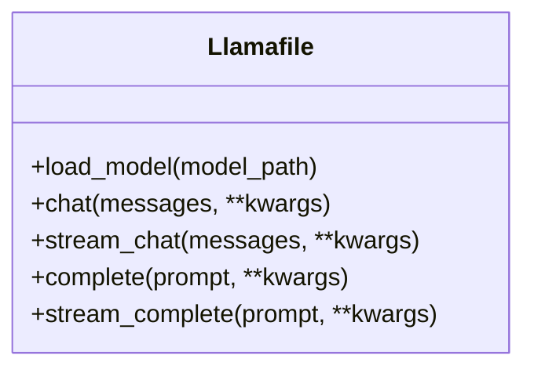
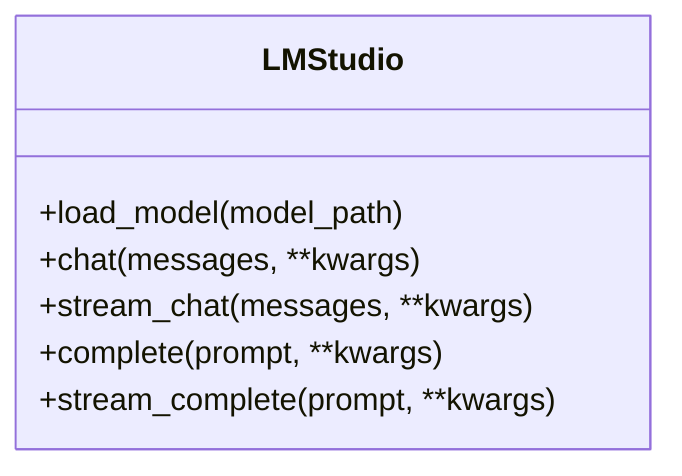
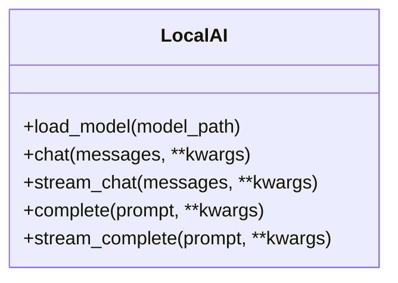
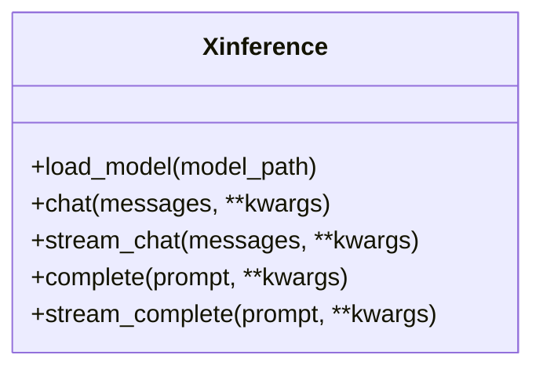
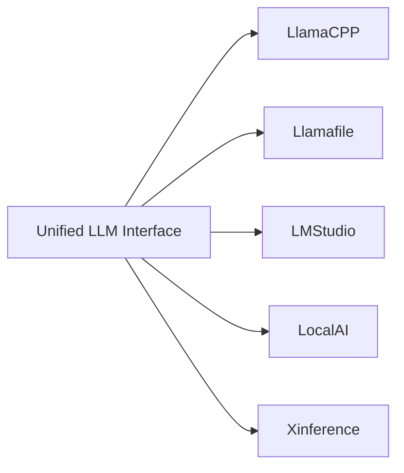

# Local and Custom Providers

<cite>
**Referenced Files in This Document**
- [llama_cpp/__init__.py](file://llama-index-integrations/llms/llama-index-llms-llama-cpp/llama_index/llms/llama_cpp/__init__.py)
- [llamafile/__init__.py](file://llama-index-integrations/llms/llama-index-llms-llamafile/llama_index/llms/llamafile/__init__.py)
- [lmstudio/__init__.py](file://llama-index-integrations/llms/llama-index-llms-lmstudio/llama_index/llms/lmstudio/__init__.py)
- [localai/__init__.py](file://llama-index-integrations/llms/llama-index-llms-localai/llama_index/llms/localai/__init__.py)
- [xinference/__init__.py](file://llama-index-integrations/llms/llama-index-llms-xinference/llama_index/llms/xinference/__init__.py)
- [llamafile.md](file://docs/api_reference/api_reference/llms/llamafile.md)
- [lmstudio.md](file://docs/api_reference/api_reference/llms/lmstudio.md)
- [localai.md](file://docs/api_reference/api_reference/llms/localai.md)
- [xinference.md](file://docs/api_reference/api_reference/llms/xinference.md)
- [llamafile.ipynb](file://docs/examples/llm/llamafile.ipynb)
- [lmstudio.ipynb](file://docs/examples/llm/lmstudio.ipynb)
- [localai.ipynb](file://docs/examples/llm/localai.ipynb)
- [xinference_local_deployment.ipynb](file://docs/examples/llm/xinference_local_deployment.ipynb)
- [test_llms_llamafile.py](file://llama-index-integrations/llms/llama-index-llms-llamafile/tests/test_llms_llamafile.py)
- [test_llms_lmstudio.py](file://llama-index-integrations/llms/llama-index-llms-lmstudio/tests/test_llms_lmstudio.py)
- [test_llms_localai.py](file://llama-index-integrations/llms/llama-index-llms-localai/tests/test_llms_localai.py)
- [test_llms_xinference.py](file://llama-index-integrations/llama-index-integrations/llms/llama-index-llms-xinference/tests/test_llms_xinference.py)
</cite>

## Table of Contents
1. [Introduction](#introduction)
2. [Project Structure](#project-structure)
3. [Core Components](#core-components)
4. [Architecture Overview](#architecture-overview)
5. [Detailed Component Analysis](#detailed-component-analysis)
6. [Dependency Analysis](#dependency-analysis)
7. [Performance Considerations](#performance-considerations)
8. [Troubleshooting Guide](#troubleshooting-guide)
9. [Conclusion](#conclusion)
10. [Appendices](#appendices)

## Introduction
This document provides comprehensive API documentation for local and custom Large Language Model (LLM) providers integrated in the repository. It covers self-hosted deployment patterns for llama.cpp, llamafile, LM Studio, LocalAI, and Xinference. It explains model loading, resource management, GPU acceleration, memory optimization, and performance tuning. It also documents custom LLM development patterns and integration with the unified LLM interface, along with deployment strategies tailored to different hardware configurations.

## Project Structure
The repository organizes LLM integrations under dedicated packages per provider. Each integration exposes a primary class that implements the unified LLM interface. Provider-specific documentation and examples are included alongside the integration modules.

**Diagram sources**
- [llama_cpp/__init__.py](file://llama-index-integrations/llms/llama-index-llms-llama-cpp/llama_index/llms/llama_cpp/__init__.py#L1-L4)
- [llamafile/__init__.py](file://llama-index-integrations/llms/llama-index-llms-llamafile/llama_index/llms/llamafile/__init__.py#L1-L4)
- [lmstudio/__init__.py](file://llama-index-integrations/llms/llama-index-llms-lmstudio/llama_index/llms/lmstudio/__init__.py#L1-L4)
- [localai/__init__.py](file://llama-index-integrations/llms/llama-index-llms-localai/llama_index/llms/localai/__init__.py#L1-L4)
- [xinference/__init__.py](file://llama-index-integrations/llms/llama-index-llms-xinference/llama_index/llms/xinference/__init__.py#L1-L4)
- [llamafile.md](file://docs/api_reference/api_reference/llms/llamafile.md)
- [lmstudio.md](file://docs/api_reference/api_reference/llms/lmstudio.md)
- [localai.md](file://docs/api_reference/api_reference/llms/localai.md)
- [xinference.md](file://docs/api_reference/api_reference/llms/xinference.md)
- [llamafile.ipynb](file://docs/examples/llm/llamafile.ipynb)
- [lmstudio.ipynb](file://docs/examples/llm/lmstudio.ipynb)
- [localai.ipynb](file://docs/examples/llm/localai.ipynb)
- [xinference_local_deployment.ipynb](file://docs/examples/llm/xinference_local_deployment.ipynb)

**Section sources**
- [llama_cpp/__init__.py](file://llama-index-integrations/llms/llama-index-llms-llama-cpp/llama_index/llms/llama_cpp/__init__.py#L1-L4)
- [llamafile/__init__.py](file://llama-index-integrations/llms/llama-index-llms-llamafile/llama_index/llms/llamafile/__init__.py#L1-L4)
- [lmstudio/__init__.py](file://llama-index-integrations/llms/llama-index-llms-lmstudio/llama_index/llms/lmstudio/__init__.py#L1-L4)
- [localai/__init__.py](file://llama-index-integrations/llms/llama-index-llms-localai/llama_index/llms/localai/__init__.py#L1-L4)
- [xinference/__init__.py](file://llama-index-integrations/llms/llama-index-llms-xinference/llama_index/llms/xinference/__init__.py#L1-L4)

## Core Components
Each provider integration exports a single primary class implementing the unified LLM interface. These classes encapsulate provider-specific configuration, model loading, and inference execution.

- llama.cpp integration exports LlamaCPP
- llamafile integration exports Llamafile
- LM Studio integration exports LMStudio
- LocalAI integration exports LocalAI
- Xinference integration exports Xinference

These classes are the primary entry points for local and custom LLM deployments.

**Section sources**
- [llama_cpp/__init__.py](file://llama-index-integrations/llms/llama-index-llms-llama-cpp/llama_index/llms/llama_cpp/__init__.py#L1-L4)
- [llamafile/__init__.py](file://llama-index-integrations/llms/llama-index-llms-llamafile/llama_index/llms/llamafile/__init__.py#L1-L4)
- [lmstudio/__init__.py](file://llama-index-integrations/llms/llama-index-llms-lmstudio/llama_index/llms/lmstudio/__init__.py#L1-L4)
- [localai/__init__.py](file://llama-index-integrations/llms/llama-index-llms-localai/llama_index/llms/localai/__init__.py#L1-L4)
- [xinference/__init__.py](file://llama-index-integrations/llms/llama-index-llms-xinference/llama_index/llms/xinference/__init__.py#L1-L4)

## Architecture Overview
The unified LLM interface enables consistent usage across providers. Each provider’s implementation wraps provider-specific clients or binaries and translates common LLM operations into provider-native calls.

**Diagram sources**
- [llama_cpp/__init__.py](file://llama-index-integrations/llms/llama-index-llms-llama-cpp/llama_index/llms/llama_cpp/__init__.py#L1-L4)
- [llamafile/__init__.py](file://llama-index-integrations/llms/llama-index-llms-llamafile/llama_index/llms/llamafile/__init__.py#L1-L4)
- [lmstudio/__init__.py](file://llama-index-integrations/llms/llama-index-llms-lmstudio/llama_index/llms/lmstudio/__init__.py#L1-L4)
- [localai/__init__.py](file://llama-index-integrations/llms/llama-index-llms-localai/llama_index/llms/localai/__init__.py#L1-L4)
- [xinference/__init__.py](file://llama-index-integrations/llms/llama-index-llms-xinference/llama_index/llms/xinference/__init__.py#L1-L4)

## Detailed Component Analysis

### llama.cpp Integration
- Exposes LlamaCPP via the integration module.
- Supports local model execution using the llama.cpp runtime.
- Typical use cases include CPU/GPU inference with configurable model paths and generation parameters.

**Diagram sources**
- [llama_cpp/__init__.py](file://llama-index-integrations/llms/llama-index-llms-llama-cpp/llama_index/llms/llama_cpp/__init__.py#L1-L4)

**Section sources**
- [llama_cpp/__init__.py](file://llama-index-integrations/llms/llama-index-llms-llama-cpp/llama_index/llms/llama_cpp/__init__.py#L1-L4)

### llamafile Integration
- Exposes Llamafile via the integration module.
- Provides a lightweight HTTP server for local inference with a simple client interface.
- Useful for quick local deployments and rapid prototyping.

**Diagram sources**
- [llamafile/__init__.py](file://llama-index-integrations/llms/llama-index-llms-llamafile/llama_index/llms/llamafile/__init__.py#L1-L4)

**Section sources**
- [llamafile/__init__.py](file://llama-index-integrations/llms/llama-index-llms-llamafile/llama_index/llms/llamafile/__init__.py#L1-L4)
- [llamafile.md](file://docs/api_reference/api_reference/llms/llamafile.md)
- [llamafile.ipynb](file://docs/examples/llm/llamafile.ipynb)

### LM Studio Integration
- Exposes LMStudio via the integration module.
- Connects to LM Studio’s local HTTP server for inference.
- Suitable for Windows/macOS environments where LM Studio is preferred.

**Diagram sources**
- [lmstudio/__init__.py](file://llama-index-integrations/llms/llama-index-llms-lmstudio/llama_index/llms/lmstudio/__init__.py#L1-L4)

**Section sources**
- [lmstudio/__init__.py](file://llama-index-integrations/llms/llama-index-llms-lmstudio/llama_index/llms/lmstudio/__init__.py#L1-L4)
- [lmstudio.md](file://docs/api_reference/api_reference/llms/lmstudio.md)
- [lmstudio.ipynb](file://docs/examples/llm/lmstudio.ipynb)

### LocalAI Integration
- Exposes LocalAI via the integration module.
- Connects to LocalAI’s HTTP server for OpenAI-compatible endpoints.
- Ideal for heterogeneous model serving stacks and standardized API compatibility.

**Diagram sources**
- [localai/__init__.py](file://llama-index-integrations/llms/llama-index-llms-localai/llama_index/llms/localai/__init__.py#L1-L4)

**Section sources**
- [localai/__init__.py](file://llama-index-integrations/llms/llama-index-llms-localai/llama_index/llms/localai/__init__.py#L1-L4)
- [localai.md](file://docs/api_reference/api_reference/llms/localai.md)
- [localai.ipynb](file://docs/examples/llm/localai.ipynb)

### Xinference Integration
- Exposes Xinference via the integration module.
- Connects to Xinference’s HTTP server for distributed model serving.
- Supports local deployments and advanced orchestration features.

**Diagram sources**
- [xinference/__init__.py](file://llama-index-integrations/llms/llama-index-llms-xinference/llama_index/llms/xinference/__init__.py#L1-L4)

**Section sources**
- [xinference/__init__.py](file://llama-index-integrations/llms/llama-index-llms-xinference/llama_index/llms/xinference/__init__.py#L1-L4)
- [xinference.md](file://docs/api_reference/api_reference/llms/xinference.md)
- [xinference_local_deployment.ipynb](file://docs/examples/llm/xinference_local_deployment.ipynb)

## Dependency Analysis
Provider integrations depend on the unified LLM interface and provider-specific clients or servers. The following diagram shows how each integration maps to its provider implementation.

**Diagram sources**
- [llama_cpp/__init__.py](file://llama-index-integrations/llms/llama-index-llms-llama-cpp/llama_index/llms/llama_cpp/__init__.py#L1-L4)
- [llamafile/__init__.py](file://llama-index-integrations/llms/llama-index-llms-llamafile/llama_index/llms/llamafile/__init__.py#L1-L4)
- [lmstudio/__init__.py](file://llama-index-integrations/llms/llama-index-llms-lmstudio/llama_index/llms/lmstudio/__init__.py#L1-L4)
- [localai/__init__.py](file://llama-index-integrations/llms/llama-index-llms-localai/llama_index/llms/localai/__init__.py#L1-L4)
- [xinference/__init__.py](file://llama-index-integrations/llms/llama-index-llms-xinference/llama_index/llms/xinference/__init__.py#L1-L4)

**Section sources**
- [llama_cpp/__init__.py](file://llama-index-integrations/llms/llama-index-llms-llama-cpp/llama_index/llms/llama_cpp/__init__.py#L1-L4)
- [llamafile/__init__.py](file://llama-index-integrations/llms/llama-index-llms-llamafile/llama_index/llms/llamafile/__init__.py#L1-L4)
- [lmstudio/__init__.py](file://llama-index-integrations/llms/llama-index-llms-lmstudio/llama_index/llms/lmstudio/__init__.py#L1-L4)
- [localai/__init__.py](file://llama-index-integrations/llms/llama-index-llms-localai/llama_index/llms/localai/__init__.py#L1-L4)
- [xinference/__init__.py](file://llama-index-integrations/llms/llama-index-llms-xinference/llama_index/llms/xinference/__init__.py#L1-L4)

## Performance Considerations
- GPU acceleration: Enable GPU support in provider-specific configurations when available (e.g., CUDA-enabled llama.cpp builds, NVIDIA GPUs for Xinference).
- Memory optimization: Reduce context window sizes, enable model quantization, and tune batch sizes to fit device memory constraints.
- Quantization: Use INT4/INT8 or GGUF quantized models to reduce memory footprint and improve throughput.
- Resource management: Monitor VRAM/CPU utilization and adjust concurrency limits and request timeouts accordingly.
- Streaming: Prefer streaming APIs for long-running generations to improve perceived latency.

[No sources needed since this section provides general guidance]

## Troubleshooting Guide
- Verify provider connectivity: Ensure the local server or binary is running and reachable at the configured endpoint/port.
- Model path resolution: Confirm model paths are accessible and compatible with the provider’s expectations.
- Authentication and headers: Some providers require specific headers or tokens; configure them according to provider documentation.
- Logs and errors: Inspect provider logs and return error codes for detailed diagnostics.

**Section sources**
- [test_llms_llamafile.py](file://llama-index-integrations/llms/llama-index-llms-llamafile/tests/test_llms_llamafile.py)
- [test_llms_lmstudio.py](file://llama-index-integrations/llms/llama-index-llms-lmstudio/tests/test_llms_lmstudio.py)
- [test_llms_localai.py](file://llama-index-integrations/llms/llama-index-llms-localai/tests/test_llms_localai.py)
- [test_llms_xinference.py](file://llama-index-integrations/llama-index-integrations/llms/llama-index-llms-xinference/tests/test_llms_xinference.py)

## Conclusion
The repository provides robust, unified integrations for deploying and consuming local and custom LLMs across multiple providers. By leveraging the documented APIs and examples, teams can implement efficient, scalable local inference setups with GPU acceleration, memory optimization, and flexible deployment strategies.

[No sources needed since this section summarizes without analyzing specific files]

## Appendices
- Example notebooks demonstrate practical setup and usage for each provider.
- API reference documents outline provider-specific configuration options and parameters.

**Section sources**
- [llamafile.ipynb](file://docs/examples/llm/llamafile.ipynb)
- [lmstudio.ipynb](file://docs/examples/llm/lmstudio.ipynb)
- [localai.ipynb](file://docs/examples/llm/localai.ipynb)
- [xinference_local_deployment.ipynb](file://docs/examples/llm/xinference_local_deployment.ipynb)