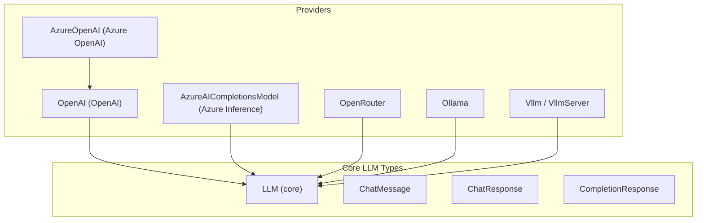
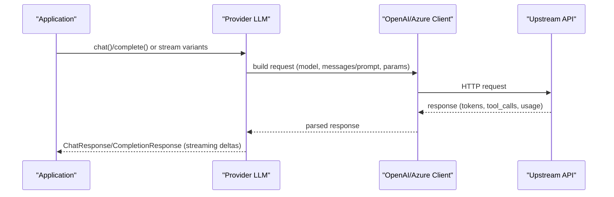
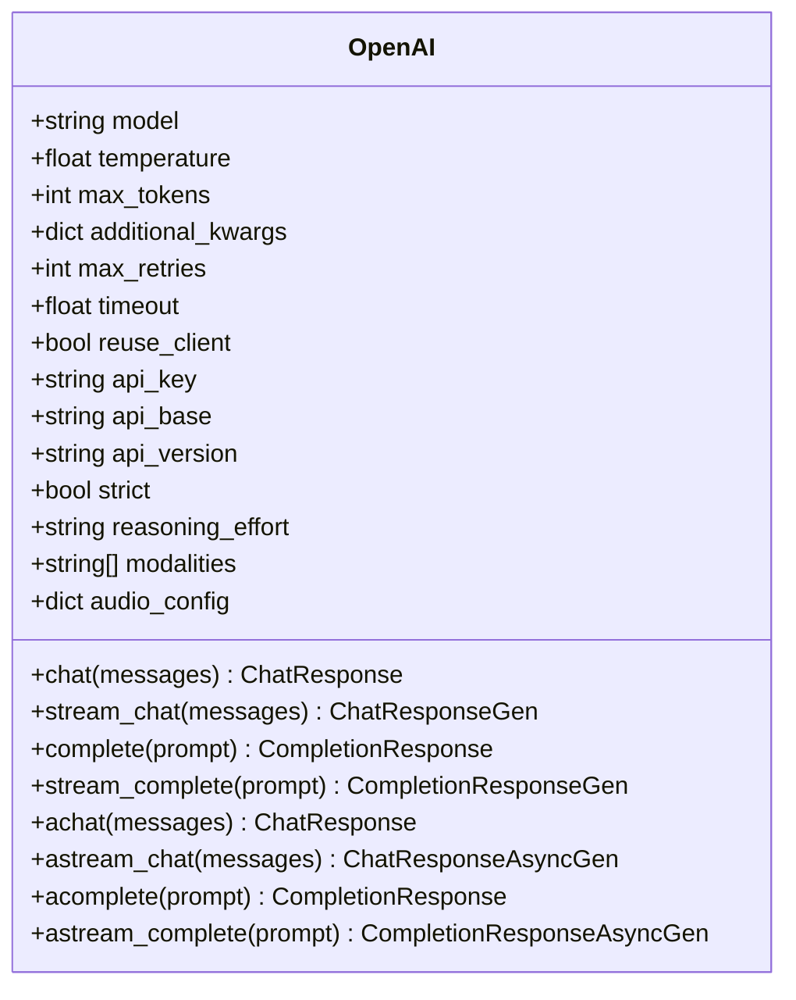
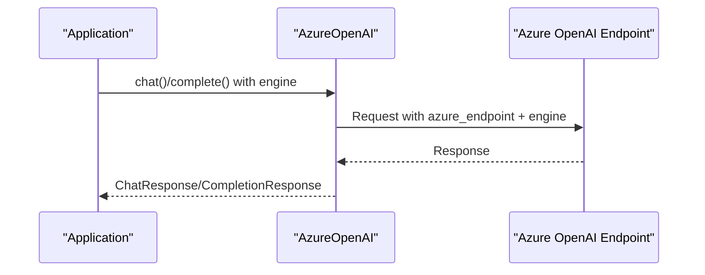
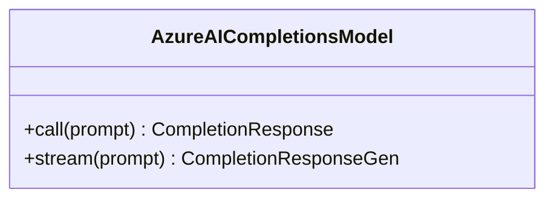
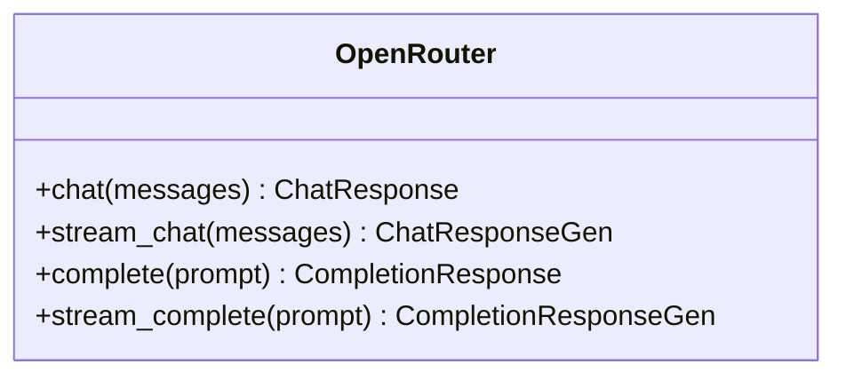
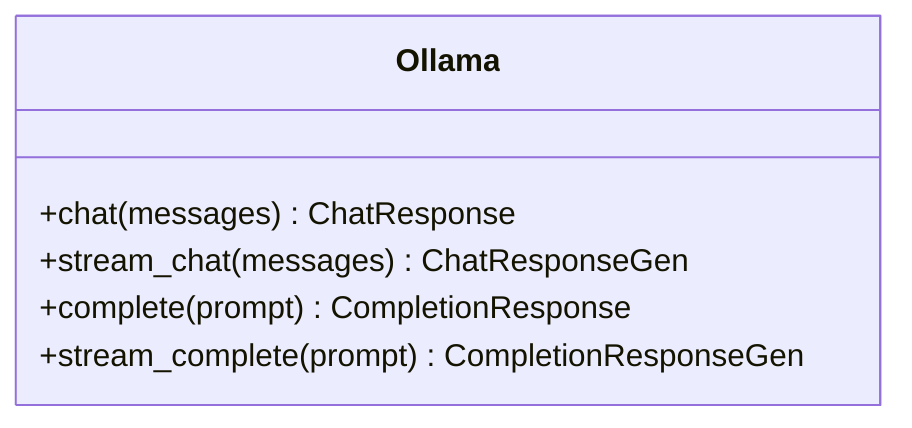
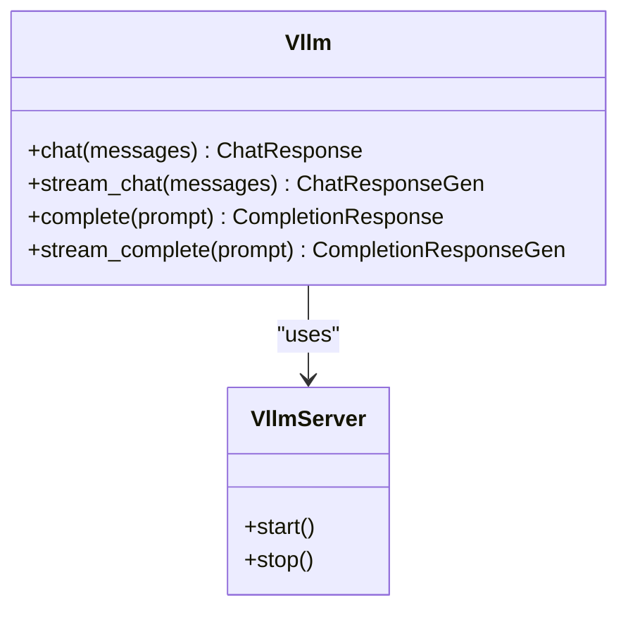
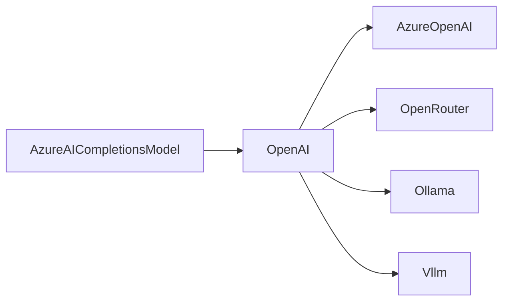

# OpenAI Family Providers

<cite>
**Referenced Files in This Document**
- [base.py](file://llama-index-integrations/llms/llama-index-llms-openai/llama_index/llms/openai/base.py)
- [base.py](file://llama-index-integrations/llms/llama-index-llms-azure-openai/llama_index/llms/azure_openai/base.py)
- [base.py](file://llama-index-integrations/llms/llama-index-llms-azure-inference/llama_index/llms/azure_inference/base.py)
- [base.py](file://llama-index-integrations/llms/llama-index-llms-openrouter/llama_index/llms/openrouter/base.py)
- [base.py](file://llama-index-integrations/llms/llama-index-llms-ollama/llama_index/llms/ollama/base.py)
- [base.py](file://llama-index-integrations/llms/llama-index-llms-vllm/llama_index/llms/vllm/base.py)
- [__init__.py](file://llama-index-integrations/llms/llama-index-llms-openai/llama_index/llms/openai/__init__.py)
- [__init__.py](file://llama-index-integrations/llms/llama-index-llms-azure-openai/llama_index/llms/azure_openai/__init__.py)
- [__init__.py](file://llama-index-integrations/llms/llama-index-llms-azure-inference/llama_index/llms/azure_inference/__init__.py)
- [__init__.py](file://llama-index-integrations/llms/llama-index-llms-openrouter/llama_index/llms/openrouter/__init__.py)
- [__init__.py](file://llama-index-integrations/llms/llama-index-llms-ollama/llama_index/llms/ollama/__init__.py)
- [__init__.py](file://llama-index-integrations/llms/llama-index-llms-vllm/llama_index/llms/vllm/__init__.py)
- [openai.md](file://docs/api_reference/api_reference/llms/openai.md)
- [azure_openai.md](file://docs/api_reference/api_reference/llms/azure_openai.md)
- [azure_inference.md](file://docs/api_reference/api_reference/llms/azure_inference.md)
- [openrouter.md](file://docs/api_reference/api_reference/llms/openrouter.md)
- [ollama.md](file://docs/api_reference/api_reference/llms/ollama.md)
- [vllm.md](file://docs/api_reference/api_reference/llms/vllm.md)
- [openai_responses.md](file://docs/api_reference/api_reference/llms/openai_responses.md)
- [openai_like.md](file://docs/api_reference/api_reference/llms/openai_like.md)
- [openai.md](file://docs/examples/llm/openai.ipynb)
- [azure_openai.ipynb](file://docs/examples/llm/azure_openai.ipynb)
- [openrouter.ipynb](file://docs/examples/llm/openrouter.ipynb)
- [ollama.ipynb](file://docs/examples/llm/ollama.ipynb)
- [vllm.ipynb](file://docs/examples/llm/vllm.ipynb)
- [openai_json_vs_function_calling.ipynb](file://docs/examples/llm/openai_json_vs_function_calling.ipynb)
- [openai_responses.ipynb](file://docs/examples/llm/openai_responses.ipynb)
</cite>

## Table of Contents
1. [Introduction](#introduction)
2. [Project Structure](#project-structure)
3. [Core Components](#core-components)
4. [Architecture Overview](#architecture-overview)
5. [Detailed Component Analysis](#detailed-component-analysis)
6. [Dependency Analysis](#dependency-analysis)
7. [Performance Considerations](#performance-considerations)
8. [Troubleshooting Guide](#troubleshooting-guide)
9. [Conclusion](#conclusion)
10. [Appendices](#appendices)

## Introduction
This document provides comprehensive API documentation for OpenAI family Large Language Model (LLM) providers integrated in the repository. It covers:
- Provider families: OpenAI, Azure OpenAI, Azure Inference, OpenRouter, Ollama, and vLLM
- Authentication mechanisms: API keys and Azure Entra ID (formerly Azure AD) token provider
- Model selection syntax and provider-specific features
- Function calling, structured outputs, and streaming responses
- Rate limiting, error handling, and retry strategies
- Differences between hosted and self-hosted deployments
- Configuration examples and performance optimization techniques

## Project Structure
The OpenAI family providers are implemented as separate packages under the LlamaIndex ecosystem. Each provider exposes a primary class and a public initializer for easy consumption. The core LLM interface and shared types are defined in the core module.

**Diagram sources**
- [base.py](file://llama-index-integrations/llms/llama-index-llms-openai/llama_index/llms/openai/base.py#L139-L392)
- [base.py](file://llama-index-integrations/llms/llama-index-llms-azure-openai/llama_index/llms/azure_openai/base.py#L20-L266)
- [base.py](file://llama-index-integrations/llms/llama-index-llms-azure-inference/llama_index/llms/azure_inference/base.py#L1-L40)
- [base.py](file://llama-index-integrations/llms/llama-index-llms-openrouter/llama_index/llms/openrouter/base.py#L1-L40)
- [base.py](file://llama-index-integrations/llms/llama-index-llms-ollama/llama_index/llms/ollama/base.py#L1-L40)
- [base.py](file://llama-index-integrations/llms/llama-index-llms-vllm/llama_index/llms/vllm/base.py#L1-L40)

**Section sources**
- [__init__.py](file://llama-index-integrations/llms/llama-index-llms-openai/llama_index/llms/openai/__init__.py#L1-L5)
- [__init__.py](file://llama-index-integrations/llms/llama-index-llms-azure-openai/llama_index/llms/azure_openai/__init__.py#L1-L8)
- [__init__.py](file://llama-index-integrations/llms/llama-index-llms-azure-inference/llama_index/llms/azure_inference/__init__.py#L1-L4)
- [__init__.py](file://llama-index-integrations/llms/llama-index-llms-openrouter/llama_index/llms/openrouter/__init__.py#L1-L4)
- [__init__.py](file://llama-index-integrations/llms/llama-index-llms-ollama/llama_index/llms/ollama/__init__.py#L1-L4)
- [__init__.py](file://llama-index-integrations/llms/llama-index-llms-vllm/llama_index/llms/vllm/__init__.py#L1-L4)

## Core Components
- OpenAI: Implements chat and completion APIs, supports streaming, function/tool calling, logprobs, and modalities (text/audio). Provides sync and async variants and integrates with tiktoken for token counting.
- Azure OpenAI: Extends OpenAI with Azure-specific parameters (engine/deployment, endpoint, API version, optional Azure AD token provider). Validates environment and credentials.
- Azure Inference: Exposes a dedicated model class for Azure AI completions.
- OpenRouter: Provider wrapper for routing to multiple upstreams via OpenRouter’s API.
- Ollama: Self-hosted inference via Ollama’s local API.
- vLLM: Self-hosted inference via vLLM’s OpenAI-compatible server.

Key capabilities across providers:
- Authentication via API keys or Azure AD token provider
- Model selection via model/engine fields
- Streaming responses for both chat and completion
- Function/tool calling support
- Structured outputs via JSON schema and Pydantic modes
- Retry strategies and timeouts
- Token usage reporting

**Section sources**
- [base.py](file://llama-index-integrations/llms/llama-index-llms-openai/llama_index/llms/openai/base.py#L139-L392)
- [base.py](file://llama-index-integrations/llms/llama-index-llms-azure-openai/llama_index/llms/azure_openai/base.py#L20-L266)
- [base.py](file://llama-index-integrations/llms/llama-index-llms-azure-inference/llama_index/llms/azure_inference/base.py#L1-L40)
- [base.py](file://llama-index-integrations/llms/llama-index-llms-openrouter/llama_index/llms/openrouter/base.py#L1-L40)
- [base.py](file://llama-index-integrations/llms/llama-index-llms-ollama/llama_index/llms/ollama/base.py#L1-L40)
- [base.py](file://llama-index-integrations/llms/llama-index-llms-vllm/llama_index/llms/vllm/base.py#L1-L40)

## Architecture Overview
The providers share a common LLM interface and rely on OpenAI-compatible clients. Azure OpenAI leverages Azure-specific clients and environment resolution. Self-hosted providers (Ollama, vLLM) expose OpenAI-compatible endpoints locally.

**Diagram sources**
- [base.py](file://llama-index-integrations/llms/llama-index-llms-openai/llama_index/llms/openai/base.py#L394-L522)
- [base.py](file://llama-index-integrations/llms/llama-index-llms-azure-openai/llama_index/llms/azure_openai/base.py#L202-L261)

## Detailed Component Analysis

### OpenAI Provider
- Purpose: Hosted OpenAI API with chat/completion endpoints, streaming, function/tool calling, and modalities.
- Key parameters:
  - model, temperature, max_tokens, additional_kwargs
  - max_retries, timeout, reuse_client
  - api_key, api_base, api_version
  - strict, reasoning_effort, modalities, audio_config
- Notable features:
  - Automatic detection of chat vs. completion models
  - O1-specific handling for max_completion_tokens and reasoning_effort
  - Logprobs support for chat and completion
  - Tokenizer integration via tiktoken
  - Token usage extraction from response
- Streaming:
  - Streamed chunks yield deltas for text and tool calls
  - Audio modality not supported for streaming chat
- Function calling and structured outputs:
  - Supports tool_calls in streaming and non-streaming responses
  - Strict mode and JSON schema support for structured outputs
- Authentication:
  - API key via constructor/env or custom HTTP client
- Error handling and retries:
  - Retry decorator applied to all LLM calls
  - Configurable max_retries and exponential backoff

**Diagram sources**
- [base.py](file://llama-index-integrations/llms/llama-index-llms-openai/llama_index/llms/openai/base.py#L139-L392)

**Section sources**
- [base.py](file://llama-index-integrations/llms/llama-index-llms-openai/llama_index/llms/openai/base.py#L139-L392)
- [openai.md](file://docs/api_reference/api_reference/llms/openai.md)
- [openai.ipynb](file://docs/examples/llm/openai.ipynb)
- [openai_json_vs_function_calling.ipynb](file://docs/examples/llm/openai_json_vs_function_calling.ipynb)
- [openai_responses.ipynb](file://docs/examples/llm/openai_responses.ipynb)

### Azure OpenAI Provider
- Purpose: Azure-hosted OpenAI with deployment-specific engine selection and optional Azure AD authentication.
- Key parameters:
  - engine (deployment name), azure_endpoint, api_version
  - use_azure_ad, azure_ad_token_provider
  - api_key, api_base, additional_kwargs
- Validation:
  - Requires api_version and either api_key or Azure AD token provider
  - Prevents accidental use of OpenAI base URL without Azure endpoint
- Authentication:
  - API key or Managed Identity via Azure AD token provider
- Model selection:
  - Uses engine field for deployment name in requests
- Streaming and function calling:
  - Inherits OpenAI streaming and tool calling behavior

**Diagram sources**
- [base.py](file://llama-index-integrations/llms/llama-index-llms-azure-openai/llama_index/llms/azure_openai/base.py#L20-L266)

**Section sources**
- [base.py](file://llama-index-integrations/llms/llama-index-llms-azure-openai/llama_index/llms/azure_openai/base.py#L20-L266)
- [azure_openai.md](file://docs/api_reference/api_reference/llms/azure_openai.md)
- [azure_openai.ipynb](file://docs/examples/llm/azure_openai.ipynb)

### Azure Inference Provider
- Purpose: Azure AI Completions model integration.
- Key parameters:
  - Model class exposed for completions
- Notes:
  - Designed for Azure AI completions API

**Diagram sources**
- [base.py](file://llama-index-integrations/llms/llama-index-llms-azure-inference/llama_index/llms/azure_inference/base.py#L1-L40)

**Section sources**
- [base.py](file://llama-index-integrations/llms/llama-index-llms-azure-inference/llama_index/llms/azure_inference/base.py#L1-L40)
- [azure_inference.md](file://docs/api_reference/api_reference/llms/azure_inference.md)

### OpenRouter Provider
- Purpose: Multi-provider routing via OpenRouter’s unified API.
- Key parameters:
  - Inherits LLM interface; provider-specific routing handled internally
- Notes:
  - Useful for selecting among many hosted providers through a single interface

**Diagram sources**
- [base.py](file://llama-index-integrations/llms/llama-index-llms-openrouter/llama_index/llms/openrouter/base.py#L1-L40)

**Section sources**
- [base.py](file://llama-index-integrations/llms/llama-index-llms-openrouter/llama_index/llms/openrouter/base.py#L1-L40)
- [openrouter.md](file://docs/api_reference/api_reference/llms/openrouter.md)
- [openrouter.ipynb](file://docs/examples/llm/openrouter.ipynb)

### Ollama Provider
- Purpose: Self-hosted inference using Ollama’s local API.
- Key parameters:
  - Model selection via model field
  - Additional kwargs passed to Ollama API
- Notes:
  - Typically used for local development and offline scenarios
  - Streaming and non-streaming responses supported

**Diagram sources**
- [base.py](file://llama-index-integrations/llms/llama-index-llms-ollama/llama_index/llms/ollama/base.py#L1-L40)

**Section sources**
- [base.py](file://llama-index-integrations/llms/llama-index-llms-ollama/llama_index/llms/ollama/base.py#L1-L40)
- [ollama.md](file://docs/api_reference/api_reference/llms/ollama.md)
- [ollama.ipynb](file://docs/examples/llm/ollama.ipynb)

### vLLM Provider
- Purpose: Self-hosted inference via vLLM’s OpenAI-compatible server.
- Key parameters:
  - Model selection via model field
  - Server modes and endpoint configuration supported
- Notes:
  - Provides both LLM and server classes for flexible deployment

**Diagram sources**
- [base.py](file://llama-index-integrations/llms/llama-index-llms-vllm/llama_index/llms/vllm/base.py#L1-L40)

**Section sources**
- [base.py](file://llama-index-integrations/llms/llama-index-llms-vllm/llama_index/llms/vllm/base.py#L1-L40)
- [vllm.md](file://docs/api_reference/api_reference/llms/vllm.md)
- [vllm.ipynb](file://docs/examples/llm/vllm.ipynb)

## Dependency Analysis
- Shared LLM interface and types define the contract across providers.
- Azure OpenAI extends the OpenAI implementation to add Azure-specific parameters and validation.
- Self-hosted providers (Ollama, vLLM) integrate via local endpoints while maintaining OpenAI-compatible request/response shapes.
- OpenRouter acts as a thin wrapper around the unified routing API.

**Diagram sources**
- [base.py](file://llama-index-integrations/llms/llama-index-llms-openai/llama_index/llms/openai/base.py#L139-L392)
- [base.py](file://llama-index-integrations/llms/llama-index-llms-azure-openai/llama_index/llms/azure_openai/base.py#L20-L266)
- [base.py](file://llama-index-integrations/llms/llama-index-llms-openrouter/llama_index/llms/openrouter/base.py#L1-L40)
- [base.py](file://llama-index-integrations/llms/llama-index-llms-ollama/llama_index/llms/ollama/base.py#L1-L40)
- [base.py](file://llama-index-integrations/llms/llama-index-llms-vllm/llama_index/llms/vllm/base.py#L1-L40)

**Section sources**
- [__init__.py](file://llama-index-integrations/llms/llama-index-llms-openai/llama_index/llms/openai/__init__.py#L1-L5)
- [__init__.py](file://llama-index-integrations/llms/llama-index-llms-azure-openai/llama_index/llms/azure_openai/__init__.py#L1-L8)
- [__init__.py](file://llama-index-integrations/llms/llama-index-llms-azure-inference/llama_index/llms/azure_inference/__init__.py#L1-L4)
- [__init__.py](file://llama-index-integrations/llms/llama-index-llms-openrouter/llama_index/llms/openrouter/__init__.py#L1-L4)
- [__init__.py](file://llama-index-integrations/llms/llama-index-llms-ollama/llama_index/llms/ollama/__init__.py#L1-L4)
- [__init__.py](file://llama-index-integrations/llms/llama-index-llms-vllm/llama_index/llms/vllm/__init__.py#L1-L4)

## Performance Considerations
- Client reuse:
  - reuse_client=True reduces connection overhead for high-volume async calls
- Streaming:
  - Prefer streaming for long responses to reduce latency and memory footprint
- Token estimation:
  - Use tokenizer-aware max_tokens inference to avoid truncation
- Modalities:
  - Audio modality is not supported for streaming chat in OpenAI
- Concurrency:
  - For large-scale async workloads, tune max_retries and timeouts to balance reliability and throughput

[No sources needed since this section provides general guidance]

## Troubleshooting Guide
- Authentication errors:
  - Azure OpenAI requires api_version and a valid API key or Azure AD token provider
  - OpenAI requires a valid API key or proper environment configuration
- Model selection:
  - Azure OpenAI requires engine (deployment name); ensure it matches the Azure portal deployment
  - Some models are chat-only; use OpenAIResponses for models restricted to the Responses API
- Rate limits and retries:
  - Retries are enabled by default; adjust max_retries and timeout as needed
- Streaming limitations:
  - Audio modality is not supported for streaming chat
- Environment variables:
  - Azure OpenAI: OPENAI_API_VERSION, AZURE_OPENAI_ENDPOINT, AZURE_OPENAI_API_KEY (or use Azure AD)

**Section sources**
- [base.py](file://llama-index-integrations/llms/llama-index-llms-azure-openai/llama_index/llms/azure_openai/base.py#L186-L200)
- [base.py](file://llama-index-integrations/llms/llama-index-llms-openai/llama_index/llms/openai/base.py#L304-L307)
- [openai_responses.md](file://docs/api_reference/api_reference/llms/openai_responses.md)
- [openai_like.md](file://docs/api_reference/api_reference/llms/openai_like.md)

## Conclusion
The OpenAI family providers offer a cohesive interface across hosted and self-hosted environments. By leveraging shared LLM abstractions, applications can seamlessly switch between providers, configure authentication and model parameters, and utilize advanced features such as streaming, function/tool calling, and structured outputs. Proper configuration of credentials, model selection, and retry strategies ensures robust and efficient deployments.

[No sources needed since this section summarizes without analyzing specific files]

## Appendices

### Authentication and Configuration Quick Reference
- OpenAI
  - API key via constructor or environment
  - Optional api_base and api_version for custom endpoints
- Azure OpenAI
  - API key or Azure AD token provider
  - azure_endpoint, api_version, engine (deployment name)
- Azure Inference
  - Provider-specific model class for completions
- OpenRouter
  - Unified routing; provider selection handled by router
- Ollama
  - Local endpoint; model selection via model field
- vLLM
  - Local OpenAI-compatible server; model selection via model field

**Section sources**
- [base.py](file://llama-index-integrations/llms/llama-index-llms-openai/llama_index/llms/openai/base.py#L228-L234)
- [base.py](file://llama-index-integrations/llms/llama-index-llms-azure-openai/llama_index/llms/azure_openai/base.py#L87-L103)
- [base.py](file://llama-index-integrations/llms/llama-index-llms-azure-inference/llama_index/llms/azure_inference/base.py#L1-L40)
- [base.py](file://llama-index-integrations/llms/llama-index-llms-openrouter/llama_index/llms/openrouter/base.py#L1-L40)
- [base.py](file://llama-index-integrations/llms/llama-index-llms-ollama/llama_index/llms/ollama/base.py#L1-L40)
- [base.py](file://llama-index-integrations/llms/llama-index-llms-vllm/llama_index/llms/vllm/base.py#L1-L40)

### Function Calling and Structured Outputs
- Function/tool calling:
  - Supported in both chat and streaming modes
  - Tool selection and arguments surfaced in response blocks
- Structured outputs:
  - Strict mode and JSON schema support for reliable parsing
- Examples:
  - Function calling and JSON schema usage are demonstrated in the OpenAI examples

**Section sources**
- [openai_json_vs_function_calling.ipynb](file://docs/examples/llm/openai_json_vs_function_calling.ipynb)
- [openai_responses.ipynb](file://docs/examples/llm/openai_responses.ipynb)

### Streaming Response Patterns
- Chat streaming:
  - Yields deltas for text and tool calls
- Completion streaming:
  - Yields incremental text deltas
- Audio modality:
  - Not supported for streaming chat

**Section sources**
- [base.py](file://llama-index-integrations/llms/llama-index-llms-openai/llama_index/llms/openai/base.py#L524-L592)
- [base.py](file://llama-index-integrations/llms/llama-index-llms-openai/llama_index/llms/openai/base.py#L627-L653)

### Differences Between Hosted and Self-Hosted Deployments
- Hosted (OpenAI, Azure OpenAI, OpenRouter):
  - Managed infrastructure, regional availability, quotas, and SLAs
  - Easier to scale and maintain
- Self-hosted (Ollama, vLLM):
  - Full control over hardware, models, and network policies
  - Lower latency for local workloads, potential cost savings at scale
  - Requires operational management and capacity planning

[No sources needed since this section provides general guidance]