# Anthropic Integrations

<cite>
**Referenced Files in This Document**
- [base.py](file://llama-index-integrations/llms/llama-index-llms-anthropic/llama_index/llms/anthropic/base.py)
- [utils.py](file://llama-index-integrations/llms/llama-index-llms-anthropic/llama_index/llms/anthropic/utils.py)
- [README.md](file://llama-index-integrations/llms/llama-index-llms-anthropic/README.md)
- [test_llms_anthropic.py](file://llama-index-integrations/llms/llama-index-llms-anthropic/tests/test_llms_anthropic.py)
- [anthropic.md](file://docs/api_reference/api_reference/llms/anthropic.md)
- [anthropic.ipynb](file://docs/examples/llm/anthropic.ipynb)
- [anthropic_prompt_caching.ipynb](file://docs/examples/llm/anthropic_prompt_caching.ipynb)
</cite>

## Table of Contents
1. [Introduction](#introduction)
2. [Project Structure](#project-structure)
3. [Core Components](#core-components)
4. [Architecture Overview](#architecture-overview)
5. [Detailed Component Analysis](#detailed-component-analysis)
6. [Dependency Analysis](#dependency-analysis)
7. [Performance Considerations](#performance-considerations)
8. [Troubleshooting Guide](#troubleshooting-guide)
9. [Conclusion](#conclusion)
10. [Appendices](#appendices)

## Introduction
This document provides comprehensive API documentation for Anthropic Claude integrations in LlamaIndex. It covers the Anthropic LLM adapter implementation, authentication via API keys, configuration for Claude models (including Claude-3, Claude-3.5, and newer variants), prompt caching features, system messages, tool use capabilities, structured outputs, and streaming response handling. It also includes examples of model selection, temperature and max_tokens configuration, safety considerations, cost optimization techniques, error handling, rate limiting considerations, and best practices for production deployments.

## Project Structure
The Anthropic integration is implemented as a dedicated LlamaIndex package with:
- An LLM adapter class that wraps the official Anthropic SDK clients
- Utility functions for message conversion, model metadata, and prompt caching support
- Tests validating streaming usage metadata, structured outputs, tool usage, and caching behavior
- Documentation notebooks demonstrating usage patterns and prompt caching

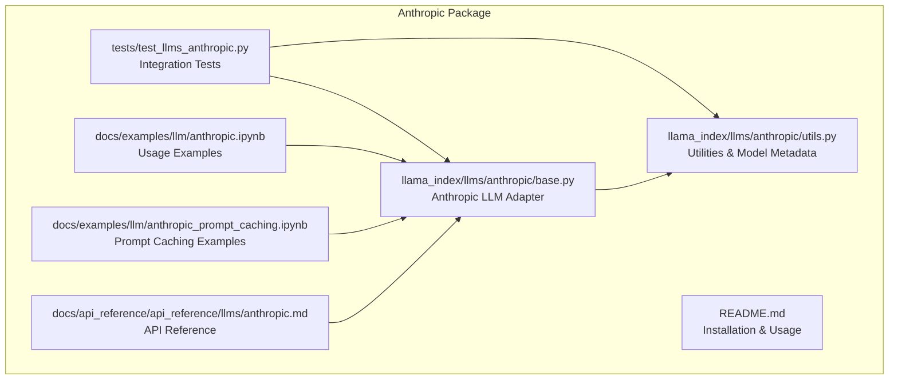

**Diagram sources**
- [base.py](file://llama-index-integrations/llms/llama-index-llms-anthropic/llama_index/llms/anthropic/base.py#L116-L1186)
- [utils.py](file://llama-index-integrations/llms/llama-index-llms-anthropic/llama_index/llms/anthropic/utils.py#L1-L663)
- [test_llms_anthropic.py](file://llama-index-integrations/llms/llama-index-llms-anthropic/tests/test_llms_anthropic.py#L1-L1053)
- [README.md](file://llama-index-integrations/llms/llama-index-llms-anthropic/README.md#L1-L218)
- [anthropic.ipynb](file://docs/examples/llm/anthropic.ipynb#L1-L800)
- [anthropic_prompt_caching.ipynb](file://docs/examples/llm/anthropic_prompt_caching.ipynb#L1-L358)
- [anthropic.md](file://docs/api_reference/api_reference/llms/anthropic.md#L1-L4)

**Section sources**
- [base.py](file://llama-index-integrations/llms/llama-index-llms-anthropic/llama_index/llms/anthropic/base.py#L1-L1186)
- [utils.py](file://llama-index-integrations/llms/llama-index-llms-anthropic/llama_index/llms/anthropic/utils.py#L1-L663)
- [README.md](file://llama-index-integrations/llms/llama-index-llms-anthropic/README.md#L1-L218)
- [test_llms_anthropic.py](file://llama-index-integrations/llms/llama-index-llms-anthropic/tests/test_llms_anthropic.py#L1-L1053)
- [anthropic.ipynb](file://docs/examples/llm/anthropic.ipynb#L1-L800)
- [anthropic_prompt_caching.ipynb](file://docs/examples/llm/anthropic_prompt_caching.ipynb#L1-L358)
- [anthropic.md](file://docs/api_reference/api_reference/llms/anthropic.md#L1-L4)

## Core Components
- Anthropic LLM Adapter: Implements sync and async chat/completion APIs, streaming, tool use, structured outputs, and tokenizer integration.
- Utilities: Provide model metadata, prompt caching support, message conversion helpers, and tool call normalization.
- Tests: Validate streaming usage metadata, structured outputs, tool usage, and caching behavior across providers (direct, Vertex AI, Bedrock).

Key capabilities:
- Authentication via API key (environment variable or constructor parameter)
- Provider selection: direct API, Google Cloud Vertex AI, AWS Bedrock
- Model selection: Claude-3, Claude-3.5, Claude-3.7, Claude-4.x variants
- Prompt caching: ephemeral cache control and CachePoint blocks
- System messages: supported via ChatMessage with role "system"
- Tool use: function/tool calling with automatic tool choice mapping
- Structured outputs: typed extraction via beta structured outputs when supported
- Streaming: token-by-token deltas with usage metadata and stop_reason
- Tokenizer: integrates with LlamaIndex Settings for accurate token counting

**Section sources**
- [base.py](file://llama-index-integrations/llms/llama-index-llms-anthropic/llama_index/llms/anthropic/base.py#L116-L351)
- [utils.py](file://llama-index-integrations/llms/llama-index-llms-anthropic/llama_index/llms/anthropic/utils.py#L114-L141)
- [test_llms_anthropic.py](file://llama-index-integrations/llms/llama-index-llms-anthropic/tests/test_llms_anthropic.py#L35-L134)

## Architecture Overview
The Anthropic adapter encapsulates the official SDK clients and translates LlamaIndex abstractions (ChatMessage, blocks, tool calls) into Anthropic-compatible requests. It supports:
- Direct API client
- Vertex AI client (GCP)
- Bedrock client (AWS)

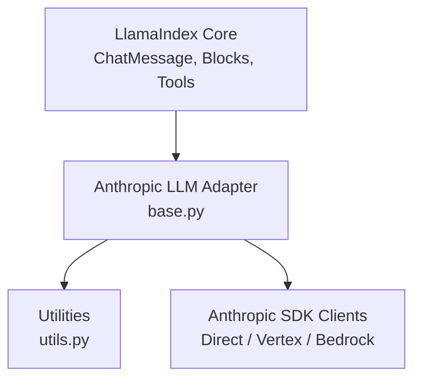

**Diagram sources**
- [base.py](file://llama-index-integrations/llms/llama-index-llms-anthropic/llama_index/llms/anthropic/base.py#L198-L298)
- [utils.py](file://llama-index-integrations/llms/llama-index-llms-anthropic/llama_index/llms/anthropic/utils.py#L314-L544)

**Section sources**
- [base.py](file://llama-index-integrations/llms/llama-index-llms-anthropic/llama_index/llms/anthropic/base.py#L198-L298)
- [utils.py](file://llama-index-integrations/llms/llama-index-llms-anthropic/llama_index/llms/anthropic/utils.py#L314-L544)

## Detailed Component Analysis

### Anthropic LLM Adapter
The adapter exposes:
- Chat and completion methods (sync and async)
- Streaming variants for chat and completion
- Tool use integration with automatic tool choice mapping
- Structured prediction via beta structured outputs when supported
- Tokenizer integration for accurate token counting
- Provider-specific initialization (direct, Vertex AI, Bedrock)

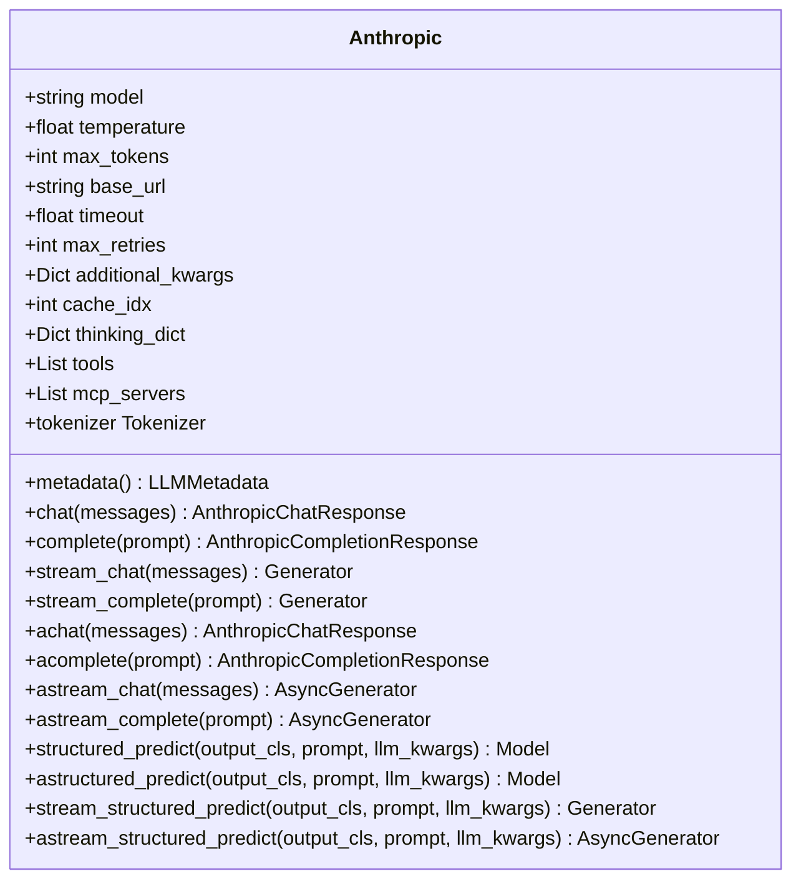

**Diagram sources**
- [base.py](file://llama-index-integrations/llms/llama-index-llms-anthropic/llama_index/llms/anthropic/base.py#L116-L1186)

**Section sources**
- [base.py](file://llama-index-integrations/llms/llama-index-llms-anthropic/llama_index/llms/anthropic/base.py#L116-L351)
- [base.py](file://llama-index-integrations/llms/llama-index-llms-anthropic/llama_index/llms/anthropic/base.py#L416-L918)
- [base.py](file://llama-index-integrations/llms/llama-index-llms-anthropic/llama_index/llms/anthropic/base.py#L1040-L1186)

### Authentication and Provider Configuration
- API key: set via environment variable or constructor parameter
- Vertex AI: configure region and project_id
- Bedrock: configure aws_region, optional credentials
- Additional kwargs: forwarded to underlying SDK clients

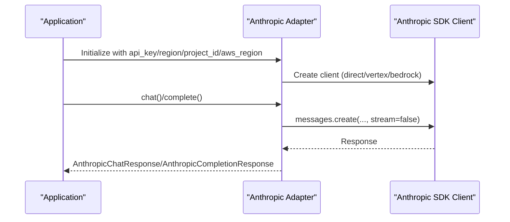

**Diagram sources**
- [base.py](file://llama-index-integrations/llms/llama-index-llms-anthropic/llama_index/llms/anthropic/base.py#L198-L298)
- [base.py](file://llama-index-integrations/llms/llama-index-llms-anthropic/llama_index/llms/anthropic/base.py#L416-L449)

**Section sources**
- [base.py](file://llama-index-integrations/llms/llama-index-llms-anthropic/llama_index/llms/anthropic/base.py#L198-L298)
- [README.md](file://llama-index-integrations/llms/llama-index-llms-anthropic/README.md#L21-L66)

### Model Selection and Configuration
Supported models include Claude-3, Claude-3.5, Claude-3.7, and Claude-4.x variants. Context sizes are derived from model metadata.

Configuration highlights:
- Model selection via constructor parameter
- Temperature and max_tokens defaults and bounds
- Additional kwargs forwarded to SDK
- System prompt support via ChatMessage with role "system"
- Thinking mode via thinking_dict (enables extended reasoning with constraints)

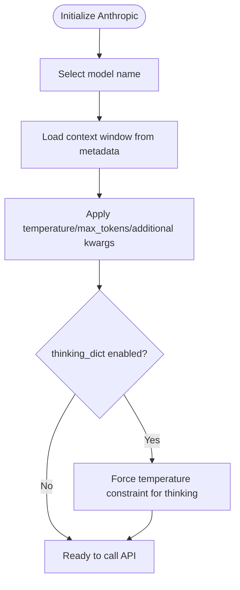

**Diagram sources**
- [utils.py](file://llama-index-integrations/llms/llama-index-llms-anthropic/llama_index/llms/anthropic/utils.py#L114-L141)
- [base.py](file://llama-index-integrations/llms/llama-index-llms-anthropic/llama_index/llms/anthropic/base.py#L134-L158)
- [base.py](file://llama-index-integrations/llms/llama-index-llms-anthropic/llama_index/llms/anthropic/base.py#L227-L229)

**Section sources**
- [utils.py](file://llama-index-integrations/llms/llama-index-llms-anthropic/llama_index/llms/anthropic/utils.py#L83-L141)
- [base.py](file://llama-index-integrations/llms/llama-index-llms-anthropic/llama_index/llms/anthropic/base.py#L134-L158)
- [anthropic.ipynb](file://docs/examples/llm/anthropic.ipynb#L655-L732)

### Prompt Caching Features
Prompt caching reduces latency and cost by reusing precomputed attention for repeated or shared prompt prefixes. The adapter supports:
- cache_control on individual blocks/messages
- cache_idx to cache first N messages (use -1 for all)
- CachePoint blocks to mark cache boundaries
- Automatic cache control injection based on model support

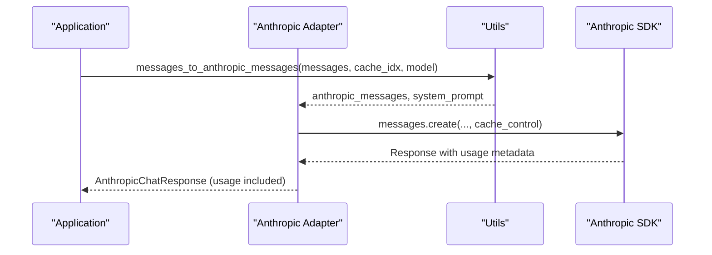

**Diagram sources**
- [utils.py](file://llama-index-integrations/llms/llama-index-llms-anthropic/llama_index/llms/anthropic/utils.py#L314-L371)
- [utils.py](file://llama-index-integrations/llms/llama-index-llms-anthropic/llama_index/llms/anthropic/utils.py#L502-L544)
- [test_llms_anthropic.py](file://llama-index-integrations/llms/llama-index-llms-anthropic/tests/test_llms_anthropic.py#L557-L651)

**Section sources**
- [utils.py](file://llama-index-integrations/llms/llama-index-llms-anthropic/llama_index/llms/anthropic/utils.py#L559-L663)
- [utils.py](file://llama-index-integrations/llms/llama-index-llms-anthropic/llama_index/llms/anthropic/utils.py#L314-L371)
- [anthropic_prompt_caching.ipynb](file://docs/examples/llm/anthropic_prompt_caching.ipynb#L1-L358)

### System Messages and Message Conversion
System messages are extracted and passed separately to the SDK. The adapter converts LlamaIndex blocks (Text, Image, Document, Thinking, ToolUse, Citation, CachePoint) into Anthropic-compatible content blocks.

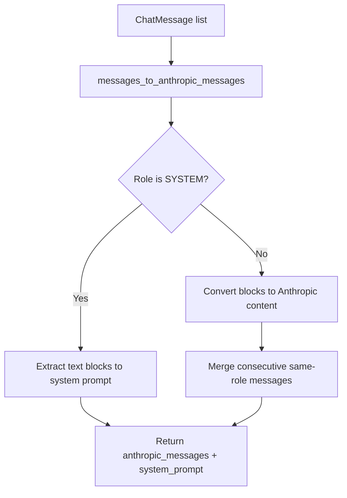

**Diagram sources**
- [utils.py](file://llama-index-integrations/llms/llama-index-llms-anthropic/llama_index/llms/anthropic/utils.py#L314-L371)

**Section sources**
- [utils.py](file://llama-index-integrations/llms/llama-index-llms-anthropic/llama_index/llms/anthropic/utils.py#L314-L371)

### Tool Use Capabilities
The adapter supports function/tool calling:
- Define tools via tool dictionaries or LlamaIndex FunctionTool
- Automatic tool choice mapping (auto/any) with parallel tool use control
- Tool result blocks for function/tool outputs
- Validation to enforce single tool call when disabled

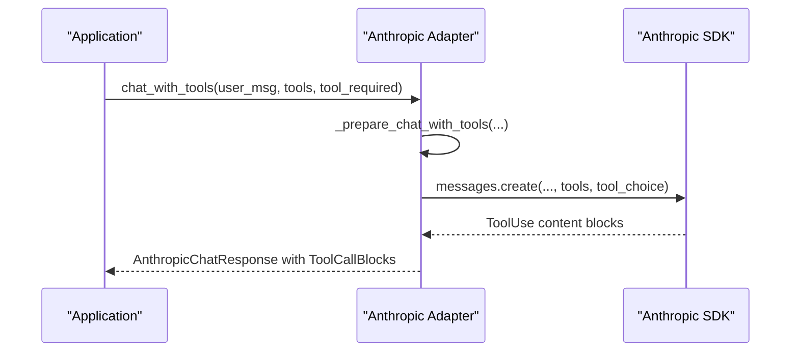

**Diagram sources**
- [base.py](file://llama-index-integrations/llms/llama-index-llms-anthropic/llama_index/llms/anthropic/base.py#L931-L986)
- [base.py](file://llama-index-integrations/llms/llama-index-llms-anthropic/llama_index/llms/anthropic/base.py#L416-L449)

**Section sources**
- [base.py](file://llama-index-integrations/llms/llama-index-llms-anthropic/llama_index/llms/anthropic/base.py#L931-L998)
- [test_llms_anthropic.py](file://llama-index-integrations/llms/llama-index-llms-anthropic/tests/test_llms_anthropic.py#L247-L314)

### Structured Outputs
Structured outputs are supported via Anthropic beta structured outputs when the model supports it. The adapter:
- Detects structured output support per model
- Uses beta messages.parse for supported models
- Falls back to legacy approach for unsupported models
- Streams structured outputs with warnings for partial support

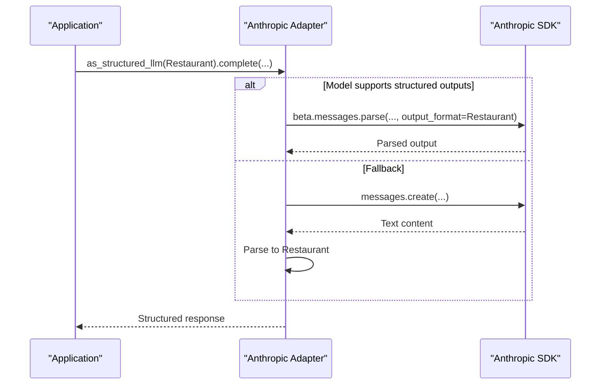

**Diagram sources**
- [base.py](file://llama-index-integrations/llms/llama-index-llms-anthropic/llama_index/llms/anthropic/base.py#L1040-L1104)
- [utils.py](file://llama-index-integrations/llms/llama-index-llms-anthropic/llama_index/llms/anthropic/utils.py#L594-L662)

**Section sources**
- [base.py](file://llama-index-integrations/llms/llama-index-llms-anthropic/llama_index/llms/anthropic/base.py#L1040-L1144)
- [utils.py](file://llama-index-integrations/llms/llama-index-llms-anthropic/llama_index/llms/anthropic/utils.py#L594-L662)
- [test_llms_anthropic.py](file://llama-index-integrations/llms/llama-index-llms-anthropic/tests/test_llms_anthropic.py#L949-L1032)

### Streaming Response Handling
The adapter streams deltas and aggregates content blocks:
- Text deltas, citations, thinking blocks, and tool-use JSON deltas
- Usage metadata and stop_reason propagated from RawMessage events
- Tool calls reconstructed incrementally from partial JSON deltas

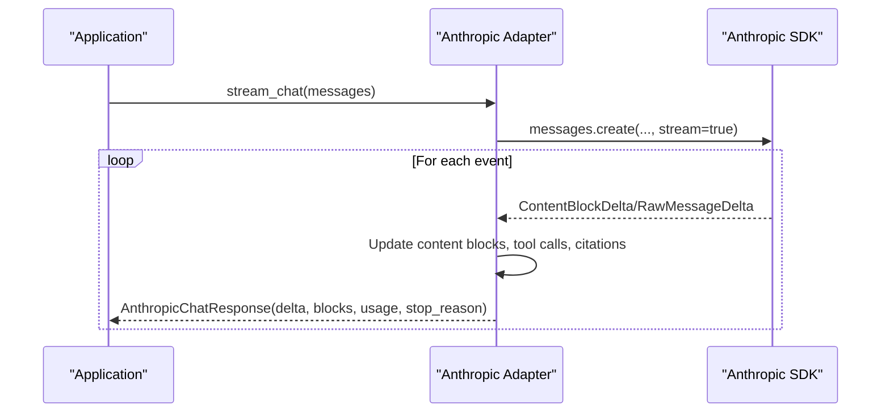

**Diagram sources**
- [base.py](file://llama-index-integrations/llms/llama-index-llms-anthropic/llama_index/llms/anthropic/base.py#L451-L653)
- [base.py](file://llama-index-integrations/llms/llama-index-llms-anthropic/llama_index/llms/anthropic/base.py#L703-L905)

**Section sources**
- [base.py](file://llama-index-integrations/llms/llama-index-llms-anthropic/llama_index/llms/anthropic/base.py#L451-L653)
- [base.py](file://llama-index-integrations/llms/llama-index-llms-anthropic/llama_index/llms/anthropic/base.py#L703-L905)
- [test_llms_anthropic.py](file://llama-index-integrations/llms/llama-index-llms-anthropic/tests/test_llms_anthropic.py#L653-L837)

### Tokenizer Integration
The adapter provides an AnthropicTokenizer that leverages the SDK’s token counting endpoint for accurate token estimation.

**Section sources**
- [base.py](file://llama-index-integrations/llms/llama-index-llms-anthropic/llama_index/llms/anthropic/base.py#L91-L101)
- [test_llms_anthropic.py](file://llama-index-integrations/llms/llama-index-llms-anthropic/tests/test_llms_anthropic.py#L196-L230)

## Dependency Analysis
The adapter depends on:
- Anthropic SDK clients (direct, Vertex, Bedrock)
- LlamaIndex core abstractions (ChatMessage, blocks, tools, tokenizer)
- Utility functions for model metadata and message conversion

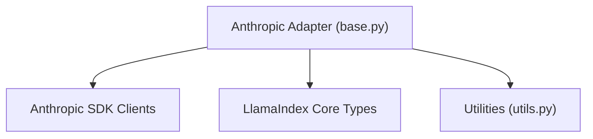

**Diagram sources**
- [base.py](file://llama-index-integrations/llms/llama-index-llms-anthropic/llama_index/llms/anthropic/base.py#L1-L85)
- [utils.py](file://llama-index-integrations/llms/llama-index-llms-anthropic/llama_index/llms/anthropic/utils.py#L1-L49)

**Section sources**
- [base.py](file://llama-index-integrations/llms/llama-index-llms-anthropic/llama_index/llms/anthropic/base.py#L1-L85)
- [utils.py](file://llama-index-integrations/llms/llama-index-llms-anthropic/llama_index/llms/anthropic/utils.py#L1-L49)

## Performance Considerations
- Prompt caching: Enable cache_control on repeated or shared prompt prefixes to reduce latency and cost. Use CachePoint to delineate cached segments.
- Model selection: Choose appropriate model tiers based on quality and cost targets; Claude-4.x variants offer stronger capabilities.
- Streaming: Use streaming for real-time UX and incremental processing; monitor usage metadata to track token consumption.
- Token counting: Integrate the provided tokenizer to prevent context overflow and optimize prompt sizing.
- Rate limits: Respect provider rate limits; implement retry/backoff strategies via max_retries and timeout settings.

[No sources needed since this section provides general guidance]

## Troubleshooting Guide
Common issues and resolutions:
- Unknown model name: Ensure the model identifier is valid; the adapter raises an error for unsupported names.
- Tool choice conflicts with thinking: When thinking is enabled, tool_choice is constrained; adjust thinking_dict or tool_required accordingly.
- Missing API key or incorrect provider credentials: Verify environment variables or constructor parameters for API key, region, project_id, or AWS credentials.
- Streaming usage metadata: Confirm that usage and stop_reason are captured from RawMessage events; tests demonstrate expected behavior.
- Structured output failures: Some models require specific betas and configurations; fallback parsing is available when structured outputs are unsupported.

**Section sources**
- [utils.py](file://llama-index-integrations/llms/llama-index-llms-anthropic/llama_index/llms/anthropic/utils.py#L134-L140)
- [base.py](file://llama-index-integrations/llms/llama-index-llms-anthropic/llama_index/llms/anthropic/base.py#L920-L929)
- [test_llms_anthropic.py](file://llama-index-integrations/llms/llama-index-llms-anthropic/tests/test_llms_anthropic.py#L517-L555)
- [test_llms_anthropic.py](file://llama-index-integrations/llms/llama-index-llms-anthropic/tests/test_llms_anthropic.py#L839-L931)
- [test_llms_anthropic.py](file://llama-index-integrations/llms/llama-index-llms-anthropic/tests/test_llms_anthropic.py#L1034-L1053)

## Conclusion
The Anthropic integration in LlamaIndex provides a robust, extensible adapter supporting multiple providers, advanced features like prompt caching, structured outputs, tool use, and streaming. By leveraging the adapter’s configuration options and utilities, developers can build efficient, production-ready applications with Claude models across diverse deployment scenarios.

[No sources needed since this section summarizes without analyzing specific files]

## Appendices

### API Reference Highlights
- Anthropic class: Core LLM adapter with chat/completion/streaming methods, tool use, structured outputs, and tokenizer integration.
- Utilities: Model metadata, prompt caching support, message conversion helpers, and tool call normalization.

**Section sources**
- [anthropic.md](file://docs/api_reference/api_reference/llms/anthropic.md#L1-L4)
- [base.py](file://llama-index-integrations/llms/llama-index-llms-anthropic/llama_index/llms/anthropic/base.py#L116-L1186)
- [utils.py](file://llama-index-integrations/llms/llama-index-llms-anthropic/llama_index/llms/anthropic/utils.py#L114-L663)