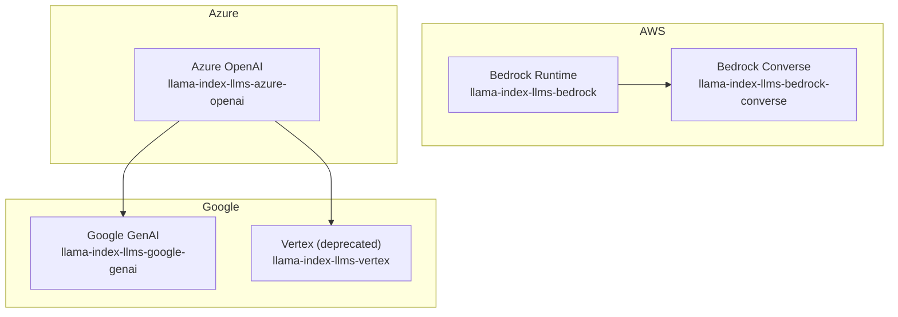
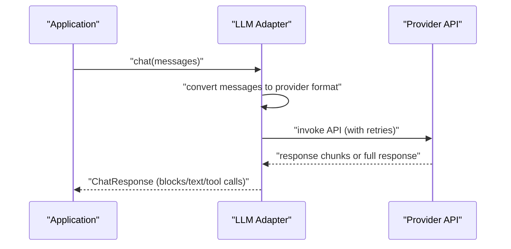
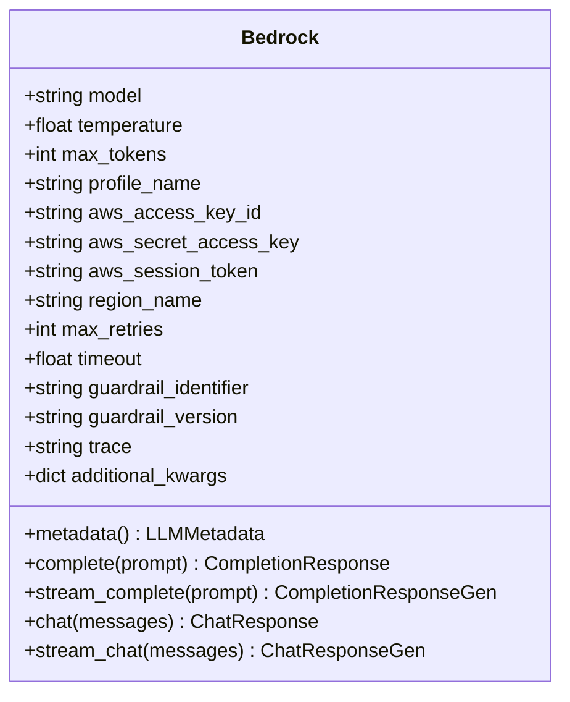
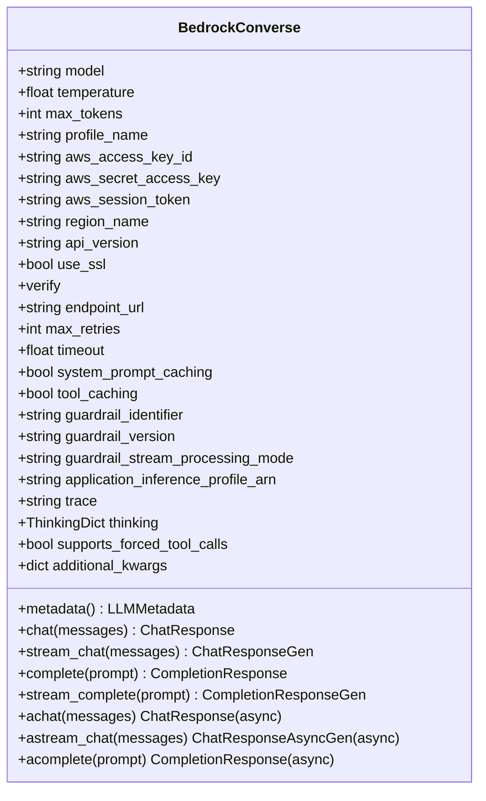
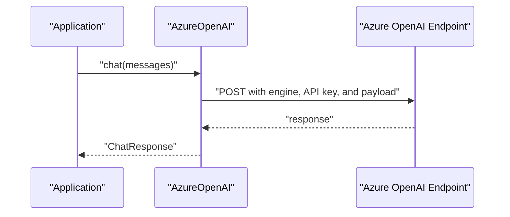
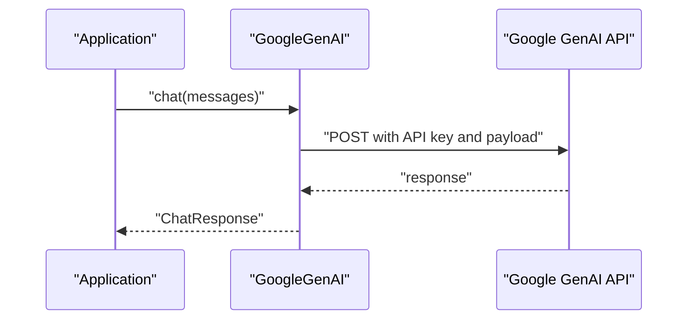
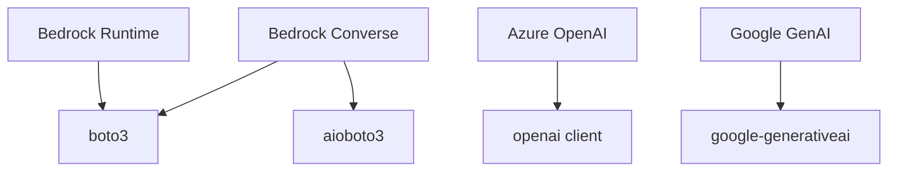

# Cloud Provider Integrations

<cite>
**Referenced Files in This Document**
- [README.md](file://llama-index-integrations/llms/llama-index-llms-bedrock/README.md)
- [base.py](file://llama-index-integrations/llms/llama-index-llms-bedrock/llama_index/llms/bedrock/base.py)
- [__init__.py](file://llama-index-integrations/llms/llama-index-llms-bedrock/llama_index/llms/bedrock/__init__.py)
- [README.md](file://llama-index-integrations/llms/llama-index-llms-bedrock-converse/README.md)
- [base.py](file://llama-index-integrations/llms/llama-index-llms-bedrock-converse/llama_index/llms/bedrock_converse/base.py)
- [__init__.py](file://llama-index-integrations/llms/llama-index-llms-bedrock-converse/llama_index/llms/bedrock_converse/__init__.py)
- [README.md](file://llama-index-integrations/llms/llama-index-llms-azure-openai/README.md)
- [__init__.py](file://llama-index-integrations/llms/llama-index-llms-azure-openai/llama_index/llms/azure_openai/__init__.py)
- [README.md](file://llama-index-integrations/llms/llama-index-llms-google-genai/README.md)
- [README.md](file://llama-index-integrations/llms/llama-index-llms-vertex/README.md)
- [README.md](file://docs/api_reference/api_reference/llms/bedrock.md)
- [README.md](file://docs/api_reference/api_reference/llms/bedrock_converse.md)
- [README.md](file://docs/api_reference/api_reference/llms/azure_openai.md)
- [README.md](file://docs/api_reference/api_reference/llms/google_genai.md)
- [README.md](file://docs/api_reference/api_reference/llms/vertex.md)
</cite>

## Table of Contents
1. [Introduction](#introduction)
2. [Project Structure](#project-structure)
3. [Core Components](#core-components)
4. [Architecture Overview](#architecture-overview)
5. [Detailed Component Analysis](#detailed-component-analysis)
6. [Dependency Analysis](#dependency-analysis)
7. [Performance Considerations](#performance-considerations)
8. [Troubleshooting Guide](#troubleshooting-guide)
9. [Conclusion](#conclusion)
10. [Appendices](#appendices)

## Introduction
This document provides comprehensive API documentation for cloud provider LLM integrations in LlamaIndex. It focuses on:
- AWS Bedrock integration via both legacy Bedrock runtime and the modern Bedrock Converse API
- Google Cloud Vertex AI and Google GenAI integrations
- Azure OpenAI integration
- Authentication methods (IAM roles, service accounts, API keys)
- Regional deployment considerations
- Cost optimization strategies and multi-region failover patterns
- Model selection guidance, configuration management, and production deployment best practices

## Project Structure
The repository organizes cloud provider integrations primarily under the llama-index-integrations directory, with dedicated packages for each provider. Documentation and examples are provided alongside the implementation.

**Diagram sources**
- [README.md](file://llama-index-integrations/llms/llama-index-llms-bedrock/README.md#L1-L129)
- [README.md](file://llama-index-integrations/llms/llama-index-llms-bedrock-converse/README.md#L1-L262)
- [README.md](file://llama-index-integrations/llms/llama-index-llms-azure-openai/README.md#L1-L113)
- [README.md](file://llama-index-integrations/llms/llama-index-llms-google-genai/README.md#L1-L115)
- [README.md](file://llama-index-integrations/llms/llama-index-llms-vertex/README.md#L1-L4)

**Section sources**
- [README.md](file://llama-index-integrations/llms/llama-index-llms-bedrock/README.md#L1-L129)
- [README.md](file://llama-index-integrations/llms/llama-index-llms-bedrock-converse/README.md#L1-L262)
- [README.md](file://llama-index-integrations/llms/llama-index-llms-azure-openai/README.md#L1-L113)
- [README.md](file://llama-index-integrations/llms/llama-index-llms-google-genai/README.md#L1-L115)
- [README.md](file://llama-index-integrations/llms/llama-index-llms-vertex/README.md#L1-L4)

## Core Components
- Bedrock (legacy runtime): Provides LLM access via the Bedrock runtime API with support for completion, chat, and streaming. It supports IAM credentials, profiles, and region configuration.
- Bedrock Converse: Modern conversational interface supporting structured messages, tool/function calling, streaming, guardrails, prompt caching, and application inference profiles.
- Azure OpenAI: Integrates with Azure OpenAI endpoints using API keys and requires specifying an engine/deployment name.
- Google GenAI: Integrates with Google’s GenAI SDK using an API key environment variable.
- Vertex (deprecated): Vertex documentation notes that Gemini has been largely superseded by Google GenAI.

Key configuration parameters across providers include:
- Authentication: IAM credentials (access key, secret key, session token), AWS profile name, API keys, environment variables
- Region and endpoint: region_name, endpoint_url, api_version
- Retries and timeouts: max_retries, timeout
- Guardrails and tracing: guardrail_identifier, guardrail_version, trace
- Additional provider-specific options: system_prompt_caching, tool_caching, thinking, application_inference_profile_arn

**Section sources**
- [base.py](file://llama-index-integrations/llms/llama-index-llms-bedrock/llama_index/llms/bedrock/base.py#L49-L400)
- [README.md](file://llama-index-integrations/llms/llama-index-llms-bedrock/README.md#L105-L124)
- [base.py](file://llama-index-integrations/llms/llama-index-llms-bedrock-converse/llama_index/llms/bedrock_converse/base.py#L62-L800)
- [README.md](file://llama-index-integrations/llms/llama-index-llms-bedrock-converse/README.md#L108-L133)
- [README.md](file://llama-index-integrations/llms/llama-index-llms-azure-openai/README.md#L14-L57)
- [README.md](file://llama-index-integrations/llms/llama-index-llms-google-genai/README.md#L11-L15)
- [README.md](file://llama-index-integrations/llms/llama-index-llms-vertex/README.md#L1-L4)

## Architecture Overview
The integrations follow a consistent pattern:
- Initialize an LLM adapter with provider-specific credentials and configuration
- Convert LlamaIndex message types to provider-specific formats
- Invoke the provider API with retries and optional streaming
- Parse provider responses into LlamaIndex response types

**Diagram sources**
- [base.py](file://llama-index-integrations/llms/llama-index-llms-bedrock-converse/llama_index/llms/bedrock_converse/base.py#L422-L460)
- [base.py](file://llama-index-integrations/llms/llama-index-llms-bedrock/llama_index/llms/bedrock/base.py#L353-L364)

## Detailed Component Analysis

### AWS Bedrock (Legacy Runtime)
- Purpose: Legacy Bedrock runtime integration for invoking foundation models via the runtime API.
- Key capabilities:
  - Completion and chat APIs
  - Streaming for supported models
  - Retry and timeout controls
  - Guardrails and tracing
  - Context size and token limits derived from model metadata
- Authentication and regions:
  - Supports AWS profile name, explicit access key/secret/session token, and region
- Important note: The implementation is marked as deprecated in favor of Bedrock Converse.

**Diagram sources**
- [base.py](file://llama-index-integrations/llms/llama-index-llms-bedrock/llama_index/llms/bedrock/base.py#L49-L400)

**Section sources**
- [base.py](file://llama-index-integrations/llms/llama-index-llms-bedrock/llama_index/llms/bedrock/base.py#L49-L400)
- [__init__.py](file://llama-index-integrations/llms/llama-index-llms-bedrock/llama_index/llms/bedrock/__init__.py#L1-L14)
- [README.md](file://llama-index-integrations/llms/llama-index-llms-bedrock/README.md#L1-L129)

### AWS Bedrock Converse (Modern)
- Purpose: Modern conversational interface with structured messages, tool/function calling, streaming, guardrails, prompt caching, and application inference profiles.
- Key capabilities:
  - Chat and streaming chat
  - Function/tool calling with automatic parsing
  - Thinking/reasoning support for compatible models
  - Prompt caching and tool caching
  - Application inference profiles for account-specific routing
  - Async variants for chat and streaming
- Authentication and regions:
  - Supports AWS profile name, explicit credentials, region, SSL verification, endpoint URL, and API version
- Guardrails and tracing:
  - Guardrail identifier/version and stream processing mode for streaming
  - Trace flag for Bedrock trace visibility

**Diagram sources**
- [base.py](file://llama-index-integrations/llms/llama-index-llms-bedrock-converse/llama_index/llms/bedrock_converse/base.py#L62-L800)

**Section sources**
- [base.py](file://llama-index-integrations/llms/llama-index-llms-bedrock-converse/llama_index/llms/bedrock_converse/base.py#L62-L800)
- [__init__.py](file://llama-index-integrations/llms/llama-index-llms-bedrock-converse/llama_index/llms/bedrock_converse/__init__.py#L1-L4)
- [README.md](file://llama-index-integrations/llms/llama-index-llms-bedrock-converse/README.md#L1-L262)

### Azure OpenAI
- Purpose: Integrates with Azure OpenAI endpoints using API keys and requires specifying an engine/deployment name.
- Key capabilities:
  - Completion and chat
  - Streaming for both completion and chat
  - Additional keyword arguments for request customization
- Authentication and configuration:
  - Environment variables or constructor parameters for endpoint, API key, and API version
  - Engine parameter required for Azure OpenAI deployments

**Diagram sources**
- [README.md](file://llama-index-integrations/llms/llama-index-llms-azure-openai/README.md#L14-L57)

**Section sources**
- [__init__.py](file://llama-index-integrations/llms/llama-index-llms-azure-openai/llama_index/llms/azure_openai/__init__.py#L1-L8)
- [README.md](file://llama-index-integrations/llms/llama-index-llms-azure-openai/README.md#L1-L113)

### Google GenAI
- Purpose: Integrates with Google GenAI using an API key environment variable.
- Key capabilities:
  - Completion and chat
  - Streaming for both completion and chat
  - Asynchronous completion and streaming
- Authentication and configuration:
  - GOOGLE_API_KEY environment variable
  - Model selection via model parameter

**Diagram sources**
- [README.md](file://llama-index-integrations/llms/llama-index-llms-google-genai/README.md#L11-L15)

**Section sources**
- [README.md](file://llama-index-integrations/llms/llama-index-llms-google-genai/README.md#L1-L115)

### Vertex (Deprecated)
- Note: The Vertex integration README indicates that Gemini has largely been replaced by Google GenAI. Prefer Google GenAI for new projects.

**Section sources**
- [README.md](file://llama-index-integrations/llms/llama-index-llms-vertex/README.md#L1-L4)

## Dependency Analysis
- Both Bedrock adapters depend on boto3 for AWS connectivity and botocore configuration.
- Bedrock Converse additionally depends on aioboto3 for async operations.
- Azure OpenAI depends on the OpenAI client and environment variables.
- Google GenAI depends on the google-generativeai SDK and GOOGLE_API_KEY.

**Diagram sources**
- [base.py](file://llama-index-integrations/llms/llama-index-llms-bedrock-converse/llama_index/llms/bedrock_converse/base.py#L292-L313)
- [README.md](file://llama-index-integrations/llms/llama-index-llms-azure-openai/README.md#L14-L28)
- [README.md](file://llama-index-integrations/llms/llama-index-llms-google-genai/README.md#L11-L15)

**Section sources**
- [base.py](file://llama-index-integrations/llms/llama-index-llms-bedrock-converse/llama_index/llms/bedrock_converse/base.py#L292-L313)
- [README.md](file://llama-index-integrations/llms/llama-index-llms-azure-openai/README.md#L14-L28)
- [README.md](file://llama-index-integrations/llms/llama-index-llms-google-genai/README.md#L11-L15)

## Performance Considerations
- Retries and timeouts: Configure max_retries and timeout to balance reliability and latency. Higher retries improve resilience at the cost of latency.
- Streaming: Prefer streaming for long responses to reduce perceived latency and enable incremental rendering.
- Guardrails and tracing: Enable guardrails and tracing for compliance and observability; note potential overhead.
- Prompt caching (Bedrock Converse): Use system_prompt_caching and tool_caching to reduce repeated costs for static content.
- Model selection: Choose models aligned with workload characteristics (reasoning, chat, function calling) to optimize cost and performance.
- Multi-region failover: Distribute requests across regions to mitigate latency spikes and outages; implement fallback logic in your application layer.

[No sources needed since this section provides general guidance]

## Troubleshooting Guide
- AWS Bedrock runtime
  - Missing context_size for non-foundation models: Ensure context_size is provided for non-foundation models.
  - Streaming support: Some models do not support streaming; verify model compatibility.
  - Credentials and regions: Verify AWS profile, region, and credentials are correctly configured.
- AWS Bedrock Converse
  - Application inference profile mismatch: Ensure the model argument matches the referenced model/profile ARN.
  - Thinking parameters: Thinking is ignored for non-reasoning models.
  - Guardrail stream processing mode: Specify sync or async mode when using guardrails with streaming.
- Azure OpenAI
  - Engine parameter: Always specify the engine/deployment name; missing engine leads to errors.
  - API key and endpoint: Confirm environment variables or constructor parameters are correct.
- Google GenAI
  - API key: Ensure GOOGLE_API_KEY is set and valid.
  - Model names: Use valid model identifiers recognized by Google GenAI.

**Section sources**
- [base.py](file://llama-index-integrations/llms/llama-index-llms-bedrock/llama_index/llms/bedrock/base.py#L160-L165)
- [base.py](file://llama-index-integrations/llms/llama-index-llms-bedrock-converse/llama_index/llms/bedrock_converse/base.py#L241-L246)
- [README.md](file://llama-index-integrations/llms/llama-index-llms-bedrock-converse/README.md#L108-L116)
- [README.md](file://llama-index-integrations/llms/llama-index-llms-azure-openai/README.md#L32-L47)
- [README.md](file://llama-index-integrations/llms/llama-index-llms-google-genai/README.md#L11-L15)

## Conclusion
LlamaIndex provides robust, provider-agnostic LLM integrations for AWS Bedrock (both legacy runtime and modern Converse), Azure OpenAI, and Google GenAI. Production deployments should emphasize secure authentication, regional configuration, guardrails, and prompt caching where applicable. For new projects, prefer Bedrock Converse and Google GenAI over legacy Vertex.

[No sources needed since this section summarizes without analyzing specific files]

## Appendices

### Authentication Methods
- AWS Bedrock
  - IAM roles and profiles: Use profile_name and region_name
  - Explicit credentials: aws_access_key_id, aws_secret_access_key, aws_session_token
- Azure OpenAI
  - API key via environment variables or constructor parameters
  - Endpoint and API version required
- Google GenAI
  - API key via GOOGLE_API_KEY environment variable

**Section sources**
- [README.md](file://llama-index-integrations/llms/llama-index-llms-bedrock/README.md#L105-L124)
- [README.md](file://llama-index-integrations/llms/llama-index-llms-bedrock-converse/README.md#L91-L106)
- [README.md](file://llama-index-integrations/llms/llama-index-llms-azure-openai/README.md#L14-L28)
- [README.md](file://llama-index-integrations/llms/llama-index-llms-google-genai/README.md#L11-L15)

### Regional Deployment Considerations
- AWS Bedrock
  - Configure region_name for latency and data residency
  - Use application_inference_profile_arn for account-specific routing
- Azure OpenAI
  - Select endpoint closest to users; ensure engine alignment
- Google GenAI
  - Ensure API key region compatibility

**Section sources**
- [README.md](file://llama-index-integrations/llms/llama-index-llms-bedrock-converse/README.md#L108-L116)
- [README.md](file://llama-index-integrations/llms/llama-index-llms-azure-openai/README.md#L17-L27)
- [README.md](file://llama-index-integrations/llms/llama-index-llms-google-genai/README.md#L11-L15)

### Cost Optimization Strategies
- Prompt caching (Bedrock Converse): Cache system prompts and tools to reduce token usage
- Streaming: Reduce latency and enable early termination
- Model selection: Match model capabilities to workload to avoid unnecessary compute
- Retries and timeouts: Tune to minimize wasted requests while maintaining reliability

**Section sources**
- [README.md](file://llama-index-integrations/llms/llama-index-llms-bedrock-converse/README.md#L210-L257)

### Multi-Region Failover Patterns
- Distribute traffic across regions to reduce single points of failure
- Implement fallback logic when primary region fails
- Monitor latency and error rates to dynamically route requests

[No sources needed since this section provides general guidance]

### Model Selection Across Providers
- AWS Bedrock: Choose among Titan, Claude, Llama, and others; consult provider documentation for capabilities
- Azure OpenAI: Select engine/deployment aligned with model family and capabilities
- Google GenAI: Use supported model identifiers for chat and generation

**Section sources**
- [README.md](file://llama-index-integrations/llms/llama-index-llms-bedrock/README.md#L12-L28)
- [README.md](file://llama-index-integrations/llms/llama-index-llms-bedrock-converse/README.md#L18-L44)
- [README.md](file://llama-index-integrations/llms/llama-index-llms-azure-openai/README.md#L32-L47)
- [README.md](file://llama-index-integrations/llms/llama-index-llms-google-genai/README.md#L23-L29)

### Configuration Management and Production Best Practices
- Centralize secrets (API keys, credentials) using environment variables or secret managers
- Parameterize retries, timeouts, and guardrails per environment
- Instrument with tracing and logging; enable Bedrock trace for diagnostics
- Use application inference profiles for predictable performance and routing

**Section sources**
- [README.md](file://llama-index-integrations/llms/llama-index-llms-bedrock-converse/README.md#L169-L171)
- [README.md](file://llama-index-integrations/llms/llama-index-llms-bedrock-converse/README.md#L162-L168)