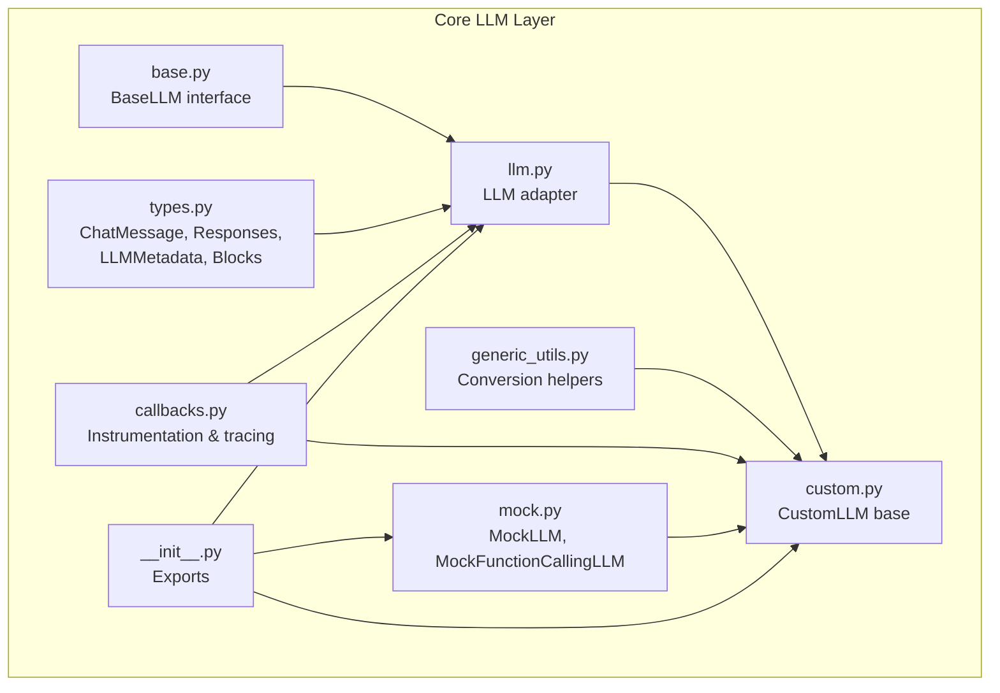
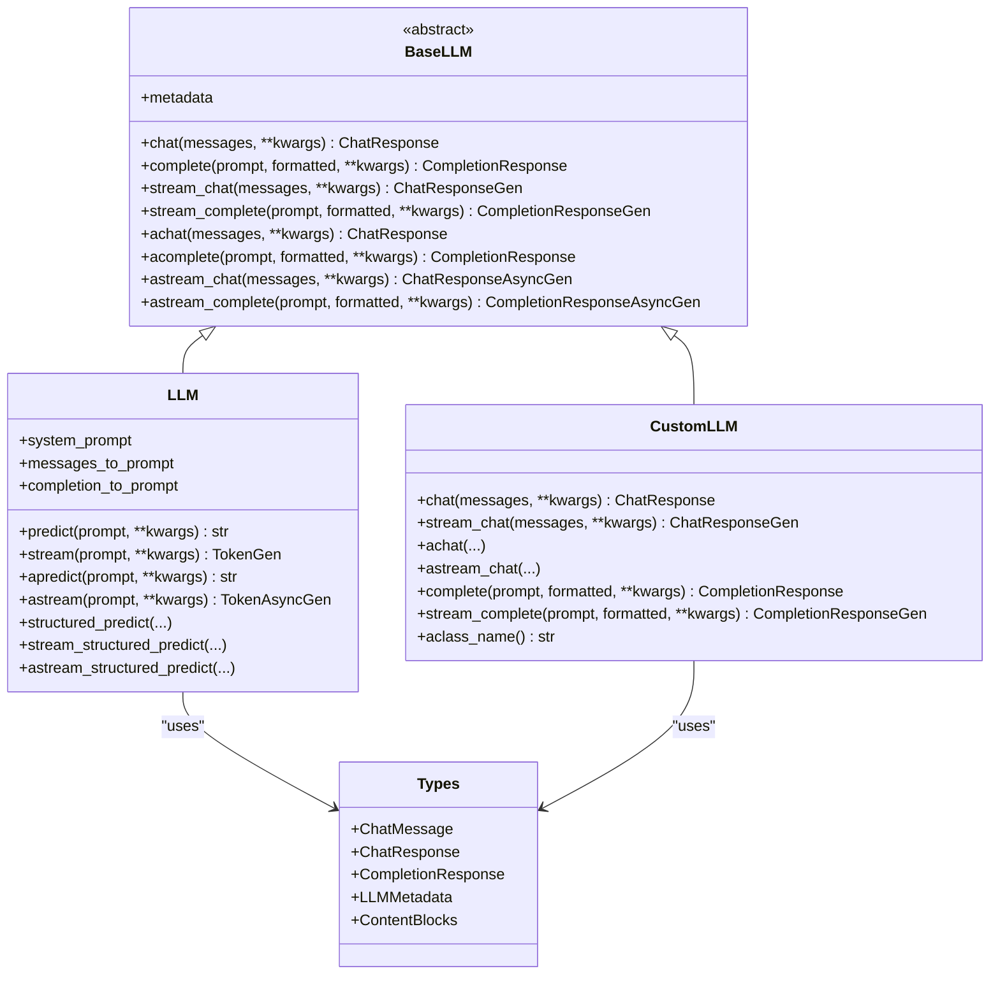
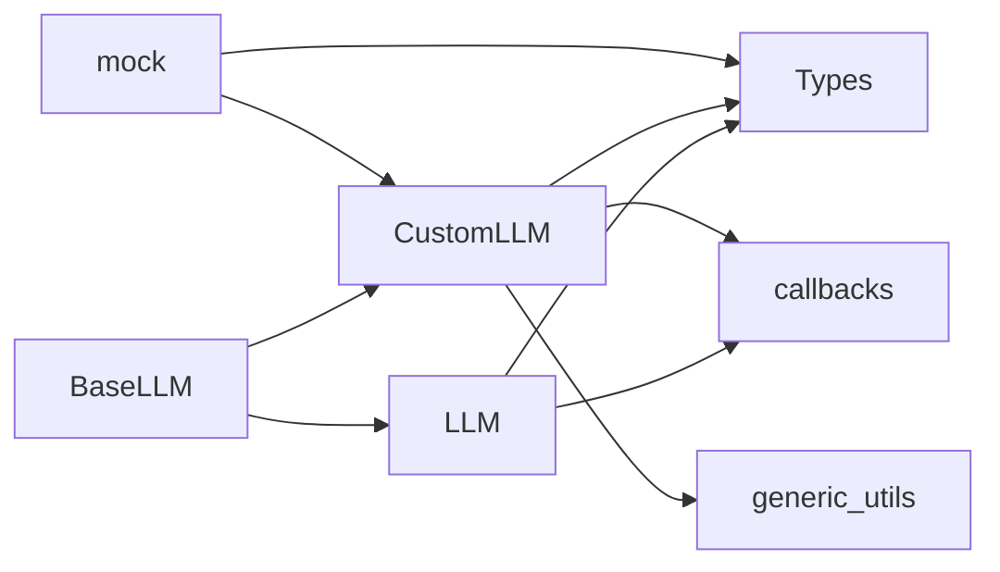
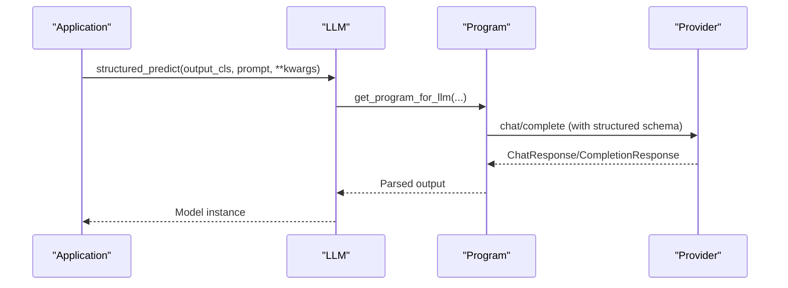

# Custom Provider Development

<cite>
**Referenced Files in This Document**
- [base.py](file://llama-index-core/llama_index/core/base/llms/base.py)
- [types.py](file://llama-index-core/llama_index/core/base/llms/types.py)
- [llm.py](file://llama-index-core/llama_index/core/llms/llm.py)
- [custom.py](file://llama-index-core/llama_index/core/llms/custom.py)
- [generic_utils.py](file://llama-index-core/llama_index/core/base/llms/generic_utils.py)
- [callbacks.py](file://llama-index-core/llama_index/core/llms/callbacks.py)
- [mock.py](file://llama-index-core/llama_index/core/llms/mock.py)
- [__init__.py](file://llama-index-core/llama_index/core/llms/__init__.py)
</cite>

## Table of Contents
1. [Introduction](#introduction)
2. [Project Structure](#project-structure)
3. [Core Components](#core-components)
4. [Architecture Overview](#architecture-overview)
5. [Detailed Component Analysis](#detailed-component-analysis)
6. [Dependency Analysis](#dependency-analysis)
7. [Performance Considerations](#performance-considerations)
8. [Troubleshooting Guide](#troubleshooting-guide)
9. [Conclusion](#conclusion)
10. [Appendices](#appendices)

## Introduction
This document explains how to develop custom Large Language Model (LLM) providers in LlamaIndex. It covers the LLM base class interface, required abstract methods, integration patterns with existing adapters, authentication and configuration strategies, request/response formatting, streaming support, error handling, and testing/mocking approaches. It also provides templates and best practices to maintain compatibility with the LlamaIndex ecosystem.

## Project Structure
The LLM subsystem is primarily located under the core LlamaIndex package. The most relevant modules for building custom providers are:
- Base interface and types
- LLM adapter and utilities
- Callbacks and instrumentation
- Mock implementations for testing

**Diagram sources**
- [base.py](file://llama-index-core/llama_index/core/base/llms/base.py#L25-L292)
- [types.py](file://llama-index-core/llama_index/core/base/llms/types.py#L538-L747)
- [llm.py](file://llama-index-core/llama_index/core/llms/llm.py#L163-L931)
- [custom.py](file://llama-index-core/llama_index/core/llms/custom.py#L22-L92)
- [generic_utils.py](file://llama-index-core/llama_index/core/base/llms/generic_utils.py#L36-L367)
- [callbacks.py](file://llama-index-core/llama_index/core/llms/callbacks.py#L39-L546)
- [mock.py](file://llama-index-core/llama_index/core/llms/mock.py#L57-L504)
- [__init__.py](file://llama-index-core/llama_index/core/llms/__init__.py#L21-L49)

**Section sources**
- [base.py](file://llama-index-core/llama_index/core/base/llms/base.py#L25-L292)
- [types.py](file://llama-index-core/llama_index/core/base/llms/types.py#L538-L747)
- [llm.py](file://llama-index-core/llama_index/core/llms/llm.py#L163-L931)
- [custom.py](file://llama-index-core/llama_index/core/llms/custom.py#L22-L92)
- [generic_utils.py](file://llama-index-core/llama_index/core/base/llms/generic_utils.py#L36-L367)
- [callbacks.py](file://llama-index-core/llama_index/core/llms/callbacks.py#L39-L546)
- [mock.py](file://llama-index-core/llama_index/core/llms/mock.py#L57-L504)
- [__init__.py](file://llama-index-core/llama_index/core/llms/__init__.py#L21-L49)

## Core Components
- BaseLLM: Defines the abstract interface for all LLM providers, including synchronous and asynchronous chat/completion endpoints, streaming variants, and metadata.
- LLM: The primary adapter that adds prompt chaining, structured prediction, streaming token conversion, and system prompt handling on top of BaseLLM.
- CustomLLM: A simplified base class for custom providers that implement only completion-style methods and rely on adapters to expose chat and streaming.
- Types: Strongly typed message/response models, content blocks (text, images, audio, video, documents), and metadata.
- Utilities: Helpers for converting between chat and completion modes, token streams, and environment-based configuration retrieval.
- Callbacks: Decorators that wrap LLM calls to emit instrumentation events and integrate with the global callback manager.
- Mocks: Ready-to-use mock implementations for testing and prototyping.

Key responsibilities:
- Define and enforce the LLM contract via abstract methods.
- Normalize inputs/outputs between chat and completion modes.
- Provide streaming and async capabilities consistently.
- Support structured outputs and tool/function calling patterns.
- Emit telemetry and handle errors via callbacks.

**Section sources**
- [base.py](file://llama-index-core/llama_index/core/base/llms/base.py#L25-L292)
- [llm.py](file://llama-index-core/llama_index/core/llms/llm.py#L163-L931)
- [custom.py](file://llama-index-core/llama_index/core/llms/custom.py#L22-L92)
- [types.py](file://llama-index-core/llama_index/core/base/llms/types.py#L538-L747)
- [generic_utils.py](file://llama-index-core/llama_index/core/base/llms/generic_utils.py#L36-L367)
- [callbacks.py](file://llama-index-core/llama_index/core/llms/callbacks.py#L39-L546)
- [mock.py](file://llama-index-core/llama_index/core/llms/mock.py#L57-L504)

## Architecture Overview
The LlamaIndex LLM architecture separates concerns between:
- Base interface (BaseLLM) for providers
- Adapter layer (LLM) for convenience features (prompt chaining, structured outputs, system prompts)
- Utility layer (generic_utils) for conversions and token streaming
- Instrumentation layer (callbacks) for tracing and telemetry
- Testing layer (mock) for deterministic behavior

**Diagram sources**
- [base.py](file://llama-index-core/llama_index/core/base/llms/base.py#L25-L292)
- [llm.py](file://llama-index-core/llama_index/core/llms/llm.py#L163-L931)
- [custom.py](file://llama-index-core/llama_index/core/llms/custom.py#L22-L92)
- [types.py](file://llama-index-core/llama_index/core/base/llms/types.py#L538-L747)

## Detailed Component Analysis

### BaseLLM Interface
- Purpose: Defines the canonical LLM contract with synchronous and asynchronous methods for chat and completion, plus streaming variants.
- Required abstract methods:
  - metadata property
  - chat(messages, **kwargs)
  - complete(prompt, formatted, **kwargs)
  - stream_chat(messages, **kwargs)
  - stream_complete(prompt, formatted, **kwargs)
  - achat(messages, **kwargs)
  - acomplete(prompt, formatted, **kwargs)
  - astream_chat(messages, **kwargs)
  - astream_complete(prompt, formatted, **kwargs)

- Additional utilities:
  - convert_chat_messages: Normalizes message content to text for providers that do not support multimodal blocks.

Integration pattern:
- Implementers choose whether to implement chat or completion semantics; CustomLLM bridges the gap by composing completion-based methods into chat and streaming.

**Section sources**
- [base.py](file://llama-index-core/llama_index/core/base/llms/base.py#L25-L292)

### LLM Adapter
- Purpose: Adds convenience features on top of BaseLLM:
  - Prompt chaining: predict/stream/apredict/astream
  - Structured outputs: structured_predict, stream_structured_predict, astructured_predict, astream_structured_predict
  - System prompt injection and query wrapper prompts
  - Token stream conversion helpers for chat/completion
  - Validators for prompt converters

Key behaviors:
- Uses metadata.is_chat_model to route predict() to chat or completion endpoints.
- Applies system_prompt and query wrappers before invoking underlying methods.
- Emits instrumentation events and integrates with callback manager.

**Section sources**
- [llm.py](file://llama-index-core/llama_index/core/llms/llm.py#L163-L931)

### CustomLLM Base Class
- Purpose: Simplified base for custom providers that implement only completion-style methods.
- Methods to implement:
  - __init__
  - _complete (sync)
  - _stream_complete (sync)
  - metadata

- Automatic features:
  - chat()/stream_chat() delegate to completion methods after converting messages to prompt via messages_to_prompt.
  - Async methods are provided via wrappers that delegate to sync counterparts.

Best for:
- Providers that expose a completion endpoint and want minimal boilerplate.

**Section sources**
- [custom.py](file://llama-index-core/llama_index/core/llms/custom.py#L22-L92)

### Types and Data Models
- ChatMessage: Role, content, and content blocks (TextBlock, ImageBlock, AudioBlock, VideoBlock, DocumentBlock, ToolCallBlock, ThinkingBlock, CitableBlock, CitationBlock).
- ChatResponse/CompletionResponse: Standardized response containers with deltas for streaming, raw payloads, and additional metadata.
- LLMMetadata: Context window, output token limits, chat vs. completion model flag, function calling support, model name, and system role expectations.

Usage tips:
- Prefer blocks for multimodal inputs; LLM.convert_chat_messages normalizes to text when needed.
- Use LLMMetadata to signal capabilities (e.g., is_chat_model, is_function_calling_model) to consumers.

**Section sources**
- [types.py](file://llama-index-core/llama_index/core/base/llms/types.py#L538-L747)

### Conversion Utilities
- messages_to_prompt/prompt_to_messages: Convert between chat histories and prompts.
- completion_response_to_chat_response and vice versa: Bridge between completion and chat responses.
- stream_* helpers: Convert generator streams between completion and chat domains.
- async variants: astream_* helpers for async generators.

Use cases:
- Adapting chat-only providers to completion-only APIs and vice versa.
- Normalizing streaming responses for consistent consumption.

**Section sources**
- [generic_utils.py](file://llama-index-core/llama_index/core/base/llms/generic_utils.py#L36-L367)

### Callbacks and Instrumentation
- llm_chat_callback and llm_completion_callback decorators:
  - Wrap chat/completion methods to emit start/end/in-progress events.
  - Intercept generators to emit progress events.
  - Integrate with CallbackManager and dispatch instrumentation spans.

Behavior:
- Strip sensitive fields (e.g., api_key) from serialized payloads.
- Capture exceptions and dispatch ExceptionEvent.

**Section sources**
- [callbacks.py](file://llama-index-core/llama_index/core/llms/callbacks.py#L39-L546)

### Authentication and Configuration
- Environment-based retrieval:
  - get_from_param_or_env(key, param, env_key, default) helps fetch credentials from parameters or environment variables.
- Pattern:
  - Expose constructor parameters for credentials and delegate to get_from_param_or_env for defaults.
  - Set attributes on self and rely on callback instrumentation to redact secrets in logs.

**Section sources**
- [generic_utils.py](file://llama-index-core/llama_index/core/base/llms/generic_utils.py#L311-L330)

### Request/Response Formatting
- Chat mode:
  - LLM.predict routes to chat when metadata.is_chat_model is true; messages are prepared via _get_messages and system_prompt is injected.
- Completion mode:
  - LLM.predict routes to complete when not a chat model; formatted prompt is prepared via _get_prompt.
- Streaming:
  - LLM.stream converts ChatResponseGen or CompletionResponseGen to token streams using stream_chat_response_to_tokens or stream_completion_response_to_tokens.
  - Output parsers are not supported for streaming in LLM.

**Section sources**
- [llm.py](file://llama-index-core/llama_index/core/llms/llm.py#L588-L775)

### Streaming Support
- Synchronous:
  - stream_chat and stream_complete must yield ChatResponse or CompletionResponse with delta updates.
- Asynchronous:
  - astream_chat and astream_complete must yield async generators of the same response types.
- Token streams:
  - stream_chat_response_to_tokens and stream_completion_response_to_tokens convert response streams to token generators.

**Section sources**
- [llm.py](file://llama-index-core/llama_index/core/llms/llm.py#L633-L775)
- [callbacks.py](file://llama-index-core/llama_index/core/llms/callbacks.py#L109-L144)

### Error Handling Strategies
- Callbacks capture exceptions during LLM calls and dispatch ExceptionEvent.
- Custom providers should propagate exceptions to allow callbacks to record failures.
- For streaming, intercept generators to ensure end events are emitted even on failure.

**Section sources**
- [callbacks.py](file://llama-index-core/llama_index/core/llms/callbacks.py#L76-L111)
- [callbacks.py](file://llama-index-core/llama_index/core/llms/callbacks.py#L336-L380)

### Testing and Mocking
- MockLLM:
  - Provides deterministic completion and streaming responses.
  - Supports max_tokens to cap output length.
- MockFunctionCallingLLM:
  - Simulates function/tool calling responses with ToolCallBlock accumulation.
  - Allows custom blocks_to_content_callback and response_generator.
- MockLLMWithChatMemoryOfLastCall:
  - Records last chat messages and function calls for assertions.

Use cases:
- Unit tests: Verify prompt formatting, streaming behavior, and structured outputs.
- Integration tests: Validate end-to-end flows with mocked providers.

**Section sources**
- [mock.py](file://llama-index-core/llama_index/core/llms/mock.py#L57-L504)

### Example Integration Patterns
- Chat-only provider with completion semantics:
  - Implement BaseLLM.chat and BaseLLM.stream_chat; optionally BaseLLM.metadata to indicate is_chat_model=True.
  - Alternatively, subclass CustomLLM and implement _complete/_stream_complete; LLM will compose chat and streaming from completion.
- Proprietary API with custom authentication:
  - Accept API key via constructor or environment variable using get_from_param_or_env.
  - Implement BaseLLM.chat/complete and stream variants; wrap with llm_chat_callback/llm_completion_callback.
- Function calling provider:
  - Set is_function_calling_model=True in metadata.
  - Return ToolCallBlock in ChatMessage.blocks or populate additional_kwargs for tool selection parsing.

**Section sources**
- [base.py](file://llama-index-core/llama_index/core/base/llms/base.py#L25-L292)
- [custom.py](file://llama-index-core/llama_index/core/llms/custom.py#L22-L92)
- [types.py](file://llama-index-core/llama_index/core/base/llms/types.py#L509-L535)
- [generic_utils.py](file://llama-index-core/llama_index/core/base/llms/generic_utils.py#L311-L330)
- [callbacks.py](file://llama-index-core/llama_index/core/llms/callbacks.py#L39-L546)

## Dependency Analysis
- BaseLLM is the foundation; LLM and CustomLLM both inherit from it.
- LLM depends on types for message/response models and metadata.
- CustomLLM depends on generic_utils for conversion helpers and callbacks for instrumentation.
- callbacks depend on instrumentation and callback manager to emit events.
- mock depends on CustomLLM and types to simulate realistic behavior.

**Diagram sources**
- [base.py](file://llama-index-core/llama_index/core/base/llms/base.py#L25-L292)
- [llm.py](file://llama-index-core/llama_index/core/llms/llm.py#L163-L931)
- [custom.py](file://llama-index-core/llama_index/core/llms/custom.py#L22-L92)
- [types.py](file://llama-index-core/llama_index/core/base/llms/types.py#L538-L747)
- [generic_utils.py](file://llama-index-core/llama_index/core/base/llms/generic_utils.py#L36-L367)
- [callbacks.py](file://llama-index-core/llama_index/core/llms/callbacks.py#L39-L546)
- [mock.py](file://llama-index-core/llama_index/core/llms/mock.py#L57-L504)

**Section sources**
- [base.py](file://llama-index-core/llama_index/core/base/llms/base.py#L25-L292)
- [llm.py](file://llama-index-core/llama_index/core/llms/llm.py#L163-L931)
- [custom.py](file://llama-index-core/llama_index/core/llms/custom.py#L22-L92)
- [types.py](file://llama-index-core/llama_index/core/base/llms/types.py#L538-L747)
- [generic_utils.py](file://llama-index-core/llama_index/core/base/llms/generic_utils.py#L36-L367)
- [callbacks.py](file://llama-index-core/llama_index/core/llms/callbacks.py#L39-L546)
- [mock.py](file://llama-index-core/llama_index/core/llms/mock.py#L57-L504)

## Performance Considerations
- Minimize allocations in streaming loops; reuse response objects where possible.
- Prefer async streaming for I/O-bound providers to improve throughput.
- Use LLMMetadata to inform consumers about context windows and output limits to avoid unnecessary retries.
- Avoid heavy transformations in hot paths; precompute or cache where feasible.

## Troubleshooting Guide
Common issues and remedies:
- Missing metadata fields:
  - Ensure metadata exposes accurate capabilities (is_chat_model, is_function_calling_model, model_name).
- Streaming not emitting progress:
  - Verify decorated methods are wrapped with llm_chat_callback or llm_completion_callback.
- Output parser conflicts with streaming:
  - LLM does not support output parsers for streaming; remove or defer parsing.
- Multimodal content normalization:
  - Use LLM.convert_chat_messages or ensure provider supports TextBlock content.

**Section sources**
- [llm.py](file://llama-index-core/llama_index/core/llms/llm.py#L633-L775)
- [callbacks.py](file://llama-index-core/llama_index/core/llms/callbacks.py#L39-L546)
- [base.py](file://llama-index-core/llama_index/core/base/llms/base.py#L50-L68)

## Conclusion
By adhering to the BaseLLM contract, leveraging LLM’s convenience features, and using CustomLLM for completion-only providers, you can build robust, instrumented, and testable custom LLM integrations. Employ the provided utilities for conversion, callbacks for observability, and mocks for reliable testing. Follow the patterns outlined here to ensure compatibility and maintainability within the LlamaIndex ecosystem.

## Appendices

### A. Minimal Custom Provider Template
- Choose:
  - Full BaseLLM implementation if your provider supports chat natively.
  - CustomLLM subclass if you prefer completion semantics.
- Implement:
  - metadata property
  - chat/complete or _complete methods
  - stream_chat/stream_complete or _stream_complete methods
  - achat/acomplete/astream_chat/astream_complete (optional)
- Wrap with llm_chat_callback/llm_completion_callback for instrumentation.
- Use get_from_param_or_env for authentication.

**Section sources**
- [base.py](file://llama-index-core/llama_index/core/base/llms/base.py#L25-L292)
- [custom.py](file://llama-index-core/llama_index/core/llms/custom.py#L22-L92)
- [callbacks.py](file://llama-index-core/llama_index/core/llms/callbacks.py#L39-L546)
- [generic_utils.py](file://llama-index-core/llama_index/core/base/llms/generic_utils.py#L311-L330)

### B. Function Calling Provider Checklist
- Set is_function_calling_model=True in metadata.
- Return ToolCallBlock in ChatMessage.blocks or populate additional_kwargs for tool selection parsing.
- Implement predict_and_call or equivalent orchestration if needed.

**Section sources**
- [types.py](file://llama-index-core/llama_index/core/base/llms/types.py#L509-L535)
- [llm.py](file://llama-index-core/llama_index/core/llms/llm.py#L777-L800)

### C. Structured Output Flow

**Diagram sources**
- [llm.py](file://llama-index-core/llama_index/core/llms/llm.py#L306-L425)