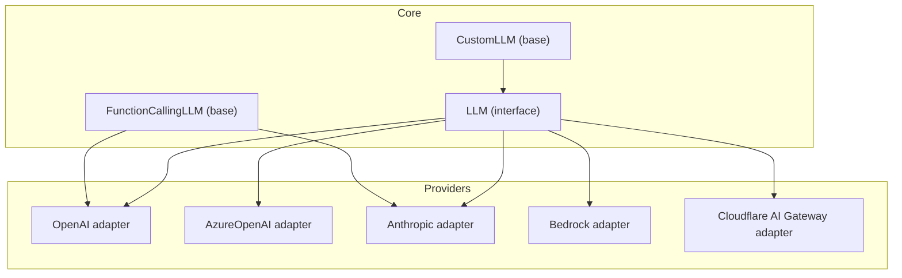
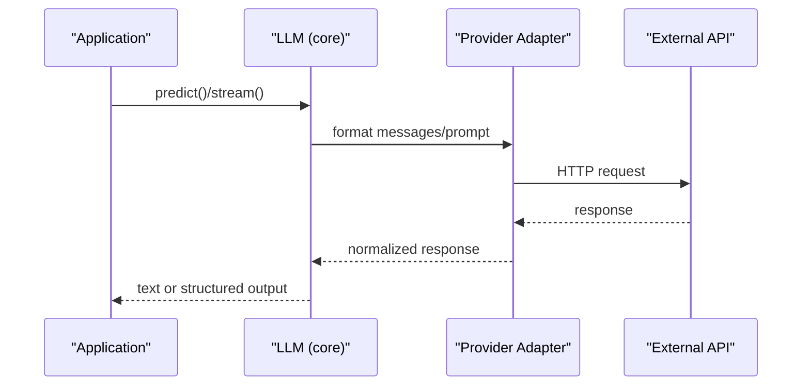
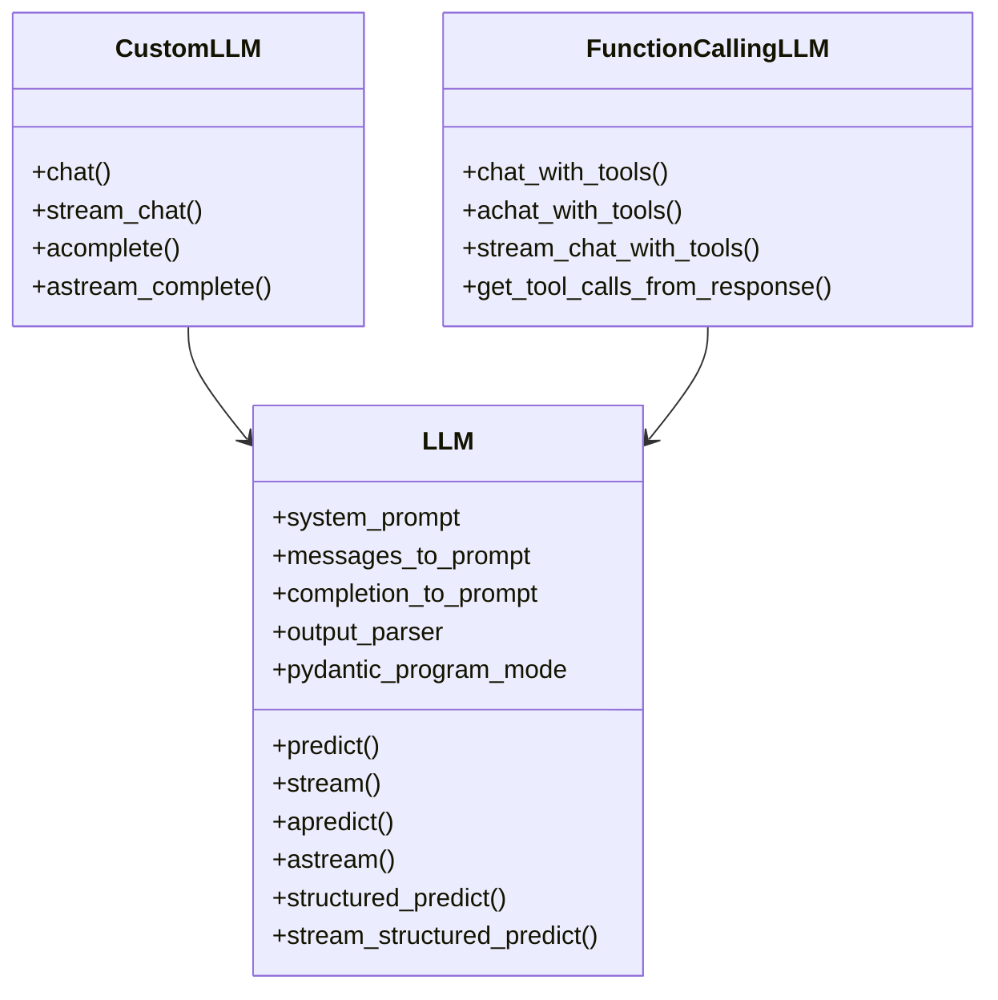
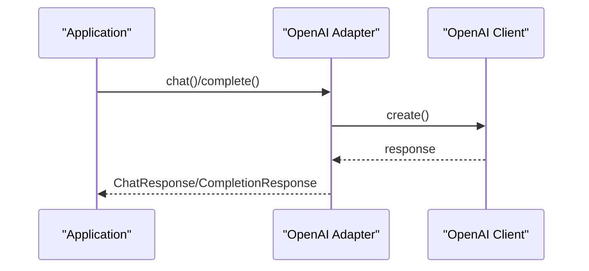
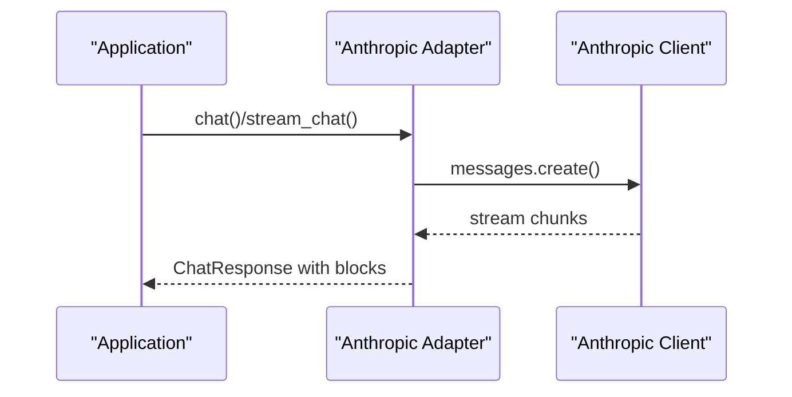
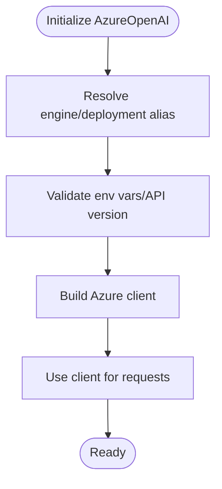
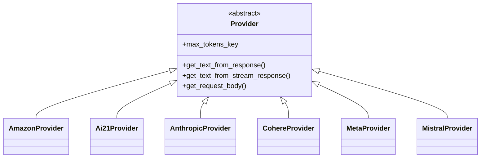
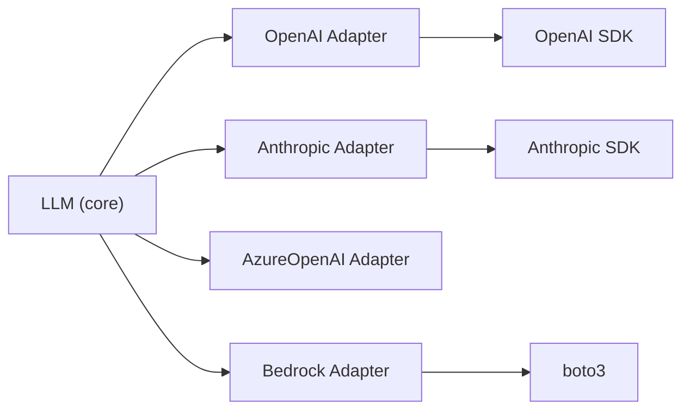

# LLM Provider Integrations

<cite>
**Referenced Files in This Document**
- [llm.py](file://llama-index-core/llama_index/core/llms/llm.py)
- [custom.py](file://llama-index-core/llama_index/core/llms/custom.py)
- [function_calling.py](file://llama-index-core/llama_index/core/llms/function_calling.py)
- [base.py](file://llama-index-integrations/llms/llama-index-llms-openai/llama_index/llms/openai/base.py)
- [__init__.py](file://llama-index-integrations/llms/llama-index-llms-openai/llama_index/llms/openai/__init__.py)
- [base.py](file://llama-index-integrations/llms/llama-index-llms-anthropic/llama_index/llms/anthropic/base.py)
- [__init__.py](file://llama-index-integrations/llms/llama-index-llms-anthropic/llama_index/llms/anthropic/__init__.py)
- [base.py](file://llama-index-integrations/llms/llama-index-llms-azure-openai/llama_index/llms/azure_openai/base.py)
- [__init__.py](file://llama-index-integrations/llms/llama-index-llms-azure-openai/llama_index/llms/azure_openai/__init__.py)
- [base.py](file://llama-index-integrations/llms/llama-index-llms-bedrock/llama_index/llms/bedrock/base.py)
- [utils.py](file://llama-index-integrations/llms/llama-index-llms-bedrock/llama_index/llms/bedrock/utils.py)
- [__init__.py](file://llama-index-integrations/llms/llama-index-llms-bedrock/llama_index/llms/bedrock/__init__.py)
- [providers.py](file://llama-index-integrations/llms/llama-index-llms-cloudflare-ai-gateway/llama_index/llms/cloudflare_ai_gateway/providers.py)
</cite>

## Table of Contents
1. [Introduction](#introduction)
2. [Project Structure](#project-structure)
3. [Core Components](#core-components)
4. [Architecture Overview](#architecture-overview)
5. [Detailed Component Analysis](#detailed-component-analysis)
6. [Dependency Analysis](#dependency-analysis)
7. [Performance Considerations](#performance-considerations)
8. [Troubleshooting Guide](#troubleshooting-guide)
9. [Conclusion](#conclusion)

## Introduction
This document provides comprehensive API documentation for LLM provider integrations in LlamaIndex. It covers the LLM interface contract, provider-specific implementations for OpenAI, Anthropic, Azure OpenAI, AWS Bedrock, and Cloudflare AI Gateway, and authentication patterns. It also documents configuration options, rate limiting, error handling, fallback mechanisms, and guidance for implementing custom LLM providers and extending existing adapters. Practical examples are provided via file references to real implementations.

## Project Structure
LlamaIndex organizes LLM integrations around a shared LLM interface and provider-specific adapters:
- Core LLM interface and utilities live under llama-index-core/llama_index/core/llms.
- Provider-specific adapters live under llama-index-integrations/llms/<provider>.

**Diagram sources**
- [llm.py](file://llama-index-core/llama_index/core/llms/llm.py#L163-L200)
- [custom.py](file://llama-index-core/llama_index/core/llms/custom.py#L22-L92)
- [function_calling.py](file://llama-index-core/llama_index/core/llms/function_calling.py#L24-L34)
- [base.py](file://llama-index-integrations/llms/llama-index-llms-openai/llama_index/llms/openai/base.py#L139-L366)
- [base.py](file://llama-index-integrations/llms/llama-index-llms-anthropic/llama_index/llms/anthropic/base.py#L116-L303)
- [base.py](file://llama-index-integrations/llms/llama-index-llms-azure-openai/llama_index/llms/azure_openai/base.py#L20-L100)
- [base.py](file://llama-index-integrations/llms/llama-index-llms-bedrock/llama_index/llms/bedrock/base.py#L49-L130)
- [providers.py](file://llama-index-integrations/llms/llama-index-llms-cloudflare-ai-gateway/llama_index/llms/cloudflare_ai_gateway/providers.py#L8-L48)

**Section sources**
- [llm.py](file://llama-index-core/llama_index/core/llms/llm.py#L163-L200)
- [custom.py](file://llama-index-core/llama_index/core/llms/custom.py#L22-L92)
- [function_calling.py](file://llama-index-core/llama_index/core/llms/function_calling.py#L24-L34)

## Core Components
- LLM: The primary interface that defines predict/stream/structured prediction APIs, chat/completion endpoints, and prompt/message conversion hooks.
- CustomLLM: A minimal base class for building custom LLMs by implementing core methods.
- FunctionCallingLLM: Extends LLM to support function/tool calling workflows.

Key responsibilities:
- Unified predict/stream APIs for both chat and completion modes.
- Structured output support via Pydantic programs.
- Streaming token generators for both sync and async flows.
- Tool/function calling orchestration with validation and parallel execution support.

**Section sources**
- [llm.py](file://llama-index-core/llama_index/core/llms/llm.py#L588-L775)
- [custom.py](file://llama-index-core/llama_index/core/llms/custom.py#L22-L92)
- [function_calling.py](file://llama-index-core/llama_index/core/llms/function_calling.py#L24-L34)

## Architecture Overview
The LLM architecture follows a layered design:
- Core LLM interface abstracts provider differences.
- Provider adapters encapsulate API clients, authentication, and request/response transformations.
- Utilities handle retries, token counting, and provider-specific message formatting.

**Diagram sources**
- [llm.py](file://llama-index-core/llama_index/core/llms/llm.py#L588-L775)
- [base.py](file://llama-index-integrations/llms/llama-index-llms-openai/llama_index/llms/openai/base.py#L394-L522)
- [base.py](file://llama-index-integrations/llms/llama-index-llms-anthropic/llama_index/llms/anthropic/base.py#L417-L441)

## Detailed Component Analysis

### LLM Interface Contract
The LLM class defines:
- Synchronous and asynchronous predict/stream methods.
- Structured prediction and streaming variants.
- Chat/completion endpoints with optional prompt/message conversion hooks.
- Metadata exposing model capabilities (chat, function calling, context window).

**Diagram sources**
- [llm.py](file://llama-index-core/llama_index/core/llms/llm.py#L163-L200)
- [custom.py](file://llama-index-core/llama_index/core/llms/custom.py#L22-L92)
- [function_calling.py](file://llama-index-core/llama_index/core/llms/function_calling.py#L24-L34)

**Section sources**
- [llm.py](file://llama-index-core/llama_index/core/llms/llm.py#L588-L775)
- [custom.py](file://llama-index-core/llama_index/core/llms/custom.py#L22-L92)
- [function_calling.py](file://llama-index-core/llama_index/core/llms/function_calling.py#L24-L34)

### OpenAI Adapter
Capabilities:
- Chat and completion endpoints with automatic switching based on model capability.
- Streaming support for both chat and completion.
- Function/tool calling via OpenAI’s function calling API.
- Retry decorator with exponential backoff.
- Token counting and logprobs extraction.
- Audio/modality support (text/audio) with appropriate restrictions.

Configuration highlights:
- Model selection, temperature, max_tokens, logprobs/top_logprobs.
- Additional kwargs forwarded to API.
- Max retries, timeout, reuse client flag.
- API key/base/version resolution.

Authentication:
- Environment-based or explicit API key.
- Optional custom httpx clients.

Rate limiting and retries:
- Built-in retry decorator with exponential backoff and configurable max retries.

Error handling:
- Validation for unsupported models and streaming audio.
- Proper error propagation from API responses.

**Diagram sources**
- [base.py](file://llama-index-integrations/llms/llama-index-llms-openai/llama_index/llms/openai/base.py#L394-L522)
- [base.py](file://llama-index-integrations/llms/llama-index-llms-openai/llama_index/llms/openai/base.py#L595-L653)

**Section sources**
- [base.py](file://llama-index-integrations/llms/llama-index-llms-openai/llama_index/llms/openai/base.py#L139-L366)
- [base.py](file://llama-index-integrations/llms/llama-index-llms-openai/llama_index/llms/openai/base.py#L394-L522)
- [base.py](file://llama-index-integrations/llms/llama-index-llms-openai/llama_index/llms/openai/base.py#L595-L653)
- [__init__.py](file://llama-index-integrations/llms/llama-index-llms-openai/llama_index/llms/openai/__init__.py#L1-L5)

### Anthropic Adapter
Capabilities:
- Chat and streaming chat with support for thinking blocks, citations, and tool use blocks.
- Function/tool calling via Anthropic’s tool use blocks.
- Vertex and Bedrock variants for cloud deployments.
- Prompt caching and thinking controls.

Configuration highlights:
- Model, temperature, max_tokens.
- Base URL, timeout, max retries.
- Cache index for prompt caching.
- Thinking configuration and tool definitions.
- MCP servers support.

Authentication:
- Standard API key, or Vertex/Bedrock credentials.

**Diagram sources**
- [base.py](file://llama-index-integrations/llms/llama-index-llms-anthropic/llama_index/llms/anthropic/base.py#L417-L441)
- [base.py](file://llama-index-integrations/llms/llama-index-llms-anthropic/llama_index/llms/anthropic/base.py#L452-L653)

**Section sources**
- [base.py](file://llama-index-integrations/llms/llama-index-llms-anthropic/llama_index/llms/anthropic/base.py#L116-L303)
- [base.py](file://llama-index-integrations/llama-index-llms-anthropic/llama_index/llms/anthropic/base.py#L417-L441)
- [base.py](file://llama-index-integrations/llms/llama-index-llms-anthropic/llama_index/llms/anthropic/base.py#L452-L653)
- [__init__.py](file://llama-index-integrations/llms/llama-index-llms-anthropic/llama_index/llms/anthropic/__init__.py#L1-L4)

### Azure OpenAI Adapter
Capabilities:
- Inherits OpenAI adapter behavior while adding Azure-specific routing and authentication.
- Supports Azure AD token provider or API key.
- Engine/deployment mapping and endpoint normalization.

Configuration highlights:
- Engine (deployment name), Azure endpoint, API version.
- Use Azure AD flag and token provider.
- Alias resolution for deployment identifiers.

Authentication:
- API key or Azure AD token provider.
- Environment variable validation enforced.

**Diagram sources**
- [base.py](file://llama-index-integrations/llms/llama-index-llms-azure-openai/llama_index/llms/azure_openai/base.py#L109-L180)
- [base.py](file://llama-index-integrations/llms/llama-index-llms-azure-openai/llama_index/llms/azure_openai/base.py#L186-L200)

**Section sources**
- [base.py](file://llama-index-integrations/llms/llama-index-llms-azure-openai/llama_index/llms/azure_openai/base.py#L20-L100)
- [base.py](file://llama-index-integrations/llms/llama-index-llms-azure-openai/llama_index/llms/azure_openai/base.py#L109-L180)
- [__init__.py](file://llama-index-integrations/llms/llama-index-llms-azure-openai/llama_index/llms/azure_openai/__init__.py#L1-L8)

### AWS Bedrock Adapter
Capabilities:
- Provider abstraction for multiple foundation models (Amazon, AI21, Anthropic, Cohere, Meta, Mistral).
- Request/response normalization across providers.
- Streaming support for selected models.
- Guardrails and tracing support.

Configuration highlights:
- Model ID, temperature, max_tokens, context size.
- AWS credentials/profile/region configuration.
- Max retries, timeout, guardrail identifier/version, trace.
- Provider type selection or auto-detection by model ARN.

Authentication:
- boto3 session with profile/region/credentials.

**Diagram sources**
- [utils.py](file://llama-index-integrations/llms/llama-index-llms-bedrock/llama_index/llms/bedrock/utils.py#L140-L156)
- [utils.py](file://llama-index-integrations/llms/llama-index-llms-bedrock/llama_index/llms/bedrock/utils.py#L158-L260)

**Section sources**
- [base.py](file://llama-index-integrations/llms/llama-index-llms-bedrock/llama_index/llms/bedrock/base.py#L49-L130)
- [utils.py](file://llama-index-integrations/llms/llama-index-llms-bedrock/llama_index/llms/bedrock/utils.py#L288-L312)
- [__init__.py](file://llama-index-integrations/llms/llama-index-llms-bedrock/llama_index/llms/bedrock/__init__.py#L1-L14)

### Cloudflare AI Gateway Adapter
Capabilities:
- Provider configuration abstraction with endpoint transformation helpers.
- Regex-based provider detection and endpoint normalization for specific providers (e.g., Azure OpenAI).

Authentication:
- Provider-specific endpoint transformation and token handling.

**Section sources**
- [providers.py](file://llama-index-integrations/llms/llama-index-llms-cloudflare-ai-gateway/llama_index/llms/cloudflare_ai_gateway/providers.py#L8-L48)

## Dependency Analysis
Provider adapters depend on:
- Core LLM interface for unified behavior.
- Provider SDKs (OpenAI, Anthropic, boto3) for API access.
- Utility modules for message formatting, retries, and token counting.

**Diagram sources**
- [llm.py](file://llama-index-core/llama_index/core/llms/llm.py#L163-L200)
- [base.py](file://llama-index-integrations/llms/llama-index-llms-openai/llama_index/llms/openai/base.py#L84-L85)
- [base.py](file://llama-index-integrations/llms/llama-index-llms-anthropic/llama_index/llms/anthropic/base.py#L56)
- [base.py](file://llama-index-integrations/llms/llama-index-llms-bedrock/llama_index/llms/bedrock/base.py#L177-L194)

**Section sources**
- [llm.py](file://llama-index-core/llama_index/core/llms/llm.py#L163-L200)
- [base.py](file://llama-index-integrations/llms/llama-index-llms-openai/llama_index/llms/openai/base.py#L84-L85)
- [base.py](file://llama-index-integrations/llms/llama-index-llms-anthropic/llama_index/llms/anthropic/base.py#L56)
- [base.py](file://llama-index-integrations/llms/llama-index-llms-bedrock/llama_index/llms/bedrock/base.py#L177-L194)

## Performance Considerations
- Client reuse: Enable reuse_client for OpenAI/Azure to reduce connection overhead.
- Streaming: Prefer streaming for long responses to lower latency and memory footprint.
- Token estimation: Use built-in tokenizers or context window metadata to avoid oversized prompts.
- Retries: Tune max_retries and timeout per provider to balance reliability and latency.
- Parallel tool calls: Enable parallel tool calls when safe to improve throughput.

[No sources needed since this section provides general guidance]

## Troubleshooting Guide
Common issues and resolutions:
- Unsupported model: Ensure the model supports the chosen endpoint (chat vs. completion) and adjust accordingly.
- Authentication failures: Verify API keys, environment variables, and Azure AD token provider setup.
- Streaming errors: Some providers/models do not support streaming; check provider capabilities and disable streaming if needed.
- Rate limits/throttling: Use built-in retry decorators and consider exponential backoff; adjust max_retries and timeout.
- Tool/function calling mismatches: Confirm provider supports function/tool calling and that tool definitions are valid.

**Section sources**
- [base.py](file://llama-index-integrations/llms/llama-index-llms-openai/llama_index/llms/openai/base.py#L304-L307)
- [base.py](file://llama-index-integrations/llms/llama-index-llms-azure-openai/llama_index/llms/azure_openai/base.py#L197-L198)
- [base.py](file://llama-index-integrations/llms/llama-index-llms-bedrock/llama_index/llms/bedrock/base.py#L315-L316)

## Conclusion
LlamaIndex provides a robust, extensible LLM interface with first-class adapters for major providers. The adapters encapsulate provider-specific concerns while maintaining a consistent API surface for predictions, streaming, structured outputs, and function/tool calling. By leveraging the provided utilities for retries, token counting, and message formatting, developers can implement reliable integrations and build custom adapters with minimal boilerplate.