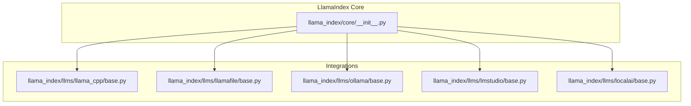
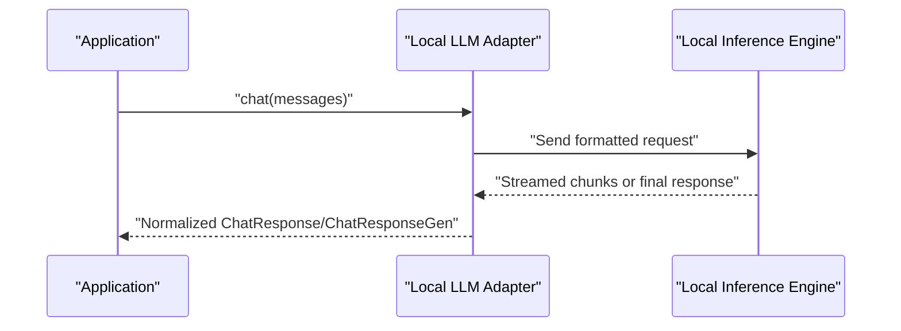
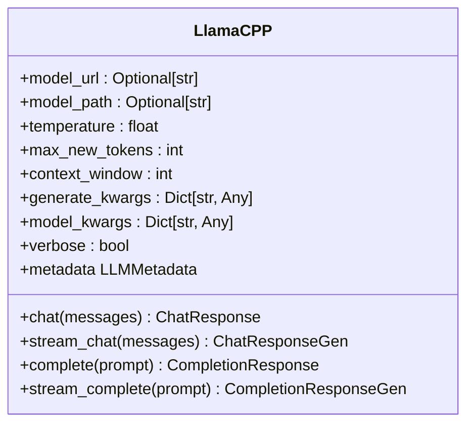
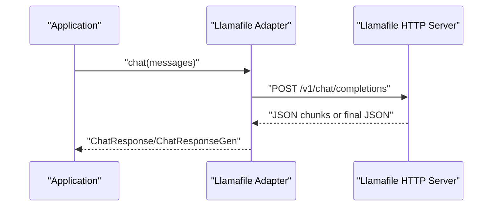
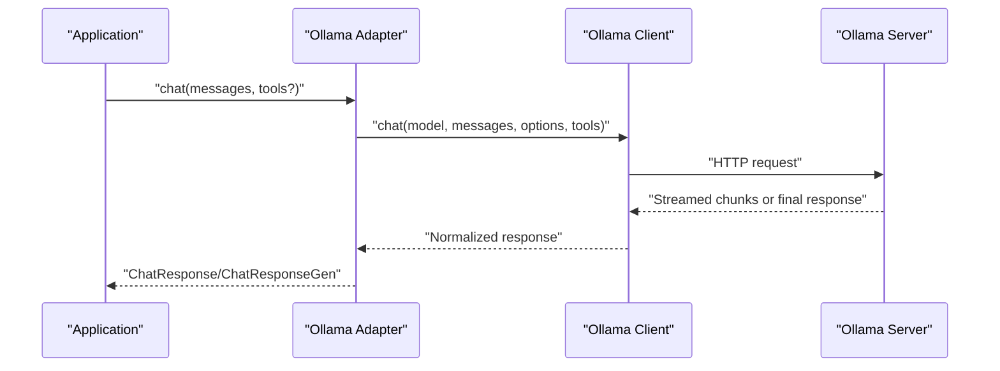
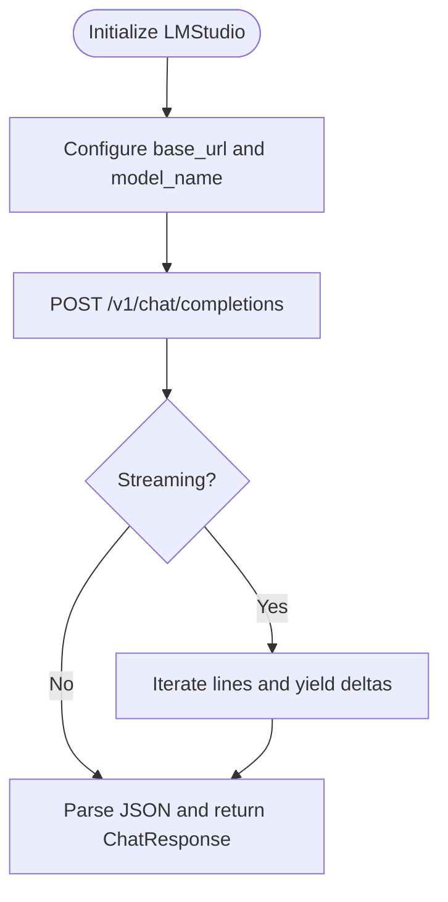
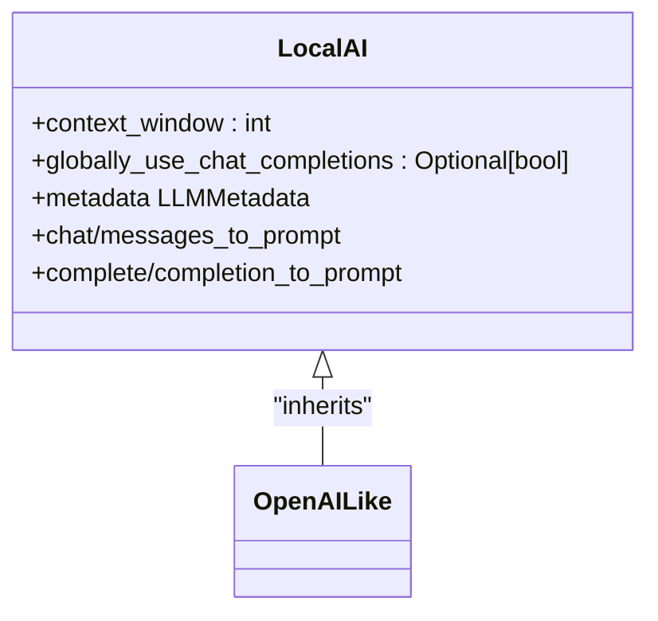
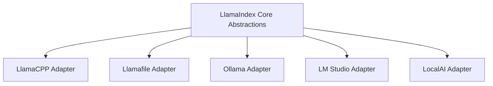
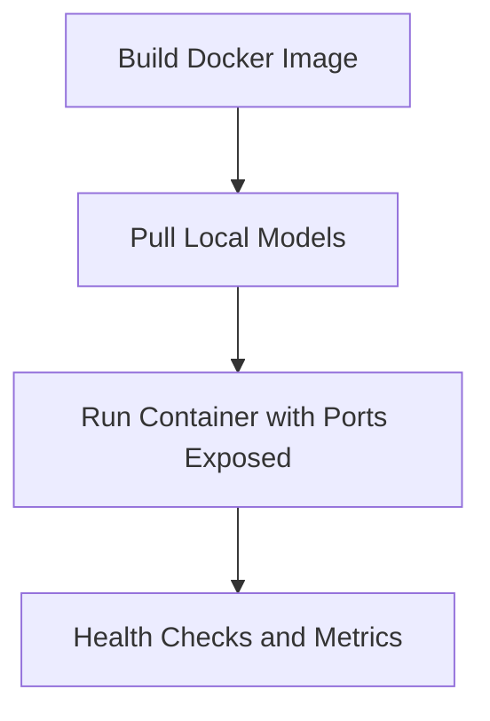

# Local Model Integrations

<cite>
**Referenced Files in This Document**
- [llama_index/core/__init__.py](file://llama-index-core/llama_index/core/__init__.py)
- [llama_index/llms/llama_cpp/base.py](file://llama-index-integrations/llms/llama-index-llms-llama-cpp/llama_index/llms/llama_cpp/base.py)
- [llama_index/llms/llamafile/base.py](file://llama-index-integrations/llms/llama-index-llms-llamafile/llama_index/llms/llamafile/base.py)
- [llama_index/llms/ollama/base.py](file://llama-index-integrations/llms/llama-index-llms-ollama/llama_index/llms/ollama/base.py)
- [llama_index/llms/lmstudio/base.py](file://llama-index-integrations/llms/llama-index-llms-lmstudio/llama_index/llms/lmstudio/base.py)
- [llama_index/llms/localai/base.py](file://llama-index-integrations/llms/llama-index-llms-localai/llama_index/llms/localai/base.py)
- [llama-index-llms-llama-cpp README.md](file://llama-index-integrations/llms/llama-index-llms-llama-cpp/README.md)
- [llama-index-llms-llamafile README.md](file://llama-index-integrations/llms/llama-index-llms-llamafile/README.md)
- [llama-index-llms-ollama README.md](file://llama-index-integrations/llms/llama-index-llms-ollama/README.md)
- [llama-index-llms-lmstudio README.md](file://llama-index-integrations/llms/llama-index-llms-lmstudio/README.md)
- [FastAPI + LlamaIndex RAG Example README.md](file://examples/fastapi_rag_ollama/README.md)
- [FastAPI + LlamaIndex RAG Example app.py](file://examples/fastapi_rag_ollama/app.py)
- [FastAPI + LlamaIndex RAG Example requirements.txt](file://examples/fastapi_rag_ollama/requirements.txt)
</cite>

## Table of Contents
1. [Introduction](#introduction)
2. [Project Structure](#project-structure)
3. [Core Components](#core-components)
4. [Architecture Overview](#architecture-overview)
5. [Detailed Component Analysis](#detailed-component-analysis)
6. [Dependency Analysis](#dependency-analysis)
7. [Performance Considerations](#performance-considerations)
8. [Troubleshooting Guide](#troubleshooting-guide)
9. [Conclusion](#conclusion)
10. [Appendices](#appendices)

## Introduction
This document provides comprehensive API documentation for local model integrations in LlamaIndex. It focuses on self-hosted inference solutions including llama.cpp, llamafile, Ollama, LM Studio, and LocalAI. The guide covers installation prerequisites, model loading, GPU acceleration, memory optimization, performance tuning, containerization strategies, Docker deployment, and local development workflows. It also addresses common issues such as CUDA compatibility, memory limits, and model format requirements.

## Project Structure
The repository organizes local LLM integrations as separate packages under the integrations namespace. Each integration exposes a dedicated LLM class that conforms to LlamaIndex’s LLM interface, enabling consistent usage across different local inference engines. The core LlamaIndex module provides foundational abstractions and utilities leveraged by these integrations.

**Diagram sources**
- [llama_index/core/__init__.py](file://llama-index-core/llama_index/core/__init__.py#L1-L162)
- [llama_index/llms/llama_cpp/base.py](file://llama-index-integrations/llms/llama-index-llms-llama-cpp/llama_index/llms/llama_cpp/base.py#L1-L303)
- [llama_index/llms/llamafile/base.py](file://llama-index-integrations/llms/llama-index-llms-llamafile/llama_index/llms/llamafile/base.py#L1-L279)
- [llama_index/llms/ollama/base.py](file://llama-index-integrations/llms/llama-index-llms-ollama/llama_index/llms/ollama/base.py#L1-L825)
- [llama_index/llms/lmstudio/base.py](file://llama-index-integrations/llms/llama-index-llms-lmstudio/llama_index/llms/lmstudio/base.py#L1-L246)
- [llama_index/llms/localai/base.py](file://llama-index-integrations/llms/llama-index-llms-localai/llama_index/llms/localai/base.py#L1-L127)

**Section sources**
- [llama_index/core/__init__.py](file://llama-index-core/llama_index/core/__init__.py#L1-L162)

## Core Components
This section outlines the primary local LLM adapters and their responsibilities:
- LlamaCPP: Native bindings to llama.cpp for GGUF/GGML models with optional GPU acceleration.
- Llamafile: Single-file distribution with an HTTP API compatible with OpenAI-style endpoints.
- Ollama: Local runtime with a native HTTP API and function-calling support.
- LM Studio: Desktop application exposing an OpenAI-compatible API server.
- LocalAI: Open-source drop-in replacement for OpenAI APIs, compatible with OpenAI-like clients.

Each adapter implements LLM methods for chat, completion, streaming, and structured prediction, while honoring LlamaIndex’s callback and metadata contracts.

**Section sources**
- [llama_index/llms/llama_cpp/base.py](file://llama-index-integrations/llms/llama-index-llms-llama-cpp/llama_index/llms/llama_cpp/base.py#L43-L303)
- [llama_index/llms/llamafile/base.py](file://llama-index-integrations/llms/llama-index-llms-llamafile/llama_index/llms/llamafile/base.py#L29-L279)
- [llama_index/llms/ollama/base.py](file://llama-index-integrations/llms/llama-index-llms-ollama/llama_index/llms/ollama/base.py#L75-L825)
- [llama_index/llms/lmstudio/base.py](file://llama-index-integrations/llms/llama-index-llms-lmstudio/llama_index/llms/lmstudio/base.py#L44-L246)
- [llama_index/llms/localai/base.py](file://llama-index-integrations/llms/llama-index-llms-localai/llama_index/llms/localai/base.py#L32-L127)

## Architecture Overview
The integrations follow a consistent pattern:
- Adapters wrap external clients or native libraries.
- They translate LlamaIndex’s internal message and prompt formats to the target engine’s expectations.
- Streaming and non-streaming responses are normalized into LlamaIndex’s response types.
- Metadata and token usage are extracted when available.

**Diagram sources**
- [llama_index/llms/llama_cpp/base.py](file://llama-index-integrations/llms/llama-index-llms-llama-cpp/llama_index/llms/llama_cpp/base.py#L257-L303)
- [llama_index/llms/llamafile/base.py](file://llama-index-integrations/llms/llama-index-llms-llamafile/llama_index/llms/llamafile/base.py#L94-L194)
- [llama_index/llms/ollama/base.py](file://llama-index-integrations/llms/llama-index-llms-ollama/llama_index/llms/ollama/base.py#L387-L517)
- [llama_index/llms/lmstudio/base.py](file://llama-index-integrations/llms/llama-index-llms-lmstudio/llama_index/llms/lmstudio/base.py#L127-L210)

## Detailed Component Analysis

### LlamaCPP Adapter
The LlamaCPP adapter integrates with llama.cpp via the Python bindings. It supports:
- Automatic model download and caching.
- GGUF/GGML model selection based on installed library version.
- GPU acceleration via model_kwargs (e.g., n_gpu_layers).
- Chat and completion APIs with optional custom prompt formatting.
- Streaming and non-streaming generation.

**Diagram sources**
- [llama_index/llms/llama_cpp/base.py](file://llama-index-integrations/llms/llama-index-llms-llama-cpp/llama_index/llms/llama_cpp/base.py#L43-L303)

**Section sources**
- [llama_index/llms/llama_cpp/base.py](file://llama-index-integrations/llms/llama-index-llms-llama-cpp/llama_index/llms/llama_cpp/base.py#L134-L199)
- [llama-index-llms-llama-cpp README.md](file://llama-index-integrations/llms/llama-index-llms-llama-cpp/README.md#L1-L140)

### Llamafile Adapter
The Llamafile adapter communicates with a local HTTP server exposing OpenAI-compatible endpoints. It supports:
- Configurable base_url and request timeouts.
- Chat and completion endpoints with streaming support.
- Additional options passed to the server via payload.

**Diagram sources**
- [llama_index/llms/llamafile/base.py](file://llama-index-integrations/llms/llama-index-llms-llamafile/llama_index/llms/llamafile/base.py#L94-L194)

**Section sources**
- [llama_index/llms/llamafile/base.py](file://llama-index-integrations/llms/llama-index-llamafile/llama_index/llms/llamafile/base.py#L29-L93)
- [llama-index-llms-llamafile README.md](file://llama-index-integrations/llms/llama-index-llms-llamafile/README.md#L1-L108)

### Ollama Adapter
The Ollama adapter uses the official Python client to communicate with a local Ollama server. It supports:
- Function-calling and tool-use with structured outputs.
- JSON mode for deterministic parsing.
- Streaming chat and completions.
- Automatic context window detection from model info.
- Async variants for non-blocking operations.

**Diagram sources**
- [llama_index/llms/ollama/base.py](file://llama-index-integrations/llms/llama-index-llms-ollama/llama_index/llms/ollama/base.py#L387-L517)

**Section sources**
- [llama_index/llms/ollama/base.py](file://llama-index-integrations/llms/llama-index-llms-ollama/llama_index/llms/ollama/base.py#L75-L231)
- [llama-index-llms-ollama README.md](file://llama-index-integrations/llms/llama-index-llms-ollama/README.md#L1-L134)

### LM Studio Adapter
The LM Studio adapter connects to the desktop application’s OpenAI-compatible API server. It supports:
- Chat and completion endpoints.
- Streaming responses with SSE-like parsing.
- Configurable base_url and model name.

**Diagram sources**
- [llama_index/llms/lmstudio/base.py](file://llama-index-integrations/llms/llama-index-llms-lmstudio/llama_index/llms/lmstudio/base.py#L127-L210)

**Section sources**
- [llama_index/llms/lmstudio/base.py](file://llama-index-integrations/llms/llama-index-llms-lmstudio/llama_index/llms/lmstudio/base.py#L44-L90)
- [llama-index-llms-lmstudio README.md](file://llama-index-integrations/llms/llama-index-llms-lmstudio/README.md#L1-L37)

### LocalAI Adapter
The LocalAI adapter extends the OpenAI-like client to integrate with LocalAI’s OpenAI-compatible API. It supports:
- OpenAI-like chat and completion endpoints.
- Function-calling model detection.
- Context window and token usage metadata.

**Diagram sources**
- [llama_index/llms/localai/base.py](file://llama-index-integrations/llms/llama-index-llms-localai/llama_index/llms/localai/base.py#L32-L127)

**Section sources**
- [llama_index/llms/localai/base.py](file://llama-index-integrations/llms/llama-index-llms-localai/llama_index/llms/localai/base.py#L32-L127)

## Dependency Analysis
The adapters depend on:
- LlamaIndex core abstractions for LLM interfaces, callbacks, and metadata.
- External libraries for HTTP communication (httpx) and native bindings (llama-cpp-python).
- Optional clients for async operations (asyncio) and structured outputs (Pydantic).

**Diagram sources**
- [llama_index/core/__init__.py](file://llama-index-core/llama_index/core/__init__.py#L1-L162)
- [llama_index/llms/llama_cpp/base.py](file://llama-index-integrations/llms/llama-index-llms-llama-cpp/llama_index/llms/llama_cpp/base.py#L1-L303)
- [llama_index/llms/llamafile/base.py](file://llama-index-integrations/llms/llama-index-llamafile/llama_index/llms/llamafile/base.py#L1-L279)
- [llama_index/llms/ollama/base.py](file://llama-index-integrations/llms/llama-index-llms-ollama/llama_index/llms/ollama/base.py#L1-L825)
- [llama_index/llms/lmstudio/base.py](file://llama-index-integrations/llms/llama-index-llms-lmstudio/llama_index/llms/lmstudio/base.py#L1-L246)
- [llama_index/llms/localai/base.py](file://llama-index-integrations/llms/llama-index-llms-localai/llama_index/llms/localai/base.py#L1-L127)

**Section sources**
- [llama_index/core/__init__.py](file://llama-index-core/llama_index/core/__init__.py#L1-L162)

## Performance Considerations
- GPU acceleration
  - LlamaCPP: Use model_kwargs to enable GPU layers (e.g., n_gpu_layers). Installation guides specify CuBLAS for CUDA, METAL for Apple Silicon, and CLBlast for AMD/Intel GPUs.
  - Llamafile: GPU acceleration depends on the underlying model binary; ensure the model supports hardware acceleration.
  - Ollama: Models are served with GPU acceleration when supported by the host; verify model availability and server logs.
  - LM Studio: GPU acceleration is configured within the application; ensure the model is loaded with appropriate backend support.
  - LocalAI: Inherits OpenAI-like performance characteristics; configure model backends accordingly.

- Memory optimization
  - Reduce context_window to fit available VRAM/CPU RAM.
  - Use quantized GGUF models for LlamaCPP to reduce memory footprint.
  - Limit max_new_tokens to control generation length.
  - Close unused model instances and reuse connections where possible.

- Batch processing and resource management
  - Prefer streaming APIs for long-running generations to reduce latency.
  - Use async variants (Ollama achat/astream_chat) for concurrent workloads.
  - Implement connection pooling and timeouts for HTTP-based adapters.

- Model selection and quantization
  - Choose GGUF models for LlamaCPP; select appropriate quantization (e.g., Q3_K_M, Q4_K_M) for balance between quality and speed.
  - For Ollama, select models optimized for your workload (e.g., smaller instruct variants for chat).
  - Llamafile supports single-file distributions; pick a model size suitable for your hardware.

**Section sources**
- [llama-index-llms-llama-cpp README.md](file://llama-index-integrations/llms/llama-index-llms-llama-cpp/README.md#L3-L20)
- [llama_index/llms/llama_cpp/base.py](file://llama-index-integrations/llms/llama-index-llms-llama-cpp/llama_index/llms/llama_cpp/base.py#L150-L199)
- [llama_index/llms/llamafile/base.py](file://llama-index-integrations/llms/llama-index-llamafile/llama_index/llms/llamafile/base.py#L45-L53)
- [llama-index-llms-ollama README.md](file://llama-index-integrations/llms/llama-index-llms-ollama/README.md#L11-L17)
- [llama_index/llms/lmstudio/base.py](file://llama-index-integrations/llms/llama-index-llms-lmstudio/llama_index/llms/lmstudio/base.py#L44-L88)
- [llama_index/llms/localai/base.py](file://llama-index-integrations/llms/llama-index-llms-localai/llama_index/llms/localai/base.py#L20-L29)

## Troubleshooting Guide
- CUDA compatibility and driver issues
  - Verify CUDA toolkit and driver versions match the compiled bindings.
  - For LlamaCPP, recompile with the correct BLAS backend (CuBLAS for CUDA).
  - Check Ollama logs for GPU initialization errors.

- Memory limits and out-of-memory errors
  - Lower context_window and max_new_tokens.
  - Use lighter quantization or smaller models.
  - Terminate long-running sessions and restart the server.

- Model format requirements
  - LlamaCPP expects GGUF/GGML models; ensure the correct format is selected.
  - Llamafile requires a compatible single-file model with an embedded server.
  - Ollama models must be pulled and available locally.

- Network and connectivity
  - Confirm base_url and port accessibility for Llamafile, LM Studio, and LocalAI.
  - Increase request_timeout for slow models or constrained networks.

- Streaming and parsing issues
  - Validate SSE-like streaming parsing for LM Studio and Llamafile.
  - For Ollama, handle tool_calls and thinking blocks appropriately.

**Section sources**
- [llama_index/llms/llama_cpp/base.py](file://llama-index-integrations/llms/llama-index-llms-llama-cpp/llama_index/llms/llama_cpp/base.py#L227-L255)
- [llama_index/llms/llamafile/base.py](file://llama-index-integrations/llms/llama-index-llamafile/llama_index/llms/llamafile/base.py#L261-L279)
- [llama-index-llms-lmstudio README.md](file://llama-index-integrations/llms/llama-index-llms-lmstudio/README.md#L7-L13)
- [llama-index-llms-ollama README.md](file://llama-index-integrations/llms/llama-index-llms-ollama/README.md#L11-L17)

## Conclusion
LlamaIndex provides robust, unified integrations for popular local inference engines. By leveraging standardized adapters, developers can seamlessly switch between llama.cpp, llamafile, Ollama, LM Studio, and LocalAI while maintaining consistent APIs for chat, completion, streaming, and structured outputs. Proper configuration of GPU acceleration, memory settings, and model formats ensures optimal performance and reliability in local deployments.

## Appendices

### Installation and Quick Start
- LlamaCPP
  - Install the Python bindings with GPU support and the LlamaIndex integration package.
  - Initialize with a GGUF model URL or local path and configure model_kwargs for GPU acceleration.
- Llamafile
  - Download a single-file model, make it executable, and start the server.
  - Configure the adapter’s base_url to point to the running server.
- Ollama
  - Install Ollama, pull a model, and start the server.
  - Initialize the adapter pointing to the default localhost port.
- LM Studio
  - Enable the local server in the application, load a model, and connect via the adapter.
- LocalAI
  - Start LocalAI and configure the adapter to use the OpenAI-compatible API base.

**Section sources**
- [llama-index-llms-llama-cpp README.md](file://llama-index-integrations/llms/llama-index-llms-llama-cpp/README.md#L3-L20)
- [llama-index-llms-llamafile README.md](file://llama-index-integrations/llms/llama-index-llamafile/README.md#L3-L29)
- [llama-index-llms-ollama README.md](file://llama-index-integrations/llms/llama-index-llms-ollama/README.md#L3-L17)
- [llama-index-llms-lmstudio README.md](file://llama-index-integrations/llms/llama-index-llms-lmstudio/README.md#L3-L13)
- [llama_index/llms/localai/base.py](file://llama-index-integrations/llms/llama-index-llms-localai/llama_index/llms/localai/base.py#L32-L47)

### Containerization Strategies and Docker Deployment
- Use the FastAPI + LlamaIndex RAG example as a reference for containerizing a local LLM API.
- Pull required models inside the container or mount volumes for persistent storage.
- Expose the API port and configure health checks.
- For GPU-accelerated deployments, use NVIDIA Container Toolkit and appropriate base images.

**Diagram sources**
- [FastAPI + LlamaIndex RAG Example README.md](file://examples/fastapi_rag_ollama/README.md#L15-L44)

**Section sources**
- [FastAPI + LlamaIndex RAG Example README.md](file://examples/fastapi_rag_ollama/README.md#L1-L58)
- [FastAPI + LlamaIndex RAG Example app.py](file://examples/fastapi_rag_ollama/app.py)
- [FastAPI + LlamaIndex RAG Example requirements.txt](file://examples/fastapi_rag_ollama/requirements.txt)