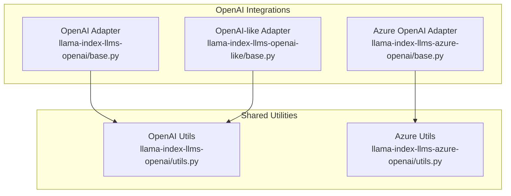
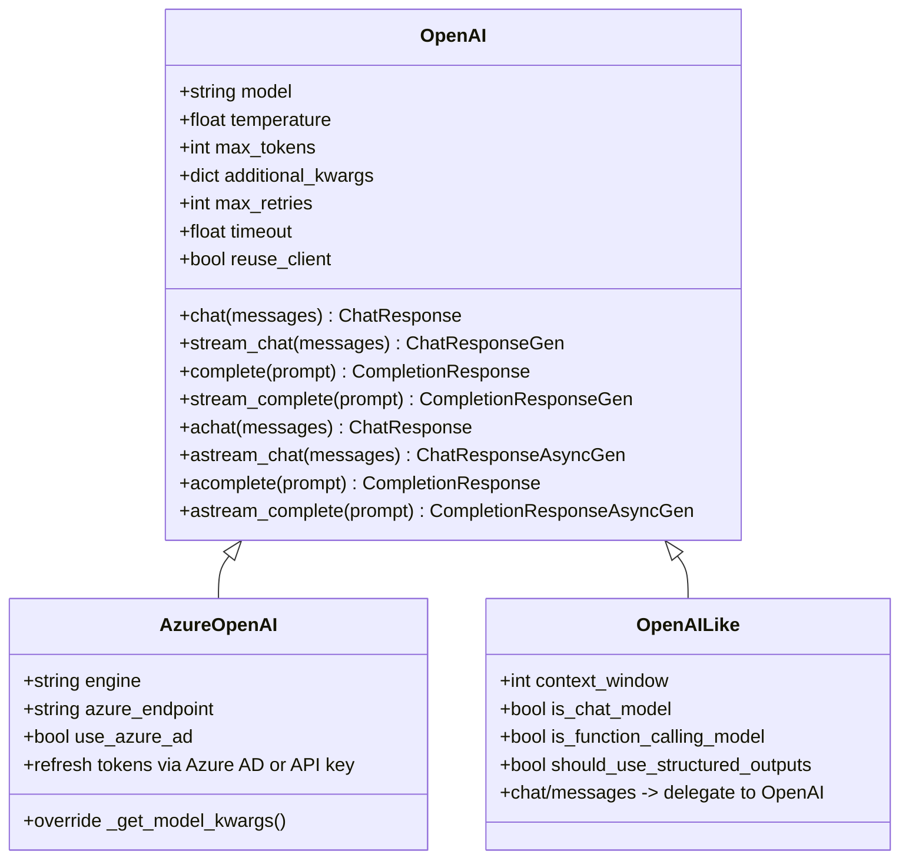
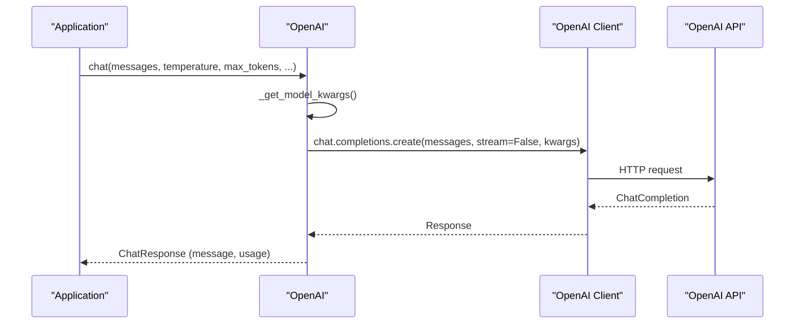
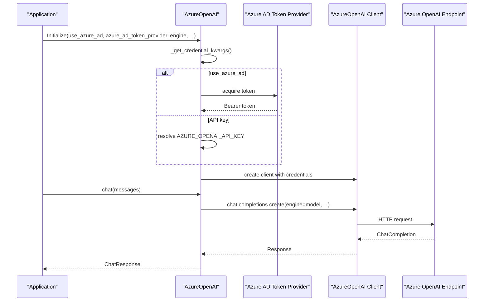
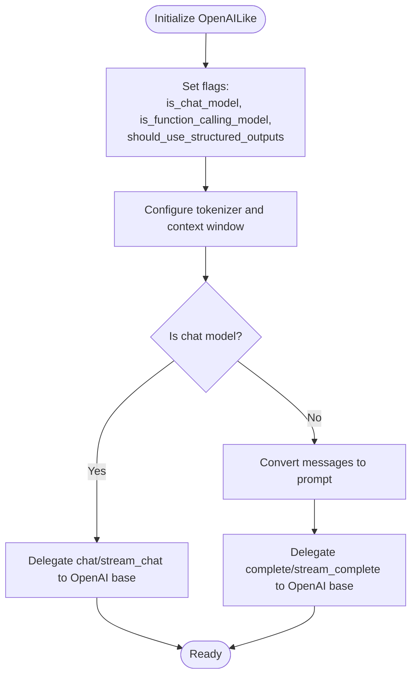
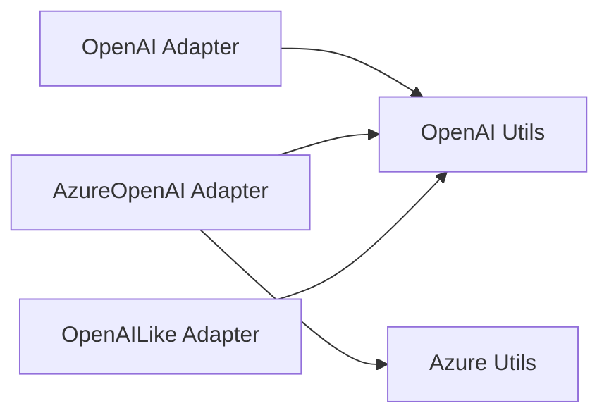

# OpenAI Integrations

<cite>
**Referenced Files in This Document**
- [llama-index-llms-openai/base.py](file://llama-index-integrations/llms/llama-index-llms-openai/llama_index/llms/openai/base.py)
- [llama-index-llms-openai/__init__.py](file://llama-index-integrations/llms/llama-index-llms-openai/llama_index/llms/openai/__init__.py)
- [llama-index-llms-openai/utils.py](file://llama-index-integrations/llms/llama-index-llms-openai/llama_index/llms/openai/utils.py)
- [llama-index-llms-azure-openai/base.py](file://llama-index-integrations/llms/llama-index-llms-azure-openai/llama_index/llms/azure_openai/base.py)
- [llama-index-llms-azure-openai/__init__.py](file://llama-index-integrations/llms/llama-index-llms-azure-openai/llama_index/llms/azure_openai/__init__.py)
- [llama-index-llms-azure-openai/utils.py](file://llama-index-integrations/llms/llama-index-llms-azure-openai/llama_index/llms/azure_openai/utils.py)
- [llama-index-llms-openai-like/base.py](file://llama-index-integrations/llms/llama-index-llms-openai-like/llama_index/llms/openai_like/base.py)
- [llama-index-llms-openai-like/__init__.py](file://llama-index-integrations/llms/llama-index-llms-openai-like/llama_index/llms/openai_like/__init__.py)
</cite>

## Table of Contents
1. [Introduction](#introduction)
2. [Project Structure](#project-structure)
3. [Core Components](#core-components)
4. [Architecture Overview](#architecture-overview)
5. [Detailed Component Analysis](#detailed-component-analysis)
6. [Dependency Analysis](#dependency-analysis)
7. [Performance Considerations](#performance-considerations)
8. [Troubleshooting Guide](#troubleshooting-guide)
9. [Conclusion](#conclusion)

## Introduction
This document provides comprehensive API documentation for OpenAI integrations in LlamaIndex. It covers:
- The OpenAI LLM adapter for GPT-3.5, GPT-4, GPT-4o, and related models
- Azure OpenAI integration with API key and Azure AD authentication
- OpenAI-compatible API support via an OpenAI-like adapter
- Streaming responses, function/tool calling, and structured outputs
- Configuration parameters, rate limiting, retry mechanisms, and fallback strategies
- Practical examples for model selection, temperature controls, response formats, and error handling

## Project Structure
The OpenAI integrations are implemented across three primary adapters:
- OpenAI adapter: core implementation for OpenAI models
- Azure OpenAI adapter: extension supporting Azure endpoints and Azure AD
- OpenAI-like adapter: generic adapter for OpenAI-compatible APIs

**Diagram sources**
- [llama-index-llms-openai/base.py](file://llama-index-integrations/llms/llama-index-llms-openai/llama_index/llms/openai/base.py#L139-L366)
- [llama-index-llms-azure-openai/base.py](file://llama-index-integrations/llms/llama-index-llms-azure-openai/llama_index/llms/azure_openai/base.py#L20-L266)
- [llama-index-llms-openai-like/base.py](file://llama-index-integrations/llms/llama-index-llms-openai-like/llama_index/llms/openai_like/base.py#L24-L229)
- [llama-index-llms-openai/utils.py](file://llama-index-integrations/llms/llama-index-llms-openai/llama_index/llms/openai/utils.py#L1-L200)
- [llama-index-llms-azure-openai/utils.py](file://llama-index-integrations/llms/llama-index-llms-azure-openai/llama_index/llms/azure_openai/utils.py#L1-L200)

**Section sources**
- [llama-index-llms-openai/base.py](file://llama-index-integrations/llms/llama-index-llms-openai/llama_index/llms/openai/base.py#L1-L1242)
- [llama-index-llms-azure-openai/base.py](file://llama-index-integrations/llms/llama-index-llms-azure-openai/llama_index/llms/azure_openai/base.py#L1-L266)
- [llama-index-llms-openai-like/base.py](file://llama-index-integrations/llms/llama-index-llms-openai-like/llama_index/llms/openai_like/base.py#L1-L229)

## Core Components
- OpenAI LLM adapter
  - Provides chat and completion endpoints, streaming, function/tool calling, and structured outputs
  - Supports model-specific features like reasoning effort and audio modalities
  - Includes robust retry and timeout controls
- Azure OpenAI LLM adapter
  - Extends OpenAI adapter with Azure-specific parameters and authentication
  - Supports API key and Azure AD token providers
  - Validates required environment variables and endpoint configuration
- OpenAI-like adapter
  - Generic adapter for third-party APIs compatible with OpenAI’s interface
  - Configurable context window, chat/completion modes, and function calling support

Key capabilities:
- Model selection: GPT-3.5, GPT-4, GPT-4o, GPT-4.1, O1, GPT-5, and others
- Streaming: chat and completion streams with delta updates
- Function/tool calling: automatic parsing and aggregation of tool call deltas
- Structured outputs: optional structured output support for compatible models
- Authentication: OpenAI API key and Azure AD bearer tokens
- Reliability: exponential backoff retry, timeouts, and usage tracking

**Section sources**
- [llama-index-llms-openai/base.py](file://llama-index-integrations/llms/llama-index-llms-openai/llama_index/llms/openai/base.py#L139-L366)
- [llama-index-llms-azure-openai/base.py](file://llama-index-integrations/llms/llama-index-llms-azure-openai/llama_index/llms/azure_openai/base.py#L20-L108)
- [llama-index-llms-openai-like/base.py](file://llama-index-integrations/llms/llama-index-llms-openai-like/llama_index/llms/openai_like/base.py#L24-L143)

## Architecture Overview
The adapters share a layered design:
- Adapter classes encapsulate model-specific logic
- Shared utilities handle credential resolution, message conversion, and retry policies
- Streaming and non-streaming flows are unified under a common interface

**Diagram sources**
- [llama-index-llms-openai/base.py](file://llama-index-integrations/llms/llama-index-llms-openai/llama_index/llms/openai/base.py#L139-L366)
- [llama-index-llms-azure-openai/base.py](file://llama-index-integrations/llms/llama-index-llms-azure-openai/llama_index/llms/azure_openai/base.py#L20-L108)
- [llama-index-llms-openai-like/base.py](file://llama-index-integrations/llms/llama-index-llms-openai-like/llama_index/llms/openai_like/base.py#L24-L143)

## Detailed Component Analysis

### OpenAI LLM Adapter
- Purpose: Primary adapter for OpenAI models including GPT-3.5, GPT-4, GPT-4o, O1, and GPT-5 variants
- Key features:
  - Chat and completion endpoints
  - Streaming support for both chat and completion
  - Function/tool calling with delta aggregation
  - Structured outputs for supported models
  - Modalities: text, audio, images, documents
  - Retry and timeout controls
  - Token counting and usage reporting
- Configuration highlights:
  - Model selection via model field
  - Temperature, max_tokens, and additional_kwargs
  - Strict mode and reasoning effort for reasoning models
  - Audio configuration and modalities
  - Reuse client flag for performance tuning
- Authentication:
  - API key via constructor or environment variable resolution
  - Supports custom base URL for proxy or alternate endpoints
- Streaming flow:
  - Stream deltas are yielded incrementally
  - Tool calls are accumulated and attached to the message
- Error handling:
  - Dedicated retry decorator with exponential backoff
  - Specific exceptions covered: connection errors, timeouts, rate limits, internal server errors
  - Usage tracking included in response metadata

**Diagram sources**
- [llama-index-llms-openai/base.py](file://llama-index-integrations/llms/llama-index-llms-openai/llama_index/llms/openai/base.py#L486-L522)

**Section sources**
- [llama-index-llms-openai/base.py](file://llama-index-integrations/llms/llama-index-llms-openai/llama_index/llms/openai/base.py#L139-L366)
- [llama-index-llms-openai/utils.py](file://llama-index-integrations/llms/llama-index-llms-openai/llama_index/llms/openai/utils.py#L253-L286)

### Azure OpenAI Integration
- Purpose: Connect to Azure OpenAI endpoints with engine/deployment targeting
- Key features:
  - Engine parameter for deployment identification
  - Azure endpoint and API version configuration
  - Authentication via API key or Azure AD token provider
  - Environment variable validation and defaults
- Configuration highlights:
  - Required environment variables: OPENAI_API_VERSION, AZURE_OPENAI_ENDPOINT
  - Optional: AZURE_OPENAI_API_KEY or use_azure_ad with azure_ad_token_provider
  - Aliases resolved for engine/deployment naming
- Authentication:
  - API key mode: AZURE_OPENAI_API_KEY or explicit api_key
  - Azure AD mode: DefaultAzureCredential with bearer token provider
- Client lifecycle:
  - Reuse client for performance or create fresh clients per call
- Model kwargs:
  - Overrides model field with engine for Azure deployments

**Diagram sources**
- [llama-index-llms-azure-openai/base.py](file://llama-index-integrations/llms/llama-index-llms-azure-openai/llama_index/llms/azure_openai/base.py#L222-L256)

**Section sources**
- [llama-index-llms-azure-openai/base.py](file://llama-index-integrations/llms/llama-index-llms-azure-openai/llama_index/llms/azure_openai/base.py#L20-L108)
- [llama-index-llms-azure-openai/base.py](file://llama-index-integrations/llms/llama-index-llms-azure-openai/llama_index/llms/azure_openai/base.py#L186-L200)
- [llama-index-llms-azure-openai/base.py](file://llama-index-integrations/llms/llama-index-llms-azure-openai/llama_index/llms/azure_openai/base.py#L222-L256)

### OpenAI-Compatible API Support
- Purpose: Adapter for third-party APIs that mimic OpenAI’s interface
- Key features:
  - Configurable context window and chat/completion mode
  - Function calling support toggle
  - Structured outputs support flag
  - Tokenizer integration (tiktoken or Hugging Face)
  - Delegation to OpenAI base for core logic
- Configuration highlights:
  - api_base for custom endpoints
  - is_chat_model and is_function_calling_model flags
  - should_use_structured_outputs for response_format support
  - tokenizer can be a Tokenizer instance or Hugging Face model name

**Diagram sources**
- [llama-index-llms-openai-like/base.py](file://llama-index-integrations/llms/llama-index-llms-openai-like/llama_index/llms/openai_like/base.py#L125-L183)

**Section sources**
- [llama-index-llms-openai-like/base.py](file://llama-index-integrations/llms/llama-index-llms-openai-like/llama_index/llms/openai_like/base.py#L24-L143)
- [llama-index-llms-openai-like/base.py](file://llama-index-llms-openai-like/llama_index/llms/openai_like/base.py#L145-L229)

## Dependency Analysis
- OpenAI adapter depends on:
  - OpenAI client libraries for sync and async calls
  - Shared utilities for credential resolution, message conversion, and retry policies
- Azure adapter extends OpenAI adapter and adds:
  - Azure-specific client libraries and token provider utilities
  - Validation of Azure endpoint and API version
- OpenAI-like adapter depends on:
  - OpenAI base for core functionality
  - Optional tokenizer libraries for context window inference

**Diagram sources**
- [llama-index-llms-openai/base.py](file://llama-index-integrations/llms/llama-index-llms-openai/llama_index/llms/openai/base.py#L68-L83)
- [llama-index-llms-azure-openai/base.py](file://llama-index-integrations/llms/llama-index-llms-azure-openai/llama_index/llms/azure_openai/base.py#L9-L17)
- [llama-index-llms-openai-like/base.py](file://llama-index-integrations/llms/llama-index-llms-openai-like/llama_index/llms/openai_like/base.py#L20-L21)

**Section sources**
- [llama-index-llms-openai/base.py](file://llama-index-integrations/llms/llama-index-llms-openai/llama_index/llms/openai/base.py#L1-L120)
- [llama-index-llms-azure-openai/base.py](file://llama-index-integrations/llms/llama-index-llms-azure-openai/llama_index/llms/azure_openai/base.py#L1-L20)
- [llama-index-llms-openai-like/base.py](file://llama-index-integrations/llms/llama-index-llms-openai-like/llama_index/llms/openai_like/base.py#L1-L25)

## Performance Considerations
- Client reuse
  - Enable reuse_client to reduce overhead in high-throughput scenarios
  - Disable reuse_client for large volumes of concurrent async calls to improve stability
- Streaming
  - Prefer streaming for long responses to reduce latency and memory footprint
- Token estimation
  - Use tokenizer-aware max_tokens inference for completion endpoints
- Retry and timeouts
  - Tune max_retries and timeout based on SLAs and network conditions
- Modalities
  - Audio and multimodal inputs increase payload sizes; use selectively

[No sources needed since this section provides general guidance]

## Troubleshooting Guide
Common issues and resolutions:
- Missing API key
  - Ensure OPENAI_API_KEY is set or passed explicitly
  - For Azure, set AZURE_OPENAI_API_KEY or configure Azure AD token provider
- Invalid model or endpoint
  - Verify model name against supported models and API version
  - Confirm Azure endpoint and deployment name alignment
- Rate limiting and timeouts
  - Increase max_retries and adjust timeout
  - Implement backoff and circuit breaker patterns at the application level
- Function/tool calling failures
  - Validate tool schema and ensure model supports function calling
  - Check tool call deltas aggregation and argument parsing
- Streaming anomalies
  - Ensure stream=True is set for streaming calls
  - Handle partial chunks and tool call accumulation correctly

**Section sources**
- [llama-index-llms-openai/utils.py](file://llama-index-integrations/llms/llama-index-llms-openai/llama_index/llms/openai/utils.py#L241-L247)
- [llama-index-llms-azure-openai/base.py](file://llama-index-integrations/llms/llama-index-llms-azure-openai/llama_index/llms/azure_openai/base.py#L186-L200)
- [llama-index-llms-openai/base.py](file://llama-index-integrations/llms/llama-index-llms-openai/llama_index/llms/openai/base.py#L486-L522)

## Conclusion
LlamaIndex provides robust, production-ready adapters for OpenAI and Azure OpenAI with comprehensive support for streaming, function/tool calling, and structured outputs. The OpenAI-like adapter enables integration with OpenAI-compatible APIs. With built-in retry, timeout, and usage tracking, these adapters are suitable for production deployments when paired with appropriate rate limiting, fallback strategies, and monitoring.