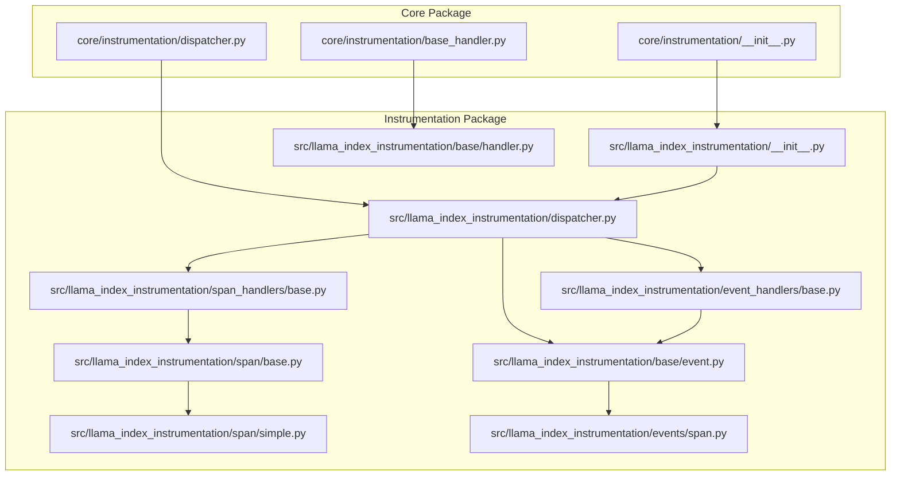
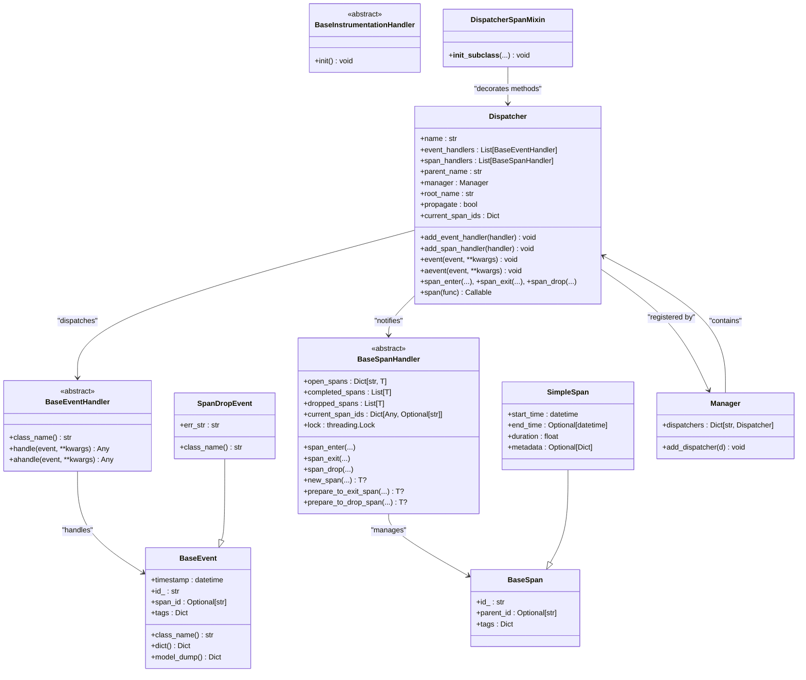
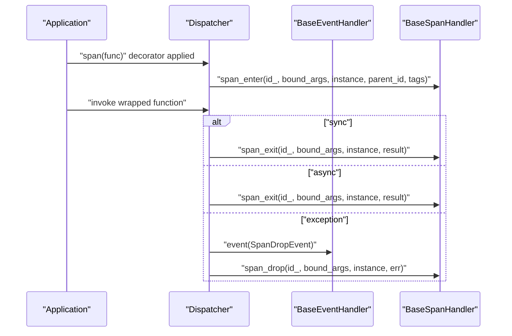
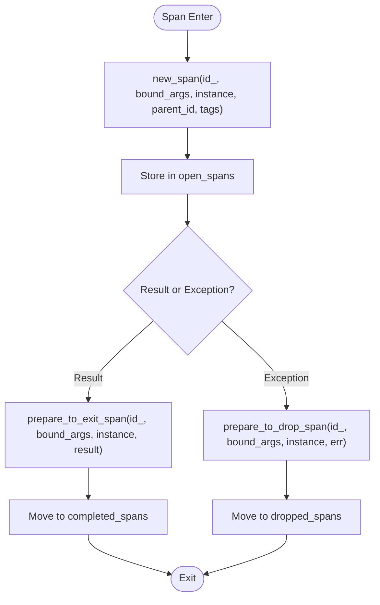
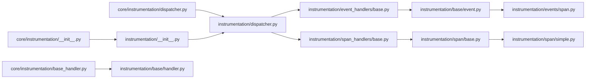

# Custom Instrumentation Development

<cite>
**Referenced Files in This Document**
- [__init__.py](file://llama-index-instrumentation/src/llama_index_instrumentation/__init__.py)
- [dispatcher.py](file://llama-index-instrumentation/src/llama_index_instrumentation/dispatcher.py)
- [base/handler.py](file://llama-index-instrumentation/src/llama_index_instrumentation/base/handler.py)
- [base/event.py](file://llama-index-instrumentation/src/llama_index_instrumentation/base/event.py)
- [event_handlers/base.py](file://llama-index-instrumentation/src/llama_index_instrumentation/event_handlers/base.py)
- [span_handlers/base.py](file://llama-index-instrumentation/src/llama_index_instrumentation/span_handlers/base.py)
- [span/base.py](file://llama-index-instrumentation/src/llama_index_instrumentation/span/base.py)
- [span/simple.py](file://llama-index-instrumentation/src/llama_index_instrumentation/span/simple.py)
- [events/span.py](file://llama-index-instrumentation/src/llama_index_instrumentation/events/span.py)
- [instrumentation.md](file://docs/src/content/docs/framework/module_guides/observability/instrumentation.md)
- [basic_usage.ipynb](file://docs/examples/instrumentation/basic_usage.ipynb)
- [instrumentation_observability_rundown.ipynb](file://docs/examples/instrumentation/instrumentation_observability_rundown.ipynb)
- [observe_api_calls.ipynb](file://docs/examples/instrumentation/observe_api_calls.ipynb)
- [event_types.md](file://docs/api_reference/api_reference/instrumentation/event_types.md)
- [span_types.md](file://docs/api_reference/api_reference/instrumentation/span_types.md)
- [span_handlers.md](file://docs/api_reference/api_reference/instrumentation/span_handlers.md)
- [event_handlers.md](file://docs/api_reference/api_reference/instrumentation/event_handlers.md)
- [__init__.py](file://llama-index-core/llama_index/core/instrumentation/__init__.py)
- [dispatcher.py](file://llama-index-core/llama_index/core/instrumentation/dispatcher.py)
- [base_handler.py](file://llama-index-core/llama_index/core/instrumentation/base_handler.py)
</cite>

## Table of Contents
1. [Introduction](#introduction)
2. [Project Structure](#project-structure)
3. [Core Components](#core-components)
4. [Architecture Overview](#architecture-overview)
5. [Detailed Component Analysis](#detailed-component-analysis)
6. [Dependency Analysis](#dependency-analysis)
7. [Performance Considerations](#performance-considerations)
8. [Troubleshooting Guide](#troubleshooting-guide)
9. [Conclusion](#conclusion)
10. [Appendices](#appendices)

## Introduction
This document provides comprehensive API documentation for developing custom instrumentation and callback handlers in the LlamaIndex instrumentation framework. It covers the Handler base classes, event and span processing patterns, extension mechanisms, and integration points. You will learn how to build custom span handlers, implement event processors, define event schemas, register handlers, manage concurrency, and integrate with external observability systems. Practical examples and best practices are included to guide you through creating instrumentation providers and extending the framework.

## Project Structure
The instrumentation system is split into two primary packages:
- Core instrumentation APIs exposed via the core package for integration into applications and libraries.
- The instrumentation package that implements the dispatcher, handlers, spans, and events.

Key areas:
- Dispatcher and Manager orchestrate event and span dispatching across a hierarchical tree of dispatchers.
- Event handlers process BaseEvent-derived events.
- Span handlers manage lifecycle of spans (enter, exit, drop) and maintain thread-safe state.
- Base classes define the contract for custom implementations.

**Diagram sources**
- [__init__.py](file://llama-index-instrumentation/src/llama_index_instrumentation/__init__.py#L1-L84)
- [dispatcher.py](file://llama-index-instrumentation/src/llama_index_instrumentation/dispatcher.py#L1-L426)
- [base/event.py](file://llama-index-instrumentation/src/llama_index_instrumentation/base/event.py#L1-L33)
- [base/handler.py](file://llama-index-instrumentation/src/llama_index_instrumentation/base/handler.py#L1-L9)
- [event_handlers/base.py](file://llama-index-instrumentation/src/llama_index_instrumentation/event_handlers/base.py#L1-L25)
- [span_handlers/base.py](file://llama-index-instrumentation/src/llama_index_instrumentation/span_handlers/base.py#L1-L197)
- [span/base.py](file://llama-index-instrumentation/src/llama_index_instrumentation/span/base.py#L1-L14)
- [span/simple.py](file://llama-index-instrumentation/src/llama_index_instrumentation/span/simple.py#L1-L16)
- [events/span.py](file://llama-index-instrumentation/src/llama_index_instrumentation/events/span.py#L1-L19)
- [__init__.py](file://llama-index-core/llama_index/core/instrumentation/__init__.py#L1-L14)
- [dispatcher.py](file://llama-index-core/llama_index/core/instrumentation/dispatcher.py#L1-L9)
- [base_handler.py](file://llama-index-core/llama_index/core/instrumentation/base_handler.py#L1-L2)

**Section sources**
- [__init__.py](file://llama-index-instrumentation/src/llama_index_instrumentation/__init__.py#L1-L84)
- [dispatcher.py](file://llama-index-instrumentation/src/llama_index_instrumentation/dispatcher.py#L1-L426)
- [__init__.py](file://llama-index-core/llama_index/core/instrumentation/__init__.py#L1-L14)
- [dispatcher.py](file://llama-index-core/llama_index/core/instrumentation/dispatcher.py#L1-L9)

## Core Components
This section documents the foundational APIs for building custom instrumentation.

- BaseInstrumentationHandler: Abstract base for instrumentation handlers. Implementations must provide an initialization hook.
- BaseEvent: Base Pydantic model for all instrumentation events. Includes timestamp, id, optional span_id, and tags.
- BaseEventHandler: Handles BaseEvent instances synchronously and asynchronously.
- BaseSpanHandler: Manages span lifecycle with thread-safe state for open, completed, and dropped spans. Requires implementations to define creation and exit/drop preparation logic.
- BaseSpan: Minimal span model with id, parent_id, and tags.
- SimpleSpan: Extends BaseSpan with timing and metadata fields.
- SpanDropEvent: Specialized event emitted when a span is dropped due to an exception.
- Dispatcher: Central orchestrator for dispatching events and span lifecycle signals. Supports synchronous and asynchronous event delivery, propagation to parent dispatchers, and span decorators.
- Manager: Registry of dispatchers forming a tree under a root dispatcher.
- DispatcherSpanMixin: Mixin that automatically decorates abstract and previously decorated methods with the dispatcher’s span decorator.

Key APIs and responsibilities:
- Dispatcher.event and Dispatcher.aevent: Dispatch events to all attached BaseEventHandler instances, optionally propagating to parent dispatchers.
- Dispatcher.span_enter, Dispatcher.span_exit, Dispatcher.span_drop: Notify BaseSpanHandler instances of span lifecycle transitions.
- Dispatcher.span: Decorator that wraps functions to emit span_enter, span_exit, and span_drop signals and manage active span context.
- Manager.add_dispatcher: Registers new dispatchers under the root.
- instrument_tags context manager: Attaches tags to events dispatched from the current context.

**Section sources**
- [base/handler.py](file://llama-index-instrumentation/src/llama_index_instrumentation/base/handler.py#L1-L9)
- [base/event.py](file://llama-index-instrumentation/src/llama_index_instrumentation/base/event.py#L1-L33)
- [event_handlers/base.py](file://llama-index-instrumentation/src/llama_index_instrumentation/event_handlers/base.py#L1-L25)
- [span_handlers/base.py](file://llama-index-instrumentation/src/llama_index_instrumentation/span_handlers/base.py#L1-L197)
- [span/base.py](file://llama-index-instrumentation/src/llama_index_instrumentation/span/base.py#L1-L14)
- [span/simple.py](file://llama-index-instrumentation/src/llama_index_instrumentation/span/simple.py#L1-L16)
- [events/span.py](file://llama-index-instrumentation/src/llama_index_instrumentation/events/span.py#L1-L19)
- [dispatcher.py](file://llama-index-instrumentation/src/llama_index_instrumentation/dispatcher.py#L1-L426)
- [__init__.py](file://llama-index-instrumentation/src/llama_index_instrumentation/__init__.py#L1-L84)

## Architecture Overview
The instrumentation architecture centers around a hierarchical dispatcher tree. Applications attach event and span handlers to a dispatcher. Handlers receive notifications for events and span lifecycle transitions. The system supports both synchronous and asynchronous processing and maintains span context across threads and async tasks.

**Diagram sources**
- [base/handler.py](file://llama-index-instrumentation/src/llama_index_instrumentation/base/handler.py#L1-L9)
- [base/event.py](file://llama-index-instrumentation/src/llama_index_instrumentation/base/event.py#L1-L33)
- [event_handlers/base.py](file://llama-index-instrumentation/src/llama_index_instrumentation/event_handlers/base.py#L1-L25)
- [span_handlers/base.py](file://llama-index-instrumentation/src/llama_index_instrumentation/span_handlers/base.py#L1-L197)
- [span/base.py](file://llama-index-instrumentation/src/llama_index_instrumentation/span/base.py#L1-L14)
- [span/simple.py](file://llama-index-instrumentation/src/llama_index_instrumentation/span/simple.py#L1-L16)
- [events/span.py](file://llama-index-instrumentation/src/llama_index_instrumentation/events/span.py#L1-L19)
- [dispatcher.py](file://llama-index-instrumentation/src/llama_index_instrumentation/dispatcher.py#L1-L426)
- [__init__.py](file://llama-index-instrumentation/src/llama_index_instrumentation/__init__.py#L1-L84)

## Detailed Component Analysis

### Dispatcher and Manager
- Responsibilities:
  - Manage a tree of dispatchers with propagation control.
  - Dispatch events to all attached handlers and propagate to parents when enabled.
  - Emit span lifecycle signals to span handlers.
  - Provide a span decorator that wraps functions to emit enter/exit/drop signals and manage active span context.
  - Expose a module-level factory to create child dispatchers under the root.
- Concurrency:
  - Span hierarchies are maintained across async tasks and threads.
  - Span context uses context variables to preserve active span identity.
- Error handling:
  - Handler invocations are wrapped to prevent exceptions from breaking dispatch loops.
  - SpanDropEvent is emitted when a span exits due to an exception.

**Diagram sources**
- [dispatcher.py](file://llama-index-instrumentation/src/llama_index_instrumentation/dispatcher.py#L181-L403)
- [events/span.py](file://llama-index-instrumentation/src/llama_index_instrumentation/events/span.py#L1-L19)

**Section sources**
- [dispatcher.py](file://llama-index-instrumentation/src/llama_index_instrumentation/dispatcher.py#L1-L426)
- [__init__.py](file://llama-index-instrumentation/src/llama_index_instrumentation/__init__.py#L13-L41)

### BaseEventHandler
- Purpose: Receive and process BaseEvent instances.
- Methods:
  - handle(event, **kwargs): Synchronous processing.
  - ahandle(event, **kwargs): Asynchronous processing; default delegates to handle.
- Registration: Attach via Dispatcher.add_event_handler.

**Section sources**
- [event_handlers/base.py](file://llama-index-instrumentation/src/llama_index_instrumentation/event_handlers/base.py#L1-L25)
- [base/event.py](file://llama-index-instrumentation/src/llama_index_instrumentation/base/event.py#L1-L33)

### BaseSpanHandler
- Purpose: Manage span lifecycle and maintain thread-safe state.
- State:
  - open_spans: Tracks currently open spans.
  - completed_spans: Stores finished spans.
  - dropped_spans: Stores dropped spans.
  - current_span_ids: Tracks active span per thread.
- Lifecycle methods (override in subclasses):
  - new_span(...): Create a span instance of type T.
  - prepare_to_exit_span(...): Prepare span for completion.
  - prepare_to_drop_span(...): Prepare span for early termination.
- Thread safety: Uses a lock to protect shared state.

**Diagram sources**
- [span_handlers/base.py](file://llama-index-instrumentation/src/llama_index_instrumentation/span_handlers/base.py#L88-L196)

**Section sources**
- [span_handlers/base.py](file://llama-index-instrumentation/src/llama_index_instrumentation/span_handlers/base.py#L1-L197)
- [span/base.py](file://llama-index-instrumentation/src/llama_index_instrumentation/span/base.py#L1-L14)
- [span/simple.py](file://llama-index-instrumentation/src/llama_index_instrumentation/span/simple.py#L1-L16)

### BaseInstrumentationHandler
- Purpose: Abstract base for instrumentation handlers requiring initialization.
- Method:
  - init(): Implement to configure handler-specific resources.

**Section sources**
- [base/handler.py](file://llama-index-instrumentation/src/llama_index_instrumentation/base/handler.py#L1-L9)

### DispatcherSpanMixin
- Purpose: Automatically decorate methods with the dispatcher’s span decorator.
- Behavior:
  - Scans the MRO for abstract and previously decorated methods.
  - Applies dispatcher.span to matching methods during subclass construction.
  - Idempotent decoration prevents duplicates.

**Section sources**
- [__init__.py](file://llama-index-instrumentation/src/llama_index_instrumentation/__init__.py#L44-L84)

### Event and Span Models
- BaseEvent: Standardized event schema with timestamp, id, optional span_id, and tags. Provides serialization helpers.
- SpanDropEvent: Specialized event indicating a span was dropped due to an error.
- BaseSpan/SimpleSpan: Minimal and extended span models respectively.

**Section sources**
- [base/event.py](file://llama-index-instrumentation/src/llama_index_instrumentation/base/event.py#L1-L33)
- [events/span.py](file://llama-index-instrumentation/src/llama_index_instrumentation/events/span.py#L1-L19)
- [span/base.py](file://llama-index-instrumentation/src/llama_index_instrumentation/span/base.py#L1-L14)
- [span/simple.py](file://llama-index-instrumentation/src/llama_index_instrumentation/span/simple.py#L1-L16)

## Dependency Analysis
- Core package re-exports instrumentation APIs for seamless integration.
- The instrumentation package implements the runtime behavior and exposes module-level factories and mixins.
- Handlers depend on BaseEvent and BaseSpan abstractions; Dispatcher depends on both handler types and event/span models.

**Diagram sources**
- [__init__.py](file://llama-index-core/llama_index/core/instrumentation/__init__.py#L1-L14)
- [dispatcher.py](file://llama-index-core/llama_index/core/instrumentation/dispatcher.py#L1-L9)
- [base_handler.py](file://llama-index-core/llama_index/core/instrumentation/base_handler.py#L1-L2)
- [__init__.py](file://llama-index-instrumentation/src/llama_index_instrumentation/__init__.py#L1-L84)
- [dispatcher.py](file://llama-index-instrumentation/src/llama_index_instrumentation/dispatcher.py#L1-L426)
- [event_handlers/base.py](file://llama-index-instrumentation/src/llama_index_instrumentation/event_handlers/base.py#L1-L25)
- [span_handlers/base.py](file://llama-index-instrumentation/src/llama_index_instrumentation/span_handlers/base.py#L1-L197)
- [base/event.py](file://llama-index-instrumentation/src/llama_index_instrumentation/base/event.py#L1-L33)
- [span/base.py](file://llama-index-instrumentation/src/llama_index_instrumentation/span/base.py#L1-L14)
- [span/simple.py](file://llama-index-instrumentation/src/llama_index_instrumentation/span/simple.py#L1-L16)
- [events/span.py](file://llama-index-instrumentation/src/llama_index_instrumentation/events/span.py#L1-L19)

**Section sources**
- [__init__.py](file://llama-index-core/llama_index/core/instrumentation/__init__.py#L1-L14)
- [dispatcher.py](file://llama-index-core/llama_index/core/instrumentation/dispatcher.py#L1-L9)
- [__init__.py](file://llama-index-instrumentation/src/llama_index_instrumentation/__init__.py#L1-L84)
- [dispatcher.py](file://llama-index-instrumentation/src/llama_index_instrumentation/dispatcher.py#L1-L426)

## Performance Considerations
- Handler invocation is guarded against exceptions to avoid disrupting dispatch loops.
- Asynchronous event dispatch uses task gathering to minimize overhead.
- Span context copying ensures correctness across threads and async tasks.
- Use instrument_tags to attach lightweight metadata to events without modifying handler logic.
- Prefer minimal span payload sizes in custom span handlers to reduce memory footprint.
- Avoid heavy blocking work inside span_enter/exit/drop; delegate to background queues if necessary.

[No sources needed since this section provides general guidance]

## Troubleshooting Guide
Common issues and resolutions:
- Handlers not receiving events:
  - Verify the dispatcher is attached to the correct Manager and that propagate is configured as expected.
  - Ensure instrument_tags are set appropriately before dispatching events.
- Spans not completing:
  - Confirm that exceptions are not swallowed; SpanDropEvent indicates early termination.
  - Check that span_enter and span_exit are paired correctly.
- Concurrency anomalies:
  - Ensure thread-safe access to shared state in custom BaseSpanHandler implementations.
  - Use the provided lock property for synchronization.
- Decorator conflicts:
  - DispatcherSpanMixin applies the span decorator idempotently; avoid manual duplication.

**Section sources**
- [dispatcher.py](file://llama-index-instrumentation/src/llama_index_instrumentation/dispatcher.py#L126-L161)
- [dispatcher.py](file://llama-index-instrumentation/src/llama_index_instrumentation/dispatcher.py#L181-L262)
- [span_handlers/base.py](file://llama-index-instrumentation/src/llama_index_instrumentation/span_handlers/base.py#L82-L86)

## Conclusion
The instrumentation framework provides a robust, extensible foundation for building custom observability integrations. By leveraging BaseEventHandler and BaseSpanHandler, you can capture events and spans, integrate with external systems, and maintain accurate tracing across synchronous and asynchronous contexts. Use DispatcherSpanMixin to simplify method decoration, instrument_tags for contextual metadata, and follow the best practices outlined to ensure reliable and performant instrumentation.

[No sources needed since this section summarizes without analyzing specific files]

## Appendices

### API Specifications

- Dispatcher
  - Properties: name, event_handlers, span_handlers, parent_name, manager, root_name, propagate, current_span_ids
  - Methods:
    - add_event_handler(handler): Attach an event handler
    - add_span_handler(handler): Attach a span handler
    - event(event, **kwargs): Synchronously dispatch event
    - aevent(event, **kwargs): Asynchronously dispatch event
    - span_enter(...), span_exit(...), span_drop(...): Notify span handlers
    - span(func): Decorator for automatic span lifecycle
    - log_name: Logging-friendly name

- Manager
  - Properties: dispatchers
  - Methods: add_dispatcher(d)

- BaseEventHandler
  - Methods: handle(event, **kwargs), ahandle(event, **kwargs)

- BaseSpanHandler
  - State: open_spans, completed_spans, dropped_spans, current_span_ids, lock
  - Methods: span_enter(...), span_exit(...), span_drop(...), new_span(...), prepare_to_exit_span(...), prepare_to_drop_span(...)

- BaseEvent
  - Fields: timestamp, id_, span_id, tags
  - Methods: class_name(), dict(), model_dump()

- SpanDropEvent
  - Fields: err_str

- BaseSpan/SimpleSpan
  - BaseSpan: id_, parent_id, tags
  - SimpleSpan: start_time, end_time, duration, metadata

- DispatcherSpanMixin
  - Behavior: Automatic decoration of abstract and previously decorated methods

**Section sources**
- [dispatcher.py](file://llama-index-instrumentation/src/llama_index_instrumentation/dispatcher.py#L48-L426)
- [event_handlers/base.py](file://llama-index-instrumentation/src/llama_index_instrumentation/event_handlers/base.py#L9-L25)
- [span_handlers/base.py](file://llama-index-instrumentation/src/llama_index_instrumentation/span_handlers/base.py#L46-L197)
- [base/event.py](file://llama-index-instrumentation/src/llama_index_instrumentation/base/event.py#L10-L33)
- [events/span.py](file://llama-index-instrumentation/src/llama_index_instrumentation/events/span.py#L4-L19)
- [span/base.py](file://llama-index-instrumentation/src/llama_index_instrumentation/span/base.py#L7-L14)
- [span/simple.py](file://llama-index-instrumentation/src/llama_index_instrumentation/span/simple.py#L9-L16)
- [__init__.py](file://llama-index-instrumentation/src/llama_index_instrumentation/__init__.py#L44-L84)

### Examples and References
- Conceptual overview and usage guidance:
  - [instrumentation.md](file://docs/src/content/docs/framework/module_guides/observability/instrumentation.md)
- Basic usage notebooks:
  - [basic_usage.ipynb](file://docs/examples/instrumentation/basic_usage.ipynb)
  - [instrumentation_observability_rundown.ipynb](file://docs/examples/instrumentation/instrumentation_observability_rundown.ipynb)
  - [observe_api_calls.ipynb](file://docs/examples/instrumentation/observe_api_calls.ipynb)
- API reference pages:
  - [event_types.md](file://docs/api_reference/api_reference/instrumentation/event_types.md)
  - [span_types.md](file://docs/api_reference/api_reference/instrumentation/span_types.md)
  - [span_handlers.md](file://docs/api_reference/api_reference/instrumentation/span_handlers.md)
  - [event_handlers.md](file://docs/api_reference/api_reference/instrumentation/event_handlers.md)

**Section sources**
- [instrumentation.md](file://docs/src/content/docs/framework/module_guides/observability/instrumentation.md)
- [basic_usage.ipynb](file://docs/examples/instrumentation/basic_usage.ipynb)
- [instrumentation_observability_rundown.ipynb](file://docs/examples/instrumentation/instrumentation_observability_rundown.ipynb)
- [observe_api_calls.ipynb](file://docs/examples/instrumentation/observe_api_calls.ipynb)
- [event_types.md](file://docs/api_reference/api_reference/instrumentation/event_types.md)
- [span_types.md](file://docs/api_reference/api_reference/instrumentation/span_types.md)
- [span_handlers.md](file://docs/api_reference/api_reference/instrumentation/span_handlers.md)
- [event_handlers.md](file://docs/api_reference/api_reference/instrumentation/event_handlers.md)