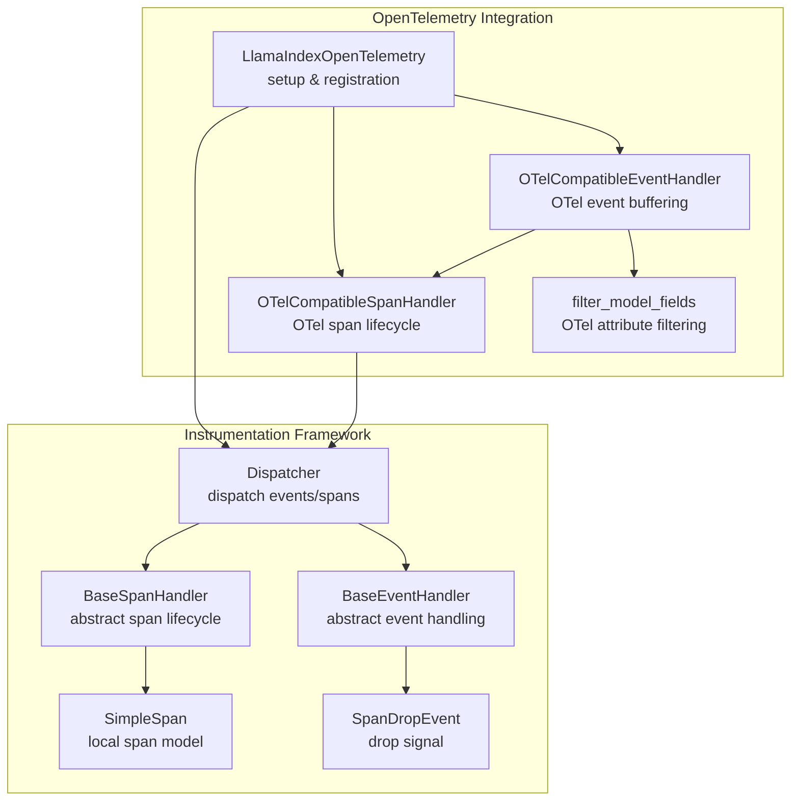
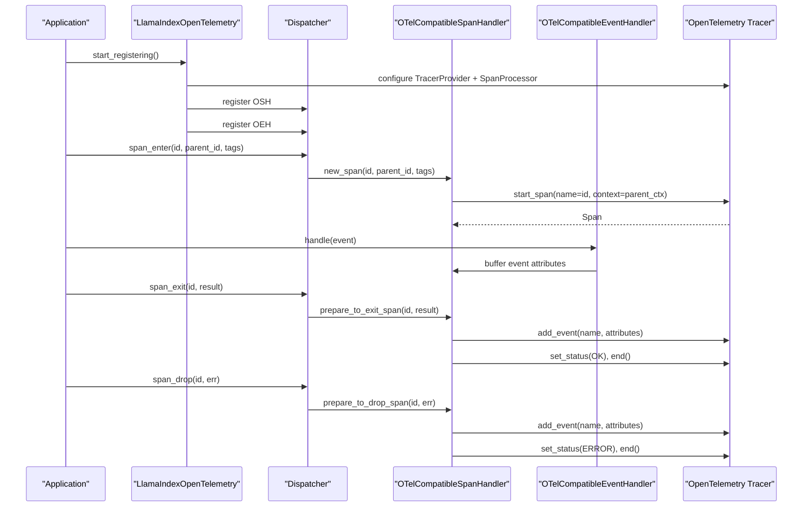
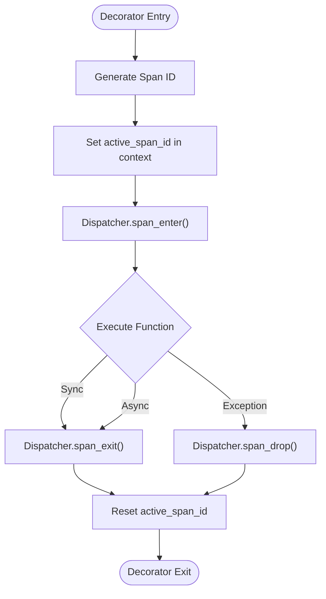
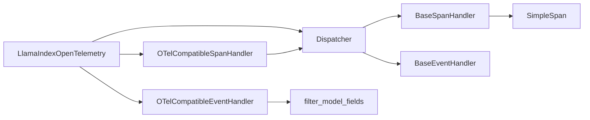

# Distributed Tracing

<cite>
**Referenced Files in This Document**
- [base.py](file://llama-index-integrations/observability/llama-index-observability-otel/llama_index/observability/otel/base.py)
- [utils.py](file://llama-index-integrations/observability/llama-index-observability-otel/llama_index/observability/otel/utils.py)
- [__init__.py](file://llama-index-integrations/observability/llama-index-observability-otel/llama_index/observability/otel/__init__.py)
- [dispatcher.py](file://llama-index-instrumentation/src/llama_index_instrumentation/dispatcher.py)
- [base.py](file://llama-index-instrumentation/src/llama_index_instrumentation/span_handlers/base.py)
- [simple.py](file://llama-index-instrumentation/src/llama_index_instrumentation/span/simple.py)
- [span.py](file://llama-index-instrumentation/src/llama_index_instrumentation/events/span.py)
- [__init__.py](file://llama-index-core/llama_index/core/instrumentation/__init__.py)
- [test_initialization.py](file://llama-index-integrations/observability/llama-index-observability-otel/tests/test_initialization.py)
</cite>

## Table of Contents
1. [Introduction](#introduction)
2. [Project Structure](#project-structure)
3. [Core Components](#core-components)
4. [Architecture Overview](#architecture-overview)
5. [Detailed Component Analysis](#detailed-component-analysis)
6. [Dependency Analysis](#dependency-analysis)
7. [Performance Considerations](#performance-considerations)
8. [Troubleshooting Guide](#troubleshooting-guide)
9. [Conclusion](#conclusion)
10. [Appendices](#appendices)

## Introduction
This document describes the distributed tracing integration using OpenTelemetry within the LlamaIndex ecosystem. It documents the Span interface, event dispatching system, and trace correlation mechanisms. It provides complete API specifications for trace creation, span management, attribute tagging, and context propagation. It also includes configuration examples for OpenTelemetry exporters, span processors, and performance monitoring, along with best practices for production tracing, performance optimization, and troubleshooting.

## Project Structure
The tracing integration spans two primary areas:
- Instrumentation framework: a generic event/span dispatching system with handlers and spans.
- OpenTelemetry integration: an adapter that bridges the instrumentation framework to OpenTelemetry’s tracer, span processor, and exporter.

**Diagram sources**
- [dispatcher.py](file://llama-index-instrumentation/src/llama_index_instrumentation/dispatcher.py#L48-L426)
- [base.py](file://llama-index-instrumentation/src/llama_index_instrumentation/span_handlers/base.py#L46-L197)
- [simple.py](file://llama-index-instrumentation/src/llama_index_instrumentation/span/simple.py#L9-L16)
- [span.py](file://llama-index-instrumentation/src/llama_index_instrumentation/events/span.py#L4-L19)
- [base.py](file://llama-index-integrations/observability/llama-index-observability-otel/llama_index/observability/otel/base.py#L44-L269)
- [utils.py](file://llama-index-integrations/observability/llama-index-observability-otel/llama_index/observability/otel/utils.py#L19-L26)

**Section sources**
- [dispatcher.py](file://llama-index-instrumentation/src/llama_index_instrumentation/dispatcher.py#L48-L426)
- [base.py](file://llama-index-integrations/observability/llama-index-observability-otel/llama_index/observability/otel/base.py#L209-L269)

## Core Components
- LlamaIndexOpenTelemetry: configuration and bootstrap class for OpenTelemetry integration. It sets up the TracerProvider, selects a span processor (simple or batch), and registers OTel-compatible span and event handlers with the global dispatcher.
- OTelCompatibleSpanHandler: translates instrumentation spans into OpenTelemetry spans, manages lifecycle, attaches buffered events, and sets status.
- OTelCompatibleEventHandler: captures instrumentation events, filters serializable attributes, and buffers them per-span for later attachment to OpenTelemetry spans.
- Dispatcher: central event and span dispatching engine. It manages span-enter/exit/drop notifications, async/sync support, and context propagation.
- BaseSpanHandler and SimpleSpan: base span abstraction and a simple local span model used by the OTel handler to track spans.
- filter_model_fields: utility to ensure only OpenTelemetry-supported attribute types are exported.

Key APIs and behaviors:
- Trace creation: LlamaIndexOpenTelemetry.start_registering initializes OTel and registers handlers.
- Span management: Dispatcher.span decorator creates spans, emits enter/exit/drop signals, and correlates child spans via parent IDs.
- Attribute tagging: Events are tagged with active tags from context; span tags are propagated from span_enter.
- Context propagation: active_span_id context variable tracks the current span; OTel handler uses set_span_in_context to correlate spans.

**Section sources**
- [base.py](file://llama-index-integrations/observability/llama-index-observability-otel/llama_index/observability/otel/base.py#L209-L269)
- [dispatcher.py](file://llama-index-instrumentation/src/llama_index_instrumentation/dispatcher.py#L181-L262)
- [base.py](file://llama-index-instrumentation/src/llama_index_instrumentation/span_handlers/base.py#L88-L197)
- [simple.py](file://llama-index-instrumentation/src/llama_index_instrumentation/span/simple.py#L9-L16)
- [utils.py](file://llama-index-integrations/observability/llama-index-observability-otel/llama_index/observability/otel/utils.py#L19-L26)

## Architecture Overview
The integration wires LlamaIndex instrumentation to OpenTelemetry by:
- Creating a TracerProvider with a chosen SpanExporter and SpanProcessor.
- Registering an OTel-compatible SpanHandler that starts/ends OpenTelemetry spans and attaches buffered events.
- Registering an OTel-compatible EventHandler that buffers event attributes per-span for later attachment.

**Diagram sources**
- [base.py](file://llama-index-integrations/observability/llama-index-observability-otel/llama_index/observability/otel/base.py#L242-L269)
- [dispatcher.py](file://llama-index-instrumentation/src/llama_index_instrumentation/dispatcher.py#L181-L262)
- [base.py](file://llama-index-integrations/observability/llama-index-observability-otel/llama_index/observability/otel/base.py#L83-L160)

## Detailed Component Analysis

### LlamaIndexOpenTelemetry API
- Purpose: Configure and initialize OpenTelemetry integration for LlamaIndex.
- Key attributes:
  - span_exporter: OpenTelemetry SpanExporter (default: ConsoleSpanExporter).
  - span_processor: "simple" or "batch".
  - service_name_or_resource: String or Resource for service metadata.
  - debug: Enable console logs for span lifecycle and event registration.
- Methods:
  - start_registering(): Creates TracerProvider, adds span processor, sets tracer, and registers OTel-compatible handlers with the global dispatcher.

Configuration examples:
- Default initialization with batch processor and console exporter.
- Custom service name, simple processor, and debug enabled.

**Section sources**
- [base.py](file://llama-index-integrations/observability/llama-index-observability-otel/llama_index/observability/otel/base.py#L209-L269)
- [__init__.py](file://llama-index-integrations/observability/llama-index-observability-otel/llama_index/observability/otel/__init__.py#L1-L6)
- [test_initialization.py](file://llama-index-integrations/observability/llama-index-observability-otel/tests/test_initialization.py#L9-L31)

### OTelCompatibleSpanHandler API
- Purpose: Bridge instrumentation spans to OpenTelemetry spans.
- Responsibilities:
  - Create OTel spans on span_enter.
  - Buffer events per-span until span_exit/span_drop.
  - Attach buffered events to the OTel span before ending.
  - Set status OK on normal exit, ERROR on drop.
- Key behaviors:
  - Uses set_span_in_context(parent) to correlate child spans.
  - Maintains a registry of all_spans keyed by span ID.
  - Supports debug logging for lifecycle events.

**Section sources**
- [base.py](file://llama-index-integrations/observability/llama-index-observability-otel/llama_index/observability/otel/base.py#L44-L160)
- [base.py](file://llama-index-instrumentation/src/llama_index_instrumentation/span_handlers/base.py#L88-L197)

### OTelCompatibleEventHandler API
- Purpose: Capture instrumentation events and buffer attributes for later attachment to the current span.
- Responsibilities:
  - Read active_span_id from context to determine target span.
  - Serialize event data safely (fallback to string if serialization fails).
  - Filter attributes to supported OTel types using filter_model_fields.
  - Append filtered attributes to the span’s event bucket.

**Section sources**
- [base.py](file://llama-index-integrations/observability/llama-index-observability-otel/llama_index/observability/otel/base.py#L162-L207)
- [utils.py](file://llama-index-integrations/observability/llama-index-observability-otel/llama_index/observability/otel/utils.py#L19-L26)

### Dispatcher and Span Lifecycle
- Dispatcher.span decorator:
  - Generates unique span IDs.
  - Sets active_span_id in context for correlation.
  - Emits span_enter, span_exit, or span_drop based on execution outcome.
  - Handles both sync and async functions, preserving context across tasks.
- Span lifecycle:
  - span_enter: notify span handlers to create/open spans.
  - span_exit: notify handlers to finalize spans and mark completion.
  - span_drop: notify handlers to finalize spans with error status.

**Diagram sources**
- [dispatcher.py](file://llama-index-instrumentation/src/llama_index_instrumentation/dispatcher.py#L264-L403)

**Section sources**
- [dispatcher.py](file://llama-index-instrumentation/src/llama_index_instrumentation/dispatcher.py#L181-L262)
- [dispatcher.py](file://llama-index-instrumentation/src/llama_index_instrumentation/dispatcher.py#L264-L403)

### Span and Event Models
- SimpleSpan: Local span representation with start/end timestamps, duration, and optional metadata.
- SpanDropEvent: Event signaling an early span termination with an error string.

**Section sources**
- [simple.py](file://llama-index-instrumentation/src/llama_index_instrumentation/span/simple.py#L9-L16)
- [span.py](file://llama-index-instrumentation/src/llama_index_instrumentation/events/span.py#L4-L19)

### Attribute Filtering Utility
- filter_model_fields ensures only OTel-supported scalar and homogeneous-sequence attribute types are exported.
- Non-supported types are excluded to prevent export errors.

**Section sources**
- [utils.py](file://llama-index-integrations/observability/llama-index-observability-otel/llama_index/observability/otel/utils.py#L19-L26)

## Dependency Analysis
- LlamaIndexOpenTelemetry depends on:
  - opentelemetry-sdk (TracerProvider, SpanExporter, SpanProcessor).
  - core instrumentation dispatcher and handlers.
  - OTel-compatible span/event handlers.
- OTel-compatible handlers depend on:
  - Dispatcher for span lifecycle notifications.
  - OTel tracer for span creation and event/status management.
  - filter_model_fields for attribute sanitization.

**Diagram sources**
- [base.py](file://llama-index-integrations/observability/llama-index-observability-otel/llama_index/observability/otel/base.py#L209-L269)
- [dispatcher.py](file://llama-index-instrumentation/src/llama_index_instrumentation/dispatcher.py#L48-L120)
- [base.py](file://llama-index-instrumentation/src/llama_index_instrumentation/span_handlers/base.py#L46-L86)
- [simple.py](file://llama-index-instrumentation/src/llama_index_instrumentation/span/simple.py#L9-L16)
- [utils.py](file://llama-index-integrations/observability/llama-index-observability-otel/llama_index/observability/otel/utils.py#L19-L26)

**Section sources**
- [base.py](file://llama-index-integrations/observability/llama-index-observability-otel/llama_index/observability/otel/base.py#L209-L269)
- [dispatcher.py](file://llama-index-instrumentation/src/llama_index_instrumentation/dispatcher.py#L48-L120)

## Performance Considerations
- Processor selection:
  - Use "batch" processor for production to reduce overhead and improve throughput.
  - Use "simple" processor for development/testing to observe immediate exports.
- Exporter choice:
  - Prefer production-grade exporters (e.g., OTLP) over ConsoleSpanExporter.
- Attribute volume:
  - Keep event payloads minimal; filter non-essential fields to reduce payload size.
- Debug mode:
  - Disable debug in production to avoid console overhead.
- Concurrency:
  - Dispatcher is designed to be async-task and thread-safe; ensure handlers remain lightweight to avoid contention.

[No sources needed since this section provides general guidance]

## Troubleshooting Guide
Common issues and resolutions:
- No traces appear:
  - Verify LlamaIndexOpenTelemetry.start_registering() is called before any traced operations.
  - Confirm the selected exporter is configured and reachable.
- Events missing on spans:
  - Ensure events are emitted within a span context; OTelCompatibleEventHandler ignores events outside spans.
  - Check that event serialization succeeds; non-serializable events fall back to a string representation.
- Incorrect parent-child relationships:
  - Ensure the span decorator is applied to traced functions and that active_span_id is preserved across async boundaries.
- High CPU usage:
  - Switch to batch processor and reduce attribute cardinality.
  - Disable debug mode.

**Section sources**
- [base.py](file://llama-index-integrations/observability/llama-index-observability-otel/llama_index/observability/otel/base.py#L162-L207)
- [dispatcher.py](file://llama-index-instrumentation/src/llama_index_instrumentation/dispatcher.py#L364-L398)

## Conclusion
The LlamaIndex OpenTelemetry integration provides a robust, extensible mechanism to capture distributed traces and correlated events. By wiring the instrumentation framework to OpenTelemetry via OTel-compatible handlers, applications gain standardized tracing with minimal code changes. Proper configuration of exporters, processors, and attribute filtering enables scalable production monitoring.

[No sources needed since this section summarizes without analyzing specific files]

## Appendices

### API Specification: LlamaIndexOpenTelemetry
- Attributes
  - span_exporter: SpanExporter | None (default: ConsoleSpanExporter)
  - span_processor: "simple" | "batch" (default: "batch")
  - service_name_or_resource: str | Resource (default: Resource with service name "llamaindex.opentelemetry")
  - debug: bool (default: False)
- Methods
  - start_registering(): Initializes TracerProvider, registers handlers, and prepares dispatcher

**Section sources**
- [base.py](file://llama-index-integrations/observability/llama-index-observability-otel/llama_index/observability/otel/base.py#L209-L269)

### API Specification: OTelCompatibleSpanHandler
- Constructor
  - tracer: trace.Tracer
  - debug: bool
  - open_spans, completed_spans, dropped_spans, current_span_ids: optional initial state
- Methods
  - new_span(id_, bound_args, instance, parent_span_id, tags, **kwargs) -> SimpleSpan
  - prepare_to_exit_span(id_, bound_args, instance, result, **kwargs) -> SimpleSpan
  - prepare_to_drop_span(id_, bound_args, instance, err, **kwargs) -> Optional[SimpleSpan]

**Section sources**
- [base.py](file://llama-index-integrations/observability/llama-index-observability-otel/llama_index/observability/otel/base.py#L44-L160)

### API Specification: OTelCompatibleEventHandler
- Constructor
  - span_handler: OTelCompatibleSpanHandler
  - debug: bool
- Methods
  - handle(event, **kwargs): Buffers event attributes for the current span

**Section sources**
- [base.py](file://llama-index-integrations/observability/llama-index-observability-otel/llama_index/observability/otel/base.py#L162-L207)

### API Specification: Dispatcher
- Decorators
  - span(func): Wraps functions to emit span_enter/span_exit/span_drop
- Methods
  - span_enter(id_, bound_args, instance, parent_id, tags, **kwargs)
  - span_exit(id_, bound_args, instance, result, **kwargs)
  - span_drop(id_, bound_args, instance, err, **kwargs)
  - event(event, **kwargs)
  - aevent(event, **kwargs)

**Section sources**
- [dispatcher.py](file://llama-index-instrumentation/src/llama_index_instrumentation/dispatcher.py#L181-L262)
- [dispatcher.py](file://llama-index-instrumentation/src/llama_index_instrumentation/dispatcher.py#L264-L403)

### Best Practices
- Always call start_registering() during application startup.
- Use batch processor and production exporters in production.
- Keep event payloads small and attribute names consistent.
- Avoid heavy work inside event handlers to minimize trace latency.
- Use context propagation carefully in async environments.

[No sources needed since this section provides general guidance]