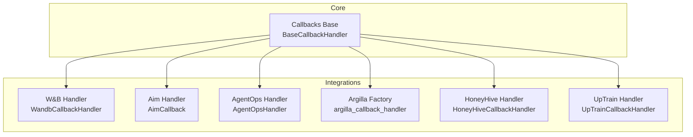
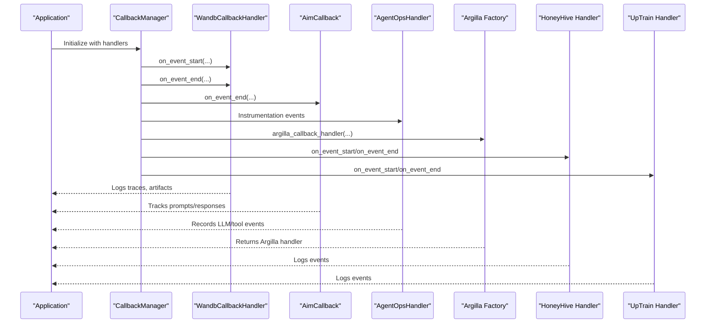
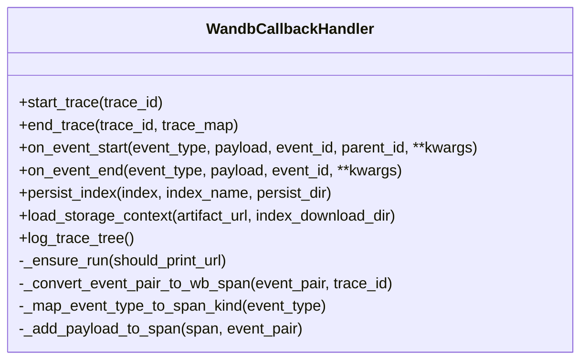
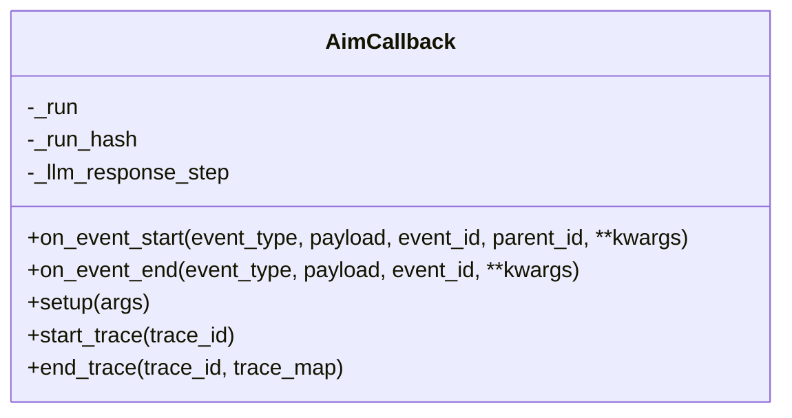
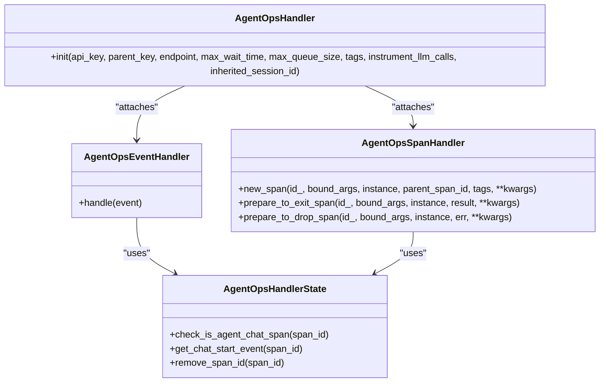
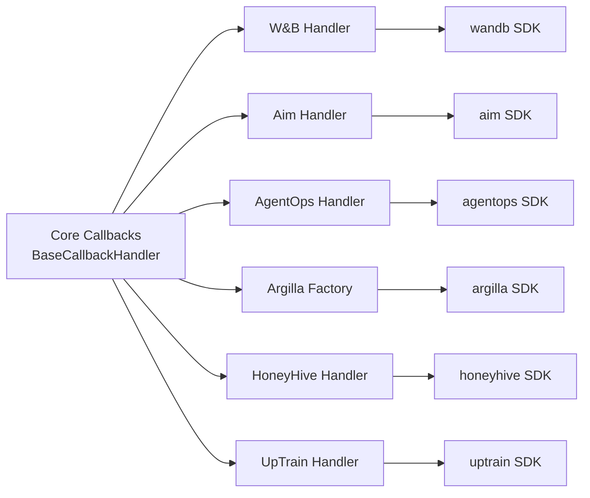

# Experiment Tracking

<cite>
**Referenced Files in This Document**
- [__init__.py](file://llama-index-core/llama_index/core/callbacks/__init__.py)
- [base.py](file://llama-index-integrations/callbacks/llama-index-callbacks-wandb/llama_index/callbacks/wandb/base.py)
- [__init__.py](file://llama-index-integrations/callbacks/llama-index-callbacks-wandb/llama_index/callbacks/wandb/__init__.py)
- [base.py](file://llama-index-integrations/callbacks/llama-index-callbacks-aim/llama_index/callbacks/aim/base.py)
- [__init__.py](file://llama-index-integrations/callbacks/llama-index-callbacks-aim/llama_index/callbacks/aim/__init__.py)
- [base.py](file://llama-index-integrations/callbacks/llama-index-callbacks-agentops/llama_index/callbacks/agentops/base.py)
- [__init__.py](file://llama-index-integrations/callbacks/llama-index-callbacks-agentops/llama_index/callbacks/agentops/__init__.py)
- [base.py](file://llama-index-integrations/callbacks/llama-index-callbacks-argilla/llama_index/callbacks/argilla/base.py)
- [__init__.py](file://llama-index-integrations/callbacks/llama-index-callbacks-argilla/llama_index/callbacks/argilla/__init__.py)
- [base.py](file://llama-index-integrations/callbacks/llama-index-callbacks-honeyhive/llama_index/callbacks/honeyhive/base.py)
- [__init__.py](file://llama-index-integrations/callbacks/llama-index-callbacks-honeyhive/llama_index/callbacks/honeyhive/__init__.py)
- [base.py](file://llama-index-integrations/callbacks/llama-index-callbacks-uptrain/llama_index/callbacks/uptrain/base.py)
- [__init__.py](file://llama-index-integrations/callbacks/llama-index-callbacks-uptrain/llama_index/callbacks/uptrain/__init__.py)
</cite>

## Table of Contents
1. [Introduction](#introduction)
2. [Project Structure](#project-structure)
3. [Core Components](#core-components)
4. [Architecture Overview](#architecture-overview)
5. [Detailed Component Analysis](#detailed-component-analysis)
6. [Dependency Analysis](#dependency-analysis)
7. [Performance Considerations](#performance-considerations)
8. [Troubleshooting Guide](#troubleshooting-guide)
9. [Conclusion](#conclusion)
10. [Appendices](#appendices)

## Introduction
This document provides comprehensive API documentation for experiment tracking integrations within the LlamaIndex ecosystem. It focuses on callback handlers for external experiment tracking platforms: Weights & Biases (W&B), Aim, AgentOps, Argilla, HoneyHive, and UpTrain. The documentation covers:
- Experiment initialization and lifecycle
- Metric logging and token counting
- Artifact management and persistence
- Collaborative features and session handling
- Configuration examples and integration patterns
- Best practices for reproducibility and visualization

Where applicable, the document maps APIs to concrete source files and highlights differences in capabilities across platforms.

## Project Structure
The experiment tracking integrations are implemented as callback handlers under the integrations package. Each platform exposes a handler class that extends the LlamaIndex callback base and integrates with the platform’s SDK.

**Diagram sources**
- [__init__.py](file://llama-index-core/llama_index/core/callbacks/__init__.py#L1-L18)
- [base.py](file://llama-index-integrations/callbacks/llama-index-callbacks-wandb/llama_index/callbacks/wandb/base.py#L87-L177)
- [base.py](file://llama-index-integrations/callbacks/llama-index-callbacks-aim/llama_index/callbacks/aim/base.py#L13-L76)
- [base.py](file://llama-index-integrations/callbacks/llama-index-callbacks-agentops/llama_index/callbacks/agentops/base.py#L226-L266)
- [base.py](file://llama-index-integrations/callbacks/llama-index-callbacks-argilla/llama_index/callbacks/argilla/base.py#L6-L12)
- [base.py](file://llama-index-integrations/callbacks/llama-index-callbacks-honeyhive/llama_index/callbacks/honeyhive/base.py)
- [base.py](file://llama-index-integrations/callbacks/llama-index-callbacks-uptrain/llama_index/callbacks/uptrain/base.py)

**Section sources**
- [__init__.py](file://llama-index-core/llama_index/core/callbacks/__init__.py#L1-L18)

## Core Components
- Callback base: The core callback system defines the handler contract and event types used by all integrations.
- Platform-specific handlers: Each integration implements a handler class tailored to the platform’s capabilities (logging, artifacts, sessions, etc.).

Key capabilities exposed by the integrations:
- Event-driven logging during LLM, retrieval, embedding, and synthesis operations
- Token usage tracking via token counters
- Artifact persistence and loading (W&B)
- Session and run initialization (AgentOps, Aim)
- Lazy factory for Argilla integration

**Section sources**
- [__init__.py](file://llama-index-core/llama_index/core/callbacks/__init__.py#L1-L18)

## Architecture Overview
The integration architecture follows a unified callback pattern. Handlers receive start/end events, extract payloads, and forward data to the target platform. Some handlers support advanced features such as trace trees, artifacts, and session management.

**Diagram sources**
- [base.py](file://llama-index-integrations/callbacks/llama-index-callbacks-wandb/llama_index/callbacks/wandb/base.py#L178-L242)
- [base.py](file://llama-index-integrations/callbacks/llama-index-callbacks-aim/llama_index/callbacks/aim/base.py#L95-L144)
- [base.py](file://llama-index-integrations/callbacks/llama-index-callbacks-agentops/llama_index/callbacks/agentops/base.py#L226-L266)
- [base.py](file://llama-index-integrations/callbacks/llama-index-callbacks-argilla/llama_index/callbacks/argilla/base.py#L6-L12)
- [base.py](file://llama-index-integrations/callbacks/llama-index-callbacks-honeyhive/llama_index/callbacks/honeyhive/base.py)
- [base.py](file://llama-index-integrations/callbacks/llama-index-callbacks-uptrain/llama_index/callbacks/uptrain/base.py)

## Detailed Component Analysis

### Weights & Biases (W&B)
- Purpose: Logs LlamaIndex trace events, payloads, and token usage; supports index persistence/loading as artifacts.
- Initialization: Creates or reuses a W&B run; sets silent mode by default.
- Logging:
  - Trace tree logging with span kinds mapped to LLM, AGENT, TOOL, CHAIN.
  - Payload handling for parsing, LLM, query, and embedding events.
  - Token counting via token counter utilities.
- Artifacts:
  - Persist index to W&B as artifacts with optional metadata.
  - Load storage context from artifacts for downstream index loading.

API surface (selected):
- Constructor: accepts run arguments, tokenizer, and event filtering.
- Lifecycle: start_trace, end_trace, on_event_start, on_event_end.
- Persistence: persist_index, load_storage_context.
- Utilities: log_trace_tree, internal payload handlers, time conversion.

**Diagram sources**
- [base.py](file://llama-index-integrations/callbacks/llama-index-callbacks-wandb/llama_index/callbacks/wandb/base.py#L87-L177)
- [base.py](file://llama-index-integrations/callbacks/llama-index-callbacks-wandb/llama_index/callbacks/wandb/base.py#L243-L383)
- [base.py](file://llama-index-integrations/callbacks/llama-index-callbacks-wandb/llama_index/callbacks/wandb/base.py#L331-L342)

Best practices:
- Configure run arguments (project, entity, tags, group) for reproducible runs.
- Use persist_index to archive indices alongside experiments.
- Leverage load_storage_context to reproduce experiments offline.

**Section sources**
- [__init__.py](file://llama-index-integrations/callbacks/llama-index-callbacks-wandb/llama_index/callbacks/wandb/__init__.py#L1-L4)
- [base.py](file://llama-index-integrations/callbacks/llama-index-callbacks-wandb/llama_index/callbacks/wandb/base.py#L87-L177)
- [base.py](file://llama-index-integrations/callbacks/llama-index-callbacks-wandb/llama_index/callbacks/wandb/base.py#L266-L342)
- [base.py](file://llama-index-integrations/callbacks/llama-index-callbacks-wandb/llama_index/callbacks/wandb/base.py#L457-L487)

### Aim
- Purpose: Tracks prompts and responses as text sequences; supports system metrics and terminal logs.
- Initialization: Creates a Run with optional experiment name and repository.
- Logging:
  - On LLM events, logs prompt and response as text sequences.
  - On CHUNKING events, logs individual chunks.
- Configuration: repo, experiment_name, system_tracking_interval, log_system_params, capture_terminal_logs.

API surface (selected):
- Constructor: repo, experiment_name, system_tracking_interval, log_system_params, capture_terminal_logs, event filtering, run_params.
- Lifecycle: on_event_start, on_event_end, start_trace, end_trace.
- Setup: setup(args) to set run parameters.

**Diagram sources**
- [base.py](file://llama-index-integrations/callbacks/llama-index-callbacks-aim/llama_index/callbacks/aim/base.py#L13-L76)
- [base.py](file://llama-index-integrations/callbacks/llama-index-callbacks-aim/llama_index/callbacks/aim/base.py#L77-L144)
- [base.py](file://llama-index-integrations/callbacks/llama-index-callbacks-aim/llama_index/callbacks/aim/base.py#L151-L182)

Best practices:
- Use experiment_name to group related runs.
- Enable system_tracking_interval for resource monitoring.
- Use run_params to log hyperparameters consistently.

**Section sources**
- [__init__.py](file://llama-index-integrations/callbacks/llama-index-callbacks-aim/llama_index/callbacks/aim/__init__.py#L1-L4)
- [base.py](file://llama-index-integrations/callbacks/llama-index-callbacks-aim/llama_index/callbacks/aim/base.py#L13-L76)
- [base.py](file://llama-index-integrations/callbacks/llama-index-callbacks-aim/llama_index/callbacks/aim/base.py#L112-L144)

### AgentOps
- Purpose: Records LLM and tool events with session management; integrates with LlamaIndex instrumentation.
- Initialization: Initializes AgentOps client and attaches event/span handlers to the global dispatcher.
- Features:
  - Tracks LLMChatStartEvent and LLMChatEndEvent with usage metadata.
  - Records tool calls from AgentToolCallEvent.
  - Manages session lifecycle and optional inherited session ID.

API surface (selected):
- init(...): api_key, parent_key, endpoint, max_wait_time, max_queue_size, tags, instrument_llm_calls, inherited_session_id.
- Internal handlers: AgentOpsEventHandler, AgentOpsSpanHandler, AgentOpsHandlerState.

**Diagram sources**
- [base.py](file://llama-index-integrations/callbacks/llama-index-callbacks-agentops/llama_index/callbacks/agentops/base.py#L226-L266)
- [base.py](file://llama-index-integrations/callbacks/llama-index-callbacks-agentops/llama_index/callbacks/agentops/base.py#L151-L224)
- [base.py](file://llama-index-integrations/callbacks/llama-index-callbacks-agentops/llama_index/callbacks/agentops/base.py#L80-L149)
- [base.py](file://llama-index-integrations/callbacks/llama-index-callbacks-agentops/llama_index/callbacks/agentops/base.py#L25-L78)

Best practices:
- Provide api_key and endpoint for cloud recording.
- Use inherited_session_id to correlate runs across processes.
- Enable instrument_llm_calls to capture detailed LLM interactions.

**Section sources**
- [__init__.py](file://llama-index-integrations/callbacks/llama-index-callbacks-agentops/llama_index/callbacks/agentops/__init__.py#L1-L5)
- [base.py](file://llama-index-integrations/callbacks/llama-index-callbacks-agentops/llama_index/callbacks/agentops/base.py#L226-L266)

### Argilla
- Purpose: Provides a factory that lazily returns an Argilla callback handler when the platform is installed.
- Behavior: Imports argilla_llama_index.ArgillaCallbackHandler dynamically; raises an ImportError if not installed.

API surface (selected):
- argilla_callback_handler(**kwargs): returns ArgillaCallbackHandler configured with kwargs.

Best practices:
- Install argilla_llama_index before using the factory.
- Pass platform-specific configuration via kwargs.

**Section sources**
- [__init__.py](file://llama-index-integrations/callbacks/llama-index-callbacks-argilla/llama_index/callbacks/argilla/__init__.py#L1-L4)
- [base.py](file://llama-index-integrations/callbacks/llama-index-callbacks-argilla/llama_index/callbacks/argilla/base.py#L6-L12)

### HoneyHive
- Purpose: Integrates HoneyHive event logging into the LlamaIndex callback pipeline.
- Implementation: Exposes a handler class under the honeyhive module.

Note: The handler class is defined in the honeyhive module and participates in the standard callback lifecycle.

**Section sources**
- [__init__.py](file://llama-index-integrations/callbacks/llama-index-callbacks-honeyhive/llama_index/callbacks/honeyhive/__init__.py#L1-L4)
- [base.py](file://llama-index-integrations/callbacks/llama-index-callbacks-honeyhive/llama_index/callbacks/honeyhive/base.py)

### UpTrain
- Purpose: Integrates UpTrain event logging into the LlamaIndex callback pipeline.
- Implementation: Exposes a handler class under the uptrain module.

Note: The handler class is defined in the uptrain module and participates in the standard callback lifecycle.

**Section sources**
- [__init__.py](file://llama-index-integrations/callbacks/llama-index-callbacks-uptrain/llama_index/callbacks/uptrain/__init__.py#L1-L4)
- [base.py](file://llama-index-integrations/callbacks/llama-index-callbacks-uptrain/llama_index/callbacks/uptrain/base.py)

## Dependency Analysis
- Core dependency: All handlers depend on the LlamaIndex callback base and schema.
- Platform SDKs: Each handler depends on the respective platform SDK (wandb, aim, agentops, argilla, honeyhive, uptrain).
- Token counting: W&B handler leverages token counting utilities for LLM token usage.
- Instrumentation: AgentOps integrates with LlamaIndex instrumentation dispatcher.

**Diagram sources**
- [__init__.py](file://llama-index-core/llama_index/core/callbacks/__init__.py#L1-L18)
- [base.py](file://llama-index-integrations/callbacks/llama-index-callbacks-wandb/llama_index/callbacks/wandb/base.py#L18-L27)
- [base.py](file://llama-index-integrations/callbacks/llama-index-callbacks-aim/llama_index/callbacks/aim/base.py#L7)
- [base.py](file://llama-index-integrations/callbacks/llama-index-callbacks-agentops/llama_index/callbacks/agentops/base.py#L5-L10)
- [base.py](file://llama-index-integrations/callbacks/llama-index-callbacks-argilla/llama_index/callbacks/argilla/base.py#L9)
- [base.py](file://llama-index-integrations/callbacks/llama-index-callbacks-honeyhive/llama_index/callbacks/honeyhive/base.py)
- [base.py](file://llama-index-integrations/callbacks/llama-index-callbacks-uptrain/llama_index/callbacks/uptrain/base.py)

**Section sources**
- [__init__.py](file://llama-index-core/llama_index/core/callbacks/__init__.py#L1-L18)

## Performance Considerations
- Silent mode: W&B handler initializes with silent mode enabled to reduce console noise during text-heavy workloads.
- Token counting: W&B handler computes token usage per LLM call; ensure tokenizer is efficient for large batches.
- Artifact persistence: W&B persist_index writes to disk and uploads; consider local caching and compression for large indices.
- Streaming logs: Aim and AgentOps support streaming; tune intervals and queue sizes to balance overhead and responsiveness.

[No sources needed since this section provides general guidance]

## Troubleshooting Guide
Common issues and resolutions:
- Missing platform SDK: Handlers raise ImportError if the platform SDK is not installed. Install the required package before using the handler.
- W&B run initialization failures: Ensure credentials and settings are configured; the handler attempts to initialize a run automatically but may require explicit run_args.
- Argilla not installed: The factory raises ImportError if argilla is not installed; install argilla_llama_index to enable the handler.
- AgentOps session conflicts: Provide inherited_session_id to correlate runs across processes; configure endpoint and keys appropriately.

**Section sources**
- [base.py](file://llama-index-integrations/callbacks/llama-index-callbacks-wandb/llama_index/callbacks/wandb/base.py#L122-L132)
- [base.py](file://llama-index-integrations/callbacks/llama-index-callbacks-aim/llama_index/callbacks/aim/base.py#L51-L54)
- [base.py](file://llama-index-integrations/callbacks/llama-index-callbacks-argilla/llama_index/callbacks/argilla/base.py#L10-L11)
- [base.py](file://llama-index-integrations/callbacks/llama-index-callbacks-agentops/llama_index/callbacks/agentops/base.py#L238-L250)

## Conclusion
The LlamaIndex experiment tracking integrations provide a flexible, event-driven framework to log, compare, and reproduce experiments across multiple platforms. W&B offers advanced tracing and artifact management; Aim emphasizes prompt/response tracking; AgentOps delivers session-aware LLM/tool event recording; Argilla, HoneyHive, and UpTrain integrate seamlessly via standardized callback lifecycles. By combining these handlers with best practices for reproducibility and performance, teams can achieve robust experiment management and collaboration.

[No sources needed since this section summarizes without analyzing specific files]

## Appendices

### API Specifications by Component
- Weights & Biases
  - Initialization: Constructor with run_args, tokenizer, event filters.
  - Metrics: Token usage computed via token counter utilities.
  - Artifacts: persist_index(index, index_name, persist_dir), load_storage_context(artifact_url, index_download_dir).
  - Lifecycle: start_trace, end_trace, on_event_start, on_event_end.
  - Reference: [base.py](file://llama-index-integrations/callbacks/llama-index-callbacks-wandb/llama_index/callbacks/wandb/base.py#L115-L177)

- Aim
  - Initialization: Constructor with repo, experiment_name, system_tracking_interval, log_system_params, capture_terminal_logs, event filters, run_params.
  - Metrics: Tracks prompts and responses as text sequences; logs chunk sequences on CHUNKING.
  - Lifecycle: on_event_start, on_event_end, start_trace, end_trace, setup(args).
  - Reference: [base.py](file://llama-index-integrations/callbacks/llama-index-callbacks-aim/llama_index/callbacks/aim/base.py#L40-L76), [base.py](file://llama-index-integrations/callbacks/llama-index-callbacks-aim/llama_index/callbacks/aim/base.py#L112-L144)

- AgentOps
  - Initialization: init(...) with api_key, endpoint, tags, instrument_llm_calls, inherited_session_id.
  - Metrics: Records LLMChat events with usage metadata; records tool calls.
  - Lifecycle: Integrated with instrumentation dispatcher; no explicit start/end hooks required.
  - Reference: [base.py](file://llama-index-integrations/callbacks/llama-index-callbacks-agentops/llama_index/callbacks/agentops/base.py#L226-L266)

- Argilla
  - Factory: argilla_callback_handler(**kwargs) returns ArgillaCallbackHandler.
  - Reference: [base.py](file://llama-index-integrations/callbacks/llama-index-callbacks-argilla/llama_index/callbacks/argilla/base.py#L6-L12)

- HoneyHive
  - Handler: Exposed via honeyhive module; participates in standard callback lifecycle.
  - Reference: [__init__.py](file://llama-index-integrations/callbacks/llama-index-callbacks-honeyhive/llama_index/callbacks/honeyhive/__init__.py#L1-L4), [base.py](file://llama-index-integrations/callbacks/llama-index-callbacks-honeyhive/llama_index/callbacks/honeyhive/base.py)

- UpTrain
  - Handler: Exposed via uptrain module; participates in standard callback lifecycle.
  - Reference: [__init__.py](file://llama-index-integrations/callbacks/llama-index-callbacks-uptrain/llama_index/callbacks/uptrain/__init__.py#L1-L4), [base.py](file://llama-index-integrations/callbacks/llama-index-callbacks-uptrain/llama_index/callbacks/uptrain/base.py)

### Configuration Examples
- W&B
  - Configure project, entity, tags, group, and run settings via run_args passed to the constructor.
  - Reference: [base.py](file://llama-index-integrations/callbacks/llama-index-callbacks-wandb/llama_index/callbacks/wandb/base.py#L115-L158), [base.py](file://llama-index-integrations/callbacks/llama-index-callbacks-wandb/llama_index/callbacks/wandb/base.py#L536-L560)

- Aim
  - Provide repo and experiment_name; optionally set system_tracking_interval and log_system_params.
  - Reference: [base.py](file://llama-index-integrations/callbacks/llama-index-callbacks-aim/llama_index/callbacks/aim/base.py#L40-L76)

- AgentOps
  - Provide api_key and endpoint; optionally set tags and inherited_session_id.
  - Reference: [base.py](file://llama-index-integrations/callbacks/llama-index-callbacks-agentops/llama_index/callbacks/agentops/base.py#L238-L250)

- Argilla
  - Install argilla_llama_index and pass handler-specific kwargs to argilla_callback_handler.
  - Reference: [base.py](file://llama-index-integrations/callbacks/llama-index-callbacks-argilla/llama_index/callbacks/argilla/base.py#L6-L12)

- HoneyHive/UpTrain
  - Configure handler via module-specific parameters; consult platform SDK documentation for detailed options.
  - References: [__init__.py](file://llama-index-integrations/callbacks/llama-index-callbacks-honeyhive/llama_index/callbacks/honeyhive/__init__.py#L1-L4), [__init__.py](file://llama-index-integrations/callbacks/llama-index-callbacks-uptrain/llama_index/callbacks/uptrain/__init__.py#L1-L4)

### Integration Patterns with ML Workflows
- Experiment initialization: Attach handlers to CallbackManager at the start of a run; configure platform-specific settings.
- Parameter tracking: Use run_params (Aim) or run_args (W&B) to log hyperparameters consistently.
- Model checkpointing: W&B supports artifact persistence; store model artifacts alongside experiment logs.
- Result comparison: Use platform dashboards to filter runs by tags, groups, and parameters.
- Collaboration: Share W&B artifact URLs and run links; AgentOps sessions enable team-wide visibility.

[No sources needed since this section provides general guidance]

### Best Practices for Reproducibility
- Pin SDK versions and handler versions in environments.
- Use consistent run_args/run_params across experiments.
- Archive indices and artifacts (W&B) for future reproduction.
- Record token usage and metrics for downstream analysis.
- Use inherited_session_id (AgentOps) to correlate multi-process runs.

[No sources needed since this section provides general guidance]