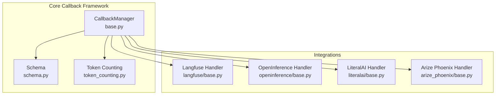
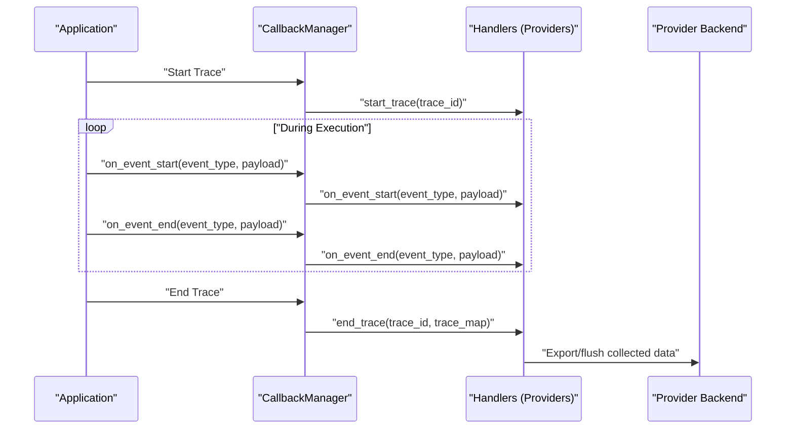
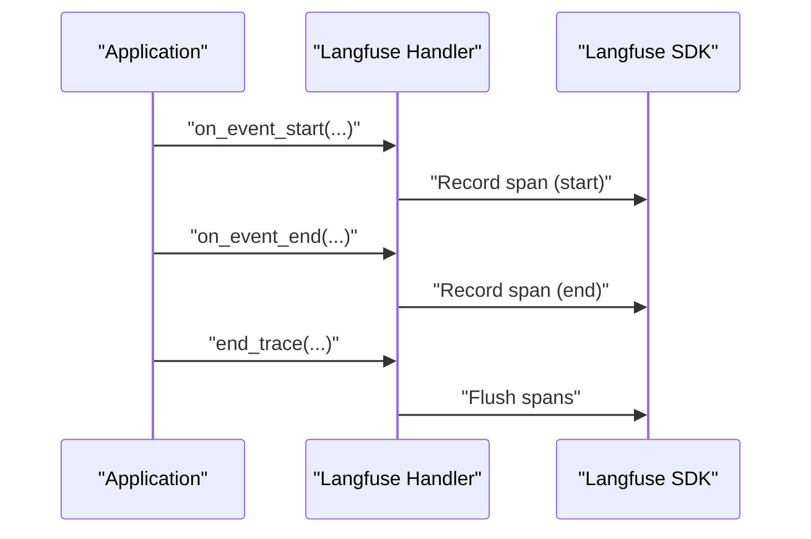
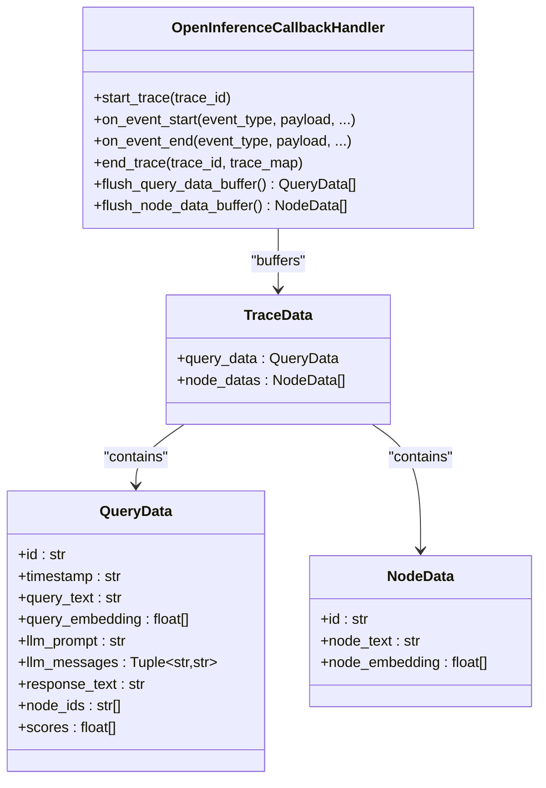
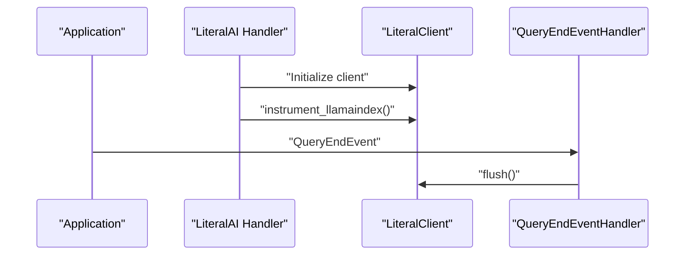
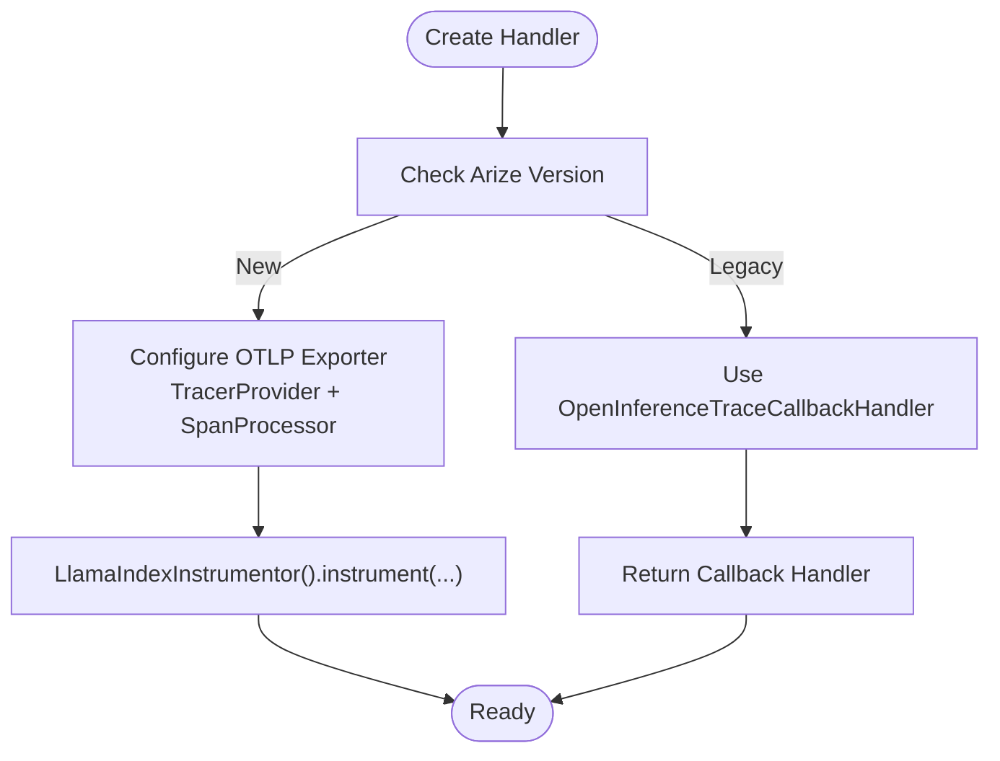
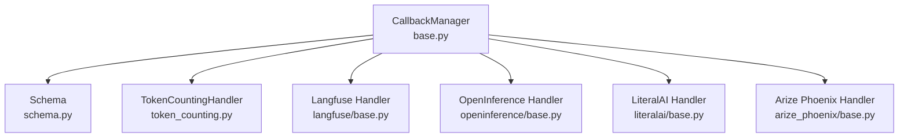

# LLM Usage Tracking

<cite>
**Referenced Files in This Document**
- [base.py](file://llama-index-core/llama_index/core/callbacks/base.py)
- [schema.py](file://llama-index-core/llama_index/core/callbacks/schema.py)
- [token_counting.py](file://llama-index-core/llama_index/core/callbacks/token_counting.py)
- [base.py](file://llama-index-integrations/callbacks/llama-index-callbacks-langfuse/llama_index/callbacks/langfuse/base.py)
- [base.py](file://llama-index-integrations/callbacks/llama-index-callbacks-openinference/llama_index/callbacks/openinference/base.py)
- [base.py](file://llama-index-integrations/callbacks/llama-index-callbacks-literalai/llama_index/callbacks/literalai/base.py)
- [base.py](file://llama-index-integrations/callbacks/llama-index-callbacks-arize-phoenix/llama_index/callbacks/arize_phoenix/base.py)
- [__init__.py](file://llama-index-core/llama_index/core/callbacks/__init__.py)
- [README.md](file://llama-index-integrations/callbacks/llama-index-callbacks-langfuse/README.md)
- [README.md](file://llama-index-integrations/callbacks/llama-index-callbacks-literalai/README.md)
</cite>

## Table of Contents
1. [Introduction](#introduction)
2. [Project Structure](#project-structure)
3. [Core Components](#core-components)
4. [Architecture Overview](#architecture-overview)
5. [Detailed Component Analysis](#detailed-component-analysis)
6. [Dependency Analysis](#dependency-analysis)
7. [Performance Considerations](#performance-considerations)
8. [Troubleshooting Guide](#troubleshooting-guide)
9. [Conclusion](#conclusion)
10. [Appendices](#appendices)

## Introduction
This document provides comprehensive API documentation for LLM usage tracking integrations in the LlamaIndex ecosystem. It focuses on four providers: Langfuse, OpenInference, LiteralAI, and Arize Phoenix. The guide covers the Callback interface implementation, event handling patterns, and metrics collection mechanisms. It also includes complete API specifications for token counting, latency tracking, cost monitoring, and usage analytics, along with configuration examples, integration patterns, and best practices for production monitoring. Finally, it documents custom callback development, event schema definitions, and data export capabilities.

## Project Structure
The LLM usage tracking functionality is organized around a core callback framework and provider-specific integrations:
- Core callback infrastructure: event types, payloads, callback manager, and token counting utilities
- Provider integrations: Langfuse, OpenInference, LiteralAI, and Arize Phoenix callback handlers

**Diagram sources**
- [base.py](file://llama-index-core/llama_index/core/callbacks/base.py#L28-L303)
- [schema.py](file://llama-index-core/llama_index/core/callbacks/schema.py#L16-L102)
- [token_counting.py](file://llama-index-core/llama_index/core/callbacks/token_counting.py#L143-L270)
- [base.py](file://llama-index-integrations/callbacks/llama-index-callbacks-langfuse/llama_index/callbacks/langfuse/base.py#L8-L12)
- [base.py](file://llama-index-integrations/callbacks/llama-index-callbacks-openinference/llama_index/callbacks/openinference/base.py#L165-L301)
- [base.py](file://llama-index-integrations/callbacks/llama-index-callbacks-literalai/llama_index/callbacks/literalai/base.py#L11-L59)
- [base.py](file://llama-index-integrations/callbacks/llama-index-callbacks-arize-phoenix/llama_index/callbacks/arize_phoenix/base.py#L6-L40)

**Section sources**
- [base.py](file://llama-index-core/llama_index/core/callbacks/base.py#L1-L303)
- [schema.py](file://llama-index-core/llama_index/core/callbacks/schema.py#L1-L102)
- [token_counting.py](file://llama-index-core/llama_index/core/callbacks/token_counting.py#L1-L270)
- [base.py](file://llama-index-integrations/callbacks/llama-index-callbacks-langfuse/llama_index/callbacks/langfuse/base.py#L1-L12)
- [base.py](file://llama-index-integrations/callbacks/llama-index-callbacks-openinference/llama_index/callbacks/openinference/base.py#L1-L301)
- [base.py](file://llama-index-integrations/callbacks/llama-index-callbacks-literalai/llama_index/callbacks/literalai/base.py#L1-L59)
- [base.py](file://llama-index-integrations/callbacks/llama-index-callbacks-arize-phoenix/llama_index/callbacks/arize_phoenix/base.py#L1-L40)

## Core Components
This section outlines the foundational callback infrastructure used by all integrations.

- CallbackManager
  - Central orchestrator for event lifecycle (start/end) and trace management
  - Maintains trace stack and trace map for hierarchical event relationships
  - Provides context managers for event and trace lifecycles
  - Implements event filtering via event_starts_to_ignore and event_ends_to_ignore

- Event Types and Payloads
  - CBEventType enumerates core LLM/RAG events (e.g., LLM, QUERY, RETRIEVE, EMBEDDING)
  - EventPayload defines standardized keys for payloads (e.g., PROMPT, MESSAGES, RESPONSE, EMBEDDINGS)
  - LEAF_EVENTS excludes intermediate events from having child events

- Token Counting Handler
  - Tracks LLM and embedding token usage per event
  - Extracts token counts from response metadata or falls back to tokenizer estimates
  - Aggregates totals for prompt, completion, and embeddings

**Section sources**
- [base.py](file://llama-index-core/llama_index/core/callbacks/base.py#L28-L303)
- [schema.py](file://llama-index-core/llama_index/core/callbacks/schema.py#L16-L102)
- [token_counting.py](file://llama-index-core/llama_index/core/callbacks/token_counting.py#L143-L270)

## Architecture Overview
The callback architecture enables pluggable providers to observe and record LLM usage and performance. Providers implement BaseCallbackHandler and receive events emitted by the CallbackManager.

**Diagram sources**
- [base.py](file://llama-index-core/llama_index/core/callbacks/base.py#L88-L143)
- [base.py](file://llama-index-core/llama_index/core/callbacks/base.py#L193-L243)

## Detailed Component Analysis

### Langfuse Integration
- Handler creation
  - Factory function returns a LlamaIndexCallbackHandler configured for LlamaIndex
  - Sets an integration marker for downstream telemetry
- Configuration
  - Requires environment variables for credentials and host
  - Global handler registration pattern supported
- Metrics and tracing
  - Captures LLM prompts, completions, and retrieval context
  - Exposes UI for inspecting traces and performance

**Diagram sources**
- [base.py](file://llama-index-integrations/callbacks/llama-index-callbacks-langfuse/llama_index/callbacks/langfuse/base.py#L8-L12)
- [README.md](file://llama-index-integrations/callbacks/llama-index-callbacks-langfuse/README.md#L1-L19)

**Section sources**
- [base.py](file://llama-index-integrations/callbacks/llama-index-callbacks-langfuse/llama_index/callbacks/langfuse/base.py#L1-L12)
- [README.md](file://llama-index-integrations/callbacks/llama-index-callbacks-langfuse/README.md#L1-L19)

### OpenInference Integration
- Handler implementation
  - OpenInferenceCallbackHandler captures query and node data aligned with the OpenInference specification
  - Buffers data per trace and exposes flush methods for exporting
- Data schema
  - QueryData: identifiers, timestamps, prompt/response fields, retrieved node IDs/scores, embeddings
  - NodeData: node identifiers and text
  - TraceData: aggregates query and node data
- Export capability
  - as_dataframe converts buffered data to a pandas DataFrame for downstream analytics

**Diagram sources**
- [base.py](file://llama-index-integrations/callbacks/llama-index-callbacks-openinference/llama_index/callbacks/openinference/base.py#L165-L301)

**Section sources**
- [base.py](file://llama-index-integrations/callbacks/llama-index-callbacks-openinference/llama_index/callbacks/openinference/base.py#L1-L301)

### LiteralAI Integration
- Handler creation
  - literalai_callback_handler initializes a LiteralClient and instruments LlamaIndex
  - Registers a QueryEndEventHandler to flush client cache upon query completion
- Configuration
  - Supports batch size, API key, URL, environment, and disabled flag
- Observability
  - One-click observability for RAG pipelines on Literal AI

**Diagram sources**
- [base.py](file://llama-index-integrations/callbacks/llama-index-callbacks-literalai/llama_index/callbacks/literalai/base.py#L11-L59)

**Section sources**
- [base.py](file://llama-index-integrations/callbacks/llama-index-callbacks-literalai/llama_index/callbacks/literalai/base.py#L1-L59)
- [README.md](file://llama-index-integrations/callbacks/llama-index-callbacks-literalai/README.md#L1-L7)

### Arize Phoenix Integration
- Handler creation
  - arize_phoenix_callback_handler supports both new and legacy Arize versions
  - Newer versions: uses OpenInference instrumentation with OTLP exporter
  - Older versions: uses OpenInferenceTraceCallbackHandler
- Configuration
  - Endpoint configurable for OTLP exporter
  - Tracer provider and runtime context separation options supported

**Diagram sources**
- [base.py](file://llama-index-integrations/callbacks/llama-index-callbacks-arize-phoenix/llama_index/callbacks/arize_phoenix/base.py#L6-L40)

**Section sources**
- [base.py](file://llama-index-integrations/callbacks/llama-index-callbacks-arize-phoenix/llama_index/callbacks/arize_phoenix/base.py#L1-L40)

## Dependency Analysis
The integrations depend on the core callback framework and external provider SDKs.

**Diagram sources**
- [base.py](file://llama-index-core/llama_index/core/callbacks/base.py#L28-L303)
- [schema.py](file://llama-index-core/llama_index/core/callbacks/schema.py#L16-L102)
- [token_counting.py](file://llama-index-core/llama_index/core/callbacks/token_counting.py#L143-L270)
- [base.py](file://llama-index-integrations/callbacks/llama-index-callbacks-langfuse/llama_index/callbacks/langfuse/base.py#L8-L12)
- [base.py](file://llama-index-integrations/callbacks/llama-index-callbacks-openinference/llama_index/callbacks/openinference/base.py#L165-L301)
- [base.py](file://llama-index-integrations/callbacks/llama-index-callbacks-literalai/llama_index/callbacks/literalai/base.py#L11-L59)
- [base.py](file://llama-index-integrations/callbacks/llama-index-callbacks-arize-phoenix/llama_index/callbacks/arize_phoenix/base.py#L6-L40)

**Section sources**
- [base.py](file://llama-index-core/llama_index/core/callbacks/base.py#L28-L303)
- [schema.py](file://llama-index-core/llama_index/core/callbacks/schema.py#L16-L102)
- [token_counting.py](file://llama-index-core/llama_index/core/callbacks/token_counting.py#L143-L270)
- [base.py](file://llama-index-integrations/callbacks/llama-index-callbacks-langfuse/llama_index/callbacks/langfuse/base.py#L1-L12)
- [base.py](file://llama-index-integrations/callbacks/llama-index-callbacks-openinference/llama_index/callbacks/openinference/base.py#L1-L301)
- [base.py](file://llama-index-integrations/callbacks/llama-index-callbacks-literalai/llama_index/callbacks/literalai/base.py#L1-L59)
- [base.py](file://llama-index-integrations/callbacks/llama-index-callbacks-arize-phoenix/llama_index/callbacks/arize_phoenix/base.py#L1-L40)

## Performance Considerations
- Token counting overhead
  - TokenCountingHandler performs string tokenization and response metadata extraction; enable verbose mode only during debugging
- Buffering and flushing
  - OpenInferenceCallbackHandler buffers query and node data; use flush methods to avoid memory pressure
  - LiteralAI handler flushes on query end; tune batch_size for throughput vs. latency
- Export pipeline
  - Arize Phoenix OTLP exporter introduces network overhead; configure endpoint and tracer provider appropriately
- Trace depth
  - Avoid excessive nested events to minimize trace_map growth and context switching costs

## Troubleshooting Guide
- Missing provider SDK
  - Ensure required packages are installed (e.g., literalai, arize-phoenix, langfuse)
- Handler conflicts
  - CallbackManager prevents adding multiple handlers of the same type; ensure unique handler instances
- Token count discrepancies
  - Some providers may not expose usage metadata; TokenCountingHandler falls back to tokenizer estimates
- Event filtering
  - Use event_starts_to_ignore and event_ends_to_ignore to reduce noise in handlers

**Section sources**
- [base.py](file://llama-index-core/llama_index/core/callbacks/base.py#L64-L74)
- [token_counting.py](file://llama-index-core/llama_index/core/callbacks/token_counting.py#L39-L76)
- [base.py](file://llama-index-integrations/callbacks/llama-index-callbacks-literalai/llama_index/callbacks/literalai/base.py#L55-L59)
- [base.py](file://llama-index-integrations/callbacks/llama-index-callbacks-arize-phoenix/llama_index/callbacks/arize_phoenix/base.py#L28-L38)

## Conclusion
The LlamaIndex callback framework provides a robust foundation for LLM usage tracking across multiple providers. By leveraging standardized event types and payloads, integrations can capture token usage, latency, and retrieval context consistently. Choose the appropriate provider based on your observability needs and export pipeline, and apply the best practices outlined above for reliable production monitoring.

## Appendices

### API Specifications

- Callback Manager API
  - Methods: start_trace, end_trace, event (context manager), as_trace (context manager), add_handler, remove_handler, set_handlers
  - Properties: trace_map
  - Event lifecycle: on_event_start, on_event_end

- Token Counting API
  - Handler: TokenCountingHandler
  - Methods: on_event_end (captures LLM and EMBEDDING token usage)
  - Properties: total_llm_token_count, prompt_llm_token_count, completion_llm_token_count, total_embedding_token_count
  - Utilities: get_llm_token_counts, get_tokens_from_response

- OpenInference Schema
  - QueryData fields: id, timestamp, query_text, query_embedding, llm_prompt, llm_messages, response_text, node_ids, scores
  - NodeData fields: id, node_text, node_embedding
  - TraceData fields: query_data, node_datas
  - Export: as_dataframe

- Provider Handlers
  - Langfuse: langfuse_callback_handler factory
  - OpenInference: OpenInferenceCallbackHandler
  - LiteralAI: literalai_callback_handler factory
  - Arize Phoenix: arize_phoenix_callback_handler factory

**Section sources**
- [base.py](file://llama-index-core/llama_index/core/callbacks/base.py#L88-L243)
- [token_counting.py](file://llama-index-core/llama_index/core/callbacks/token_counting.py#L143-L270)
- [base.py](file://llama-index-integrations/callbacks/llama-index-callbacks-openinference/llama_index/callbacks/openinference/base.py#L51-L134)
- [base.py](file://llama-index-integrations/callbacks/llama-index-callbacks-langfuse/llama_index/callbacks/langfuse/base.py#L8-L12)
- [base.py](file://llama-index-integrations/callbacks/llama-index-callbacks-literalai/llama_index/callbacks/literalai/base.py#L11-L59)
- [base.py](file://llama-index-integrations/callbacks/llama-index-callbacks-arize-phoenix/llama_index/callbacks/arize_phoenix/base.py#L6-L40)

### Configuration Examples

- Langfuse
  - Set global handler and environment variables for credentials and host
  - Reference: [README.md](file://llama-index-integrations/callbacks/llama-index-callbacks-langfuse/README.md#L1-L19)

- LiteralAI
  - Configure batch size, API key, URL, environment, and disabled flag
  - Reference: [base.py](file://llama-index-integrations/callbacks/llama-index-callbacks-literalai/llama_index/callbacks/literalai/base.py#L11-L28)

- Arize Phoenix
  - Newer version: configure OTLP endpoint and tracer provider
  - Older version: use OpenInferenceTraceCallbackHandler
  - Reference: [base.py](file://llama-index-integrations/callbacks/llama-index-callbacks-arize-phoenix/llama_index/callbacks/arize_phoenix/base.py#L6-L40)

**Section sources**
- [README.md](file://llama-index-integrations/callbacks/llama-index-callbacks-langfuse/README.md#L1-L19)
- [base.py](file://llama-index-integrations/callbacks/llama-index-callbacks-literalai/llama_index/callbacks/literalai/base.py#L11-L28)
- [base.py](file://llama-index-integrations/callbacks/llama-index-callbacks-arize-phoenix/llama_index/callbacks/arize_phoenix/base.py#L6-L40)

### Integration Patterns and Best Practices
- Global handler registration for seamless tracing across modules
- Use event filtering to reduce noise and improve performance
- Periodically flush buffers for providers that support it
- Export to analytics platforms using provider-specific exporters or dataframes
- Monitor token usage and adjust batching and caching strategies accordingly

**Section sources**
- [base.py](file://llama-index-core/llama_index/core/callbacks/base.py#L57-L85)
- [base.py](file://llama-index-integrations/callbacks/llama-index-callbacks-openinference/llama_index/callbacks/openinference/base.py#L195-L211)
- [base.py](file://llama-index-integrations/callbacks/llama-index-callbacks-literalai/llama_index/callbacks/literalai/base.py#L39-L49)