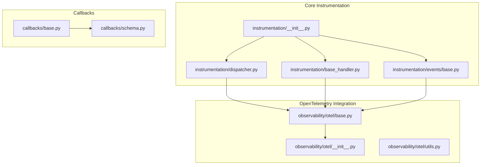
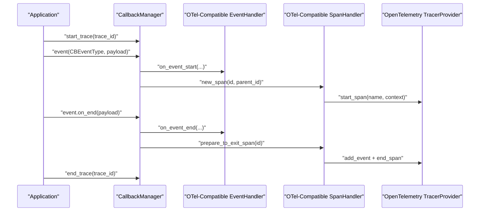
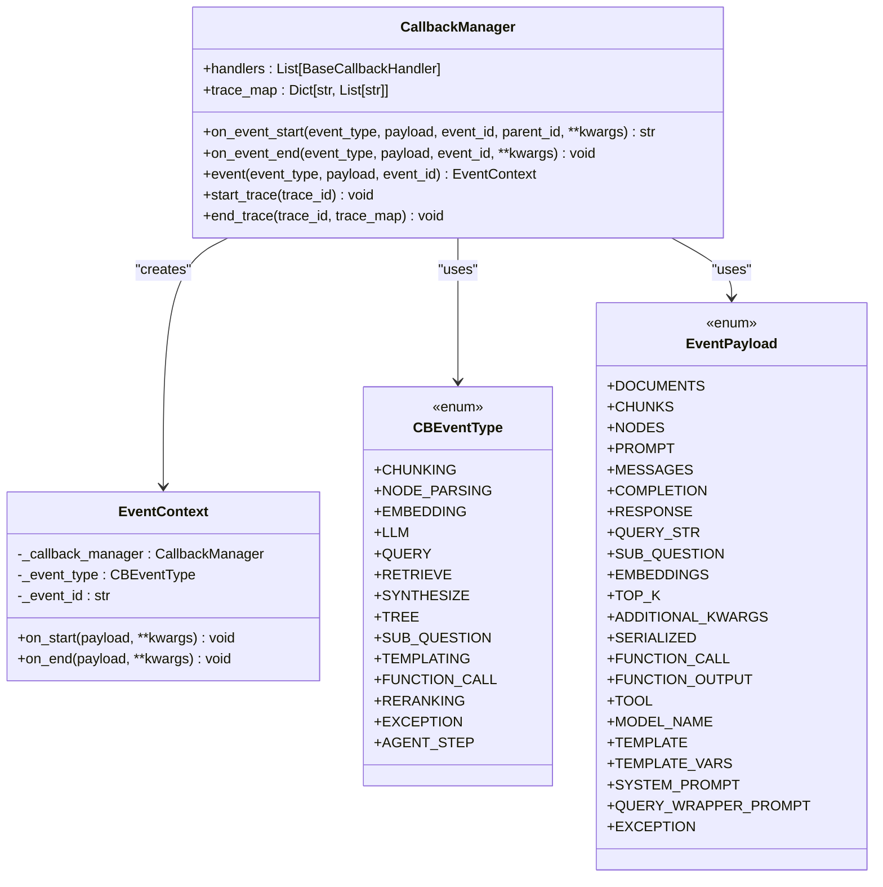
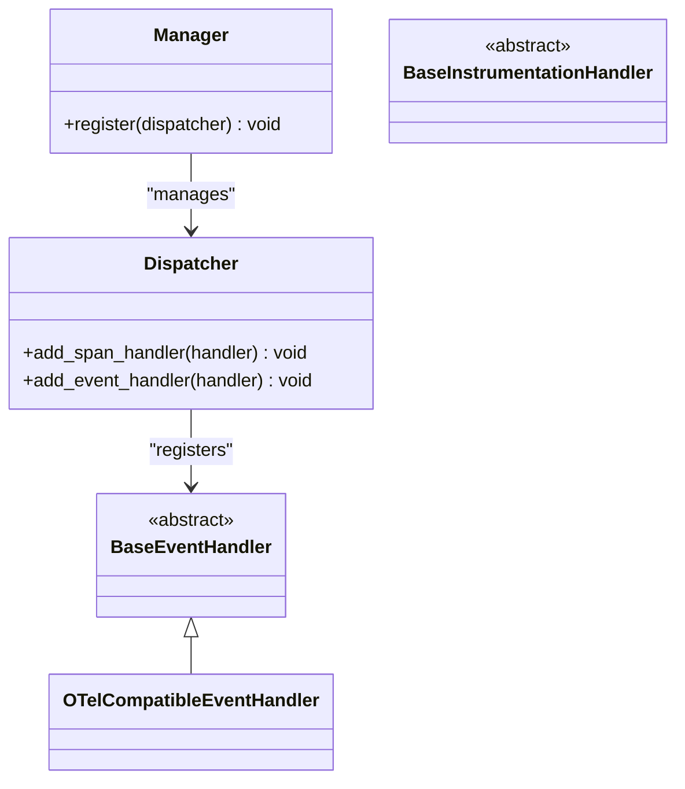
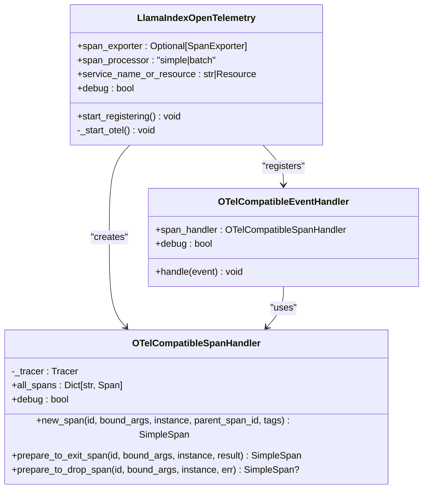
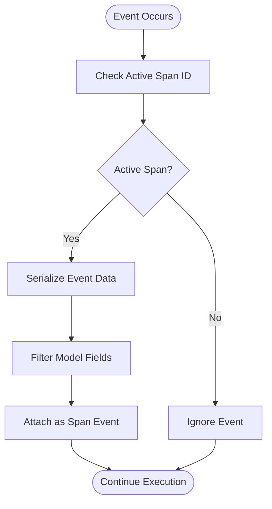
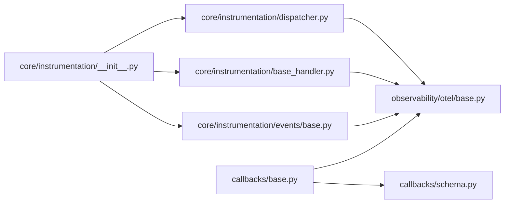

# Observability Integrations

<cite>
**Referenced Files in This Document**
- [__init__.py](file://llama-index-core/llama_index/core/instrumentation/__init__.py)
- [dispatcher.py](file://llama-index-core/llama_index/core/instrumentation/dispatcher.py)
- [base_handler.py](file://llama-index-core/llama_index/core/instrumentation/base_handler.py)
- [events/base.py](file://llama-index-core/llama_index/core/instrumentation/events/base.py)
- [callbacks/base.py](file://llama-index-core/llama_index/core/callbacks/base.py)
- [callbacks/schema.py](file://llama-index-core/llama_index/core/callbacks/schema.py)
- [llama_index/observability/otel/__init__.py](file://llama-index-integrations/observability/llama-index-observability-otel/llama_index/observability/otel/__init__.py)
- [llama_index/observability/otel/base.py](file://llama-index-integrations/observability/llama-index-observability-otel/llama_index/observability/otel/base.py)
- [llama_index/observability/otel/utils.py](file://llama-index-integrations/observability/llama-index-observability-otel/llama_index/observability/otel/utils.py)
</cite>

## Table of Contents
1. [Introduction](#introduction)
2. [Project Structure](#project-structure)
3. [Core Components](#core-components)
4. [Architecture Overview](#architecture-overview)
5. [Detailed Component Analysis](#detailed-component-analysis)
6. [Dependency Analysis](#dependency-analysis)
7. [Performance Considerations](#performance-considerations)
8. [Troubleshooting Guide](#troubleshooting-guide)
9. [Conclusion](#conclusion)
10. [Appendices](#appendices)

## Introduction
This document provides comprehensive API documentation for observability and instrumentation integrations in the LlamaIndex ecosystem. It covers monitoring, tracing, and logging solutions, focusing on the Callback framework, instrumentation patterns, and event handling mechanisms. It also documents the OpenTelemetry integration and outlines how to implement custom instrumentation handlers, set up distributed tracing, and integrate with existing monitoring stacks. Best practices for production observability, alerting strategies, and performance optimization are included.

## Project Structure
The observability and instrumentation capabilities are split across:
- Core instrumentation APIs and dispatchers used by the framework
- Callback manager and event schema for traditional callback-based observability
- OpenTelemetry integration package that bridges LlamaIndex instrumentation to OpenTelemetry

**Diagram sources**
- [__init__.py](file://llama-index-core/llama_index/core/instrumentation/__init__.py#L1-L14)
- [dispatcher.py](file://llama-index-core/llama_index/core/instrumentation/dispatcher.py#L1-L9)
- [base_handler.py](file://llama-index-core/llama_index/core/instrumentation/base_handler.py#L1-L2)
- [events/base.py](file://llama-index-core/llama_index/core/instrumentation/events/base.py#L1-L2)
- [callbacks/base.py](file://llama-index-core/llama_index/core/callbacks/base.py#L1-L303)
- [callbacks/schema.py](file://llama-index-core/llama_index/core/callbacks/schema.py#L1-L102)
- [llama_index/observability/otel/__init__.py](file://llama-index-integrations/observability/llama-index-observability-otel/llama_index/observability/otel/__init__.py#L1-L6)
- [llama_index/observability/otel/base.py](file://llama-index-integrations/observability/llama-index-observability-otel/llama_index/observability/otel/base.py#L1-L269)
- [llama_index/observability/otel/utils.py](file://llama-index-integrations/observability/llama-index-observability-otel/llama_index/observability/otel/utils.py)

**Section sources**
- [__init__.py](file://llama-index-core/llama_index/core/instrumentation/__init__.py#L1-L14)
- [dispatcher.py](file://llama-index-core/llama_index/core/instrumentation/dispatcher.py#L1-L9)
- [base_handler.py](file://llama-index-core/llama_index/core/instrumentation/base_handler.py#L1-L2)
- [events/base.py](file://llama-index-core/llama_index/core/instrumentation/events/base.py#L1-L2)
- [callbacks/base.py](file://llama-index-core/llama_index/core/callbacks/base.py#L1-L303)
- [callbacks/schema.py](file://llama-index-core/llama_index/core/callbacks/schema.py#L1-L102)
- [llama_index/observability/otel/__init__.py](file://llama-index-integrations/observability/llama-index-observability-otel/llama_index/observability/otel/__init__.py#L1-L6)
- [llama_index/observability/otel/base.py](file://llama-index-integrations/observability/llama-index-observability-otel/llama_index/observability/otel/base.py#L1-L269)
- [llama_index/observability/otel/utils.py](file://llama-index-integrations/observability/llama-index-observability-otel/llama_index/observability/otel/utils.py)

## Core Components
- Callback Manager: Central orchestrator for event lifecycle, trace management, and handler invocation. Provides context-managed event lifecycles and trace scopes.
- Event Types and Payloads: Enumerated event categories and standardized payload keys for consistent telemetry.
- Instrumentation Dispatcher: Bridges instrumentation spans and events to external systems via handlers.
- OpenTelemetry Integration: Provides OTel-compatible span and event handlers, tracer provider configuration, and exporter support.

Key responsibilities:
- Trace correlation and hierarchical event mapping
- Event filtering and selective handler invocation
- Context-aware span and event routing
- Extensible handler registration for multiple observability backends

**Section sources**
- [callbacks/base.py](file://llama-index-core/llama_index/core/callbacks/base.py#L28-L303)
- [callbacks/schema.py](file://llama-index-core/llama_index/core/callbacks/schema.py#L16-L102)
- [__init__.py](file://llama-index-core/llama_index/core/instrumentation/__init__.py#L1-L14)
- [dispatcher.py](file://llama-index-core/llama_index/core/instrumentation/dispatcher.py#L1-L9)

## Architecture Overview
The observability architecture combines two complementary pathways:
- Callback-based observability: Uses CallbackManager to emit structured events and manage traces.
- Instrumentation-based observability: Uses the instrumentation dispatcher to route spans and events to external systems (e.g., OpenTelemetry).

**Diagram sources**
- [callbacks/base.py](file://llama-index-core/llama_index/core/callbacks/base.py#L156-L211)
- [llama_index/observability/otel/base.py](file://llama-index-integrations/observability/llama-index-observability-otel/llama_index/observability/otel/base.py#L162-L207)
- [llama_index/observability/otel/base.py](file://llama-index-integrations/observability/llama-index-observability-otel/llama_index/observability/otel/base.py#L44-L160)
- [llama_index/observability/otel/base.py](file://llama-index-integrations/observability/llama-index-observability-otel/llama_index/observability/otel/base.py#L209-L269)

## Detailed Component Analysis

### Callback Manager and Event Schema
The CallbackManager encapsulates:
- Event lifecycle: start, end, and exception handling
- Trace management: hierarchical trace stack and trace map
- Handler orchestration: selective invocation based on event types
- Context-managed event lifecycle via EventContext

Core APIs:
- start_trace(trace_id), end_trace(trace_id)
- event(event_type, payload) context manager
- on_event_start/on_event_end
- add_handler/remove_handler/set_handlers

Event types and payloads define standardized telemetry categories and fields for consistent downstream processing.

**Diagram sources**
- [callbacks/base.py](file://llama-index-core/llama_index/core/callbacks/base.py#L28-L303)
- [callbacks/schema.py](file://llama-index-core/llama_index/core/callbacks/schema.py#L16-L102)

**Section sources**
- [callbacks/base.py](file://llama-index-core/llama_index/core/callbacks/base.py#L28-L303)
- [callbacks/schema.py](file://llama-index-core/llama_index/core/callbacks/schema.py#L16-L102)

### Instrumentation Dispatcher and Handlers
The instrumentation subsystem exposes:
- Dispatcher and Manager for registering span and event handlers
- Base handler abstractions for extending instrumentation
- Event base for typed instrumentation events

Integration points:
- Dispatcher.add_span_handler and add_event_handler
- BaseInstrumentationHandler and BaseEventHandler abstractions
- Span and event models for correlating telemetry

**Diagram sources**
- [__init__.py](file://llama-index-core/llama_index/core/instrumentation/__init__.py#L1-L14)
- [dispatcher.py](file://llama-index-core/llama_index/core/instrumentation/dispatcher.py#L1-L9)
- [base_handler.py](file://llama-index-core/llama_index/core/instrumentation/base_handler.py#L1-L2)
- [events/base.py](file://llama-index-core/llama_index/core/instrumentation/events/base.py#L1-L2)

**Section sources**
- [__init__.py](file://llama-index-core/llama_index/core/instrumentation/__init__.py#L1-L14)
- [dispatcher.py](file://llama-index-core/llama_index/core/instrumentation/dispatcher.py#L1-L9)
- [base_handler.py](file://llama-index-core/llama_index/core/instrumentation/base_handler.py#L1-L2)
- [events/base.py](file://llama-index-core/llama_index/core/instrumentation/events/base.py#L1-L2)

### OpenTelemetry Integration
The OpenTelemetry integration provides:
- OTel-compatible span handler that wraps OpenTelemetry spans
- OTel-compatible event handler that attaches structured events to spans
- Configuration for tracer provider, span processor, and exporter
- Utility helpers for event attribute filtering

Key APIs:
- LlamaIndexOpenTelemetry: configuration and registration
- OTelCompatibleSpanHandler: span lifecycle bridging
- OTelCompatibleEventHandler: event routing to spans

**Diagram sources**
- [llama_index/observability/otel/base.py](file://llama-index-integrations/observability/llama-index-observability-otel/llama_index/observability/otel/base.py#L209-L269)
- [llama_index/observability/otel/base.py](file://llama-index-integrations/observability/llama-index-observability-otel/llama_index/observability/otel/base.py#L44-L160)
- [llama_index/observability/otel/base.py](file://llama-index-integrations/observability/llama-index-observability-otel/llama_index/observability/otel/base.py#L162-L207)

**Section sources**
- [llama_index/observability/otel/__init__.py](file://llama-index-integrations/observability/llama-index-observability-otel/llama_index/observability/otel/__init__.py#L1-L6)
- [llama_index/observability/otel/base.py](file://llama-index-integrations/observability/llama-index-observability-otel/llama_index/observability/otel/base.py#L1-L269)
- [llama_index/observability/otel/utils.py](file://llama-index-integrations/observability/llama-index-observability-otel/llama_index/observability/otel/utils.py)

### Event Handling Flow
This flow illustrates how instrumentation events are correlated with spans and exported to OpenTelemetry.

**Diagram sources**
- [llama_index/observability/otel/base.py](file://llama-index-integrations/observability/llama-index-observability-otel/llama_index/observability/otel/base.py#L178-L207)

**Section sources**
- [llama_index/observability/otel/base.py](file://llama-index-integrations/observability/llama-index-observability-otel/llama_index/observability/otel/base.py#L178-L207)

## Dependency Analysis
- Core instrumentation APIs are re-exported from the instrumentation package into the core module, enabling seamless integration.
- The OpenTelemetry integration depends on the core instrumentation dispatcher and event handlers.
- Callback manager and schema are foundational for event categorization and payload standardization.

**Diagram sources**
- [__init__.py](file://llama-index-core/llama_index/core/instrumentation/__init__.py#L1-L14)
- [dispatcher.py](file://llama-index-core/llama_index/core/instrumentation/dispatcher.py#L1-L9)
- [base_handler.py](file://llama-index-core/llama_index/core/instrumentation/base_handler.py#L1-L2)
- [events/base.py](file://llama-index-core/llama_index/core/instrumentation/events/base.py#L1-L2)
- [callbacks/base.py](file://llama-index-core/llama_index/core/callbacks/base.py#L1-L303)
- [callbacks/schema.py](file://llama-index-core/llama_index/core/callbacks/schema.py#L1-L102)
- [llama_index/observability/otel/base.py](file://llama-index-integrations/observability/llama-index-observability-otel/llama_index/observability/otel/base.py#L1-L269)

**Section sources**
- [__init__.py](file://llama-index-core/llama_index/core/instrumentation/__init__.py#L1-L14)
- [dispatcher.py](file://llama-index-core/llama_index/core/instrumentation/dispatcher.py#L1-L9)
- [base_handler.py](file://llama-index-core/llama_index/core/instrumentation/base_handler.py#L1-L2)
- [events/base.py](file://llama-index-core/llama_index/core/instrumentation/events/base.py#L1-L2)
- [callbacks/base.py](file://llama-index-core/llama_index/core/callbacks/base.py#L1-L303)
- [callbacks/schema.py](file://llama-index-core/llama_index/core/callbacks/schema.py#L1-L102)
- [llama_index/observability/otel/base.py](file://llama-index-integrations/observability/llama-index-observability-otel/llama_index/observability/otel/base.py#L1-L269)

## Performance Considerations
- Prefer batch span processors for high-throughput environments to reduce overhead.
- Limit event payload sizes by filtering non-essential fields during event serialization.
- Use selective handler invocation and avoid unnecessary event types to minimize handler overhead.
- Keep trace depth reasonable to avoid excessive trace_map growth and context switching costs.
- Enable debug mode only during development or targeted diagnostics due to console overhead.

## Troubleshooting Guide
Common issues and resolutions:
- Events not appearing in traces: Verify active span context and ensure OTel-compatible event handler is registered.
- Exporter not receiving spans: Confirm tracer provider initialization and span processor configuration.
- Duplicate or missing spans: Check trace_id scoping and ensure proper start/end lifecycle management.
- Serialization errors: Use event attribute filtering to exclude unserializable fields.

Operational checks:
- Validate handler registration via dispatcher APIs.
- Inspect trace_map and trace stack for anomalies.
- Temporarily enable debug mode to observe span and event lifecycle.

**Section sources**
- [llama_index/observability/otel/base.py](file://llama-index-integrations/observability/llama-index-observability-otel/llama_index/observability/otel/base.py#L242-L269)
- [callbacks/base.py](file://llama-index-core/llama_index/core/callbacks/base.py#L156-L211)

## Conclusion
The LlamaIndex observability stack combines a robust callback-based event system with an instrumentation dispatcher and a ready-to-use OpenTelemetry integration. By leveraging standardized event types and payloads, structured trace management, and OTel-compatible handlers, teams can implement comprehensive monitoring, distributed tracing, and logging across diverse observability backends. The modular design enables extensibility for additional providers and custom instrumentation handlers tailored to production needs.

## Appendices

### API Specifications

- LlamaIndexOpenTelemetry
  - span_exporter: Optional[SpanExporter]; default ConsoleSpanExporter
  - span_processor: Literal["simple","batch"]; default "batch"
  - service_name_or_resource: Union[str, Resource]; default a Resource with service name "llamaindex.opentelemetry"
  - debug: bool; default False
  - start_registering(): registers OTel-compatible span and event handlers with the dispatcher

- OTelCompatibleSpanHandler
  - new_span(id, bound_args, instance, parent_span_id, tags): creates and starts an OpenTelemetry span
  - prepare_to_exit_span(id, bound_args, instance, result): attaches events and ends span successfully
  - prepare_to_drop_span(id, bound_args, instance, err): attaches events and ends span with error

- OTelCompatibleEventHandler
  - handle(event): serializes event data and attaches it to the current span

- CallbackManager
  - start_trace(trace_id), end_trace(trace_id)
  - event(event_type, payload) context manager
  - on_event_start(event_type, payload, event_id, parent_id, **kwargs)
  - on_event_end(event_type, payload, event_id, **kwargs)
  - add_handler(handler), remove_handler(handler), set_handlers(handlers)

- Event Types (CBEventType)
  - CHUNKING, NODE_PARSING, EMBEDDING, LLM, QUERY, RETRIEVE, SYNTHESIZE, TREE, SUB_QUESTION, TEMPLATING, FUNCTION_CALL, RERANKING, EXCEPTION, AGENT_STEP

- Event Payload Keys (EventPayload)
  - DOCUMENTS, CHUNKS, NODES, PROMPT, MESSAGES, COMPLETION, RESPONSE, QUERY_STR, SUB_QUESTION, EMBEDDINGS, TOP_K, ADDITIONAL_KWARGS, SERIALIZED, FUNCTION_CALL, FUNCTION_OUTPUT, TOOL, MODEL_NAME, TEMPLATE, TEMPLATE_VARS, SYSTEM_PROMPT, QUERY_WRAPPER_PROMPT, EXCEPTION

**Section sources**
- [llama_index/observability/otel/base.py](file://llama-index-integrations/observability/llama-index-observability-otel/llama_index/observability/otel/base.py#L209-L269)
- [llama_index/observability/otel/base.py](file://llama-index-integrations/observability/llama-index-observability-otel/llama_index/observability/otel/base.py#L44-L160)
- [llama_index/observability/otel/base.py](file://llama-index-integrations/observability/llama-index-observability-otel/llama_index/observability/otel/base.py#L162-L207)
- [callbacks/base.py](file://llama-index-core/llama_index/core/callbacks/base.py#L28-L303)
- [callbacks/schema.py](file://llama-index-core/llama_index/core/callbacks/schema.py#L16-L102)