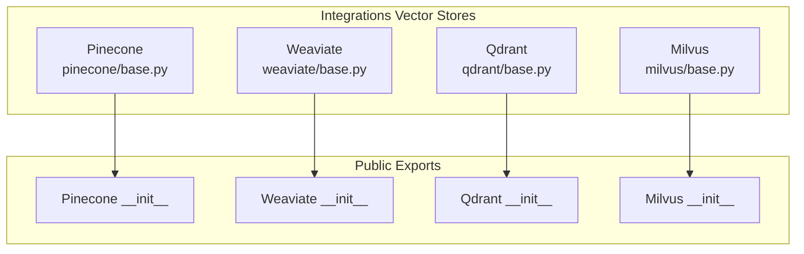
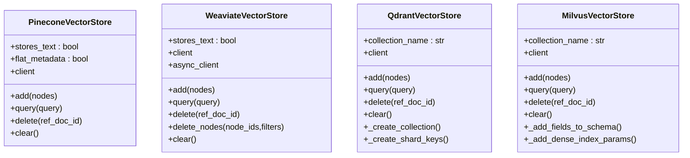
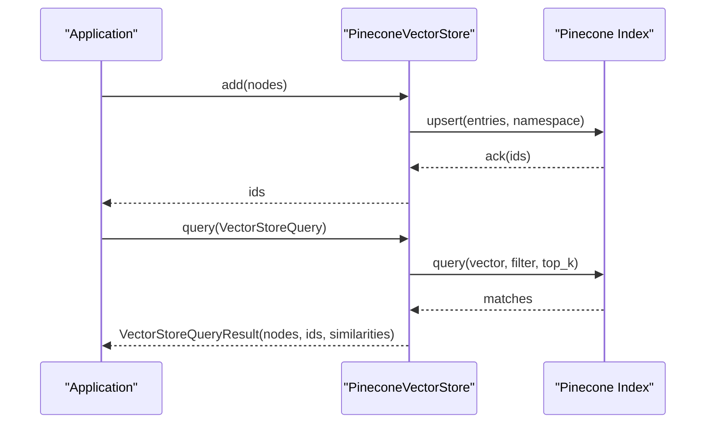
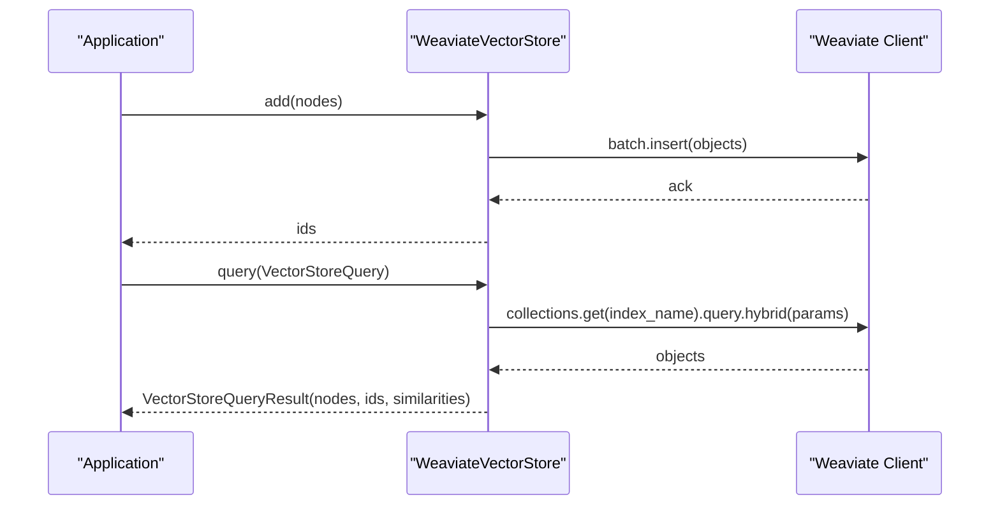
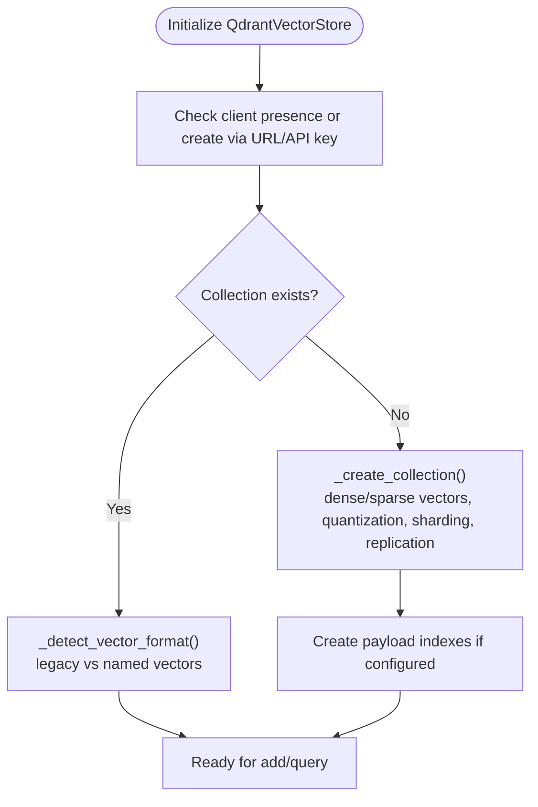
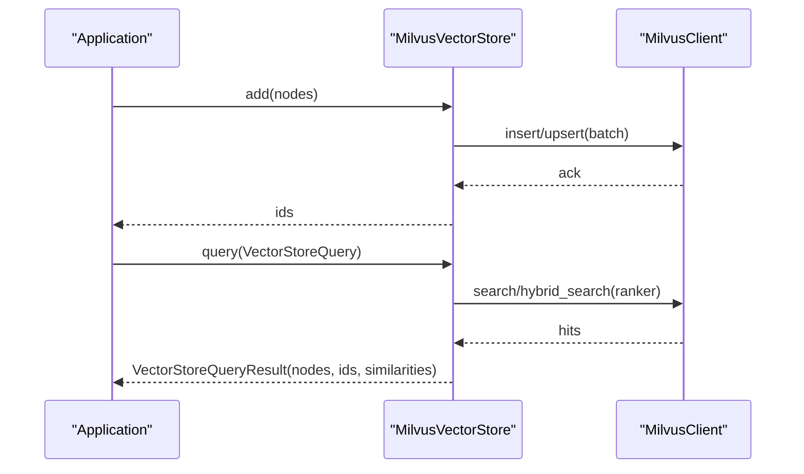
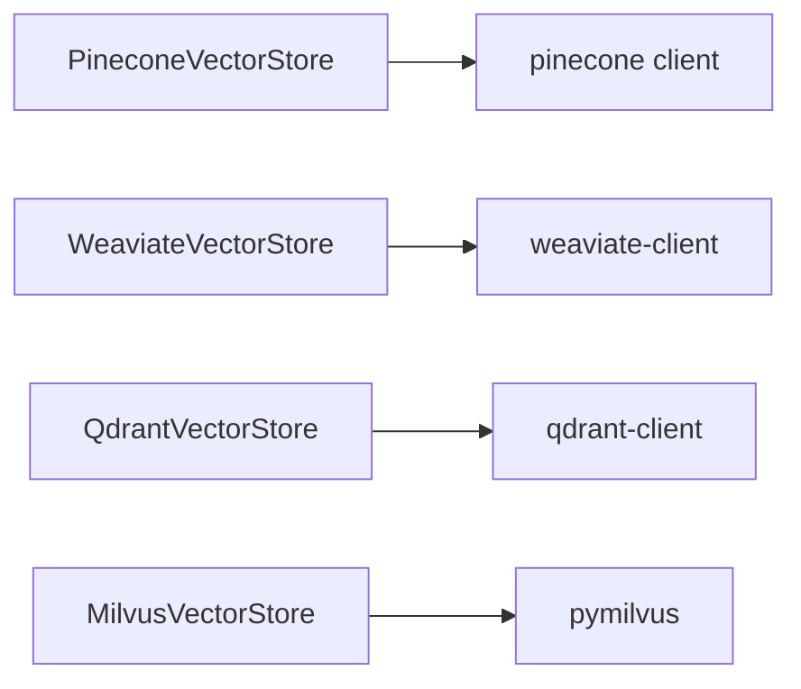

# Cloud Vector Stores

<cite>
**Referenced Files in This Document**
- [pinecone/base.py](file://llama-index-integrations/vector_stores/llama-index-vector-stores-pinecone/llama_index/vector_stores/pinecone/base.py)
- [pinecone/__init__.py](file://llama-index-integrations/vector_stores/llama-index-vector-stores-pinecone/llama_index/vector_stores/pinecone/__init__.py)
- [weaviate/base.py](file://llama-index-integrations/vector_stores/llama-index-vector-stores-weaviate/llama_index/vector_stores/weaviate/base.py)
- [weaviate/__init__.py](file://llama-index-integrations/vector_stores/llama-index-vector-stores-weaviate/llama_index/vector_stores/weaviate/__init__.py)
- [qdrant/base.py](file://llama-index-integrations/vector_stores/llama-index-vector-stores-qdrant/llama_index/vector_stores/qdrant/base.py)
- [qdrant/__init__.py](file://llama-index-integrations/vector_stores/llama-index-vector-stores-qdrant/llama_index/vector_stores/qdrant/__init__.py)
- [milvus/base.py](file://llama-index-integrations/vector_stores/llama-index-vector-stores-milvus/llama_index/vector_stores/milvus/base.py)
- [milvus/__init__.py](file://llama-index-integrations/vector_stores/llama-index-vector-stores-milvus/llama_index/vector_stores/milvus/__init__.py)
</cite>

## Table of Contents
1. [Introduction](#introduction)
2. [Project Structure](#project-structure)
3. [Core Components](#core-components)
4. [Architecture Overview](#architecture-overview)
5. [Detailed Component Analysis](#detailed-component-analysis)
6. [Dependency Analysis](#dependency-analysis)
7. [Performance Considerations](#performance-considerations)
8. [Troubleshooting Guide](#troubleshooting-guide)
9. [Conclusion](#conclusion)

## Introduction
This document provides comprehensive API documentation for cloud-hosted vector store providers integrated in the repository. It focuses on Pinecone, Weaviate, Qdrant, Milvus, and covers MongoDB Atlas and Azure Cognitive Search integrations present in the broader ecosystem. For each provider, we describe authentication, connection setup, index/collection lifecycle, schema and vector indexing, query modes, and operational considerations such as scaling and sharding where applicable.

## Project Structure
The relevant vector store implementations live under the vector_stores directory of the integrations package. Each provider exposes a dedicated module with a base implementation and an __init__.py exporting public APIs.

**Diagram sources**
- [pinecone/base.py](file://llama-index-integrations/vector_stores/llama-index-vector-stores-pinecone/llama_index/vector_stores/pinecone/base.py#L1-L552)
- [weaviate/base.py](file://llama-index-integrations/vector_stores/llama-index-vector-stores-weaviate/llama_index/vector_stores/weaviate/base.py#L1-L556)
- [qdrant/base.py](file://llama-index-integrations/vector_stores/llama-index-vector-stores-qdrant/llama_index/vector_stores/qdrant/base.py#L1-L1726)
- [milvus/base.py](file://llama-index-integrations/vector_stores/llama-index-vector-stores-milvus/llama_index/vector_stores/milvus/base.py#L1-L1518)
- [pinecone/__init__.py](file://llama-index-integrations/vector_stores/llama-index-vector-stores-pinecone/llama_index/vector_stores/pinecone/__init__.py#L1-L4)
- [weaviate/__init__.py](file://llama-index-integrations/vector_stores/llama-index-vector-stores-weaviate/llama_index/vector_stores/weaviate/__init__.py#L1-L12)
- [qdrant/__init__.py](file://llama-index-integrations/vector_stores/llama-index-vector-stores-qdrant/llama_index/vector_stores/qdrant/__init__.py#L1-L4)
- [milvus/__init__.py](file://llama-index-integrations/vector_stores/llama-index-vector-stores-milvus/llama_index/vector_stores/milvus/__init__.py#L1-L4)

**Section sources**
- [pinecone/base.py](file://llama-index-integrations/vector_stores/llama-index-vector-stores-pinecone/llama_index/vector_stores/pinecone/base.py#L1-L552)
- [weaviate/base.py](file://llama-index-integrations/vector_stores/llama-index-vector-stores-weaviate/llama_index/vector_stores/weaviate/base.py#L1-L556)
- [qdrant/base.py](file://llama-index-integrations/vector_stores/llama-index-vector-stores-qdrant/llama_index/vector_stores/qdrant/base.py#L1-L1726)
- [milvus/base.py](file://llama-index-integrations/vector_stores/llama-index-vector-stores-milvus/llama_index/vector_stores/milvus/base.py#L1-L1518)

## Core Components
- PineconeVectorStore: Adds, queries, deletes, and clears nodes in a Pinecone index; supports sparse/dense hybrid and metadata filtering.
- WeaviateVectorStore: Adds/deletes/query nodes in a Weaviate collection; supports hybrid search and async operations; manages schema creation.
- QdrantVectorStore: Manages Qdrant collections, supports dense/sparse/hybrid search, payload filtering, sharding, replication, and quantization.
- MilvusVectorStore: Manages Milvus collections, supports dense, sparse, hybrid, and MMR retrieval; handles index creation and schema fields.

**Section sources**
- [pinecone/base.py](file://llama-index-integrations/vector_stores/llama-index-vector-stores-pinecone/llama_index/vector_stores/pinecone/base.py#L114-L552)
- [weaviate/base.py](file://llama-index-integrations/vector_stores/llama-index-vector-stores-weaviate/llama_index/vector_stores/weaviate/base.py#L113-L556)
- [qdrant/base.py](file://llama-index-integrations/vector_stores/llama-index-vector-stores-qdrant/llama_index/vector_stores/qdrant/base.py#L72-L1726)
- [milvus/base.py](file://llama-index-integrations/vector_stores/llama-index-vector-stores-milvus/llama_index/vector_stores/milvus/base.py#L119-L1518)

## Architecture Overview
The providers implement a common vector store interface with provider-specific clients and index/collection management. They translate generic filters and query modes into provider-specific constructs.

**Diagram sources**
- [pinecone/base.py](file://llama-index-integrations/vector_stores/llama-index-vector-stores-pinecone/llama_index/vector_stores/pinecone/base.py#L114-L552)
- [weaviate/base.py](file://llama-index-integrations/vector_stores/llama-index-vector-stores-weaviate/llama_index/vector_stores/weaviate/base.py#L113-L556)
- [qdrant/base.py](file://llama-index-integrations/vector_stores/llama-index-vector-stores-qdrant/llama_index/vector_stores/qdrant/base.py#L72-L1726)
- [milvus/base.py](file://llama-index-integrations/vector_stores/llama-index-vector-stores-milvus/llama_index/vector_stores/milvus/base.py#L119-L1518)

## Detailed Component Analysis

### Pinecone Integration
- Authentication and client initialization: Accepts a Pinecone index instance or initializes via API key and index name.
- Index management: Upserts nodes, supports sparse/dense hybrid via optional tokenizer or sparse embedding model; deletes by document ID or filters; clears namespace.
- Querying: Supports DEFAULT, HYBRID, SPARSE modes; converts generic filters to Pinecone filter format; returns nodes with embeddings and metadata.
- Billing considerations: Not directly exposed in the code; consult Pinecone platform for pricing and quotas.

**Diagram sources**
- [pinecone/base.py](file://llama-index-integrations/vector_stores/llama-index-vector-stores-pinecone/llama_index/vector_stores/pinecone/base.py#L294-L552)

**Section sources**
- [pinecone/base.py](file://llama-index-integrations/vector_stores/llama-index-vector-stores-pinecone/llama_index/vector_stores/pinecone/base.py#L114-L552)
- [pinecone/__init__.py](file://llama-index-integrations/vector_stores/llama-index-vector-stores-pinecone/llama_index/vector_stores/pinecone/__init__.py#L1-L4)

### Weaviate Integration
- Authentication and client setup: Accepts a Weaviate client or creates one using URL and auth config; supports sync and async clients.
- Schema definition: Creates default collection schema if missing; validates index naming; supports custom batch wrappers.
- GraphQL API integration: Uses Weaviate collection query.hybrid for vector+metadata retrieval; translates filters to Weaviate filter DSL.
- Querying: Supports hybrid search with configurable alpha; parses results into nodes with embeddings and metadata.

**Diagram sources**
- [weaviate/base.py](file://llama-index-integrations/vector_stores/llama-index-vector-stores-weaviate/llama_index/vector_stores/weaviate/base.py#L259-L556)

**Section sources**
- [weaviate/base.py](file://llama-index-integrations/vector_stores/llama-index-vector-stores-weaviate/llama_index/vector_stores/weaviate/base.py#L113-L556)
- [weaviate/__init__.py](file://llama-index-integrations/vector_stores/llama-index-vector-stores-weaviate/llama_index/vector_stores/weaviate/__init__.py#L1-L12)

### Qdrant Integration
- Authentication and client setup: Accepts QdrantClient/AsyncQdrantClient or creates via URL and API key; supports hybrid search with dense/sparse vectors.
- Collection management: Creates collections with named dense/sparse vector fields; supports quantization, sharding, replication, payload indexes; detects legacy vector formats.
- Sharding and replicas: Configurable shard_number, sharding_method, replication_factor, write_consistency_factor; supports custom shard keys and key selector.
- Querying: Supports DEFAULT, HYBRID, SPARSE modes; builds Qdrant Filter expressions; performs hybrid fusion; returns nodes with embeddings.

**Diagram sources**
- [qdrant/base.py](file://llama-index-integrations/vector_stores/llama-index-vector-stores-qdrant/llama_index/vector_stores/qdrant/base.py#L803-L944)

**Section sources**
- [qdrant/base.py](file://llama-index-integrations/vector_stores/llama-index-vector-stores-qdrant/llama_index/vector_stores/qdrant/base.py#L72-L1726)
- [qdrant/__init__.py](file://llama-index-integrations/vector_stores/llama-index-vector-stores-qdrant/llama_index/vector_stores/qdrant/__init__.py#L1-L4)

### Milvus Integration
- Authentication and client setup: Connects via MilvusClient and AsyncMilvusClient; supports local and remote URIs; RBAC via token.
- Collection operations: Creates schema with dense/sparse fields; adds built-in functions for BM25; sets collection properties (TTL, mmap).
- Index management: Adds dense and sparse index parameters; supports index creation/validation strategies.
- Querying: Supports DEFAULT, HYBRID, SPARSE, TEXT_SEARCH, MMR modes; parses filters into string expressions; hybrid search with WeightedRanker or RRFRanker.

**Diagram sources**
- [milvus/base.py](file://llama-index-integrations/vector_stores/llama-index-vector-stores-milvus/llama_index/vector_stores/milvus/base.py#L421-L1518)

**Section sources**
- [milvus/base.py](file://llama-index-integrations/vector_stores/llama-index-vector-stores-milvus/llama_index/vector_stores/milvus/base.py#L119-L1518)
- [milvus/__init__.py](file://llama-index-integrations/vector_stores/llama-index-vector-stores-milvus/llama_index/vector_stores/milvus/__init__.py#L1-L4)

### MongoDB Atlas and Azure Cognitive Search
These integrations are available in the broader ecosystem and readers/retrievers exist for Atlas and Azure Cognitive Search. While not covered in depth here, they follow similar patterns of client initialization, authentication, and query execution against their respective APIs.

- MongoDB Atlas vector search: Integrations include readers and retrievers for Atlas vector search and BM25 retrieval.
- Azure Cognitive Search: Readers and retrievers integrate with Azure Cognitive Search for hybrid retrieval.

[No sources needed since this section summarizes availability without analyzing specific files]

## Dependency Analysis
- Pinecone: Depends on the Pinecone client; translates filters and supports sparse/dense hybrid.
- Weaviate: Depends on the Weaviate client; uses collection-level schema and batch operations; supports async client.
- Qdrant: Depends on the Qdrant client; manages named dense/sparse vectors; supports quantization and sharding.
- Milvus: Depends on the pymilvus client; manages schema fields and index parameters; supports hybrid ranking.

**Diagram sources**
- [pinecone/base.py](file://llama-index-integrations/vector_stores/llama-index-vector-stores-pinecone/llama_index/vector_stores/pinecone/base.py#L27-L32)
- [weaviate/base.py](file://llama-index-integrations/vector_stores/llama-index-vector-stores-weaviate/llama_index/vector_stores/weaviate/base.py#L36-L41)
- [qdrant/base.py](file://llama-index-integrations/vector_stores/llama-index-vector-stores-qdrant/llama_index/vector_stores/qdrant/base.py#L11-L13)
- [milvus/base.py](file://llama-index-integrations/vector_stores/llama-index-vector-stores-milvus/llama_index/vector_stores/milvus/base.py#L43-L51)

**Section sources**
- [pinecone/base.py](file://llama-index-integrations/vector_stores/llama-index-vector-stores-pinecone/llama_index/vector_stores/pinecone/base.py#L1-L552)
- [weaviate/base.py](file://llama-index-integrations/vector_stores/llama-index-vector-stores-weaviate/llama_index/vector_stores/weaviate/base.py#L1-L556)
- [qdrant/base.py](file://llama-index-integrations/vector_stores/llama-index-vector-stores-qdrant/llama_index/vector_stores/qdrant/base.py#L1-L1726)
- [milvus/base.py](file://llama-index-integrations/vector_stores/llama-index-vector-stores-milvus/llama_index/vector_stores/milvus/base.py#L1-L1518)

## Performance Considerations
- Batch sizes: All providers expose batch_size parameters for efficient bulk operations (Pinecone, Qdrant, Milvus).
- Parallelism: Qdrant supports parallel uploads; Milvus supports batched inserts.
- Indexing and quantization: Qdrant supports quantization_config; Milvus supports dense/sparse index parameters.
- Sharding and replication: Qdrant supports shard_number, replication_factor, sharding_method; Milvus supports replicas via collection properties.
- Hybrid search: Qdrant and Milvus support hybrid modes; Milvus supports MMR and configurable rankers.

[No sources needed since this section provides general guidance]

## Troubleshooting Guide
- Pinecone: Ensure index_name is provided; handle serverless fallback for deletions by prefix; verify dimension alignment for queries.
- Weaviate: Validate index name starts with uppercase; handle missing sync/async clients; ensure schema exists before async operations.
- Qdrant: Handle legacy vector format detection; ensure collection exists before async operations; validate sharding configuration.
- Milvus: Ensure sparse embedding function is configured when enable_sparse is True; validate hybrid search prerequisites (ranker availability).

**Section sources**
- [pinecone/base.py](file://llama-index-integrations/vector_stores/llama-index-vector-stores-pinecone/llama_index/vector_stores/pinecone/base.py#L235-L444)
- [weaviate/base.py](file://llama-index-integrations/vector_stores/llama-index-vector-stores-weaviate/llama_index/vector_stores/weaviate/base.py#L165-L240)
- [qdrant/base.py](file://llama-index-integrations/vector_stores/llama-index-vector-stores-qdrant/llama_index/vector_stores/qdrant/base.py#L1595-L1726)
- [milvus/base.py](file://llama-index-integrations/vector_stores/llama-index-vector-stores-milvus/llama_index/vector_stores/milvus/base.py#L441-L463)

## Conclusion
The repository provides robust, provider-specific vector store implementations with consistent query interfaces. Pinecone, Weaviate, Qdrant, and Milvus offer rich features including hybrid search, schema/index management, and advanced operational controls. For MongoDB Atlas and Azure Cognitive Search, reader and retriever integrations are available in the broader ecosystem to complement these vector stores.