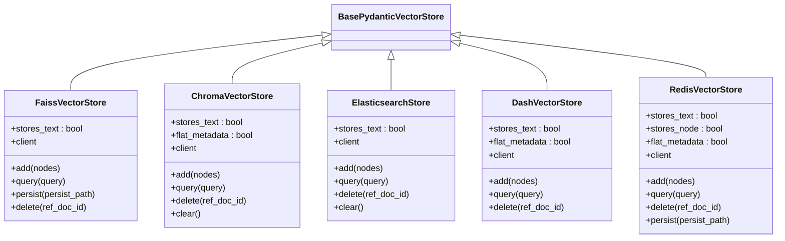
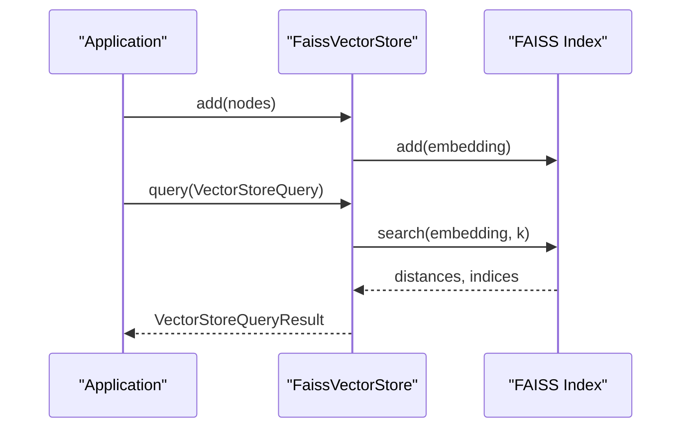
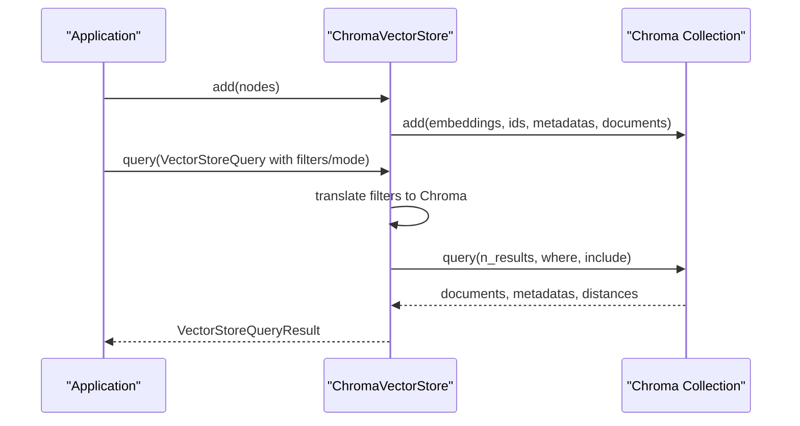
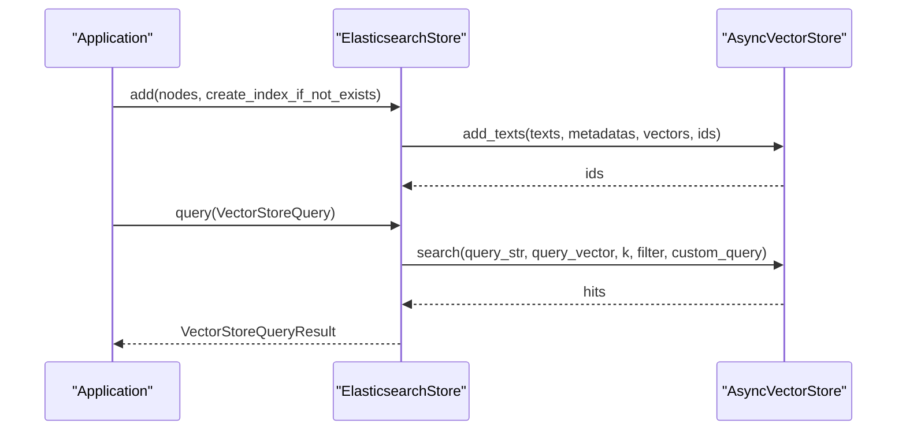
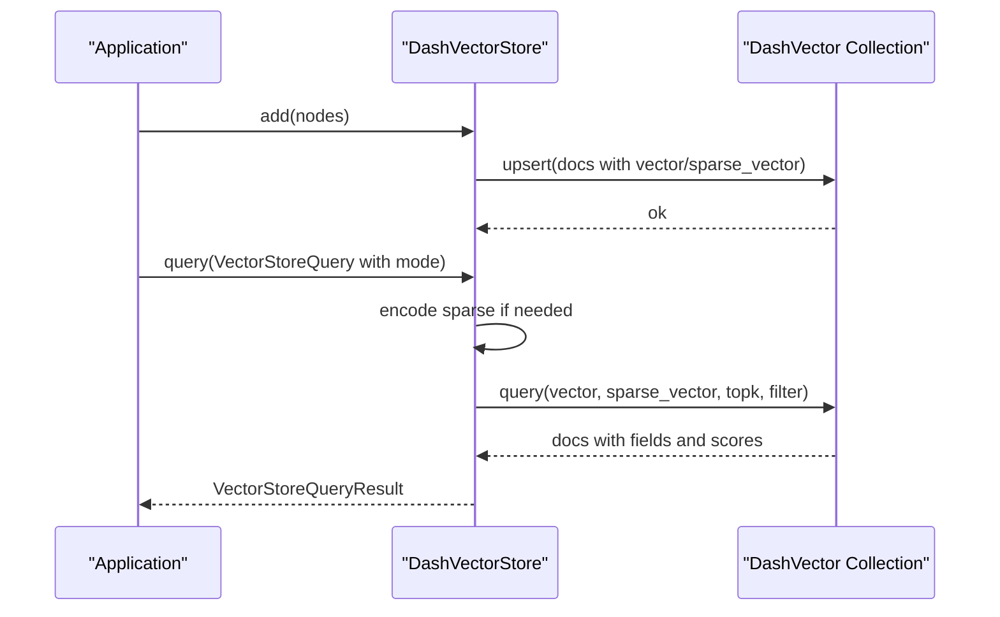
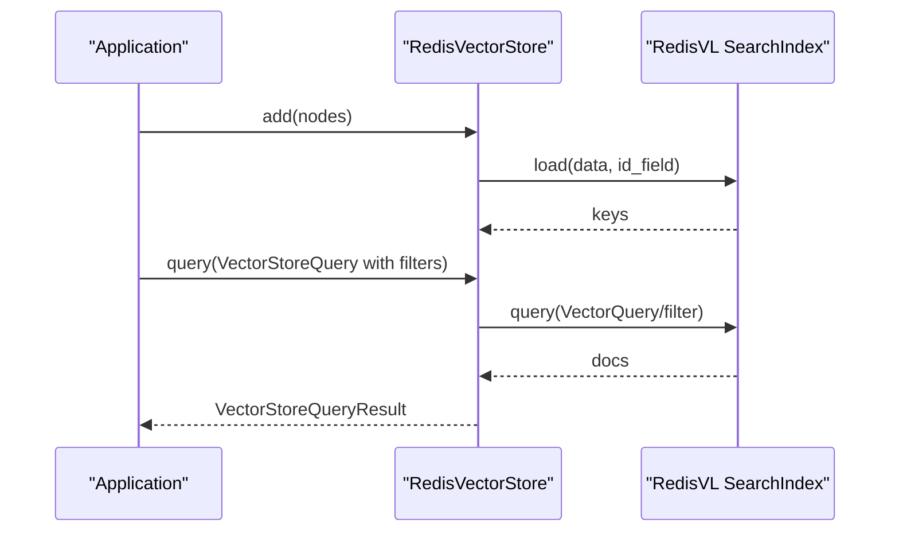
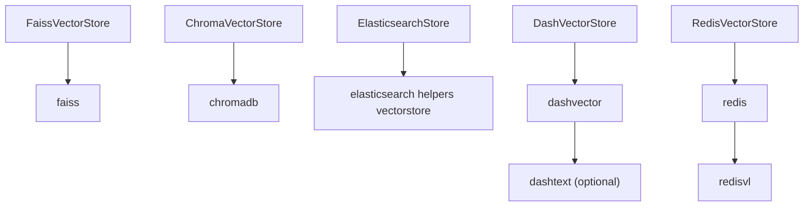

# Local Vector Stores

<cite>
**Referenced Files in This Document**
- [faiss/__init__.py](file://llama-index-integrations/vector_stores/llama-index-vector-stores-faiss/llama_index/vector_stores/faiss/__init__.py)
- [faiss/base.py](file://llama-index-integrations/vector_stores/llama-index-vector-stores-faiss/llama_index/vector_stores/faiss/base.py)
- [chroma/__init__.py](file://llama-index-integrations/vector_stores/llama-index-vector-stores-chroma/llama_index/vector_stores/chroma/__init__.py)
- [chroma/base.py](file://llama-index-integrations/vector_stores/llama-index-vector-stores-chroma/llama_index/vector_stores/chroma/base.py)
- [elasticsearch/__init__.py](file://llama-index-integrations/vector_stores/llama-index-vector-stores-elasticsearch/llama_index/vector_stores/elasticsearch/__init__.py)
- [elasticsearch/base.py](file://llama-index-integrations/vector_stores/llama-index-vector-stores-elasticsearch/llama_index/vector_stores/elasticsearch/base.py)
- [dashvector/__init__.py](file://llama-index-integrations/vector_stores/llama-index-vector-stores-dashvector/llama_index/vector_stores/dashvector/__init__.py)
- [dashvector/base.py](file://llama-index-integrations/vector_stores/llama-index-vector-stores-dashvector/llama_index/vector_stores/dashvector/base.py)
- [redis/__init__.py](file://llama-index-integrations/vector_stores/llama-index-vector-stores-redis/llama_index/vector_stores/redis/__init__.py)
- [redis/base.py](file://llama-index-integrations/vector_stores/llama-index-vector-stores-redis/llama_index/vector_stores/redis/base.py)
</cite>

## Table of Contents
1. [Introduction](#introduction)
2. [Project Structure](#project-structure)
3. [Core Components](#core-components)
4. [Architecture Overview](#architecture-overview)
5. [Detailed Component Analysis](#detailed-component-analysis)
6. [Dependency Analysis](#dependency-analysis)
7. [Performance Considerations](#performance-considerations)
8. [Troubleshooting Guide](#troubleshooting-guide)
9. [Conclusion](#conclusion)

## Introduction
This document provides detailed API documentation for local vector store implementations within the LlamaIndex ecosystem. It focuses on five local solutions:
- FAISS: CPU-friendly vector index with Flat and IVF/HNSW-style indexing via FAISS backends; covers quantization and memory optimization.
- Chroma: Local ephemeral and persistent collections with metadata filtering and MMR support.
- Elasticsearch: Dense, sparse, and hybrid retrieval strategies with mapping configuration and analyzers.
- DashVector: Managed vector store with optional sparse vector support and hybrid dense-sparse fusion.
- Redis: RedisVL-backed vector store with schema-driven indexing, metadata filters, and persistence.

The guide outlines installation requirements, configuration options, query modes, and deployment considerations for each solution.

## Project Structure
The local vector store implementations are organized under the integrations vector_stores module. Each implementation exposes a primary class and a public init file that exports the main vector store class.

**Diagram sources**
- [faiss/__init__.py](file://llama-index-integrations/vector_stores/llama-index-vector-stores-faiss/llama_index/vector_stores/faiss/__init__.py#L1-L5)
- [faiss/base.py](file://llama-index-integrations/vector_stores/llama-index-vector-stores-faiss/llama_index/vector_stores/faiss/base.py#L33-L83)
- [chroma/__init__.py](file://llama-index-integrations/vector_stores/llama-index-vector-stores-chroma/llama_index/vector_stores/chroma/__init__.py#L1-L4)
- [chroma/base.py](file://llama-index-integrations/vector_stores/llama-index-vector-stores-chroma/llama_index/vector_stores/chroma/base.py#L120-L203)
- [elasticsearch/__init__.py](file://llama-index-integrations/vector_stores/llama-index-vector-stores-elasticsearch/llama_index/vector_stores/elasticsearch/__init__.py#L1-L17)
- [elasticsearch/base.py](file://llama-index-integrations/vector_stores/llama-index-vector-stores-elasticsearch/llama_index/vector_stores/elasticsearch/base.py#L124-L207)
- [dashvector/__init__.py](file://llama-index-integrations/vector_stores/llama-index-vector-stores-dashvector/llama_index/vector_stores/dashvector/__init__.py#L1-L4)
- [dashvector/base.py](file://llama-index-integrations/vector_stores/llama-index-vector-stores-dashvector/llama_index/vector_stores/dashvector/base.py#L46-L124)
- [redis/__init__.py](file://llama-index-integrations/vector_stores/llama-index-vector-stores-redis/llama_index/vector_stores/redis/__init__.py#L1-L4)
- [redis/base.py](file://llama-index-integrations/vector_stores/llama-index-vector-stores-redis/llama_index/vector_stores/redis/base.py#L81-L152)

**Section sources**
- [faiss/__init__.py](file://llama-index-integrations/vector_stores/llama-index-vector-stores-faiss/llama_index/vector_stores/faiss/__init__.py#L1-L5)
- [chroma/__init__.py](file://llama-index-integrations/vector_stores/llama-index-vector-stores-chroma/llama_index/vector_stores/chroma/__init__.py#L1-L4)
- [elasticsearch/__init__.py](file://llama-index-integrations/vector_stores/llama-index-vector-stores-elasticsearch/llama_index/vector_stores/elasticsearch/__init__.py#L1-L17)
- [dashvector/__init__.py](file://llama-index-integrations/vector_stores/llama-index-vector-stores-dashvector/llama_index/vector_stores/dashvector/__init__.py#L1-L4)
- [redis/__init__.py](file://llama-index-integrations/vector_stores/llama-index-vector-stores-redis/llama_index/vector_stores/redis/__init__.py#L1-L4)

## Core Components
- FAISS Vector Store: Embeddings stored in a FAISS index; supports add, query, and persistence to local filesystem; no delete; no metadata filters.
- Chroma Vector Store: Embeddings and text stored in a Chroma collection; supports add, delete, get, query with MMR and metadata filters; supports ephemeral, HTTP, and persistent clients.
- Elasticsearch Vector Store: Async vector store wrapper supporting dense, sparse, BM25, and hybrid modes; configurable distance metric and retrieval strategy; metadata mappings; supports add, delete, query, get, clear.
- DashVector Vector Store: Managed collection with optional sparse vector support; supports add, delete, query with sparse/hybrid modes; metadata filters; optional encoder.
- Redis Vector Store: Schema-driven RedisVL index; supports add, delete, query with vector and filter expressions; metadata filters; async operations; persistence via Redis BGSAVE/SAVE.

**Section sources**
- [faiss/base.py](file://llama-index-integrations/vector_stores/llama-index-vector-stores-faiss/llama_index/vector_stores/faiss/base.py#L33-L223)
- [chroma/base.py](file://llama-index-integrations/vector_stores/llama-index-vector-stores-chroma/llama_index/vector_stores/chroma/base.py#L120-L709)
- [elasticsearch/base.py](file://llama-index-integrations/vector_stores/llama-index-vector-stores-elasticsearch/llama_index/vector_stores/elasticsearch/base.py#L124-L645)
- [dashvector/base.py](file://llama-index-integrations/vector_stores/llama-index-vector-stores-dashvector/llama_index/vector_stores/dashvector/base.py#L46-L245)
- [redis/base.py](file://llama-index-integrations/vector_stores/llama-index-vector-stores-redis/llama_index/vector_stores/redis/base.py#L81-L777)

## Architecture Overview
The vector stores integrate with LlamaIndex’s BasePydanticVectorStore interface. Each implementation wraps a backend client or index and translates LlamaIndex query objects into backend-specific operations.

**Diagram sources**
- [faiss/base.py](file://llama-index-integrations/vector_stores/llama-index-vector-stores-faiss/llama_index/vector_stores/faiss/base.py#L33-L83)
- [chroma/base.py](file://llama-index-integrations/vector_stores/llama-index-vector-stores-chroma/llama_index/vector_stores/chroma/base.py#L120-L203)
- [elasticsearch/base.py](file://llama-index-integrations/vector_stores/llama-index-vector-stores-elasticsearch/llama_index/vector_stores/elasticsearch/base.py#L124-L207)
- [dashvector/base.py](file://llama-index-integrations/vector_stores/llama-index-vector-stores-dashvector/llama_index/vector_stores/dashvector/base.py#L46-L124)
- [redis/base.py](file://llama-index-integrations/vector_stores/llama-index-vector-stores-redis/llama_index/vector_stores/redis/base.py#L81-L152)

## Detailed Component Analysis

### FAISS Vector Store
- Purpose: Embeddings-only index backed by FAISS; optimized for CPU environments.
- Index types and backends:
  - Flat: IndexFlat* variants (e.g., IndexFlatIP, IndexFlatL2) suitable for small to medium datasets.
  - IVF (Inverted File): IndexIVFFlat/ScalarQuantizer for larger datasets; improves scalability at cost of memory.
  - HNSW: IndexHNSW* variants for approximate nearest neighbors; good balance of speed and recall.
- Quantization:
  - Scalar quantizers (e.g., IndexScalarQuantizer) reduce memory footprint.
  - Product quantizers (IndexPQ) further compress vectors; trade accuracy for size.
- Memory optimization:
  - Use appropriate index type per dataset size.
  - Enable quantization judiciously; PQ increases compression but may reduce accuracy.
  - Keep only necessary vectors; periodically rebuild smaller indices.
- API highlights:
  - Construction: Requires a prebuilt FAISS index instance.
  - Persistence: Local filesystem only; supports loading from and writing to a path.
  - Query: Accepts VectorStoreQuery with embeddings; returns similarities and IDs.
  - Metadata filters: Not supported.
  - Delete: Not implemented.
- Installation:
  - Install FAISS package as indicated in the class docstring.

**Diagram sources**
- [faiss/base.py](file://llama-index-integrations/vector_stores/llama-index-vector-stores-faiss/llama_index/vector_stores/faiss/base.py#L119-L223)

**Section sources**
- [faiss/base.py](file://llama-index-integrations/vector_stores/llama-index-vector-stores-faiss/llama_index/vector_stores/faiss/base.py#L33-L223)

### Chroma Vector Store
- Purpose: Embeddings and text stored in a Chroma collection; supports MMR and metadata filtering.
- Setup:
  - Ephemeral client (in-memory), persistent client (local filesystem), or HTTP client (remote).
  - Collection creation/get-or-create via collection name and kwargs.
- Features:
  - Add: Batches nodes; truncates oversized batches; stores embeddings, metadata, and documents.
  - Query: Vector similarity with optional MMR; supports metadata filters via translation to Chroma-specific operators.
  - MMR: Prefetch factor/k controls; threshold parameter; fallback if embeddings unavailable.
  - Delete: By ref_doc_id or node IDs with optional filters.
  - Get nodes: By IDs or filters.
- Installation:
  - Install chromadb package as indicated in the class docstring.

**Diagram sources**
- [chroma/base.py](file://llama-index-integrations/vector_stores/llama-index-vector-stores-chroma/llama_index/vector_stores/chroma/base.py#L284-L482)

**Section sources**
- [chroma/base.py](file://llama-index-integrations/vector_stores/llama-index-vector-stores-chroma/llama_index/vector_stores/chroma/base.py#L120-L709)

### Elasticsearch Vector Store
- Purpose: Async vector store with dense, sparse, BM25, and hybrid retrieval strategies.
- Configuration:
  - Distance metrics: COSINE, DOT_PRODUCT, EUCLIDEAN_DISTANCE.
  - Retrieval strategies: AsyncDenseVectorStrategy, AsyncSparseVectorStrategy, AsyncBM25Strategy, AsyncRetrievalStrategy.
  - Metadata mappings: Built-in document_id/doc_id/ref_doc_id mappings; custom metadata mappings supported.
- Features:
  - Add: Bulk indexing; optionally auto-creates index; sets dimensionality for dense vectors.
  - Query: Mode-aware; validates strategy compatibility; supports custom query hooks and ES filters.
  - Delete: By ref_doc_id, node IDs, or combined filters.
  - Get nodes: By IDs or filters.
  - Clear: Deletes and recreates index.
- Installation:
  - Install elasticsearch async package as indicated in the class docstring.

**Diagram sources**
- [elasticsearch/base.py](file://llama-index-integrations/vector_stores/llama-index-vector-stores-elasticsearch/llama_index/vector_stores/elasticsearch/base.py#L288-L562)

**Section sources**
- [elasticsearch/base.py](file://llama-index-integrations/vector_stores/llama-index-vector-stores-elasticsearch/llama_index/vector_stores/elasticsearch/base.py#L124-L645)

### DashVector Vector Store
- Purpose: Managed collection with optional sparse vector support and hybrid dense-sparse fusion.
- Setup:
  - Initialize with a collection; optionally enable sparse vector support and provide an encoder.
- Features:
  - Add: Upserts documents with vector and optional sparse_vector; batches by default.
  - Query: Supports SPARSE, HYBRID modes; optional alpha blending for hybrid; metadata filters translated to a filter string.
  - Delete: Queries by ref_doc_id then deletes matched IDs.
- Installation:
  - Install dashvector; if sparse vectors enabled, also install dashtext.

**Diagram sources**
- [dashvector/base.py](file://llama-index-integrations/vector_stores/llama-index-vector-stores-dashvector/llama_index/vector_stores/dashvector/base.py#L125-L244)

**Section sources**
- [dashvector/base.py](file://llama-index-integrations/vector_stores/llama-index-vector-stores-dashvector/llama_index/vector_stores/dashvector/base.py#L46-L245)

### Redis Vector Store
- Purpose: Schema-driven RedisVL index storing embeddings and metadata; supports vector and filter queries.
- Setup:
  - Provide IndexSchema (required fields include id, doc_id, text, vector); optional custom fields.
  - Connect via Redis client or URL; async client is created automatically.
- Features:
  - Add: Validates embedding dimensions against schema; loads records with metadata; supports async load.
  - Query: VectorQuery with filter expressions; supports legacy filter string mode; returns nodes and optional similarities.
  - Delete: By ref_doc_id or node IDs; counts and deletes in bulk.
  - Persistence: Delegates to Redis BGSAVE/SAVE for persistence.
- Installation:
  - Install redis, redisvl; ensure Redis has RedisJSON and RediSearch modules enabled.

**Diagram sources**
- [redis/base.py](file://llama-index-integrations/vector_stores/llama-index-vector-stores-redis/llama_index/vector_stores/redis/base.py#L301-L742)

**Section sources**
- [redis/base.py](file://llama-index-integrations/vector_stores/llama-index-vector-stores-redis/llama_index/vector_stores/redis/base.py#L81-L777)

## Dependency Analysis
- FAISS: Depends on FAISS index instance; local filesystem only for persistence.
- Chroma: Depends on chromadb client; supports ephemeral, HTTP, and persistent clients.
- Elasticsearch: Depends on AsyncVectorStore and elasticsearch async client; retrieval strategy dictates supported modes.
- DashVector: Depends on dashvector; optional dashtext for sparse vectors.
- Redis: Depends on redis, redisvl, and RedisJSON/RediSearch; schema defines index structure.

**Diagram sources**
- [faiss/base.py](file://llama-index-integrations/vector_stores/llama-index-vector-stores-faiss/llama_index/vector_stores/faiss/base.py#L70-L82)
- [chroma/base.py](file://llama-index-integrations/vector_stores/llama-index-vector-stores-chroma/llama_index/vector_stores/chroma/base.py#L196-L202)
- [elasticsearch/base.py](file://llama-index-integrations/vector_stores/llama-index-vector-stores-elasticsearch/llama_index/vector_stores/elasticsearch/base.py#L265-L273)
- [dashvector/base.py](file://llama-index-integrations/vector_stores/llama-index-vector-stores-dashvector/llama_index/vector_stores/dashvector/base.py#L96-L119)
- [redis/base.py](file://llama-index-integrations/vector_stores/llama-index-vector-stores-redis/llama_index/vector_stores/redis/base.py#L17-L22)

**Section sources**
- [faiss/base.py](file://llama-index-integrations/vector_stores/llama-index-vector-stores-faiss/llama_index/vector_stores/faiss/base.py#L70-L82)
- [chroma/base.py](file://llama-index-integrations/vector_stores/llama-index-vector-stores-chroma/llama_index/vector_stores/chroma/base.py#L196-L202)
- [elasticsearch/base.py](file://llama-index-integrations/vector_stores/llama-index-vector-stores-elasticsearch/llama_index/vector_stores/elasticsearch/base.py#L265-L273)
- [dashvector/base.py](file://llama-index-integrations/vector_stores/llama-index-vector-stores-dashvector/llama_index/vector_stores/dashvector/base.py#L96-L119)
- [redis/base.py](file://llama-index-integrations/vector_stores/llama-index-vector-stores-redis/llama_index/vector_stores/redis/base.py#L17-L22)

## Performance Considerations
- FAISS
  - Choose index type based on dataset size and latency requirements.
  - Use quantization (scalar or product) to reduce memory; test accuracy impact.
  - Persist frequently and keep indices compact; avoid unnecessary rebuilds.
- Chroma
  - Use MMR to diversify results; tune prefetch factor/threshold for latency vs. quality.
  - Limit batch sizes to respect server limits; chunk large uploads.
- Elasticsearch
  - Select distance metric aligned with embedding normalization.
  - For hybrid, ensure both dense vectors and sparse/bm25 are configured consistently.
  - Tune num_candidates and k to balance recall and latency.
- DashVector
  - Adjust alpha for hybrid fusion; sparse encoder impacts query latency.
  - Filter early to reduce candidate set.
- Redis
  - Align embedding dimensions with schema; mismatch raises errors.
  - Use async operations for throughput; configure return fields to minimize payload.
  - Enable BGSAVE/SAVE for persistence; monitor memory usage.

[No sources needed since this section provides general guidance]

## Troubleshooting Guide
- FAISS
  - Missing FAISS package: ImportError raised during construction.
  - Non-local filesystem: Persistence restricted to local; exceptions raised for remote FS.
  - Delete not implemented: Calls raise NotImplementedError.
  - Filters not supported: Query rejects metadata filters.
- Chroma
  - Missing chromadb: ImportError raised during construction.
  - Invalid filter/operator: Unsupported operators or conditions raise ValueError.
  - MMR parameter validation: Threshold must be 0..1; prefetch parameters cannot conflict.
- Elasticsearch
  - Mode-strategy mismatch: Query raises ValueError if mode incompatible with retrieval strategy.
  - Missing client identifiers: Initialization requires either es_client, es_url, or es_cloud_id.
  - No results during MMR prefetch: Falls back to similarity search.
- DashVector
  - Missing packages: ImportError if dashvector or dashtext not installed when sparse enabled.
  - Upsert/query failures: Exceptions raised on non-ok responses.
- Redis
  - Missing dependencies: ImportError for redis or redisvl.
  - Embedding dimension mismatch: ValueError if embedding dims differ from schema.
  - Query timeouts/errors: RedisTimeoutError/RedisError propagated.

**Section sources**
- [faiss/base.py](file://llama-index-integrations/vector_stores/llama-index-vector-stores-faiss/llama_index/vector_stores/faiss/base.py#L70-L82)
- [chroma/base.py](file://llama-index-integrations/vector_stores/llama-index-vector-stores-chroma/llama_index/vector_stores/chroma/base.py#L498-L517)
- [elasticsearch/base.py](file://llama-index-integrations/vector_stores/llama-index-vector-stores-elasticsearch/llama_index/vector_stores/elasticsearch/base.py#L110-L118)
- [dashvector/base.py](file://llama-index-integrations/vector_stores/llama-index-vector-stores-dashvector/llama_index/vector_stores/dashvector/base.py#L96-L119)
- [redis/base.py](file://llama-index-integrations/vector_stores/llama-index-vector-stores-redis/llama_index/vector_stores/redis/base.py#L320-L329)

## Conclusion
Each local vector store offers distinct advantages:
- FAISS for CPU-centric, quantized, and scalable vector indexing.
- Chroma for simplicity and MMR with robust metadata filtering.
- Elasticsearch for advanced retrieval strategies and full-text search integration.
- DashVector for managed services with optional sparse/hybrid capabilities.
- Redis for schema-driven, high-throughput vector search with flexible filters.

Choose the implementation that best matches your deployment constraints, query patterns, and performance goals. Ensure proper installation, schema configuration, and persistence strategies for reliable operation.

[No sources needed since this section summarizes without analyzing specific files]