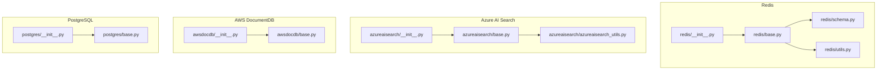
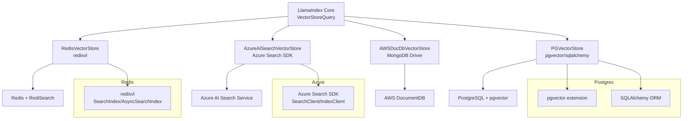
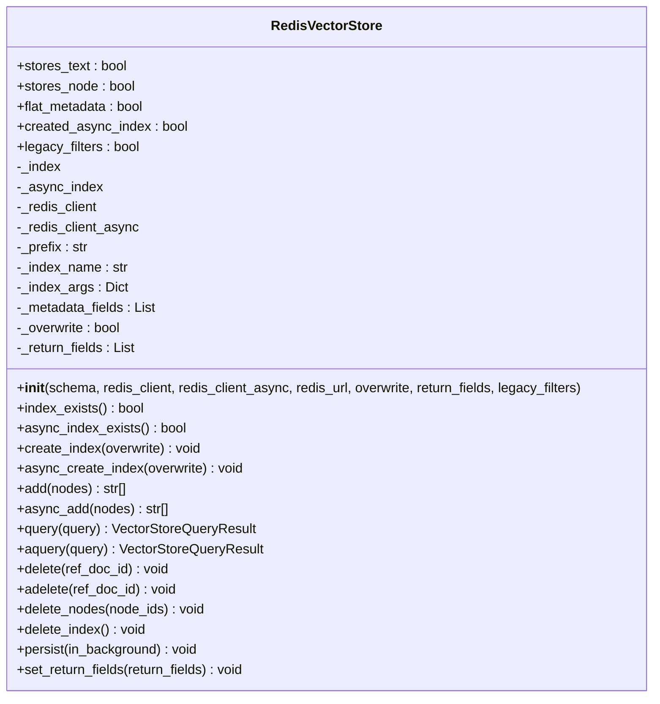
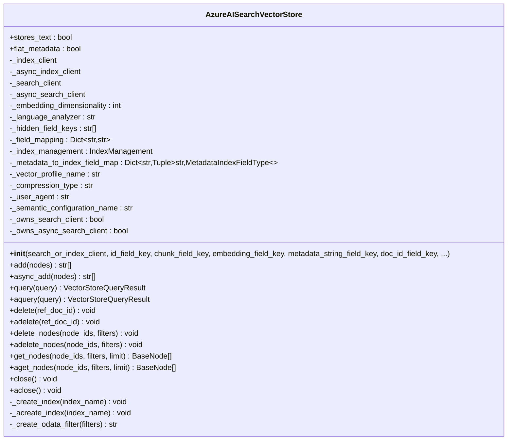
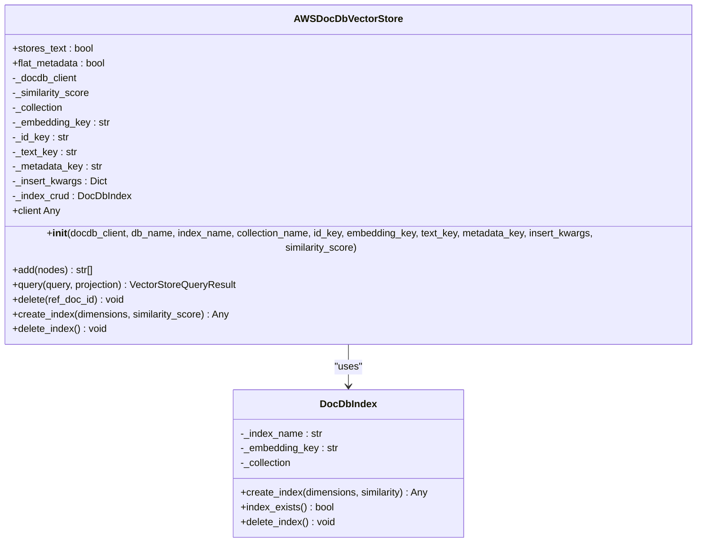
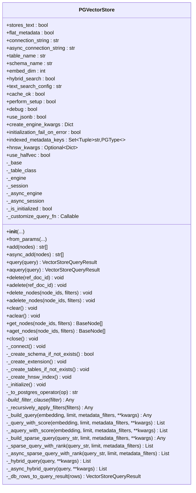
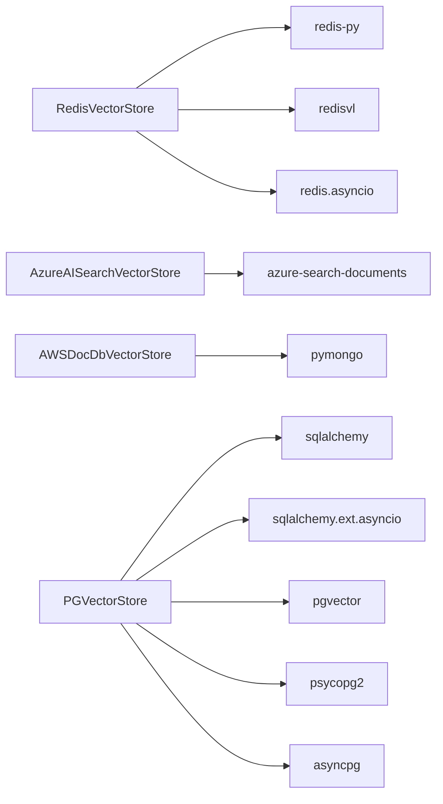

# Specialized Vector Stores

<cite>
**Referenced Files in This Document**
- [redis/__init__.py](file://llama-index-integrations/vector_stores/llama-index-vector-stores-redis/llama_index/vector_stores/redis/__init__.py)
- [redis/base.py](file://llama-index-integrations/vector_stores/llama-index-vector-stores-redis/llama_index/vector_stores/redis/base.py)
- [redis/schema.py](file://llama-index-integrations/vector_stores/llama-index-vector-stores-redis/llama_index/vector_stores/redis/schema.py)
- [redis/utils.py](file://llama-index-integrations/vector_stores/llama-index-vector-stores-redis/llama_index/vector_stores/redis/utils.py)
- [azureaisearch/__init__.py](file://llama-index-integrations/vector_stores/llama-index-vector-stores-azureaisearch/llama_index/vector_stores/azureaisearch/__init__.py)
- [azureaisearch/base.py](file://llama-index-integrations/vector_stores/llama-index-vector-stores-azureaisearch/llama_index/vector_stores/azureaisearch/base.py)
- [azureaisearch/azureaisearch_utils.py](file://llama-index-integrations/vector_stores/llama-index-vector-stores-azureaisearch/llama_index/vector_stores/azureaisearch/azureaisearch_utils.py)
- [awsdocdb/__init__.py](file://llama-index-integrations/vector_stores/llama-index-vector-stores-awsdocdb/llama_index/vector_stores/awsdocdb/__init__.py)
- [awsdocdb/base.py](file://llama-index-integrations/vector_stores/llama-index-vector-stores-awsdocdb/llama_index/vector_stores/awsdocdb/base.py)
- [postgres/__init__.py](file://llama-index-integrations/vector_stores/llama-index-vector-stores-postgres/llama_index/vector_stores/postgres/__init__.py)
- [postgres/base.py](file://llama-index-integrations/vector_stores/llama-index-vector-stores-postgres/llama_index/vector_stores/postgres/base.py)
</cite>

## Table of Contents
1. [Introduction](#introduction)
2. [Project Structure](#project-structure)
3. [Core Components](#core-components)
4. [Architecture Overview](#architecture-overview)
5. [Detailed Component Analysis](#detailed-component-analysis)
6. [Dependency Analysis](#dependency-analysis)
7. [Performance Considerations](#performance-considerations)
8. [Troubleshooting Guide](#troubleshooting-guide)
9. [Conclusion](#conclusion)

## Introduction
This document provides comprehensive API documentation for specialized vector store implementations within the LlamaIndex ecosystem. It focuses on four distinct vector databases and platforms:
- Redis vector search with RedisVL integration, radix tree indexing, memory management, and pub/sub notifications
- Azure Cognitive Search (Azure AI Search) with index management, semantic ranking, and hybrid search
- AWS DocumentDB vector search with MongoDB compatibility and aggregation pipelines
- PostgreSQL with pgvector extensions, GIN indexes, and custom operators

For each implementation, we describe the API surface, initialization parameters, query modes, metadata filtering, and operational considerations such as connection management, persistence, and migrations.

## Project Structure
The specialized vector stores are implemented as separate packages under the integrations vector_stores directory. Each package exposes a public module interface and a base implementation class that extends the core vector store abstraction.

**Diagram sources**
- [redis/__init__.py](file://llama-index-integrations/vector_stores/llama-index-vector-stores-redis/llama_index/vector_stores/redis/__init__.py#L1-L4)
- [redis/base.py](file://llama-index-integrations/vector_stores/llama-index-vector-stores-redis/llama_index/vector_stores/redis/base.py#L1-L777)
- [redis/schema.py](file://llama-index-integrations/vector_stores/llama-index-vector-stores-redis/llama_index/vector_stores/redis/schema.py)
- [redis/utils.py](file://llama-index-integrations/vector_stores/llama-index-vector-stores-redis/llama_index/vector_stores/redis/utils.py)
- [azureaisearch/__init__.py](file://llama-index-integrations/vector_stores/llama-index-vector-stores-azureaisearch/llama_index/vector_stores/azureaisearch/__init__.py#L1-L14)
- [azureaisearch/base.py](file://llama-index-integrations/vector_stores/llama-index-vector-stores-azureaisearch/llama_index/vector_stores/azureaisearch/base.py#L1-L1850)
- [azureaisearch/azureaisearch_utils.py](file://llama-index-integrations/vector_stores/llama-index-vector-stores-azureaisearch/llama_index/vector_stores/azureaisearch/azureaisearch_utils.py)
- [awsdocdb/__init__.py](file://llama-index-integrations/vector_stores/llama-index-vector-stores-awsdocdb/llama_index/vector_stores/awsdocdb/__init__.py#L1-L4)
- [awsdocdb/base.py](file://llama-index-integrations/vector_stores/llama-index-vector-stores-awsdocdb/llama_index/vector_stores/awsdocdb/base.py#L1-L327)
- [postgres/__init__.py](file://llama-index-integrations/vector_stores/llama-index-vector-stores-postgres/llama_index/vector_stores/postgres/__init__.py#L1-L4)
- [postgres/base.py](file://llama-index-integrations/vector_stores/llama-index-vector-stores-postgres/llama_index/vector_stores/postgres/base.py#L1-L1364)

**Section sources**
- [redis/__init__.py](file://llama-index-integrations/vector_stores/llama-index-vector-stores-redis/llama_index/vector_stores/redis/__init__.py#L1-L4)
- [azureaisearch/__init__.py](file://llama-index-integrations/vector_stores/llama-index-vector-stores-azureaisearch/llama_index/vector_stores/azureaisearch/__init__.py#L1-L14)
- [awsdocdb/__init__.py](file://llama-index-integrations/vector_stores/llama-index-vector-stores-awsdocdb/llama_index/vector_stores/awsdocdb/__init__.py#L1-L4)
- [postgres/__init__.py](file://llama-index-integrations/vector_stores/llama-index-vector-stores-postgres/llama_index/vector_stores/postgres/__init__.py#L1-L4)

## Core Components
Each vector store implementation follows a consistent pattern:
- Public module exports a primary class (e.g., RedisVectorStore, AzureAISearchVectorStore, AWSDocDbVectorStore, PGVectorStore)
- Initialization accepts connection parameters, schema/index configuration, and optional advanced settings
- Methods include add, query, delete, delete_nodes, get_nodes, and async variants where applicable
- Query modes support vector similarity, sparse/text search, hybrid, and semantic hybrid (Azure AI Search)

Key capabilities per implementation:
- Redis: RedisVL-backed vector index with schema-driven field configuration, metadata filtering via filter expressions, async operations, and persistence controls
- Azure AI Search: Index lifecycle management, semantic ranking, hybrid search, configurable vector algorithms and compression, robust filter translation to OData
- AWS DocumentDB: MongoDB-compatible aggregation pipelines with vector search, HNSW index creation, similarity scoring modes
- PostgreSQL: pgvector extension usage, GIN/B-tree indices, custom operators, hybrid search with sparse text ranking, async support

**Section sources**
- [redis/base.py](file://llama-index-integrations/vector_stores/llama-index-vector-stores-redis/llama_index/vector_stores/redis/base.py#L81-L777)
- [azureaisearch/base.py](file://llama-index-integrations/vector_stores/llama-index-vector-stores-azureaisearch/llama_index/vector_stores/azureaisearch/base.py#L80-L1850)
- [awsdocdb/base.py](file://llama-index-integrations/vector_stores/llama-index-vector-stores-awsdocdb/llama_index/vector_stores/awsdocdb/base.py#L113-L327)
- [postgres/base.py](file://llama-index-integrations/vector_stores/llama-index-vector-stores-postgres/llama_index/vector_stores/postgres/base.py#L229-L1364)

## Architecture Overview
The vector stores integrate with their respective databases through official SDKs or drivers. They translate LlamaIndex’s generic vector store abstractions into database-specific operations.

**Diagram sources**
- [redis/base.py](file://llama-index-integrations/vector_stores/llama-index-vector-stores-redis/llama_index/vector_stores/redis/base.py#L17-L23)
- [azureaisearch/base.py](file://llama-index-integrations/vector_stores/llama-index-vector-stores-azureaisearch/llama_index/vector_stores/azureaisearch/base.py#L10-L15)
- [postgres/base.py](file://llama-index-integrations/vector_stores/llama-index-vector-stores-postgres/llama_index/vector_stores/postgres/base.py#L17-L23)

## Detailed Component Analysis

### Redis Vector Store
RedisVectorStore integrates with Redis and RediSearch via RedisVL. It supports:
- Schema-driven index configuration with required fields and optional metadata fields
- Vector similarity queries with optional metadata filters
- Batched async loading with dimension validation
- Index existence checks, creation, and deletion
- Persistence via background save or manual save
- Token escaping for text queries

Initialization parameters include schema, Redis client(s), Redis URL, overwrite policy, return fields, and legacy filter toggles.

Key APIs:
- add(nodes): synchronous bulk load
- async_add(nodes): asynchronous bulk load
- query(query): vector similarity search with optional filters
- aquery(query): async vector similarity search
- delete(ref_doc_id), adelete(ref_doc_id): delete by document id
- delete_nodes(node_ids, filters): delete by ids or filters
- delete_index(): drop index and data
- persist(in_background): trigger BGSAVE or SAVE
- index_exists(), async_index_exists()

**Diagram sources**
- [redis/base.py](file://llama-index-integrations/vector_stores/llama-index-vector-stores-redis/llama_index/vector_stores/redis/base.py#L81-L777)

**Section sources**
- [redis/base.py](file://llama-index-integrations/vector_stores/llama-index-vector-stores-redis/llama_index/vector_stores/redis/base.py#L153-L777)
- [redis/schema.py](file://llama-index-integrations/vector_stores/llama-index-vector-stores-redis/llama_index/vector_stores/redis/schema.py)
- [redis/utils.py](file://llama-index-integrations/vector_stores/llama-index-vector-stores-redis/llama_index/vector_stores/redis/utils.py)

### Azure Cognitive Search Vector Store
AzureAISearchVectorStore provides a comprehensive vector store backed by Azure AI Search:
- Index lifecycle: validate, create if not exists, or rely on existing index
- Field mapping for id, chunk, embedding, metadata, doc_id
- Metadata fields with explicit types (string, boolean, int32/int64, double, collection)
- Vector search algorithms: HNSW or exhaustive KNN with configurable metrics and compression
- Semantic ranking with configurable semantic configurations
- Hybrid search combining vector and semantic/sparse ranking
- Robust filter translation to OData expressions
- Batched upload with size and count limits
- Async and sync operations with proper client ownership and closing

Initialization parameters include clients, index name, field keys, metadata field specs, index management policy, embedding dimensionality, vector algorithm type, language analyzer, compression type, and semantic configuration name.

Key APIs:
- add(nodes)/async_add(nodes): batch upload with size-aware batching
- query()/aquery(): supports DEFAULT, SPARSE, HYBRID, SEMANTIC_HYBRID modes
- delete()/adelete(): delete by doc_id
- delete_nodes()/adelete_nodes(): delete by node_ids or filters
- get_nodes()/aget_nodes(): retrieve nodes with pagination
- close()/aclose(): clean up owned clients
- _create_index/_acreate_index: internal index creation with vector search and semantic config

**Diagram sources**
- [azureaisearch/base.py](file://llama-index-integrations/vector_stores/llama-index-vector-stores-azureaisearch/llama_index/vector_stores/azureaisearch/base.py#L80-L1850)

**Section sources**
- [azureaisearch/base.py](file://llama-index-integrations/vector_stores/llama-index-vector-stores-azureaisearch/llama_index/vector_stores/azureaisearch/base.py#L561-L1850)
- [azureaisearch/azureaisearch_utils.py](file://llama-index-integrations/vector_stores/llama-index-vector-stores-azureaisearch/llama_index/vector_stores/azureaisearch/azureaisearch_utils.py)

### AWS DocumentDB Vector Store
AWSDocDbVectorStore leverages MongoDB-style aggregation pipelines with AWS DocumentDB’s vector search:
- HNSW index creation with configurable similarity (Euclidean, dot product, cosine)
- Aggregation pipeline for vector similarity search with optional metadata filters
- Insert many documents with provided keys for id, embedding, text, and metadata
- Delete by ref_doc_id and custom filters
- Similarity scoring computed per result
- Index CRUD helpers for creation and deletion

Initialization parameters include client, database and collection names, field keys, insert kwargs, and similarity score mode.

Key APIs:
- add(nodes): bulk insert
- query(query, projection): vector similarity with optional projection
- delete(ref_doc_id): delete by document id
- create_index(dimensions, similarity_score): create HNSW vector index
- delete_index(): drop index
- __del__(): close client

**Diagram sources**
- [awsdocdb/base.py](file://llama-index-integrations/vector_stores/llama-index-vector-stores-awsdocdb/llama_index/vector_stores/awsdocdb/base.py#L113-L327)

**Section sources**
- [awsdocdb/base.py](file://llama-index-integrations/vector_stores/llama-index-vector-stores-awsdocdb/llama_index/vector_stores/awsdocdb/base.py#L139-L327)

### PostgreSQL Vector Store (pgvector)
PGVectorStore integrates with PostgreSQL using the pgvector extension and SQLAlchemy:
- Dynamic table model creation with configurable embedding column type (full or half precision)
- GIN and B-tree indices for metadata, including array operations (?|, ?&) for text[]
- Hybrid search combining vector similarity and sparse text ranking
- Custom operators for metadata filtering (equality, comparison, containment, text match, emptiness, array operators)
- Configurable HNSW index with distance method selection and ef_search tuning
- IVFFLAT probes tuning for IVFFLAT index
- Async and sync engines with session management
- Indexed metadata keys with explicit types

Initialization parameters include connection strings, table and schema names, embedding dimensions, hybrid search flags, text search configuration, JSON vs JSONB, HNSW parameters, half-vector precision, and indexed metadata keys.

Key APIs:
- add(nodes)/async_add(nodes): insert vector rows
- query()/aquery(): supports DEFAULT, SPARSE, TEXT_SEARCH, HYBRID modes
- delete()/adelete(): delete by ref_doc_id
- delete_nodes()/adelete_nodes(): delete by node_ids or filters
- clear()/aclear(): truncate table
- get_nodes()/aget_nodes(): retrieve nodes with filters
- close(): dispose engines
- Internal helpers: _create_schema_if_not_exists, _create_extension, _create_tables_if_not_exists, _create_hnsw_index

**Diagram sources**
- [postgres/base.py](file://llama-index-integrations/vector_stores/llama-index-vector-stores-postgres/llama_index/vector_stores/postgres/base.py#L229-L1364)

**Section sources**
- [postgres/base.py](file://llama-index-integrations/vector_stores/llama-index-vector-stores-postgres/llama_index/vector_stores/postgres/base.py#L289-L1364)

## Dependency Analysis
The vector stores depend on their respective database SDKs and drivers:
- Redis: redis-py, redisvl, redis.asyncio
- Azure AI Search: azure-search-documents (sync and async clients)
- AWS DocumentDB: pymongo
- PostgreSQL: psycopg2, asyncpg, sqlalchemy, pgvector, sqlalchemy.ext.asyncio

**Diagram sources**
- [redis/base.py](file://llama-index-integrations/vector_stores/llama-index-vector-stores-redis/llama_index/vector_stores/redis/base.py#L10-L23)
- [azureaisearch/base.py](file://llama-index-integrations/vector_stores/llama-index-vector-stores-azureaisearch/llama_index/vector_stores/azureaisearch/base.py#L10-L15)
- [awsdocdb/base.py](file://llama-index-integrations/vector_stores/llama-index-vector-stores-awsdocdb/llama_index/vector_stores/awsdocdb/base.py#L27)
- [postgres/base.py](file://llama-index-integrations/vector_stores/llama-index-vector-stores-postgres/llama_index/vector_stores/postgres/base.py#L17-L23)

**Section sources**
- [redis/base.py](file://llama-index-integrations/vector_stores/llama-index-vector-stores-redis/llama_index/vector_stores/redis/base.py#L10-L23)
- [azureaisearch/base.py](file://llama-index-integrations/vector_stores/llama-index-vector-stores-azureaisearch/llama_index/vector_stores/azureaisearch/base.py#L10-L15)
- [awsdocdb/base.py](file://llama-index-integrations/vector_stores/llama-index-vector-stores-awsdocdb/llama_index/vector_stores/awsdocdb/base.py#L27)
- [postgres/base.py](file://llama-index-integrations/vector_stores/llama-index-vector-stores-postgres/llama_index/vector_stores/postgres/base.py#L17-L23)

## Performance Considerations
- Redis
  - Use async operations for concurrent loads and queries
  - Validate embedding dimensions against schema to avoid runtime errors
  - Choose appropriate vector index algorithm and metric in schema
  - Use BGSAVE sparingly; prefer SAVE for controlled persistence windows
- Azure AI Search
  - Prefer HNSW for large-scale vector search; configure ef_construction and ef_search appropriately
  - Use binary or scalar quantization for compression when acceptable
  - Leverage semantic configurations for improved relevance
  - Batch uploads to reduce overhead; monitor payload sizes
- AWS DocumentDB
  - Create HNSW indexes with suitable similarity metrics
  - Use aggregation pipelines efficiently; limit projection to required fields
- PostgreSQL
  - Use GIN indices for text[] metadata fields to enable array operators
  - Tune HNSW ef_search and distance method based on embedding type
  - For IVFFLAT, adjust probes for recall/performance trade-offs
  - Use JSONB for richer metadata; ensure proper indexing on frequently filtered keys

[No sources needed since this section provides general guidance]

## Troubleshooting Guide
- Redis
  - Ensure Redis has RediSearch and JSON modules enabled
  - Validate schema fields; missing required fields cause initialization failures
  - Dimension mismatch raises explicit errors during add
  - Use async_index_exists before async operations to ensure index presence
- Azure AI Search
  - Provide either index client with index_name or search client without index_name
  - IndexManagement controls behavior for missing indexes
  - OData filter translation errors indicate unsupported operators or unmapped metadata fields
  - Batch size and payload size limits enforced by service; monitor logs for upload thresholds
- AWS DocumentDB
  - Connection string must point to a valid DocumentDB cluster
  - Index creation commands require appropriate permissions
  - Similarity mode must match embedding normalization expectations
- PostgreSQL
  - Ensure pgvector extension is installed and available
  - HNSW parameters must be provided when enabling HNSW
  - JSON vs JSONB affects query performance and storage; choose based on workload
  - For async operations, ensure async engine/session are properly configured

**Section sources**
- [redis/base.py](file://llama-index-integrations/vector_stores/llama-index-vector-stores-redis/llama_index/vector_stores/redis/base.py#L224-L234)
- [azureaisearch/base.py](file://llama-index-integrations/vector_stores/llama-index-vector-stores-azureaisearch/llama_index/vector_stores/azureaisearch/base.py#L768-L790)
- [awsdocdb/base.py](file://llama-index-integrations/vector_stores/llama-index-vector-stores-awsdocdb/llama_index/vector_stores/awsdocdb/base.py#L171-L175)
- [postgres/base.py](file://llama-index-integrations/vector_stores/llama-index-vector-stores-postgres/llama_index/vector_stores/postgres/base.py#L551-L585)

## Conclusion
These specialized vector stores provide production-ready integrations with Redis, Azure AI Search, AWS DocumentDB, and PostgreSQL/pgvector. They expose consistent APIs while leveraging each platform’s strengths: RedisVL for fast vector retrieval, Azure AI Search for enterprise-grade semantic and hybrid search, DocumentDB for MongoDB-compatible vector search, and PostgreSQL for flexible metadata indexing and hybrid search with SQL-like operators. Proper initialization, schema/index configuration, and awareness of platform-specific constraints are essential for reliable operation and optimal performance.