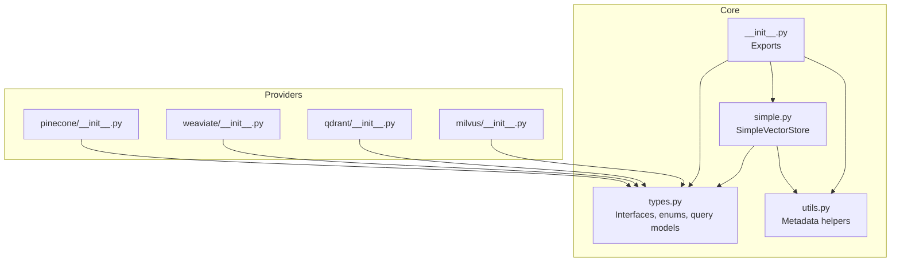
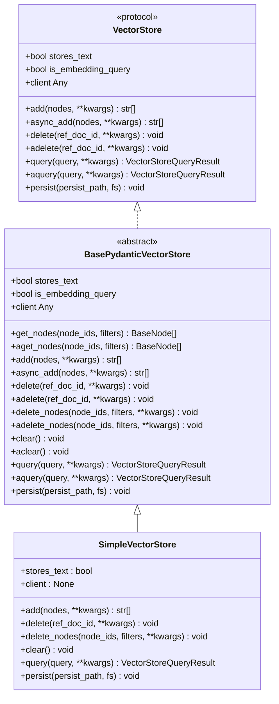
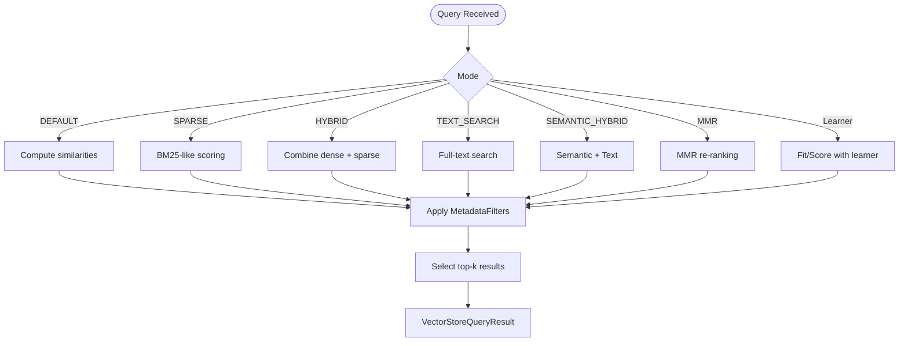
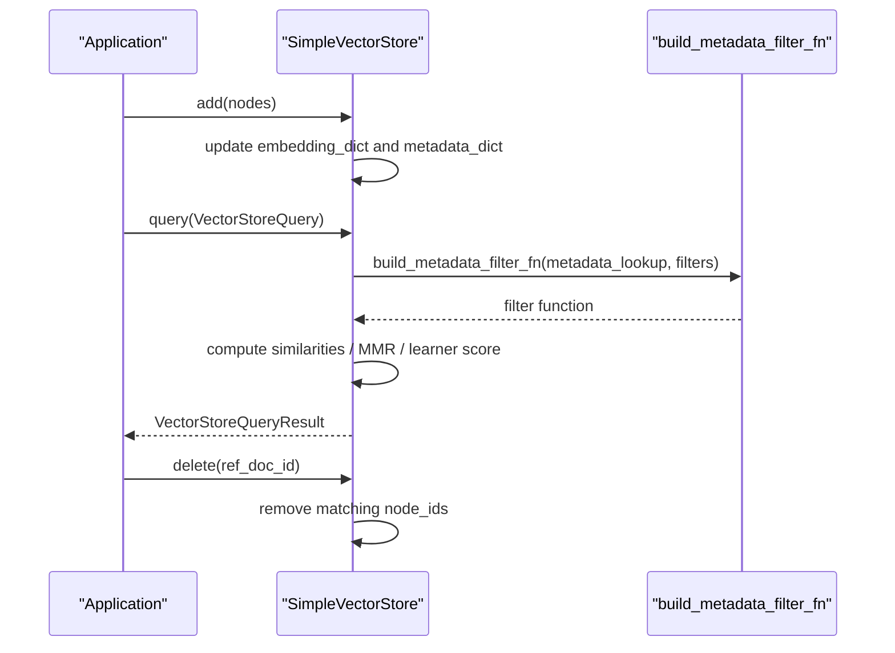
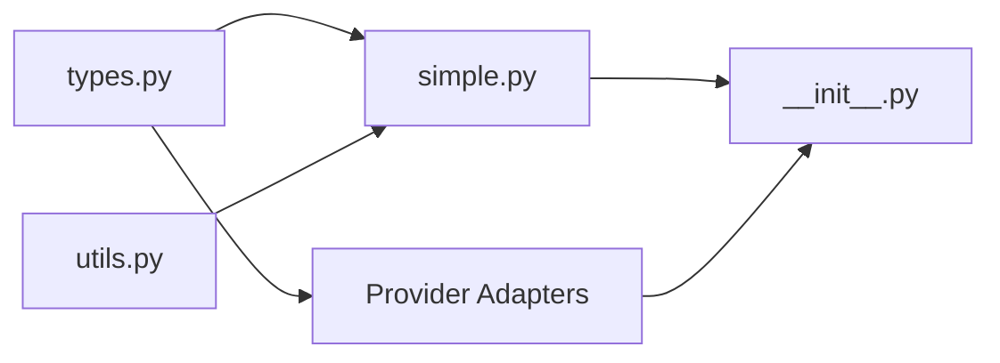

# Vector Store APIs

<cite>
**Referenced Files in This Document**
- [types.py](file://llama-index-core/llama_index/core/vector_stores/types.py)
- [simple.py](file://llama-index-core/llama_index/core/vector_stores/simple.py)
- [utils.py](file://llama-index-core/llama_index/core/vector_stores/utils.py)
- [__init__.py](file://llama-index-core/llama_index/core/vector_stores/__init__.py)
- [pinecone/__init__.py](file://llama-index-integrations/vector_stores/llama-index-vector-stores-pinecone/llama_index/vector_stores/pinecone/__init__.py)
- [weaviate/__init__.py](file://llama-index-integrations/vector_stores/llama-index-vector-stores-weaviate/llama_index/vector_stores/weaviate/__init__.py)
- [qdrant/__init__.py](file://llama-index-integrations/vector_stores/llama-index-vector-stores-qdrant/llama_index/vector_stores/qdrant/__init__.py)
- [milvus/__init__.py](file://llama-index-integrations/vector_stores/llama-index-vector-stores-milvus/llama_index/vector_stores/milvus/__init__.py)
</cite>

## Table of Contents
1. [Introduction](#introduction)
2. [Project Structure](#project-structure)
3. [Core Components](#core-components)
4. [Architecture Overview](#architecture-overview)
5. [Detailed Component Analysis](#detailed-component-analysis)
6. [Dependency Analysis](#dependency-analysis)
7. [Performance Considerations](#performance-considerations)
8. [Troubleshooting Guide](#troubleshooting-guide)
9. [Conclusion](#conclusion)
10. [Appendices](#appendices)

## Introduction
This document provides comprehensive API documentation for Vector Store integrations in the repository. It covers the unified vector store interface, provider-specific features, indexing strategies, similarity functions, and metadata filtering. It also documents authentication, connection management, and cluster configuration for cloud providers, along with vector operations (upsert, query, delete), performance considerations, hybrid search, full-text search integration, vector database optimization, scaling strategies, backup procedures, and monitoring approaches.

## Project Structure
The vector store ecosystem is composed of:
- A core unified interface and shared types
- A simple in-memory vector store implementation
- Provider-specific vector store adapters (e.g., Pinecone, Weaviate, Qdrant, Milvus)

**Diagram sources**
- [types.py](file://llama-index-core/llama_index/core/vector_stores/types.py#L268-L439)
- [simple.py](file://llama-index-core/llama_index/core/vector_stores/simple.py#L64-L355)
- [utils.py](file://llama-index-core/llama_index/core/vector_stores/utils.py#L1-L235)
- [__init__.py](file://llama-index-core/llama_index/core/vector_stores/__init__.py#L1-L28)
- [pinecone/__init__.py](file://llama-index-integrations/vector_stores/llama-index-vector-stores-pinecone/llama_index/vector_stores/pinecone/__init__.py#L1-L4)
- [weaviate/__init__.py](file://llama-index-integrations/vector_stores/llama-index-vector-stores-weaviate/llama_index/vector_stores/weaviate/__init__.py#L1-L12)
- [qdrant/__init__.py](file://llama-index-integrations/vector_stores/llama-index-vector-stores-qdrant/llama_index/vector_stores/qdrant/__init__.py#L1-L4)
- [milvus/__init__.py](file://llama-index-integrations/vector_stores/llama-index-vector-stores-milvus/llama_index/vector_stores/milvus/__init__.py#L1-L4)

**Section sources**
- [__init__.py](file://llama-index-core/llama_index/core/vector_stores/__init__.py#L1-L28)

## Core Components
- Unified Protocol and Types
  - VectorStore protocol defines the contract for add, delete, query, and persistence.
  - VectorStoreQuery encapsulates query parameters including embeddings, similarity top-k, modes (DEFAULT, SPARSE, HYBRID, TEXT_SEARCH, SEMANTIC_HYBRID, SVM, LOGISTIC_REGRESSION, LINEAR_REGRESSION, MMR), filters, and hybrid parameters.
  - MetadataFilter and MetadataFilters define advanced filtering with operators (EQ, GT, LT, NE, GTE, LTE, IN, NIN, ANY, ALL, TEXT_MATCH, TEXT_MATCH_INSENSITIVE, CONTAINS, IS_EMPTY) and conditions (AND, OR, NOT).
  - VectorStoreQueryResult carries returned nodes, similarities, and ids.
- Simple Vector Store
  - In-memory implementation storing embeddings, node-to-ref_doc_id mapping, and metadata.
  - Supports query modes including DEFAULT, MMR, and learner-based modes (SVM, LOGISTIC_REGRESSION, LINEAR_REGRESSION).
  - Provides persistence to JSON via fsspec filesystem abstraction.

Key responsibilities:
- Define the canonical API surface for vector operations
- Provide a lightweight, local-first implementation
- Offer shared utilities for metadata serialization/deserialization and filter construction

**Section sources**
- [types.py](file://llama-index-core/llama_index/core/vector_stores/types.py#L268-L439)
- [simple.py](file://llama-index-core/llama_index/core/vector_stores/simple.py#L64-L355)
- [utils.py](file://llama-index-core/llama_index/core/vector_stores/utils.py#L1-L235)

## Architecture Overview
The unified vector store interface enables pluggable providers. The core types and SimpleVectorStore demonstrate the expected behavior and query semantics. Provider adapters expose their own client initialization and configuration while conforming to the shared protocol.

**Diagram sources**
- [types.py](file://llama-index-core/llama_index/core/vector_stores/types.py#L268-L439)
- [simple.py](file://llama-index-core/llama_index/core/vector_stores/simple.py#L64-L355)

## Detailed Component Analysis

### Unified Vector Store Protocol and Query Model
- Query Modes
  - DEFAULT: cosine or dot-product similarity over dense vectors
  - SPARSE: BM25-style sparse retrieval
  - HYBRID: combination of dense and sparse scores
  - TEXT_SEARCH: full-text search capability
  - SEMANTIC_HYBRID: semantic plus text hybrid
  - MMR: maximum marginal relevance
  - Learner-based modes: SVM, LOGISTIC_REGRESSION, LINEAR_REGRESSION
- Filters and Operators
  - Numeric/text/array comparisons and containment checks
  - Full-text matching and case-insensitive variants
  - Logical conditions (AND, OR, NOT)
- Hybrid Search Controls
  - alpha for mixing dense and sparse weights
  - sparse_top_k and hybrid_top_k for provider-specific tuning

**Diagram sources**
- [types.py](file://llama-index-core/llama_index/core/vector_stores/types.py#L45-L266)

**Section sources**
- [types.py](file://llama-index-core/llama_index/core/vector_stores/types.py#L45-L266)

### Simple Vector Store Implementation
- Data model
  - Embedding dictionary keyed by node_id
  - Mapping from node_id to ref_doc_id
  - Metadata dictionary per node_id
- Operations
  - add: persists embeddings and metadata
  - delete: removes by ref_doc_id
  - delete_nodes: supports node_ids and MetadataFilters
  - query: supports DEFAULT, MMR, and learner-based modes
  - persist: writes JSON to configurable path with fsspec
- Metadata handling
  - node_to_metadata_dict serializes node content and ref_doc_id into metadata
  - build_metadata_filter_fn evaluates filters against stored metadata

**Diagram sources**
- [simple.py](file://llama-index-core/llama_index/core/vector_stores/simple.py#L174-L315)
- [utils.py](file://llama-index-core/llama_index/core/vector_stores/utils.py#L101-L175)

**Section sources**
- [simple.py](file://llama-index-core/llama_index/core/vector_stores/simple.py#L64-L355)
- [utils.py](file://llama-index-core/llama_index/core/vector_stores/utils.py#L40-L175)

### Provider-Specific Integrations
Provider adapters export their primary vector store class and may expose exceptions or additional utilities. Typical provider features include:
- Authentication and connection management
  - API keys, service endpoints, and region configuration
  - Async/sync client selection and lifecycle
- Cluster configuration
  - Replication, shards/partitions, and index settings
- Indexing strategies
  - Vector index types (IVF, HNSW, Flat), scalar indexes, and full-text indexes
- Similarity functions
  - Cosine, IP, and L2 distance depending on provider
- Metadata filtering
  - Provider-specific filter syntax mapped to MetadataFilters

Examples of exported providers:
- Pinecone: [PineconeVectorStore](file://llama-index-integrations/vector_stores/llama-index-vector-stores-pinecone/llama_index/vector_stores/pinecone/__init__.py#L1-L4)
- Weaviate: [WeaviateVectorStore](file://llama-index-integrations/vector_stores/llama-index-vector-stores-weaviate/llama_index/vector_stores/weaviate/__init__.py#L1-L12)
- Qdrant: [QdrantVectorStore](file://llama-index-integrations/vector_stores/llama-index-vector-stores-qdrant/llama_index/vector_stores/qdrant/__init__.py#L1-L4)
- Milvus: [MilvusVectorStore/IndexManagement](file://llama-index-integrations/vector_stores/llama-index-vector-stores-milvus/llama_index/vector_stores/milvus/__init__.py#L1-L4)

Note: For detailed provider-specific configuration, refer to each provider’s dedicated package documentation.

**Section sources**
- [pinecone/__init__.py](file://llama-index-integrations/vector_stores/llama-index-vector-stores-pinecone/llama_index/vector_stores/pinecone/__init__.py#L1-L4)
- [weaviate/__init__.py](file://llama-index-integrations/vector_stores/llama-index-vector-stores-weaviate/llama_index/vector_stores/weaviate/__init__.py#L1-L12)
- [qdrant/__init__.py](file://llama-index-integrations/vector_stores/llama-index-vector-stores-qdrant/llama_index/vector_stores/qdrant/__init__.py#L1-L4)
- [milvus/__init__.py](file://llama-index-integrations/vector_stores/llama-index-vector-stores-milvus/llama_index/vector_stores/milvus/__init__.py#L1-L4)

## Dependency Analysis
The core vector store module depends on shared schema and utility modules. Provider adapters depend on the core protocol and types.

**Diagram sources**
- [types.py](file://llama-index-core/llama_index/core/vector_stores/types.py#L1-L439)
- [simple.py](file://llama-index-core/llama_index/core/vector_stores/simple.py#L1-L355)
- [utils.py](file://llama-index-core/llama_index/core/vector_stores/utils.py#L1-L235)
- [__init__.py](file://llama-index-core/llama_index/core/vector_stores/__init__.py#L1-L28)

**Section sources**
- [__init__.py](file://llama-index-core/llama_index/core/vector_stores/__init__.py#L1-L28)

## Performance Considerations
- Query Modes
  - DEFAULT vs MMR: MMR adds re-ranking cost; use when diversity is desired.
  - HYBRID: tune alpha and hybrid_top_k to balance latency and recall.
  - SPARSE/TEXT_SEARCH: leverage BM25 or full-text indexes for keyword-heavy queries.
- Filtering
  - Prefer scalar indexes and appropriate metadata fields for efficient filtering.
  - Limit pre-filtered candidate sets using node_ids or doc_ids when possible.
- Persistence and Memory
  - SimpleVectorStore is in-memory; for large-scale scenarios, use provider-backed stores.
  - Persist periodically and snapshot to durable storage for disaster recovery.
- Indexing Strategies
  - Choose index types aligned with workload (IVF/HNSW for large-scale dense vectors).
  - Maintain separate full-text indexes for hybrid search.
- Batch Operations
  - Use batch upsert/delete to reduce overhead.
- Monitoring
  - Track latency, throughput, and error rates; alert on degradation.

[No sources needed since this section provides general guidance]

## Troubleshooting Guide
- Metadata Filtering on SimpleVectorStore
  - If a store was persisted without metadata, filtering is disabled; rebuild the store with metadata enabled.
- Filter Conditions
  - Unsupported nested MetadataFilters; flatten filters and use logical combinations.
- Legacy Metadata Fields
  - Backward compatibility helpers exist; migrate to current metadata schema.

**Section sources**
- [simple.py](file://llama-index-core/llama_index/core/vector_stores/simple.py#L250-L259)
- [utils.py](file://llama-index-core/llama_index/core/vector_stores/utils.py#L148-L150)

## Conclusion
The vector store subsystem offers a robust, extensible interface for dense and sparse retrieval, hybrid search, and metadata filtering. The SimpleVectorStore demonstrates core behavior and query semantics, while provider adapters integrate cloud-native capabilities. By leveraging the unified protocol, careful indexing, and operational best practices, teams can implement scalable, observable vector databases tailored to their workloads.

[No sources needed since this section summarizes without analyzing specific files]

## Appendices

### API Reference: Unified Vector Store
- VectorStore protocol methods
  - add(nodes, **kwargs) -> List[str]
  - delete(ref_doc_id, **kwargs) -> None
  - query(query, **kwargs) -> VectorStoreQueryResult
  - persist(persist_path, fs) -> None
- VectorStoreQuery fields
  - query_embedding: Optional[List[float]]
  - similarity_top_k: int
  - doc_ids: Optional[List[str]]
  - node_ids: Optional[List[str]]
  - query_str: Optional[str]
  - output_fields: Optional[List[str]]
  - embedding_field: Optional[str]
  - mode: VectorStoreQueryMode
  - alpha: Optional[float]
  - filters: Optional[MetadataFilters]
  - mmr_threshold: Optional[float]
  - sparse_top_k: Optional[int]
  - hybrid_top_k: Optional[int]
- VectorStoreQueryResult fields
  - nodes: Optional[List[BaseNode]]
  - similarities: Optional[List[float]]
  - ids: Optional[List[str]]

**Section sources**
- [types.py](file://llama-index-core/llama_index/core/vector_stores/types.py#L268-L439)

### Example Workflows

#### Upsert Nodes
- Prepare nodes with embeddings
- Call add(nodes) on the chosen vector store
- For SimpleVectorStore, embeddings are stored in-memory; for providers, use provider client configuration

**Section sources**
- [simple.py](file://llama-index-core/llama_index/core/vector_stores/simple.py#L174-L189)

#### Query with Filters
- Build MetadataFilters with desired operators and conditions
- Set VectorStoreQuery.mode to DEFAULT or HYBRID
- Call query(VectorStoreQuery) and inspect VectorStoreQueryResult

**Section sources**
- [types.py](file://llama-index-core/llama_index/core/vector_stores/types.py#L240-L266)
- [utils.py](file://llama-index-core/llama_index/core/vector_stores/utils.py#L101-L175)

#### Hybrid Search
- Set VectorStoreQuery.mode to HYBRID or SEMANTIC_HYBRID
- Adjust alpha to blend dense and sparse signals
- Optionally set hybrid_top_k and sparse_top_k

**Section sources**
- [types.py](file://llama-index-core/llama_index/core/vector_stores/types.py#L45-L61)
- [types.py](file://llama-index-core/llama_index/core/vector_stores/types.py#L253-L265)

#### Full-Text Search Integration
- Use TEXT_SEARCH mode for full-text retrieval
- Combine with dense vectors in SEMANTIC_HYBRID for richer results

**Section sources**
- [types.py](file://llama-index-core/llama_index/core/vector_stores/types.py#L45-L52)

#### Scaling Strategies
- Use provider-backed stores (e.g., Pinecone, Weaviate, Qdrant, Milvus)
- Configure sharding/partitioning and replicas
- Tune index types and refresh intervals

[No sources needed since this section provides general guidance]

#### Backup Procedures
- Persist SimpleVectorStore to JSON via persist()
- For providers, rely on provider-native backups and snapshots
- Version metadata and schema changes

**Section sources**
- [simple.py](file://llama-index-core/llama_index/core/vector_stores/simple.py#L317-L329)

#### Monitoring Approaches
- Instrument add/query/delete operations
- Track latency percentiles, error rates, and resource utilization
- Alert on anomalies and degraded performance

[No sources needed since this section provides general guidance]