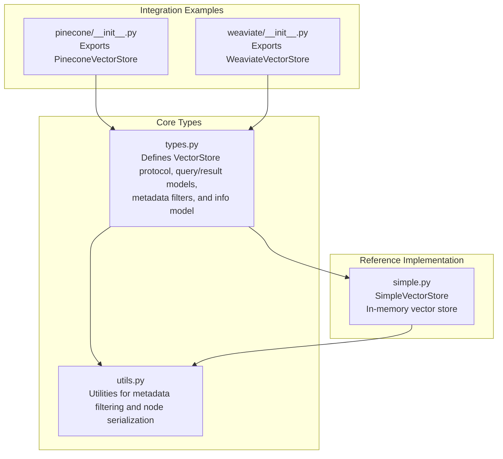
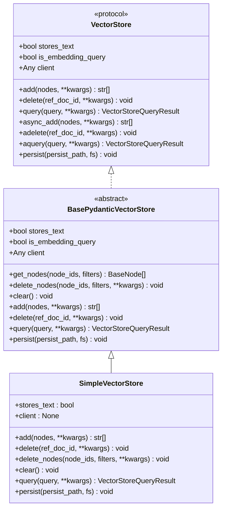
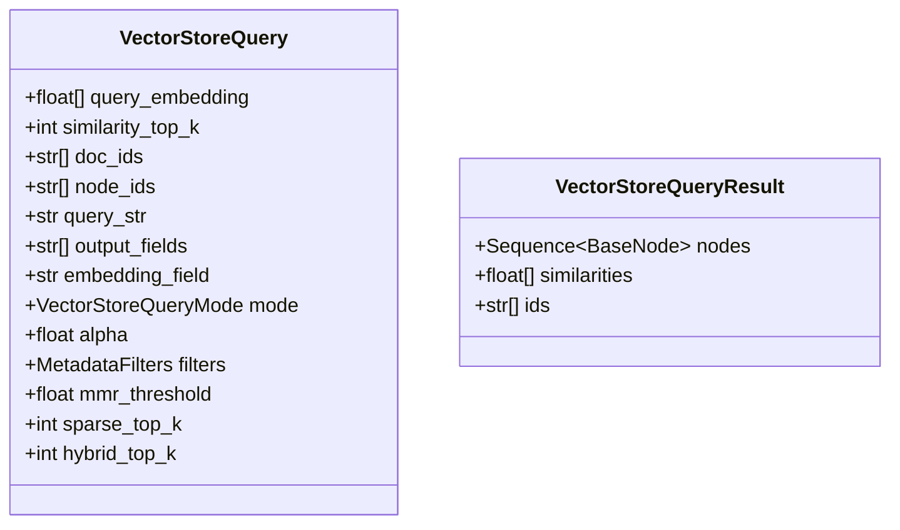
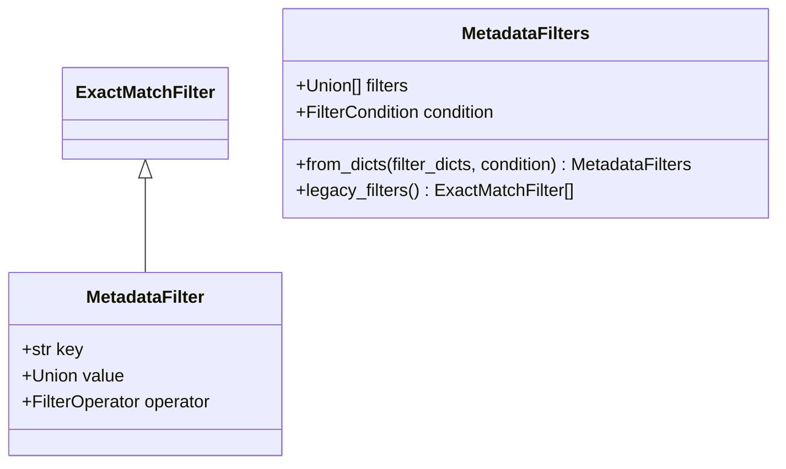
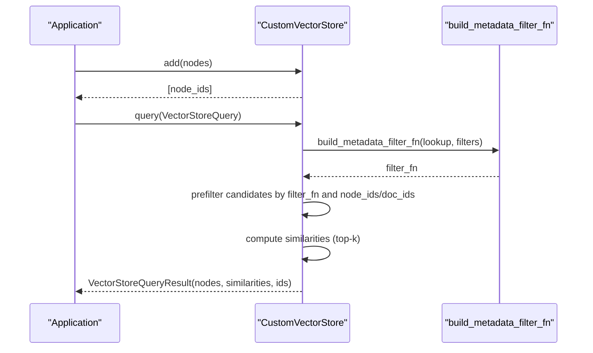
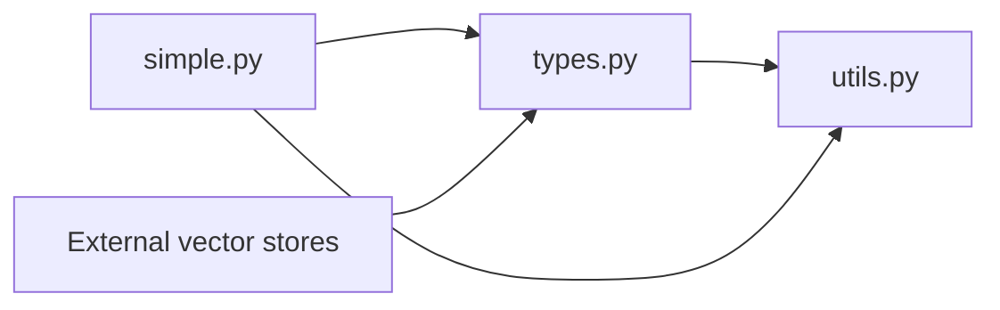

# Vector Store Interface

<cite>
**Referenced Files in This Document**
- [types.py](file://llama-index-core/llama_index/core/vector_stores/types.py)
- [simple.py](file://llama-index-core/llama_index/core/vector_stores/simple.py)
- [utils.py](file://llama-index-core/llama_index/core/vector_stores/utils.py)
- [vector_store.ipynb](file://docs/examples/low_level/vector_store.ipynb)
- [__init__.py](file://llama-index-integrations/vector_stores/llama-index-vector-stores-pinecone/llama_index/vector_stores/pinecone/__init__.py)
- [__init__.py](file://llama-index-integrations/vector_stores/llama-index-vector-stores-weaviate/llama_index/vector_stores/weaviate/__init__.py)
</cite>

## Table of Contents
1. [Introduction](#introduction)
2. [Project Structure](#project-structure)
3. [Core Components](#core-components)
4. [Architecture Overview](#architecture-overview)
5. [Detailed Component Analysis](#detailed-component-analysis)
6. [Dependency Analysis](#dependency-analysis)
7. [Performance Considerations](#performance-considerations)
8. [Troubleshooting Guide](#troubleshooting-guide)
9. [Conclusion](#conclusion)
10. [Appendices](#appendices)

## Introduction
This document provides comprehensive API documentation for the core Vector Store interface used across LlamaIndex. It covers the unified interface for vector operations (add, query, delete), the query model (VectorStoreQuery and VectorStoreQueryResult), metadata filtering capabilities (MetadataFilter, ExactMatchFilter, and MetadataFilters), and the configuration model (VectorStoreInfo). It also includes practical guidance for implementing custom vector stores and extending the interface, along with performance considerations and best practices.

## Project Structure
The vector store interface is defined in the core module and backed by a simple in-memory implementation. Integration examples demonstrate how external vector stores (e.g., Pinecone, Weaviate) expose compatible implementations.

**Diagram sources**
- [types.py](file://llama-index-core/llama_index/core/vector_stores/types.py#L268-L439)
- [utils.py](file://llama-index-core/llama_index/core/vector_stores/utils.py#L101-L176)
- [simple.py](file://llama-index-core/llama_index/core/vector_stores/simple.py#L64-L355)
- [__init__.py](file://llama-index-integrations/vector_stores/llama-index-vector-stores-pinecone/llama_index/vector_stores/pinecone/__init__.py#L1-L4)
- [__init__.py](file://llama-index-integrations/vector_stores/llama-index-vector-stores-weaviate/llama_index/vector_stores/weaviate/__init__.py#L1-L12)

**Section sources**
- [types.py](file://llama-index-core/llama_index/core/vector_stores/types.py#L1-L439)
- [simple.py](file://llama-index-core/llama_index/core/vector_stores/simple.py#L1-L355)
- [utils.py](file://llama-index-core/llama_index/core/vector_stores/utils.py#L1-L235)
- [__init__.py](file://llama-index-integrations/vector_stores/llama-index-vector-stores-pinecone/llama_index/vector_stores/pinecone/__init__.py#L1-L4)
- [__init__.py](file://llama-index-integrations/vector_stores/llama-index-vector-stores-weaviate/llama_index/vector_stores/weaviate/__init__.py#L1-L12)

## Core Components
This section documents the primary classes and protocols that define the unified vector store interface.

- VectorStore protocol
  - Purpose: Defines the contract for vector store implementations.
  - Key methods:
    - add(nodes, **kwargs) -> List[str]
    - delete(ref_doc_id, **kwargs) -> None
    - query(query, **kwargs) -> VectorStoreQueryResult
    - async variants: async_add, adelete, aquery
    - persist(persist_path, fs=None) -> None
  - Properties:
    - stores_text: bool
    - is_embedding_query: bool
    - client: Any

- BasePydanticVectorStore
  - Purpose: A Pydantic-backed base class that extends the protocol with convenience methods and optional node retrieval/deletion.
  - Additional methods:
    - get_nodes(node_ids, filters) -> List[BaseNode]
    - delete_nodes(node_ids, filters, **kwargs) -> None
    - clear() -> None
    - persist(persist_path, fs=None) -> None

- VectorStoreQuery
  - Purpose: Encapsulates a query request.
  - Fields:
    - query_embedding: Optional[List[float]]
    - similarity_top_k: int
    - doc_ids: Optional[List[str]]
    - node_ids: Optional[List[str]]
    - query_str: Optional[str]
    - output_fields: Optional[List[str]]
    - embedding_field: Optional[str]
    - mode: VectorStoreQueryMode
    - alpha: Optional[float]
    - filters: Optional[MetadataFilters]
    - mmr_threshold: Optional[float]
    - sparse_top_k: Optional[int]
    - hybrid_top_k: Optional[int]

- VectorStoreQueryResult
  - Purpose: Encapsulates a query response.
  - Fields:
    - nodes: Optional[Sequence[BaseNode]]
    - similarities: Optional[List[float]]
    - ids: Optional[List[str]]

- VectorStoreQueryMode
  - Values include DEFAULT, SPARSE, HYBRID, TEXT_SEARCH, SEMANTIC_HYBRID, SVM, LOGISTIC_REGRESSION, LINEAR_REGRESSION, MMR.

- MetadataFilter
  - Purpose: Represents a single metadata filter with key, value, and operator.
  - Fields:
    - key: str
    - value: Union of Strict types (int, float, str, or lists)
    - operator: FilterOperator

- ExactMatchFilter
  - Alias: MetadataFilter (for backward compatibility).

- MetadataFilters
  - Purpose: Composes multiple filters with logical conditions.
  - Fields:
    - filters: List[Union[MetadataFilter, ExactMatchFilter, "MetadataFilters"]]
    - condition: Optional[FilterCondition] (AND, OR, NOT)

- FilterOperator
  - Operators include EQ, GT, LT, NE, GTE, LTE, IN, NIN, ANY, ALL, TEXT_MATCH, TEXT_MATCH_INSENSITIVE, CONTAINS, IS_EMPTY.

- FilterCondition
  - Conditions include AND, OR, NOT.

- VectorStoreInfo
  - Purpose: Describes a vector store’s supported metadata filters and content information.
  - Fields:
    - metadata_info: List[MetadataInfo]
    - content_info: str

- MetadataInfo
  - Fields:
    - name: str
    - type: str
    - description: str

**Section sources**
- [types.py](file://llama-index-core/llama_index/core/vector_stores/types.py#L268-L439)
- [types.py](file://llama-index-core/llama_index/core/vector_stores/types.py#L36-L43)
- [types.py](file://llama-index-core/llama_index/core/vector_stores/types.py#L240-L266)
- [types.py](file://llama-index-core/llama_index/core/vector_stores/types.py#L94-L140)
- [types.py](file://llama-index-core/llama_index/core/vector_stores/types.py#L142-L201)
- [types.py](file://llama-index-core/llama_index/core/vector_stores/types.py#L228-L237)
- [types.py](file://llama-index-core/llama_index/core/vector_stores/types.py#L216-L226)

## Architecture Overview
The vector store interface is designed around a protocol and a base Pydantic implementation. Implementations can choose to implement the protocol directly or extend the base class. A simple in-memory implementation demonstrates the core operations and metadata filtering logic. Integrations (e.g., Pinecone, Weaviate) export compatible vector store classes.

**Diagram sources**
- [types.py](file://llama-index-core/llama_index/core/vector_stores/types.py#L268-L439)
- [simple.py](file://llama-index-core/llama_index/core/vector_stores/simple.py#L64-L355)

## Detailed Component Analysis

### Unified Interface: add, query, delete
- add(nodes, **kwargs) -> List[str]
  - Purpose: Insert nodes with embeddings into the vector store.
  - Notes: Returns a list of node IDs that were added.
- delete(ref_doc_id, **kwargs) -> None
  - Purpose: Remove all nodes associated with a given reference document ID.
- query(query, **kwargs) -> VectorStoreQueryResult
  - Purpose: Execute a vector search with optional metadata filtering and modes.
- async variants
  - async_add, adelete, aquery are provided for convenience; some implementations may fall back to synchronous behavior.

Implementation example in SimpleVectorStore:
- add: stores embeddings and metadata keyed by node_id.
- delete: removes entries by ref_doc_id.
- query: supports DEFAULT, MMR, and learner modes via utility functions.

**Section sources**
- [types.py](file://llama-index-core/llama_index/core/vector_stores/types.py#L280-L325)
- [simple.py](file://llama-index-core/llama_index/core/vector_stores/simple.py#L174-L212)
- [simple.py](file://llama-index-core/llama_index/core/vector_stores/simple.py#L244-L315)

### VectorStoreQuery and VectorStoreQueryResult
- VectorStoreQuery
  - Controls similarity search behavior, filters, and hybrid modes.
  - Supports node-level restrictions via node_ids and doc-level via doc_ids.
  - Includes fields for sparse/hybrid search and MMR threshold.
- VectorStoreQueryResult
  - Returns matched nodes, similarity scores, and node IDs.

**Diagram sources**
- [types.py](file://llama-index-core/llama_index/core/vector_stores/types.py#L240-L266)
- [types.py](file://llama-index-core/llama_index/core/vector_stores/types.py#L36-L43)

**Section sources**
- [types.py](file://llama-index-core/llama_index/core/vector_stores/types.py#L240-L266)
- [types.py](file://llama-index-core/llama_index/core/vector_stores/types.py#L36-L43)

### Metadata Filtering: MetadataFilter, ExactMatchFilter, MetadataFilters
- MetadataFilter
  - Single filter with key, value, and operator.
- ExactMatchFilter
  - Alias to MetadataFilter for backward compatibility.
- MetadataFilters
  - Compose multiple filters with AND/OR/NOT conditions.
  - Provides helpers to convert from dictionaries and legacy formats.

**Diagram sources**
- [types.py](file://llama-index-core/llama_index/core/vector_stores/types.py#L94-L140)
- [types.py](file://llama-index-core/llama_index/core/vector_stores/types.py#L142-L201)

**Section sources**
- [types.py](file://llama-index-core/llama_index/core/vector_stores/types.py#L94-L140)
- [types.py](file://llama-index-core/llama_index/core/vector_stores/types.py#L142-L201)

### VectorStoreInfo and MetadataInfo
- VectorStoreInfo
  - Describes supported metadata filters and content information.
- MetadataInfo
  - Describes a single metadata filter’s name, type, and description.

These models are primarily used by auto-retriever components to introspect vector store capabilities.

**Section sources**
- [types.py](file://llama-index-core/llama_index/core/vector_stores/types.py#L216-L237)

### Implementing a Custom Vector Store
The low-level notebook demonstrates how to build a minimal vector store by subclassing the base Pydantic vector store and implementing the required methods. It shows:
- Defining the interface with get, add, delete, query, and persist.
- Performing semantic search by computing similarities.
- Adding metadata filtering by pre-filtering candidate sets.

Key steps:
- Subclass BasePydanticVectorStore or implement the VectorStore protocol.
- Implement add, delete, query, and optionally get_nodes, delete_nodes, clear.
- Use MetadataFilters and FilterOperator to support rich filtering.

**Diagram sources**
- [utils.py](file://llama-index-core/llama_index/core/vector_stores/utils.py#L101-L176)
- [simple.py](file://llama-index-core/llama_index/core/vector_stores/simple.py#L244-L315)
- [vector_store.ipynb](file://docs/examples/low_level/vector_store.ipynb#L169-L224)

**Section sources**
- [vector_store.ipynb](file://docs/examples/low_level/vector_store.ipynb#L169-L224)
- [utils.py](file://llama-index-core/llama_index/core/vector_stores/utils.py#L101-L176)

### Example Integrations
External vector stores expose compatible implementations through their packages:
- PineconeVectorStore
- WeaviateVectorStore

These integrations export their vector store classes and can be used interchangeably with the core protocol.

**Section sources**
- [__init__.py](file://llama-index-integrations/vector_stores/llama-index-vector-stores-pinecone/llama_index/vector_stores/pinecone/__init__.py#L1-L4)
- [__init__.py](file://llama-index-integrations/vector_stores/llama-index-vector-stores-weaviate/llama_index/vector_stores/weaviate/__init__.py#L1-L12)

## Dependency Analysis
The core vector store types depend on shared schema and utility modules. SimpleVectorStore depends on embedding utilities and metadata filter builders.

**Diagram sources**
- [types.py](file://llama-index-core/llama_index/core/vector_stores/types.py#L1-L439)
- [utils.py](file://llama-index-core/llama_index/core/vector_stores/utils.py#L1-L235)
- [simple.py](file://llama-index-core/llama_index/core/vector_stores/simple.py#L1-L355)

**Section sources**
- [types.py](file://llama-index-core/llama_index/core/vector_stores/types.py#L1-L439)
- [utils.py](file://llama-index-core/llama_index/core/vector_stores/utils.py#L1-L235)
- [simple.py](file://llama-index-core/llama_index/core/vector_stores/simple.py#L1-L355)

## Performance Considerations
- Prefer prefiltering with metadata filters to reduce the candidate set before similarity computation.
- Use appropriate VectorStoreQueryMode (DEFAULT, MMR, or learner modes) based on retrieval goals.
- For large-scale deployments, leverage external vector stores optimized for approximate nearest neighbor search.
- Persist and load vector stores efficiently using the provided persist mechanisms to avoid recomputation.

[No sources needed since this section provides general guidance]

## Troubleshooting Guide
- Metadata filtering errors
  - Symptom: Attempting to filter stores persisted without metadata raises an error.
  - Resolution: Rebuild the store with metadata enabled or avoid filtering on legacy stores.
- Unsupported nested filters
  - Symptom: Nested MetadataFilters cause errors in filter builder.
  - Resolution: Flatten filters or use supported operators and conditions.
- Legacy exact-match constraints
  - Symptom: Converting to legacy filters fails if operators differ from EQ.
  - Resolution: Use ExactMatchFilter or FilterOperator.EQ for legacy compatibility.

**Section sources**
- [simple.py](file://llama-index-core/llama_index/core/vector_stores/simple.py#L250-L259)
- [utils.py](file://llama-index-core/llama_index/core/vector_stores/utils.py#L148-L150)
- [types.py](file://llama-index-core/llama_index/core/vector_stores/types.py#L187-L200)

## Conclusion
The vector store interface provides a unified, extensible contract for storing and retrieving embeddings with rich metadata filtering. By adhering to the protocol or extending the base Pydantic implementation, developers can implement custom stores or integrate external solutions seamlessly. Proper use of query modes, metadata filters, and persistence strategies ensures efficient and scalable retrieval.

[No sources needed since this section summarizes without analyzing specific files]

## Appendices

### API Reference Summary
- VectorStore protocol
  - Methods: add, delete, query, async_add, adelete, aquery, persist
  - Properties: stores_text, is_embedding_query, client
- BasePydanticVectorStore
  - Methods: add, delete, query, get_nodes, delete_nodes, clear, persist
- VectorStoreQuery
  - Fields: query_embedding, similarity_top_k, doc_ids, node_ids, query_str, output_fields, embedding_field, mode, alpha, filters, mmr_threshold, sparse_top_k, hybrid_top_k
- VectorStoreQueryResult
  - Fields: nodes, similarities, ids
- MetadataFilter, ExactMatchFilter, MetadataFilters
  - Operators and conditions for flexible filtering
- VectorStoreInfo, MetadataInfo
  - Descriptive metadata for store capabilities

**Section sources**
- [types.py](file://llama-index-core/llama_index/core/vector_stores/types.py#L268-L439)
- [types.py](file://llama-index-core/llama_index/core/vector_stores/types.py#L240-L266)
- [types.py](file://llama-index-core/llama_index/core/vector_stores/types.py#L94-L140)
- [types.py](file://llama-index-core/llama_index/core/vector_stores/types.py#L216-L237)