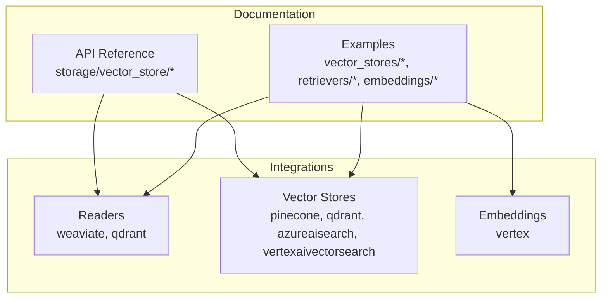
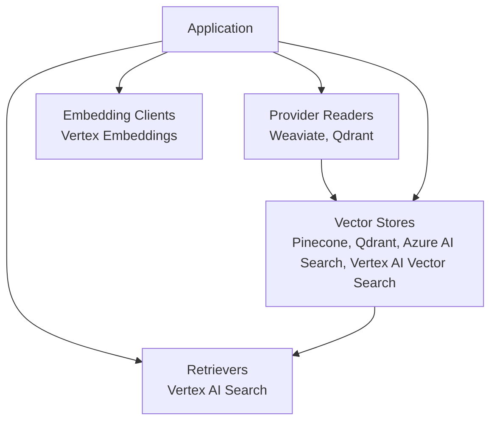
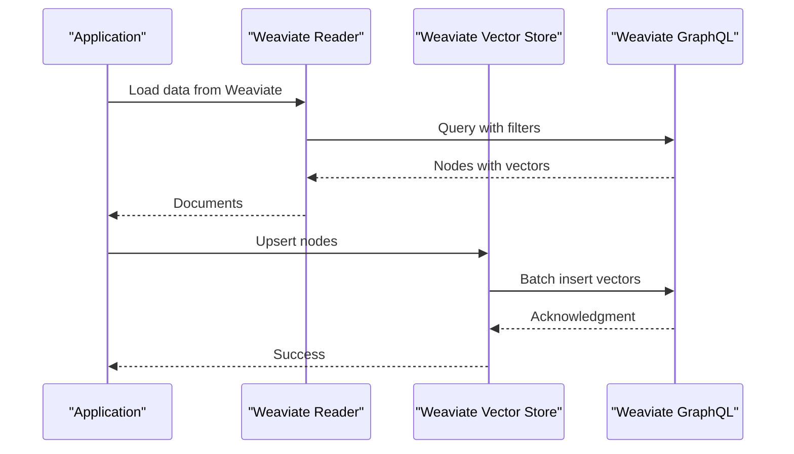
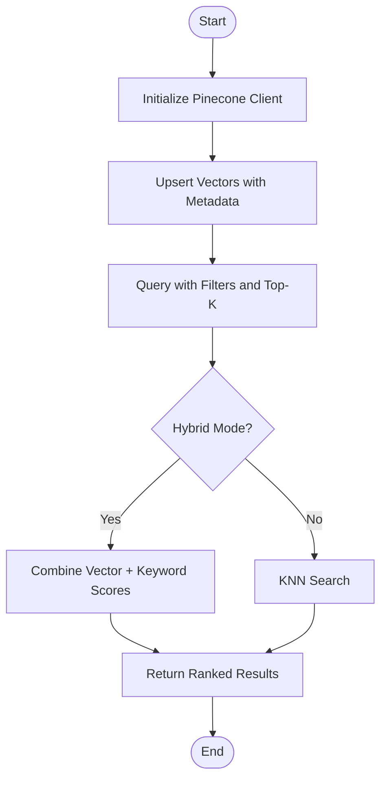
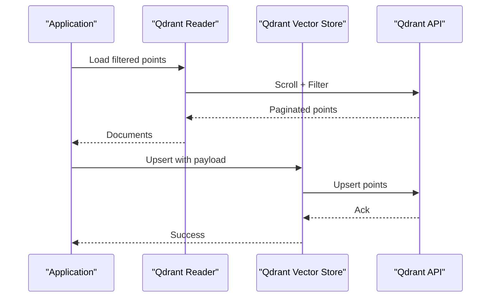
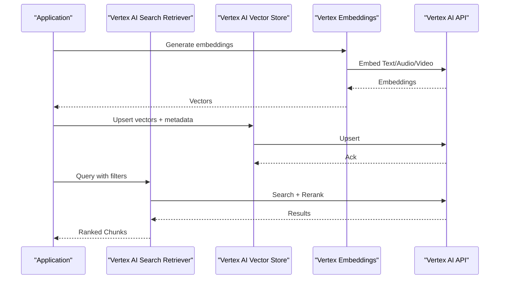
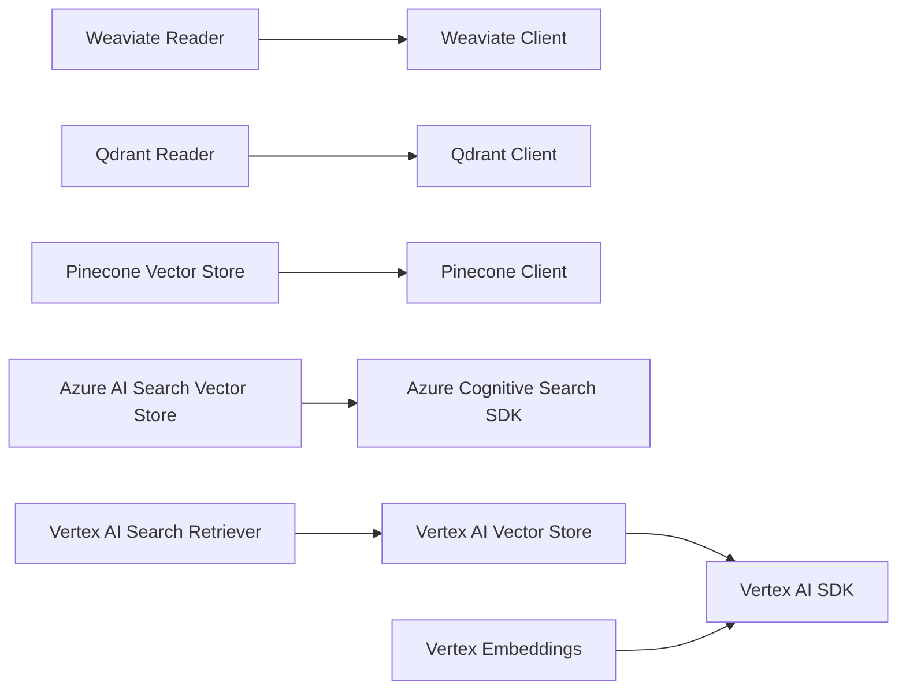

# Cloud Vector Databases

<cite>
**Referenced Files in This Document**
- [weaviate.md](file://docs/api_reference/api_reference/storage/vector_store/weaviate.md)
- [pinecone.md](file://docs/api_reference/api_reference/storage/vector_store/pinecone.md)
- [qdrant.md](file://docs/api_reference/api_reference/storage/vector_store/qdrant.md)
- [azureaisearch.md](file://docs/api_reference/api_reference/storage/vector_store/azureaisearch.md)
- [vertexaivectorsearch.md](file://docs/api_reference/api_reference/storage/vector_store/vertexaivectorsearch.md)
- [weaviate.py](file://llama-index-integrations/readers/llama-index-readers-weaviate/llama_index/readers/weaviate/base.py)
- [qdrant.py](file://llama-index-integrations/readers/llama-index-readers-qdrant/llama_index/readers/qdrant/base.py)
- [vertex_embeddings.py](file://llama-index-integrations/embeddings/llama-index-embeddings-vertex/llama_index/embeddings/vertex/base.py)
- [vertexai_search.md](file://docs/api_reference/api_reference/retrievers/vertexai_search.md)
- [azureaisearch.md](file://docs/api_reference/api_reference/storage/vector_store/azureaisearch.md)
- [pinecone_existing_data.ipynb](file://docs/examples/vector_stores/pinecone_existing_data.ipynb)
- [pinecone_metadata_filter.ipynb](file://docs/examples/vector_stores/pinecone_metadata_filter.ipynb)
- [qdrant_hybrid.ipynb](file://docs/examples/vector_stores/qdrant_hybrid.ipynb)
- [qdrant_using_qdrant_filters.ipynb](file://docs/examples/vector_stores/Qdrant_using_qdrant_filters.ipynb)
- [weaviate_existing_data.ipynb](file://docs/examples/vector_stores/existing_data/weaviate_existing_data.ipynb)
- [vertex_ai_search_retriever.ipynb](file://docs/examples/retrievers/vertex_ai_search_retriever.ipynb)
- [vertex_embedding_endpoint.ipynb](file://docs/examples/embeddings/vertex_embedding_endpoint.ipynb)
</cite>

## Table of Contents
1. [Introduction](#introduction)
2. [Project Structure](#project-structure)
3. [Core Components](#core-components)
4. [Architecture Overview](#architecture-overview)
5. [Detailed Component Analysis](#detailed-component-analysis)
6. [Dependency Analysis](#dependency-analysis)
7. [Performance Considerations](#performance-considerations)
8. [Troubleshooting Guide](#troubleshooting-guide)
9. [Conclusion](#conclusion)
10. [Appendices](#appendices)

## Introduction
This document provides comprehensive API documentation for cloud vector database integrations supported by the repository, focusing on Weaviate, Pinecone, Qdrant, Azure AI Search, and Google Vertex AI Vector Search. It covers authentication methods, API endpoints, configuration options, vector operations, metadata filtering, similarity searches, pricing models, scaling considerations, regional availability, migration guidance between providers, and best practices for production deployments.

## Project Structure
The repository organizes vector store integrations primarily under:
- docs/api_reference/api_reference/storage/vector_store: Provider-specific API reference pages
- llama-index-integrations/readers: Reader implementations for data ingestion from providers
- llama-index-integrations/vector_stores: Vector store implementations for indexing and querying
- docs/examples: Example notebooks demonstrating provider usage, metadata filtering, hybrid search, and retriever patterns

**Section sources**
- [weaviate.md](file://docs/api_reference/api_reference/storage/vector_store/weaviate.md#L1-L4)
- [pinecone.md](file://docs/api_reference/api_reference/storage/vector_store/pinecone.md)
- [qdrant.md](file://docs/api_reference/api_reference/storage/vector_store/qdrant.md)
- [azureaisearch.md](file://docs/api_reference/api_reference/storage/vector_store/azureaisearch.md)
- [vertexaivectorsearch.md](file://docs/api_reference/api_reference/storage/vector_store/vertexaivectorsearch.md)

## Core Components
- Weaviate: Vector store and reader integrations for ingestion and querying.
- Pinecone: Vector store integration with examples for existing index usage and metadata filtering.
- Qdrant: Vector store and reader integrations supporting hybrid search and advanced filtering.
- Azure AI Search: Vector store integration for enterprise search scenarios.
- Google Vertex AI Vector Search: Vector store and retriever integrations for managed vector search.

**Section sources**
- [weaviate.md](file://docs/api_reference/api_reference/storage/vector_store/weaviate.md#L1-L4)
- [pinecone.md](file://docs/api_reference/api_reference/storage/vector_store/pinecone.md)
- [qdrant.md](file://docs/api_reference/api_reference/storage/vector_store/qdrant.md)
- [azureaisearch.md](file://docs/api_reference/api_reference/storage/vector_store/azureaisearch.md)
- [vertexaivectorsearch.md](file://docs/api_reference/api_reference/storage/vector_store/vertexaivectorsearch.md)

## Architecture Overview
The integrations follow a layered architecture:
- Reader layer: Loads data from provider APIs into LlamaIndex nodes.
- Vector Store layer: Manages indexing, upsert, delete, and similarity search against provider backends.
- Retrieval layer: Uses retrievers and query engines to fetch relevant chunks based on embeddings and filters.
- Embedding layer: Generates vectors using provider-specific embedding clients.

[No sources needed since this diagram shows conceptual workflow, not actual code structure]

## Detailed Component Analysis

### Weaviate Integration
Weaviate provides both a vector store and a reader for ingestion and querying.

- Authentication
  - API key via header or environment variable
  - Optional basic auth for Weaviate instances requiring credentials
- API Endpoints
  - GraphQL-like query endpoint for vector search and metadata filtering
  - Batch upsert and delete endpoints for managing vectors
- Configuration Options
  - Index name, class name, batch size, timeout, and consistency settings
  - Metadata filtering using where filters in queries
- Vector Operations
  - Insert nodes with vector embeddings
  - Delete by ID or filter
  - Hybrid search combining vector and keyword filters
- Similarity Search
  - KNN search with distance metrics
  - Group by filters for multi-class retrieval
- Examples
  - Existing data ingestion and querying workflows

**Diagram sources**
- [weaviate.py](file://llama-index-integrations/readers/llama-index-readers-weaviate/llama_index/readers/weaviate/base.py)
- [weaviate.md](file://docs/api_reference/api_reference/storage/vector_store/weaviate.md#L1-L4)

**Section sources**
- [weaviate.md](file://docs/api_reference/api_reference/storage/vector_store/weaviate.md#L1-L4)
- [weaviate.py](file://llama-index-integrations/readers/llama-index-readers-weaviate/llama_index/readers/weaviate/base.py)
- [weaviate_existing_data.ipynb](file://docs/examples/vector_stores/existing_data/weaviate_existing_data.ipynb)

### Pinecone Integration
Pinecone supports vector operations and metadata filtering with examples for existing index usage.

- Authentication
  - API key via client initialization
- API Endpoints
  - Index endpoints for upsert, query, fetch, delete
  - Namespace support for multi-tenant or segmented datasets
- Configuration Options
  - Index name, dimension, metric, pod type, and namespace
  - Metadata filters during insert and query
- Vector Operations
  - Upsert vectors with metadata
  - Query with top-K and filters
  - Hybrid search enabling keyword and vector scoring
- Similarity Search
  - Cosine/euclidean distance metrics
  - Sparse/dense hybrid modes
- Examples
  - Using existing Pinecone indexes and applying metadata filters

**Diagram sources**
- [pinecone.md](file://docs/api_reference/api_reference/storage/vector_store/pinecone.md)
- [pinecone_existing_data.ipynb](file://docs/examples/vector_stores/pinecone_existing_data.ipynb)
- [pinecone_metadata_filter.ipynb](file://docs/examples/vector_stores/pinecone_metadata_filter.ipynb)

**Section sources**
- [pinecone.md](file://docs/api_reference/api_reference/storage/vector_store/pinecone.md)
- [pinecone_existing_data.ipynb](file://docs/examples/vector_stores/pinecone_existing_data.ipynb)
- [pinecone_metadata_filter.ipynb](file://docs/examples/vector_stores/pinecone_metadata_filter.ipynb)

### Qdrant Integration
Qdrant offers advanced filtering and hybrid search capabilities.

- Authentication
  - API key for cloud instances; optional TLS and host configuration
- API Endpoints
  - Collections endpoints for upsert, search, scroll, and filter
  - Point operations for update/delete
- Configuration Options
  - Collection name, vector size, distance metric, shard number, and replication factor
  - Filter expressions for metadata and payload
- Vector Operations
  - Upsert points with vectors and payload
  - Scroll and filter for pagination and segmentation
- Similarity Search
  - KNN with HNSW index
  - Hybrid search combining vector and payload filters
- Examples
  - Hybrid search and advanced filtering workflows

**Diagram sources**
- [qdrant.py](file://llama-index-integrations/readers/llama-index-readers-qdrant/llama_index/readers/qdrant/base.py)
- [qdrant.md](file://docs/api_reference/api_reference/storage/vector_store/qdrant.md)

**Section sources**
- [qdrant.md](file://docs/api_reference/api_reference/storage/vector_store/qdrant.md)
- [qdrant.py](file://llama-index-integrations/readers/llama-index-readers-qdrant/llama_index/readers/qdrant/base.py)
- [qdrant_hybrid.ipynb](file://docs/examples/vector_stores/qdrant_hybrid.ipynb)
- [qdrant_using_qdrant_filters.ipynb](file://docs/examples/vector_stores/Qdrant_using_qdrant_filters.ipynb)

### Azure AI Search Integration
Azure AI Search provides enterprise-grade vector search with cognitive skills.

- Authentication
  - API key or Azure AD token depending on deployment
- API Endpoints
  - Index endpoints for upload, search, and suggest
  - Cognitive skills pipeline for enrichment
- Configuration Options
  - Index schema, vector configuration, skillsets, and data sources
  - Search scoring profiles and facets
- Vector Operations
  - Upload documents with vector fields
  - Search with vector similarity and text filters
- Similarity Search
  - Vector search with KNN and hybrid scoring
  - Faceted filtering and aggregation
- Examples
  - Vector-enabled search and enrichment pipeline

**Section sources**
- [azureaisearch.md](file://docs/api_reference/api_reference/storage/vector_store/azureaisearch.md)

### Google Vertex AI Vector Search Integration
Vertex AI Vector Search offers managed vector search with built-in embeddings and retrieval.

- Authentication
  - Service account key or ADC for workload identity
- API Endpoints
  - Index endpoints for upsert, search, and export
  - Embedding generation endpoints for text/audio/video
- Configuration Options
  - Index definition, embedding model, and re-ranking
  - Metadata schema and filtering
- Vector Operations
  - Upsert with embeddings and metadata
  - Export and import for backup/migration
- Similarity Search
  - KNN search with distance metrics
  - Multi-modal retrieval (text, audio, video)
- Examples
  - Retrieval using Vertex AI Search retriever and embedding endpoints

**Diagram sources**
- [vertexaivectorsearch.md](file://docs/api_reference/api_reference/storage/vector_store/vertexaivectorsearch.md)
- [vertexai_search.md](file://docs/api_reference/api_reference/retrievers/vertexai_search.md)
- [vertex_embeddings.py](file://llama-index-integrations/embeddings/llama-index-embeddings-vertex/llama_index/embeddings/vertex/base.py)

**Section sources**
- [vertexaivectorsearch.md](file://docs/api_reference/api_reference/storage/vector_store/vertexaivectorsearch.md)
- [vertexai_search.md](file://docs/api_reference/api_reference/retrievers/vertexai_search.md)
- [vertex_embeddings.py](file://llama-index-integrations/embeddings/llama-index-embeddings-vertex/llama_index/embeddings/vertex/base.py)
- [vertex_ai_search_retriever.ipynb](file://docs/examples/retrievers/vertex_ai_search_retriever.ipynb)
- [vertex_embedding_endpoint.ipynb](file://docs/examples/embeddings/vertex_embedding_endpoint.ipynb)

## Dependency Analysis
The integrations depend on provider SDKs and LlamaIndex core abstractions. Readers depend on provider clients; vector stores encapsulate provider-specific persistence logic; retrievers leverage vector stores and embedding models.

[No sources needed since this diagram shows conceptual relationships, not specific code structure]

## Performance Considerations
- Index sizing and sharding
  - Choose appropriate index dimensions and distance metrics to balance recall and latency.
  - Shard and replicate collections for horizontal scalability.
- Batch operations
  - Use batch upserts to reduce network overhead and improve throughput.
- Filtering and hybrid search
  - Apply filters early to reduce candidate sets; tune top-K and reranking thresholds.
- Regional placement
  - Deploy vector stores close to compute regions to minimize latency.
- Cost optimization
  - Monitor query volume, storage, and embedding costs; enable compression where supported.

[No sources needed since this section provides general guidance]

## Troubleshooting Guide
Common issues and resolutions:
- Dimension mismatch errors
  - Ensure embedding model output dimension matches index configuration.
- Authentication failures
  - Verify API keys, scopes, and region settings for each provider.
- Latency spikes
  - Reduce top-K, apply filters, and enable caching for repeated queries.
- Metadata filtering not applied
  - Confirm payload field names and data types match index schema.

**Section sources**
- [pinecone_existing_data.ipynb](file://docs/examples/vector_stores/pinecone_existing_data.ipynb)
- [qdrant_hybrid.ipynb](file://docs/examples/vector_stores/qdrant_hybrid.ipynb)

## Conclusion
The repository provides robust integrations for Weaviate, Pinecone, Qdrant, Azure AI Search, and Google Vertex AI Vector Search. By leveraging readers, vector stores, retrievers, and embedding clients, applications can implement scalable vector search with metadata filtering, hybrid search, and multi-modal retrieval. Production deployments should focus on proper authentication, regional placement, cost-aware indexing, and resilient retry policies.

[No sources needed since this section summarizes without analyzing specific files]

## Appendices

### Migration Between Providers
- Plan migration by exporting vectors and metadata from the source provider and importing into the target provider.
- Normalize schema and metadata fields across providers.
- Rebuild indexes incrementally to minimize downtime.
- Validate recall and latency post-migration.

[No sources needed since this section provides general guidance]

### Best Practices for Production Deployments
- Use namespaces/sharding to isolate environments and scale horizontally.
- Implement circuit breakers and retries for provider API calls.
- Monitor vector dimensions, embedding costs, and query latency.
- Enable audit logging for compliance and debugging.

[No sources needed since this section provides general guidance]