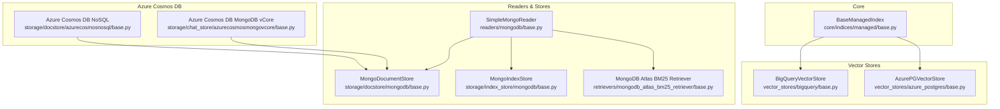
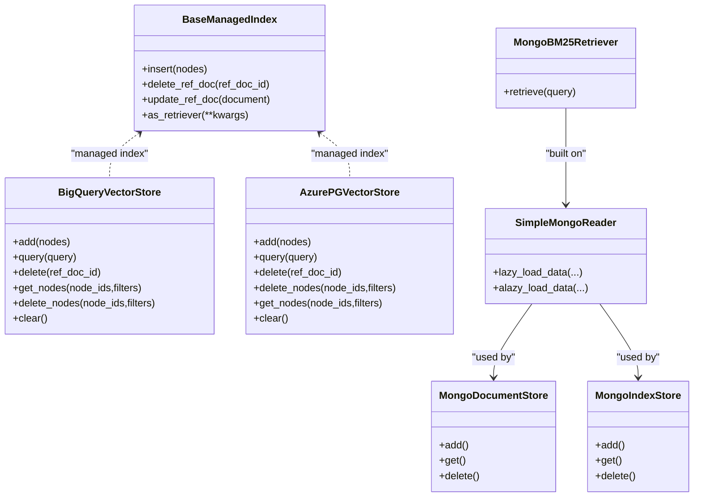
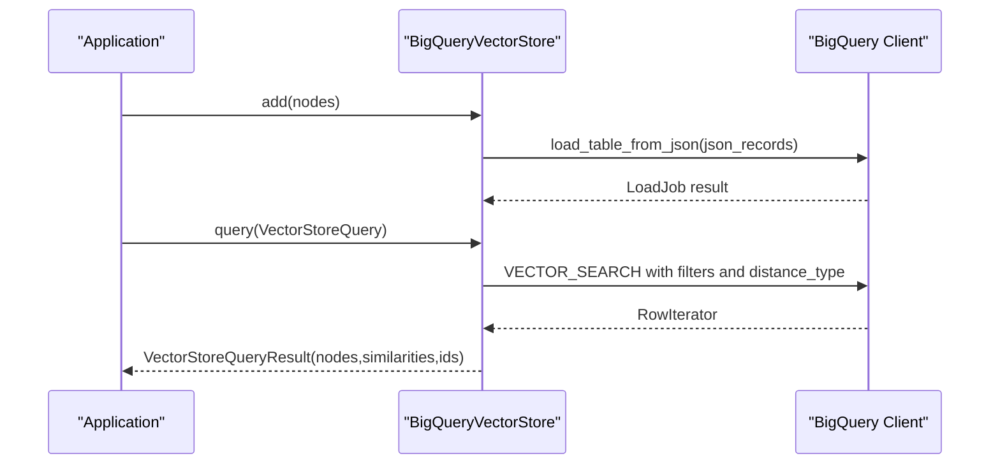
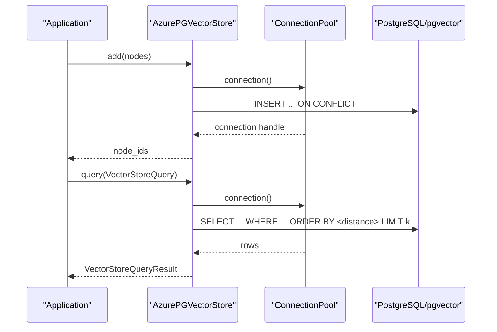
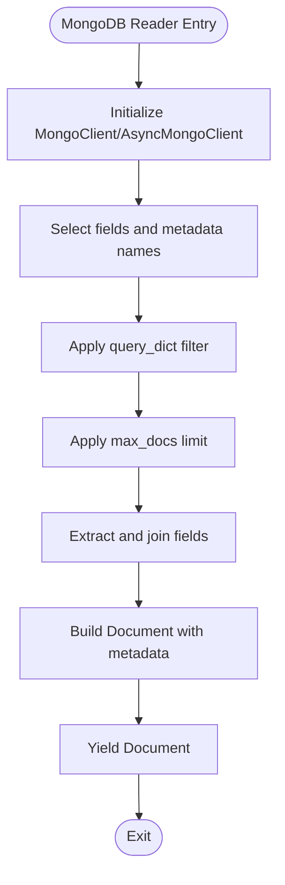
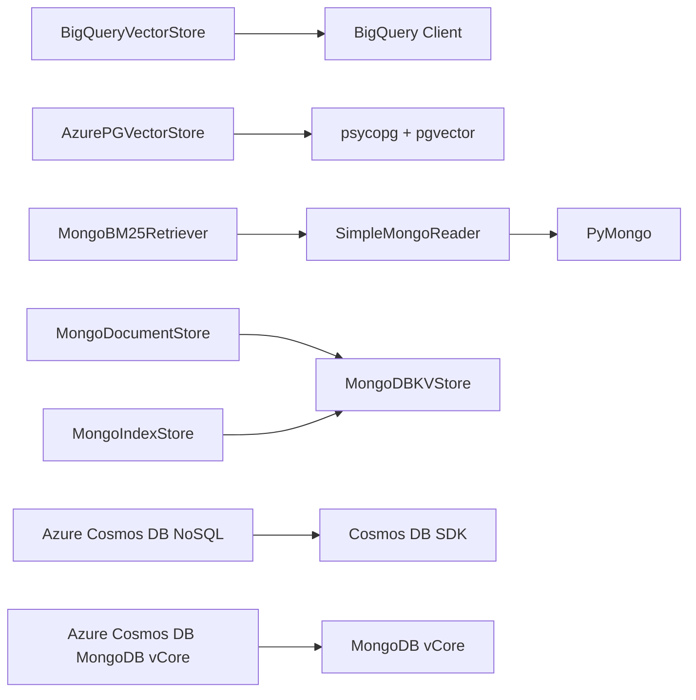

# Managed Database Services

<cite>
**Referenced Files in This Document**
- [base.py](file://llama-index-core/llama_index/core/indices/managed/base.py)
- [base.py](file://llama-index-integrations/vector_stores/llama-index-vector-stores-bigquery/llama_index/vector_stores/bigquery/base.py)
- [base.py](file://llama-index-integrations/vector_stores/llama-index-vector-stores-azurepostgresql/llama_index/vector_stores/azure_postgres/base.py)
- [base.py](file://llama-index-integrations/readers/llama-index-readers-mongodb/llama_index/readers/mongodb/base.py)
- [base.py](file://llama-index-integrations/storage/docstore/llama-index-storage-docstore-mongodb/llama_index/storage/docstore/mongodb/base.py)
- [base.py](file://llama-index-integrations/storage/index_store/llama-index-storage-index-store-mongodb/llama_index/storage/index_store/mongodb/base.py)
- [base.py](file://llama-index-integrations/storage/chat_store/llama-index-storage-chat-store-azurecosmosmongovcore/llama_index/storage/chat_store/azurecosmosmongovcore/base.py)
- [base.py](file://llama-index-integrations/storage/docstore/llama-index-storage-docstore-azurecosmosnosql/llama_index/storage/docstore/azurecosmosnosql/base.py)
- [base.py](file://llama-index-integrations/storage/index_store/llama-index-storage-index-store-azurecosmosnosql/llama_index/storage/index_store/azurecosmosnosql/base.py)
- [base.py](file://llama-index-integrations/storage/kvstore/llama-index-storage-kvstore-azurecosmosnosql/llama_index/storage/kvstore/azurecosmosnosql/base.py)
- [base.py](file://llama-index-integrations/retrievers/llama-index-retrievers-mongodb-atlas-bm25-retriever/llama_index/retrievers/mongodb_atlas_bm25_retriever/base.py)
</cite>

## Table of Contents
1. [Introduction](#introduction)
2. [Project Structure](#project-structure)
3. [Core Components](#core-components)
4. [Architecture Overview](#architecture-overview)
5. [Detailed Component Analysis](#detailed-component-analysis)
6. [Dependency Analysis](#dependency-analysis)
7. [Performance Considerations](#performance-considerations)
8. [Troubleshooting Guide](#troubleshooting-guide)
9. [Conclusion](#conclusion)
10. [Appendices](#appendices)

## Introduction
This document provides comprehensive API documentation for managed database service integrations within the LlamaIndex ecosystem. It focuses on:
- Google BigQuery (vector search)
- Azure Database for PostgreSQL (vector operations)
- MongoDB Atlas (readers, document store, index store, BM25 retriever)
- Azure Cosmos DB (Cosmos DB NoSQL and MongoDB-compatible vCore)
- General managed index patterns

It covers connection mechanisms, authentication, service-specific features, schema design, indexing, query optimization, cost management, backup, and disaster recovery guidance. Guidance is provided for selecting the right managed service based on use cases and data volumes.

## Project Structure
The managed database integrations are implemented as modular vector stores, readers, and storage backends. The core managed index abstraction defines the contract for managed services, while integrations provide concrete implementations for BigQuery, Azure PostgreSQL, MongoDB, and Azure Cosmos DB variants.

**Diagram sources**
- [base.py](file://llama-index-core/llama_index/core/indices/managed/base.py#L20-L99)
- [base.py](file://llama-index-integrations/vector_stores/llama-index-vector-stores-bigquery/llama_index/vector_stores/bigquery/base.py#L50-L548)
- [base.py](file://llama-index-integrations/vector_stores/llama-index-vector-stores-azurepostgresql/llama_index/vector_stores/azure_postgres/base.py#L143-L385)
- [base.py](file://llama-index-integrations/readers/llama-index-readers-mongodb/llama_index/readers/mongodb/base.py#L11-L193)
- [base.py](file://llama-index-integrations/storage/docstore/llama-index-storage-docstore-mongodb/llama_index/storage/docstore/mongodb/base.py#L8-L79)
- [base.py](file://llama-index-integrations/storage/index_store/llama-index-storage-index-store-mongodb/llama_index/storage/index_store/mongodb/base.py#L7-L53)
- [base.py](file://llama-index-integrations/storage/chat_store/llama-index-storage-chat-store-azurecosmosmongovcore/llama_index/storage/chat_store/azurecosmosmongovcore/base.py)
- [base.py](file://llama-index-integrations/storage/docstore/llama-index-storage-docstore-azurecosmosnosql/llama_index/storage/docstore/azurecosmosnosql/base.py)
- [base.py](file://llama-index-integrations/retrievers/llama-index-retrievers-mongodb-atlas-bm25-retriever/llama_index/retrievers/mongodb_atlas_bm25_retriever/base.py)

**Section sources**
- [base.py](file://llama-index-core/llama_index/core/indices/managed/base.py#L20-L99)

## Core Components
- BaseManagedIndex: Defines the managed index contract with abstract methods for insertion, deletion, updates, and retriever creation. It centralizes the managed index lifecycle and exposes a unified interface for building and querying managed indices.
- BigQueryVectorStore: Implements a vector store backed by BigQuery’s vector search, supporting configurable distance metrics, automatic dataset/table creation, and SQL-based queries with metadata filters.
- AzurePGVectorStore: Implements a vector store backed by Azure Database for PostgreSQL with pgvector, supporting similarity search, hybrid search modes, metadata filtering, and conflict handling during inserts.
- SimpleMongoReader: Reads data from MongoDB collections via URI or host/port, supports projections, filters, and asynchronous loading.
- MongoDocumentStore and MongoIndexStore: Provide MongoDB-backed document and index stores using a shared MongoDB key-value store.
- MongoDB Atlas BM25 Retriever: Specialized retriever leveraging MongoDB Atlas search capabilities for BM25-style retrieval.
- Azure Cosmos DB Integrations: Provide document store, index store, and chat store implementations for Cosmos DB variants (NoSQL and MongoDB vCore).

**Section sources**
- [base.py](file://llama-index-core/llama_index/core/indices/managed/base.py#L20-L99)
- [base.py](file://llama-index-integrations/vector_stores/llama-index-vector-stores-bigquery/llama_index/vector_stores/bigquery/base.py#L50-L548)
- [base.py](file://llama-index-integrations/vector_stores/llama-index-vector-stores-azurepostgresql/llama_index/vector_stores/azure_postgres/base.py#L143-L385)
- [base.py](file://llama-index-integrations/readers/llama-index-readers-mongodb/llama_index/readers/mongodb/base.py#L11-L193)
- [base.py](file://llama-index-integrations/storage/docstore/llama-index-storage-docstore-mongodb/llama_index/storage/docstore/mongodb/base.py#L8-L79)
- [base.py](file://llama-index-integrations/storage/index_store/llama-index-storage-index-store-mongodb/llama_index/storage/index_store/mongodb/base.py#L7-L53)
- [base.py](file://llama-index-integrations/retrievers/llama-index-retrievers-mongodb-atlas-bm25-retriever/llama_index/retrievers/mongodb_atlas_bm25_retriever/base.py)

## Architecture Overview
The managed index architecture separates concerns between:
- Managed index abstraction (BaseManagedIndex)
- Vector stores (BigQuery, Azure PostgreSQL)
- Readers and storage backends (MongoDB Atlas, Azure Cosmos DB)
- Retrievers (BM25 for MongoDB Atlas)

**Diagram sources**
- [base.py](file://llama-index-core/llama_index/core/indices/managed/base.py#L20-L99)
- [base.py](file://llama-index-integrations/vector_stores/llama-index-vector-stores-bigquery/llama_index/vector_stores/bigquery/base.py#L50-L548)
- [base.py](file://llama-index-integrations/vector_stores/llama-index-vector-stores-azurepostgresql/llama_index/vector_stores/azure_postgres/base.py#L143-L385)
- [base.py](file://llama-index-integrations/readers/llama-index-readers-mongodb/llama_index/readers/mongodb/base.py#L11-L193)
- [base.py](file://llama-index-integrations/storage/docstore/llama-index-storage-docstore-mongodb/llama_index/storage/docstore/mongodb/base.py#L8-L79)
- [base.py](file://llama-index-integrations/storage/index_store/llama-index-storage-index-store-mongodb/llama_index/storage/index_store/mongodb/base.py#L7-L53)
- [base.py](file://llama-index-integrations/retrievers/llama-index-retrievers-mongodb-atlas-bm25-retriever/llama_index/retrievers/mongodb_atlas_bm25_retriever/base.py)

## Detailed Component Analysis

### Google BigQuery Vector Store
- Purpose: Fully managed vector search for embeddings with configurable distance metrics.
- Authentication: Supports explicit credentials, project/region defaults, or default environment credentials.
- Schema: Automatically creates dataset and table with fields for node_id, text, metadata (JSON), and embedding (FLOAT repeated).
- Querying: Uses BigQuery VECTOR_SEARCH with pre/post-filtering support and metadata filters.
- Cost and Performance: Leverage BigQuery pricing for query units and storage; optimize by adding appropriate indexes and using pre-filtering to reduce nearest neighbor search scope.
- Backup and Recovery: Use BigQuery table snapshots and point-in-time recovery; maintain regular backups of production datasets.

**Diagram sources**
- [base.py](file://llama-index-integrations/vector_stores/llama-index-vector-stores-bigquery/llama_index/vector_stores/bigquery/base.py#L285-L439)

**Section sources**
- [base.py](file://llama-index-integrations/vector_stores/llama-index-vector-stores-bigquery/llama_index/vector_stores/bigquery/base.py#L50-L548)

### Azure Database for PostgreSQL (pgvector)
- Purpose: Managed PostgreSQL with pgvector extension for vector similarity search and hybrid retrieval.
- Authentication: Uses connection pooling with psycopg and pgvector registration; supports JSONB metadata filtering.
- Schema: Table with id, content, embedding (vector), and metadata (JSONB); supports ON CONFLICT handling.
- Querying: Similarity search with configurable distance; optional hybrid mode combining text search; metadata filters translated to SQL.
- Cost and Performance: Monitor compute, storage, and I/O costs; consider reserved capacity or flexible server tiers; optimize indexes and embedding dimensions.
- Backup and Recovery: Use Azure Database for PostgreSQL backup and point-in-time recovery; schedule automated backups.

**Diagram sources**
- [base.py](file://llama-index-integrations/vector_stores/llama-index-vector-stores-azurepostgresql/llama_index/vector_stores/azure_postgres/base.py#L247-L308)

**Section sources**
- [base.py](file://llama-index-integrations/vector_stores/llama-index-vector-stores-azurepostgresql/llama_index/vector_stores/azure_postgres/base.py#L143-L385)

### MongoDB Atlas Reader and Stores
- Reader: Connects via URI or host/port, supports projections, filters, and asynchronous streaming; concatenates selected fields into Documents.
- Document Store: KV-backed document store using MongoDB; supports namespaces and collection suffixes.
- Index Store: KV-backed index store using MongoDB; supports namespaces and collection suffixes.
- BM25 Retriever: Specialized retriever leveraging Atlas search capabilities for BM25-style retrieval.

**Diagram sources**
- [base.py](file://llama-index-integrations/readers/llama-index-readers-mongodb/llama_index/readers/mongodb/base.py#L58-L129)

**Section sources**
- [base.py](file://llama-index-integrations/readers/llama-index-readers-mongodb/llama_index/readers/mongodb/base.py#L11-L193)
- [base.py](file://llama-index-integrations/storage/docstore/llama-index-storage-docstore-mongodb/llama_index/storage/docstore/mongodb/base.py#L8-L79)
- [base.py](file://llama-index-integrations/storage/index_store/llama-index-storage-index-store-mongodb/llama_index/storage/index_store/mongodb/base.py#L7-L53)
- [base.py](file://llama-index-integrations/retrievers/llama-index-retrievers-mongodb-atlas-bm25-retriever/llama_index/retrievers/mongodb_atlas_bm25_retriever/base.py)

### Azure Cosmos DB Integrations
- Cosmos DB NoSQL: Provides document store and index store implementations tailored for Cosmos DB NoSQL.
- Cosmos DB MongoDB vCore: Provides chat store implementation compatible with Cosmos DB’s MongoDB vCore offering.

These integrations enable using Cosmos DB as a managed persistence backend for document and index stores, and for chat-related data in MongoDB vCore environments.

**Section sources**
- [base.py](file://llama-index-integrations/storage/docstore/llama-index-storage-docstore-azurecosmosnosql/llama_index/storage/docstore/azurecosmosnosql/base.py)
- [base.py](file://llama-index-integrations/storage/index_store/llama-index-storage-index-store-azurecosmosnosql/llama_index/storage/index_store/azurecosmosnosql/base.py)
- [base.py](file://llama-index-integrations/storage/chat_store/llama-index-storage-chat-store-azurecosmosmongovcore/llama_index/storage/chat_store/azurecosmosmongovcore/base.py)

## Dependency Analysis
- BigQueryVectorStore depends on the BigQuery client and uses SQL-based vector search with metadata filtering.
- AzurePGVectorStore depends on psycopg and pgvector; translates LlamaIndex metadata filters into SQL expressions.
- MongoDB integrations depend on PyMongo for synchronous/asynchronous operations and MongoDB key-value stores for persistence.
- Azure Cosmos DB integrations depend on Cosmos DB SDKs and drivers for their respective APIs.

**Diagram sources**
- [base.py](file://llama-index-integrations/vector_stores/llama-index-vector-stores-bigquery/llama_index/vector_stores/bigquery/base.py#L14-L28)
- [base.py](file://llama-index-integrations/vector_stores/llama-index-vector-stores-azurepostgresql/llama_index/vector_stores/azure_postgres/base.py#L7-L26)
- [base.py](file://llama-index-integrations/readers/llama-index-readers-mongodb/llama_index/readers/mongodb/base.py#L30-L37)
- [base.py](file://llama-index-integrations/storage/docstore/llama-index-storage-docstore-mongodb/llama_index/storage/docstore/mongodb/base.py#L4-L5)
- [base.py](file://llama-index-integrations/storage/index_store/llama-index-storage-index-store-mongodb/llama_index/storage/index_store/mongodb/base.py#L3-L4)
- [base.py](file://llama-index-integrations/retrievers/llama-index-retrievers-mongodb-atlas-bm25-retriever/llama_index/retrievers/mongodb_atlas_bm25_retriever/base.py)
- [base.py](file://llama-index-integrations/storage/docstore/llama-index-storage-docstore-azurecosmosnosql/llama_index/storage/docstore/azurecosmosnosql/base.py)
- [base.py](file://llama-index-integrations/storage/chat_store/llama-index-storage-chat-store-azurecosmosmongovcore/llama_index/storage/chat_store/azurecosmosmongovcore/base.py)

**Section sources**
- [base.py](file://llama-index-integrations/vector_stores/llama-index-vector-stores-bigquery/llama_index/vector_stores/bigquery/base.py#L14-L28)
- [base.py](file://llama-index-integrations/vector_stores/llama-index-vector-stores-azurepostgresql/llama_index/vector_stores/azure_postgres/base.py#L7-L26)
- [base.py](file://llama-index-integrations/readers/llama-index-readers-mongodb/llama_index/readers/mongodb/base.py#L30-L37)
- [base.py](file://llama-index-integrations/storage/docstore/llama-index-storage-docstore-mongodb/llama_index/storage/docstore/mongodb/base.py#L4-L5)
- [base.py](file://llama-index-integrations/storage/index_store/llama-index-storage-index-store-mongodb/llama_index/storage/index_store/mongodb/base.py#L3-L4)
- [base.py](file://llama-index-integrations/retrievers/llama-index-retrievers-mongodb-atlas-bm25-retriever/llama_index/retrievers/mongodb_atlas_bm25_retriever/base.py)
- [base.py](file://llama-index-integrations/storage/docstore/llama-index-storage-docstore-azurecosmosnosql/llama_index/storage/docstore/azurecosmosnosql/base.py)
- [base.py](file://llama-index-integrations/storage/chat_store/llama-index-storage-chat-store-azurecosmosmongovcore/llama_index/storage/chat_store/azurecosmosmongovcore/base.py)

## Performance Considerations
- BigQuery
  - Pre-filtering: Use metadata filters aligned with indexes to leverage pre-filtering and reduce nearest neighbor search cost.
  - Distance metric: Choose distance type based on embedding normalization and similarity semantics.
  - Batch loads: Use JSON load jobs for efficient bulk ingestion.
- Azure PostgreSQL (pgvector)
  - Embedding dimensionality: Lower dimensions reduce storage and improve speed; tune based on accuracy needs.
  - Index selection: Use appropriate ivfflat or hnsw configurations; monitor query plans.
  - Hybrid search: Combine text search with vector search to reduce false positives and improve latency.
- MongoDB Atlas
  - Atlas Search: Use Atlas Search indexes for BM25 and text search; configure analyzers and search facets.
  - Sharding and indexing: Distribute workload across shards; create compound indexes for frequent filter combinations.
- Azure Cosmos DB
  - RU allocation: Right-size Request Units for predictable performance; monitor throttling and auto-scale policies.
  - Partition keys: Design partition keys to avoid hotspots and enable horizontal scaling.

[No sources needed since this section provides general guidance]

## Troubleshooting Guide
- BigQuery
  - Authentication failures: Verify credentials and IAM roles; confirm project/region settings.
  - Query errors: Ensure metadata filters match table schema; check VECTOR_SEARCH parameters.
- Azure PostgreSQL
  - Connection issues: Validate connection pool configuration and pgvector registration.
  - Missing embeddings: Confirm embedding dimensions and data types; inspect ON CONFLICT behavior.
- MongoDB
  - Field extraction errors: Ensure required fields exist in documents; handle missing fields gracefully.
  - Cursor limits: Respect max_docs and pagination; consider async cursors for large datasets.
- Azure Cosmos DB
  - Throttling: Monitor RU usage and adjust autoscale or provisioned RUs.
  - Indexing delays: Allow time for index builds; verify index definitions.

**Section sources**
- [base.py](file://llama-index-integrations/vector_stores/llama-index-vector-stores-bigquery/llama_index/vector_stores/bigquery/base.py#L175-L199)
- [base.py](file://llama-index-integrations/vector_stores/llama-index-vector-stores-azurepostgresql/llama_index/vector_stores/azure_postgres/base.py#L38-L141)
- [base.py](file://llama-index-integrations/readers/llama-index-readers-mongodb/llama_index/readers/mongodb/base.py#L111-L114)
- [base.py](file://llama-index-integrations/storage/docstore/llama-index-storage-docstore-azurecosmosnosql/llama_index/storage/docstore/azurecosmosnosql/base.py)
- [base.py](file://llama-index-integrations/storage/chat_store/llama-index-storage-chat-store-azurecosmosmongovcore/llama_index/storage/chat_store/azurecosmosmongovcore/base.py)

## Conclusion
The managed database integrations in LlamaIndex provide robust, scalable backends for vector search and document storage across BigQuery, Azure PostgreSQL, MongoDB Atlas, and Azure Cosmos DB. By leveraging service-specific features—BigQuery’s vector search, Azure PostgreSQL’s pgvector, MongoDB Atlas search, and Cosmos DB’s managed APIs—you can tailor performance, cost, and operational characteristics to your workload. Use the guidance here to select the right service, design efficient schemas and indexes, optimize queries, and manage costs, backups, and recovery.

[No sources needed since this section summarizes without analyzing specific files]

## Appendices

### Choosing the Right Managed Service
- BigQuery
  - Best for: Large-scale analytics, petabyte-class datasets, serverless vector search, strong IAM controls.
  - Consider: Pre-filtering, vector index tuning, and BigQuery pricing models.
- Azure PostgreSQL
  - Best for: Postgres-compatible workloads with vector extensions, hybrid search, JSONB metadata.
  - Consider: Compute tier, storage IOPS, and pgvector index configuration.
- MongoDB Atlas
  - Best for: Flexible schema, real-time search, global distribution, and native document semantics.
  - Consider: Atlas Search index design, sharding, and cluster topology.
- Azure Cosmos DB
  - Best for: Multi-region, globally distributed applications with flexible consistency.
  - Consider: RU autoscale/provisioning, partitioning strategy, and API compatibility.

[No sources needed since this section provides general guidance]