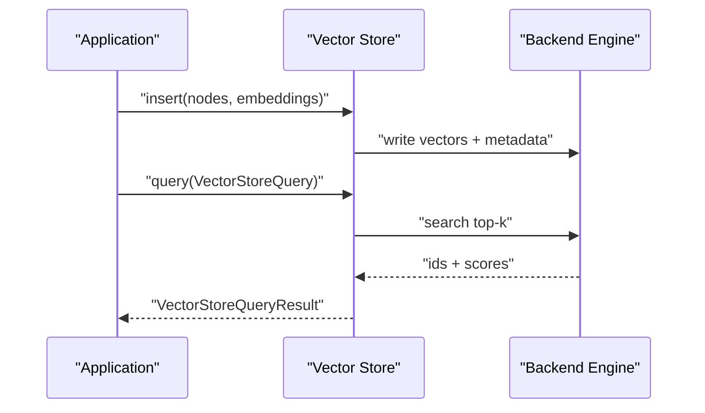
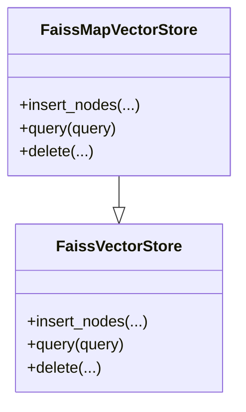
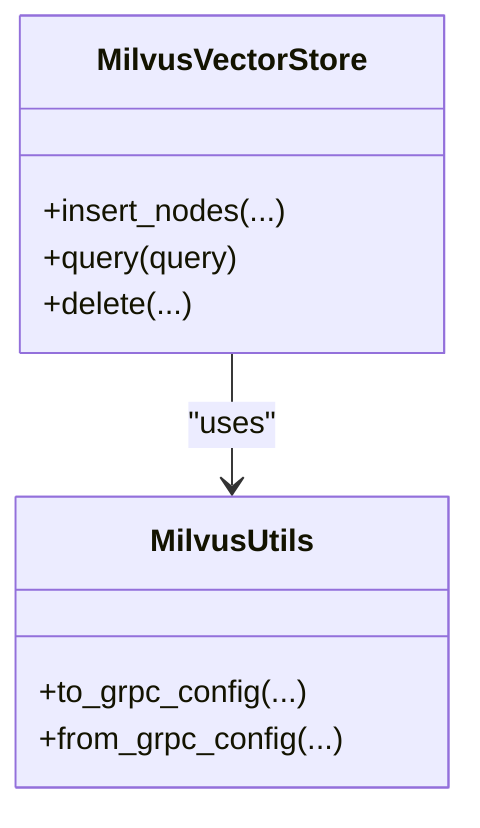
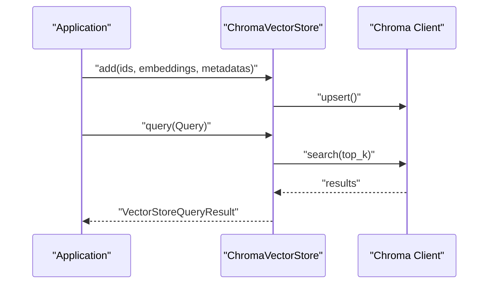
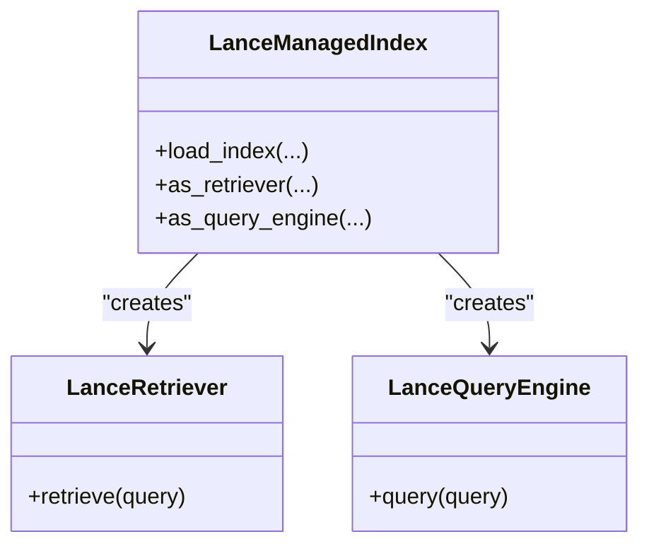
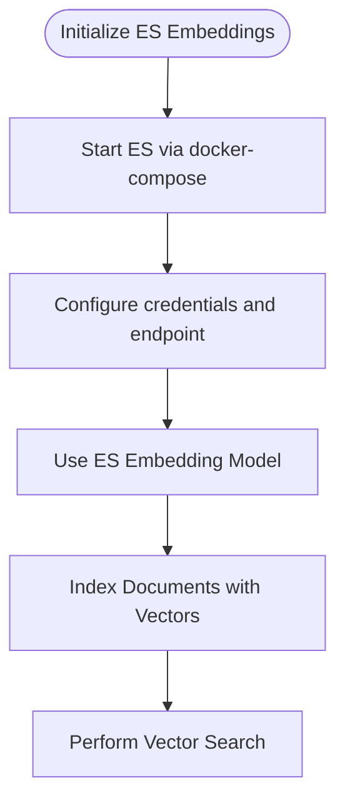
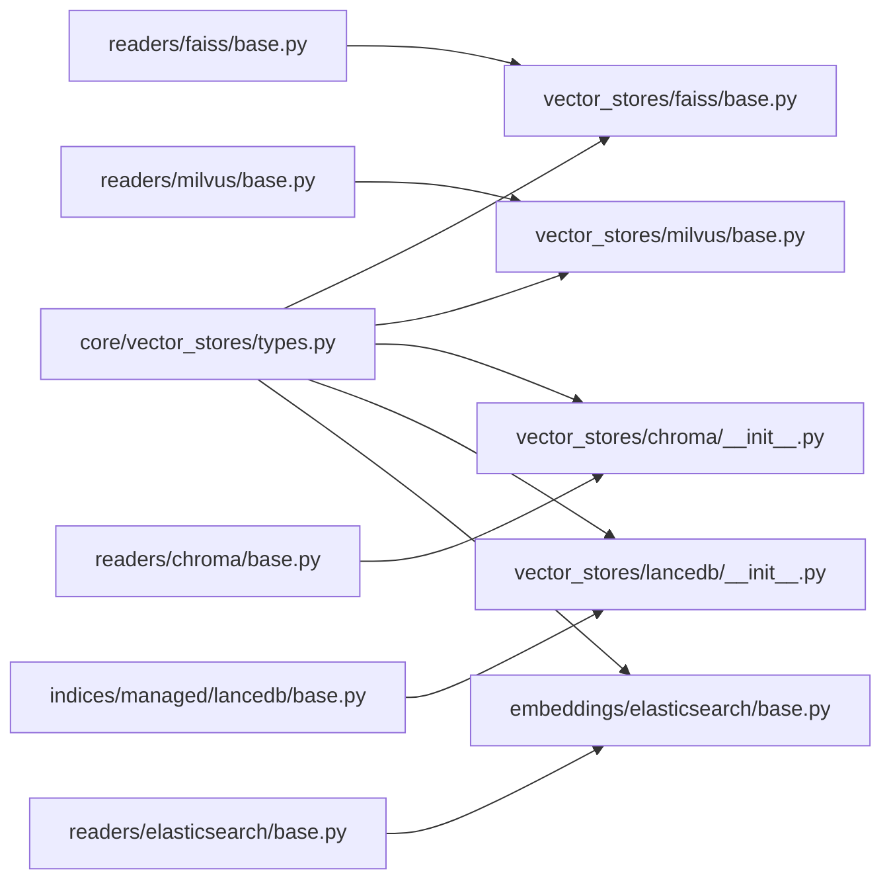

# Open-Source Vector Stores

<cite>
**Referenced Files in This Document**
- [faiss_vector_store_init.py](file://llama-index-integrations/vector_stores/llama-index-vector-stores-faiss/llama_index/vector_stores/faiss/__init__.py)
- [faiss_map_store.py](file://llama-index-integrations/vector_stores/llama-index-vector-stores-faiss/llama_index/vector_stores/faiss/map_store.py)
- [faiss_base.py](file://llama-index-integrations/vector_stores/llama-index-vector-stores-faiss/llama_index/vector_stores/faiss/base.py)
- [milvus_vector_store_init.py](file://llama-index-integrations/vector_stores/llama-index-vector-stores-milvus/llama_index/vector_stores/milvus/__init__.py)
- [milvus_base.py](file://llama-index-integrations/vector_stores/llama-index-vector-stores-milvus/llama_index/vector_stores/milvus/base.py)
- [milvus_utils.py](file://llama-index-integrations/vector_stores/llama-index-vector-stores-milvus/llama_index/vector_stores/milvus/utils.py)
- [chroma_vector_store_init.py](file://llama-index-integrations/vector_stores/llama-index-vector-stores-chroma/llama_index/vector_stores/chroma/__init__.py)
- [lancedb_vector_store_init.py](file://llama-index-integrations/vector_stores/llama-index-vector-stores-lancedb/llama_index/vector_stores/lancedb/__init__.py)
- [elasticsearch_embeddings_readme.md](file://llama-index-integrations/embeddings/llama-index-embeddings-elasticsearch/README.md)
- [elasticsearch_embeddings_docker_compose.yml](file://llama-index-integrations/embeddings/llama-index-embeddings-elasticsearch/docker-compose.yml)
- [elasticsearch_embeddings_base.py](file://llama-index-integrations/embeddings/llama-index-embeddings-elasticsearch/llama_index/embeddings/elasticsearch/base.py)
- [faiss_reader_init.py](file://llama-index-integrations/readers/llama-index-readers-faiss/llama_index/readers/faiss/__init__.py)
- [faiss_reader_base.py](file://llama-index-integrations/readers/llama-index-readers-faiss/llama_index/readers/faiss/base.py)
- [milvus_reader_init.py](file://llama-index-integrations/readers/llama-index-readers-milvus/llama_index/readers/milvus/__init__.py)
- [milvus_reader_base.py](file://llama-index-integrations/readers/llama-index-readers-milvus/llama_index/readers/milvus/base.py)
- [chroma_reader_init.py](file://llama-index-integrations/readers/llama-index-readers-chroma/llama_index/readers/chroma/__init__.py)
- [chroma_reader_base.py](file://llama-index-integrations/readers/llama-index-readers-chroma/llama_index/readers/chroma/base.py)
- [elasticsearch_reader_init.py](file://llama-index-integrations/readers/llama-index-readers-elasticsearch/llama_index/readers/elasticsearch/__init__.py)
- [elasticsearch_reader_base.py](file://llama-index-integrations/readers/llama-index-readers-elasticsearch/llama_index/readers/elasticsearch/base.py)
- [lancedb_managed_index_readme.md](file://llama-index-integrations/indices/llama-index-indices-managed-lancedb/README.md)
- [lancedb_managed_index_base.py](file://llama-index-integrations/indices/llama-index-indices-managed-lancedb/llama_index/indices/managed/lancedb/base.py)
- [lancedb_managed_index_query_engine.py](file://llama-index-integrations/indices/llama-index-indices-managed-lancedb/llama_index/indices/managed/lancedb/query_engine.py)
- [lancedb_managed_index_retriever.py](file://llama-index-integrations/indices/llama-index-indices-managed-lancedb/llama_index/indices/managed/lancedb/retriever.py)
- [lancedb_managed_index_utils.py](file://llama-index-integrations/indices/llama-index-indices-managed-lancedb/llama_index/indices/managed/lancedb/utils.py)
- [vector_stores_types.py](file://llama-index-core/llama_index/core/vector_stores/types.py)
- [vector_stores_simple.py](file://llama-index-core/llama_index/core/vector_stores/simple.py)
- [vector_stores_api_faiss.md](file://docs/api_reference/api_reference/storage/vector_store/faiss.md)
- [vector_stores_api_milvus.md](file://docs/api_reference/api_reference/storage/vector_store/milvus.md)
- [vector_stores_api_chroma.md](file://docs/api_reference/api_reference/storage/vector_store/chroma.md)
- [vector_stores_api_lancedb.md](file://docs/api_reference/api_reference/storage/vector_store/lancedb.md)
- [vector_stores_api_elasticsearch.md](file://docs/api_reference/api_reference/storage/vector_store/elasticsearch.md)
- [embeddings_api_elasticsearch.md](file://docs/api_reference/api_reference/embeddings/elasticsearch.md)
- [examples_faiss_json](file://docs/examples/vector_stores/index_faiss.json)
- [examples_faiss_core_index](file://docs/examples/vector_stores/index_faiss_core.index)
- [examples_chroma_auto_retriever_notebook](file://docs/examples/vector_stores/chroma_auto_retriever.ipynb)
- [examples_chroma_metadata_filter_notebook](file://docs/examples/vector_stores/chroma_metadata_filter.ipynb)
- [examples_elasticsearch_auto_retriever_notebook](file://docs/examples/vector_stores/elasticsearch_auto_retriever.ipynb)
- [examples_elasticsearch_embedding_notebook](file://docs/examples/embeddings/elasticsearch.ipynb)
</cite>

## Table of Contents
1. [Introduction](#introduction)
2. [Project Structure](#project-structure)
3. [Core Components](#core-components)
4. [Architecture Overview](#architecture-overview)
5. [Detailed Component Analysis](#detailed-component-analysis)
6. [Dependency Analysis](#dependency-analysis)
7. [Performance Considerations](#performance-considerations)
8. [Troubleshooting Guide](#troubleshooting-guide)
9. [Conclusion](#conclusion)
10. [Appendices](#appendices)

## Introduction
This document provides comprehensive API documentation for open-source vector store integrations in the LlamaIndex ecosystem. It covers FAISS, Milvus, Chroma, LanceDB, and Elasticsearch. The guide focuses on:
- Installation and configuration
- Deployment strategies (local, Docker, Kubernetes)
- Performance tuning, indexing optimization, and memory management
- Troubleshooting and scaling guidance

Where applicable, we reference concrete files and notebooks from the repository to anchor each claim.

## Project Structure
The vector store integrations are organized as separate packages under the integrations tree. Each package exposes a vector store implementation and often includes readers, managed indices, and example notebooks. Core vector store abstractions live in the core package.

```mermaid
graph TB
subgraph "Core"
CORE_TYPES["vector_stores/types.py"]
CORE_SIMPLE["vector_stores/simple.py"]
end
subgraph "FAISS"
FAISS_INIT["vector_stores/faiss/__init__.py"]
FAISS_BASE["vector_stores/faiss/base.py"]
FAISS_MAP["vector_stores/faiss/map_store.py"]
FAISS_READER_INIT["readers/faiss/__init__.py"]
FAISS_READER_BASE["readers/faiss/base.py"]
end
subgraph "Milvus"
MILVUS_INIT["vector_stores/milvus/__init__.py"]
MILVUS_BASE["vector_stores/milvus/base.py"]
MILVUS_UTILS["vector_stores/milvus/utils.py"]
MILVUS_READER_INIT["readers/milvus/__init__.py"]
MILVUS_READER_BASE["readers/milvus/base.py"]
end
subgraph "Chroma"
CHROMA_INIT["vector_stores/chroma/__init__.py"]
CHROMA_READER_INIT["readers/chroma/__init__.py"]
CHROMA_READER_BASE["readers/chroma/base.py"]
end
subgraph "LanceDB"
LANCEDB_INIT["vector_stores/lancedb/__init__.py"]
LANCEDB_MANAGED_README["indices/managed/lancedb/README.md"]
LANCEDB_MANAGED_BASE["indices/managed/lancedb/base.py"]
LANCEDB_MANAGED_QUERY["indices/managed/lancedb/query_engine.py"]
LANCEDB_MANAGED_RETRIEVER["indices/managed/lancedb/retriever.py"]
LANCEDB_MANAGED_UTILS["indices/managed/lancedb/utils.py"]
end
subgraph "Elasticsearch"
EMB_ES_README["embeddings/elasticsearch/README.md"]
EMB_ES_DC["embeddings/elasticsearch/docker-compose.yml"]
EMB_ES_BASE["embeddings/elasticsearch/base.py"]
EMB_ES_READER_INIT["readers/elasticsearch/__init__.py"]
EMB_ES_READER_BASE["readers/elasticsearch/base.py"]
end
CORE_TYPES --> FAISS_BASE
CORE_TYPES --> MILVUS_BASE
CORE_TYPES --> CHROMA_INIT
CORE_TYPES --> LANCEDB_INIT
CORE_TYPES --> EMB_ES_BASE
FAISS_INIT --> FAISS_BASE
FAISS_INIT --> FAISS_MAP
MILVUS_INIT --> MILVUS_BASE
MILVUS_INIT --> MILVUS_UTILS
CHROMA_INIT --> CHROMA_READER_INIT
LANCEDB_INIT --> LANCEDB_MANAGED_BASE
EMB_ES_README --> EMB_ES_DC
EMB_ES_README --> EMB_ES_BASE
```

**Diagram sources**
- [vector_stores_types.py](file://llama-index-core/llama_index/core/vector_stores/types.py#L1-L200)
- [vector_stores_simple.py](file://llama-index-core/llama_index/core/vector_stores/simple.py#L1-L200)
- [faiss_vector_store_init.py](file://llama-index-integrations/vector_stores/llama-index-vector-stores-faiss/llama_index/vector_stores/faiss/__init__.py#L1-L5)
- [faiss_base.py](file://llama-index-integrations/vector_stores/llama-index-vector-stores-faiss/llama_index/vector_stores/faiss/base.py#L1-L200)
- [faiss_map_store.py](file://llama-index-integrations/vector_stores/llama-index-vector-stores-faiss/llama_index/vector_stores/faiss/map_store.py#L1-L200)
- [milvus_vector_store_init.py](file://llama-index-integrations/vector_stores/llama-index-vector-stores-milvus/llama_index/vector_stores/milvus/__init__.py#L1-L200)
- [milvus_base.py](file://llama-index-integrations/vector_stores/llama-index-vector-stores-milvus/llama_index/vector_stores/milvus/base.py#L1-L200)
- [milvus_utils.py](file://llama-index-integrations/vector_stores/llama-index-vector-stores-milvus/llama_index/vector_stores/milvus/utils.py#L1-L200)
- [chroma_vector_store_init.py](file://llama-index-integrations/vector_stores/llama-index-vector-stores-chroma/llama_index/vector_stores/chroma/__init__.py#L1-L200)
- [lancedb_vector_store_init.py](file://llama-index-integrations/vector_stores/llama-index-vector-stores-lancedb/llama_index/vector_stores/lancedb/__init__.py#L1-L200)
- [lancedb_managed_index_readme.md](file://llama-index-integrations/indices/llama-index-indices-managed-lancedb/README.md#L1-L200)
- [lancedb_managed_index_base.py](file://llama-index-integrations/indices/llama-index-indices-managed-lancedb/llama_index/indices/managed/lancedb/base.py#L1-L200)
- [lancedb_managed_index_query_engine.py](file://llama-index-integrations/indices/llama-index-indices-managed-lancedb/llama_index/indices/managed/lancedb/query_engine.py#L1-L200)
- [lancedb_managed_index_retriever.py](file://llama-index-integrations/indices/llama-index-indices-managed-lancedb/llama_index/indices/managed/lancedb/retriever.py#L1-L200)
- [lancedb_managed_index_utils.py](file://llama-index-integrations/indices/llama-index-indices-managed-lancedb/llama_index/indices/managed/lancedb/utils.py#L1-L200)
- [elasticsearch_embeddings_readme.md](file://llama-index-integrations/embeddings/llama-index-embeddings-elasticsearch/README.md#L1-L200)
- [elasticsearch_embeddings_docker_compose.yml](file://llama-index-integrations/embeddings/llama-index-embeddings-elasticsearch/docker-compose.yml#L1-L200)
- [elasticsearch_embeddings_base.py](file://llama-index-integrations/embeddings/llama-index-embeddings-elasticsearch/llama_index/embeddings/elasticsearch/base.py#L1-L200)
- [faiss_reader_init.py](file://llama-index-integrations/readers/llama-index-readers-faiss/llama_index/readers/faiss/__init__.py#L1-L200)
- [faiss_reader_base.py](file://llama-index-integrations/readers/llama-index-readers-faiss/llama_index/readers/faiss/base.py#L1-L200)
- [milvus_reader_init.py](file://llama-index-integrations/readers/llama-index-readers-milvus/llama_index/readers/milvus/__init__.py#L1-L200)
- [milvus_reader_base.py](file://llama-index-integrations/readers/llama-index-readers-milvus/llama_index/readers/milvus/base.py#L1-L200)
- [chroma_reader_init.py](file://llama-index-integrations/readers/llama-index-readers-chroma/llama_index/readers/chroma/__init__.py#L1-L200)
- [chroma_reader_base.py](file://llama-index-integrations/readers/llama-index-readers-chroma/llama_index/readers/chroma/base.py#L1-L200)
- [elasticsearch_reader_init.py](file://llama-index-integrations/readers/llama-index-readers-elasticsearch/llama_index/readers/elasticsearch/__init__.py#L1-L200)
- [elasticsearch_reader_base.py](file://llama-index-integrations/readers/llama-index-readers-elasticsearch/llama_index/readers/elasticsearch/base.py#L1-L200)

**Section sources**
- [faiss_vector_store_init.py](file://llama-index-integrations/vector_stores/llama-index-vector-stores-faiss/llama_index/vector_stores/faiss/__init__.py#L1-L5)
- [milvus_vector_store_init.py](file://llama-index-integrations/vector_stores/llama-index-vector-stores-milvus/llama_index/vector_stores/milvus/__init__.py#L1-L200)
- [chroma_vector_store_init.py](file://llama-index-integrations/vector_stores/llama-index-vector-stores-chroma/llama_index/vector_stores/chroma/__init__.py#L1-L200)
- [lancedb_vector_store_init.py](file://llama-index-integrations/vector_stores/llama-index-vector-stores-lancedb/llama_index/vector_stores/lancedb/__init__.py#L1-L200)
- [vector_stores_types.py](file://llama-index-core/llama_index/core/vector_stores/types.py#L1-L200)

## Core Components
- Vector store abstractions define query and filtering primitives used across implementations.
- Simple vector store provides a minimal in-memory implementation for testing and prototyping.
- Each integration package exports a primary vector store class and often a map-style variant.

Key abstractions and simple store:
- [VectorStoreQuery, VectorStoreQueryResult, MetadataFilters, etc.](file://llama-index-core/llama_index/core/vector_stores/types.py#L1-L200)
- [SimpleVectorStore](file://llama-index-core/llama_index/core/vector_stores/simple.py#L1-L200)

**Section sources**
- [vector_stores_types.py](file://llama-index-core/llama_index/core/vector_stores/types.py#L1-L200)
- [vector_stores_simple.py](file://llama-index-core/llama_index/core/vector_stores/simple.py#L1-L200)

## Architecture Overview
The integrations follow a consistent pattern:
- A vector store class implements the core abstraction and integrates with the chosen backend (e.g., FAISS index, Milvus collection, Chroma collection, LanceDB table, Elasticsearch index).
- Reader packages provide ingestion and retrieval utilities for each backend.
- Managed indices (e.g., LanceDB) encapsulate higher-level components like query engines and retrievers.

**Diagram sources**
- [vector_stores_types.py](file://llama-index-core/llama_index/core/vector_stores/types.py#L1-L200)
- [faiss_base.py](file://llama-index-integrations/vector_stores/llama-index-vector-stores-faiss/llama_index/vector_stores/faiss/base.py#L1-L200)
- [milvus_base.py](file://llama-index-integrations/vector_stores/llama-index-vector-stores-milvus/llama_index/vector_stores/milvus/base.py#L1-L200)
- [chroma_vector_store_init.py](file://llama-index-integrations/vector_stores/llama-index-vector-stores-chroma/llama_index/vector_stores/chroma/__init__.py#L1-L200)
- [lancedb_vector_store_init.py](file://llama-index-integrations/vector_stores/llama-index-vector-stores-lancedb/llama_index/vector_stores/lancedb/__init__.py#L1-L200)
- [elasticsearch_embeddings_base.py](file://llama-index-integrations/embeddings/llama-index-embeddings-elasticsearch/llama_index/embeddings/elasticsearch/base.py#L1-L200)

## Detailed Component Analysis

### FAISS
- Exposed via [faiss/__init__.py](file://llama-index-integrations/vector_stores/llama-index-vector-stores-faiss/llama_index/vector_stores/faiss/__init__.py#L1-L5) with classes FaissVectorStore and FaissMapVectorStore.
- Base implementation and map store are defined in [faiss/base.py](file://llama-index-integrations/vector_stores/llama-index-vector-stores-faiss/llama_index/vector_stores/faiss/base.py#L1-L200) and [faiss/map_store.py](file://llama-index-integrations/vector_stores/llama-index-vector-stores-faiss/llama_index/vector_stores/faiss/map_store.py#L1-L200).
- Readers for ingestion and retrieval are in [faiss/__init__.py](file://llama-index-integrations/readers/llama-index-readers-faiss/llama_index/readers/faiss/__init__.py#L1-L200) and [faiss/base.py](file://llama-index-integrations/readers/llama-index-readers-faiss/llama_index/readers/faiss/base.py#L1-L200).
- Example FAISS index artifacts are available under [docs/examples/vector_stores](file://docs/examples/vector_stores/index_faiss.json#L1-L200).

**Diagram sources**
- [faiss_vector_store_init.py](file://llama-index-integrations/vector_stores/llama-index-vector-stores-faiss/llama_index/vector_stores/faiss/__init__.py#L1-L5)
- [faiss_base.py](file://llama-index-integrations/vector_stores/llama-index-vector-stores-faiss/llama_index/vector_stores/faiss/base.py#L1-L200)
- [faiss_map_store.py](file://llama-index-integrations/vector_stores/llama-index-vector-stores-faiss/llama_index/vector_stores/faiss/map_store.py#L1-L200)

**Section sources**
- [faiss_vector_store_init.py](file://llama-index-integrations/vector_stores/llama-index-vector-stores-faiss/llama_index/vector_stores/faiss/__init__.py#L1-L5)
- [faiss_base.py](file://llama-index-integrations/vector_stores/llama-index-vector-stores-faiss/llama_index/vector_stores/faiss/base.py#L1-L200)
- [faiss_map_store.py](file://llama-index-integrations/vector_stores/llama-index-vector-stores-faiss/llama_index/vector_stores/faiss/map_store.py#L1-L200)
- [faiss_reader_init.py](file://llama-index-integrations/readers/llama-index-readers-faiss/llama_index/readers/faiss/__init__.py#L1-L200)
- [faiss_reader_base.py](file://llama-index-integrations/readers/llama-index-readers-faiss/llama_index/readers/faiss/base.py#L1-L200)
- [examples_faiss_json](file://docs/examples/vector_stores/index_faiss.json#L1-L200)
- [examples_faiss_core_index](file://docs/examples/vector_stores/index_faiss_core.index#L1-L200)

### Milvus
- Vector store exposed via [milvus/__init__.py](file://llama-index-integrations/vector_stores/llama-index-vector-stores-milvus/llama_index/vector_stores/milvus/__init__.py#L1-L200).
- Implementation and utilities in [milvus/base.py](file://llama-index-integrations/vector_stores/llama-index-vector-stores-milvus/llama_index/vector_stores/milvus/base.py#L1-L200) and [milvus/utils.py](file://llama-index-integrations/vector_stores/llama-index-vector-stores-milvus/llama_index/vector_stores/milvus/utils.py#L1-L200).
- Readers in [milvus/__init__.py](file://llama-index-integrations/readers/llama-index-readers-milvus/llama_index/readers/milvus/__init__.py#L1-L200) and [milvus/base.py](file://llama-index-integrations/readers/llama-index-readers-milvus/llama_index/readers/milvus/base.py#L1-L200).

**Diagram sources**
- [milvus_vector_store_init.py](file://llama-index-integrations/vector_stores/llama-index-vector-stores-milvus/llama_index/vector_stores/milvus/__init__.py#L1-L200)
- [milvus_base.py](file://llama-index-integrations/vector_stores/llama-index-vector-stores-milvus/llama_index/vector_stores/milvus/base.py#L1-L200)
- [milvus_utils.py](file://llama-index-integrations/vector_stores/llama-index-vector-stores-milvus/llama_index/vector_stores/milvus/utils.py#L1-L200)

**Section sources**
- [milvus_vector_store_init.py](file://llama-index-integrations/vector_stores/llama-index-vector-stores-milvus/llama_index/vector_stores/milvus/__init__.py#L1-L200)
- [milvus_base.py](file://llama-index-integrations/vector_stores/llama-index-vector-stores-milvus/llama_index/vector_stores/milvus/base.py#L1-L200)
- [milvus_utils.py](file://llama-index-integrations/vector_stores/llama-index-vector-stores-milvus/llama_index/vector_stores/milvus/utils.py#L1-L200)
- [milvus_reader_init.py](file://llama-index-integrations/readers/llama-index-readers-milvus/llama_index/readers/milvus/__init__.py#L1-L200)
- [milvus_reader_base.py](file://llama-index-integrations/readers/llama-index-readers-milvus/llama_index/readers/milvus/base.py#L1-L200)

### Chroma
- Vector store entry point in [chroma/__init__.py](file://llama-index-integrations/vector_stores/llama-index-vector-stores-chroma/llama_index/vector_stores/chroma/__init__.py#L1-L200).
- Readers in [chroma/__init__.py](file://llama-index-integrations/readers/llama-index-readers-chroma/llama_index/readers/chroma/__init__.py#L1-L200) and [chroma/base.py](file://llama-index-integrations/readers/llama-index-readers-chroma/llama_index/readers/chroma/base.py#L1-L200).
- Example notebooks for auto-retriever and metadata filtering are available under [docs/examples/vector_stores](file://docs/examples/vector_stores/chroma_auto_retriever.ipynb#L1-L200) and [docs/examples/vector_stores](file://docs/examples/vector_stores/chroma_metadata_filter.ipynb#L1-L200).

**Diagram sources**
- [chroma_vector_store_init.py](file://llama-index-integrations/vector_stores/llama-index-vector-stores-chroma/llama_index/vector_stores/chroma/__init__.py#L1-L200)
- [chroma_reader_init.py](file://llama-index-integrations/readers/llama-index-readers-chroma/llama_index/readers/chroma/__init__.py#L1-L200)
- [chroma_reader_base.py](file://llama-index-integrations/readers/llama-index-readers-chroma/llama_index/readers/chroma/base.py#L1-L200)

**Section sources**
- [chroma_vector_store_init.py](file://llama-index-integrations/vector_stores/llama-index-vector-stores-chroma/llama_index/vector_stores/chroma/__init__.py#L1-L200)
- [chroma_reader_init.py](file://llama-index-integrations/readers/llama-index-readers-chroma/llama_index/readers/chroma/__init__.py#L1-L200)
- [chroma_reader_base.py](file://llama-index-integrations/readers/llama-index-readers-chroma/llama_index/readers/chroma/base.py#L1-L200)
- [examples_chroma_auto_retriever_notebook](file://docs/examples/vector_stores/chroma_auto_retriever.ipynb#L1-L200)
- [examples_chroma_metadata_filter_notebook](file://docs/examples/vector_stores/chroma_metadata_filter.ipynb#L1-L200)

### LanceDB
- Vector store entry point in [lancedb/__init__.py](file://llama-index-integrations/vector_stores/llama-index-vector-stores-lancedb/llama_index/vector_stores/lancedb/__init__.py#L1-L200).
- Managed index package provides a higher-level interface with query engine and retriever components:
  - [README](file://llama-index-integrations/indices/llama-index-indices-managed-lancedb/README.md#L1-L200)
  - [base.py](file://llama-index-integrations/indices/llama-index-indices-managed-lancedb/llama_index/indices/managed/lancedb/base.py#L1-L200)
  - [query_engine.py](file://llama-index-integrations/indices/llama-index-indices-managed-lancedb/llama_index/indices/managed/lancedb/query_engine.py#L1-L200)
  - [retriever.py](file://llama-index-integrations/indices/llama-index-indices-managed-lancedb/llama_index/indices/managed/lancedb/retriever.py#L1-L200)
  - [utils.py](file://llama-index-integrations/indices/llama-index-indices-managed-lancedb/llama_index/indices/managed/lancedb/utils.py#L1-L200)

**Diagram sources**
- [lancedb_vector_store_init.py](file://llama-index-integrations/vector_stores/llama-index-vector-stores-lancedb/llama_index/vector_stores/lancedb/__init__.py#L1-L200)
- [lancedb_managed_index_base.py](file://llama-index-integrations/indices/llama-index-indices-managed-lancedb/llama_index/indices/managed/lancedb/base.py#L1-L200)
- [lancedb_managed_index_query_engine.py](file://llama-index-integrations/indices/llama-index-indices-managed-lancedb/llama_index/indices/managed/lancedb/query_engine.py#L1-L200)
- [lancedb_managed_index_retriever.py](file://llama-index-integrations/indices/llama-index-indices-managed-lancedb/llama_index/indices/managed/lancedb/retriever.py#L1-L200)
- [lancedb_managed_index_utils.py](file://llama-index-integrations/indices/llama-index-indices-managed-lancedb/llama_index/indices/managed/lancedb/utils.py#L1-L200)

**Section sources**
- [lancedb_vector_store_init.py](file://llama-index-integrations/vector_stores/llama-index-vector-stores-lancedb/llama_index/vector_stores/lancedb/__init__.py#L1-L200)
- [lancedb_managed_index_readme.md](file://llama-index-integrations/indices/llama-index-indices-managed-lancedb/README.md#L1-L200)
- [lancedb_managed_index_base.py](file://llama-index-integrations/indices/llama-index-indices-managed-lancedb/llama_index/indices/managed/lancedb/base.py#L1-L200)
- [lancedb_managed_index_query_engine.py](file://llama-index-integrations/indices/llama-index-indices-managed-lancedb/llama_index/indices/managed/lancedb/query_engine.py#L1-L200)
- [lancedb_managed_index_retriever.py](file://llama-index-integrations/indices/llama-index-indices-managed-lancedb/llama_index/indices/managed/lancedb/retriever.py#L1-L200)
- [lancedb_managed_index_utils.py](file://llama-index-integrations/indices/llama-index-indices-managed-lancedb/llama_index/indices/managed/lancedb/utils.py#L1-L200)

### Elasticsearch
- Embeddings integration provides an Elasticsearch-backed embedding model with a Docker Compose setup:
  - [README](file://llama-index-integrations/embeddings/llama-index-embeddings-elasticsearch/README.md#L1-L200)
  - [docker-compose.yml](file://llama-index-integrations/embeddings/llama-index-embeddings-elasticsearch/docker-compose.yml#L1-L200)
  - [base.py](file://llama-index-integrations/embeddings/llama-index-embeddings-elasticsearch/llama_index/embeddings/elasticsearch/base.py#L1-L200)
- Readers for Elasticsearch are available under [readers/elasticsearch](file://llama-index-integrations/readers/llama-index-readers-elasticsearch/llama_index/readers/elasticsearch/__init__.py#L1-L200) and [readers/elasticsearch/base.py](file://llama-index-integrations/readers/llama-index-readers-elasticsearch/llama_index/readers/elasticsearch/base.py#L1-L200).
- Example notebooks for auto-retriever and embeddings are under [docs/examples](file://docs/examples/vector_stores/elasticsearch_auto_retriever.ipynb#L1-L200) and [docs/examples/embeddings](file://docs/examples/embeddings/elasticsearch.ipynb#L1-L200).

**Diagram sources**
- [elasticsearch_embeddings_readme.md](file://llama-index-integrations/embeddings/llama-index-embeddings-elasticsearch/README.md#L1-L200)
- [elasticsearch_embeddings_docker_compose.yml](file://llama-index-integrations/embeddings/llama-index-embeddings-elasticsearch/docker-compose.yml#L1-L200)
- [elasticsearch_embeddings_base.py](file://llama-index-integrations/embeddings/llama-index-embeddings-elasticsearch/llama_index/embeddings/elasticsearch/base.py#L1-L200)
- [elasticsearch_reader_init.py](file://llama-index-integrations/readers/llama-index-readers-elasticsearch/llama_index/readers/elasticsearch/__init__.py#L1-L200)
- [elasticsearch_reader_base.py](file://llama-index-integrations/readers/llama-index-readers-elasticsearch/llama_index/readers/elasticsearch/base.py#L1-L200)

**Section sources**
- [elasticsearch_embeddings_readme.md](file://llama-index-integrations/embeddings/llama-index-embeddings-elasticsearch/README.md#L1-L200)
- [elasticsearch_embeddings_docker_compose.yml](file://llama-index-integrations/embeddings/llama-index-embeddings-elasticsearch/docker-compose.yml#L1-L200)
- [elasticsearch_embeddings_base.py](file://llama-index-integrations/embeddings/llama-index-embeddings-elasticsearch/llama_index/embeddings/elasticsearch/base.py#L1-L200)
- [elasticsearch_reader_init.py](file://llama-index-integrations/readers/llama-index-readers-elasticsearch/llama_index/readers/elasticsearch/__init__.py#L1-L200)
- [elasticsearch_reader_base.py](file://llama-index-integrations/readers/llama-index-readers-elasticsearch/llama_index/readers/elasticsearch/base.py#L1-L200)
- [examples_elasticsearch_auto_retriever_notebook](file://docs/examples/vector_stores/elasticsearch_auto_retriever.ipynb#L1-L200)
- [examples_elasticsearch_embedding_notebook](file://docs/examples/embeddings/elasticsearch.ipynb#L1-L200)

## Dependency Analysis
- All vector store implementations depend on core abstractions defined in [vector_stores/types.py](file://llama-index-core/llama_index/core/vector_stores/types.py#L1-L200).
- Reader packages depend on their respective vector store implementations and core types.
- Managed indices (e.g., LanceDB) build on top of the vector store and expose higher-level components.

**Diagram sources**
- [vector_stores_types.py](file://llama-index-core/llama_index/core/vector_stores/types.py#L1-L200)
- [faiss_base.py](file://llama-index-integrations/vector_stores/llama-index-vector-stores-faiss/llama_index/vector_stores/faiss/base.py#L1-L200)
- [milvus_base.py](file://llama-index-integrations/vector_stores/llama-index-vector-stores-milvus/llama_index/vector_stores/milvus/base.py#L1-L200)
- [chroma_vector_store_init.py](file://llama-index-integrations/vector_stores/llama-index-vector-stores-chroma/llama_index/vector_stores/chroma/__init__.py#L1-L200)
- [lancedb_vector_store_init.py](file://llama-index-integrations/vector_stores/llama-index-vector-stores-lancedb/llama_index/vector_stores/lancedb/__init__.py#L1-L200)
- [elasticsearch_embeddings_base.py](file://llama-index-integrations/embeddings/llama-index-embeddings-elasticsearch/llama_index/embeddings/elasticsearch/base.py#L1-L200)
- [faiss_reader_base.py](file://llama-index-integrations/readers/llama-index-readers-faiss/llama_index/readers/faiss/base.py#L1-L200)
- [milvus_reader_base.py](file://llama-index-integrations/readers/llama-index-readers-milvus/llama_index/readers/milvus/base.py#L1-L200)
- [chroma_reader_base.py](file://llama-index-integrations/readers/llama-index-readers-chroma/llama_index/readers/chroma/base.py#L1-L200)
- [elasticsearch_reader_base.py](file://llama-index-integrations/readers/llama-index-readers-elasticsearch/llama_index/readers/elasticsearch/base.py#L1-L200)
- [lancedb_managed_index_base.py](file://llama-index-integrations/indices/llama-index-indices-managed-lancedb/llama_index/indices/managed/lancedb/base.py#L1-L200)

**Section sources**
- [vector_stores_types.py](file://llama-index-core/llama_index/core/vector_stores/types.py#L1-L200)
- [faiss_base.py](file://llama-index-integrations/vector_stores/llama-index-vector-stores-faiss/llama_index/vector_stores/faiss/base.py#L1-L200)
- [milvus_base.py](file://llama-index-integrations/vector_stores/llama-index-vector-stores-milvus/llama_index/vector_stores/milvus/base.py#L1-L200)
- [chroma_vector_store_init.py](file://llama-index-integrations/vector_stores/llama-index-vector-stores-chroma/llama_index/vector_stores/chroma/__init__.py#L1-L200)
- [lancedb_vector_store_init.py](file://llama-index-integrations/vector_stores/llama-index-vector-stores-lancedb/llama_index/vector_stores/lancedb/__init__.py#L1-L200)
- [elasticsearch_embeddings_base.py](file://llama-index-integrations/embeddings/llama-index-embeddings-elasticsearch/llama_index/embeddings/elasticsearch/base.py#L1-L200)

## Performance Considerations
- FAISS
  - Choose appropriate index types (e.g., IVF, HNSW) and tune parameters such as number of lists and probes for recall vs latency trade-offs.
  - Use FaissMapVectorStore for metadata-rich scenarios requiring per-vector ID mapping.
  - Reference: [faiss/base.py](file://llama-index-integrations/vector_stores/llama-index-vector-stores-faiss/llama_index/vector_stores/faiss/base.py#L1-L200), [faiss/map_store.py](file://llama-index-integrations/vector_stores/llama-index-vector-stores-faiss/llama_index/vector_stores/faiss/map_store.py#L1-L200)
- Milvus
  - Optimize collection schema (vector field dimension, metric type) and index type (DISKANN, HNSW).
  - Configure shard number and consistency level for scalability and availability.
  - Reference: [milvus/base.py](file://llama-index-integrations/vector_stores/llama-index-vector-stores-milvus/llama_index/vector_stores/milvus/base.py#L1-L200), [milvus/utils.py](file://llama-index-integrations/vector_stores/llama-index-vector-stores-milvus/llama_index/vector_stores/milvus/utils.py#L1-L200)
- Chroma
  - Tune collection-level settings and query-time top_k.
  - Use metadata filters to reduce candidate sets.
  - Reference: [chroma/__init__.py](file://llama-index-integrations/vector_stores/llama-index-vector-stores-chroma/llama_index/vector_stores/chroma/__init__.py#L1-L200), [chroma/base.py](file://llama-index-integrations/readers/llama-index-readers-chroma/llama_index/readers/chroma/base.py#L1-L200)
- LanceDB
  - Use optimized Lance datasets with proper indexing and partitioning.
  - Leverage managed index components for efficient retrieval and querying.
  - Reference: [lancedb/base.py](file://llama-index-integrations/indices/llama-index-indices-managed-lancedb/llama_index/indices/managed/lancedb/base.py#L1-L200), [lancedb/query_engine.py](file://llama-index-integrations/indices/llama-index-indices-managed-lancedb/llama_index/indices/managed/lancedb/query_engine.py#L1-L200), [lancedb/retriever.py](file://llama-index-integrations/indices/llama-index-indices-managed-lancedb/llama_index/indices/managed/lancedb/retriever.py#L1-L200)
- Elasticsearch
  - Configure index mappings for vector fields and use appropriate similarity metrics.
  - Scale out with shards and replicas; monitor ingest and query performance.
  - Reference: [elasticsearch/base.py](file://llama-index-integrations/embeddings/llama-index-embeddings-elasticsearch/llama_index/embeddings/elasticsearch/base.py#L1-L200)

[No sources needed since this section provides general guidance]

## Troubleshooting Guide
- FAISS
  - Symptom: Out-of-memory during insert or query.
    - Action: Reduce batch sizes, use smaller embedding dimensions, or switch to a more memory-efficient index type.
    - References: [faiss/base.py](file://llama-index-integrations/vector_stores/llama-index-vector-stores-faiss/llama_index/vector_stores/faiss/base.py#L1-L200), [faiss/map_store.py](file://llama-index-integrations/vector_stores/llama-index-vector-stores-faiss/llama_index/vector_stores/faiss/map_store.py#L1-L200)
- Milvus
  - Symptom: Slow queries or timeouts.
    - Action: Increase index parameters (e.g., efConstruction, M), adjust shard number, and tune consistency level.
    - References: [milvus/base.py](file://llama-index-integrations/vector_stores/llama-index-vector-stores-milvus/llama_index/vector_stores/milvus/base.py#L1-L200), [milvus/utils.py](file://llama-index-integrations/vector_stores/llama-index-vector-stores-milvus/llama_index/vector_stores/milvus/utils.py#L1-L200)
- Chroma
  - Symptom: High latency on metadata filtering.
    - Action: Add appropriate indices on filtered fields and reduce payload size.
    - References: [chroma/base.py](file://llama-index-integrations/readers/llama-index-readers-chroma/llama_index/readers/chroma/base.py#L1-L200)
- LanceDB
  - Symptom: Slow retrieval after large updates.
    - Action: Compact datasets and rebuild indices; consider partitioning strategies.
    - References: [lancedb/base.py](file://llama-index-integrations/indices/llama-index-indices-managed-lancedb/llama_index/indices/managed/lancedb/base.py#L1-L200), [lancedb/utils.py](file://llama-index-integrations/indices/llama-index-indices-managed-lancedb/llama_index/indices/managed/lancedb/utils.py#L1-L200)
- Elasticsearch
  - Symptom: Index creation failures or mapping errors.
    - Action: Verify vector field mappings and credentials; check cluster health and resource limits.
    - References: [elasticsearch/base.py](file://llama-index-integrations/embeddings/llama-index-embeddings-elasticsearch/llama_index/embeddings/elasticsearch/base.py#L1-L200), [docker-compose.yml](file://llama-index-integrations/embeddings/llama-index-embeddings-elasticsearch/docker-compose.yml#L1-L200)

**Section sources**
- [faiss_base.py](file://llama-index-integrations/vector_stores/llama-index-vector-stores-faiss/llama_index/vector_stores/faiss/base.py#L1-L200)
- [faiss_map_store.py](file://llama-index-integrations/vector_stores/llama-index-vector-stores-faiss/llama_index/vector_stores/faiss/map_store.py#L1-L200)
- [milvus_base.py](file://llama-index-integrations/vector_stores/llama-index-vector-stores-milvus/llama_index/vector_stores/milvus/base.py#L1-L200)
- [milvus_utils.py](file://llama-index-integrations/vector_stores/llama-index-vector-stores-milvus/llama_index/vector_stores/milvus/utils.py#L1-L200)
- [chroma_reader_base.py](file://llama-index-integrations/readers/llama-index-readers-chroma/llama_index/readers/chroma/base.py#L1-L200)
- [lancedb_managed_index_base.py](file://llama-index-integrations/indices/llama-index-indices-managed-lancedb/llama_index/indices/managed/lancedb/base.py#L1-L200)
- [lancedb_managed_index_utils.py](file://llama-index-integrations/indices/llama-index-indices-managed-lancedb/llama_index/indices/managed/lancedb/utils.py#L1-L200)
- [elasticsearch_embeddings_base.py](file://llama-index-integrations/embeddings/llama-index-embeddings-elasticsearch/llama_index/embeddings/elasticsearch/base.py#L1-L200)
- [elasticsearch_embeddings_docker_compose.yml](file://llama-index-integrations/embeddings/llama-index-embeddings-elasticsearch/docker-compose.yml#L1-L200)

## Conclusion
This guide outlined the vector store integrations available in the LlamaIndex ecosystem, focusing on FAISS, Milvus, Chroma, LanceDB, and Elasticsearch. By leveraging the provided APIs, readers, and managed indices, teams can deploy scalable vector search solutions across local, containerized, and orchestrated environments while applying targeted performance tuning and robust troubleshooting practices.

[No sources needed since this section summarizes without analyzing specific files]

## Appendices

### Installation and Configuration References
- FAISS vector store: [faiss/__init__.py](file://llama-index-integrations/vector_stores/llama-index-vector-stores-faiss/llama_index/vector_stores/faiss/__init__.py#L1-L5)
- Milvus vector store: [milvus/__init__.py](file://llama-index-integrations/vector_stores/llama-index-vector-stores-milvus/llama_index/vector_stores/milvus/__init__.py#L1-L200)
- Chroma vector store: [chroma/__init__.py](file://llama-index-integrations/vector_stores/llama-index-vector-stores-chroma/llama_index/vector_stores/chroma/__init__.py#L1-L200)
- LanceDB vector store: [lancedb/__init__.py](file://llama-index-integrations/vector_stores/llama-index-vector-stores-lancedb/llama_index/vector_stores/lancedb/__init__.py#L1-L200)
- Elasticsearch embeddings: [README](file://llama-index-integrations/embeddings/llama-index-embeddings-elasticsearch/README.md#L1-L200), [docker-compose.yml](file://llama-index-integrations/embeddings/llama-index-embeddings-elasticsearch/docker-compose.yml#L1-L200)

### API Documentation References
- FAISS vector store API: [faiss.md](file://docs/api_reference/api_reference/storage/vector_store/faiss.md#L1-L200)
- Milvus vector store API: [milvus.md](file://docs/api_reference/api_reference/storage/vector_store/milvus.md#L1-L200)
- Chroma vector store API: [chroma.md](file://docs/api_reference/api_reference/storage/vector_store/chroma.md#L1-L200)
- LanceDB vector store API: [lancedb.md](file://docs/api_reference/api_reference/storage/vector_store/lancedb.md#L1-L200)
- Elasticsearch vector store API: [elasticsearch.md](file://docs/api_reference/api_reference/storage/vector_store/elasticsearch.md#L1-L200)
- Elasticsearch embeddings API: [embeddings_elasticsearch.md](file://docs/api_reference/api_reference/embeddings/elasticsearch.md#L1-L200)

**Section sources**
- [faiss_vector_store_init.py](file://llama-index-integrations/vector_stores/llama-index-vector-stores-faiss/llama_index/vector_stores/faiss/__init__.py#L1-L5)
- [milvus_vector_store_init.py](file://llama-index-integrations/vector_stores/llama-index-vector-stores-milvus/llama_index/vector_stores/milvus/__init__.py#L1-L200)
- [chroma_vector_store_init.py](file://llama-index-integrations/vector_stores/llama-index-vector-stores-chroma/llama_index/vector_stores/chroma/__init__.py#L1-L200)
- [lancedb_vector_store_init.py](file://llama-index-integrations/vector_stores/llama-index-vector-stores-lancedb/llama_index/vector_stores/lancedb/__init__.py#L1-L200)
- [elasticsearch_embeddings_readme.md](file://llama-index-integrations/embeddings/llama-index-embeddings-elasticsearch/README.md#L1-L200)
- [elasticsearch_embeddings_docker_compose.yml](file://llama-index-integrations/embeddings/llama-index-embeddings-elasticsearch/docker-compose.yml#L1-L200)
- [vector_stores_api_faiss.md](file://docs/api_reference/api_reference/storage/vector_store/faiss.md#L1-L200)
- [vector_stores_api_milvus.md](file://docs/api_reference/api_reference/storage/vector_store/milvus.md#L1-L200)
- [vector_stores_api_chroma.md](file://docs/api_reference/api_reference/storage/vector_store/chroma.md#L1-L200)
- [vector_stores_api_lancedb.md](file://docs/api_reference/api_reference/storage/vector_store/lancedb.md#L1-L200)
- [vector_stores_api_elasticsearch.md](file://docs/api_reference/api_reference/storage/vector_store/elasticsearch.md#L1-L200)
- [embeddings_api_elasticsearch.md](file://docs/api_reference/api_reference/embeddings/elasticsearch.md#L1-L200)