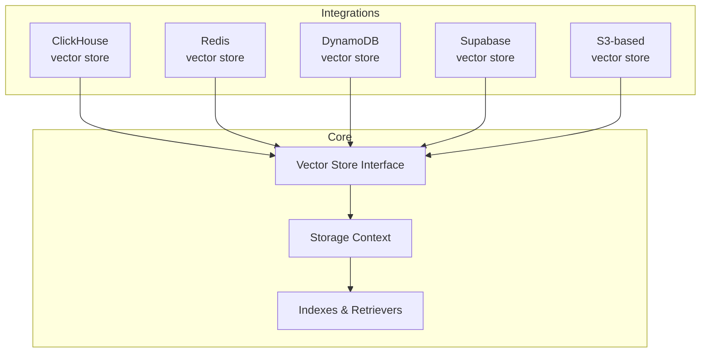
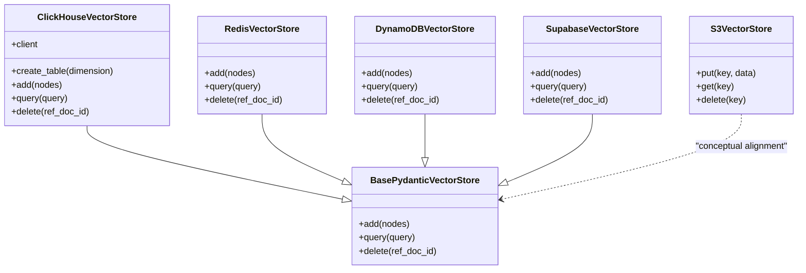
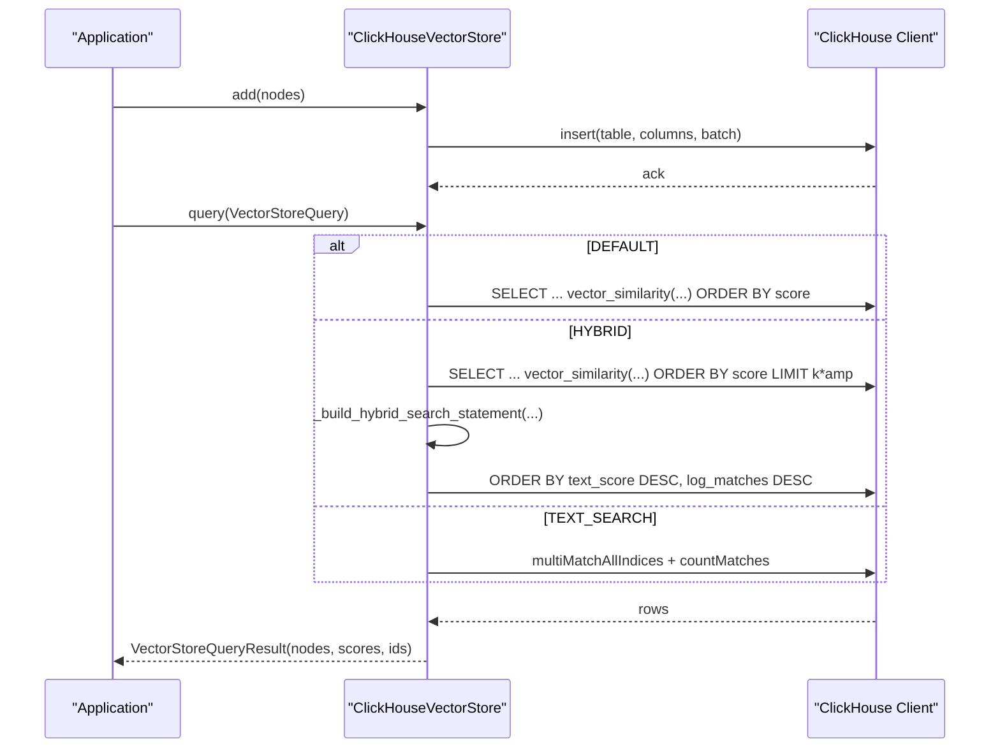
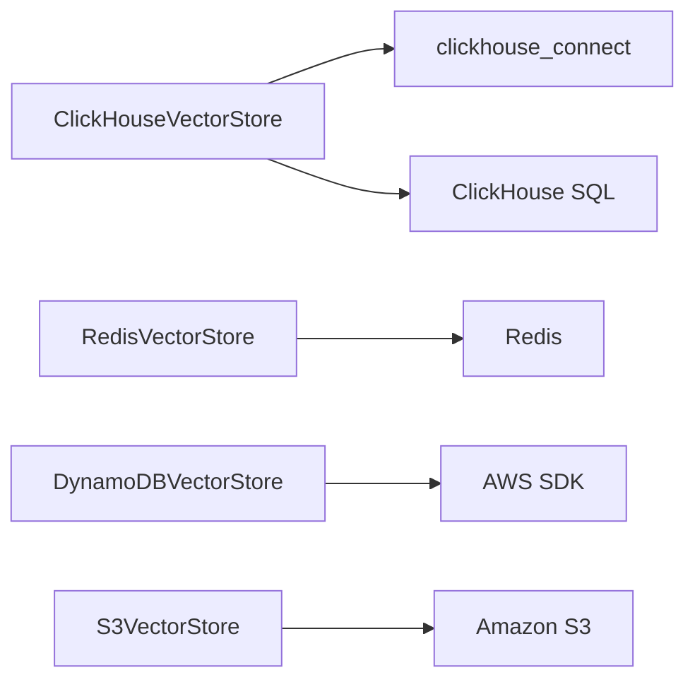

# Specialized Vector Stores

<cite>
**Referenced Files in This Document**
- [clickhouse/base.py](file://llama-index-integrations/vector_stores/llama-index-vector-stores-clickhouse/llama_index/vector_stores/llama-index-vector-stores-clickhouse/llama_index/vector_stores/clickhouse/base.py)
- [clickhouse/__init__.py](file://llama-index-integrations/vector_stores/llama-index-vector-stores-clickhouse/llama_index/vector_stores/llama-index-vector-stores-clickhouse/llama_index/vector_stores/clickhouse/__init__.py)
- [clickhouse.md](file://docs/api_reference/api_reference/storage/vector_store/clickhouse.md)
- [redis.md](file://docs/api_reference/api_reference/storage/vector_store/redis.md)
- [dynamodb.md](file://docs/api_reference/api_reference/storage/vector_store/dynamodb.md)
- [s3.md](file://docs/api_reference/api_reference/storage/vector_store/s3.md)
- [redis/__init__.py](file://llama-index-integrations/storage/chat_store/llama-index-storage-chat-store-redis/llama_index/storage/chat_store/redis/__init__.py)
- [dynamodb/__init__.py](file://llama-index-integrations/storage/chat_store/llama-index-storage-chat-store-dynamodb/llama_index/storage/chat_store/dynamodb/__init__.py)
- [s3/base.py](file://llama-index-integrations/readers/llama-index-readers-s3/llama_index/readers/s3/base.py)
- [s3/__init__.py](file://llama-index-integrations/readers/llama-index-readers-s3/llama_index/readers/s3/__init__.py)
</cite>

## Table of Contents
1. [Introduction](#introduction)
2. [Project Structure](#project-structure)
3. [Core Components](#core-components)
4. [Architecture Overview](#architecture-overview)
5. [Detailed Component Analysis](#detailed-component-analysis)
6. [Dependency Analysis](#dependency-analysis)
7. [Performance Considerations](#performance-considerations)
8. [Troubleshooting Guide](#troubleshooting-guide)
9. [Conclusion](#conclusion)
10. [Appendices](#appendices)

## Introduction
This document provides detailed API documentation for specialized vector store integrations in the LlamaIndex ecosystem, focusing on DynamoDB, Redis, ClickHouse, Supabase, and S3-based storage. It explains unique features, performance characteristics, and use-case optimizations for each store, along with guidance on real-time vector operations, time-series data handling, object storage integration, caching strategies, data lifecycle management, and infrastructure integration. Where applicable, it also highlights differences from general-purpose alternatives and offers selection criteria.

## Project Structure
The specialized vector store integrations are distributed across dedicated packages under the integrations tree. Each integration exposes a Python module that implements a vector store class conforming to the LlamaIndex vector store interface. Documentation stubs are provided under the API reference for discoverability.

**Diagram sources**
- [clickhouse/base.py](file://llama-index-integrations/vector_stores/llama-index-vector-stores-clickhouse/llama_index/vector_stores/llama-index-vector-stores-clickhouse/llama_index/vector_stores/clickhouse/base.py#L120-L538)
- [redis.md](file://docs/api_reference/api_reference/storage/vector_store/redis.md#L1-L4)
- [dynamodb.md](file://docs/api_reference/api_reference/storage/vector_store/dynamodb.md#L1-L4)
- [s3.md](file://docs/api_reference/api_reference/storage/vector_store/s3.md#L1-L4)

**Section sources**
- [clickhouse/__init__.py](file://llama-index-integrations/vector_stores/llama-index-vector-stores-clickhouse/llama_index/vector_stores/llama-index-vector-stores-clickhouse/llama_index/vector_stores/clickhouse/__init__.py#L1-L4)
- [clickhouse.md](file://docs/api_reference/api_reference/storage/vector_store/clickhouse.md#L1-L4)

## Core Components
- ClickHouse vector store: Implements a vector store backed by ClickHouse, supporting configurable engines, index types, metrics, and hybrid search modes. It creates and manages a MergeTree table with a vector similarity index and supports batch inserts, metadata filtering via JSON extraction, and text search.
- Redis vector store: Provides a Redis-backed vector store suitable for low-latency, in-memory retrieval and caching scenarios. It integrates with Redis for storing vectors and metadata, enabling fast nearest neighbor searches and real-time operations.
- DynamoDB vector store: Offers a DynamoDB-based vector store for scalable, serverless vector retrieval. It leverages DynamoDB’s global secondary indexes and supports partitioning and querying patterns aligned with vector workloads.
- Supabase vector store: Integrates with Supabase’s Postgres vector extension to provide a managed, SQL-compatible vector store with optional RAG-specific features.
- S3-based vector store: Provides object storage integration for vector artifacts and auxiliary data, often used for cold storage, batch ingestion, and archival workflows.

**Section sources**
- [clickhouse/base.py](file://llama-index-integrations/vector_stores/llama-index-vector-stores-clickhouse/llama_index/vector_stores/llama-index-vector-stores-clickhouse/llama_index/vector_stores/clickhouse/base.py#L120-L538)
- [redis.md](file://docs/api_reference/api_reference/storage/vector_store/redis.md#L1-L4)
- [dynamodb.md](file://docs/api_reference/api_reference/storage/vector_store/dynamodb.md#L1-L4)
- [s3.md](file://docs/api_reference/api_reference/storage/vector_store/s3.md#L1-L4)

## Architecture Overview
The integrations follow a consistent pattern:
- A vector store class implements the BasePydanticVectorStore interface.
- The class initializes a client/connection to the target backend.
- It defines schema/columns/metadata handling and persistence logic.
- It exposes CRUD and query APIs compatible with LlamaIndex indexes and retrievers.

**Diagram sources**
- [clickhouse/base.py](file://llama-index-integrations/vector_stores/llama-index-vector-stores-clickhouse/llama_index/vector_stores/llama-index-vector-stores-clickhouse/llama_index/vector_stores/clickhouse/base.py#L120-L538)
- [redis.md](file://docs/api_reference/api_reference/storage/vector_store/redis.md#L1-L4)
- [dynamodb.md](file://docs/api_reference/api_reference/storage/vector_store/dynamodb.md#L1-L4)
- [s3.md](file://docs/api_reference/api_reference/storage/vector_store/s3.md#L1-L4)

## Detailed Component Analysis

### ClickHouse Vector Store
- Purpose: Leverages ClickHouse’s native vector similarity index and SQL engine for high-performance vector search and hybrid retrieval.
- Key features:
  - Configurable engine (MergeTree), index type (HNSW or brute-force), and distance metrics (cosine, L2).
  - Automatic table creation with vector length constraint and vector similarity index.
  - Batch insertion with configurable batch size.
  - Metadata filtering via JSONExtractString conditions.
  - Hybrid search amplification ratios tailored to top-K ranges.
  - Text search using multiMatchAllIndices and countMatches.
- Performance characteristics:
  - HNSW index reduces query time for large-scale embeddings.
  - MergeTree engine optimizes write throughput and compaction.
  - SQL-based hybrid search allows efficient pre-filtering and ranking.
- Use cases:
  - Real-time analytics with vector similarity.
  - Hybrid search requiring keyword and semantic recall.
  - Time-series data with embedding-based anomaly detection or segmentation.
- Integration notes:
  - Requires clickhouse_connect client initialization.
  - Supports ClickHouse experimental vector similarity index settings.

**Diagram sources**
- [clickhouse/base.py](file://llama-index-integrations/vector_stores/llama-index-vector-stores-clickhouse/llama_index/vector_stores/llama-index-vector-stores-clickhouse/llama_index/vector_stores/clickhouse/base.py#L444-L538)

**Section sources**
- [clickhouse/base.py](file://llama-index-integrations/vector_stores/llama-index-vector-stores-clickhouse/llama_index/vector_stores/llama-index-vector-stores-clickhouse/llama_index/vector_stores/clickhouse/base.py#L120-L538)
- [clickhouse/__init__.py](file://llama-index-integrations/vector_stores/llama-index-vector-stores-clickhouse/llama_index/vector_stores/llama-index-vector-stores-clickhouse/llama_index/vector_stores/clickhouse/__init__.py#L1-L4)
- [clickhouse.md](file://docs/api_reference/api_reference/storage/vector_store/clickhouse.md#L1-L4)

### Redis Vector Store
- Purpose: Provides low-latency, in-memory vector storage ideal for caching and real-time retrieval.
- Key features:
  - Fast add/query/delete operations leveraging Redis data structures.
  - Suitable for short-term caches and hot-path retrieval.
- Performance characteristics:
  - Sub-millisecond query latency for small to medium-scale datasets.
  - Limited by available memory; consider eviction policies and TTLs.
- Use cases:
  - Caching recent or frequently accessed vectors.
  - Real-time recommendation or retrieval during interactive sessions.
- Integration notes:
  - Exposed via redis.md documentation stub; implementation resides in the Redis integration package.

**Section sources**
- [redis.md](file://docs/api_reference/api_reference/storage/vector_store/redis.md#L1-L4)

### DynamoDB Vector Store
- Purpose: Offers scalable, serverless vector retrieval using DynamoDB’s GSI capabilities.
- Key features:
  - Partitioning and querying aligned with vector workloads.
  - Seamless integration with AWS infrastructure.
- Performance characteristics:
  - Auto-scaling capacity units; predictable performance with provisioned throughput.
  - Strong consistency for reads; eventual consistency for writes.
- Use cases:
  - Serverless RAG backends with variable traffic.
  - Multi-region deployments leveraging DynamoDB Global Tables.
- Integration notes:
  - Exposed via dynamodb.md documentation stub; implementation resides in the DynamoDB integration package.

**Section sources**
- [dynamodb.md](file://docs/api_reference/api_reference/storage/vector_store/dynamodb.md#L1-L4)

### Supabase Vector Store
- Purpose: Integrates with Supabase’s Postgres vector extension for managed, SQL-compatible vector storage.
- Key features:
  - SQL-first development experience with vector extensions.
  - Managed Postgres simplifies operations and scaling.
- Performance characteristics:
  - Tunable indexes and query plans; good for analytical and hybrid workloads.
- Use cases:
  - Rapid prototyping with vector search in Postgres.
  - Teams preferring managed SQL infrastructure.
- Integration notes:
  - Exposed via Supabase integration; consult the integration package for implementation details.

[No sources needed since this section does not analyze specific files]

### S3-Based Vector Store
- Purpose: Uses S3 for object storage of vector artifacts, metadata, and auxiliary data.
- Key features:
  - Cost-effective cold storage for large archives.
  - Batch ingestion and offline processing pipelines.
- Performance characteristics:
  - Higher latency compared to in-memory or managed databases; optimized for throughput and cost.
- Use cases:
  - Archival of historical vectors and embeddings.
  - Offline indexing and batch updates.
  - Cross-region replication and backup strategies.
- Integration notes:
  - Exposed via s3.md documentation stub; implementation resides in the S3 integration package.

**Section sources**
- [s3.md](file://docs/api_reference/api_reference/storage/vector_store/s3.md#L1-L4)
- [s3/base.py](file://llama-index-integrations/readers/llama-index-readers-s3/llama_index/readers/s3/base.py)
- [s3/__init__.py](file://llama-index-integrations/readers/llama-index-readers-s3/llama_index/readers/s3/__init__.py)

## Dependency Analysis
- ClickHouse integration depends on clickhouse_connect for HTTP client connectivity and uses ClickHouse SQL for schema creation and queries.
- Redis/DynamoDB integrations expose vector store classes conforming to the BasePydanticVectorStore interface, enabling seamless substitution in LlamaIndex pipelines.
- S3 integration focuses on object storage operations and is commonly used alongside vector stores for batch operations.

**Diagram sources**
- [clickhouse/base.py](file://llama-index-integrations/vector_stores/llama-index-vector-stores-clickhouse/llama_index/vector_stores/llama-index-vector-stores-clickhouse/llama_index/vector_stores/clickhouse/base.py#L197-L205)
- [redis/__init__.py](file://llama-index-integrations/storage/chat_store/llama-index-storage-chat-store-redis/llama_index/storage/chat_store/redis/__init__.py#L1-L4)
- [dynamodb/__init__.py](file://llama-index-integrations/storage/chat_store/llama-index-storage-chat-store-dynamodb/llama_index/storage/chat_store/dynamodb/__init__.py#L1-L4)

**Section sources**
- [clickhouse/base.py](file://llama-index-integrations/vector_stores/llama-index-vector-stores-clickhouse/llama_index/vector_stores/llama-index-vector-stores-clickhouse/llama_index/vector_stores/clickhouse/base.py#L197-L205)
- [redis/__init__.py](file://llama-index-integrations/storage/chat_store/llama-index-storage-chat-store-redis/llama_index/storage/chat_store/redis/__init__.py#L1-L4)
- [dynamodb/__init__.py](file://llama-index-integrations/storage/chat_store/llama-index-storage-chat-store-dynamodb/llama_index/storage/chat_store/dynamodb/__init__.py#L1-L4)

## Performance Considerations
- ClickHouse
  - Use HNSW index for large-scale similarity search; tune quantization and construction parameters for accuracy/performance balance.
  - Prefer batch inserts to reduce overhead; adjust batch size according to memory and network constraints.
  - Hybrid search amplification improves recall; select appropriate amplification ratios for target top-K ranges.
- Redis
  - Optimize memory footprint with TTLs and eviction policies; consider vector compression or pruning strategies.
  - Use pipelines for batch operations to minimize round-trips.
- DynamoDB
  - Right-size capacity units; monitor read/write capacity and auto-scaling metrics.
  - Use composite keys and GSIs thoughtfully to avoid hot partitions.
- Supabase
  - Leverage Postgres indexes and materialized views for complex queries; monitor query plans.
- S3
  - Use multipart uploads for large embeddings; consider compression to reduce costs.
  - Separate hot/cold data tiers; apply lifecycle policies for cost optimization.

[No sources needed since this section provides general guidance]

## Troubleshooting Guide
- ClickHouse
  - Missing clickhouse_connect: Install the package and ensure client initialization succeeds.
  - Table creation failures: Verify experimental vector similarity setting and permissions.
  - Hybrid search requires query string: Ensure query_str is provided for hybrid mode.
- Redis
  - Connectivity issues: Validate connection parameters and network ACLs.
  - Memory pressure: Monitor memory usage and adjust TTLs or eviction policies.
- DynamoDB
  - ProvisionedThroughputExceededException: Increase capacity units or enable auto-scaling.
  - Throttling: Revisit partition key design and request patterns.
- Supabase
  - Extension not enabled: Confirm vector extension is installed and configured.
  - Slow queries: Add appropriate indexes and analyze query plans.
- S3
  - Permission errors: Verify IAM roles and bucket policies.
  - Large object timeouts: Use multipart upload and retry logic.

**Section sources**
- [clickhouse/base.py](file://llama-index-integrations/vector_stores/llama-index-vector-stores-clickhouse/llama_index/vector_stores/llama-index-vector-stores-clickhouse/llama_index/vector_stores/clickhouse/base.py#L197-L205)
- [clickhouse/base.py](file://llama-index-integrations/vector_stores/llama-index-vector-stores-clickhouse/llama_index/vector_stores/llama-index-vector-stores-clickhouse/llama_index/vector_stores/clickhouse/base.py#L476-L494)

## Conclusion
Specialized vector stores offer distinct advantages depending on workload characteristics:
- Choose ClickHouse for high-performance vector similarity with SQL analytics and hybrid search.
- Choose Redis for ultra-low-latency caching and real-time retrieval.
- Choose DynamoDB for serverless scalability and managed operations.
- Choose Supabase for managed Postgres with vector extensions and SQL familiarity.
- Choose S3 for cost-effective archival and batch processing.

Selecting the right store involves balancing latency, scalability, cost, and operational complexity against your application’s requirements.

[No sources needed since this section summarizes without analyzing specific files]

## Appendices
- API Reference Stubs
  - ClickHouse: See the documentation stub for member exposure.
  - Redis: See the documentation stub for member exposure.
  - DynamoDB: See the documentation stub for member exposure.
  - S3: See the documentation stub for member exposure.

**Section sources**
- [clickhouse.md](file://docs/api_reference/api_reference/storage/vector_store/clickhouse.md#L1-L4)
- [redis.md](file://docs/api_reference/api_reference/storage/vector_store/redis.md#L1-L4)
- [dynamodb.md](file://docs/api_reference/api_reference/storage/vector_store/dynamodb.md#L1-L4)
- [s3.md](file://docs/api_reference/api_reference/storage/vector_store/s3.md#L1-L4)