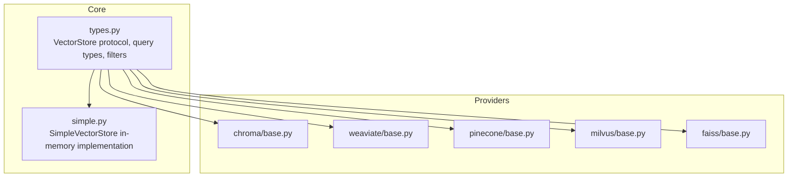
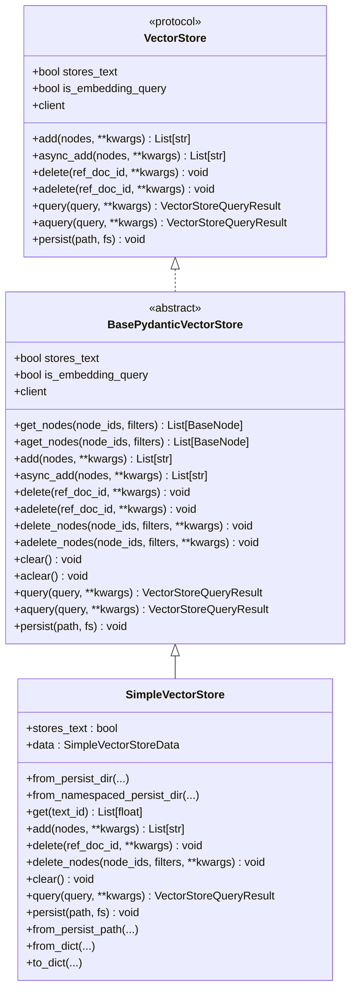
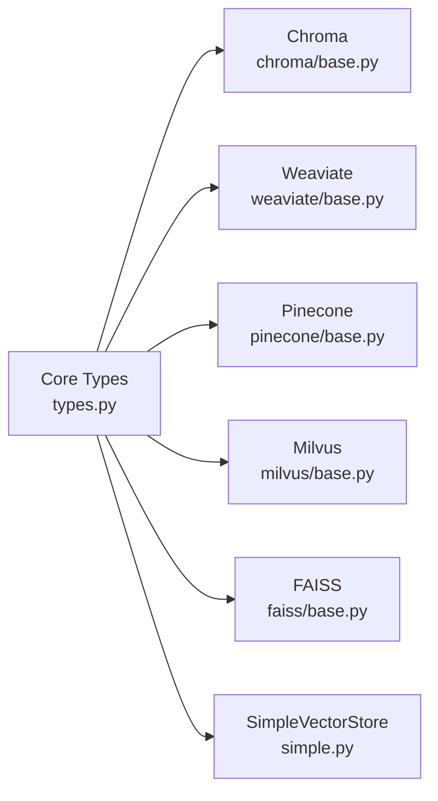

# Vector Store Integrations

<cite>
**Referenced Files in This Document**
- [types.py](file://llama-index-core/llama_index/core/vector_stores/types.py)
- [simple.py](file://llama-index-core/llama_index/core/vector_stores/simple.py)
- [base.py](file://llama-index-integrations/vector_stores/llama-index-vector-stores-chroma/llama_index/vector_stores/chroma/base.py)
- [base.py](file://llama-index-integrations/vector_stores/llama-index-vector-stores-weaviate/llama_index/vector_stores/weaviate/base.py)
- [base.py](file://llama-index-integrations/vector_stores/llama-index-vector-stores-pinecone/llama_index/vector_stores/pinecone/base.py)
- [base.py](file://llama-index-integrations/vector_stores/llama-index-vector-stores-milvus/llama_index/vector_stores/milvus/base.py)
- [base.py](file://llama-index-integrations/vector_stores/llama-index-vector-stores-faiss/llama_index/vector_stores/faiss/base.py)
- [vector_store.ipynb](file://docs/examples/low_level/vector_store.ipynb)
</cite>

## Table of Contents
1. [Introduction](#introduction)
2. [Project Structure](#project-structure)
3. [Core Components](#core-components)
4. [Architecture Overview](#architecture-overview)
5. [Detailed Component Analysis](#detailed-component-analysis)
6. [Dependency Analysis](#dependency-analysis)
7. [Performance Considerations](#performance-considerations)
8. [Troubleshooting Guide](#troubleshooting-guide)
9. [Conclusion](#conclusion)
10. [Appendices](#appendices)

## Introduction
This document provides comprehensive API documentation for vector store integrations in the LlamaIndex ecosystem. It covers the VectorStore interface, provider-specific implementations for Chroma, Weaviate, Pinecone, Milvus, and FAISS, and outlines indexing patterns, hybrid search capabilities, configuration options, similarity functions, metadata filtering, and strategies for scaling, backups, and migrations. It also includes guidance for implementing custom vector stores and optimizing search performance.

## Project Structure
The vector store system is composed of:
- A core abstraction and shared types under the core vector store module
- Provider-specific implementations under the integrations vector stores packages
- Examples demonstrating how to implement custom vector stores

**Diagram sources**
- [types.py](file://llama-index-core/llama_index/core/vector_stores/types.py#L268-L439)
- [simple.py](file://llama-index-core/llama_index/core/vector_stores/simple.py#L64-L355)
- [base.py](file://llama-index-integrations/vector_stores/llama-index-vector-stores-chroma/llama_index/vector_stores/chroma/base.py)
- [base.py](file://llama-index-integrations/vector_stores/llama-index-vector-stores-weaviate/llama_index/vector_stores/weaviate/base.py)
- [base.py](file://llama-index-integrations/vector_stores/llama-index-vector-stores-pinecone/llama_index/vector_stores/pinecone/base.py)
- [base.py](file://llama-index-integrations/vector_stores/llama-index-vector-stores-milvus/llama_index/vector_stores/milvus/base.py)
- [base.py](file://llama-index-integrations/vector_stores/llama-index-vector-stores-faiss/llama_index/vector_stores/faiss/base.py)

**Section sources**
- [types.py](file://llama-index-core/llama_index/core/vector_stores/types.py#L1-L439)
- [simple.py](file://llama-index-core/llama_index/core/vector_stores/simple.py#L1-L355)

## Core Components
This section defines the foundational abstractions and shared data structures used across all vector stores.

- VectorStore protocol
  - Defines the contract for adding, deleting, querying, and persisting vectors
  - Supports synchronous and asynchronous operations
  - Exposes a client property and a stores_text flag indicating whether raw text is stored
  - Includes optional persistence hooks

- BasePydanticVectorStore
  - A Pydantic-backed base class implementing the protocol with additional convenience methods
  - Provides get_nodes, delete_nodes, clear, and async variants
  - Enforces abstract method signatures for provider implementations

- VectorStoreQuery and related types
  - VectorStoreQuery encapsulates the query embedding, top-k selection, filters, modes, and hybrid parameters
  - VectorStoreQueryMode enumerates supported modes including DEFAULT, SPARSE, HYBRID, TEXT_SEARCH, SEMANTIC_HYBRID, MMR, and learner-based modes
  - VectorStoreQueryResult carries returned nodes, similarities, and ids

- Metadata filtering
  - MetadataFilter supports rich operators (equality, comparison, membership, containment, text match, emptiness)
  - MetadataFilters composes multiple filters with logical conditions (AND, OR, NOT)
  - Legacy ExactMatchFilter remains for backward compatibility

- VectorStoreQuerySpec and VectorStoreInfo
  - Used by auto-retriever to describe supported metadata and content information

Key implementation references:
- Protocol and base class definitions: [types.py](file://llama-index-core/llama_index/core/vector_stores/types.py#L268-L439)
- Query/result types and enums: [types.py](file://llama-index-core/llama_index/core/vector_stores/types.py#L36-L266)
- Filters and operators: [types.py](file://llama-index-core/llama_index/core/vector_stores/types.py#L63-L149)

**Section sources**
- [types.py](file://llama-index-core/llama_index/core/vector_stores/types.py#L36-L266)
- [types.py](file://llama-index-core/llama_index/core/vector_stores/types.py#L268-L439)

## Architecture Overview
The vector store architecture separates concerns between the core abstraction and provider-specific implementations. The core defines the query model and filtering semantics, while providers implement storage, indexing, and retrieval specifics.

**Diagram sources**
- [types.py](file://llama-index-core/llama_index/core/vector_stores/types.py#L268-L439)
- [simple.py](file://llama-index-core/llama_index/core/vector_stores/simple.py#L64-L355)

**Section sources**
- [types.py](file://llama-index-core/llama_index/core/vector_stores/types.py#L268-L439)
- [simple.py](file://llama-index-core/llama_index/core/vector_stores/simple.py#L64-L355)

## Detailed Component Analysis

### VectorStore Interface and Query Model
- Purpose: Unified contract for vector operations across providers
- Core methods:
  - add(nodes, **kwargs): Persist nodes with embeddings; return node ids
  - delete(ref_doc_id, **kwargs): Remove all nodes for a given document id
  - query(query, **kwargs): Execute a VectorStoreQuery and return results
  - persist(path, fs): Persist current state to a path
  - Async variants: async_add, adelete, aquery, etc.
- Query model:
  - VectorStoreQuery includes embedding, similarity_top_k, doc_ids, node_ids, query_str, output_fields, embedding_field, mode, alpha, filters, mmr_threshold, sparse_top_k, hybrid_top_k
  - Modes: DEFAULT, SPARSE, HYBRID, TEXT_SEARCH, SEMANTIC_HYBRID, MMR, and learner-based modes
  - Hybrid search parameters: alpha (weight between BM25 and vector), sparse_top_k, hybrid_top_k

References:
- [types.py](file://llama-index-core/llama_index/core/vector_stores/types.py#L240-L266)
- [types.py](file://llama-index-core/llama_index/core/vector_stores/types.py#L45-L61)

**Section sources**
- [types.py](file://llama-index-core/llama_index/core/vector_stores/types.py#L45-L61)
- [types.py](file://llama-index-core/llama_index/core/vector_stores/types.py#L240-L266)

### Metadata Filtering and Operators
- MetadataFilter: key/value/operator triplet supporting equality, comparisons, membership, containment, text match, and emptiness checks
- MetadataFilters: compose filters with AND/OR/NOT conditions
- Legacy ExactMatchFilter: alias for backward compatibility

References:
- [types.py](file://llama-index-core/llama_index/core/vector_stores/types.py#L63-L149)

**Section sources**
- [types.py](file://llama-index-core/llama_index/core/vector_stores/types.py#L63-L149)

### SimpleVectorStore (In-Memory Implementation)
- Stores embeddings, text-to-ref_doc_id mapping, and metadata in-memory
- Supports persistence to JSON via persist/from_persist_path
- Implements query with multiple modes (DEFAULT, MMR, learner-based)
- Demonstrates how to implement BasePydanticVectorStore

Key behaviors:
- add: writes node embeddings and metadata
- delete/delete_nodes: removes by ref_doc_id or filtered node ids
- query: computes similarities and selects top-k per mode
- persist: writes JSON to a configurable path

References:
- [simple.py](file://llama-index-core/llama_index/core/vector_stores/simple.py#L64-L355)

**Section sources**
- [simple.py](file://llama-index-core/llama_index/core/vector_stores/simple.py#L64-L355)

### Chroma Vector Store
Provider-specific implementation for Chroma vector database.

Capabilities:
- Add, delete, query, and async variants
- Integration with Chroma collections
- Metadata filtering support aligned with core types

References:
- [base.py](file://llama-index-integrations/vector_stores/llama-index-vector-stores-chroma/llama_index/vector_stores/chroma/base.py)

**Section sources**
- [base.py](file://llama-index-integrations/vector_stores/llama-index-vector-stores-chroma/llama_index/vector_stores/chroma/base.py)

### Weaviate Vector Store
Provider-specific implementation for Weaviate vector database.

Capabilities:
- Add, delete, query, and async variants
- Class prefix and node class naming conventions
- Rich metadata filtering translation to Weaviate GraphQL-like filters

References:
- [base.py](file://llama-index-integrations/vector_stores/llama-index-vector-stores-weaviate/llama_index/vector_stores/weaviate/base.py)

**Section sources**
- [base.py](file://llama-index-integrations/vector_stores/llama-index-vector-stores-weaviate/llama_index/vector_stores/weaviate/base.py)

### Pinecone Vector Store
Provider-specific implementation for Pinecone vector database.

Capabilities:
- Add, delete, query, and async variants
- Support for hybrid search parameters and metadata filtering
- Utility helpers for provider-specific operations

References:
- [base.py](file://llama-index-integrations/vector_stores/llama-index-vector-stores-pinecone/llama_index/vector_stores/pinecone/base.py)

**Section sources**
- [base.py](file://llama-index-integrations/vector_stores/llama-index-vector-stores-pinecone/llama_index/vector_stores/pinecone/base.py)

### Milvus Vector Store
Provider-specific implementation for Milvus vector database.

Capabilities:
- Add, delete, query, and async variants
- Metadata filtering and hybrid search support
- Utilities for provider-specific conversions

References:
- [base.py](file://llama-index-integrations/vector_stores/llama-index-vector-stores-milvus/llama_index/vector_stores/milvus/base.py)

**Section sources**
- [base.py](file://llama-index-integrations/vector_stores/llama-index-vector-stores-milvus/llama_index/vector_stores/milvus/base.py)

### FAISS Vector Store
Provider-specific implementation for FAISS vector database.

Capabilities:
- Add, delete, query, and async variants
- Mapping store utilities for efficient lookups
- Reader/writer integration for FAISS indices

References:
- [base.py](file://llama-index-integrations/vector_stores/llama-index-vector-stores-faiss/llama_index/vector_stores/faiss/base.py)

**Section sources**
- [base.py](file://llama-index-integrations/vector_stores/llama-index-vector-stores-faiss/llama_index/vector_stores/faiss/base.py)

### Implementing a Custom Vector Store
The low-level example demonstrates how to subclass the base vector store abstraction and implement required methods.

Implementation steps:
- Subclass BaseVectorStore or BasePydanticVectorStore
- Implement add, delete, query, and optionally get_nodes, delete_nodes, clear, persist
- Define stores_text and expose a client property
- Optionally implement async variants

References:
- [vector_store.ipynb](file://docs/examples/low_level/vector_store.ipynb#L178-L569)

**Section sources**
- [vector_store.ipynb](file://docs/examples/low_level/vector_store.ipynb#L178-L569)

## Dependency Analysis
Vector store implementations depend on the core VectorStore protocol and shared query/filter types. Providers integrate with external libraries (e.g., chromadb, weaviate-client, pinecone, milvus, faiss) while adhering to the unified interface.

**Diagram sources**
- [types.py](file://llama-index-core/llama_index/core/vector_stores/types.py#L268-L439)
- [base.py](file://llama-index-integrations/vector_stores/llama-index-vector-stores-chroma/llama_index/vector_stores/chroma/base.py)
- [base.py](file://llama-index-integrations/vector_stores/llama-index-vector-stores-weaviate/llama_index/vector_stores/weaviate/base.py)
- [base.py](file://llama-index-integrations/vector_stores/llama-index-vector-stores-pinecone/llama_index/vector_stores/pinecone/base.py)
- [base.py](file://llama-index-integrations/vector_stores/llama-index-vector-stores-milvus/llama_index/vector_stores/milvus/base.py)
- [base.py](file://llama-index-integrations/vector_stores/llama-index-vector-stores-faiss/llama_index/vector_stores/faiss/base.py)
- [simple.py](file://llama-index-core/llama_index/core/vector_stores/simple.py#L64-L355)

**Section sources**
- [types.py](file://llama-index-core/llama_index/core/vector_stores/types.py#L268-L439)

## Performance Considerations
- Query modes and top-k selection
  - DEFAULT mode performs standard nearest neighbor search
  - MMR mode balances diversity and relevance using a threshold
  - Learner-based modes (SVM, logistic regression, linear regression) fit embeddings for ranking
- Hybrid search
  - Configure alpha to balance BM25 and vector scores
  - Use sparse_top_k and hybrid_top_k to tune recall and precision
- Metadata filtering
  - Prefer exact-match filters for performance; complex filters may require server-side evaluation
- Persistence and namespaces
  - SimpleVectorStore supports namespaced persistence for multi-tenant or multi-collection setups
- Async operations
  - Implement async variants where appropriate to reduce latency in high-throughput scenarios

[No sources needed since this section provides general guidance]

## Troubleshooting Guide
Common issues and resolutions:
- Missing client/library
  - Ensure provider SDKs are installed (e.g., chromadb, weaviate-client, pinecone, milvus, faiss)
- Empty or missing metadata
  - SimpleVectorStore raises an error if attempting to filter on stores persisted without metadata; rebuild the store with metadata enabled
- Incorrect collection or class configuration
  - Verify collection/class names and prefixes align with provider expectations
- Async fallback
  - Some providers do not implement async variants; the async methods fall back to sync operations

References:
- [simple.py](file://llama-index-core/llama_index/core/vector_stores/simple.py#L244-L315)

**Section sources**
- [simple.py](file://llama-index-core/llama_index/core/vector_stores/simple.py#L244-L315)

## Conclusion
The LlamaIndex vector store system provides a robust, extensible abstraction for integrating diverse vector databases. By leveraging the core protocol and shared query/filter types, providers like Chroma, Weaviate, Pinecone, Milvus, and FAISS deliver consistent APIs for ingestion, querying, and filtering. The SimpleVectorStore offers a practical baseline for development and testing. With careful configuration of hybrid search parameters, metadata filters, and persistence strategies, applications can achieve scalable and performant retrieval.

[No sources needed since this section summarizes without analyzing specific files]

## Appendices

### API Reference: VectorStore Protocol
- Methods
  - add(nodes, **kwargs) -> List[str]
  - async_add(nodes, **kwargs) -> List[str]
  - delete(ref_doc_id, **kwargs) -> None
  - adelete(ref_doc_id, **kwargs) -> None
  - query(query, **kwargs) -> VectorStoreQueryResult
  - aquery(query, **kwargs) -> VectorStoreQueryResult
  - persist(path, fs) -> None

References:
- [types.py](file://llama-index-core/llama_index/core/vector_stores/types.py#L268-L331)

**Section sources**
- [types.py](file://llama-index-core/llama_index/core/vector_stores/types.py#L268-L331)

### API Reference: BasePydanticVectorStore
- Methods
  - get_nodes(node_ids, filters) -> List[BaseNode]
  - aget_nodes(node_ids, filters) -> List[BaseNode]
  - add(nodes, **kwargs) -> List[str]
  - async_add(nodes, **kwargs) -> List[str]
  - delete(ref_doc_id, **kwargs) -> None
  - adelete(ref_doc_id, **kwargs) -> None
  - delete_nodes(node_ids, filters, **kwargs) -> None
  - adelete_nodes(node_ids, filters, **kwargs) -> None
  - clear() -> None
  - aclear() -> None
  - query(query, **kwargs) -> VectorStoreQueryResult
  - aquery(query, **kwargs) -> VectorStoreQueryResult
  - persist(path, fs) -> None

References:
- [types.py](file://llama-index-core/llama_index/core/vector_stores/types.py#L333-L439)

**Section sources**
- [types.py](file://llama-index-core/llama_index/core/vector_stores/types.py#L333-L439)

### API Reference: VectorStoreQuery and Modes
- Fields
  - query_embedding: Optional[List[float]]
  - similarity_top_k: int
  - doc_ids: Optional[List[str]]
  - node_ids: Optional[List[str]]
  - query_str: Optional[str]
  - output_fields: Optional[List[str]]
  - embedding_field: Optional[str]
  - mode: VectorStoreQueryMode
  - alpha: Optional[float]
  - filters: Optional[MetadataFilters]
  - mmr_threshold: Optional[float]
  - sparse_top_k: Optional[int]
  - hybrid_top_k: Optional[int]
- Modes
  - DEFAULT, SPARSE, HYBRID, TEXT_SEARCH, SEMANTIC_HYBRID, MMR, SVM, LOGISTIC_REGRESSION, LINEAR_REGRESSION

References:
- [types.py](file://llama-index-core/llama_index/core/vector_stores/types.py#L240-L266)
- [types.py](file://llama-index-core/llama_index/core/vector_stores/types.py#L45-L61)

**Section sources**
- [types.py](file://llama-index-core/llama_index/core/vector_stores/types.py#L240-L266)
- [types.py](file://llama-index-core/llama_index/core/vector_stores/types.py#L45-L61)

### API Reference: Metadata Filtering
- MetadataFilter
  - key: str
  - value: Union of strict types or lists
  - operator: FilterOperator
- MetadataFilters
  - filters: List[Union[MetadataFilter, ExactMatchFilter, MetadataFilters]]
  - condition: Optional[FilterCondition]

References:
- [types.py](file://llama-index-core/llama_index/core/vector_stores/types.py#L94-L149)

**Section sources**
- [types.py](file://llama-index-core/llama_index/core/vector_stores/types.py#L94-L149)

### Example: Implementing a Custom Vector Store
Follow the low-level example to subclass the base vector store and implement required methods.

References:
- [vector_store.ipynb](file://docs/examples/low_level/vector_store.ipynb#L178-L569)

**Section sources**
- [vector_store.ipynb](file://docs/examples/low_level/vector_store.ipynb#L178-L569)