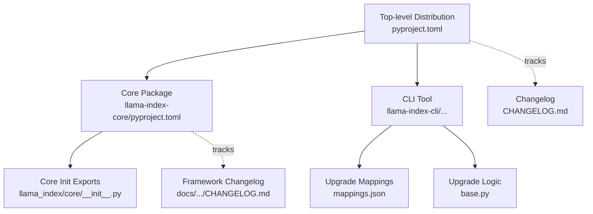
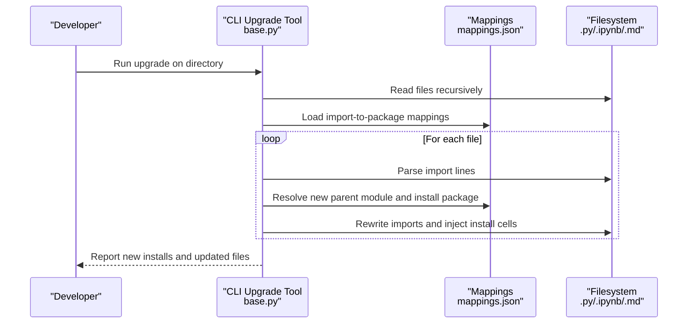
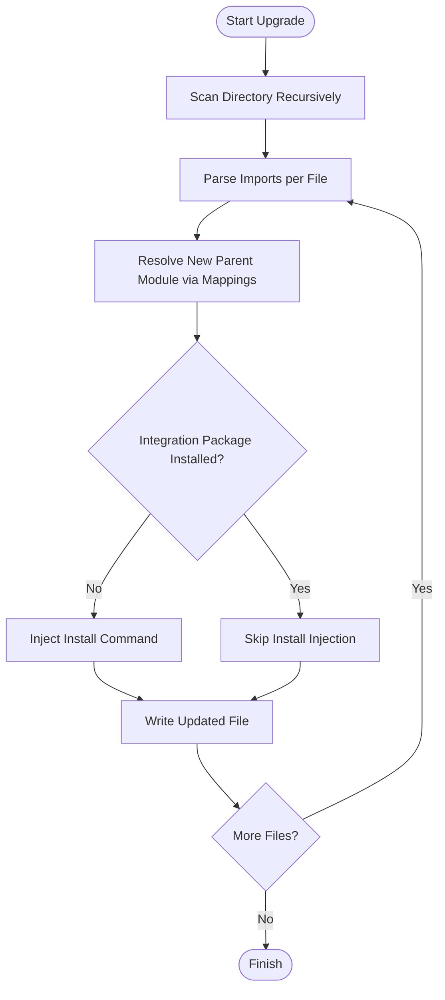
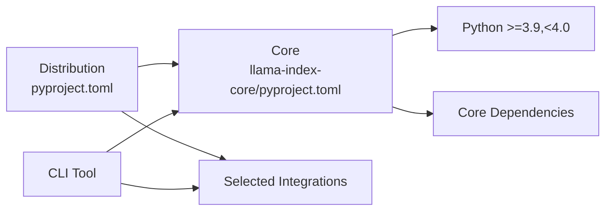

# Migration and Compatibility Guides

<cite>
**Referenced Files in This Document**
- [README.md](file://README.md)
- [CHANGELOG.md](file://CHANGELOG.md)
- [docs/src/content/docs/framework/CHANGELOG.md](file://docs/src/content/docs/framework/CHANGELOG.md)
- [pyproject.toml](file://pyproject.toml)
- [llama-index-core/pyproject.toml](file://llama-index-core/pyproject.toml)
- [llama-index-core/llama_index/core/__init__.py](file://llama-index-core/llama_index/core/__init__.py)
- [llama-index-cli/llama_index/cli/upgrade/base.py](file://llama-index-cli/llama_index/cli/upgrade/base.py)
- [llama-index-cli/llama_index/cli/upgrade/mappings.json](file://llama-index-cli/llama_index/cli/upgrade/mappings.json)
</cite>

## Table of Contents
1. [Introduction](#introduction)
2. [Project Structure](#project-structure)
3. [Core Components](#core-components)
4. [Architecture Overview](#architecture-overview)
5. [Detailed Component Analysis](#detailed-component-analysis)
6. [Dependency Analysis](#dependency-analysis)
7. [Performance Considerations](#performance-considerations)
8. [Troubleshooting Guide](#troubleshooting-guide)
9. [Conclusion](#conclusion)
10. [Appendices](#appendices)

## Introduction
This document provides comprehensive migration and compatibility guidance for LlamaIndex across API changes, version upgrades, and breaking changes. It focuses on:
- Migration paths from older versions to current releases
- Deprecated feature removal timelines and alternatives
- Backward compatibility considerations and compatibility shims
- Automated migration tools and CLI-based upgrade workflows
- Upgrade guides for major version changes, configuration updates, and API modifications
- Troubleshooting common migration issues and rollback procedures

## Project Structure
LlamaIndex is organized as a monorepo with:
- A top-level distribution package that aggregates core and selected integrations
- A dedicated core package that exposes the foundational APIs
- A CLI tool that automates migration of imports and integration installations
- Extensive changelogs and documentation that track breaking changes and deprecations

**Diagram sources**
- [pyproject.toml](file://pyproject.toml#L34-L73)
- [llama-index-core/pyproject.toml](file://llama-index-core/pyproject.toml#L33-L84)
- [llama-index-core/llama_index/core/__init__.py](file://llama-index-core/llama_index/core/__init__.py#L1-L162)
- [llama-index-cli/llama_index/cli/upgrade/base.py](file://llama-index-cli/llama_index/cli/upgrade/base.py#L1-L287)
- [llama-index-cli/llama_index/cli/upgrade/mappings.json](file://llama-index-cli/llama_index/cli/upgrade/mappings.json#L1-L1099)
- [CHANGELOG.md](file://CHANGELOG.md#L1-L200)
- [docs/src/content/docs/framework/CHANGELOG.md](file://docs/src/content/docs/framework/CHANGELOG.md#L1-L200)

**Section sources**
- [README.md](file://README.md#L1-L224)
- [pyproject.toml](file://pyproject.toml#L34-L73)
- [llama-index-core/pyproject.toml](file://llama-index-core/pyproject.toml#L33-L84)

## Core Components
- Top-level distribution package pins compatible versions of core and integrations, ensuring stability across major components.
- Core package exports a consolidated set of public APIs for indices, prompts, readers, embeddings, and related utilities.
- CLI upgrade tool automates migration of import statements and integration package installations.

Key migration-relevant elements:
- Version pinning and compatibility constraints in top-level and core package manifests
- Public API surface exported from core’s top-level initializer
- CLI upgrade mappings and logic for transforming legacy imports and installing required integration packages

**Section sources**
- [pyproject.toml](file://pyproject.toml#L34-L73)
- [llama-index-core/pyproject.toml](file://llama-index-core/pyproject.toml#L33-L84)
- [llama-index-core/llama_index/core/__init__.py](file://llama-index-core/llama_index/core/__init__.py#L1-L162)
- [llama-index-cli/llama_index/cli/upgrade/base.py](file://llama-index-cli/llama_index/cli/upgrade/base.py#L1-L287)
- [llama-index-cli/llama_index/cli/upgrade/mappings.json](file://llama-index-cli/llama_index/cli/upgrade/mappings.json#L1-L1099)

## Architecture Overview
The migration architecture centers on three pillars:
- Versioned distribution and core packages
- Automated import-to-package migrations via CLI
- Historical tracking of breaking changes and deprecations

**Diagram sources**
- [llama-index-cli/llama_index/cli/upgrade/base.py](file://llama-index-cli/llama_index/cli/upgrade/base.py#L116-L178)
- [llama-index-cli/llama_index/cli/upgrade/mappings.json](file://llama-index-cli/llama_index/cli/upgrade/mappings.json#L1-L1099)

## Detailed Component Analysis

### Automated Migration Tooling (CLI)
The CLI provides automated transformations for import statements and integration package installations:
- Parses import lines and resolves new parent modules using a mapping file
- Generates install commands for newly required integration packages
- Supports Python files, Jupyter notebooks, and Markdown files
- Skips or preserves unsupported constructs and handles grouped imports

**Diagram sources**
- [llama-index-cli/llama_index/cli/upgrade/base.py](file://llama-index-cli/llama_index/cli/upgrade/base.py#L116-L178)
- [llama-index-cli/llama_index/cli/upgrade/base.py](file://llama-index-cli/llama_index/cli/upgrade/base.py#L204-L287)

**Section sources**
- [llama-index-cli/llama_index/cli/upgrade/base.py](file://llama-index-cli/llama_index/cli/upgrade/base.py#L1-L287)
- [llama-index-cli/llama_index/cli/upgrade/mappings.json](file://llama-index-cli/llama_index/cli/upgrade/mappings.json#L1-L1099)

### Breaking Changes and Deprecations Timeline
Breaking changes and deprecations are tracked in the changelogs. Typical categories include:
- Removal of deprecated agent classes and pipeline components
- Removal of deprecated APIs (e.g., ServiceContext, LLMPredictor)
- Provider deprecations and removals (e.g., specific LLM providers)
- Filter syntax changes in vector stores
- Migration of older agent architectures to newer workflow-based agents

Common migration patterns:
- Replace deprecated agent classes with workflow-based agents
- Replace deprecated pipeline classes with current equivalents
- Update deprecated provider usage to supported alternatives
- Adjust filter syntax according to vector store updates

**Section sources**
- [CHANGELOG.md](file://CHANGELOG.md#L1000-L1100)
- [CHANGELOG.md](file://CHANGELOG.md#L1290-L1320)
- [CHANGELOG.md](file://CHANGELOG.md#L1640-L1700)
- [docs/src/content/docs/framework/CHANGELOG.md](file://docs/src/content/docs/framework/CHANGELOG.md#L1-L200)

### Backward Compatibility Shims
Backward compatibility is maintained through:
- Legacy import aliases and re-exports in the core package initializer
- Deprecated API markers and guidance printed upon usage
- CLI mappings that rewrite imports to modern locations

Practical implications:
- Existing imports from legacy locations may still resolve via core re-exports
- Deprecated APIs often print migration guidance and links to updated APIs
- CLI can automatically rewrite imports to new module locations

**Section sources**
- [llama-index-core/llama_index/core/__init__.py](file://llama-index-core/llama_index/core/__init__.py#L150-L162)
- [CHANGELOG.md](file://CHANGELOG.md#L5270-L5290)

### Upgrade Guides: Major Version Changes
Major version upgrades typically involve:
- Updating pinned versions in the top-level distribution manifest
- Aligning integration packages to compatible versions
- Running the CLI upgrade tool to transform imports and add install steps
- Validating changes against the changelog for breaking changes and deprecations

Recommended steps:
- Review top-level and core package version constraints
- Run CLI upgrade on your codebase
- Manually review and apply any remaining breaking changes not covered by the CLI
- Validate integrations and configurations

**Section sources**
- [pyproject.toml](file://pyproject.toml#L34-L73)
- [llama-index-core/pyproject.toml](file://llama-index-core/pyproject.toml#L33-L84)
- [llama-index-cli/llama_index/cli/upgrade/base.py](file://llama-index-cli/llama_index/cli/upgrade/base.py#L266-L287)

### Configuration Updates and API Modifications
Configuration updates commonly include:
- Settings and service context changes
- Prompt and response synthesizer adjustments
- Retriever and index engine API updates

Migration tips:
- Use the CLI to rewrite imports for affected modules
- Consult the changelog for specific API changes
- Test configuration changes incrementally

**Section sources**
- [CHANGELOG.md](file://CHANGELOG.md#L1-L200)
- [docs/src/content/docs/framework/CHANGELOG.md](file://docs/src/content/docs/framework/CHANGELOG.md#L1-L200)

## Dependency Analysis
Version constraints and compatibility:
- Top-level distribution pins core and integration versions to ensure compatibility
- Core package declares its own dependencies and supported Python versions
- CLI depends on core and integration packages for accurate mapping and installation

**Diagram sources**
- [pyproject.toml](file://pyproject.toml#L34-L73)
- [llama-index-core/pyproject.toml](file://llama-index-core/pyproject.toml#L33-L84)

**Section sources**
- [pyproject.toml](file://pyproject.toml#L34-L73)
- [llama-index-core/pyproject.toml](file://llama-index-core/pyproject.toml#L33-L84)

## Performance Considerations
- Prefer upgrading to compatible integration versions to avoid runtime overhead from compatibility shims
- Use the CLI to reduce manual effort and potential errors during migration
- Incrementally validate performance after migrating deprecated APIs and providers

## Troubleshooting Guide
Common migration issues and resolutions:
- Import resolution failures after migration
  - Use the CLI to rewrite imports and ensure integration packages are installed
  - Verify that mappings cover the specific imports in your codebase
- Deprecated API usage warnings
  - Follow the printed guidance and migrate to the recommended replacements
  - Check the changelog for the exact replacement APIs
- Provider deprecations
  - Replace deprecated provider usage with supported alternatives
  - Validate provider-specific configuration and credentials
- Filter syntax errors in vector stores
  - Update filter syntax according to the latest vector store updates
  - Confirm compatibility with the installed vector store version

Rollback procedures:
- Revert changes made by the CLI using version control
- Pin versions to the previously working distribution and core versions
- Temporarily disable or replace integrations causing issues until resolved

**Section sources**
- [llama-index-cli/llama_index/cli/upgrade/base.py](file://llama-index-cli/llama_index/cli/upgrade/base.py#L116-L178)
- [CHANGELOG.md](file://CHANGELOG.md#L1000-L1100)
- [CHANGELOG.md](file://CHANGELOG.md#L5270-L5290)

## Conclusion
LlamaIndex provides robust mechanisms for managing upgrades and maintaining compatibility:
- Automated CLI tooling simplifies import and package migrations
- Comprehensive changelogs document breaking changes and deprecations
- Version constraints in distribution and core packages ensure compatibility
- Backward compatibility shims and re-exports ease transitions

Adopting the CLI, reviewing changelogs, and validating incremental changes are key to successful migrations.

## Appendices
- Migration checklist
  - Review top-level and core version constraints
  - Run CLI upgrade on the entire codebase
  - Manually address remaining breaking changes not covered by the CLI
  - Validate integrations and configurations
  - Prepare rollback plan using version control

- Useful references
  - Top-level distribution manifest: [pyproject.toml](file://pyproject.toml#L34-L73)
  - Core package manifest: [llama-index-core/pyproject.toml](file://llama-index-core/pyproject.toml#L33-L84)
  - Core initializer exports: [llama_index/core/__init__.py](file://llama-index-core/llama_index/core/__init__.py#L1-L162)
  - CLI upgrade logic: [base.py](file://llama-index-cli/llama_index/cli/upgrade/base.py#L1-L287)
  - Upgrade mappings: [mappings.json](file://llama-index-cli/llama_index/cli/upgrade/mappings.json#L1-L1099)
  - Changelogs:
    - [CHANGELOG.md](file://CHANGELOG.md#L1-L200)
    - [docs/src/content/docs/framework/CHANGELOG.md](file://docs/src/content/docs/framework/CHANGELOG.md#L1-L200)