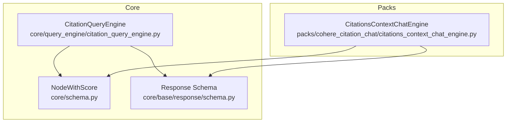
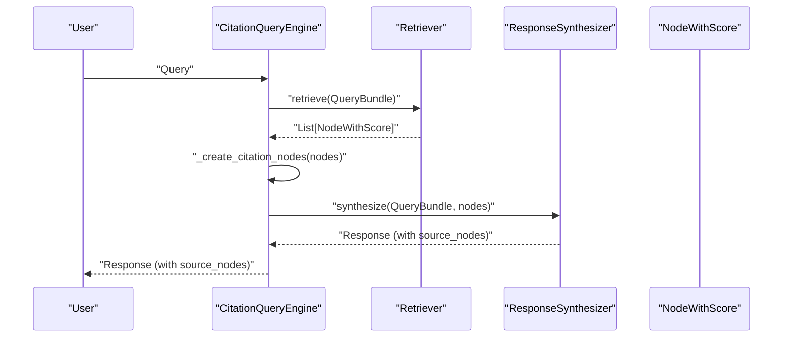
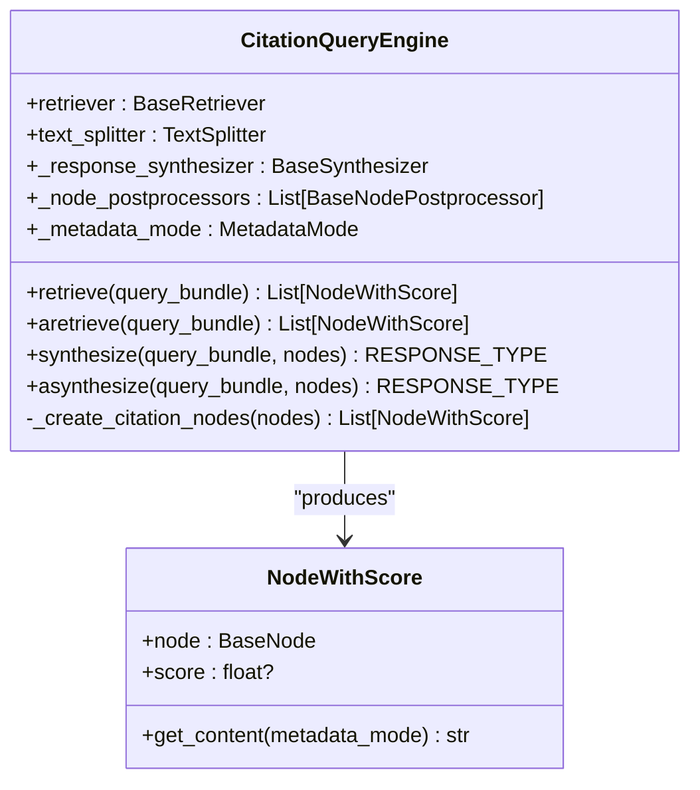
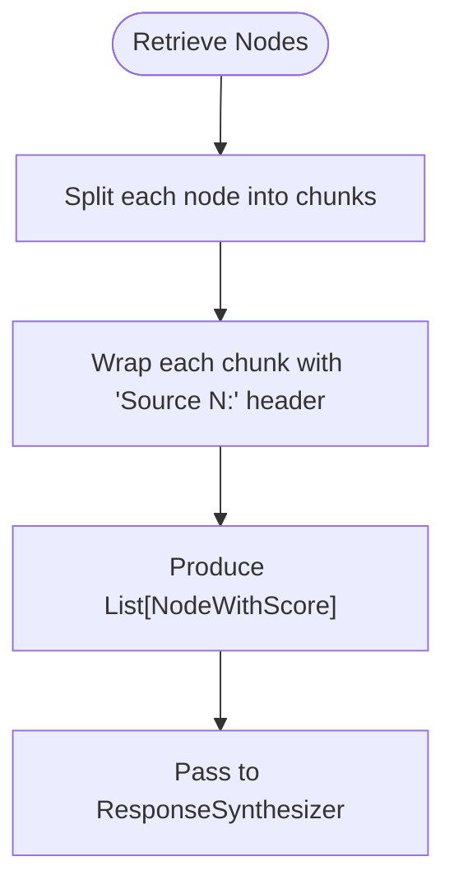
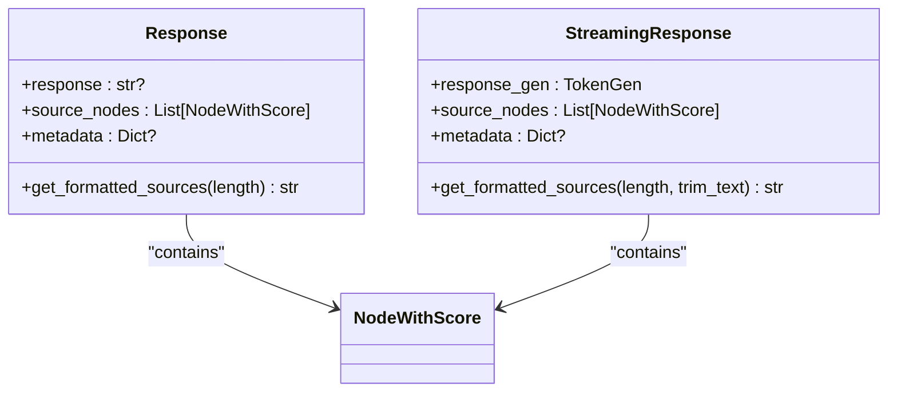
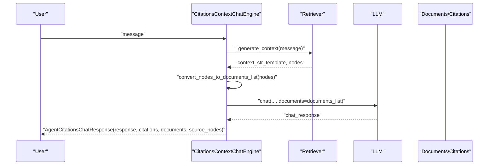
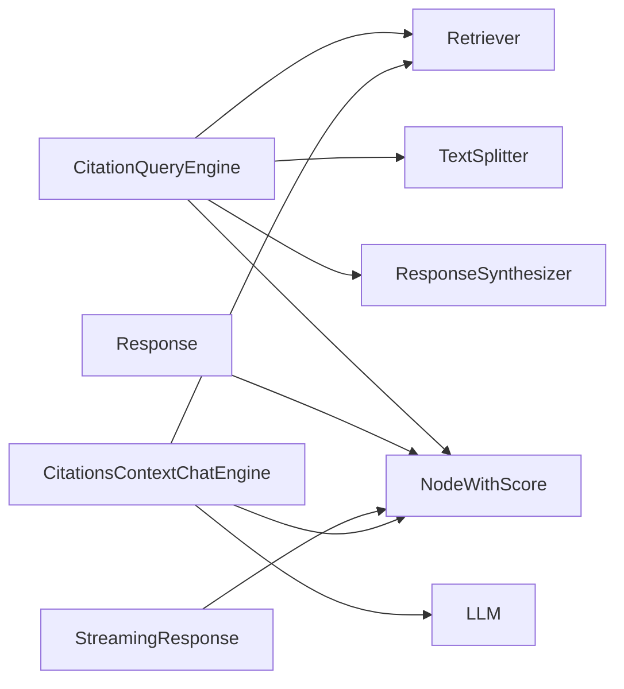

# Citation Management

<cite>
**Referenced Files in This Document**
- [citation_query_engine.py](file://llama-index-core/llama_index/core/query_engine/citation_query_engine.py)
- [schema.py](file://llama-index-core/llama_index/core/schema.py)
- [schema.py](file://llama-index-core/llama_index/core/base/response/schema.py)
- [citations_context_chat_engine.py](file://llama-index-packs/llama-index-packs-cohere-citation-chat/llama_index/packs/cohere_citation_chat/citations_context_chat_engine.py)
</cite>

## Table of Contents
1. [Introduction](#introduction)
2. [Project Structure](#project-structure)
3. [Core Components](#core-components)
4. [Architecture Overview](#architecture-overview)
5. [Detailed Component Analysis](#detailed-component-analysis)
6. [Dependency Analysis](#dependency-analysis)
7. [Performance Considerations](#performance-considerations)
8. [Troubleshooting Guide](#troubleshooting-guide)
9. [Conclusion](#conclusion)

## Introduction
This document describes the Citation Management system in the repository, focusing on how citations are generated, linked to responses, and tracked throughout the query lifecycle. It covers:
- Citation-aware query engines and source node handling
- Reference tracking via source nodes and response metadata
- Citation formatting and templates
- Practical guidance for building citation-aware systems and ensuring accuracy

## Project Structure
The Citation Management system spans core query engines, response schemas, and optional pack integrations:
- Core query engine for citation-aware retrieval and synthesis
- Response schema for returning structured responses with source nodes
- Optional pack for chat engines that emit citations and related documents

**Diagram sources**
- [citation_query_engine.py](file://llama-index-core/llama_index/core/query_engine/citation_query_engine.py#L83-L328)
- [schema.py](file://llama-index-core/llama_index/core/schema.py#L950-L1005)
- [schema.py](file://llama-index-core/llama_index/core/base/response/schema.py#L14-L242)
- [citations_context_chat_engine.py](file://llama-index-packs/llama-index-packs-cohere-citation-chat/llama_index/packs/cohere_citation_chat/citations_context_chat_engine.py#L266-L441)

**Section sources**
- [citation_query_engine.py](file://llama-index-core/llama_index/core/query_engine/citation_query_engine.py#L1-L328)
- [schema.py](file://llama-index-core/llama_index/core/schema.py#L950-L1005)
- [schema.py](file://llama-index-core/llama_index/core/base/response/schema.py#L14-L242)
- [citations_context_chat_engine.py](file://llama-index-packs/llama-index-packs-cohere-citation-chat/llama_index/packs/cohere_citation_chat/citations_context_chat_engine.py#L1-L441)

## Core Components
- CitationQueryEngine: A query engine that splits retrieved nodes into granular citation chunks, injects them into citation-focused prompts, and synthesizes answers with numbered citations.
- NodeWithScore: A wrapper around nodes and scores used to carry source information with responses.
- Response Schema: Standardized response containers that include source_nodes and metadata for downstream citation display and tracking.
- CitationsContextChatEngine (Pack): A chat engine variant that retrieves context, converts it to a documents list, and produces responses enriched with citations and related documents.

Key responsibilities:
- Splitting retrieved nodes into citation-sized chunks
- Formatting source nodes with numbered headers
- Passing nodes to a response synthesizer configured with citation templates
- Exposing source_nodes in responses for traceability and formatting

**Section sources**
- [citation_query_engine.py](file://llama-index-core/llama_index/core/query_engine/citation_query_engine.py#L83-L328)
- [schema.py](file://llama-index-core/llama_index/core/schema.py#L950-L1005)
- [schema.py](file://llama-index-core/llama_index/core/base/response/schema.py#L14-L242)
- [citations_context_chat_engine.py](file://llama-index-packs/llama-index-packs-cohere-citation-chat/llama_index/packs/cohere_citation_chat/citations_context_chat_engine.py#L266-L441)

## Architecture Overview
The Citation Management pipeline integrates retrieval, chunking, synthesis, and response packaging:

**Diagram sources**
- [citation_query_engine.py](file://llama-index-core/llama_index/core/query_engine/citation_query_engine.py#L236-L304)
- [schema.py](file://llama-index-core/llama_index/core/schema.py#L950-L1005)
- [schema.py](file://llama-index-core/llama_index/core/base/response/schema.py#L14-L242)

## Detailed Component Analysis

### CitationQueryEngine
CitationQueryEngine orchestrates citation-aware querying:
- Initialization: Accepts a retriever, optional LLM and response synthesizer, chunk size/overlap, text splitter, node postprocessors, and metadata mode.
- Retrieval: Retrieves nodes and optionally applies postprocessors.
- Chunking: Splits each retrieved node’s content into smaller chunks using a text splitter and wraps each chunk with a numbered “Source” header.
- Synthesis: Sends the citation-ready nodes to a response synthesizer configured with citation templates.
- Response: Returns a Response object containing the answer and source_nodes for traceability.

Implementation highlights:
- Citation templates enforce explicit numbering and require at least one citation per answer.
- Metadata inclusion is controlled via MetadataMode when extracting content for citation nodes.
- Supports synchronous and asynchronous retrieval and synthesis.

**Diagram sources**
- [citation_query_engine.py](file://llama-index-core/llama_index/core/query_engine/citation_query_engine.py#L83-L328)
- [schema.py](file://llama-index-core/llama_index/core/schema.py#L950-L1005)

**Section sources**
- [citation_query_engine.py](file://llama-index-core/llama_index/core/query_engine/citation_query_engine.py#L83-L328)

### Source Node Extraction and Citation Formatting
- Chunking: Each retrieved node is split into chunks sized by citation_chunk_size with overlap defined by citation_chunk_overlap.
- Numbered Sources: Each chunk is wrapped with a header indicating its source number, enabling precise referencing.
- Metadata Mode: Controls whether and how metadata is included in the extracted content for each citation node.

**Diagram sources**
- [citation_query_engine.py](file://llama-index-core/llama_index/core/query_engine/citation_query_engine.py#L217-L234)

**Section sources**
- [citation_query_engine.py](file://llama-index-core/llama_index/core/query_engine/citation_query_engine.py#L217-L234)

### Response Packaging and Reference Tracking
- Response containers include source_nodes and optional metadata, enabling downstream formatting and traceability.
- Formatters can render compact source listings with truncated content and identifiers.

**Diagram sources**
- [schema.py](file://llama-index-core/llama_index/core/base/response/schema.py#L14-L242)
- [schema.py](file://llama-index-core/llama_index/core/schema.py#L950-L1005)

**Section sources**
- [schema.py](file://llama-index-core/llama_index/core/base/response/schema.py#L14-L242)

### Citation-Aware Chat Engine (Pack)
The pack provides a chat engine variant that:
- Retrieves context from a retriever
- Converts context nodes into a documents list suitable for provider-specific citation modes
- Streams or returns responses enriched with citations and related documents
- Tracks source_nodes and provides structured citations alongside the answer

**Diagram sources**
- [citations_context_chat_engine.py](file://llama-index-packs/llama-index-packs-cohere-citation-chat/llama_index/packs/cohere_citation_chat/citations_context_chat_engine.py#L266-L441)

**Section sources**
- [citations_context_chat_engine.py](file://llama-index-packs/llama-index-packs-cohere-citation-chat/llama_index/packs/cohere_citation_chat/citations_context_chat_engine.py#L266-L441)

## Dependency Analysis
- CitationQueryEngine depends on:
  - Retriever for retrieving nodes
  - TextSplitter for chunking
  - ResponseSynthesizer configured with citation templates
  - NodeWithScore for carrying nodes and scores
- Response containers depend on NodeWithScore for source tracking
- Pack CitationsContextChatEngine depends on retriever and LLM, and exposes citations and documents alongside source_nodes

**Diagram sources**
- [citation_query_engine.py](file://llama-index-core/llama_index/core/query_engine/citation_query_engine.py#L83-L328)
- [schema.py](file://llama-index-core/llama_index/core/schema.py#L950-L1005)
- [schema.py](file://llama-index-core/llama_index/core/base/response/schema.py#L14-L242)
- [citations_context_chat_engine.py](file://llama-index-packs/llama-index-packs-cohere-citation-chat/llama_index/packs/cohere_citation_chat/citations_context_chat_engine.py#L266-L441)

**Section sources**
- [citation_query_engine.py](file://llama-index-core/llama_index/core/query_engine/citation_query_engine.py#L83-L328)
- [schema.py](file://llama-index-core/llama_index/core/schema.py#L950-L1005)
- [schema.py](file://llama-index-core/llama_index/core/base/response/schema.py#L14-L242)
- [citations_context_chat_engine.py](file://llama-index-packs/llama-index-packs-cohere-citation-chat/llama_index/packs/cohere_citation_chat/citations_context_chat_engine.py#L266-L441)

## Performance Considerations
- Chunk sizing: Adjust citation_chunk_size and citation_chunk_overlap to balance granularity and prompt length. Smaller chunks increase precision but may increase token usage.
- Metadata inclusion: Using MetadataMode.NONE reduces content size and speeds up synthesis when metadata is unnecessary.
- Postprocessing: Node postprocessors can filter or reorder nodes; keep them efficient to avoid slowing retrieval.
- Asynchronous paths: Prefer async retrieval and synthesis when integrating with async workflows to reduce latency.

## Troubleshooting Guide
Common issues and remedies:
- No citations in response:
  - Ensure the citation templates are being used by the response synthesizer.
  - Verify that nodes are being chunked and wrapped with “Source N:” headers.
- Missing source_nodes:
  - Confirm that source_nodes are populated during synthesis and that the response container is used to expose them.
- Overly large responses:
  - Reduce citation_chunk_size or enable metadata trimming in formatters.
- Streaming formatting:
  - Use get_formatted_sources on streaming responses to render compact source listings.

**Section sources**
- [citation_query_engine.py](file://llama-index-core/llama_index/core/query_engine/citation_query_engine.py#L257-L304)
- [schema.py](file://llama-index-core/llama_index/core/base/response/schema.py#L14-L242)

## Conclusion
The Citation Management system provides a robust, extensible framework for generating, linking, and tracking citations:
- CitationQueryEngine splits retrieved content into numbered citation chunks and synthesizes answers with explicit references.
- Response containers carry source_nodes for traceability and formatting.
- Optional pack integrations extend the capability to chat contexts with provider-specific citation and document streams.
Adopting best practices around chunk sizing, metadata control, and formatter usage ensures accurate, readable, and verifiable citations throughout the query lifecycle.