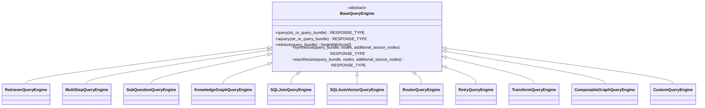

# Query Engines

<cite>
**Referenced Files in This Document**
- [base_query_engine.py](file://llama-index-core/llama_index/core/base/base_query_engine.py)
- [retriever_query_engine.py](file://llama-index-core/llama_index/core/query_engine/retriever_query_engine.py)
- [multistep_query_engine.py](file://llama-index-core/llama_index/core/query_engine/multistep_query_engine.py)
- [sub_question_query_engine.py](file://llama-index-core/llama_index/core/query_engine/sub_question_query_engine.py)
- [knowledge_graph_query_engine.py](file://llama-index-core/llama_index/core/query_engine/knowledge_graph_query_engine.py)
- [sql_join_query_engine.py](file://llama-index-core/llama_index/core/query_engine/sql_join_query_engine.py)
- [sql_vector_query_engine.py](file://llama-index-core/llama_index/core/query_engine/sql_vector_query_engine.py)
- [custom.py](file://llama-index-core/llama_index/core/query_engine/custom.py)
- [router_query_engine.py](file://llama-index-core/llama_index/core/query_engine/router_query_engine.py)
- [retry_query_engine.py](file://llama-index-core/llama_index/core/query_engine/retry_query_engine.py)
- [transform_query_engine.py](file://llama-index-core/llama_index/core/query_engine/transform_query_engine.py)
- [graph_query_engine.py](file://llama-index-core/llama_index/core/query_engine/graph_query_engine.py)
- [__init__.py](file://llama-index-core/llama_index/core/query_engine/__init__.py)
</cite>

## Table of Contents
1. [Introduction](#introduction)
2. [Project Structure](#project-structure)
3. [Core Components](#core-components)
4. [Architecture Overview](#architecture-overview)
5. [Detailed Component Analysis](#detailed-component-analysis)
6. [Dependency Analysis](#dependency-analysis)
7. [Performance Considerations](#performance-considerations)
8. [Troubleshooting Guide](#troubleshooting-guide)
9. [Conclusion](#conclusion)

## Introduction
This document provides comprehensive API documentation for Query Engines in the LlamaIndex ecosystem. It covers the BaseQueryEngine abstract class and all built-in implementations, including RetrieverQueryEngine, MultiStepQueryEngine, SubQuestionQueryEngine, KnowledgeGraphQueryEngine, and SQL-based engines (SQLJoinQueryEngine, SQLAutoVectorQueryEngine). It explains synchronous and asynchronous execution via query() and aquery(), query bundle processing, callback integration, and instrumentation. It also includes guidance for implementing custom query engines, configuring different engine types, handling complex query scenarios, performance optimization techniques, and error handling patterns.

## Project Structure
The query engine subsystem resides under the core module and exposes a unified interface for composing retrieval, synthesis, routing, transformation, and specialized engines. The public API surface is exported from the query engine package’s init file.

**Diagram sources**
- [base_query_engine.py](file://llama-index-core/llama_index/core/base/base_query_engine.py#L22-L94)
- [retriever_query_engine.py](file://llama-index-core/llama_index/core/query_engine/retriever_query_engine.py#L25-L226)
- [multistep_query_engine.py](file://llama-index-core/llama_index/core/query_engine/multistep_query_engine.py#L26-L179)
- [sub_question_query_engine.py](file://llama-index-core/llama_index/core/query_engine/sub_question_query_engine.py#L37-L279)
- [knowledge_graph_query_engine.py](file://llama-index-core/llama_index/core/query_engine/knowledge_graph_query_engine.py#L53-L269)
- [sql_join_query_engine.py](file://llama-index-core/llama_index/core/query_engine/sql_join_query_engine.py#L167-L352)
- [sql_vector_query_engine.py](file://llama-index-core/llama_index/core/query_engine/sql_vector_query_engine.py#L52-L176)
- [router_query_engine.py](file://llama-index-core/llama_index/core/query_engine/router_query_engine.py#L95-L398)
- [retry_query_engine.py](file://llama-index-core/llama_index/core/query_engine/retry_query_engine.py#L22-L147)
- [transform_query_engine.py](file://llama-index-core/llama_index/core/query_engine/transform_query_engine.py#L11-L95)
- [graph_query_engine.py](file://llama-index-core/llama_index/core/query_engine/graph_query_engine.py#L15-L132)
- [custom.py](file://llama-index-core/llama_index/core/query_engine/custom.py#L16-L78)

**Section sources**
- [__init__.py](file://llama-index-core/llama_index/core/query_engine/__init__.py#L1-L88)

## Core Components
- BaseQueryEngine: Defines the abstract interface for query engines, including synchronous query(), asynchronous aquery(), and optional retrieve()/synthesize()/asynthesize() hooks. It integrates callback tracing and instrumentation spans around query lifecycle events.
- RetrieverQueryEngine: Orchestrates retrieval and response synthesis via a retriever and a response synthesizer, with optional node post-processing and streaming support.
- MultiStepQueryEngine: Decomposes a query iteratively using a query transform, executes sub-queries against a base engine, aggregates results, and synthesizes a final response.
- SubQuestionQueryEngine: Generates sub-questions from a complex query, executes them across provided tools, aggregates results, and synthesizes a final response, supporting both synchronous and asynchronous execution.
- KnowledgeGraphQueryEngine: Deprecated engine that translates natural language queries into graph database queries, retrieves results, and synthesizes a final answer.
- SQLJoinQueryEngine: Chooses between querying a SQL database or another query engine, optionally augments the query with SQL results, and synthesizes a final response.
- SQLAutoVectorQueryEngine: Specialized SQL+Vector auto-retriever engine that selects between SQL and vector stores, augments queries, and synthesizes a final response.
- RouterQueryEngine: Selects one or more candidate engines based on metadata and query, executes them, and combines results via a summarizer.
- RetryQueryEngine: Wraps a query engine and retries with transformed queries if evaluation criteria fail.
- TransformQueryEngine: Applies a pre-defined query transform before delegating to another engine.
- ComposableGraphQueryEngine: Executes queries over a composable graph, optionally recursively traversing sub-indices and synthesizing results.
- CustomQueryEngine: A flexible base for building custom engines with custom_query()/acustom_query() methods.

**Section sources**
- [base_query_engine.py](file://llama-index-core/llama_index/core/base/base_query_engine.py#L22-L94)
- [retriever_query_engine.py](file://llama-index-core/llama_index/core/query_engine/retriever_query_engine.py#L25-L226)
- [multistep_query_engine.py](file://llama-index-core/llama_index/core/query_engine/multistep_query_engine.py#L26-L179)
- [sub_question_query_engine.py](file://llama-index-core/llama_index/core/query_engine/sub_question_query_engine.py#L37-L279)
- [knowledge_graph_query_engine.py](file://llama-index-core/llama_index/core/query_engine/knowledge_graph_query_engine.py#L53-L269)
- [sql_join_query_engine.py](file://llama-index-core/llama_index/core/query_engine/sql_join_query_engine.py#L167-L352)
- [sql_vector_query_engine.py](file://llama-index-core/llama_index/core/query_engine/sql_vector_query_engine.py#L52-L176)
- [router_query_engine.py](file://llama-index-core/llama_index/core/query_engine/router_query_engine.py#L95-L398)
- [retry_query_engine.py](file://llama-index-core/llama_index/core/query_engine/retry_query_engine.py#L22-L147)
- [transform_query_engine.py](file://llama-index-core/llama_index/core/query_engine/transform_query_engine.py#L11-L95)
- [graph_query_engine.py](file://llama-index-core/llama_index/core/query_engine/graph_query_engine.py#L15-L132)
- [custom.py](file://llama-index-core/llama_index/core/query_engine/custom.py#L16-L78)

## Architecture Overview
The query engine architecture centers on BaseQueryEngine, which standardizes synchronous and asynchronous execution, callback tracing, and instrumentation. Concrete engines compose retrieval, synthesis, transformation, selection, and routing capabilities.

**Diagram sources**
- [base_query_engine.py](file://llama-index-core/llama_index/core/base/base_query_engine.py#L22-L94)
- [retriever_query_engine.py](file://llama-index-core/llama_index/core/query_engine/retriever_query_engine.py#L25-L226)
- [multistep_query_engine.py](file://llama-index-core/llama_index/core/query_engine/multistep_query_engine.py#L26-L179)
- [sub_question_query_engine.py](file://llama-index-core/llama_index/core/query_engine/sub_question_query_engine.py#L37-L279)
- [knowledge_graph_query_engine.py](file://llama-index-core/llama_index/core/query_engine/knowledge_graph_query_engine.py#L53-L269)
- [sql_join_query_engine.py](file://llama-index-core/llama_index/core/query_engine/sql_join_query_engine.py#L167-L352)
- [sql_vector_query_engine.py](file://llama-index-core/llama_index/core/query_engine/sql_vector_query_engine.py#L52-L176)
- [router_query_engine.py](file://llama-index-core/llama_index/core/query_engine/router_query_engine.py#L95-L398)
- [retry_query_engine.py](file://llama-index-core/llama_index/core/query_engine/retry_query_engine.py#L22-L147)
- [transform_query_engine.py](file://llama-index-core/llama_index/core/query_engine/transform_query_engine.py#L11-L95)
- [graph_query_engine.py](file://llama-index-core/llama_index/core/query_engine/graph_query_engine.py#L15-L132)
- [custom.py](file://llama-index-core/llama_index/core/query_engine/custom.py#L16-L78)

## Detailed Component Analysis

### BaseQueryEngine
- Purpose: Abstract base class defining the contract for query engines, including synchronous and asynchronous entry points, optional retrieval and synthesis hooks, and instrumentation.
- Execution pattern:
  - query(): Normalizes input to a QueryBundle, traces the operation, delegates to _query(), and emits start/end events.
  - aquery(): Same as query() but for async via _aquery().
- Instrumentation: Uses dispatcher spans and callback manager tracing for query lifecycle events.
- Retrieval/Synthesis: Optional methods; engines that do not support them raise NotImplementedError.

**Section sources**
- [base_query_engine.py](file://llama-index-core/llama_index/core/base/base_query_engine.py#L22-L94)

### RetrieverQueryEngine
- Composition: Holds a retriever and a response synthesizer; supports optional node postprocessors and callback propagation.
- Execution:
  - retrieve(): Runs retriever and applies node postprocessors.
  - synthesize(): Delegates to response synthesizer with nodes and optional additional source nodes.
  - _query(): Retrieves nodes, synthesizes a response, and records events.
  - aquery(): Asynchronous variant using async retriever and async synthesizer.
- Configuration: from_args() allows constructing with LLM, response mode, templates, and streaming.

**Diagram sources**
- [retriever_query_engine.py](file://llama-index-core/llama_index/core/query_engine/retriever_query_engine.py#L148-L220)

**Section sources**
- [retriever_query_engine.py](file://llama-index-core/llama_index/core/query_engine/retriever_query_engine.py#L25-L226)

### MultiStepQueryEngine
- Purpose: Iteratively decomposes a query using a StepDecomposeQueryTransform, executes sub-queries against a base engine, aggregates results, and synthesizes a final response.
- Control flow:
  - _query_multistep(): Loop until early stop or step limit; collects sub-Q&A pairs and source nodes.
  - _combine_queries(): Applies transform with previous reasoning and index summary.
  - Early stopping: default stop function checks for a termination signal in the query string.
- Configuration: num_steps, early_stopping, index_summary, and custom stop_fn.

**Diagram sources**
- [multistep_query_engine.py](file://llama-index-core/llama_index/core/query_engine/multistep_query_engine.py#L126-L179)

**Section sources**
- [multistep_query_engine.py](file://llama-index-core/llama_index/core/query_engine/multistep_query_engine.py#L26-L179)

### SubQuestionQueryEngine
- Purpose: Breaks a complex query into sub-questions using a question generator, executes them across provided tools, aggregates results, and synthesizes a final response.
- Execution:
  - Synchronous: _query() generates sub-questions, optionally runs them synchronously, filters failures, constructs nodes, and synthesizes.
  - Asynchronous: _aquery() mirrors the process using asyncio gather.
  - Sub-question execution: _query_subq()/_aquery_subq() handle per-tool execution and event recording.
- Configuration: from_defaults() builds with LLM, question generator, and response synthesizer; supports verbose printing and async execution.

**Diagram sources**
- [sub_question_query_engine.py](file://llama-index-core/llama_index/core/query_engine/sub_question_query_engine.py#L134-L210)

**Section sources**
- [sub_question_query_engine.py](file://llama-index-core/llama_index/core/query_engine/sub_question_query_engine.py#L37-L279)

### KnowledgeGraphQueryEngine
- Purpose: Translates natural language queries into graph database queries, retrieves results, and synthesizes a final answer.
- Execution:
  - generate_query()/agenerate_query(): Use LLM to produce graph queries.
  - _retrieve()/_aretrieve(): Execute graph store query, format context, and return a node with metadata.
  - _query()/_aquery(): Retrieve graph context and synthesize final response.
- Deprecation: This engine is deprecated in favor of PropertyGraphIndex and associated retrievers.

**Section sources**
- [knowledge_graph_query_engine.py](file://llama-index-core/llama_index/core/query_engine/knowledge_graph_query_engine.py#L53-L269)

### SQLJoinQueryEngine
- Purpose: Decides whether to query a SQL database or another query engine, optionally augments the query with SQL results, and synthesizes a final response.
- Execution:
  - Selector: Uses an LLM-based selector to choose between SQL and other engine.
  - SQL path: Queries SQL tool, optionally transforms query with SQLAugmentQueryTransform, queries other engine, and synthesizes response (supports streaming).
  - Non-SQL path: Executes the other engine directly.
- Configuration: SQL join synthesis prompt, augmentation transform, verbosity, and streaming.

**Diagram sources**
- [sql_join_query_engine.py](file://llama-index-core/llama_index/core/query_engine/sql_join_query_engine.py#L328-L352)

**Section sources**
- [sql_join_query_engine.py](file://llama-index-core/llama_index/core/query_engine/sql_join_query_engine.py#L167-L352)

### SQLAutoVectorQueryEngine
- Purpose: Specialized engine combining SQL and vector auto-retrieval; validates tool types and reuses SQLJoinQueryEngine logic with vector auto-retriever.
- Configuration: from_sql_and_vector_query_engines() helper to construct tools from SQL and vector engines.

**Section sources**
- [sql_vector_query_engine.py](file://llama-index-core/llama_index/core/query_engine/sql_vector_query_engine.py#L52-L176)

### RouterQueryEngine
- Purpose: Selects one or more candidate engines based on metadata and query, executes them, and combines results via a summarizer.
- Execution:
  - Single selection: Executes chosen engine and attaches selector result metadata.
  - Multi-selection: Executes multiple engines concurrently (async), combines responses via TreeSummarize, and attaches selector results.
- Configuration: from_defaults() builds selector from LLM; supports verbose logging and multi-select.

**Diagram sources**
- [router_query_engine.py](file://llama-index-core/llama_index/core/query_engine/router_query_engine.py#L160-L248)

**Section sources**
- [router_query_engine.py](file://llama-index-core/llama_index/core/query_engine/router_query_engine.py#L95-L398)

### RetryQueryEngine
- Purpose: Wraps a query engine and retries with a transformed query if evaluation criteria fail.
- Execution:
  - Evaluates initial response; if failing, constructs a new RetryQueryEngine with reduced retries and a transformed query via FeedbackQueryTransformation.
  - Supports synchronous evaluation; asynchronous path falls back to synchronous.

**Section sources**
- [retry_query_engine.py](file://llama-index-core/llama_index/core/query_engine/retry_query_engine.py#L22-L147)

### TransformQueryEngine
- Purpose: Applies a BaseQueryTransform to a QueryBundle before delegating to another engine for retrieval, synthesis, or full query.
- Execution: Runs transform in retrieve(), synthesize(), and _query() paths.

**Section sources**
- [transform_query_engine.py](file://llama-index-core/llama_index/core/query_engine/transform_query_engine.py#L11-L95)

### ComposableGraphQueryEngine
- Purpose: Executes queries over a composable graph, optionally recursively traversing sub-indices and synthesizing results.
- Execution:
  - _query_index(): Resolves a query engine for a given index ID (custom or default), retrieves nodes, and synthesizes response.
  - Recursive traversal: If a node is an IndexNode, recursively queries the corresponding index and replaces the node with synthesized text.

**Section sources**
- [graph_query_engine.py](file://llama-index-core/llama_index/core/query_engine/graph_query_engine.py#L15-L132)

### CustomQueryEngine
- Purpose: A flexible base for building custom engines with custom_query()/acustom_query() methods. It normalizes inputs and wraps raw string responses into Response objects.
- Execution:
  - query(): Calls custom_query() and returns Response if input is string.
  - aquery(): Calls acustom_query() with default fallback to synchronous.

**Section sources**
- [custom.py](file://llama-index-core/llama_index/core/query_engine/custom.py#L16-L78)

## Dependency Analysis
- BaseQueryEngine is the central abstraction; all engines inherit from it.
- RetrieverQueryEngine depends on BaseRetriever and BaseSynthesizer; it optionally uses node postprocessors and response modes.
- MultiStepQueryEngine depends on StepDecomposeQueryTransform and a base query engine; it aggregates sub-responses.
- SubQuestionQueryEngine depends on a question generator and a collection of QueryEngineTool instances; it orchestrates multiple engines.
- SQLJoinQueryEngine depends on BaseSQLTableQueryEngine/NLSQLTableQueryEngine and a selector; it optionally streams synthesis.
- SQLAutoVectorQueryEngine specializes SQLJoinQueryEngine with VectorIndexAutoRetriever.
- RouterQueryEngine depends on BaseSelector and TreeSummarize; it supports both single and multi-selection.
- RetryQueryEngine depends on an evaluator and a query transformer.
- TransformQueryEngine depends on BaseQueryTransform and another engine.
- ComposableGraphQueryEngine depends on ComposableGraph and optional custom query engines per index.
- CustomQueryEngine depends on Pydantic BaseModel and Response types.

**Diagram sources**
- [base_query_engine.py](file://llama-index-core/llama_index/core/base/base_query_engine.py#L22-L94)
- [retriever_query_engine.py](file://llama-index-core/llama_index/core/query_engine/retriever_query_engine.py#L25-L226)
- [multistep_query_engine.py](file://llama-index-core/llama_index/core/query_engine/multistep_query_engine.py#L26-L179)
- [sub_question_query_engine.py](file://llama-index-core/llama_index/core/query_engine/sub_question_query_engine.py#L37-L279)
- [knowledge_graph_query_engine.py](file://llama-index-core/llama_index/core/query_engine/knowledge_graph_query_engine.py#L53-L269)
- [sql_join_query_engine.py](file://llama-index-core/llama_index/core/query_engine/sql_join_query_engine.py#L167-L352)
- [sql_vector_query_engine.py](file://llama-index-core/llama_index/core/query_engine/sql_vector_query_engine.py#L52-L176)
- [router_query_engine.py](file://llama-index-core/llama_index/core/query_engine/router_query_engine.py#L95-L398)
- [retry_query_engine.py](file://llama-index-core/llama_index/core/query_engine/retry_query_engine.py#L22-L147)
- [transform_query_engine.py](file://llama-index-core/llama_index/core/query_engine/transform_query_engine.py#L11-L95)
- [graph_query_engine.py](file://llama-index-core/llama_index/core/query_engine/graph_query_engine.py#L15-L132)
- [custom.py](file://llama-index-core/llama_index/core/query_engine/custom.py#L16-L78)

**Section sources**
- [__init__.py](file://llama-index-core/llama_index/core/query_engine/__init__.py#L1-L88)

## Performance Considerations
- Asynchronous execution: Prefer aquery() and async variants (e.g., RetrieverQueryEngine.aretrieve(), SubQuestionQueryEngine._aquery()) to overlap I/O-bound operations such as retrieval and synthesis.
- Streaming synthesis: SQLJoinQueryEngine supports streaming synthesis via LLM stream, reducing latency for long-form answers.
- Parallelism: SubQuestionQueryEngine and RouterQueryEngine support concurrent execution of sub-queries to reduce total latency.
- Early stopping: MultiStepQueryEngine supports early stopping to avoid unnecessary iterations.
- Selector efficiency: RouterQueryEngine relies on selectors; choosing efficient selectors and minimizing metadata size can improve selection speed.
- Node postprocessing: Limit heavy postprocessors or apply them selectively to reduce overhead.
- Evaluation retries: RetryQueryEngine can increase latency; tune max_retries and transformations carefully.

[No sources needed since this section provides general guidance]

## Troubleshooting Guide
- Missing retrieve/synthesize support: Engines that do not implement retrieve()/synthesize() will raise NotImplementedError when called; use query()/aquery() directly.
- Deprecated engines: KnowledgeGraphQueryEngine is deprecated; migrate to PropertyGraphIndex and associated retrievers.
- Selector validation: SQLAutoVectorQueryEngine requires specific tool types; ensure SQL tool uses BaseSQLTableQueryEngine/NLSQLTableQueryEngine and vector tool uses RetrieverQueryEngine with VectorIndexAutoRetriever.
- Async streaming responses: Some engines return AsyncStreamingResponse; ensure downstream consumers handle streaming appropriately.
- Logging and verbosity: Engines like SQLJoinQueryEngine and RouterQueryEngine support verbose logging; enable for diagnostics.
- Evaluation-based retries: RetryQueryEngine evaluates responses and may transform queries; verify evaluator configuration and feedback quality.

**Section sources**
- [base_query_engine.py](file://llama-index-core/llama_index/core/base/base_query_engine.py#L62-L85)
- [knowledge_graph_query_engine.py](file://llama-index-core/llama_index/core/query_engine/knowledge_graph_query_engine.py#L46-L52)
- [sql_vector_query_engine.py](file://llama-index-core/llama_index/core/query_engine/sql_vector_query_engine.py#L92-L112)
- [router_query_engine.py](file://llama-index-core/llama_index/core/query_engine/router_query_engine.py#L160-L248)
- [retry_query_engine.py](file://llama-index-core/llama_index/core/query_engine/retry_query_engine.py#L50-L75)

## Conclusion
Query Engines in LlamaIndex provide a robust, extensible framework for composing retrieval, synthesis, transformation, routing, and specialized capabilities. BaseQueryEngine defines a consistent interface for synchronous and asynchronous execution, instrumentation, and callback integration. Built-in engines cover common patterns—from simple retriever-driven synthesis to iterative decomposition, sub-question orchestration, SQL-vector fusion, and graph traversal—while CustomQueryEngine enables tailored implementations. By leveraging async execution, streaming, parallelism, and evaluation-based retries, developers can build high-performance, reliable query systems suited to complex scenarios.