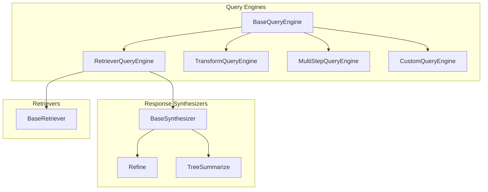
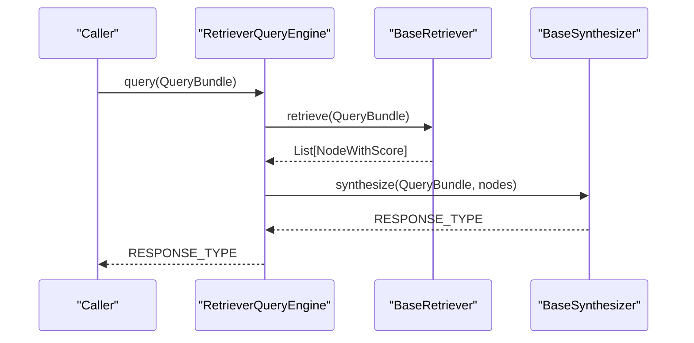
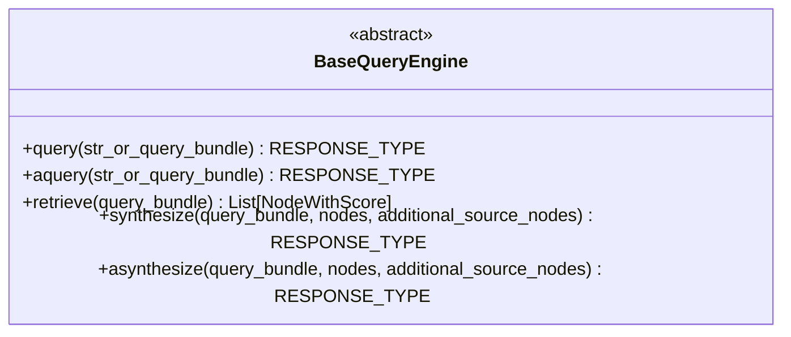
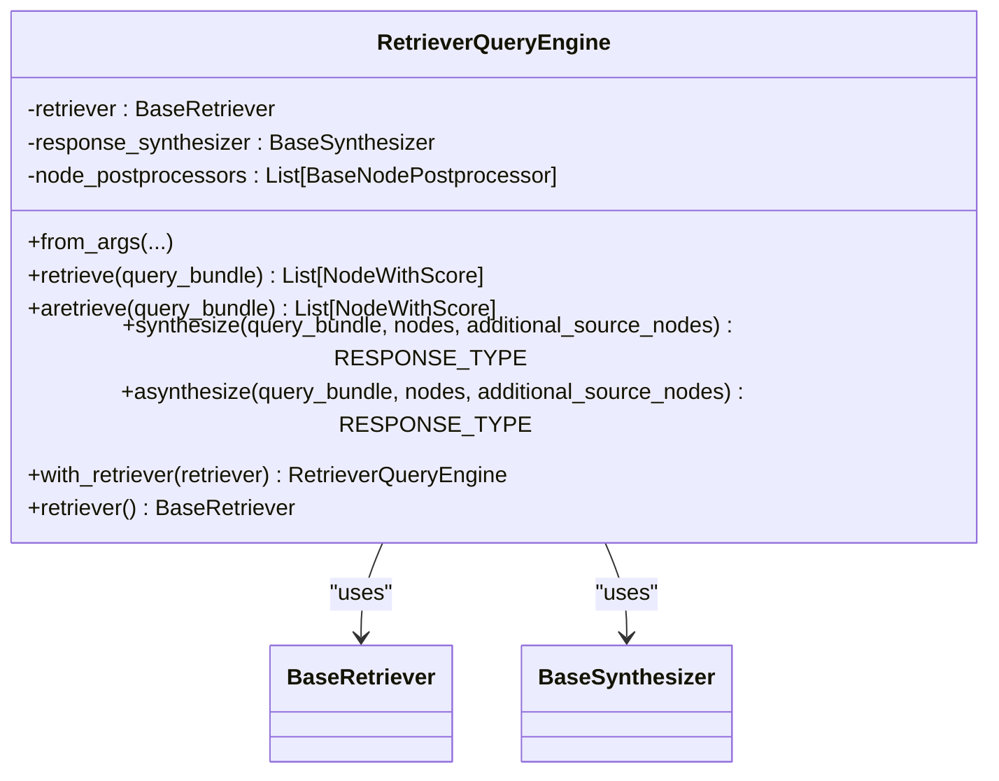
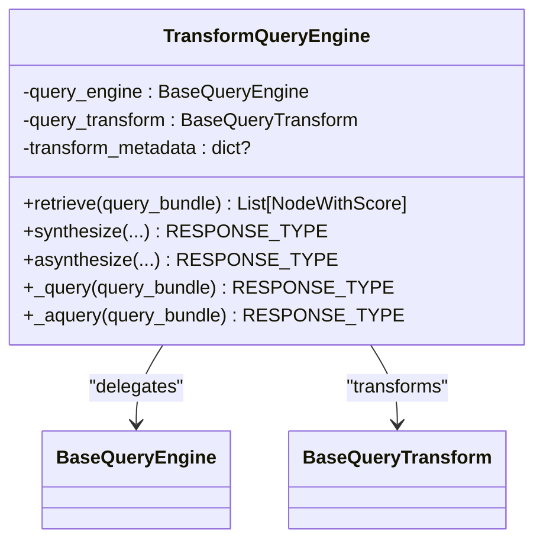
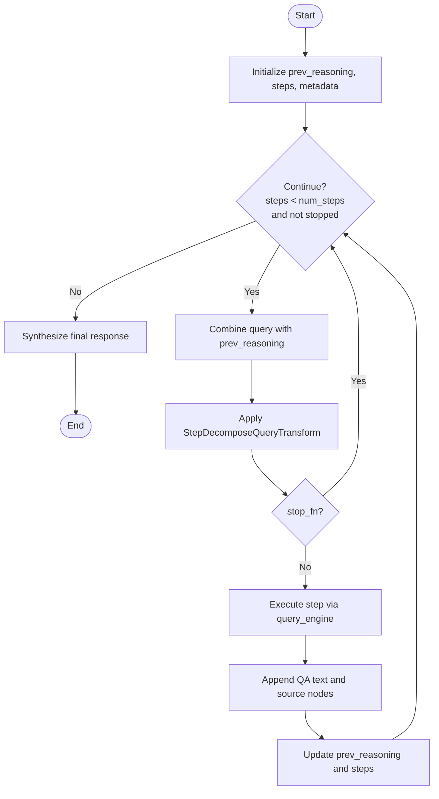
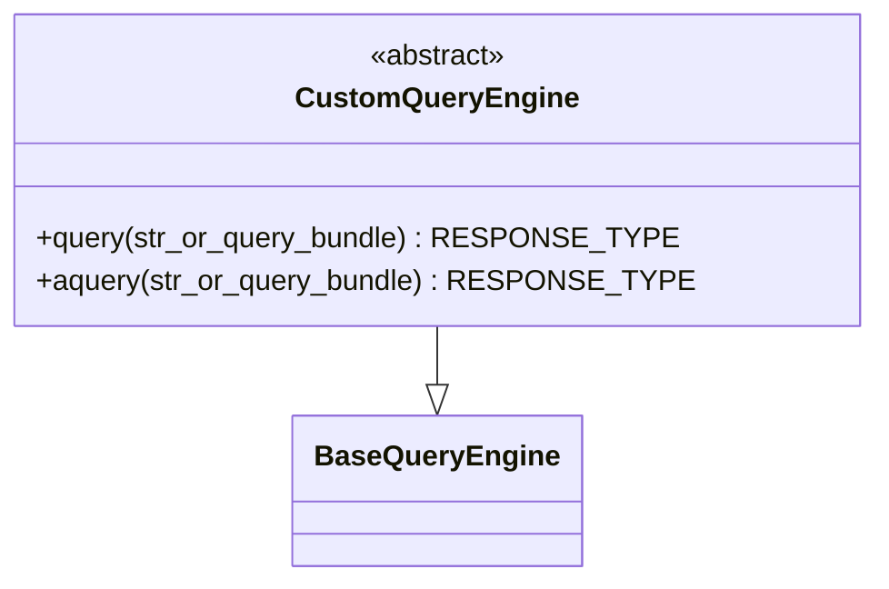
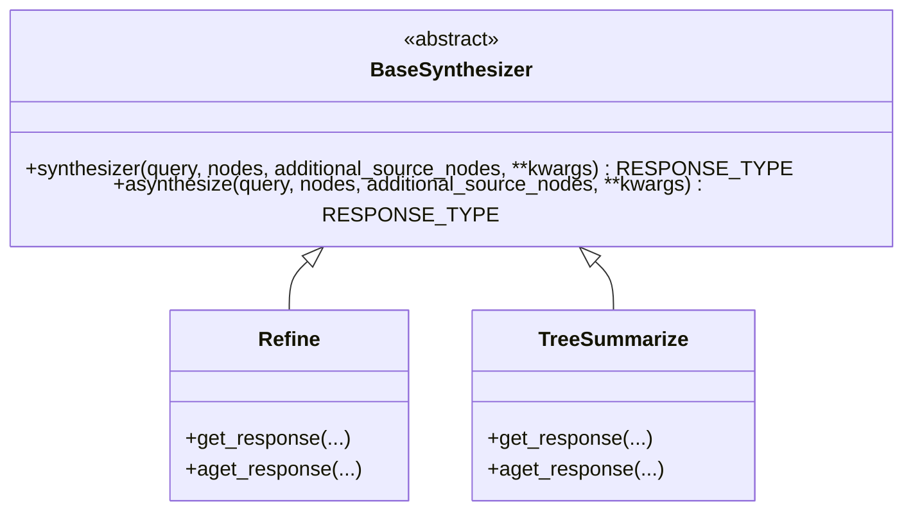
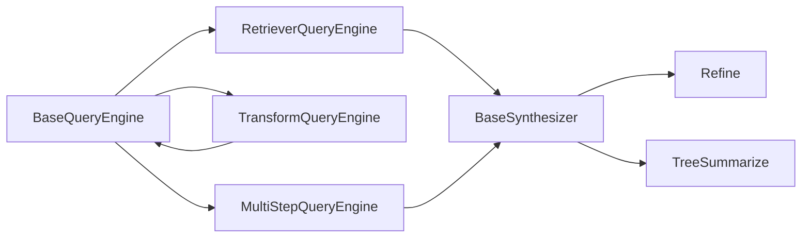

# Query Processing API

<cite>
**Referenced Files in This Document**
- [base_query_engine.py](file://llama-index-core/llama_index/core/base/base_query_engine.py)
- [__init__.py](file://llama-index-core/llama_index/core/query_engine/__init__.py)
- [custom.py](file://llama-index-core/llama_index/core/query_engine/custom.py)
- [multistep_query_engine.py](file://llama-index-core/llama_index/core/query_engine/multistep_query_engine.py)
- [transform_query_engine.py](file://llama-index-core/llama_index/core/query_engine/transform_query_engine.py)
- [retriever_query_engine.py](file://llama-index-core/llama_index/core/query_engine/retriever_query_engine.py)
- [base.py](file://llama-index-core/llama_index/core/response_synthesizers/base.py)
- [refine.py](file://llama-index-core/llama_index/core/response_synthesizers/refine.py)
- [tree_summarize.py](file://llama-index-core/llama_index/core/response_synthesizers/tree_summarize.py)
- [__init__.py](file://llama-index-core/llama_index/core/response_synthesizers/__init__.py)
</cite>

## Table of Contents
1. [Introduction](#introduction)
2. [Project Structure](#project-structure)
3. [Core Components](#core-components)
4. [Architecture Overview](#architecture-overview)
5. [Detailed Component Analysis](#detailed-component-analysis)
6. [Dependency Analysis](#dependency-analysis)
7. [Performance Considerations](#performance-considerations)
8. [Troubleshooting Guide](#troubleshooting-guide)
9. [Conclusion](#conclusion)
10. [Appendices](#appendices)

## Introduction
This document provides comprehensive API documentation for the Query Processing system. It covers the base QueryEngine interface, built-in query engine implementations, response synthesizer APIs, query transformation mechanisms, and multi-step query processing. It also documents citation handling, source node management, response formatting options, and the relationships among query engines, retrievers, and response synthesizers. Practical guidance is included for implementing custom query engines, configuring response synthesis, handling complex query scenarios, and optimizing performance.

## Project Structure
The Query Processing system centers around:
- Base Query Engine abstraction
- Built-in query engines (Retriever-based, Transform-based, Multi-step, Custom)
- Response synthesizers (BaseSynthesizer and concrete strategies)
- Query transformations and routers
- Retrievers and post-processors

**Diagram sources**
- [base_query_engine.py](file://llama-index-core/llama_index/core/base/base_query_engine.py#L22-L94)
- [retriever_query_engine.py](file://llama-index-core/llama_index/core/query_engine/retriever_query_engine.py#L25-L226)
- [transform_query_engine.py](file://llama-index-core/llama_index/core/query_engine/transform_query_engine.py#L11-L95)
- [multistep_query_engine.py](file://llama-index-core/llama_index/core/query_engine/multistep_query_engine.py#L26-L179)
- [custom.py](file://llama-index-core/llama_index/core/query_engine/custom.py#L16-L78)
- [base.py](file://llama-index-core/llama_index/core/response_synthesizers/base.py#L53-L322)
- [refine.py](file://llama-index-core/llama_index/core/response_synthesizers/refine.py#L108-L522)
- [tree_summarize.py](file://llama-index-core/llama_index/core/response_synthesizers/tree_summarize.py#L17-L231)

**Section sources**
- [__init__.py](file://llama-index-core/llama_index/core/query_engine/__init__.py#L1-L88)
- [__init__.py](file://llama-index-core/llama_index/core/response_synthesizers/__init__.py#L1-L26)

## Core Components
- BaseQueryEngine: Defines the asynchronous and synchronous query lifecycle, retrieval, and synthesis hooks. It emits instrumentation spans and integrates with a callback manager.
- ResponseSynthesizer: Abstract base for response generation strategies, supporting streaming, structured outputs, and metadata propagation.
- RetrieverQueryEngine: Bridges a retriever and a response synthesizer, applying optional node postprocessors.
- TransformQueryEngine: Wraps another query engine and applies a query transform before delegating.
- MultiStepQueryEngine: Iteratively decomposes a query via a transform, executes steps against a base engine, aggregates results, and synthesizes a final response.
- CustomQueryEngine: Allows implementing custom logic with a simple contract for synchronous and asynchronous queries.

Key capabilities:
- Unified query entry points: query(), aquery()
- Optional retrieve() and synthesize()/asynthesize() delegation
- Instrumentation and callback integration
- Response formatting and source node aggregation

**Section sources**
- [base_query_engine.py](file://llama-index-core/llama_index/core/base/base_query_engine.py#L22-L94)
- [base.py](file://llama-index-core/llama_index/core/response_synthesizers/base.py#L53-L322)
- [retriever_query_engine.py](file://llama-index-core/llama_index/core/query_engine/retriever_query_engine.py#L25-L226)
- [transform_query_engine.py](file://llama-index-core/llama_index/core/query_engine/transform_query_engine.py#L11-L95)
- [multistep_query_engine.py](file://llama-index-core/llama_index/core/query_engine/multistep_query_engine.py#L26-L179)
- [custom.py](file://llama-index-core/llama_index/core/query_engine/custom.py#L16-L78)

## Architecture Overview
The system orchestrates retrieval and synthesis through composable query engines. RetrieverQueryEngine is the most common pattern: it retrieves nodes and synthesizes a final response. TransformQueryEngine injects preprocessing into the pipeline. MultiStepQueryEngine iteratively refines answers across steps. CustomQueryEngine enables bespoke logic.

**Diagram sources**
- [retriever_query_engine.py](file://llama-index-core/llama_index/core/query_engine/retriever_query_engine.py#L190-L220)
- [base.py](file://llama-index-core/llama_index/core/response_synthesizers/base.py#L192-L256)

## Detailed Component Analysis

### BaseQueryEngine
- Responsibilities:
  - Enforces a unified query interface with synchronous and asynchronous variants.
  - Emits instrumentation spans and logs query lifecycle events.
  - Provides optional retrieve() and synthesize()/asynthesize() hooks.
- Important behaviors:
  - Converts string queries to QueryBundle internally.
  - Delegates to protected abstract methods _query/_aquery.
  - Integrates with callback manager and instrumentation dispatcher.

**Diagram sources**
- [base_query_engine.py](file://llama-index-core/llama_index/core/base/base_query_engine.py#L22-L94)

**Section sources**
- [base_query_engine.py](file://llama-index-core/llama_index/core/base/base_query_engine.py#L22-L94)

### RetrieverQueryEngine
- Purpose: Orchestrates retrieval and synthesis with optional post-processing.
- Key features:
  - Accepts a BaseRetriever and a BaseSynthesizer.
  - Applies node postprocessors before synthesis.
  - Provides a convenience constructor to build with response mode and templates.
  - Supports async retrieval and synthesis.

**Diagram sources**
- [retriever_query_engine.py](file://llama-index-core/llama_index/core/query_engine/retriever_query_engine.py#L25-L226)

**Section sources**
- [retriever_query_engine.py](file://llama-index-core/llama_index/core/query_engine/retriever_query_engine.py#L25-L226)

### TransformQueryEngine
- Purpose: Preprocesses the query bundle via a query transform before delegating to another query engine.
- Capabilities:
  - Applies transform to query for retrieve(), synthesize(), and _query().
  - Preserves callback manager propagation.

**Diagram sources**
- [transform_query_engine.py](file://llama-index-core/llama_index/core/query_engine/transform_query_engine.py#L11-L95)

**Section sources**
- [transform_query_engine.py](file://llama-index-core/llama_index/core/query_engine/transform_query_engine.py#L11-L95)

### MultiStepQueryEngine
- Purpose: Iteratively decomposes a query using a StepDecomposeQueryTransform, executes steps against a base engine, aggregates sub-results, and synthesizes a final response.
- Key parameters:
  - query_engine: BaseQueryEngine to execute each step.
  - query_transform: StepDecomposeQueryTransform to generate updated query bundles.
  - response_synthesizer: BaseSynthesizer for final aggregation.
  - num_steps, early_stopping, index_summary, stop_fn: Control iteration and stopping.
- Behavior:
  - Builds reasoning context across steps.
  - Aggregates sub-Q&A pairs and source nodes.
  - Propagates metadata to the final response.

**Diagram sources**
- [multistep_query_engine.py](file://llama-index-core/llama_index/core/query_engine/multistep_query_engine.py#L126-L179)

**Section sources**
- [multistep_query_engine.py](file://llama-index-core/llama_index/core/query_engine/multistep_query_engine.py#L26-L179)

### CustomQueryEngine
- Purpose: Enables custom query logic by implementing a simple contract.
- Methods:
  - custom_query(query_str) -> RESPONSE_TYPE | str
  - acustom_query(query_str) -> RESPONSE_TYPE | str (optional)
- Behavior:
  - Converts string inputs to QueryBundle internally.
  - Wraps raw string responses into Response objects.

**Diagram sources**
- [custom.py](file://llama-index-core/llama_index/core/query_engine/custom.py#L16-L78)
- [base_query_engine.py](file://llama-index-core/llama_index/core/base/base_query_engine.py#L22-L94)

**Section sources**
- [custom.py](file://llama-index-core/llama_index/core/query_engine/custom.py#L16-L78)

### Response Synthesizers
- BaseSynthesizer:
  - Abstract interface for response generation.
  - Supports streaming, structured outputs, and metadata propagation.
  - Handles empty-node cases and prepares Response/StreamingResponse/PydanticResponse objects.
- Refine:
  - Iteratively refines answers across chunks using a text-qa prompt and a refine prompt.
  - Supports structured answer filtering and async streaming.
- TreeSummarize:
  - Recursively summarizes chunks in a tree fashion, packing into context windows.
  - Supports async and structured outputs.

**Diagram sources**
- [base.py](file://llama-index-core/llama_index/core/response_synthesizers/base.py#L53-L322)
- [refine.py](file://llama-index-core/llama_index/core/response_synthesizers/refine.py#L108-L522)
- [tree_summarize.py](file://llama-index-core/llama_index/core/response_synthesizers/tree_summarize.py#L17-L231)

**Section sources**
- [base.py](file://llama-index-core/llama_index/core/response_synthesizers/base.py#L53-L322)
- [refine.py](file://llama-index-core/llama_index/core/response_synthesizers/refine.py#L108-L522)
- [tree_summarize.py](file://llama-index-core/llama_index/core/response_synthesizers/tree_summarize.py#L17-L231)

## Dependency Analysis
- Query engines depend on:
  - BaseQueryEngine for the core interface and instrumentation.
  - Response synthesizers for final response generation.
  - RetrieverQueryEngine depends on BaseRetriever and optional node postprocessors.
  - TransformQueryEngine depends on BaseQueryTransform.
  - MultiStepQueryEngine depends on StepDecomposeQueryTransform and a BaseSynthesizer.
- Response synthesizers depend on:
  - LLM for generation.
  - PromptHelper for context packing.
  - CallbackManager for event tracing.

**Diagram sources**
- [base_query_engine.py](file://llama-index-core/llama_index/core/base/base_query_engine.py#L22-L94)
- [retriever_query_engine.py](file://llama-index-core/llama_index/core/query_engine/retriever_query_engine.py#L25-L226)
- [transform_query_engine.py](file://llama-index-core/llama_index/core/query_engine/transform_query_engine.py#L11-L95)
- [multistep_query_engine.py](file://llama-index-core/llama_index/core/query_engine/multistep_query_engine.py#L26-L179)
- [base.py](file://llama-index-core/llama_index/core/response_synthesizers/base.py#L53-L322)
- [refine.py](file://llama-index-core/llama_index/core/response_synthesizers/refine.py#L108-L522)
- [tree_summarize.py](file://llama-index-core/llama_index/core/response_synthesizers/tree_summarize.py#L17-L231)

**Section sources**
- [__init__.py](file://llama-index-core/llama_index/core/query_engine/__init__.py#L1-L88)
- [__init__.py](file://llama-index-core/llama_index/core/response_synthesizers/__init__.py#L1-L26)

## Performance Considerations
- Asynchronous execution:
  - Prefer aquery() and asynthesize() for concurrent retrieval and synthesis.
  - Use RetrieverQueryEngine’s async retrieval and synthesis paths.
- Streaming responses:
  - Enable streaming in BaseSynthesizer subclasses to reduce latency and memory footprint.
- Prompt packing:
  - Response synthesizers rely on PromptHelper to pack chunks efficiently; ensure appropriate templates and chunk sizes.
- Multi-step iteration:
  - Configure num_steps and early stopping to balance quality and latency.
- Callback and instrumentation:
  - Use callback managers to trace and profile query and synthesis events.

[No sources needed since this section provides general guidance]

## Troubleshooting Guide
- Empty or missing responses:
  - BaseSynthesizer handles empty nodes by returning a default response or an empty stream depending on streaming mode.
- Validation errors in structured outputs:
  - Refine supports structured answer filtering; validation errors are logged and gracefully handled.
- Stop function behavior:
  - MultiStepQueryEngine’s stop function determines early termination; ensure it receives the expected metadata keys.

**Section sources**
- [base.py](file://llama-index-core/llama_index/core/response_synthesizers/base.py#L206-L226)
- [refine.py](file://llama-index-core/llama_index/core/response_synthesizers/refine.py#L249-L252)
- [multistep_query_engine.py](file://llama-index-core/llama_index/core/query_engine/multistep_query_engine.py#L17-L23)

## Conclusion
The Query Processing system offers a modular, extensible framework for retrieving relevant context and synthesizing high-quality responses. By composing BaseQueryEngine implementations with retrievers and response synthesizers, developers can implement robust, configurable query pipelines. The provided APIs enable custom logic, iterative refinement, transformation-driven preprocessing, and comprehensive instrumentation for performance monitoring.

[No sources needed since this section summarizes without analyzing specific files]

## Appendices

### API Reference Index
- BaseQueryEngine: query(), aquery(), retrieve(), synthesize(), asynthesize()
- RetrieverQueryEngine: from_args(), retrieve(), aretrieve(), synthesize(), asynthesize(), with_retriever(), retriever()
- TransformQueryEngine: retrieve(), synthesize(), asynthesize(), _query(), _aquery()
- MultiStepQueryEngine: _query(), _aquery(), _combine_queries(), _query_multistep()
- CustomQueryEngine: query(), aquery(), custom_query(), acustom_query()
- BaseSynthesizer: synthesize(), asynthesize(), get_response(), aget_response()
- Refine: get_response(), aget_response()
- TreeSummarize: get_response(), aget_response()

**Section sources**
- [base_query_engine.py](file://llama-index-core/llama_index/core/base/base_query_engine.py#L38-L94)
- [retriever_query_engine.py](file://llama-index-core/llama_index/core/query_engine/retriever_query_engine.py#L62-L226)
- [transform_query_engine.py](file://llama-index-core/llama_index/core/query_engine/transform_query_engine.py#L46-L95)
- [multistep_query_engine.py](file://llama-index-core/llama_index/core/query_engine/multistep_query_engine.py#L82-L179)
- [custom.py](file://llama-index-core/llama_index/core/query_engine/custom.py#L37-L78)
- [base.py](file://llama-index-core/llama_index/core/response_synthesizers/base.py#L192-L322)
- [refine.py](file://llama-index-core/llama_index/core/response_synthesizers/refine.py#L162-L522)
- [tree_summarize.py](file://llama-index-core/llama_index/core/response_synthesizers/tree_summarize.py#L134-L231)