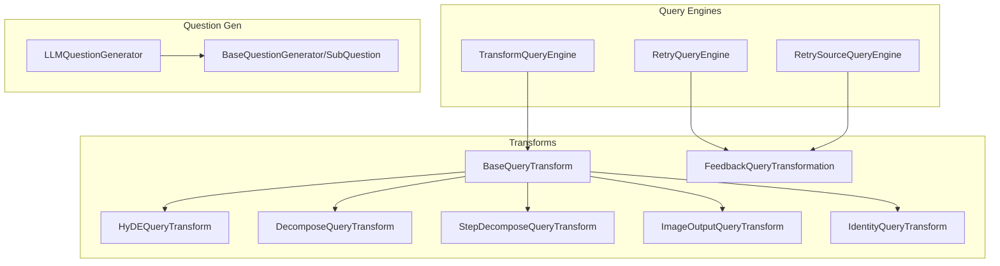
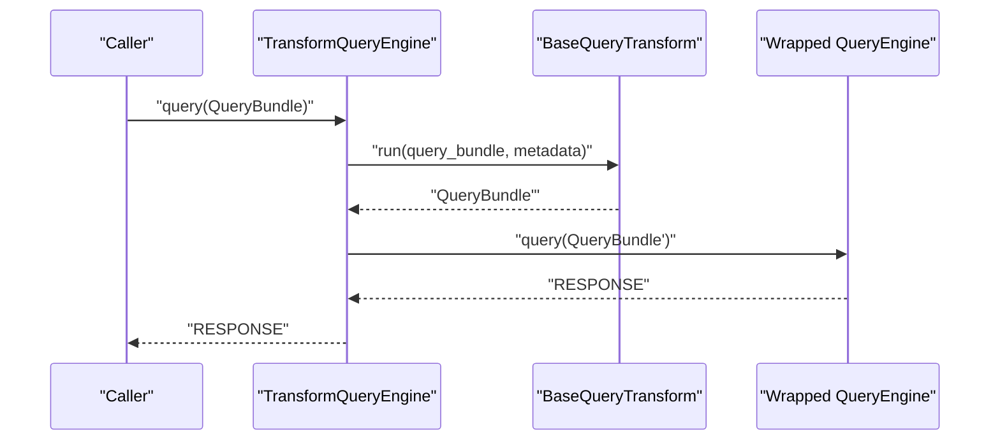
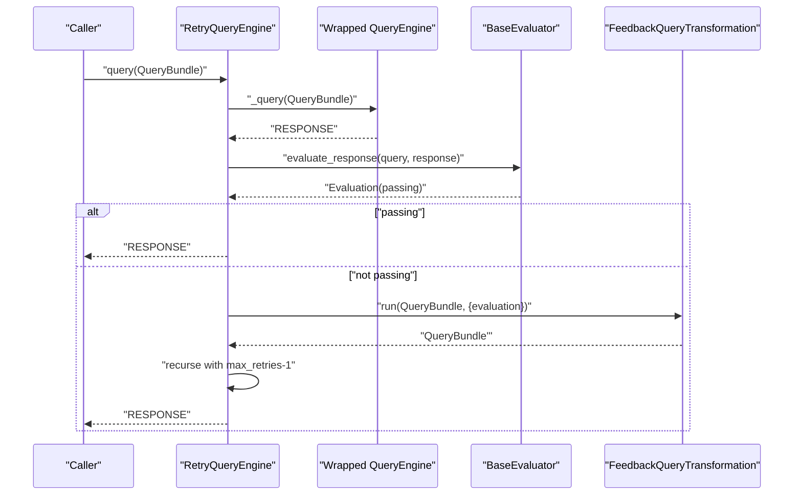
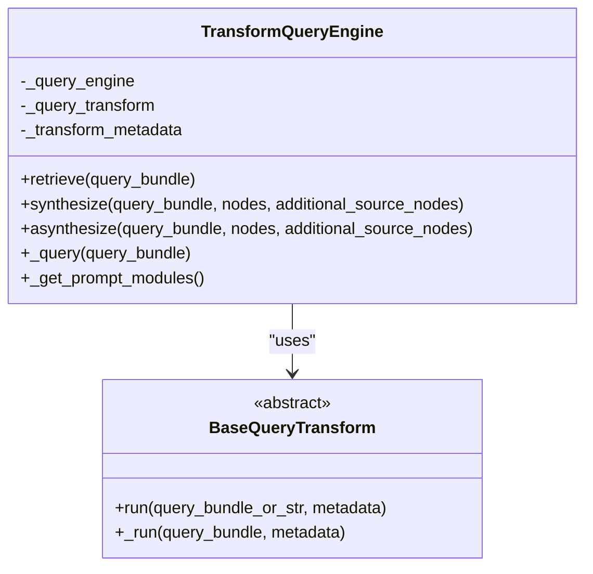
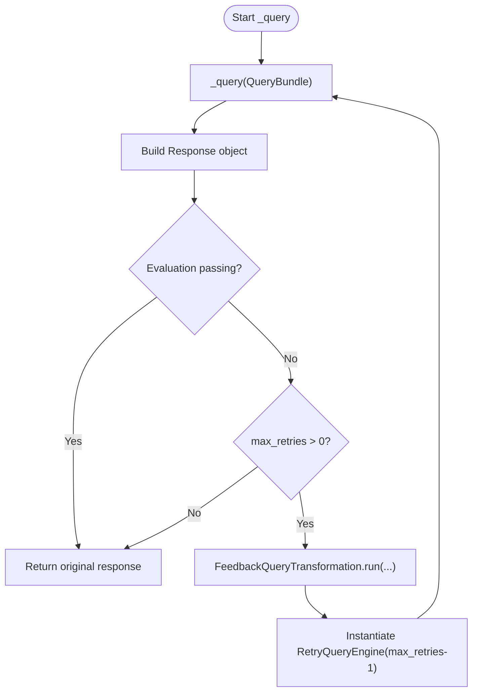
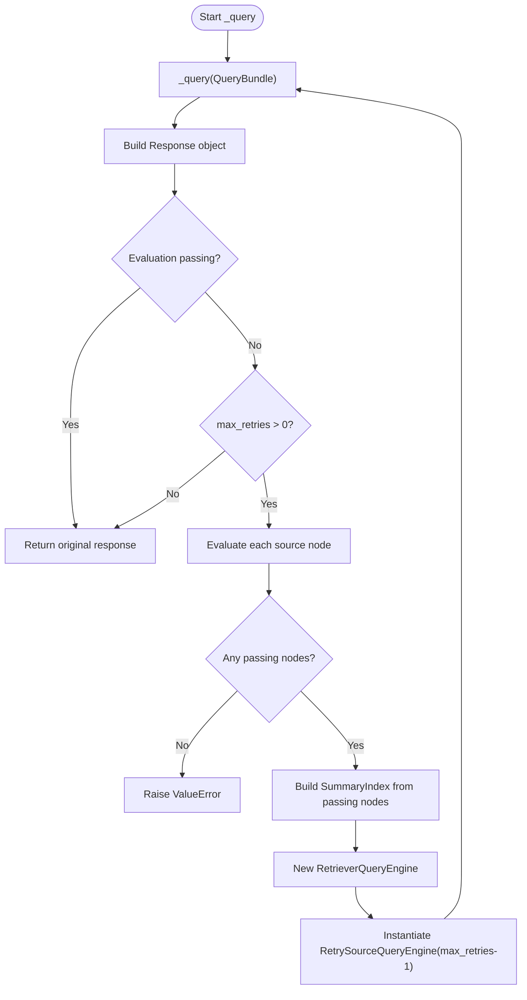
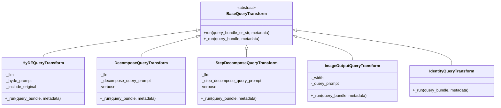
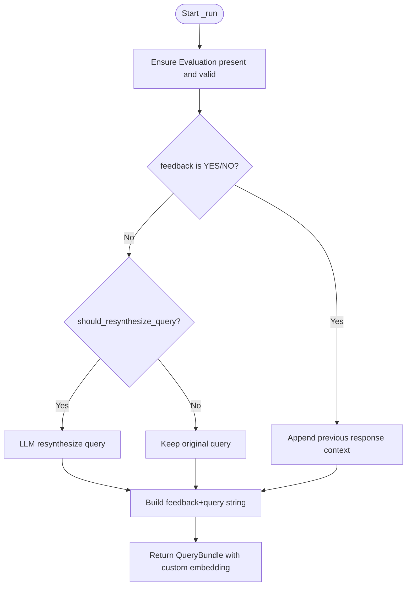
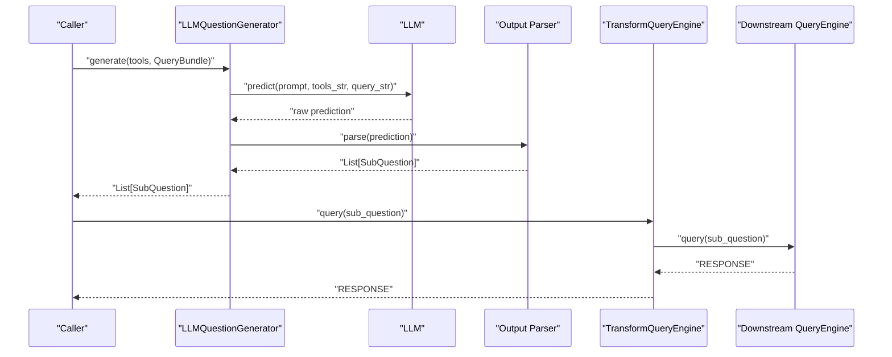
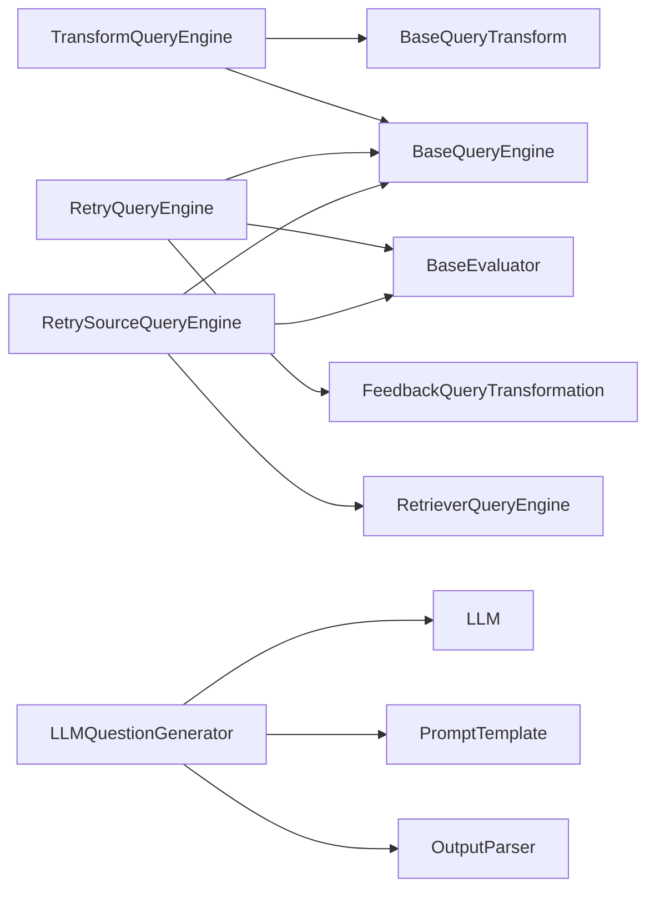

# Query Transformations

<cite>
**Referenced Files in This Document**
- [transform_query_engine.py](file://llama-index-core/llama_index/core/query_engine/transform_query_engine.py)
- [retry_query_engine.py](file://llama-index-core/llama_index/core/query_engine/retry_query_engine.py)
- [retry_source_query_engine.py](file://llama-index-core/llama_index/core/query_engine/retry_source_query_engine.py)
- [base.py](file://llama-index-core/llama_index/core/indices/query/query_transform/base.py)
- [feedback_transform.py](file://llama-index-core/llama_index/core/indices/query/query_transform/feedback_transform.py)
- [llm_generators.py](file://llama-index-core/llama_index/core/question_gen/llm_generators.py)
- [types.py](file://llama-index-core/llama_index/core/question_gen/types.py)
</cite>

## Table of Contents
1. [Introduction](#introduction)
2. [Project Structure](#project-structure)
3. [Core Components](#core-components)
4. [Architecture Overview](#architecture-overview)
5. [Detailed Component Analysis](#detailed-component-analysis)
6. [Dependency Analysis](#dependency-analysis)
7. [Performance Considerations](#performance-considerations)
8. [Troubleshooting Guide](#troubleshooting-guide)
9. [Conclusion](#conclusion)
10. [Appendices](#appendices)

## Introduction
This document provides comprehensive API documentation for Query Transformation systems in the repository. It focuses on:
- Transform query engines that apply query transformations before delegating to downstream query engines
- Retry mechanisms that evaluate responses and reattempt queries with transformed inputs
- Question generation components that produce structured sub-questions for multi-step retrieval
- Dynamic query modification via feedback-driven transformations
- Practical guidance for implementing custom transformers, configuring retry strategies, and generating synthetic queries
- Performance optimization and error handling patterns for transformation pipelines

## Project Structure
The query transformation ecosystem spans three primary areas:
- Query Engine Wrappers: TransformQueryEngine, RetryQueryEngine, RetrySourceQueryEngine
- Query Transform Implementations: HyDE, Decompose, StepDecompose, ImageOutput, Identity
- Question Generation: LLM-backed generator producing structured sub-questions

**Diagram sources**
- [transform_query_engine.py](file://llama-index-core/llama_index/core/query_engine/transform_query_engine.py#L11-L95)
- [retry_query_engine.py](file://llama-index-core/llama_index/core/query_engine/retry_query_engine.py#L22-L147)
- [retry_source_query_engine.py](file://llama-index-core/llama_index/core/query_engine/retry_source_query_engine.py#L24-L93)
- [base.py](file://llama-index-core/llama_index/core/indices/query/query_transform/base.py#L30-L322)
- [feedback_transform.py](file://llama-index-core/llama_index/core/indices/query/query_transform/feedback_transform.py#L28-L118)
- [llm_generators.py](file://llama-index-core/llama_index/core/question_gen/llm_generators.py#L20-L98)
- [types.py](file://llama-index-core/llama_index/core/question_gen/types.py#L26-L42)

**Section sources**
- [transform_query_engine.py](file://llama-index-core/llama_index/core/query_engine/transform_query_engine.py#L1-L95)
- [base.py](file://llama-index-core/llama_index/core/indices/query/query_transform/base.py#L1-L322)

## Core Components
- TransformQueryEngine: Applies a BaseQueryTransform to a QueryBundle before invoking retrieve/synthesize/query on a downstream query engine.
- RetryQueryEngine: Evaluates the response via a BaseEvaluator; if failing, constructs a new query using FeedbackQueryTransformation and retries up to max_retries.
- RetrySourceQueryEngine: Evaluates per-source-node relevance; filters to a new index and retries with a fresh RetrieverQueryEngine pipeline.
- BaseQueryTransform family: HyDEQueryTransform, DecomposeQueryTransform, StepDecomposeQueryTransform, ImageOutputQueryTransform, IdentityQueryTransform.
- FeedbackQueryTransformation: Augments the query with evaluation feedback; optionally resynthesizes the query using an LLM.
- LLMQuestionGenerator: Generates structured sub-questions from a QueryBundle and tool metadata.

**Section sources**
- [transform_query_engine.py](file://llama-index-core/llama_index/core/query_engine/transform_query_engine.py#L11-L95)
- [retry_query_engine.py](file://llama-index-core/llama_index/core/query_engine/retry_query_engine.py#L22-L147)
- [retry_source_query_engine.py](file://llama-index-core/llama_index/core/query_engine/retry_source_query_engine.py#L24-L93)
- [base.py](file://llama-index-core/llama_index/core/indices/query/query_transform/base.py#L30-L322)
- [feedback_transform.py](file://llama-index-core/llama_index/core/indices/query/query_transform/feedback_transform.py#L28-L118)
- [llm_generators.py](file://llama-index-core/llama_index/core/question_gen/llm_generators.py#L20-L98)

## Architecture Overview
The transformation pipeline integrates query engines, transforms, and evaluators to iteratively refine queries and responses.

**Diagram sources**
- [transform_query_engine.py](file://llama-index-core/llama_index/core/query_engine/transform_query_engine.py#L82-L95)
- [base.py](file://llama-index-core/llama_index/core/indices/query/query_transform/base.py#L50-L73)

**Diagram sources**
- [retry_query_engine.py](file://llama-index-core/llama_index/core/query_engine/retry_query_engine.py#L50-L76)
- [feedback_transform.py](file://llama-index-core/llama_index/core/indices/query/query_transform/feedback_transform.py#L60-L93)

## Detailed Component Analysis

### TransformQueryEngine
- Purpose: Apply a BaseQueryTransform to a QueryBundle prior to invoking retrieve/synthesize/query on a downstream query engine.
- Key behaviors:
  - Delegates prompt module composition to contained components.
  - Runs transform on the QueryBundle before forwarding to the underlying engine.
  - Supports sync and async query pathways.

**Diagram sources**
- [transform_query_engine.py](file://llama-index-core/llama_index/core/query_engine/transform_query_engine.py#L11-L95)
- [base.py](file://llama-index-core/llama_index/core/indices/query/query_transform/base.py#L30-L74)

**Section sources**
- [transform_query_engine.py](file://llama-index-core/llama_index/core/query_engine/transform_query_engine.py#L11-L95)

### RetryQueryEngine
- Purpose: Evaluate responses and retry with transformed queries when evaluations fail.
- Key behaviors:
  - Uses a BaseEvaluator to assess responses.
  - On failure, constructs a new query via FeedbackQueryTransformation and recurses with reduced retries.
  - Supports synchronous query; asynchronous path falls back to synchronous.

**Diagram sources**
- [retry_query_engine.py](file://llama-index-core/llama_index/core/query_engine/retry_query_engine.py#L50-L76)
- [feedback_transform.py](file://llama-index-core/llama_index/core/indices/query/query_transform/feedback_transform.py#L60-L93)

**Section sources**
- [retry_query_engine.py](file://llama-index-core/llama_index/core/query_engine/retry_query_engine.py#L22-L147)

### RetrySourceQueryEngine
- Purpose: Filter source nodes by evaluator quality and rebuild a retriever pipeline for retries.
- Key behaviors:
  - Evaluates each source node independently.
  - Builds a new SummaryIndex from passing nodes and a new RetrieverQueryEngine.
  - Retries with reduced max_retries until success or exhaustion.

**Diagram sources**
- [retry_source_query_engine.py](file://llama-index-core/llama_index/core/query_engine/retry_source_query_engine.py#L46-L93)

**Section sources**
- [retry_source_query_engine.py](file://llama-index-core/llama_index/core/query_engine/retry_source_query_engine.py#L24-L93)

### BaseQueryTransform Implementations
- HyDEQueryTransform: Generates a hypothetical document via LLM and augments embedding strings.
- DecomposeQueryTransform: Rewrites a query into a more index-friendly form using a prompt and index summary.
- StepDecomposeQueryTransform: Extends decomposition with previous reasoning context.
- ImageOutputQueryTransform: Injects instructions to format image outputs.
- IdentityQueryTransform: No-op transform returning the input unchanged.

**Diagram sources**
- [base.py](file://llama-index-core/llama_index/core/indices/query/query_transform/base.py#L30-L322)

**Section sources**
- [base.py](file://llama-index-core/llama_index/core/indices/query/query_transform/base.py#L76-L322)

### FeedbackQueryTransformation
- Purpose: Augment or resynthesize a query based on evaluation feedback.
- Key behaviors:
  - Validates presence of evaluation, response, and feedback.
  - Optionally resynthesizes the query using an LLM and a dedicated prompt.
  - Returns a new QueryBundle with augmented query string and embedding context.

**Diagram sources**
- [feedback_transform.py](file://llama-index-core/llama_index/core/indices/query/query_transform/feedback_transform.py#L60-L118)

**Section sources**
- [feedback_transform.py](file://llama-index-core/llama_index/core/indices/query/query_transform/feedback_transform.py#L28-L118)

### Question Generators and Relationship to Query Engines
- LLMQuestionGenerator: Produces a list of SubQuestion objects from a QueryBundle and tool metadata using a structured prompt and output parser.
- Relationship: Sub-queries generated by a question generator can be fed into a TransformQueryEngine with a DecomposeQueryTransform to create a multi-step retrieval pipeline. Alternatively, the generator can drive a sub-question query engine pattern where each sub-question is answered independently and synthesized.

**Diagram sources**
- [llm_generators.py](file://llama-index-core/llama_index/core/question_gen/llm_generators.py#L67-L97)
- [types.py](file://llama-index-core/llama_index/core/question_gen/types.py#L11-L42)
- [transform_query_engine.py](file://llama-index-core/llama_index/core/query_engine/transform_query_engine.py#L82-L95)

**Section sources**
- [llm_generators.py](file://llama-index-core/llama_index/core/question_gen/llm_generators.py#L20-L98)
- [types.py](file://llama-index-core/llama_index/core/question_gen/types.py#L26-L42)

## Dependency Analysis
- TransformQueryEngine depends on BaseQueryTransform and a downstream BaseQueryEngine.
- RetryQueryEngine depends on a BaseEvaluator and FeedbackQueryTransformation.
- RetrySourceQueryEngine depends on a RetrieverQueryEngine, BaseEvaluator, and builds a SummaryIndex for retries.
- Question generators depend on LLMs, prompts, and output parsers to produce structured sub-questions.

**Diagram sources**
- [transform_query_engine.py](file://llama-index-core/llama_index/core/query_engine/transform_query_engine.py#L11-L95)
- [retry_query_engine.py](file://llama-index-core/llama_index/core/query_engine/retry_query_engine.py#L22-L147)
- [retry_source_query_engine.py](file://llama-index-core/llama_index/core/query_engine/retry_source_query_engine.py#L24-L93)
- [llm_generators.py](file://llama-index-core/llama_index/core/question_gen/llm_generators.py#L20-L98)

**Section sources**
- [transform_query_engine.py](file://llama-index-core/llama_index/core/query_engine/transform_query_engine.py#L1-L95)
- [retry_query_engine.py](file://llama-index-core/llama_index/core/query_engine/retry_query_engine.py#L1-L147)
- [retry_source_query_engine.py](file://llama-index-core/llama_index/core/query_engine/retry_source_query_engine.py#L1-L93)
- [llm_generators.py](file://llama-index-core/llama_index/core/question_gen/llm_generators.py#L1-L98)

## Performance Considerations
- Minimize redundant transformations: Prefer identity transforms only when necessary; avoid repeated HyDE generations for identical queries.
- Control retry depth: Set max_retries conservatively to prevent exponential cost growth; consider early exit conditions.
- Filter sources efficiently: In RetrySourceQueryEngine, pre-filter nodes and limit the number of evaluated contexts.
- Batch sub-questions: When using question generators, batch and parallelize downstream query executions where supported.
- Cache embeddings: For repeated queries, reuse custom embedding strings from HyDE to reduce LLM calls.
- Streaming vs. blocking: Avoid unnecessary async paths; synchronous query paths are simpler and often sufficient.

[No sources needed since this section provides general guidance]

## Troubleshooting Guide
- TransformQueryEngine
  - Symptom: No effect on query.
    - Cause: Identity transform or missing metadata.
    - Action: Verify transform type and metadata passed to TransformQueryEngine.
  - Symptom: Unexpected embedding strings.
    - Cause: HyDE include_original flag or custom embedding_strs.
    - Action: Inspect custom_embedding_strs after transform run.

- RetryQueryEngine
  - Symptom: Infinite recursion or excessive retries.
    - Cause: max_retries not decreasing or evaluation always failing.
    - Action: Increase success criteria in evaluator; ensure FeedbackQueryTransformation receives a valid Evaluation.
  - Symptom: Async path not supported.
    - Action: Use synchronous query; async fallback invokes synchronous logic.

- RetrySourceQueryEngine
  - Symptom: No passing nodes found.
    - Cause: Evaluator too strict or poor-quality sources.
    - Action: Relax evaluation thresholds or adjust source selection strategy.

- FeedbackQueryTransformation
  - Symptom: Missing evaluation or invalid feedback.
    - Cause: Evaluation not provided or missing response/feedback fields.
    - Action: Ensure metadata contains a proper Evaluation object with response and feedback.

- Question Generators
  - Symptom: Parsing errors in sub-questions.
    - Cause: Output parser mismatch or prompt misconfiguration.
    - Action: Validate prompt template and output parser compatibility.

**Section sources**
- [transform_query_engine.py](file://llama-index-core/llama_index/core/query_engine/transform_query_engine.py#L11-L95)
- [retry_query_engine.py](file://llama-index-core/llama_index/core/query_engine/retry_query_engine.py#L50-L76)
- [retry_source_query_engine.py](file://llama-index-core/llama_index/core/query_engine/retry_source_query_engine.py#L46-L93)
- [feedback_transform.py](file://llama-index-core/llama_index/core/indices/query/query_transform/feedback_transform.py#L60-L118)
- [llm_generators.py](file://llama-index-core/llama_index/core/question_gen/llm_generators.py#L67-L97)

## Conclusion
The query transformation system offers a modular framework to enhance retrieval accuracy and reliability:
- TransformQueryEngine enables pluggable query-time modifications.
- Retry mechanisms with evaluators and feedback-driven transformations improve robustness.
- Question generators supply structured sub-questions for complex tasks.
Adopting best practices around caching, batching, and conservative retry limits yields significant performance gains while maintaining correctness.

[No sources needed since this section summarizes without analyzing specific files]

## Appendices

### Implementing a Custom Query Transformer
- Extend BaseQueryTransform and implement _run to modify QueryBundle.
- Optionally override _get_prompts and _update_prompts to integrate with prompt management.
- Example reference paths:
  - [Base class definition](file://llama-index-core/llama_index/core/indices/query/query_transform/base.py#L30-L74)
  - [Example implementations](file://llama-index-core/llama_index/core/indices/query/query_transform/base.py#L76-L322)

**Section sources**
- [base.py](file://llama-index-core/llama_index/core/indices/query/query_transform/base.py#L30-L322)

### Configuring Retry Strategies
- Choose RetryQueryEngine for evaluator-based feedback loops.
- Choose RetrySourceQueryEngine for source-node filtering and re-retrieval.
- Configure max_retries and evaluator thresholds to balance quality and latency.
- Example reference paths:
  - [RetryQueryEngine](file://llama-index-core/llama_index/core/query_engine/retry_query_engine.py#L22-L147)
  - [RetrySourceQueryEngine](file://llama-index-core/llama_index/core/query_engine/retry_source_query_engine.py#L24-L93)

**Section sources**
- [retry_query_engine.py](file://llama-index-core/llama_index/core/query_engine/retry_query_engine.py#L22-L147)
- [retry_source_query_engine.py](file://llama-index-core/llama_index/core/query_engine/retry_source_query_engine.py#L24-L93)

### Generating Synthetic Queries
- Use HyDEQueryTransform to generate hypothetical documents and augment embeddings.
- Combine with TransformQueryEngine to inject synthetic queries into downstream engines.
- Example reference paths:
  - [HyDE implementation](file://llama-index-core/llama_index/core/indices/query/query_transform/base.py#L96-L151)
  - [Transform wrapper](file://llama-index-core/llama_index/core/query_engine/transform_query_engine.py#L46-L65)

**Section sources**
- [base.py](file://llama-index-core/llama_index/core/indices/query/query_transform/base.py#L96-L151)
- [transform_query_engine.py](file://llama-index-core/llama_index/core/query_engine/transform_query_engine.py#L46-L65)