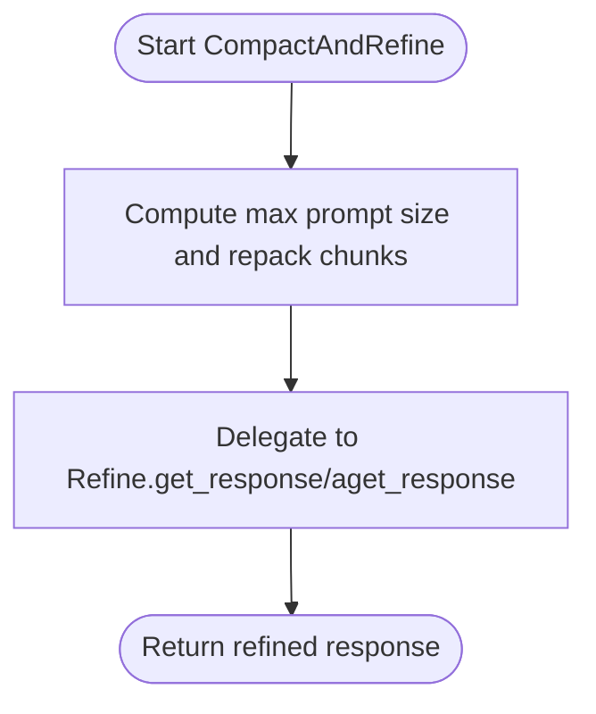
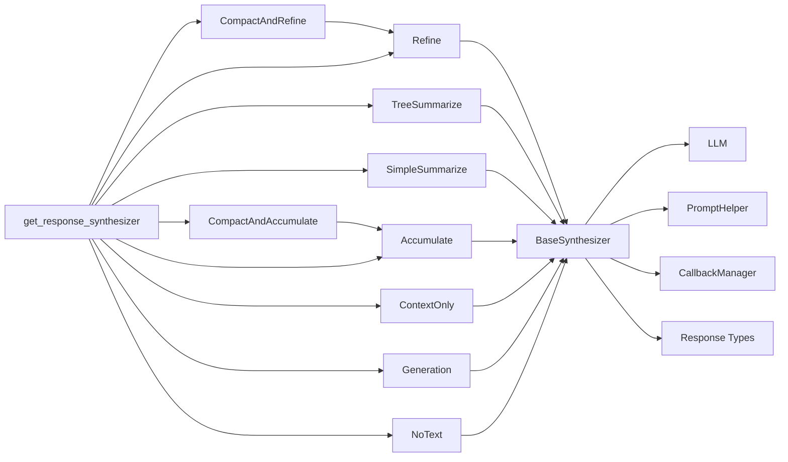

# Response Synthesizers

<cite>
**Referenced Files in This Document**
- [base.py](file://llama-index-core/llama_index/core/response_synthesizers/base.py)
- [factory.py](file://llama-index-core/llama_index/core/response_synthesizers/factory.py)
- [type.py](file://llama-index-core/llama_index/core/response_synthesizers/type.py)
- [refine.py](file://llama-index-core/llama_index/core/response_synthesizers/refine.py)
- [tree_summarize.py](file://llama-index-core/llama_index/core/response_synthesizers/tree_summarize.py)
- [simple_summarize.py](file://llama-index-core/llama_index/core/response_synthesizers/simple_summarize.py)
- [accumulate.py](file://llama-index-core/llama_index/core/response_synthesizers/accumulate.py)
- [compact_and_refine.py](file://llama-index-core/llama_index/core/response_synthesizers/compact_and_refine.py)
- [compact_and_accumulate.py](file://llama-index-core/llama_index/core/response_synthesizers/compact_and_accumulate.py)
- [context_only.py](file://llama-index-core/llama_index/core/response_synthesizers/context_only.py)
- [generation.py](file://llama-index-core/llama_index/core/response_synthesizers/generation.py)
- [no_text.py](file://llama-index-core/llama_index/core/response_synthesizers/no_text.py)
</cite>

## Table of Contents
1. [Introduction](#introduction)
2. [Project Structure](#project-structure)
3. [Core Components](#core-components)
4. [Architecture Overview](#architecture-overview)
5. [Detailed Component Analysis](#detailed-component-analysis)
6. [Dependency Analysis](#dependency-analysis)
7. [Performance Considerations](#performance-considerations)
8. [Troubleshooting Guide](#troubleshooting-guide)
9. [Conclusion](#conclusion)
10. [Appendices](#appendices)

## Introduction
This document provides comprehensive API documentation for Response Synthesizers in the LlamaIndex core. It explains the BaseSynthesizer interface and all built-in synthesizer implementations, including Refine, TreeSummarize, SimpleSummarize, Accumulate, CompactAndRefine, CompactAndAccumulate, ContextOnly, Generation, and NoText. It covers the synthesis process, prompt templating, response formatting, the synthesize() and asynthesize() workflows, node processing, and response generation patterns. It also includes guidance on custom synthesizer implementation, prompt customization, response optimization, the factory pattern for synthesizer selection, and performance considerations.

## Project Structure
The response synthesizers live under the core module and expose a unified interface for generating responses from retrieved text chunks. The structure includes:
- A base abstract interface (BaseSynthesizer) that defines the contract for all synthesizers.
- A factory function (get_response_synthesizer) that instantiates the appropriate synthesizer based on ResponseMode.
- Built-in implementations for different synthesis strategies.
- Enumerations defining supported response modes.

**Diagram sources**
- [base.py](file://llama-index-core/llama_index/core/response_synthesizers/base.py#L53-L322)
- [factory.py](file://llama-index-core/llama_index/core/response_synthesizers/factory.py#L33-L152)
- [refine.py](file://llama-index-core/llama_index/core/response_synthesizers/refine.py#L108-L522)
- [compact_and_refine.py](file://llama-index-core/llama_index/core/response_synthesizers/compact_and_refine.py#L11-L58)
- [tree_summarize.py](file://llama-index-core/llama_index/core/response_synthesizers/tree_summarize.py#L17-L231)
- [simple_summarize.py](file://llama-index-core/llama_index/core/response_synthesizers/simple_summarize.py#L15-L110)
- [accumulate.py](file://llama-index-core/llama_index/core/response_synthesizers/accumulate.py#L18-L152)
- [compact_and_accumulate.py](file://llama-index-core/llama_index/core/response_synthesizers/compact_and_accumulate.py#L8-L56)
- [context_only.py](file://llama-index-core/llama_index/core/response_synthesizers/context_only.py#L8-L31)
- [generation.py](file://llama-index-core/llama_index/core/response_synthesizers/generation.py#L29-L189)
- [no_text.py](file://llama-index-core/llama_index/core/response_synthesizers/no_text.py#L8-L31)

**Section sources**
- [base.py](file://llama-index-core/llama_index/core/response_synthesizers/base.py#L53-L322)
- [factory.py](file://llama-index-core/llama_index/core/response_synthesizers/factory.py#L33-L152)
- [type.py](file://llama-index-core/llama_index/core/response_synthesizers/type.py#L4-L58)

## Core Components
- BaseSynthesizer: Defines the abstract interface for response synthesis, including synchronous and asynchronous methods, prompt handling, streaming support, and response formatting into standardized response objects.
- ResponseMode: Enumerates supported synthesis strategies (e.g., refine, compact, simple_summarize, tree_summarize, generation, no_text, context_only, accumulate, compact_accumulate).
- Factory: get_response_synthesizer constructs the appropriate synthesizer instance based on ResponseMode and configuration.

Key responsibilities:
- Unified synthesis API via synthesize() and asynthesize().
- Prompt templating and packing via PromptHelper.
- Response formatting into Response, StreamingResponse, AsyncStreamingResponse, or PydanticResponse depending on output type.
- Structured output support for LLMs that produce structured responses.

**Section sources**
- [base.py](file://llama-index-core/llama_index/core/response_synthesizers/base.py#L53-L322)
- [type.py](file://llama-index-core/llama_index/core/response_synthesizers/type.py#L4-L58)
- [factory.py](file://llama-index-core/llama_index/core/response_synthesizers/factory.py#L33-L152)

## Architecture Overview
The synthesis pipeline follows a consistent flow:
- Input: Query (string or QueryBundle) and a list of NodeWithScore.
- Preprocessing: Nodes’ content is extracted using a specified metadata mode.
- Synthesizer-specific processing: Depending on ResponseMode, the synthesizer applies prompts, packs tokens, and orchestrates LLM calls.
- Output: Standardized response object with optional streaming and source node metadata.

**Diagram sources**
- [base.py](file://llama-index-core/llama_index/core/response_synthesizers/base.py#L192-L322)
- [refine.py](file://llama-index-core/llama_index/core/response_synthesizers/refine.py#L162-L200)
- [simple_summarize.py](file://llama-index-core/llama_index/core/response_synthesizers/simple_summarize.py#L76-L110)
- [tree_summarize.py](file://llama-index-core/llama_index/core/response_synthesizers/tree_summarize.py#L134-L231)
- [accumulate.py](file://llama-index-core/llama_index/core/response_synthesizers/accumulate.py#L85-L152)
- [generation.py](file://llama-index-core/llama_index/core/response_synthesizers/generation.py#L77-L98)

## Detailed Component Analysis

### BaseSynthesizer
- Purpose: Abstract base class defining the synthesis contract.
- Core methods:
  - get_response(query_str, text_chunks): Synchronous response generation.
  - aget_response(query_str, text_chunks): Asynchronous response generation.
  - synthesize(query, nodes, additional_source_nodes): Orchestrates preprocessing, dispatches to get_response, and formats output.
  - asynthesize(query, nodes, additional_source_nodes): Asynchronous variant.
- Features:
  - Streaming support via streaming flag and generator return types.
  - Structured output support for LLMs that produce structured responses.
  - Prompt module management and prompt helper integration.
  - Instrumentation and callback events for tracing and metrics.

**Diagram sources**
- [base.py](file://llama-index-core/llama_index/core/response_synthesizers/base.py#L53-L322)

**Section sources**
- [base.py](file://llama-index-core/llama_index/core/response_synthesizers/base.py#L53-L322)

### Refine
- Strategy: Iteratively refine a response across text chunks using a QA prompt for the first chunk and a refine prompt for subsequent chunks.
- Key behaviors:
  - Uses two templates: text_qa_template and refine_template.
  - Supports structured answer filtering via a program factory returning a structured response model.
  - Streaming is supported for refinement steps.
  - Handles truncation and repacking via PromptHelper.
- Important constraints:
  - Streaming is not supported with structured answer filtering.
  - Program factory requires structured answer filtering.

**Diagram sources**
- [refine.py](file://llama-index-core/llama_index/core/response_synthesizers/refine.py#L108-L522)

**Section sources**
- [refine.py](file://llama-index-core/llama_index/core/response_synthesizers/refine.py#L108-L522)

### CompactAndRefine
- Strategy: Compact text chunks to maximize context window utilization, then refine across compacted chunks.
- Implementation: Inherits from Refine and overrides get_response/aget_response to repack using the larger combined prompt (max of text_qa and refine templates) before delegating to parent logic.

**Diagram sources**
- [compact_and_refine.py](file://llama-index-core/llama_index/core/response_synthesizers/compact_and_refine.py#L11-L58)
- [refine.py](file://llama-index-core/llama_index/core/response_synthesizers/refine.py#L108-L522)

**Section sources**
- [compact_and_refine.py](file://llama-index-core/llama_index/core/response_synthesizers/compact_and_refine.py#L11-L58)

### TreeSummarize
- Strategy: Bottom-up recursive summarization. At each step, repack chunks to fill the context window, summarize each chunk, and recurse until a single summary remains.
- Supports:
  - Synchronous and asynchronous modes.
  - Structured output via structured_predict.
  - Streaming for leaf-level summarization.

**Diagram sources**
- [tree_summarize.py](file://llama-index-core/llama_index/core/response_synthesizers/tree_summarize.py#L17-L231)

**Section sources**
- [tree_summarize.py](file://llama-index-core/llama_index/core/response_synthesizers/tree_summarize.py#L17-L231)

### SimpleSummarize
- Strategy: Concatenate all chunks into a single context and call the LLM once with a text-qa prompt. Uses truncation to fit the context window.
- Supports:
  - Synchronous and asynchronous prediction.
  - Streaming for leaf-level generation.

**Section sources**
- [simple_summarize.py](file://llama-index-core/llama_index/core/response_synthesizers/simple_summarize.py#L15-L110)

### Accumulate
- Strategy: Apply the same prompt to each chunk independently and concatenate the responses with a separator. Does not support streaming.
- Supports:
  - Synchronous and asynchronous modes.
  - Structured output via structured_predict.
  - Async orchestration via run_async_tasks.

**Section sources**
- [accumulate.py](file://llama-index-core/llama_index/core/response_synthesizers/accumulate.py#L18-L152)

### CompactAndAccumulate
- Strategy: Compact chunks to maximize context window, then apply the same prompt to each compacted chunk and concatenate results.
- Implementation: Inherits from Accumulate and repacks using a single template before delegating to parent logic.

**Section sources**
- [compact_and_accumulate.py](file://llama-index-core/llama_index/core/response_synthesizers/compact_and_accumulate.py#L8-L56)

### ContextOnly
- Strategy: Returns a concatenated string of all input text chunks without invoking the LLM.
- Useful for scenarios where raw context is desired without synthesis.

**Section sources**
- [context_only.py](file://llama-index-core/llama_index/core/response_synthesizers/context_only.py#L8-L31)

### Generation
- Strategy: Ignores retrieved chunks and generates a response directly from the query using a simple input prompt.
- Supports:
  - Synchronous and asynchronous prediction.
  - Streaming.

**Section sources**
- [generation.py](file://llama-index-core/llama_index/core/response_synthesizers/generation.py#L29-L189)

### NoText
- Strategy: Returns an empty string. Useful for cases where no textual output is desired.

**Section sources**
- [no_text.py](file://llama-index-core/llama_index/core/response_synthesizers/no_text.py#L8-L31)

## Dependency Analysis
- BaseSynthesizer depends on:
  - LLM for prediction/streaming/structured prediction.
  - PromptHelper for repacking/truncation.
  - CallbackManager and instrumentation for tracing.
  - Response schema types for output formatting.
- Concrete synthesizers depend on:
  - Prompt templates selected via default selectors or injected templates.
  - PromptHelper for token packing and truncation.
  - Async utilities for concurrent processing (e.g., TreeSummarize, Accumulate).
- Factory function composes synthesizers based on ResponseMode and injects shared dependencies.

**Diagram sources**
- [base.py](file://llama-index-core/llama_index/core/response_synthesizers/base.py#L53-L322)
- [factory.py](file://llama-index-core/llama_index/core/response_synthesizers/factory.py#L33-L152)
- [refine.py](file://llama-index-core/llama_index/core/response_synthesizers/refine.py#L108-L522)
- [tree_summarize.py](file://llama-index-core/llama_index/core/response_synthesizers/tree_summarize.py#L17-L231)
- [simple_summarize.py](file://llama-index-core/llama_index/core/response_synthesizers/simple_summarize.py#L15-L110)
- [accumulate.py](file://llama-index-core/llama_index/core/response_synthesizers/accumulate.py#L18-L152)
- [compact_and_refine.py](file://llama-index-core/llama_index/core/response_synthesizers/compact_and_refine.py#L11-L58)
- [compact_and_accumulate.py](file://llama-index-core/llama_index/core/response_synthesizers/compact_and_accumulate.py#L8-L56)
- [context_only.py](file://llama-index-core/llama_index/core/response_synthesizers/context_only.py#L8-L31)
- [generation.py](file://llama-index-core/llama_index/core/response_synthesizers/generation.py#L29-L189)
- [no_text.py](file://llama-index-core/llama_index/core/response_synthesizers/no_text.py#L8-L31)

**Section sources**
- [base.py](file://llama-index-core/llama_index/core/response_synthesizers/base.py#L53-L322)
- [factory.py](file://llama-index-core/llama_index/core/response_synthesizers/factory.py#L33-L152)

## Performance Considerations
- Token packing and truncation:
  - PromptHelper is used to repack or truncate text to fit the LLM’s context window. Choose appropriate templates and modes to minimize repeated calls.
- Streaming vs. batch:
  - Streaming reduces latency for incremental feedback but may limit structured output validation and certain advanced features (e.g., structured answer filtering in Refine).
- Asynchronous processing:
  - TreeSummarize and Accumulate support async orchestration to reduce total latency when summarizing or accumulating many chunks.
- Mode selection:
  - SimpleSummarize is fastest but fails if the concatenated context exceeds the LLM’s capacity.
  - Refine and CompactAndRefine offer higher quality at the cost of more LLM calls.
  - TreeSummarize scales well for very large sets of chunks.
  - Accumulate and CompactAndAccumulate aggregate per-chunk outputs; avoid streaming in Accumulate.
- Structured output:
  - Structured LLMs and structured programs improve reliability but require careful prompt design and validation.

[No sources needed since this section provides general guidance]

## Troubleshooting Guide
Common issues and resolutions:
- Empty or placeholder responses:
  - BaseSynthesizer returns a default empty response when no nodes are provided. Ensure nodes are passed and metadata extraction is configured correctly.
- Streaming conflicts:
  - Refine with structured answer filtering does not support streaming. Disable streaming or disable structured filtering.
  - Accumulate does not support streaming. Remove streaming flag when using Accumulate.
- Context window exceeded:
  - Use CompactAndRefine or TreeSummarize to pack chunks efficiently. Verify PromptHelper configuration and template sizes.
- Structured output validation errors:
  - Refine handles validation errors gracefully by falling back to unstructured responses. Review prompt templates and output classes.
- Incorrect response type:
  - BaseSynthesizer enforces that responses are strings, generators, or PydanticResponse instances. Ensure output_cls matches the LLM’s output format.

**Section sources**
- [base.py](file://llama-index-core/llama_index/core/response_synthesizers/base.py#L206-L227)
- [refine.py](file://llama-index-core/llama_index/core/response_synthesizers/refine.py#L138-L146)
- [accumulate.py](file://llama-index-core/llama_index/core/response_synthesizers/accumulate.py#L93-L94)

## Conclusion
Response Synthesizers provide a flexible, extensible framework for generating answers from retrieved chunks using various strategies. The BaseSynthesizer interface ensures consistent behavior across implementations, while the factory enables easy selection of synthesis modes. By leveraging prompt templating, token packing, and structured outputs, developers can optimize accuracy, performance, and user experience for diverse RAG workflows.

[No sources needed since this section summarizes without analyzing specific files]

## Appendices

### API Reference: BaseSynthesizer
- Methods:
  - synthesize(query, nodes, additional_source_nodes=None, **kwargs) -> RESPONSE_TYPE
  - asynthesize(query, nodes, additional_source_nodes=None, **kwargs) -> RESPONSE_TYPE
  - get_response(query_str, text_chunks, **kwargs) -> RESPONSE_TEXT_TYPE
  - aget_response(query_str, text_chunks, **kwargs) -> RESPONSE_TEXT_TYPE
- Properties and attributes:
  - streaming, callback_manager, prompt_helper, output_cls, empty_response
- Notes:
  - Response formatting supports string, generator, async generator, and PydanticResponse.

**Section sources**
- [base.py](file://llama-index-core/llama_index/core/response_synthesizers/base.py#L53-L322)

### Factory Pattern: get_response_synthesizer
- Inputs:
  - llm, prompt_helper, text_qa_template, refine_template, summary_template, simple_template, response_mode, callback_manager, use_async, streaming, structured_answer_filtering, output_cls, program_factory, verbose
- Behavior:
  - Selects synthesizer based on ResponseMode and initializes with provided dependencies.
- Supported modes:
  - REFINE, COMPACT, SIMPLE_SUMMARIZE, TREE_SUMMARIZE, GENERATION, NO_TEXT, CONTEXT_ONLY, ACCUMULATE, COMPACT_ACCUMULATE

**Section sources**
- [factory.py](file://llama-index-core/llama_index/core/response_synthesizers/factory.py#L33-L152)
- [type.py](file://llama-index-core/llama_index/core/response_synthesizers/type.py#L4-L58)

### Custom Synthesizer Implementation Checklist
- Extend BaseSynthesizer and implement:
  - get_response(query_str, text_chunks, **kwargs)
  - aget_response(query_str, text_chunks, **kwargs)
- Manage prompts via _get_prompts and _update_prompts.
- Integrate PromptHelper for repacking/truncation.
- Support streaming if applicable.
- Use _prepare_response_output to wrap results into standardized response types.
- Register the synthesizer in the factory if exposing via ResponseMode.

**Section sources**
- [base.py](file://llama-index-core/llama_index/core/response_synthesizers/base.py#L53-L322)
- [factory.py](file://llama-index-core/llama_index/core/response_synthesizers/factory.py#L33-L152)