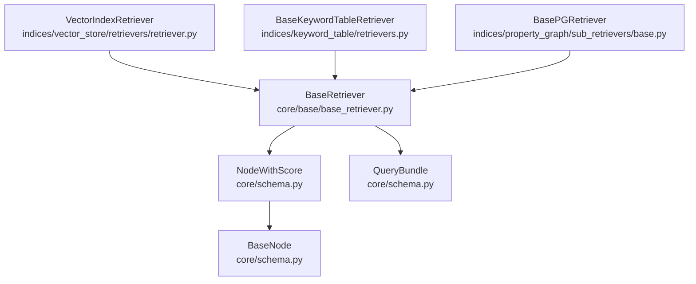
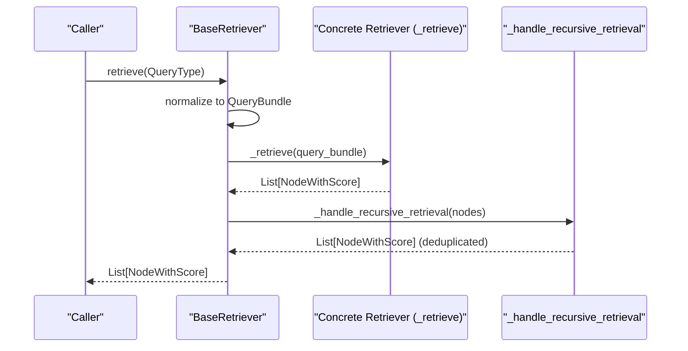
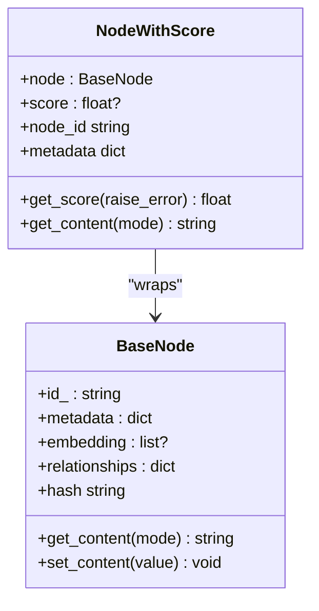
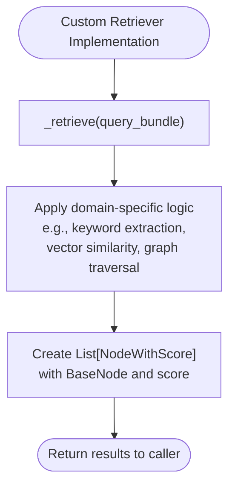
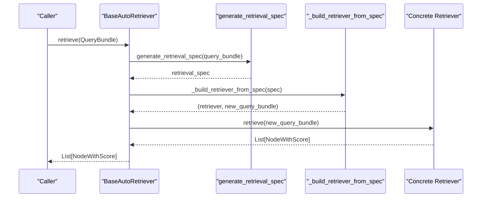
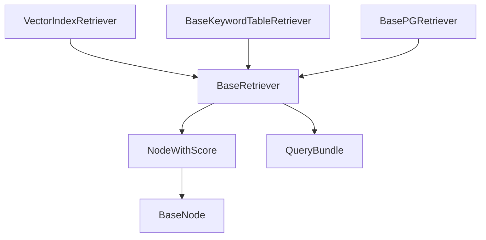

# Base Retriever Interface

<cite>
**Referenced Files in This Document**
- [base_retriever.py](file://llama-index-core/llama_index/core/base/base_retriever.py)
- [schema.py](file://llama-index-core/llama_index/core/schema.py)
- [base_auto_retriever.py](file://llama-index-core/llama_index/core/base/base_auto_retriever.py)
- [retrievers/__init__.py](file://llama-index-core/llama_index/core/retrievers/__init__.py)
- [vector_store/retrievers/retriever.py](file://llama-index-core/llama_index/core/indices/vector_store/retrievers/retriever.py)
- [keyword_table/retrievers.py](file://llama-index-core/llama_index/core/indices/keyword_table/retrievers.py)
- [property_graph/sub_retrievers/base.py](file://llama-index-core/llama_index/core/indices/property_graph/sub_retrievers/base.py)
- [base_query_engine.py](file://llama-index-core/llama_index/core/base/base_query_engine.py)
</cite>

## Table of Contents
1. [Introduction](#introduction)
2. [Project Structure](#project-structure)
3. [Core Components](#core-components)
4. [Architecture Overview](#architecture-overview)
5. [Detailed Component Analysis](#detailed-component-analysis)
6. [Dependency Analysis](#dependency-analysis)
7. [Performance Considerations](#performance-considerations)
8. [Troubleshooting Guide](#troubleshooting-guide)
9. [Conclusion](#conclusion)

## Introduction
This document provides comprehensive API documentation for the BaseRetriever interface, which defines the core retrieval contract in the LlamaIndex framework. It explains the retrieve() method signature, query parameter handling via QueryBundle, the NodeWithScore return type, and the abstract methods that must be implemented by custom retrievers. It also details the relationship between retrievers and nodes, including metadata handling and score calculations, and provides examples of implementing BaseRetriever for custom retrieval logic. Thread safety considerations and performance characteristics are included to guide production usage.

## Project Structure
The BaseRetriever interface resides in the core base module and is extended by numerous specialized retrievers across indices and integrations. The schema module defines the NodeWithScore and related node types that form the backbone of retrieval results.

**Diagram sources**
- [base_retriever.py](file://llama-index-core/llama_index/core/base/base_retriever.py#L34-L274)
- [schema.py](file://llama-index-core/llama_index/core/schema.py#L950-L1007)
- [vector_store/retrievers/retriever.py](file://llama-index-core/llama_index/core/indices/vector_store/retrievers/retriever.py#L23-L23)
- [keyword_table/retrievers.py](file://llama-index-core/llama_index/core/indices/keyword_table/retrievers.py#L30-L30)
- [property_graph/sub_retrievers/base.py](file://llama-index-core/llama_index/core/indices/property_graph/sub_retrievers/base.py#L21-L21)

**Section sources**
- [base_retriever.py](file://llama-index-core/llama_index/core/base/base_retriever.py#L34-L274)
- [schema.py](file://llama-index-core/llama_index/core/schema.py#L950-L1007)

## Core Components
- BaseRetriever: Abstract base class defining the retrieval contract and orchestration. It exposes synchronous and asynchronous retrieval entry points and enforces the implementation of internal abstract methods.
- NodeWithScore: Wrapper around BaseNode that carries a relevance score and provides passthrough accessors to underlying node properties.
- BaseNode: Abstract base for all node types; nodes carry content, metadata, relationships, and embeddings.
- QueryBundle: Encapsulates the user query string and associated parameters used by retrievers and query engines.

Key responsibilities:
- BaseRetriever: Validates and normalizes query input, triggers retrieval, handles recursive retrieval from composite objects, deduplicates results, and emits instrumentation events.
- NodeWithScore: Standardizes scored results for downstream synthesis and post-processing.
- BaseNode: Provides the fundamental data structure for indexed content and documents.
- QueryBundle: Centralizes query representation for consistent handling across components.

**Section sources**
- [base_retriever.py](file://llama-index-core/llama_index/core/base/base_retriever.py#L34-L274)
- [schema.py](file://llama-index-core/llama_index/core/schema.py#L950-L1007)
- [schema.py](file://llama-index-core/llama_index/core/schema.py#L263-L400)
- [schema.py](file://llama-index-core/llama_index/core/schema.py#L1363-L1363)

## Architecture Overview
The retrieval pipeline follows a consistent flow: input normalization, internal retrieval, recursive expansion, deduplication, and event emission. The BaseRetriever orchestrates this flow while delegating the actual search logic to subclasses.

**Diagram sources**
- [base_retriever.py](file://llama-index-core/llama_index/core/base/base_retriever.py#L185-L221)
- [base_retriever.py](file://llama-index-core/llama_index/core/base/base_retriever.py#L115-L146)

## Detailed Component Analysis

### BaseRetriever API Surface
- Constructor parameters:
  - callback_manager: Optional callback manager for instrumentation and tracing.
  - object_map: Optional mapping from index identifiers to objects for recursive retrieval.
  - objects: Optional list of IndexNode used to populate object_map.
  - verbose: Boolean flag enabling verbose logging during retrieval.
- Public methods:
  - retrieve(str_or_query_bundle: QueryType) -> List[NodeWithScore]: Synchronous entry point.
  - aretrieve(str_or_query_bundle: QueryType) -> List[NodeWithScore]: Asynchronous entry point.
- Abstract methods to implement:
  - _retrieve(query_bundle: QueryBundle) -> List[NodeWithScore]: Core retrieval logic.
  - _aretrieve(query_bundle: QueryBundle) -> List[NodeWithScore]: Optional async override (defaults to sync).
- Internal helpers:
  - _retrieve_from_object(obj, query_bundle, score) -> List[NodeWithScore]: Handles recursive retrieval from BaseNode, NodeWithScore, BaseQueryEngine, or BaseRetriever.
  - _handle_recursive_retrieval(query_bundle, nodes) -> List[NodeWithScore]: Expands IndexNode references and deduplicates by node hash.
  - _aretrieve_from_object and _ahandle_recursive_retrieval: Async counterparts.

Behavioral notes:
- Query parameter handling: Accepts either a string or a QueryBundle; strings are automatically wrapped into a QueryBundle.
- Instrumentation: Emits RetrievalStartEvent and RetrievalEndEvent; logs CBEventType.RETRIEVE with payload including query string and returned nodes.
- Recursive retrieval: When encountering an IndexNode, resolves the referenced object via object_map or node.obj and continues retrieval.
- Deduplication: Removes duplicate nodes based on node hash; preserves original scores.

Thread safety:
- BaseRetriever is stateless beyond constructor-provided callback_manager and object_map. Mutations occur locally during retrieval calls. If sharing instances across threads, avoid mutating shared mutable state (e.g., object_map) concurrently.

Performance characteristics:
- Synchronous vs. asynchronous: aretrieve defaults to calling the synchronous _retrieve; implement _aretrieve for true async behavior.
- Recursive expansion: Can increase result count and cost; use object_map judiciously to avoid deep recursion.
- Deduplication: Linear-time dedupe by hash; overhead proportional to result size.

**Section sources**
- [base_retriever.py](file://llama-index-core/llama_index/core/base/base_retriever.py#L36-L50)
- [base_retriever.py](file://llama-index-core/llama_index/core/base/base_retriever.py#L185-L221)
- [base_retriever.py](file://llama-index-core/llama_index/core/base/base_retriever.py#L223-L254)
- [base_retriever.py](file://llama-index-core/llama_index/core/base/base_retriever.py#L256-L274)
- [base_retriever.py](file://llama-index-core/llama_index/core/base/base_retriever.py#L67-L95)
- [base_retriever.py](file://llama-index-core/llama_index/core/base/base_retriever.py#L115-L146)
- [base_retriever.py](file://llama-index-core/llama_index/core/base/base_retriever.py#L96-L114)
- [base_retriever.py](file://llama-index-core/llama_index/core/base/base_retriever.py#L147-L182)

### NodeWithScore and Node Relationships
- NodeWithScore wraps a BaseNode and holds a floating-point score. It provides passthrough properties for node_id, id_, text (when applicable), metadata, embedding, and content retrieval.
- Score semantics:
  - get_score(raise_error=False) returns the stored score or 0.0 if unset.
  - Scores are used by downstream components for ranking and synthesis.
- BaseNode metadata:
  - Supports inclusion/exclusion lists for embedding and LLM processing via excluded_embed_metadata_keys and excluded_llm_metadata_keys.
  - Provides relationships mapping (e.g., SOURCE, PREVIOUS, NEXT, PARENT, CHILD) to RelatedNodeInfo.

**Diagram sources**
- [schema.py](file://llama-index-core/llama_index/core/schema.py#L263-L400)
- [schema.py](file://llama-index-core/llama_index/core/schema.py#L950-L1007)

**Section sources**
- [schema.py](file://llama-index-core/llama_index/core/schema.py#L950-L1007)
- [schema.py](file://llama-index-core/llama_index/core/schema.py#L288-L351)

### Query Parameter Handling (QueryBundle)
- QueryBundle encapsulates the query string and associated parameters. BaseRetriever transparently converts a plain string input to a QueryBundle for internal processing.
- Downstream components (e.g., BaseQueryEngine) also accept QueryBundle, ensuring consistent parameter handling across the retrieval and synthesis pipeline.

**Section sources**
- [base_retriever.py](file://llama-index-core/llama_index/core/base/base_retriever.py#L200-L204)
- [base_query_engine.py](file://llama-index-core/llama_index/core/base/base_query_engine.py#L9-L9)

### Implementing BaseRetriever: Examples and Patterns
- VectorIndexRetriever: Implements _retrieve to perform vector similarity search and returns NodeWithScore results with computed scores.
- BaseKeywordTableRetriever: Extracts keywords from the query, ranks chunks by keyword overlap, and returns scored nodes.
- BasePGRetriever: Retrieves triplets from a property graph, optionally augments with source text, and returns NodeWithScore with configurable scores.

**Diagram sources**
- [vector_store/retrievers/retriever.py](file://llama-index-core/llama_index/core/indices/vector_store/retrievers/retriever.py#L23-L23)
- [keyword_table/retrievers.py](file://llama-index-core/llama_index/core/indices/keyword_table/retrievers.py#L85-L115)
- [property_graph/sub_retrievers/base.py](file://llama-index-core/llama_index/core/indices/property_graph/sub_retrievers/base.py#L142-L146)

**Section sources**
- [vector_store/retrievers/retriever.py](file://llama-index-core/llama_index/core/indices/vector_store/retrievers/retriever.py#L23-L23)
- [keyword_table/retrievers.py](file://llama-index-core/llama_index/core/indices/keyword_table/retrievers.py#L85-L115)
- [property_graph/sub_retrievers/base.py](file://llama-index-core/llama_index/core/indices/property_graph/sub_retrievers/base.py#L142-L146)

### Advanced: BaseAutoRetriever
BaseAutoRetriever extends BaseRetriever to support dynamic generation of retrieval specs and building specialized retrievers at runtime. It delegates actual retrieval to the generated retriever.

**Diagram sources**
- [base_auto_retriever.py](file://llama-index-core/llama_index/core/base/base_auto_retriever.py#L8-L42)

**Section sources**
- [base_auto_retriever.py](file://llama-index-core/llama_index/core/base/base_auto_retriever.py#L8-L42)

## Dependency Analysis
BaseRetriever depends on:
- Schema types: BaseNode, NodeWithScore, QueryBundle, QueryType, IndexNode.
- Instrumentation: DispatcherSpanMixin and RetrievalStartEvent/RetrievalEndEvent.
- Callbacks: CallbackManager for tracing and event emission.

Specialized retrievers depend on BaseRetriever and often wrap index-specific stores (e.g., vector stores, keyword tables, property graphs).

**Diagram sources**
- [base_retriever.py](file://llama-index-core/llama_index/core/base/base_retriever.py#L14-L21)
- [schema.py](file://llama-index-core/llama_index/core/schema.py#L950-L1007)
- [vector_store/retrievers/retriever.py](file://llama-index-core/llama_index/core/indices/vector_store/retrievers/retriever.py#L23-L23)
- [keyword_table/retrievers.py](file://llama-index-core/llama_index/core/indices/keyword_table/retrievers.py#L30-L30)
- [property_graph/sub_retrievers/base.py](file://llama-index-core/llama_index/core/indices/property_graph/sub_retrievers/base.py#L21-L21)

**Section sources**
- [base_retriever.py](file://llama-index-core/llama_index/core/base/base_retriever.py#L14-L21)
- [schema.py](file://llama-index-core/llama_index/core/schema.py#L950-L1007)

## Performance Considerations
- Prefer async retrieval: Implement _aretrieve for true concurrency when underlying IO or network calls are involved.
- Minimize recursive expansion: Limit the depth and breadth of recursive retrieval by carefully managing object_map and avoiding unnecessary IndexNode indirection.
- Efficient deduplication: Leverage the built-in deduplication by hash; ensure nodes have stable hashes to maximize cache hits.
- Query normalization: Use QueryBundle consistently to enable caching and reuse of preprocessed queries.

## Troubleshooting Guide
Common issues and resolutions:
- Unexpected None scores: NodeWithScore.get_score(raise_error=False) returns 0.0 when unset. Ensure your implementation assigns meaningful scores.
- Duplicate results: Verify deduplication is functioning; check node hash stability and that object_map does not introduce redundant expansions.
- Recursive retrieval errors: Confirm that object_map contains the expected objects for IndexNode.index_id and that objects implement the expected retrieval interface.
- Instrumentation gaps: Ensure callback_manager is configured; BaseRetriever checks and initializes it if missing.

**Section sources**
- [base_retriever.py](file://llama-index-core/llama_index/core/base/base_retriever.py#L51-L56)
- [base_retriever.py](file://llama-index-core/llama_index/core/base/base_retriever.py#L140-L146)
- [schema.py](file://llama-index-core/llama_index/core/schema.py#L958-L966)

## Conclusion
BaseRetriever defines a robust, extensible retrieval contract centered on QueryBundle input and NodeWithScore output. Its synchronous and asynchronous entry points, recursive retrieval capabilities, and instrumentation make it suitable for diverse retrieval strategies. By implementing _retrieve (and optionally _aretrieve), developers can integrate custom retrieval logic while leveraging shared orchestration, deduplication, and event emission. Proper metadata handling and score assignment ensure downstream synthesis remains effective and efficient.