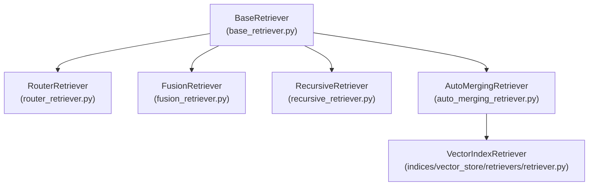
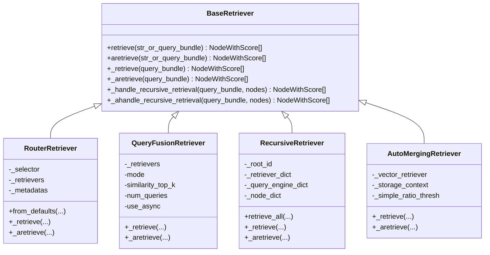
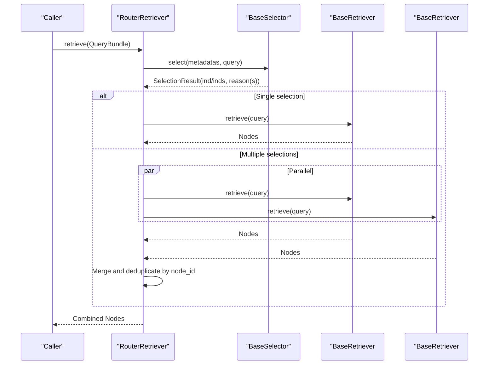
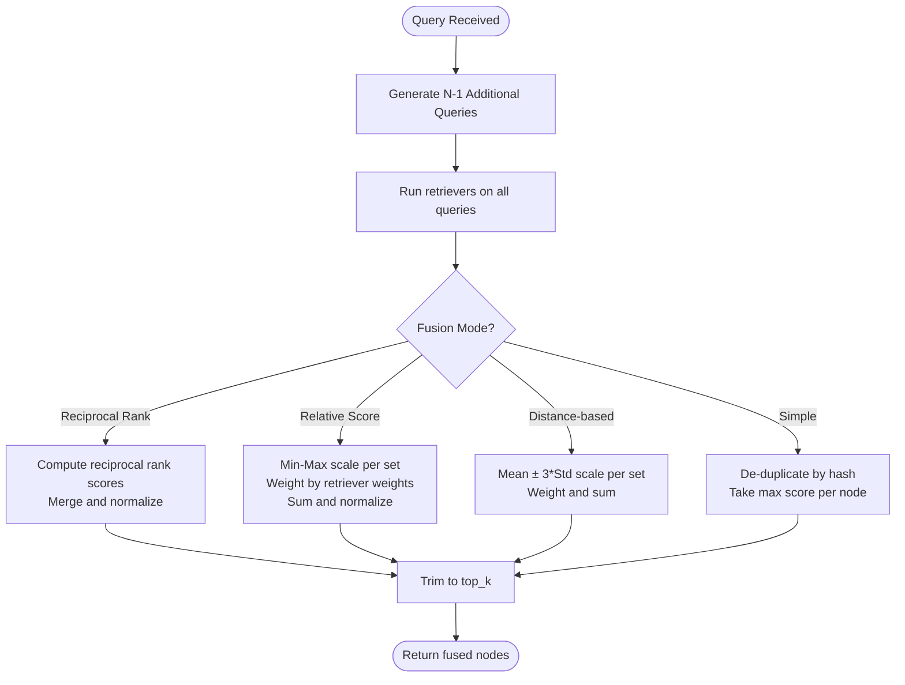
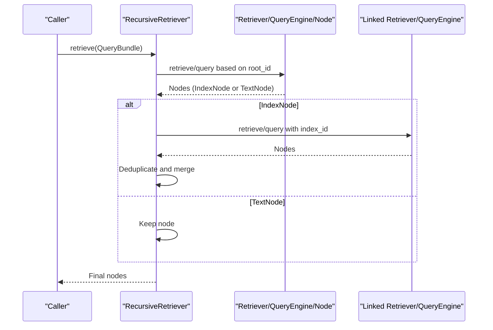
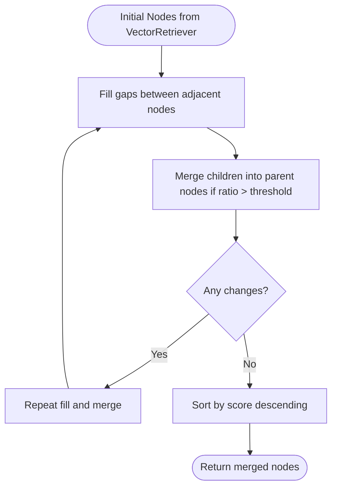
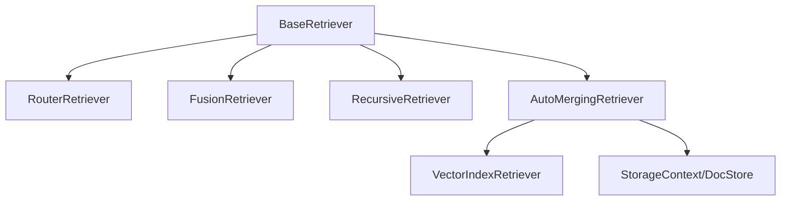

# Built-in Retrievers

<cite>
**Referenced Files in This Document**
- [router_retriever.py](file://llama-index-core/llama_index/core/retrievers/router_retriever.py)
- [fusion_retriever.py](file://llama-index-core/llama_index/core/retrievers/fusion_retriever.py)
- [recursive_retriever.py](file://llama-index-core/llama_index/core/retrievers/recursive_retriever.py)
- [auto_merging_retriever.py](file://llama-index-core/llama_index/core/retrievers/auto_merging_retriever.py)
- [base_retriever.py](file://llama-index-core/llama_index/core/base/base_retriever.py)
- [retriever.py](file://llama-index-core/llama_index/core/indices/vector_store/retrievers/retriever.py)
- [auto_merging_retriever.ipynb](file://docs/examples/retrievers/auto_merging_retriever.ipynb)
- [router_retriever.ipynb](file://docs/examples/retrievers/router_retriever.ipynb)
- [recursive_retriever_nodes.ipynb](file://docs/examples/retrievers/recursive_retriever_nodes.ipynb)
- [reciprocal_rerank_fusion.ipynb](file://docs/examples/retrievers/reciprocal_rerank_fusion.ipynb)
- [simple_fusion.ipynb](file://docs/examples/retrievers/simple_fusion.ipynb)
</cite>

## Table of Contents
1. [Introduction](#introduction)
2. [Project Structure](#project-structure)
3. [Core Components](#core-components)
4. [Architecture Overview](#architecture-overview)
5. [Detailed Component Analysis](#detailed-component-analysis)
6. [Dependency Analysis](#dependency-analysis)
7. [Performance Considerations](#performance-considerations)
8. [Troubleshooting Guide](#troubleshooting-guide)
9. [Conclusion](#conclusion)

## Introduction
This document provides detailed API documentation for four built-in retriever implementations in the LlamaIndex core:
- RouterRetriever: Multi-index routing based on selector decisions
- FusionRetriever: Combines results from multiple retrievers using configurable fusion strategies
- RecursiveRetriever: Hierarchical retrieval across linked retrievers and query engines
- AutoMergingRetriever: Automatic merging of chunk-level results into parent context

For each retriever, we document constructor parameters, configuration options, usage patterns, performance characteristics, memory usage, and optimal use cases. Example notebooks are referenced to demonstrate practical instantiation and configuration.

## Project Structure
The built-in retrievers are implemented under the core retrievers module and integrate with the base retriever interface and vector store retriever infrastructure.

**Diagram sources**
- [base_retriever.py](file://llama-index-core/llama_index/core/base/base_retriever.py#L34-L275)
- [router_retriever.py](file://llama-index-core/llama_index/core/retrievers/router_retriever.py#L20-L143)
- [fusion_retriever.py](file://llama-index-core/llama_index/core/retrievers/fusion_retriever.py#L33-L305)
- [recursive_retriever.py](file://llama-index-core/llama_index/core/retrievers/recursive_retriever.py#L22-L222)
- [auto_merging_retriever.py](file://llama-index-core/llama_index/core/retrievers/auto_merging_retriever.py#L26-L195)
- [retriever.py](file://llama-index-core/llama_index/core/indices/vector_store/retrievers/retriever.py)

**Section sources**
- [base_retriever.py](file://llama-index-core/llama_index/core/base/base_retriever.py#L34-L275)
- [router_retriever.py](file://llama-index-core/llama_index/core/retrievers/router_retriever.py#L20-L143)
- [fusion_retriever.py](file://llama-index-core/llama_index/core/retrievers/fusion_retriever.py#L33-L305)
- [recursive_retriever.py](file://llama-index-core/llama_index/core/retrievers/recursive_retriever.py#L22-L222)
- [auto_merging_retriever.py](file://llama-index-core/llama_index/core/retrievers/auto_merging_retriever.py#L26-L195)
- [retriever.py](file://llama-index-core/llama_index/core/indices/vector_store/retrievers/retriever.py)

## Core Components
- BaseRetriever: Defines the asynchronous and synchronous retrieval interfaces, callback/event integration, and recursive retrieval helpers used by specialized retrievers.
- RouterRetriever: Routes queries to one or more candidate retrievers based on a selector’s decision over metadata.
- FusionRetriever: Generates multiple queries and combines results from multiple retrievers using fusion modes (reciprocal rank, relative score, distance-based score, simple).
- RecursiveRetriever: Recursively explores linked retrievers/query engines from IndexNodes and merges text nodes.
- AutoMergingRetriever: Merges child chunks into parent nodes and fills gaps between adjacent nodes to improve context quality.

**Section sources**
- [base_retriever.py](file://llama-index-core/llama_index/core/base/base_retriever.py#L34-L275)
- [router_retriever.py](file://llama-index-core/llama_index/core/retrievers/router_retriever.py#L20-L143)
- [fusion_retriever.py](file://llama-index-core/llama_index/core/retrievers/fusion_retriever.py#L33-L305)
- [recursive_retriever.py](file://llama-index-core/llama_index/core/retrievers/recursive_retriever.py#L22-L222)
- [auto_merging_retriever.py](file://llama-index-core/llama_index/core/retrievers/auto_merging_retriever.py#L26-L195)

## Architecture Overview
The retrievers share a common lifecycle:
- Initialization with optional LLM, callback manager, objects, and verbosity
- Synchronous retrieve() and asynchronous aretrieve() entry points
- Internal _retrieve() and _aretrieve() implementations
- Optional recursive retrieval handling for IndexNodes

**Diagram sources**
- [base_retriever.py](file://llama-index-core/llama_index/core/base/base_retriever.py#L34-L275)
- [router_retriever.py](file://llama-index-core/llama_index/core/retrievers/router_retriever.py#L20-L143)
- [fusion_retriever.py](file://llama-index-core/llama_index/core/retrievers/fusion_retriever.py#L33-L305)
- [recursive_retriever.py](file://llama-index-core/llama_index/core/retrievers/recursive_retriever.py#L22-L222)
- [auto_merging_retriever.py](file://llama-index-core/llama_index/core/retrievers/auto_merging_retriever.py#L26-L195)

## Detailed Component Analysis

### RouterRetriever
RouterRetriever selects one or multiple candidate retrievers based on a selector’s decision over metadata and executes retrieval accordingly.

- Constructor parameters
  - selector: BaseSelector used to choose retrievers based on metadata and query
  - retriever_tools: Sequence of RetrieverTool wrappers exposing retrievers and metadata
  - llm: Optional LLM for defaults resolution; falls back to global Settings.llm
  - objects: Optional list of IndexNode for object_map population
  - object_map: Optional mapping from index_id to object
  - verbose: Enables logging and informational prints
- Configuration options
  - from_defaults: Factory method to construct with a selector resolved from an LLM; supports selecting multiple retrievers via select_multi
- Usage patterns
  - Wrap candidate retrievers as RetrieverTool with associated metadata
  - Provide a selector capable of scoring candidates against the query
  - Call retrieve() or aretrieve() to route and combine results
- Examples
  - See [router_retriever.ipynb](file://docs/examples/retrievers/router_retriever.ipynb)

**Diagram sources**
- [router_retriever.py](file://llama-index-core/llama_index/core/retrievers/router_retriever.py#L78-L142)

**Section sources**
- [router_retriever.py](file://llama-index-core/llama_index/core/retrievers/router_retriever.py#L20-L143)

### FusionRetriever
FusionRetriever generates multiple queries and combines results from multiple retrievers using configurable fusion modes.

- Constructor parameters
  - retrievers: List of BaseRetriever instances
  - llm: Optional LLM for query generation; resolves via LLMType resolver
  - query_gen_prompt: Template for generating multiple queries
  - mode: FUSION_MODES (reciprocal_rerank, relative_score, dist_based_score, simple)
  - similarity_top_k: Top-k threshold for final results
  - num_queries: Number of generated queries (default 4)
  - use_async: Whether to run retrievals concurrently
  - verbose: Enables printing of generated queries
  - callback_manager: Optional callback manager
  - objects/object_map: Same as base retriever
  - retriever_weights: Optional list of weights per retriever (normalized internally)
- Configuration options
  - FUSION_MODES enum defines supported fusion strategies
  - Relative score fusion supports distance-based scaling
- Usage patterns
  - Provide multiple heterogeneous retrievers (e.g., vector, keyword, BM25)
  - Choose fusion mode based on desired ranking behavior
  - Control concurrency via use_async for performance
- Examples
  - Reciprocal rank fusion: [reciprocal_rerank_fusion.ipynb](file://docs/examples/retrievers/reciprocal_rerank_fusion.ipynb)
  - Simple fusion: [simple_fusion.ipynb](file://docs/examples/retrievers/simple_fusion.ipynb)

**Diagram sources**
- [fusion_retriever.py](file://llama-index-core/llama_index/core/retrievers/fusion_retriever.py#L83-L304)

**Section sources**
- [fusion_retriever.py](file://llama-index-core/llama_index/core/retrievers/fusion_retriever.py#L33-L305)

### RecursiveRetriever
RecursiveRetriever traverses IndexNodes and recursively queries linked retrievers or query engines, optionally formatting query-engine responses into nodes.

- Constructor parameters
  - root_id: Identifier of the root retriever/query engine
  - retriever_dict: Mapping from id to BaseRetriever
  - query_engine_dict: Optional mapping from id to BaseQueryEngine
  - node_dict: Optional mapping from id to BaseNode
  - callback_manager: Optional callback manager
  - query_response_tmpl: Template for formatting query-engine responses
  - verbose: Enables informational prints
- Configuration options
  - Enforces disjoint keys between retriever_dict and query_engine_dict
  - Deduplicates nodes by id and keeps highest score first
- Usage patterns
  - Build a graph of retrievers and query engines keyed by ids
  - Use retrieve() for primary retrieval or retrieve_all() to also collect additional sources
- Examples
  - See [recursive_retriever_nodes.ipynb](file://docs/examples/retrievers/recursive_retriever_nodes.ipynb)

**Diagram sources**
- [recursive_retriever.py](file://llama-index-core/llama_index/core/retrievers/recursive_retriever.py#L158-L221)

**Section sources**
- [recursive_retriever.py](file://llama-index-core/llama_index/core/retrievers/recursive_retriever.py#L22-L222)

### AutoMergingRetriever
AutoMergingRetriever enhances chunk-level retrieval by merging child chunks into parent nodes and filling gaps between adjacent nodes.

- Constructor parameters
  - vector_retriever: VectorIndexRetriever used to fetch initial chunks
  - storage_context: StorageContext to access docstore for parent nodes
  - simple_ratio_thresh: Threshold ratio to decide whether to merge children into a parent
  - verbose: Enables logging
  - callback_manager: Optional callback manager
  - object_map/objects: Same as base retriever
- Configuration options
  - simple_ratio_thresh controls merging aggressiveness
- Usage patterns
  - Combine with a vector retriever to improve context granularity and coherence
  - Iteratively attempts to fill and merge until no further changes occur
- Examples
  - See [auto_merging_retriever.ipynb](file://docs/examples/retrievers/auto_merging_retriever.ipynb)

**Diagram sources**
- [auto_merging_retriever.py](file://llama-index-core/llama_index/core/retrievers/auto_merging_retriever.py#L166-L194)

**Section sources**
- [auto_merging_retriever.py](file://llama-index-core/llama_index/core/retrievers/auto_merging_retriever.py#L26-L195)
- [retriever.py](file://llama-index-core/llama_index/core/indices/vector_store/retrievers/retriever.py)

## Dependency Analysis
- RouterRetriever depends on:
  - BaseRetriever for lifecycle and recursive handling
  - BaseSelector for candidate selection
  - RetrieverTool wrappers to expose retrievers and metadata
- FusionRetriever depends on:
  - BaseRetriever for lifecycle
  - LLM for query generation
  - Multiple retrievers for result aggregation
- RecursiveRetriever depends on:
  - BaseRetriever for lifecycle
  - A graph of retrievers/query engines/nodes keyed by id
- AutoMergingRetriever depends on:
  - VectorIndexRetriever for chunk retrieval
  - StorageContext/docstore for parent node access

**Diagram sources**
- [base_retriever.py](file://llama-index-core/llama_index/core/base/base_retriever.py#L34-L275)
- [router_retriever.py](file://llama-index-core/llama_index/core/retrievers/router_retriever.py#L20-L143)
- [fusion_retriever.py](file://llama-index-core/llama_index/core/retrievers/fusion_retriever.py#L33-L305)
- [recursive_retriever.py](file://llama-index-core/llama_index/core/retrievers/recursive_retriever.py#L22-L222)
- [auto_merging_retriever.py](file://llama-index-core/llama_index/core/retrievers/auto_merging_retriever.py#L26-L195)
- [retriever.py](file://llama-index-core/llama_index/core/indices/vector_store/retrievers/retriever.py)

**Section sources**
- [base_retriever.py](file://llama-index-core/llama_index/core/base/base_retriever.py#L34-L275)
- [router_retriever.py](file://llama-index-core/llama_index/core/retrievers/router_retriever.py#L20-L143)
- [fusion_retriever.py](file://llama-index-core/llama_index/core/retrievers/fusion_retriever.py#L33-L305)
- [recursive_retriever.py](file://llama-index-core/llama_index/core/retrievers/recursive_retriever.py#L22-L222)
- [auto_merging_retriever.py](file://llama-index-core/llama_index/core/retrievers/auto_merging_retriever.py#L26-L195)
- [retriever.py](file://llama-index-core/llama_index/core/indices/vector_store/retrievers/retriever.py)

## Performance Considerations
- RouterRetriever
  - Complexity: O(R) retrievers executed, plus selector overhead; parallelism depends on selector choice
  - Memory: Minimal additional memory beyond retrieved nodes; deduplication occurs by node_id
  - Optimal for: Multi-index routing where selector can reliably pick the best candidate(s)
- FusionRetriever
  - Complexity: O(Q × R) retrievals where Q = num_queries and R = number of retrievers; use_async enables concurrency
  - Memory: Stores results for all queries and retrievers; fusion operations add temporary structures
  - Optimal for: Improving recall and robustness by combining multiple retrieval strategies
- RecursiveRetriever
  - Complexity: Depends on traversal depth and branching factor of retriever/query engine graph
  - Memory: Accumulates nodes across recursion; deduplication prevents cycles
  - Optimal for: Hierarchical or modular retrieval graphs (e.g., per-document or per-module indices)
- AutoMergingRetriever
  - Complexity: Linear in number of initial nodes plus iterative fill/merge passes
  - Memory: Maintains caches for parent nodes and intermediate merged sets
  - Optimal for: Reducing fragmentation and improving context coherence after vector retrieval

[No sources needed since this section provides general guidance]

## Troubleshooting Guide
- RouterRetriever
  - Ensure retriever_tools wraps retrievers with appropriate metadata; missing metadata can cause selector failures
  - Verify selector correctness and that select_multi aligns with intended behavior
- FusionRetriever
  - If num_queries > 1, ensure the LLM prompt yields newline-separated queries; extra queries are trimmed
  - For relative_score/dist_based_score modes, ensure retriever_weights sum to 1.0 (internally normalized)
  - Disable use_async if encountering resource contention or when debugging
- RecursiveRetriever
  - root_id must exist in retriever_dict; otherwise initialization raises an error
  - Keys in retriever_dict and query_engine_dict must not overlap
  - Enable verbose to inspect traversal and query-engine response formatting
- AutoMergingRetriever
  - simple_ratio_thresh controls merging sensitivity; tune based on index granularity
  - Ensure storage_context is configured to access docstore for parent nodes

**Section sources**
- [router_retriever.py](file://llama-index-core/llama_index/core/retrievers/router_retriever.py#L35-L54)
- [fusion_retriever.py](file://llama-index-core/llama_index/core/retrievers/fusion_retriever.py#L33-L70)
- [recursive_retriever.py](file://llama-index-core/llama_index/core/retrievers/recursive_retriever.py#L41-L66)
- [auto_merging_retriever.py](file://llama-index-core/llama_index/core/retrievers/auto_merging_retriever.py#L35-L54)

## Conclusion
The built-in retrievers provide flexible, extensible mechanisms for routing, fusion, hierarchical exploration, and context merging:
- RouterRetriever leverages a selector to intelligently route queries
- FusionRetriever improves robustness by combining multiple retrievers
- RecursiveRetriever enables modular and hierarchical retrieval graphs
- AutoMergingRetriever enhances chunk-level retrieval by merging into coherent contexts

Choose the retriever that best fits your data organization and retrieval goals, and tune configuration parameters for performance and accuracy.