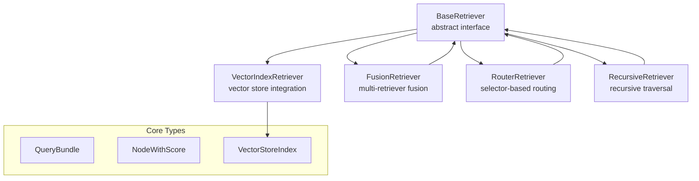
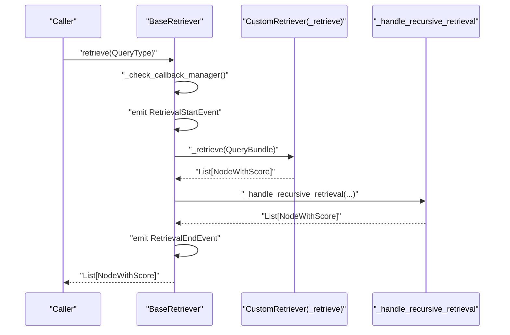
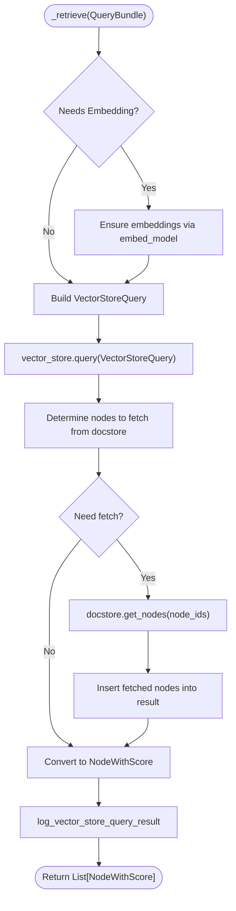
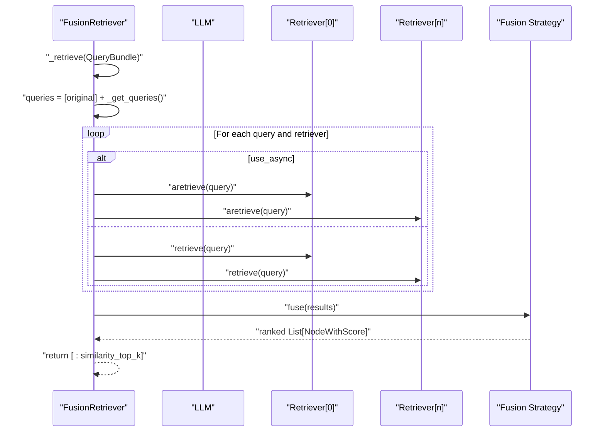
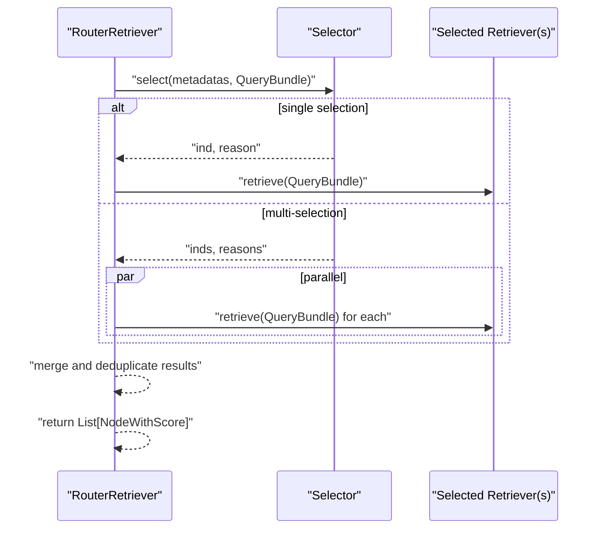
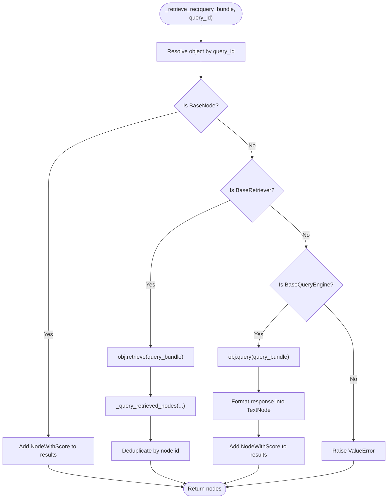
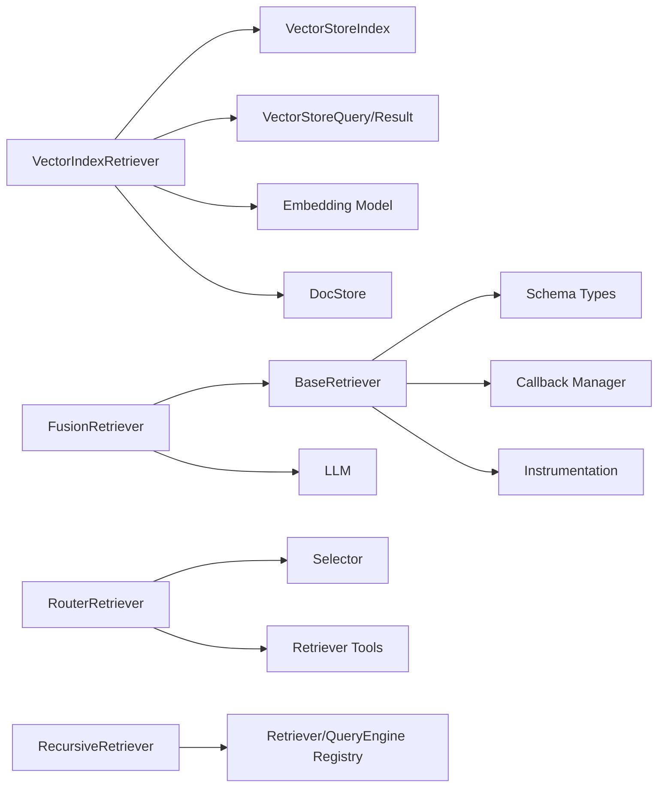

# Custom Retriever Development

<cite>
**Referenced Files in This Document**
- [base_retriever.py](file://llama-index-core/llama_index/core/base/base_retriever.py)
- [retriever.py](file://llama-index-core/llama_index/core/indices/vector_store/retrievers/retriever.py)
- [fusion_retriever.py](file://llama-index-core/llama_index/core/retrievers/fusion_retriever.py)
- [router_retriever.py](file://llama-index-core/llama_index/core/retrievers/router_retriever.py)
- [recursive_retriever.py](file://llama-index-core/llama_index/core/retrievers/recursive_retriever.py)
- [schema.py](file://llama-index-core/llama_index/core/schema.py)
</cite>

## Table of Contents
1. [Introduction](#introduction)
2. [Project Structure](#project-structure)
3. [Core Components](#core-components)
4. [Architecture Overview](#architecture-overview)
5. [Detailed Component Analysis](#detailed-component-analysis)
6. [Dependency Analysis](#dependency-analysis)
7. [Performance Considerations](#performance-considerations)
8. [Troubleshooting Guide](#troubleshooting-guide)
9. [Conclusion](#conclusion)
10. [Appendices](#appendices)

## Introduction
This document explains how to build custom retrievers in the LlamaIndex ecosystem. It focuses on the BaseRetriever inheritance pattern, required method implementations, and best practices. You will learn how to implement domain-specific retrieval logic, integrate external search systems, handle specialized data formats, and apply parameter validation, error handling, and performance optimizations. The guide also covers custom scoring functions, metadata filtering, result ranking, testing strategies, and integration with existing retrieval pipelines.

## Project Structure
The retriever ecosystem centers around a shared base class and several built-in implementations. The core building blocks are:
- BaseRetriever: the abstract interface that defines retrieval behavior and lifecycle hooks.
- VectorIndexRetriever: a concrete retriever that integrates with vector stores and supports metadata filtering and hybrid modes.
- FusionRetriever: orchestrates multiple retrievers, generating queries and fusing results.
- RouterRetriever: selects among candidate retrievers based on selector logic.
- RecursiveRetriever: traverses linked retrievers and query engines from nodes.

**Diagram sources**
- [base_retriever.py](file://llama-index-core/llama_index/core/base/base_retriever.py#L34-L275)
- [retriever.py](file://llama-index-core/llama_index/core/indices/vector_store/retrievers/retriever.py#L24-L268)
- [fusion_retriever.py](file://llama-index-core/llama_index/core/retrievers/fusion_retriever.py#L33-L305)
- [router_retriever.py](file://llama-index-core/llama_index/core/retrievers/router_retriever.py#L20-L143)
- [recursive_retriever.py](file://llama-index-core/llama_index/core/retrievers/recursive_retriever.py#L22-L222)

**Section sources**
- [base_retriever.py](file://llama-index-core/llama_index/core/base/base_retriever.py#L34-L275)
- [retriever.py](file://llama-index-core/llama_index/core/indices/vector_store/retrievers/retriever.py#L24-L268)
- [fusion_retriever.py](file://llama-index-core/llama_index/core/retrievers/fusion_retriever.py#L33-L305)
- [router_retriever.py](file://llama-index-core/llama_index/core/retrievers/router_retriever.py#L20-L143)
- [recursive_retriever.py](file://llama-index-core/llama_index/core/retrievers/recursive_retriever.py#L22-L222)

## Core Components
- BaseRetriever: Defines the retrieval lifecycle, including synchronous and asynchronous entry points, recursive retrieval handling, and instrumentation. Subclasses implement the internal _retrieve method and optionally override _aretrieve for async behavior.
- VectorIndexRetriever: Extends BaseRetriever to integrate with a VectorStoreIndex. It builds VectorStoreQuery objects, handles embedding computation when needed, fetches missing nodes from the docstore, and converts results to NodeWithScore with scores.
- FusionRetriever: Orchestrates multiple retrievers, optionally generating multiple queries per input, and fuses results using multiple strategies (reciprocal rank fusion, relative score fusion, distance-based score fusion, simple fusion).
- RouterRetriever: Uses a selector to choose one or multiple candidate retrievers based on query and metadata, then executes retrieval and merges results.
- RecursiveRetriever: Traverses nodes that link to other retrievers or query engines, recursively retrieving and merging results while deduplicating nodes.

Key data structures:
- QueryBundle: encapsulates the query string and optional embeddings or embedding strings.
- NodeWithScore: wraps a BaseNode with a numeric score for ranking.

**Section sources**
- [base_retriever.py](file://llama-index-core/llama_index/core/base/base_retriever.py#L34-L275)
- [retriever.py](file://llama-index-core/llama_index/core/indices/vector_store/retrievers/retriever.py#L24-L268)
- [fusion_retriever.py](file://llama-index-core/llama_index/core/retrievers/fusion_retriever.py#L33-L305)
- [router_retriever.py](file://llama-index-core/llama_index/core/retrievers/router_retriever.py#L20-L143)
- [recursive_retriever.py](file://llama-index-core/llama_index/core/retrievers/recursive_retriever.py#L22-L222)
- [schema.py](file://llama-index-core/llama_index/core/schema.py#L1-L200)

## Architecture Overview
The retrieval pipeline follows a consistent flow:
- Input: a string or a QueryBundle.
- Instrumentation: start/end events are emitted for tracing.
- Internal retrieval: subclasses implement _retrieve (and optionally _aretrieve).
- Post-processing: recursive retrieval handling and duplicate removal.
- Output: a ranked list of NodeWithScore.

**Diagram sources**
- [base_retriever.py](file://llama-index-core/llama_index/core/base/base_retriever.py#L185-L254)

## Detailed Component Analysis

### BaseRetriever: Inheritance Pattern and Required Methods
- Responsibilities:
  - Manage callback manager and instrumentation.
  - Convert string queries to QueryBundle.
  - Emit retrieval start/end events.
  - Provide synchronous and asynchronous entry points: retrieve and aretrieve.
  - Implement recursive retrieval handling and duplicate removal.
- Required method:
  - _retrieve(query_bundle): implement core retrieval logic.
- Optional method:
  - _aretrieve(query_bundle): implement async retrieval if applicable; otherwise reuse _retrieve.
- Utility helpers:
  - _retrieve_from_object and _aretrieve_from_object: support retrieving from nested objects (BaseNode, NodeWithScore, BaseQueryEngine, BaseRetriever).
  - _handle_recursive_retrieval and _ahandle_recursive_retrieval: traverse IndexNode links and merge results.

Best practices:
- Always call super().__init__ with appropriate callback_manager and object_map.
- Validate inputs early (e.g., reject empty queries).
- Use callback_manager events for observability.
- Preserve node uniqueness by relying on built-in deduplication or implement equivalent logic.

**Section sources**
- [base_retriever.py](file://llama-index-core/llama_index/core/base/base_retriever.py#L34-L275)

### VectorIndexRetriever: Integrating with Vector Stores
- Purpose: bridge BaseRetriever with VectorStoreIndex for embedding-based retrieval.
- Key capabilities:
  - Build VectorStoreQuery with top-k, filters, node/doc ids, and hybrid parameters.
  - Compute embeddings when required by the vector store mode.
  - Fetch missing nodes from the docstore and merge into results.
  - Convert raw VectorStoreQueryResult into NodeWithScore with scores.
- Parameters:
  - similarity_top_k, vector_store_query_mode, filters, alpha, node_ids, doc_ids, sparse_top_k, hybrid_top_k, embed_model, vector_store_kwargs.
- Error handling:
  - Raise KeyError for missing node ids during docstore insertion.
  - Raise ValueError when query result lacks both nodes and ids.

**Diagram sources**
- [retriever.py](file://llama-index-core/llama_index/core/indices/vector_store/retrievers/retriever.py#L104-L246)

**Section sources**
- [retriever.py](file://llama-index-core/llama_index/core/indices/vector_store/retrievers/retriever.py#L24-L268)

### FusionRetriever: Multi-Retriever Fusion and Ranking
- Purpose: combine results from multiple retrievers using configurable fusion strategies.
- Capabilities:
  - Generate multiple queries from the original query using an LLM.
  - Execute retrievals in sync or nested async mode.
  - Fuse results using:
    - Reciprocal Rank Fusion (RRF).
    - Relative Score Fusion (MinMax scaled and weighted).
    - Distance-Based Score Fusion (mean/std dev scaling).
    - Simple Fusion (max score per node across retrievers).
- Parameters:
  - retrievers, llm, query_gen_prompt, mode, similarity_top_k, num_queries, use_async, retriever_weights.
- Best practices:
  - Normalize scores consistently across retrievers before fusion.
  - Limit num_queries to balance quality and latency.
  - Use async execution for I/O-bound retrievers.

**Diagram sources**
- [fusion_retriever.py](file://llama-index-core/llama_index/core/retrievers/fusion_retriever.py#L263-L304)

**Section sources**
- [fusion_retriever.py](file://llama-index-core/llama_index/core/retrievers/fusion_retriever.py#L33-L305)

### RouterRetriever: Selector-Based Routing
- Purpose: dynamically choose one or multiple retrievers based on selector logic and query metadata.
- Capabilities:
  - Wrap candidate retrievers as tools exposing metadata.
  - Select using a selector (sync or async).
  - Execute chosen retrievers and merge results.
- Parameters:
  - selector, retriever_tools, llm, objects, object_map, verbose.
- Best practices:
  - Provide rich metadata in retriever tools to aid selection.
  - Use async execution when multiple retrievers are selected.

**Diagram sources**
- [router_retriever.py](file://llama-index-core/llama_index/core/retrievers/router_retriever.py#L78-L142)

**Section sources**
- [router_retriever.py](file://llama-index-core/llama_index/core/retrievers/router_retriever.py#L20-L143)

### RecursiveRetriever: Traversing Linked Retrievers and Query Engines
- Purpose: recursively follow IndexNode links to other retrievers or query engines.
- Capabilities:
  - Deduplicate nodes by id and keep highest score.
  - Support BaseNode, BaseRetriever, and BaseQueryEngine objects.
  - Optionally return additional sources via retrieve_all.
- Parameters:
  - root_id, retriever_dict, query_engine_dict, node_dict, callback_manager, query_response_tmpl, verbose.
- Best practices:
  - Ensure disjoint keys between retriever and query engine dicts.
  - Validate root_id exists in retriever_dict.

**Diagram sources**
- [recursive_retriever.py](file://llama-index-core/llama_index/core/retrievers/recursive_retriever.py#L158-L206)

**Section sources**
- [recursive_retriever.py](file://llama-index-core/llama_index/core/retrievers/recursive_retriever.py#L22-L222)

## Dependency Analysis
- BaseRetriever is the foundation for all retrievers and depends on:
  - Schema types (QueryBundle, NodeWithScore, BaseNode, IndexNode).
  - Callback manager and instrumentation.
- VectorIndexRetriever depends on:
  - VectorStoreIndex, VectorStoreQuery, VectorStoreQueryResult, and docstore.
  - Embedding model for query embeddings when required.
- FusionRetriever depends on:
  - Multiple BaseRetriever instances.
  - LLM for query generation.
- RouterRetriever depends on:
  - Selector and retriever tools.
- RecursiveRetriever depends on:
  - A registry of retrievers and query engines keyed by id.

**Diagram sources**
- [base_retriever.py](file://llama-index-core/llama_index/core/base/base_retriever.py#L1-L275)
- [retriever.py](file://llama-index-core/llama_index/core/indices/vector_store/retrievers/retriever.py#L1-L268)
- [fusion_retriever.py](file://llama-index-core/llama_index/core/retrievers/fusion_retriever.py#L1-L305)
- [router_retriever.py](file://llama-index-core/llama_index/core/retrievers/router_retriever.py#L1-L143)
- [recursive_retriever.py](file://llama-index-core/llama_index/core/retrievers/recursive_retriever.py#L1-L222)

**Section sources**
- [base_retriever.py](file://llama-index-core/llama_index/core/base/base_retriever.py#L1-L275)
- [retriever.py](file://llama-index-core/llama_index/core/indices/vector_store/retrievers/retriever.py#L1-L268)
- [fusion_retriever.py](file://llama-index-core/llama_index/core/retrievers/fusion_retriever.py#L1-L305)
- [router_retriever.py](file://llama-index-core/llama_index/core/retrievers/router_retriever.py#L1-L143)
- [recursive_retriever.py](file://llama-index-core/llama_index/core/retrievers/recursive_retriever.py#L1-L222)

## Performance Considerations
- Prefer async retrieval (_aretrieve) when underlying operations are I/O-bound (e.g., external APIs, vector store queries).
- Use similarity_top_k judiciously to limit downstream processing.
- Leverage metadata filters to reduce result sets early.
- For fusion:
  - Control num_queries to balance recall and latency.
  - Normalize scores consistently to avoid bias toward high-cardinality retrievers.
- For recursive retrieval:
  - Deduplicate aggressively to avoid redundant work.
  - Limit recursion depth by carefully managing IndexNode links.
- For vector retrieval:
  - Compute embeddings only when required by the query mode.
  - Fetch minimal missing nodes from docstore to reduce network overhead.

[No sources needed since this section provides general guidance]

## Troubleshooting Guide
Common issues and resolutions:
- Empty or invalid queries:
  - Validate inputs in _retrieve and raise clear errors for unsupported cases.
- Missing node ids during docstore insertion:
  - Ensure node ids exist in index and docstore; handle missing nodes gracefully.
- Selector failures:
  - Verify retriever tools provide sufficient metadata; handle selection errors explicitly.
- Duplicate nodes:
  - Rely on built-in deduplication or implement custom dedup logic by node id or hash.
- Embedding mismatches:
  - Confirm embed_model alignment with vector store query mode; precompute embeddings when beneficial.

**Section sources**
- [retriever.py](file://llama-index-core/llama_index/core/indices/vector_store/retrievers/retriever.py#L196-L209)
- [router_retriever.py](file://llama-index-core/llama_index/core/retrievers/router_retriever.py#L94-L99)
- [recursive_retriever.py](file://llama-index-core/llama_index/core/retrievers/recursive_retriever.py#L68-L82)

## Conclusion
Custom retrievers in LlamaIndex are built on a robust BaseRetriever abstraction. By implementing _retrieve (and optionally _aretrieve), leveraging instrumentation and callback managers, and integrating with core data structures like QueryBundle and NodeWithScore, you can implement domain-specific retrieval logic, integrate external systems, and compose sophisticated retrieval pipelines. Use the provided built-ins—VectorIndexRetriever, FusionRetriever, RouterRetriever, and RecursiveRetriever—as patterns for structuring your own retrievers, and apply the best practices outlined here for validation, error handling, and performance.

[No sources needed since this section summarizes without analyzing specific files]

## Appendices

### Step-by-Step: Implementing a Custom Retriever
- Define your subclass of BaseRetriever.
- Implement _retrieve(query_bundle) to produce NodeWithScore list.
- Optionally implement _aretrieve(query_bundle) for async behavior.
- Use callback_manager for events and instrumentation.
- Validate inputs and handle edge cases (e.g., empty queries, missing ids).
- Integrate with external systems by delegating to other retrievers or query engines.

**Section sources**
- [base_retriever.py](file://llama-index-core/llama_index/core/base/base_retriever.py#L256-L275)

### Example Patterns
- Domain-specific retrieval:
  - Wrap an external search client inside _retrieve and convert results to NodeWithScore.
- Metadata filtering:
  - Use VectorIndexRetriever’s filters or implement custom filtering logic in _retrieve.
- Custom scoring:
  - Assign scores in NodeWithScore based on domain heuristics or reranking models.
- Result ranking:
  - Sort NodeWithScore by score; consider normalization across multiple retrievers.

**Section sources**
- [retriever.py](file://llama-index-core/llama_index/core/indices/vector_store/retrievers/retriever.py#L212-L225)
- [fusion_retriever.py](file://llama-index-core/llama_index/core/retrievers/fusion_retriever.py#L137-L198)

### Testing Strategies
- Unit tests:
  - Mock external systems and verify _retrieve returns expected NodeWithScore.
  - Test async path via _aretrieve when applicable.
- Integration tests:
  - End-to-end retrieval pipeline with real or mocked vector stores.
- Observability:
  - Assert callback events and spans are emitted during retrieval.

[No sources needed since this section provides general guidance]