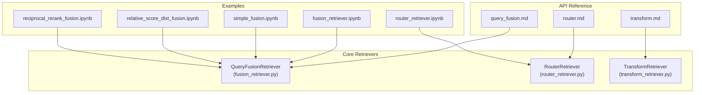
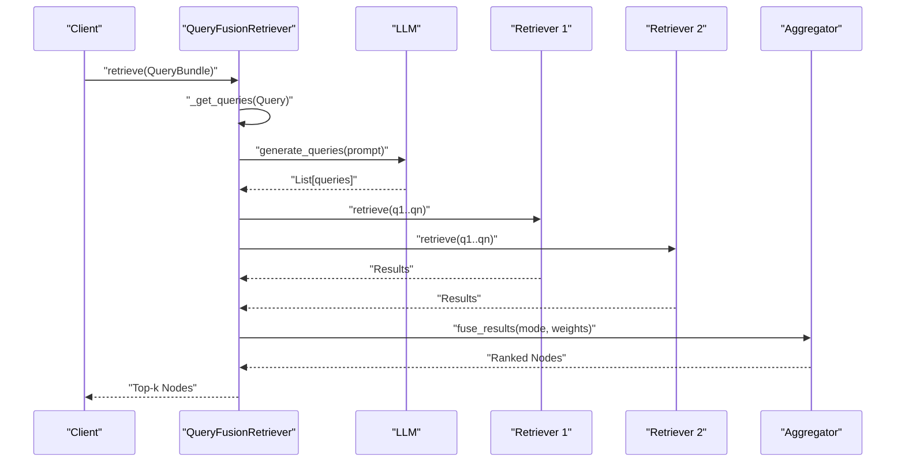
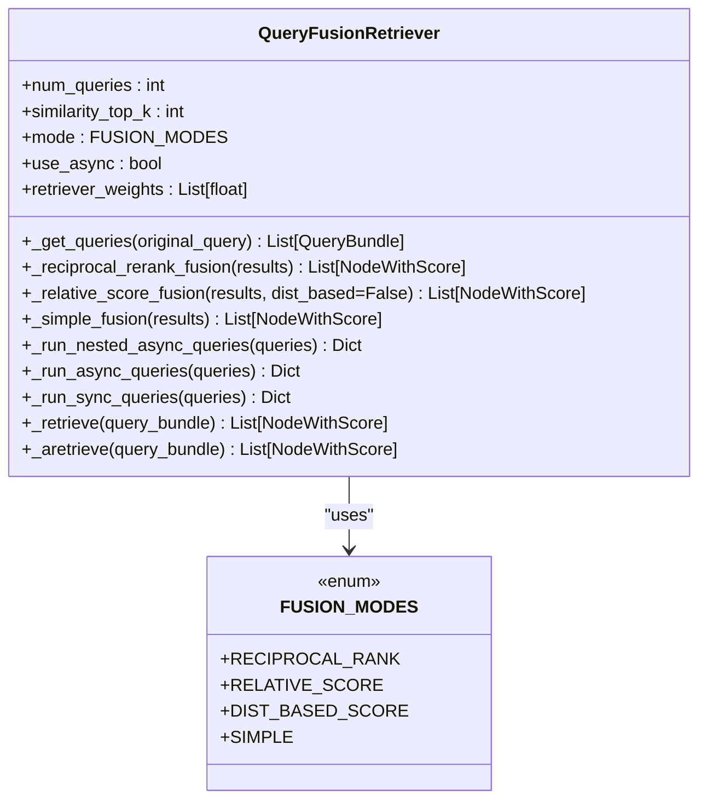
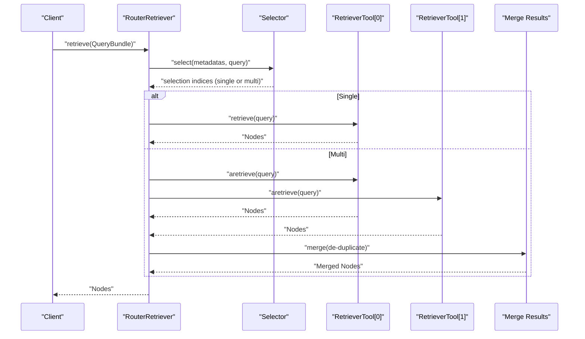
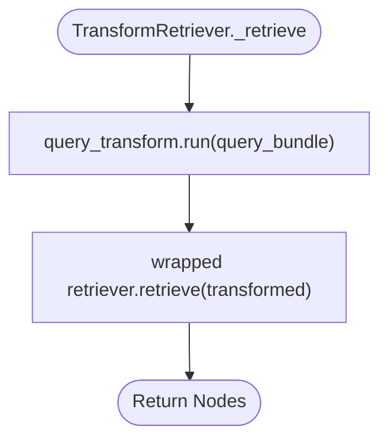
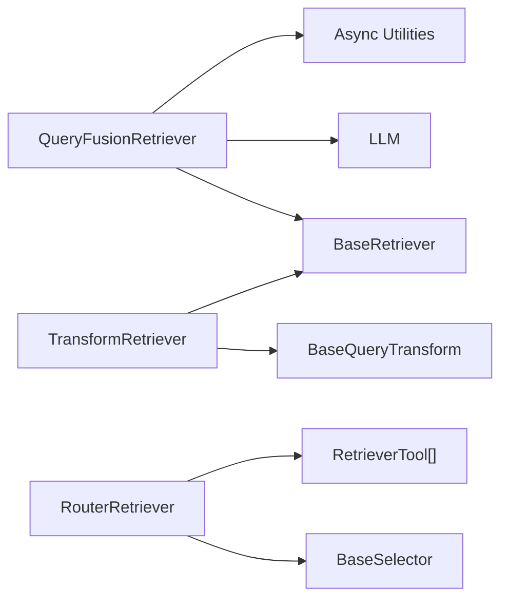

# Fusion and Router Strategies

<cite>
**Referenced Files in This Document**
- [fusion_retriever.py](file://llama-index-core/llama_index/core/retrievers/fusion_retriever.py)
- [router_retriever.py](file://llama-index-core/llama_index/core/retrievers/router_retriever.py)
- [transform_retriever.py](file://llama-index-core/llama_index/core/retrievers/transform_retriever.py)
- [query_fusion.md](file://docs/api_reference/api_reference/retrievers/query_fusion.md)
- [router.md](file://docs/api_reference/api_reference/retrievers/router.md)
- [transform.md](file://docs/api_reference/api_reference/retrievers/transform.md)
- [fusion_retriever.ipynb](file://docs/examples/low_level/fusion_retriever.ipynb)
- [reciprocal_rerank_fusion.ipynb](file://docs/examples/retrievers/reciprocal_rerank_fusion.ipynb)
- [relative_score_dist_fusion.ipynb](file://docs/examples/retrievers/relative_score_dist_fusion.ipynb)
- [simple_fusion.ipynb](file://docs/examples/retrievers/simple_fusion.ipynb)
- [router_retriever.ipynb](file://docs/examples/retrievers/router_retriever.ipynb)
</cite>

## Table of Contents
1. [Introduction](#introduction)
2. [Project Structure](#project-structure)
3. [Core Components](#core-components)
4. [Architecture Overview](#architecture-overview)
5. [Detailed Component Analysis](#detailed-component-analysis)
6. [Dependency Analysis](#dependency-analysis)
7. [Performance Considerations](#performance-considerations)
8. [Troubleshooting Guide](#troubleshooting-guide)
9. [Conclusion](#conclusion)
10. [Appendices](#appendices)

## Introduction
This document explains advanced retrieval strategies centered on fusion and router mechanisms. It covers:
- FusionRetriever scoring algorithms (weighted fusion, rank-based fusion, reciprocal rank fusion), parameter tuning, and result aggregation
- RouterRetriever decision logic, routing criteria, and multi-index selection
- TransformRetriever for query transformation and enhanced retrieval
- Practical examples of combining multiple strategies, configuring fusion weights, and optimizing router decisions
- Performance implications and best practices for each strategy

## Project Structure
The relevant components live under the core retrievers module and are complemented by example notebooks and API references:
- Core implementations: fusion, router, and transform retrievers
- Example notebooks demonstrating usage patterns for fusion and router strategies
- API reference pages for retriever classes

**Diagram sources**
- [fusion_retriever.py](file://llama-index-core/llama_index/core/retrievers/fusion_retriever.py#L1-L305)
- [router_retriever.py](file://llama-index-core/llama_index/core/retrievers/router_retriever.py#L1-L143)
- [transform_retriever.py](file://llama-index-core/llama_index/core/retrievers/transform_retriever.py#L1-L45)
- [reciprocal_rerank_fusion.ipynb](file://docs/examples/retrievers/reciprocal_rerank_fusion.ipynb#L1-L359)
- [relative_score_dist_fusion.ipynb](file://docs/examples/retrievers/relative_score_dist_fusion.ipynb#L1-L383)
- [simple_fusion.ipynb](file://docs/examples/retrievers/simple_fusion.ipynb#L1-L283)
- [router_retriever.ipynb](file://docs/examples/retrievers/router_retriever.ipynb#L1-L908)
- [fusion_retriever.ipynb](file://docs/examples/low_level/fusion_retriever.ipynb#L1-L671)
- [query_fusion.md](file://docs/api_reference/api_reference/retrievers/query_fusion.md#L1-L4)
- [router.md](file://docs/api_reference/api_reference/retrievers/router.md#L1-L4)
- [transform.md](file://docs/api_reference/api_reference/retrievers/transform.md#L1-L4)

**Section sources**
- [fusion_retriever.py](file://llama-index-core/llama_index/core/retrievers/fusion_retriever.py#L1-L305)
- [router_retriever.py](file://llama-index-core/llama_index/core/retrievers/router_retriever.py#L1-L143)
- [transform_retriever.py](file://llama-index-core/llama_index/core/retrievers/transform_retriever.py#L1-L45)
- [query_fusion.md](file://docs/api_reference/api_reference/retrievers/query_fusion.md#L1-L4)
- [router.md](file://docs/api_reference/api_reference/retrievers/router.md#L1-L4)
- [transform.md](file://docs/api_reference/api_reference/retrievers/transform.md#L1-L4)
- [reciprocal_rerank_fusion.ipynb](file://docs/examples/retrievers/reciprocal_rerank_fusion.ipynb#L1-L359)
- [relative_score_dist_fusion.ipynb](file://docs/examples/retrievers/relative_score_dist_fusion.ipynb#L1-L383)
- [simple_fusion.ipynb](file://docs/examples/retrievers/simple_fusion.ipynb#L1-L283)
- [router_retriever.ipynb](file://docs/examples/retrievers/router_retriever.ipynb#L1-L908)
- [fusion_retriever.ipynb](file://docs/examples/low_level/fusion_retriever.ipynb#L1-L671)

## Core Components
- QueryFusionRetriever: Generates multiple queries and fuses results from multiple retrievers using configurable fusion modes (reciprocal rank, relative score, distribution-based score, simple).
- RouterRetriever: Selects one or multiple retrievers based on a selector (LLM-driven) and aggregates results.
- TransformRetriever: Applies a query transformation before delegating to an underlying retriever.

Key capabilities:
- Query generation and rewriting for improved recall/precision
- Multiple fusion strategies with tunable parameters
- Async/sync execution and deduplication
- Selector-based routing with multi-option support

**Section sources**
- [fusion_retriever.py](file://llama-index-core/llama_index/core/retrievers/fusion_retriever.py#L33-L305)
- [router_retriever.py](file://llama-index-core/llama_index/core/retrievers/router_retriever.py#L20-L143)
- [transform_retriever.py](file://llama-index-core/llama_index/core/retrievers/transform_retriever.py#L10-L45)

## Architecture Overview
The strategies integrate as follows:
- FusionRetriever orchestrates query generation and multi-retriever execution, then applies fusion scoring and ranking.
- RouterRetriever delegates to a selector to choose candidate retrievers and optionally merges results.
- TransformRetriever wraps an existing retriever to preprocess queries.

**Diagram sources**
- [fusion_retriever.py](file://llama-index-core/llama_index/core/retrievers/fusion_retriever.py#L83-L305)
- [reciprocal_rerank_fusion.ipynb](file://docs/examples/retrievers/reciprocal_rerank_fusion.ipynb#L188-L200)
- [relative_score_dist_fusion.ipynb](file://docs/examples/retrievers/relative_score_dist_fusion.ipynb#L169-L180)
- [simple_fusion.ipynb](file://docs/examples/retrievers/simple_fusion.ipynb#L93-L103)

## Detailed Component Analysis

### QueryFusionRetriever
- Purpose: Ensemble retrieval with query generation and fusion.
- Modes:
  - Reciprocal Rank Fusion: Scores nodes by summing reciprocal ranks across retrievers/lists.
  - Relative Score Fusion: MinMax-scales scores per-list, weights by retriever weights, averages across queries.
  - Distribution-Based Score Fusion: Scales per-list using mean/stddev, then applies weighting and averaging.
  - Simple: De-duplicates and picks max score per node across retrievers.
- Parameters:
  - num_queries: Number of generated queries (default > 1 enables generation).
  - similarity_top_k: Final number of results to return.
  - retriever_weights: Per-retriever weights normalized internally.
  - mode: One of the fusion modes.
  - use_async: Parallel execution across queries and retrievers.
  - query_gen_prompt: Template for query generation.
- Execution:
  - Generates queries (unless disabled).
  - Runs retrievers asynchronously or synchronously.
  - Applies chosen fusion strategy and returns top-k results.

**Diagram sources**
- [fusion_retriever.py](file://llama-index-core/llama_index/core/retrievers/fusion_retriever.py#L24-L31)
- [fusion_retriever.py](file://llama-index-core/llama_index/core/retrievers/fusion_retriever.py#L33-L305)

**Section sources**
- [fusion_retriever.py](file://llama-index-core/llama_index/core/retrievers/fusion_retriever.py#L33-L305)
- [reciprocal_rerank_fusion.ipynb](file://docs/examples/retrievers/reciprocal_rerank_fusion.ipynb#L188-L200)
- [relative_score_dist_fusion.ipynb](file://docs/examples/retrievers/relative_score_dist_fusion.ipynb#L169-L180)
- [simple_fusion.ipynb](file://docs/examples/retrievers/simple_fusion.ipynb#L93-L103)
- [query_fusion.md](file://docs/api_reference/api_reference/retrievers/query_fusion.md#L1-L4)

#### Fusion Algorithms and Tuning
- Reciprocal Rank Fusion:
  - Impact parameter k controls outlier influence; default 60.0.
  - Effective when combining heterogeneous retrievers.
  - Example configuration: mode="reciprocal_rerank", similarity_top_k=2, num_queries=4.
- Relative Score Fusion:
  - MinMax scaling per-list; multiply by retriever weights; average across queries.
  - Good for weighted hybrid retrieval; tune retriever_weights to emphasize stronger retrievers.
  - Example configuration: retriever_weights=[0.6, 0.4], mode="relative_score".
- Distribution-Based Score Fusion:
  - Uses mean/stddev per-list for scaling; robust to skewed distributions.
  - Useful when score distributions vary widely across retrievers.
  - Example configuration: mode="dist_based_score", retriever_weights=[0.6, 0.4].
- Simple Fusion:
  - De-duplication and max-score selection; no scaling.
  - Fast baseline; good when retrievers are highly correlated.

Parameter tuning tips:
- Increase num_queries for complex questions; reduce for speed.
- Normalize retriever_weights to sum to 1; adjust relative importance.
- Prefer async execution for multi-retriever setups.
- Use similarity_top_k to cap downstream cost.

**Section sources**
- [fusion_retriever.py](file://llama-index-core/llama_index/core/retrievers/fusion_retriever.py#L100-L198)
- [reciprocal_rerank_fusion.ipynb](file://docs/examples/retrievers/reciprocal_rerank_fusion.ipynb#L188-L200)
- [relative_score_dist_fusion.ipynb](file://docs/examples/retrievers/relative_score_dist_fusion.ipynb#L169-L180)
- [simple_fusion.ipynb](file://docs/examples/retrievers/simple_fusion.ipynb#L93-L103)

#### Example Workflows
- Reciprocal Rank Fusion:
  - Create vector and BM25 retrievers, instantiate QueryFusionRetriever with mode="reciprocal_rerank", retrieve and synthesize.
- Relative Score Fusion:
  - Configure retriever_weights and mode="relative_score"; compare with distribution-based variant.
- Simple Fusion:
  - Combine multiple indexes with query generation; return top-k de-duplicated nodes.

**Section sources**
- [reciprocal_rerank_fusion.ipynb](file://docs/examples/retrievers/reciprocal_rerank_fusion.ipynb#L188-L200)
- [relative_score_dist_fusion.ipynb](file://docs/examples/retrievers/relative_score_dist_fusion.ipynb#L169-L180)
- [simple_fusion.ipynb](file://docs/examples/retrievers/simple_fusion.ipynb#L93-L103)
- [fusion_retriever.ipynb](file://docs/examples/low_level/fusion_retriever.ipynb#L577-L604)

### RouterRetriever
- Purpose: Dynamically route queries to one or multiple retrievers based on selector decisions.
- Inputs:
  - selector: BaseSelector (e.g., PydanticSingleSelector, PydanticMultiSelector).
  - retriever_tools: Sequence of RetrieverTool with metadata exposed to the selector.
- Decision logic:
  - Single selection: executes one retriever and returns merged results.
  - Multi-selection: executes multiple retrievers concurrently and merges results.
- Async support: Parallel execution when selecting multiple retrievers.

**Diagram sources**
- [router_retriever.py](file://llama-index-core/llama_index/core/retrievers/router_retriever.py#L78-L143)
- [router_retriever.ipynb](file://docs/examples/retrievers/router_retriever.ipynb#L282-L290)
- [router_retriever.ipynb](file://docs/examples/retrievers/router_retriever.ipynb#L621-L625)

**Section sources**
- [router_retriever.py](file://llama-index-core/llama_index/core/retrievers/router_retriever.py#L20-L143)
- [router.md](file://docs/api_reference/api_reference/retrievers/router.md#L1-L4)
- [router_retriever.ipynb](file://docs/examples/retrievers/router_retriever.ipynb#L282-L290)
- [router_retriever.ipynb](file://docs/examples/retrievers/router_retriever.ipynb#L621-L625)

#### Routing Criteria and Multi-Index Selection
- Metadata-driven selection: selector evaluates retriever metadata plus query to pick best candidates.
- Multi-selector: routes to multiple retrievers for broader coverage; results merged.
- Practical examples:
  - Single selector for targeted retrieval (e.g., “all context” vs. “specific context”).
  - Multi-selector for entity-focused retrieval (e.g., BM25-style keywords plus vector).

**Section sources**
- [router_retriever.ipynb](file://docs/examples/retrievers/router_retriever.ipynb#L282-L290)
- [router_retriever.ipynb](file://docs/examples/retrievers/router_retriever.ipynb#L621-L625)

### TransformRetriever
- Purpose: Preprocess queries before retrieval to improve matching.
- Behavior:
  - Applies a BaseQueryTransform to the QueryBundle.
  - Delegates to the wrapped retriever.
- Use cases:
  - Keyword extraction, query reformulation, or domain-specific normalization.

**Diagram sources**
- [transform_retriever.py](file://llama-index-core/llama_index/core/retrievers/transform_retriever.py#L40-L45)

**Section sources**
- [transform_retriever.py](file://llama-index-core/llama_index/core/retrievers/transform_retriever.py#L10-L45)
- [transform.md](file://docs/api_reference/api_reference/retrievers/transform.md#L1-L4)

## Dependency Analysis
- QueryFusionRetriever depends on:
  - BaseRetriever interface for retrievers
  - LLM for query generation
  - Async utilities for concurrent execution
- RouterRetriever depends on:
  - BaseSelector for decision logic
  - RetrieverTool wrappers exposing metadata
- TransformRetriever depends on:
  - BaseQueryTransform for query preprocessing

**Diagram sources**
- [fusion_retriever.py](file://llama-index-core/llama_index/core/retrievers/fusion_retriever.py#L1-L14)
- [router_retriever.py](file://llama-index-core/llama_index/core/retrievers/router_retriever.py#L1-L16)
- [transform_retriever.py](file://llama-index-core/llama_index/core/retrievers/transform_retriever.py#L1-L8)

**Section sources**
- [fusion_retriever.py](file://llama-index-core/llama_index/core/retrievers/fusion_retriever.py#L1-L14)
- [router_retriever.py](file://llama-index-core/llama_index/core/retrievers/router_retriever.py#L1-L16)
- [transform_retriever.py](file://llama-index-core/llama_index/core/retrievers/transform_retriever.py#L1-L8)

## Performance Considerations
- FusionRetriever
  - num_queries: Increasing queries improves recall but raises latency; balance with use_async.
  - retriever_weights: Favor stronger retrievers to reduce unnecessary computation.
  - mode: Reciprocal rank fusion is efficient; relative/dist-based fusion adds scaling overhead.
  - similarity_top_k: Lower values reduce post-processing cost.
- RouterRetriever
  - Multi-selection increases parallelism but also resource usage; monitor concurrency.
  - Selector cost: LLM-based selectors add latency; consider caching or simpler heuristics if acceptable.
- TransformRetriever
  - Query transforms add minimal overhead; ensure transformations are lightweight.

[No sources needed since this section provides general guidance]

## Troubleshooting Guide
- QueryFusionRetriever
  - Symptom: Unexpected empty results.
    - Verify retrievers return results and num_queries is sufficient.
    - Check mode correctness and retriever_weights normalization.
  - Symptom: Slow retrieval.
    - Enable use_async and reduce num_queries or similarity_top_k.
- RouterRetriever
  - Symptom: No retriever selected.
    - Inspect selector metadata and query relevance; ensure retriever_tools are properly constructed.
  - Symptom: Incorrect multi-selection.
    - Confirm selector supports multi-option and that merging logic is desired.
- TransformRetriever
  - Symptom: Poor query matches.
    - Review query_transform behavior and ensure it aligns with retriever strengths.

**Section sources**
- [fusion_retriever.py](file://llama-index-core/llama_index/core/retrievers/fusion_retriever.py#L263-L305)
- [router_retriever.py](file://llama-index-core/llama_index/core/retrievers/router_retriever.py#L78-L143)
- [transform_retriever.py](file://llama-index-core/llama_index/core/retrievers/transform_retriever.py#L40-L45)

## Conclusion
Fusion and router strategies offer powerful ways to improve retrieval quality and adaptiveness:
- FusionRetriever leverages query generation and multiple fusion modes to enhance recall and ranking.
- RouterRetriever dynamically selects appropriate retrievers using selector-driven logic.
- TransformRetriever augments query understanding prior to retrieval.
Proper configuration of parameters (weights, queries, top-k) and execution mode (async/sync) yields significant gains in accuracy and efficiency.

[No sources needed since this section summarizes without analyzing specific files]

## Appendices

### Practical Recipes and Examples
- Reciprocal Rank Fusion
  - Configure: mode="reciprocal_rerank", similarity_top_k=2, num_queries=4.
  - Use vector + BM25 hybrid retrievers.
  - See [reciprocal_rerank_fusion.ipynb](file://docs/examples/retrievers/reciprocal_rerank_fusion.ipynb#L188-L200).
- Relative Score Fusion
  - Configure: retriever_weights=[0.6, 0.4], mode="relative_score".
  - Compare with distribution-based variant.
  - See [relative_score_dist_fusion.ipynb](file://docs/examples/retrievers/relative_score_dist_fusion.ipynb#L169-L180).
- Simple Fusion
  - Configure: num_queries=4, use_async=True.
  - Combine multiple indexes.
  - See [simple_fusion.ipynb](file://docs/examples/retrievers/simple_fusion.ipynb#L93-L103).
- RouterRetriever
  - Single selector: choose “all context” vs. “specific context”.
  - Multi-selector: combine BM25 and vector retrievers for entity-focused queries.
  - See [router_retriever.ipynb](file://docs/examples/retrievers/router_retriever.ipynb#L282-L290) and [router_retriever.ipynb](file://docs/examples/retrievers/router_retriever.ipynb#L621-L625).
- TransformRetriever
  - Wrap an existing retriever with a query transform.
  - See [transform_retriever.py](file://llama-index-core/llama_index/core/retrievers/transform_retriever.py#L10-L45).

**Section sources**
- [reciprocal_rerank_fusion.ipynb](file://docs/examples/retrievers/reciprocal_rerank_fusion.ipynb#L188-L200)
- [relative_score_dist_fusion.ipynb](file://docs/examples/retrievers/relative_score_dist_fusion.ipynb#L169-L180)
- [simple_fusion.ipynb](file://docs/examples/retrievers/simple_fusion.ipynb#L93-L103)
- [router_retriever.ipynb](file://docs/examples/retrievers/router_retriever.ipynb#L282-L290)
- [router_retriever.ipynb](file://docs/examples/retrievers/router_retriever.ipynb#L621-L625)
- [transform_retriever.py](file://llama-index-core/llama_index/core/retrievers/transform_retriever.py#L10-L45)