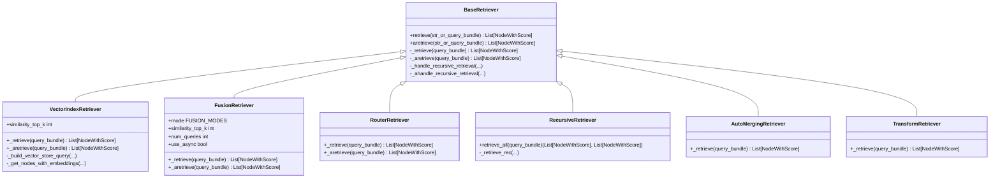

# Retrieval API

<cite>
**Referenced Files in This Document**
- [base_retriever.py](file://llama-index-core/llama_index/core/base/base_retriever.py)
- [fusion_retriever.py](file://llama-index-core/llama_index/core/retrievers/fusion_retriever.py)
- [router_retriever.py](file://llama-index-core/llama_index/core/retrievers/router_retriever.py)
- [recursive_retriever.py](file://llama-index-core/llama_index/core/retrievers/recursive_retriever.py)
- [auto_merging_retriever.py](file://llama-index-core/llama_index/core/retrievers/auto_merging_retriever.py)
- [transform_retriever.py](file://llama-index-core/llama_index/core/retrievers/transform_retriever.py)
- [vector_index_retriever.py](file://llama-index-core/llama_index/core/indices/vector_store/retrievers/retriever.py)
- [base_retriever_indices.py](file://llama-index-core/llama_index/core/indices/base_retriever.py)
</cite>

## Table of Contents
1. [Introduction](#introduction)
2. [Project Structure](#project-structure)
3. [Core Components](#core-components)
4. [Architecture Overview](#architecture-overview)
5. [Detailed Component Analysis](#detailed-component-analysis)
6. [Dependency Analysis](#dependency-analysis)
7. [Performance Considerations](#performance-considerations)
8. [Troubleshooting Guide](#troubleshooting-guide)
9. [Conclusion](#conclusion)
10. [Appendices](#appendices)

## Introduction
This document provides comprehensive API documentation for the Retrieval system. It covers the base Retriever interface, built-in retriever implementations, fusion and router patterns, and the relationship between retrievers and indices. It also explains retrieval strategies, scoring mechanisms, ranking algorithms, and how to configure and optimize retrieval performance. Guidance is included for implementing custom retrievers, batching retrieval, filtering results, and handling metadata.

## Project Structure
The Retrieval system is centered around a base interface and several specialized retrievers. Built-in implementations include fusion, router, recursive, auto-merging, and transform retrievers. Vector index-backed retrievers connect to indices and vector stores.

**Diagram sources**
- [base_retriever.py](file://llama-index-core/llama_index/core/base/base_retriever.py#L34-L275)
- [fusion_retriever.py](file://llama-index-core/llama_index/core/retrievers/fusion_retriever.py#L33-L305)
- [router_retriever.py](file://llama-index-core/llama_index/core/retrievers/router_retriever.py#L20-L143)
- [recursive_retriever.py](file://llama-index-core/llama_index/core/retrievers/recursive_retriever.py#L22-L222)
- [auto_merging_retriever.py](file://llama-index-core/llama_index/core/retrievers/auto_merging_retriever.py#L26-L195)
- [transform_retriever.py](file://llama-index-core/llama_index/core/retrievers/transform_retriever.py#L10-L45)
- [vector_index_retriever.py](file://llama-index-core/llama_index/core/indices/vector_store/retrievers/retriever.py#L24-L268)

**Section sources**
- [base_retriever.py](file://llama-index-core/llama_index/core/base/base_retriever.py#L34-L275)
- [vector_index_retriever.py](file://llama-index-core/llama_index/core/indices/vector_store/retrievers/retriever.py#L24-L268)

## Core Components
- BaseRetriever: Defines the asynchronous and synchronous retrieval contract, instrumentation, recursion over linked retrievers, and duplicate handling.
- VectorIndexRetriever: Bridges a VectorStoreIndex to the retrieval interface, supporting embedding computation, query modes, and hybrid retrieval.
- FusionRetriever: Generates multiple queries and fuses results from multiple retrievers using configurable fusion strategies.
- RouterRetriever: Selects a single or multiple candidate retrievers based on selector logic and metadata.
- RecursiveRetriever: Recursively traverses IndexNode-linked retrievers and query engines.
- AutoMergingRetriever: Merges child nodes into parent nodes and fills gaps to improve context quality.
- TransformRetriever: Applies a query transformation prior to delegating to another retriever.

Key capabilities:
- Batch retrieval via async orchestration in fusion and router.
- Result filtering and deduplication across retrieval chains.
- Metadata exposure and propagation through retriever tools and recursive traversal.
- Configurable scoring and ranking via fusion modes and vector similarity.

**Section sources**
- [base_retriever.py](file://llama-index-core/llama_index/core/base/base_retriever.py#L34-L275)
- [vector_index_retriever.py](file://llama-index-core/llama_index/core/indices/vector_store/retrievers/retriever.py#L24-L268)
- [fusion_retriever.py](file://llama-index-core/llama_index/core/retrievers/fusion_retriever.py#L33-L305)
- [router_retriever.py](file://llama-index-core/llama_index/core/retrievers/router_retriever.py#L20-L143)
- [recursive_retriever.py](file://llama-index-core/llama_index/core/retrievers/recursive_retriever.py#L22-L222)
- [auto_merging_retriever.py](file://llama-index-core/llama_index/core/retrievers/auto_merging_retriever.py#L26-L195)
- [transform_retriever.py](file://llama-index-core/llama_index/core/retrievers/transform_retriever.py#L10-L45)

## Architecture Overview
The Retrieval subsystem composes retrievers to form flexible pipelines. VectorIndexRetriever integrates with indices and vector stores. Fusion and Router retrievers orchestrate multiple retrievers. Recursive, AutoMerging, and Transform retrievers enhance retrieval quality and composition.

**Diagram sources**
- [base_retriever.py](file://llama-index-core/llama_index/core/base/base_retriever.py#L34-L275)
- [vector_index_retriever.py](file://llama-index-core/llama_index/core/indices/vector_store/retrievers/retriever.py#L24-L268)
- [fusion_retriever.py](file://llama-index-core/llama_index/core/retrievers/fusion_retriever.py#L33-L305)
- [router_retriever.py](file://llama-index-core/llama_index/core/retrievers/router_retriever.py#L20-L143)
- [recursive_retriever.py](file://llama-index-core/llama_index/core/retrievers/recursive_retriever.py#L22-L222)
- [auto_merging_retriever.py](file://llama-index-core/llama_index/core/retrievers/auto_merging_retriever.py#L26-L195)
- [transform_retriever.py](file://llama-index-core/llama_index/core/retrievers/transform_retriever.py#L10-L45)

## Detailed Component Analysis

### BaseRetriever
- Purpose: Defines the retrieval contract and shared behavior for all retrievers.
- Key methods:
  - retrieve/aretrieve: Public entry points that trigger instrumentation, callbacks, and recursive resolution.
  - _retrieve/_aretrieve: Abstract methods to be implemented by subclasses.
  - _handle_recursive_retrieval/_ahandle_recursive_retrieval: Resolves IndexNode links to objects and deduplicates results.
- Instrumentation and callbacks: Emits retrieval start/end events and logs nodes.

**Diagram sources**
- [base_retriever.py](file://llama-index-core/llama_index/core/base/base_retriever.py#L185-L254)

**Section sources**
- [base_retriever.py](file://llama-index-core/llama_index/core/base/base_retriever.py#L34-L275)

### VectorIndexRetriever
- Purpose: Implements retrieval against a VectorStoreIndex.
- Capabilities:
  - Embedding-aware query building and aggregation.
  - Multiple query modes (dense, sparse, hybrid).
  - Metadata filtering and node/doc-level constraints.
  - Fetching missing nodes from the docstore when vector store lacks text.
  - Async support for embedding and query.
- Scoring: Uses similarity scores returned by the vector store.

**Diagram sources**
- [vector_index_retriever.py](file://llama-index-core/llama_index/core/indices/vector_store/retrievers/retriever.py#L104-L268)

**Section sources**
- [vector_index_retriever.py](file://llama-index-core/llama_index/core/indices/vector_store/retrievers/retriever.py#L24-L268)

### FusionRetriever
- Purpose: Generates multiple queries and fuses results from multiple retrievers.
- Modes:
  - reciprocal_rerank: Reciprocal rank fusion with a tunable k parameter.
  - relative_score: Min-max scaling per retriever, weighted, and normalized.
  - dist_based_score: Distance-based scaling using mean and std dev.
  - simple: Max-score fusion with deduplication.
- Configuration:
  - num_queries: Number of generated queries (1 means no generation).
  - similarity_top_k: Final top-k after fusion.
  - retriever_weights: Per-retriever weights (normalized internally).
  - use_async: Parallel execution across queries and retrievers.
- LLM-driven query generation: Uses a prompt template resolved via LLM.

**Diagram sources**
- [fusion_retriever.py](file://llama-index-core/llama_index/core/retrievers/fusion_retriever.py#L263-L305)

**Section sources**
- [fusion_retriever.py](file://llama-index-core/llama_index/core/retrievers/fusion_retriever.py#L33-L305)

### RouterRetriever
- Purpose: Selects one or multiple retrievers based on selector logic and metadata.
- Inputs:
  - selector: Chooses among retriever_tools.
  - retriever_tools: Tools wrapping candidate retrievers with metadata.
- Behavior:
  - Single selection: Executes chosen retriever.
  - Multi-selection: Executes multiple retrievers concurrently and merges results.
- Async: Supports async selection and retrieval.

**Diagram sources**
- [router_retriever.py](file://llama-index-core/llama_index/core/retrievers/router_retriever.py#L78-L143)

**Section sources**
- [router_retriever.py](file://llama-index-core/llama_index/core/retrievers/router_retriever.py#L20-L143)

### RecursiveRetriever
- Purpose: Recursively explores IndexNode-linked retrievers or query engines.
- Features:
  - Root id routing to a specific retriever/query engine.
  - Deduplication by node id and optional score retention.
  - Optional template to format query+response into a node for query engines.
- Methods:
  - retrieve_all: Returns both primary and additional source nodes.

**Diagram sources**
- [recursive_retriever.py](file://llama-index-core/llama_index/core/retrievers/recursive_retriever.py#L158-L206)

**Section sources**
- [recursive_retriever.py](file://llama-index-core/llama_index/core/retrievers/recursive_retriever.py#L22-L222)

### AutoMergingRetriever
- Purpose: Improves context quality by merging child nodes into parent nodes and filling gaps.
- Strategy:
  - Compute child-to-parent ratios; merge when threshold exceeded.
  - Fill intermediate nodes when adjacency is detected.
  - Iteratively refine until no changes occur.
- Scoring: Averages scores across merged children.

**Diagram sources**
- [auto_merging_retriever.py](file://llama-index-core/llama_index/core/retrievers/auto_merging_retriever.py#L176-L195)

**Section sources**
- [auto_merging_retriever.py](file://llama-index-core/llama_index/core/retrievers/auto_merging_retriever.py#L26-L195)

### TransformRetriever
- Purpose: Applies a query transformation before delegating to another retriever.
- Inputs:
  - retriever: Target retriever.
  - query_transform: Transformation applied to QueryBundle.
  - transform_metadata: Optional metadata passed to transformation.

**Diagram sources**
- [transform_retriever.py](file://llama-index-core/llama_index/core/retrievers/transform_retriever.py#L40-L45)

**Section sources**
- [transform_retriever.py](file://llama-index-core/llama_index/core/retrievers/transform_retriever.py#L10-L45)

## Dependency Analysis
- BaseRetriever is the foundation for all retrievers and defines shared behavior.
- VectorIndexRetriever depends on VectorStoreIndex, embedding model, and docstore.
- FusionRetriever composes multiple retrievers and optionally an LLM for query generation.
- RouterRetriever depends on a selector and retriever tools.
- RecursiveRetriever depends on IndexNode linking and object_map.
- AutoMergingRetriever depends on storage context and node relationships.
- TransformRetriever depends on a query transform component.

**Diagram sources**
- [base_retriever.py](file://llama-index-core/llama_index/core/base/base_retriever.py#L34-L275)
- [vector_index_retriever.py](file://llama-index-core/llama_index/core/indices/vector_store/retrievers/retriever.py#L24-L268)
- [fusion_retriever.py](file://llama-index-core/llama_index/core/retrievers/fusion_retriever.py#L33-L305)
- [router_retriever.py](file://llama-index-core/llama_index/core/retrievers/router_retriever.py#L20-L143)
- [recursive_retriever.py](file://llama-index-core/llama_index/core/retrievers/recursive_retriever.py#L22-L222)
- [auto_merging_retriever.py](file://llama-index-core/llama_index/core/retrievers/auto_merging_retriever.py#L26-L195)
- [transform_retriever.py](file://llama-index-core/llama_index/core/retrievers/transform_retriever.py#L10-L45)

**Section sources**
- [base_retriever.py](file://llama-index-core/llama_index/core/base/base_retriever.py#L34-L275)
- [vector_index_retriever.py](file://llama-index-core/llama_index/core/indices/vector_store/retrievers/retriever.py#L24-L268)
- [fusion_retriever.py](file://llama-index-core/llama_index/core/retrievers/fusion_retriever.py#L33-L305)
- [router_retriever.py](file://llama-index-core/llama_index/core/retrievers/router_retriever.py#L20-L143)
- [recursive_retriever.py](file://llama-index-core/llama_index/core/retrievers/recursive_retriever.py#L22-L222)
- [auto_merging_retriever.py](file://llama-index-core/llama_index/core/retrievers/auto_merging_retriever.py#L26-L195)
- [transform_retriever.py](file://llama-index-core/llama_index/core/retrievers/transform_retriever.py#L10-L45)

## Performance Considerations
- Asynchronous execution:
  - FusionRetriever supports parallel execution across queries and retrievers when enabled.
  - RouterRetriever can execute multiple retrievers concurrently in multi-selection mode.
  - VectorIndexRetriever supports async embedding computation and query execution.
- Embedding computation:
  - VectorIndexRetriever aggregates embeddings for embedding-aware modes.
  - Avoid unnecessary embedding computation by selecting appropriate query modes.
- Fusion strategies:
  - reciprocal_rerank and relative_score modes involve sorting and scaling; tune num_queries and retriever_weights to balance quality and latency.
- Deduplication:
  - BaseRetriever removes duplicates based on node hash/ref_doc_id; RecursiveRetriever deduplicates by node id.
- Hybrid retrieval:
  - VectorIndexRetriever supports sparse/dense hybrid modes; tune alpha and top-k parameters for desired recall/precision trade-offs.
- Auto-merging:
  - Iterative merging reduces node count but adds overhead; evaluate whether merging improves downstream performance.

[No sources needed since this section provides general guidance]

## Troubleshooting Guide
- Retrieval returns empty results:
  - Verify query mode and filters; check VectorIndexRetriever’s query construction and vector store capabilities.
  - Ensure embeddings are computed when required by the selected mode.
- Duplicate nodes in results:
  - Confirm deduplication behavior is active; BaseRetriever removes duplicates by hash/ref_doc_id; RecursiveRetriever deduplicates by node id.
- Router selection fails:
  - Validate retriever tools’ metadata and selector configuration; ensure at least one retriever matches the selector criteria.
- Recursive traversal errors:
  - Confirm IndexNode index_id resolves to an existing retriever or query engine; check object_map and node dictionaries.
- Auto-merging not effective:
  - Adjust simple_ratio_thresh; verify parent-child relationships and node adjacency.

**Section sources**
- [base_retriever.py](file://llama-index-core/llama_index/core/base/base_retriever.py#L116-L183)
- [vector_index_retriever.py](file://llama-index-core/llama_index/core/indices/vector_store/retrievers/retriever.py#L104-L268)
- [router_retriever.py](file://llama-index-core/llama_index/core/retrievers/router_retriever.py#L78-L143)
- [recursive_retriever.py](file://llama-index-core/llama_index/core/retrievers/recursive_retriever.py#L142-L206)
- [auto_merging_retriever.py](file://llama-index-core/llama_index/core/retrievers/auto_merging_retriever.py#L56-L195)

## Conclusion
The Retrieval system offers a robust, extensible framework for composing retrieval pipelines. The BaseRetriever interface ensures consistent behavior, while specialized retrievers enable advanced strategies such as fusion, routing, recursion, merging, and transformation. VectorIndexRetriever connects seamlessly to indices and vector stores, supporting diverse query modes and metadata filtering. By tuning fusion modes, router selection, and retrieval parameters, users can optimize both accuracy and performance.

[No sources needed since this section summarizes without analyzing specific files]

## Appendices

### Retrieval Strategies and Ranking Algorithms
- Fusion strategies:
  - reciprocal_rerank: Aggregates reciprocal ranks across retrievers and queries.
  - relative_score: Scales scores per retriever and weights them.
  - dist_based_score: Uses distribution-based scaling with mean/std dev.
  - simple: Keeps the maximum score per node across retrievers.
- Router selection:
  - Single vs multi-selection based on selector logic and metadata.
- Vector similarity:
  - Scores derived from vector store similarity; configurable top-k.

**Section sources**
- [fusion_retriever.py](file://llama-index-core/llama_index/core/retrievers/fusion_retriever.py#L24-L31)
- [fusion_retriever.py](file://llama-index-core/llama_index/core/retrievers/fusion_retriever.py#L100-L198)
- [router_retriever.py](file://llama-index-core/llama_index/core/retrievers/router_retriever.py#L78-L143)
- [vector_index_retriever.py](file://llama-index-core/llama_index/core/indices/vector_store/retrievers/retriever.py#L212-L246)

### Relationship Between Retriever and Indices
- VectorIndexRetriever encapsulates a VectorStoreIndex and delegates retrieval to it.
- Indices provide the underlying storage and retrieval mechanisms; retrievers adapt these to the unified interface.
- Docstore integration ensures nodes are fetched when vector stores do not store full text.

**Section sources**
- [vector_index_retriever.py](file://llama-index-core/llama_index/core/indices/vector_store/retrievers/retriever.py#L24-L268)
- [base_retriever_indices.py](file://llama-index-core/llama_index/core/indices/base_retriever.py#L1-L7)

### Implementing Custom Retrievers
- Extend BaseRetriever and implement:
  - _retrieve for synchronous retrieval.
  - Optionally override _aretrieve for asynchronous retrieval.
- Integrate with indices:
  - Use VectorIndexRetriever pattern to leverage embedding models and vector stores.
- Compose with other retrievers:
  - Wrap with TransformRetriever for query transformations.
  - Combine with FusionRetriever or RouterRetriever for ensemble strategies.
- Handle metadata:
  - Propagate metadata through retriever tools and recursive traversal.

**Section sources**
- [base_retriever.py](file://llama-index-core/llama_index/core/base/base_retriever.py#L256-L275)
- [vector_index_retriever.py](file://llama-index-core/llama_index/core/indices/vector_store/retrievers/retriever.py#L24-L268)
- [transform_retriever.py](file://llama-index-core/llama_index/core/retrievers/transform_retriever.py#L10-L45)
- [fusion_retriever.py](file://llama-index-core/llama_index/core/retrievers/fusion_retriever.py#L33-L71)
- [router_retriever.py](file://llama-index-core/llama_index/core/retrievers/router_retriever.py#L35-L54)

### Batch Retrieval, Filtering, and Metadata Handling
- Batch retrieval:
  - FusionRetriever and RouterRetriever support parallel execution across queries and retrievers.
- Filtering:
  - VectorIndexRetriever supports metadata filters and doc/node id constraints.
- Metadata:
  - RouterRetriever exposes retriever metadata to the selector.
  - RecursiveRetriever preserves metadata during traversal.

**Section sources**
- [fusion_retriever.py](file://llama-index-core/llama_index/core/retrievers/fusion_retriever.py#L219-L262)
- [router_retriever.py](file://llama-index-core/llama_index/core/retrievers/router_retriever.py#L78-L143)
- [vector_index_retriever.py](file://llama-index-core/llama_index/core/indices/vector_store/retrievers/retriever.py#L130-L171)
- [recursive_retriever.py](file://llama-index-core/llama_index/core/retrievers/recursive_retriever.py#L142-L206)