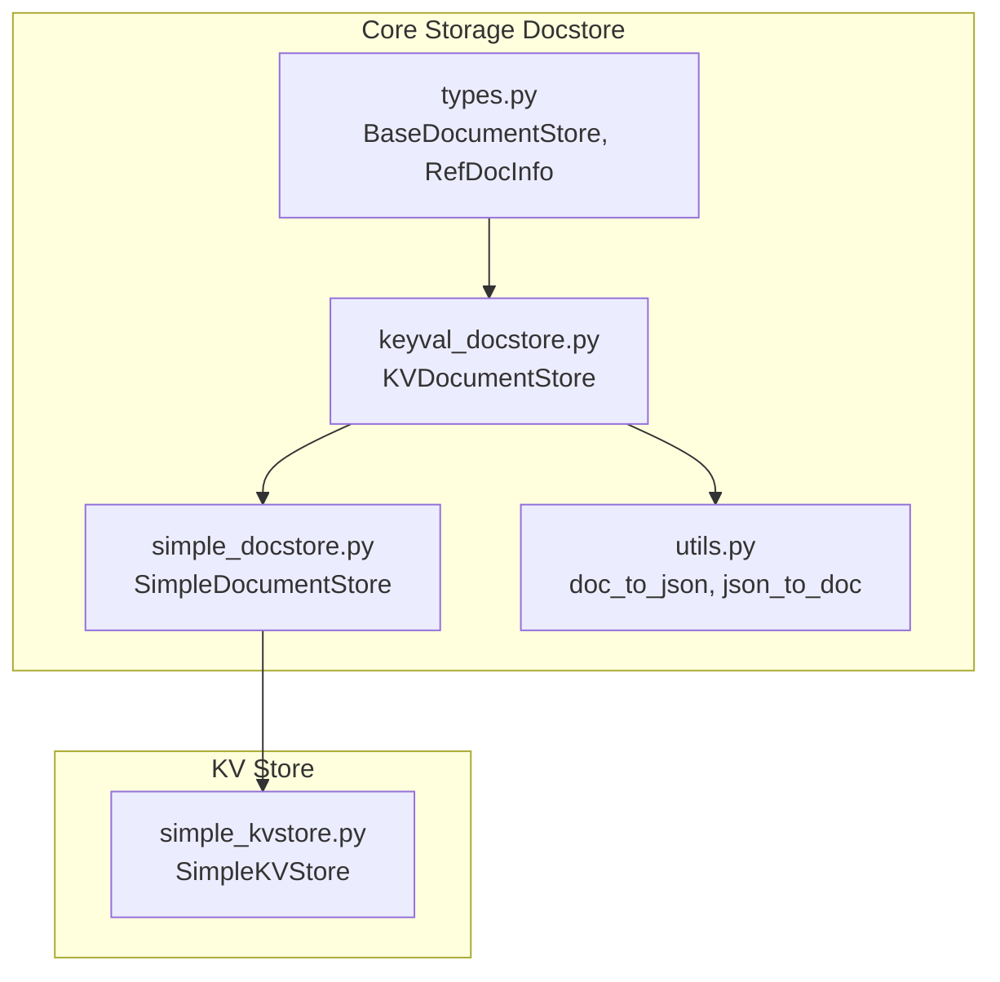
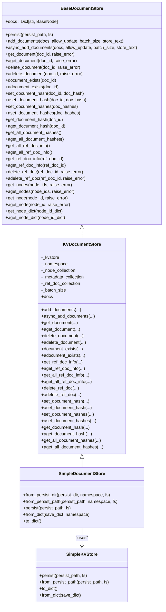
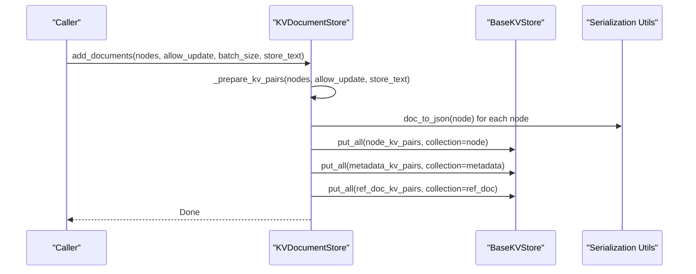
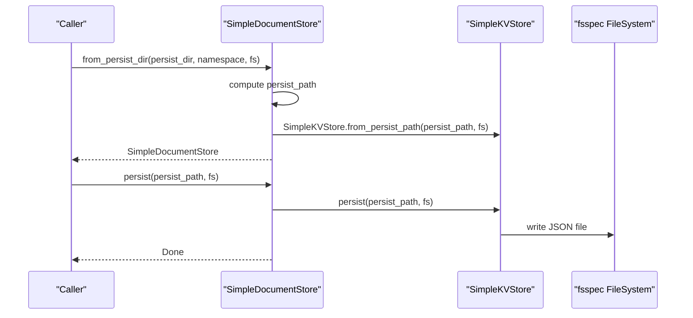
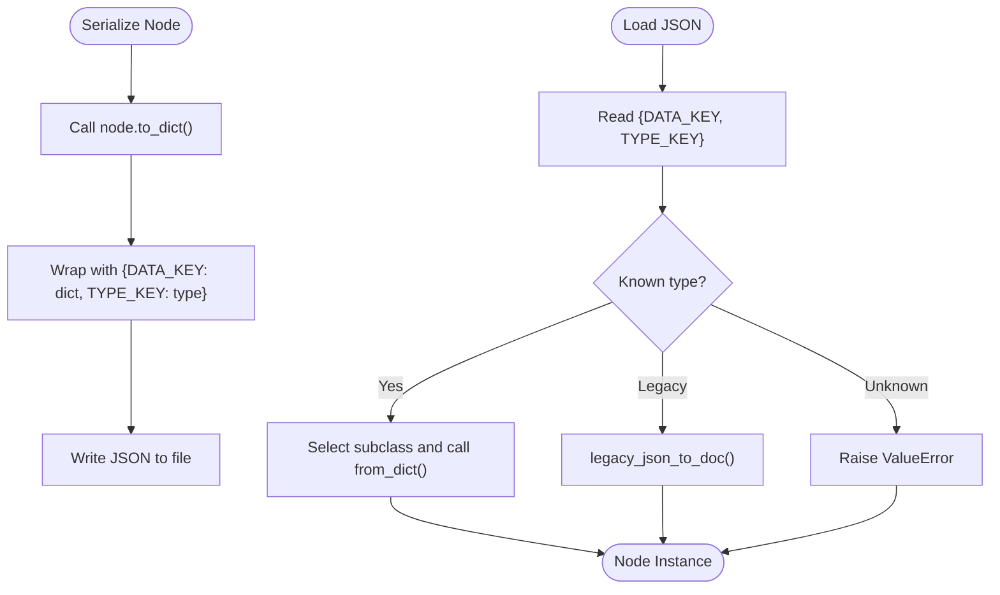
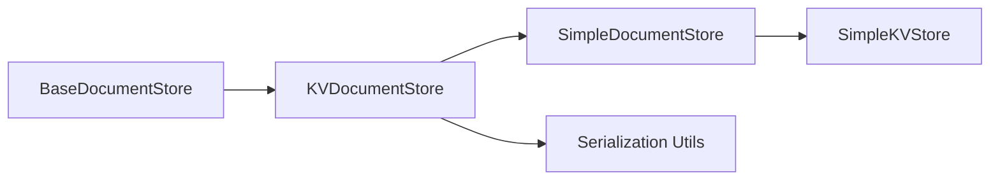

# Document Store API

<cite>
**Referenced Files in This Document**
- [types.py](file://llama-index-core/llama_index/core/storage/docstore/types.py)
- [keyval_docstore.py](file://llama-index-core/llama_index/core/storage/docstore/keyval_docstore.py)
- [simple_docstore.py](file://llama-index-core/llama_index/core/storage/docstore/simple_docstore.py)
- [utils.py](file://llama-index-core/llama_index/core/storage/docstore/utils.py)
- [simple_kvstore.py](file://llama-index-core/llama_index/core/storage/kvstore/simple_kvstore.py)
- [test_simple_docstore.py](file://llama-index-core/tests/storage/docstore/test_simple_docstore.py)
- [docstores.md](file://docs/src/content/docs/framework/module_guides/storing/docstores.md)
</cite>

## Table of Contents
1. [Introduction](#introduction)
2. [Project Structure](#project-structure)
3. [Core Components](#core-components)
4. [Architecture Overview](#architecture-overview)
5. [Detailed Component Analysis](#detailed-component-analysis)
6. [Dependency Analysis](#dependency-analysis)
7. [Performance Considerations](#performance-considerations)
8. [Troubleshooting Guide](#troubleshooting-guide)
9. [Conclusion](#conclusion)
10. [Appendices](#appendices)

## Introduction
This document provides comprehensive API documentation for the Document Store subsystem in the LlamaIndex core. It focuses on the BaseDocumentStore abstract interface and the SimpleDocumentStore implementation, detailing methods for retrieving and managing nodes and documents, persistence and loading via file systems, JSON serialization of node objects, and reference document tracking. It also covers the from_persist_dir() class method, examples for implementing custom document stores, configuration of persistence directories, document ID management, node serialization formats, and performance optimization techniques for large document collections.

## Project Structure
The Document Store API resides in the core storage module and integrates with a key-value store abstraction to provide flexible persistence backends. The primary files include:
- BaseDocumentStore interface definition and shared utilities
- KV-based implementation of the document store
- SimpleDocumentStore concrete implementation backed by SimpleKVStore
- Utilities for node serialization/deserialization
- Tests validating behavior and persistence
- Documentation guides for various integrations

**Diagram sources**
- [types.py](file://llama-index-core/llama_index/core/storage/docstore/types.py#L24-L273)
- [keyval_docstore.py](file://llama-index-core/llama_index/core/storage/docstore/keyval_docstore.py#L24-L670)
- [simple_docstore.py](file://llama-index-core/llama_index/core/storage/docstore/simple_docstore.py#L20-L107)
- [utils.py](file://llama-index-core/llama_index/core/storage/docstore/utils.py#L15-L97)
- [simple_kvstore.py](file://llama-index-core/llama_index/core/storage/kvstore/simple_kvstore.py#L16-L66)

**Section sources**
- [types.py](file://llama-index-core/llama_index/core/storage/docstore/types.py#L1-L273)
- [keyval_docstore.py](file://llama-index-core/llama_index/core/storage/docstore/keyval_docstore.py#L1-L670)
- [simple_docstore.py](file://llama-index-core/llama_index/core/storage/docstore/simple_docstore.py#L1-L107)
- [utils.py](file://llama-index-core/llama_index/core/storage/docstore/utils.py#L1-L97)
- [simple_kvstore.py](file://llama-index-core/llama_index/core/storage/kvstore/simple_kvstore.py#L1-L66)

## Core Components
- BaseDocumentStore: Defines the contract for document/node storage, including CRUD operations, existence checks, hash management, and reference document info handling. It also provides convenience methods for node retrieval and batch operations.
- KVDocumentStore: A key-value-backed implementation of BaseDocumentStore that manages three collections: node data, metadata, and reference document info. It serializes nodes to JSON and supports batching and async operations.
- SimpleDocumentStore: A concrete, in-memory-backed document store built on SimpleKVStore. It supports persistence to disk via JSON files and loading from persisted paths or directories.
- Serialization utilities: Functions to convert BaseNode instances to/from JSON dictionaries, including legacy support for older node formats.

Key APIs covered:
- get_node(), get_nodes(), get_node_dict()
- get_document(), get_documents()
- add_documents(), async_add_documents()
- delete_document(), adelete_document()
- exists() and related methods (document_exists, adocument_exists)
- Hash management: set_document_hash, set_document_hashes, get_document_hash, get_all_document_hashes
- Reference document info: get_ref_doc_info, get_all_ref_doc_info, delete_ref_doc

**Section sources**
- [types.py](file://llama-index-core/llama_index/core/storage/docstore/types.py#L24-L273)
- [keyval_docstore.py](file://llama-index-core/llama_index/core/storage/docstore/keyval_docstore.py#L24-L670)
- [simple_docstore.py](file://llama-index-core/llama_index/core/storage/docstore/simple_docstore.py#L20-L107)
- [utils.py](file://llama-index-core/llama_index/core/storage/docstore/utils.py#L15-L97)

## Architecture Overview
The document store architecture separates concerns between the abstract interface, the key-value-backed implementation, and the concrete store that persists to disk. The KVDocumentStore maintains three collections per namespace:
- Node data: stores serialized node objects keyed by node_id
- Metadata: stores per-node metadata including hashes and optional ref_doc_id
- Reference document info: stores per-ref_doc_id lists of node_ids and metadata

SimpleDocumentStore delegates persistence to SimpleKVStore, which writes a JSON-serialized dictionary of collections to a file path.

**Diagram sources**
- [types.py](file://llama-index-core/llama_index/core/storage/docstore/types.py#L24-L273)
- [keyval_docstore.py](file://llama-index-core/llama_index/core/storage/docstore/keyval_docstore.py#L24-L670)
- [simple_docstore.py](file://llama-index-core/llama_index/core/storage/docstore/simple_docstore.py#L20-L107)
- [simple_kvstore.py](file://llama-index-core/llama_index/core/storage/kvstore/simple_kvstore.py#L16-L66)

## Detailed Component Analysis

### BaseDocumentStore Interface
- Purpose: Defines the complete contract for document/node storage, including:
  - Persistence hooks (persist)
  - Document and node retrieval (get_document, get_node, get_nodes, get_node_dict)
  - Batch operations (add_documents, async_add_documents)
  - Deletion (delete_document, adelete_document) and existence checks (document_exists, adocument_exists)
  - Hash management for integrity checks
  - Reference document info handling (get_ref_doc_info, get_all_ref_doc_info, delete_ref_doc)
- Notable helpers:
  - get_nodes/get_node support batch retrieval and raise-error semantics
  - get_node delegates to get_document and validates type safety

**Section sources**
- [types.py](file://llama-index-core/llama_index/core/storage/docstore/types.py#L24-L273)

### KVDocumentStore Implementation
- Collections:
  - Node data: serialized node objects keyed by node_id
  - Metadata: per-node metadata including doc_hash and optional ref_doc_id
  - Reference document info: per-ref_doc_id mapping of node_ids and metadata
- Serialization:
  - Uses doc_to_json/json_to_doc utilities to serialize/deserialize nodes
  - Legacy support maintained for older node formats
- Operations:
  - add_documents prepares KV pairs for nodes, metadata, and ref_doc info, then writes in batches
  - get_document retrieves serialized JSON and deserializes to BaseNode
  - delete_document removes node and updates ref_doc info accordingly
  - Hash management stores/retrieves doc_hash in metadata collection
  - Reference document info merges multiple node contributions to a single ref_doc entry
- Async support:
  - Parallelized batch writes and deletions using asyncio.gather

**Diagram sources**
- [keyval_docstore.py](file://llama-index-core/llama_index/core/storage/docstore/keyval_docstore.py#L143-L244)
- [utils.py](file://llama-index-core/llama_index/core/storage/docstore/utils.py#L15-L48)

**Section sources**
- [keyval_docstore.py](file://llama-index-core/llama_index/core/storage/docstore/keyval_docstore.py#L24-L670)
- [utils.py](file://llama-index-core/llama_index/core/storage/docstore/utils.py#L15-L97)

### SimpleDocumentStore Implementation
- In-memory backing:
  - Defaults to SimpleKVStore for in-memory storage
  - Supports explicit SimpleKVStore injection via constructor
- Persistence:
  - persist writes the internal collections mapping to a JSON file at the given path
  - from_persist_dir constructs a persist path from a directory and loads via from_persist_path
  - from_persist_path creates a SimpleKVStore from a JSON file and wraps it in SimpleDocumentStore
  - from_dict/to_dict enable dict-based serialization for testing and custom integrations
- Namespace support:
  - Optional namespace parameter to isolate collections

**Diagram sources**
- [simple_docstore.py](file://llama-index-core/llama_index/core/storage/docstore/simple_docstore.py#L42-L102)
- [simple_kvstore.py](file://llama-index-core/llama_index/core/storage/kvstore/simple_kvstore.py#L35-L56)

**Section sources**
- [simple_docstore.py](file://llama-index-core/llama_index/core/storage/docstore/simple_docstore.py#L20-L107)
- [simple_kvstore.py](file://llama-index-core/llama_index/core/storage/kvstore/simple_kvstore.py#L16-L66)

### Node Serialization and Formats
- Serialization:
  - doc_to_json wraps node.to_dict() with a type discriminator
  - json_to_doc selects the appropriate node subclass based on type and class_name
  - Legacy support handles older node formats with extra_info and relationships mapping
- Deserialization:
  - Validates type and reconstructs node subclasses (Document, TextNode, ImageNode, IndexNode, Node)
  - Raises errors for unknown types

**Diagram sources**
- [utils.py](file://llama-index-core/llama_index/core/storage/docstore/utils.py#L15-L97)

**Section sources**
- [utils.py](file://llama-index-core/llama_index/core/storage/docstore/utils.py#L15-L97)

### Persistence and Loading Patterns
- Persist path computation:
  - from_persist_dir composes DEFAULT_PERSIST_FNAME with the provided directory
  - from_persist_path accepts an explicit path
- Filesystem support:
  - fsspec AbstractFileSystem can be supplied for remote/local filesystems
- Loading:
  - SimpleKVStore.from_persist_path reads JSON and reconstructs the collections mapping
- Testing and examples:
  - Tests demonstrate roundtrip persistence and loading from path/dict

**Section sources**
- [simple_docstore.py](file://llama-index-core/llama_index/core/storage/docstore/simple_docstore.py#L42-L102)
- [simple_kvstore.py](file://llama-index-core/llama_index/core/storage/kvstore/simple_kvstore.py#L35-L56)
- [test_simple_docstore.py](file://llama-index-core/tests/storage/docstore/test_simple_docstore.py#L30-L63)

### Reference Document Management
- Reference document info:
  - Tracks node_ids and metadata for each ref_doc_id
  - Merges multiple node contributions to a single ref_doc entry
- Deletion semantics:
  - delete_document updates ref_doc info and removes empty ref_docs
  - delete_ref_doc deletes all associated nodes and cleans up ref_doc entries

**Section sources**
- [keyval_docstore.py](file://llama-index-core/llama_index/core/storage/docstore/keyval_docstore.py#L127-L205)
- [keyval_docstore.py](file://llama-index-core/llama_index/core/storage/docstore/keyval_docstore.py#L450-L597)

### Implementing Custom Document Stores
- Contract adherence:
  - Implement all abstract methods defined in BaseDocumentStore
  - Support async variants where applicable
- Collections and namespaces:
  - Choose appropriate collections for nodes, metadata, and ref_doc info
  - Respect namespace scoping for isolation
- Serialization:
  - Use doc_to_json/json_to_doc or equivalent for node interchange
- Persistence:
  - Implement persist and loading from path/directory using your chosen storage backend
- Example pattern:
  - Follow SimpleDocumentStore’s approach of delegating persistence to a KV store abstraction

**Section sources**
- [types.py](file://llama-index-core/llama_index/core/storage/docstore/types.py#L24-L273)
- [simple_docstore.py](file://llama-index-core/llama_index/core/storage/docstore/simple_docstore.py#L20-L107)
- [utils.py](file://llama-index-core/llama_index/core/storage/docstore/utils.py#L15-L97)

## Dependency Analysis
- BaseDocumentStore defines the interface; KVDocumentStore implements it using BaseKVStore abstractions
- SimpleDocumentStore extends KVDocumentStore and uses SimpleKVStore for persistence
- Serialization utilities are consumed by KVDocumentStore to handle node JSON interchange
- Tests validate behavior across CRUD, persistence, and reference document operations

**Diagram sources**
- [types.py](file://llama-index-core/llama_index/core/storage/docstore/types.py#L24-L273)
- [keyval_docstore.py](file://llama-index-core/llama_index/core/storage/docstore/keyval_docstore.py#L24-L670)
- [simple_docstore.py](file://llama-index-core/llama_index/core/storage/docstore/simple_docstore.py#L20-L107)
- [simple_kvstore.py](file://llama-index-core/llama_index/core/storage/kvstore/simple_kvstore.py#L16-L66)
- [utils.py](file://llama-index-core/llama_index/core/storage/docstore/utils.py#L15-L97)

**Section sources**
- [types.py](file://llama-index-core/llama_index/core/storage/docstore/types.py#L24-L273)
- [keyval_docstore.py](file://llama-index-core/llama_index/core/storage/docstore/keyval_docstore.py#L24-L670)
- [simple_docstore.py](file://llama-index-core/llama_index/core/storage/docstore/simple_docstore.py#L20-L107)
- [simple_kvstore.py](file://llama-index-core/llama_index/core/storage/kvstore/simple_kvstore.py#L16-L66)
- [utils.py](file://llama-index-core/llama_index/core/storage/docstore/utils.py#L15-L97)

## Performance Considerations
- Batch operations:
  - Use batch_size in add_documents and async_add_documents to reduce I/O overhead
- Asynchronous writes:
  - Prefer async_add_documents for concurrent writes across multiple collections
- Store text selectively:
  - Disable store_text when only metadata and hashes are needed to reduce payload size
- Collections separation:
  - Keeping nodes, metadata, and ref_doc info in separate collections enables targeted queries and reduces contention
- Persistence:
  - Persist periodically or after bulk ingestion to minimize repeated serialization costs
- Large collections:
  - Consider partitioning by namespace or ref_doc_id to scale horizontally
- Hashing:
  - Maintain document hashes to detect duplicates and optimize cache hits

[No sources needed since this section provides general guidance]

## Troubleshooting Guide
- Node not found:
  - get_document and get_node raise errors when raise_error is True; ensure node_id exists or set raise_error=False
- Type mismatch:
  - get_node validates that retrieved documents are BaseNode instances; unexpected types indicate corruption or wrong collection
- Duplicate node IDs:
  - add_documents raises if allow_update is False and node_id already exists; set allow_update=True to overwrite
- Reference document cleanup:
  - After deleting nodes, ensure ref_doc info is updated; empty ref_docs are removed automatically
- Persistence failures:
  - Verify persist_path and filesystem permissions; ensure directory exists before writing
- Legacy node formats:
  - If encountering extra_info fields, ensure json_to_doc handles legacy conversion paths

**Section sources**
- [keyval_docstore.py](file://llama-index-core/llama_index/core/storage/docstore/keyval_docstore.py#L352-L386)
- [keyval_docstore.py](file://llama-index-core/llama_index/core/storage/docstore/keyval_docstore.py#L174-L179)
- [keyval_docstore.py](file://llama-index-core/llama_index/core/storage/docstore/keyval_docstore.py#L484-L507)
- [simple_kvstore.py](file://llama-index-core/llama_index/core/storage/kvstore/simple_kvstore.py#L35-L56)
- [utils.py](file://llama-index-core/llama_index/core/storage/docstore/utils.py#L51-L97)

## Conclusion
The Document Store API provides a robust, extensible foundation for storing and retrieving nodes and documents. The BaseDocumentStore interface ensures consistent behavior across implementations, while KVDocumentStore and SimpleDocumentStore offer practical, efficient storage with JSON serialization and file-based persistence. By leveraging batch operations, async capabilities, and careful reference document management, developers can build scalable document retrieval systems suited to large-scale ingestion and querying.

[No sources needed since this section summarizes without analyzing specific files]

## Appendices

### API Reference Summary
- BaseDocumentStore
  - Methods: persist, add_documents, async_add_documents, get_document, aget_document, delete_document, adelete_document, document_exists, adocument_exists, set_document_hash, aset_document_hash, set_document_hashes, aset_document_hashes, get_document_hash, aget_document_hash, get_all_document_hashes, aget_all_document_hashes, get_all_ref_doc_info, aget_all_ref_doc_info, get_ref_doc_info, aget_ref_doc_info, delete_ref_doc, adelete_ref_doc, get_nodes, aget_nodes, get_node, aget_node, get_node_dict, aget_node_dict
- KVDocumentStore
  - Fields: _kvstore, _namespace, _node_collection, _metadata_collection, _ref_doc_collection, _batch_size
  - Methods: docs, add_documents, async_add_documents, get_document, aget_document, delete_document, adelete_document, document_exists, adocument_exists, get_ref_doc_info, aget_ref_doc_info, get_all_ref_doc_info, aget_all_ref_doc_info, delete_ref_doc, adelete_ref_doc, set_document_hash, aset_document_hash, set_document_hashes, aset_document_hashes, get_document_hash, aget_document_hash, get_all_document_hashes, aget_all_document_hashes
- SimpleDocumentStore
  - Methods: from_persist_dir, from_persist_path, persist, from_dict, to_dict
- Serialization
  - Functions: doc_to_json, json_to_doc, legacy_json_to_doc

**Section sources**
- [types.py](file://llama-index-core/llama_index/core/storage/docstore/types.py#L24-L273)
- [keyval_docstore.py](file://llama-index-core/llama_index/core/storage/docstore/keyval_docstore.py#L24-L670)
- [simple_docstore.py](file://llama-index-core/llama_index/core/storage/docstore/simple_docstore.py#L20-L107)
- [utils.py](file://llama-index-core/llama_index/core/storage/docstore/utils.py#L15-L97)

### Examples and Guides
- In-memory store with persistence and loading from path/dict
- Reference document deletion and cascading effects
- Integration examples for MongoDB, Redis, Firestore, Couchbase, Tablestore, AlloyDB, and Cloud SQL for PostgreSQL

**Section sources**
- [test_simple_docstore.py](file://llama-index-core/tests/storage/docstore/test_simple_docstore.py#L16-L155)
- [docstores.md](file://docs/src/content/docs/framework/module_guides/storing/docstores.md#L1-L321)