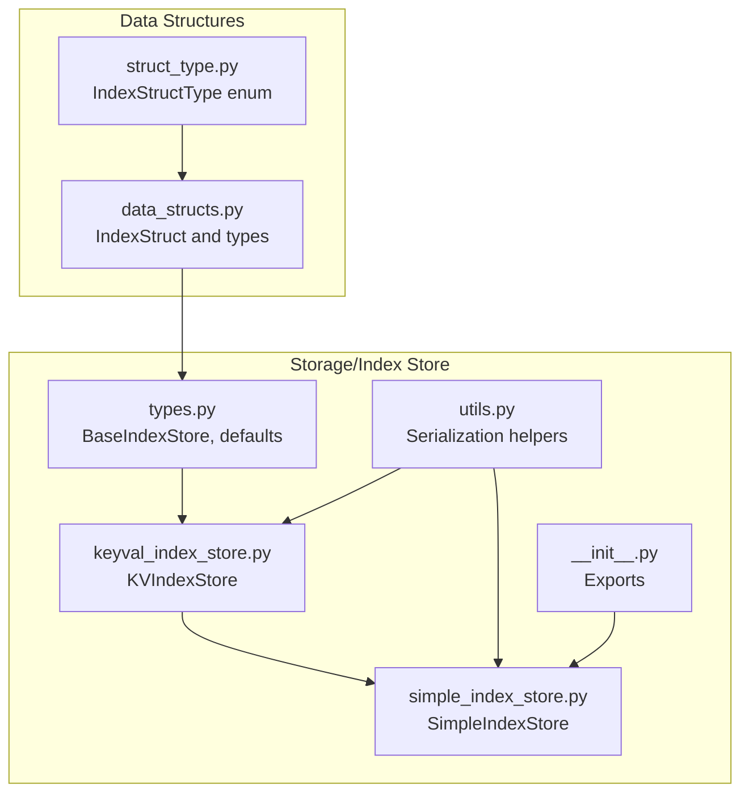
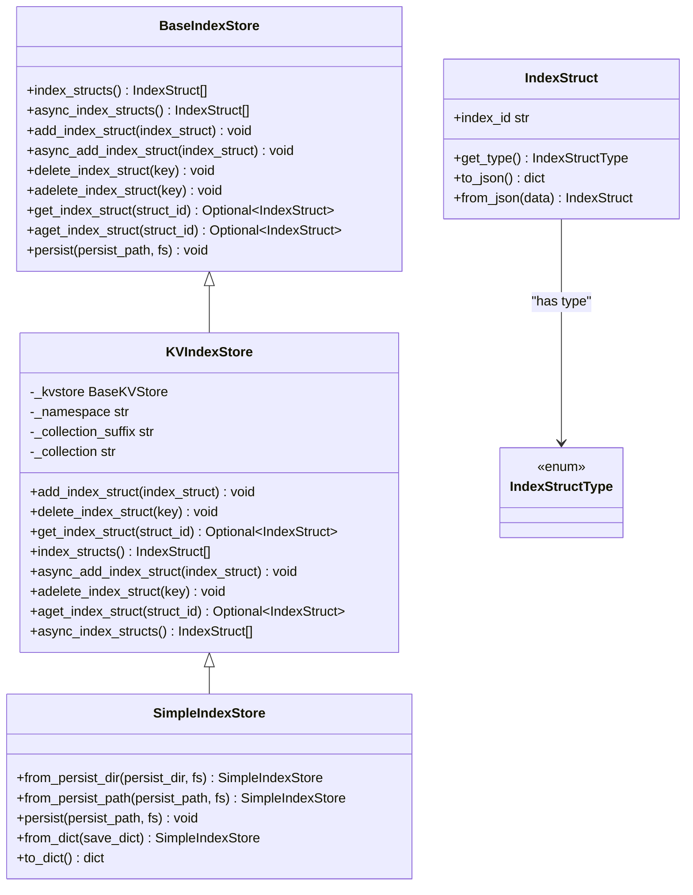
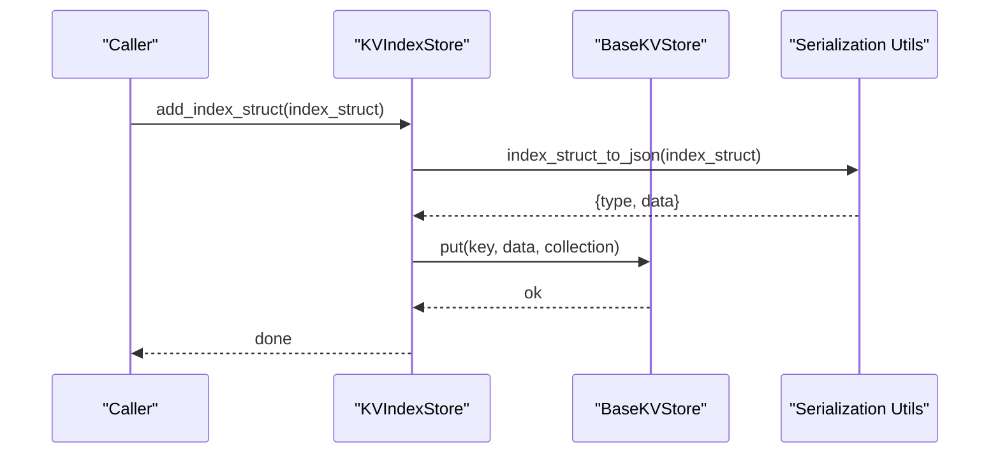
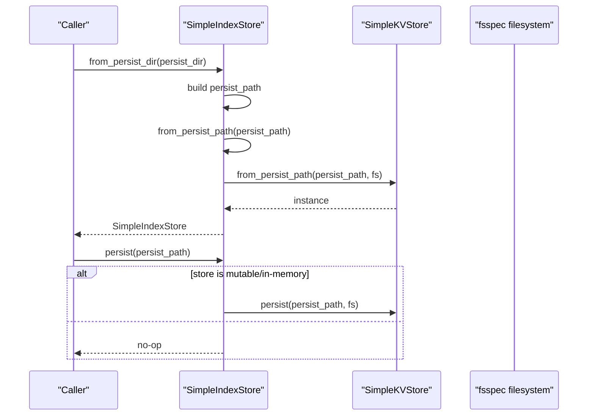
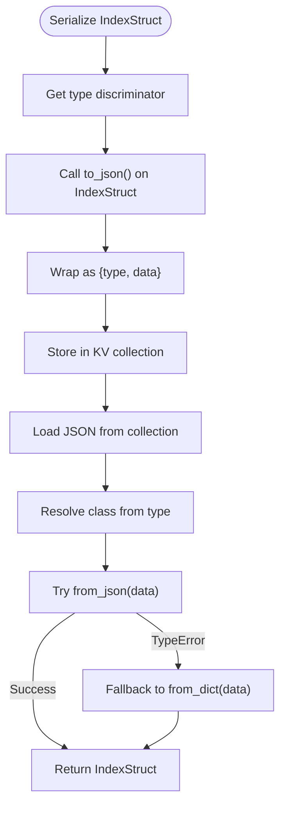
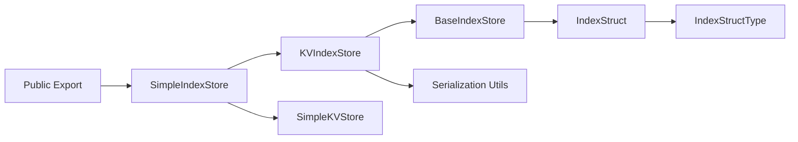

# Index Store API

<cite>
**Referenced Files in This Document**
- [types.py](file://llama-index-core/llama_index/core/storage/index_store/types.py)
- [keyval_index_store.py](file://llama-index-core/llama_index/core/storage/index_store/keyval_index_store.py)
- [simple_index_store.py](file://llama-index-core/llama_index/core/storage/index_store/simple_index_store.py)
- [utils.py](file://llama-index-core/llama_index/core/storage/index_store/utils.py)
- [__init__.py](file://llama-index-core/llama_index/core/storage/index_store/__init__.py)
- [data_structs.py](file://llama-index-core/llama_index/core/data_structs/data_structs.py)
- [struct_type.py](file://llama-index-core/llama_index/core/data_structs/struct_type.py)
- [test_simple_index_store.py](file://llama-index-core/tests/storage/index_store/test_simple_index_store.py)
</cite>

## Table of Contents
1. [Introduction](#introduction)
2. [Project Structure](#project-structure)
3. [Core Components](#core-components)
4. [Architecture Overview](#architecture-overview)
5. [Detailed Component Analysis](#detailed-component-analysis)
6. [Dependency Analysis](#dependency-analysis)
7. [Performance Considerations](#performance-considerations)
8. [Troubleshooting Guide](#troubleshooting-guide)
9. [Conclusion](#conclusion)
10. [Appendices](#appendices)

## Introduction
This document provides comprehensive API documentation for the Index Store subsystem. It focuses on the BaseIndexStore abstract interface and the SimpleIndexStore implementation, detailing how index structures are stored, retrieved, and persisted. It also covers index struct types, metadata storage formats, and practical guidance for building custom index stores and managing persistence.

## Project Structure
The Index Store module resides under the storage layer and integrates with the broader data structures and key-value store abstractions. The primary files are:
- BaseIndexStore interface definition
- KVIndexStore key-value wrapper
- SimpleIndexStore in-memory JSON-backed implementation
- Serialization utilities for index structs
- Public exports

**Diagram sources**
- [types.py](file://llama-index-core/llama_index/core/storage/index_store/types.py#L13-L56)
- [keyval_index_store.py](file://llama-index-core/llama_index/core/storage/index_store/keyval_index_store.py#L15-L143)
- [simple_index_store.py](file://llama-index-core/llama_index/core/storage/index_store/simple_index_store.py#L19-L77)
- [utils.py](file://llama-index-core/llama_index/core/storage/index_store/utils.py#L8-L23)
- [__init__.py](file://llama-index-core/llama_index/core/storage/index_store/__init__.py#L1-L8)
- [data_structs.py](file://llama-index-core/llama_index/core/data_structs/data_structs.py#L21-L280)
- [struct_type.py](file://llama-index-core/llama_index/core/data_structs/struct_type.py#L6-L117)

**Section sources**
- [types.py](file://llama-index-core/llama_index/core/storage/index_store/types.py#L8-L10)
- [__init__.py](file://llama-index-core/llama_index/core/storage/index_store/__init__.py#L1-L8)

## Core Components
- BaseIndexStore: Defines the contract for index store operations, including adding, retrieving, deleting, listing, and persisting index structures. It also provides a default persistent path constant and a persist method signature.
- KVIndexStore: A key-value backed implementation of BaseIndexStore that serializes/deserializes index structures to/from JSON and stores them in a collection within a BaseKVStore.
- SimpleIndexStore: An in-memory implementation backed by a SimpleKVStore, with convenience constructors for loading from a persisted path or directory and for saving to disk. It supports JSON-based persistence and dictionary-based serialization.

Key capabilities:
- Add, get, delete, and list index structures
- Async variants for non-blocking operations
- Persist to a configurable path or filesystem abstraction
- Load from persisted JSON via from_persist_dir and from_persist_path
- Serialize index structs to JSON with type and data fields

**Section sources**
- [types.py](file://llama-index-core/llama_index/core/storage/index_store/types.py#L13-L56)
- [keyval_index_store.py](file://llama-index-core/llama_index/core/storage/index_store/keyval_index_store.py#L15-L143)
- [simple_index_store.py](file://llama-index-core/llama_index/core/storage/index_store/simple_index_store.py#L19-L77)
- [utils.py](file://llama-index-core/llama_index/core/storage/index_store/utils.py#L8-L23)

## Architecture Overview
The Index Store architecture layers the BaseIndexStore interface over a key-value store abstraction. Index structures are serialized to JSON with a type discriminator and stored under a namespaced collection. SimpleIndexStore extends this pattern with in-memory persistence and convenience loaders.

**Diagram sources**
- [types.py](file://llama-index-core/llama_index/core/storage/index_store/types.py#L13-L56)
- [keyval_index_store.py](file://llama-index-core/llama_index/core/storage/index_store/keyval_index_store.py#L15-L143)
- [simple_index_store.py](file://llama-index-core/llama_index/core/storage/index_store/simple_index_store.py#L19-L77)
- [data_structs.py](file://llama-index-core/llama_index/core/data_structs/data_structs.py#L21-L38)
- [struct_type.py](file://llama-index-core/llama_index/core/data_structs/struct_type.py#L6-L117)

## Detailed Component Analysis

### BaseIndexStore Interface
Defines the core contract for index store operations:
- Listing and async listing of all index structures
- Adding and async adding a single index structure
- Deleting and async deleting by key
- Retrieving a single index structure by ID or defaulting to a single-item selection
- Persisting to a path with optional filesystem abstraction

Persistence defaults:
- Default directory: "./storage"
- Default filename: "index_store.json"
- Default combined path: "./storage/index_store.json"

Operational notes:
- Implementations may choose to persist only in-memory stores
- Async methods enable non-blocking IO when backed by async KV stores

**Section sources**
- [types.py](file://llama-index-core/llama_index/core/storage/index_store/types.py#L13-L56)
- [types.py](file://llama-index-core/llama_index/core/storage/index_store/types.py#L8-L10)

### KVIndexStore Implementation
A generic key-value backed implementation:
- Uses a BaseKVStore with a namespaced collection
- Serializes index structures to JSON using a type discriminator and data payload
- Deserializes JSON back to the appropriate IndexStruct subclass
- Provides both sync and async operations for all CRUD and listing functions

Key behaviors:
- Keys are derived from index_struct.index_id
- Collection naming convention: namespace + "/data"
- Deserialization attempts JSON constructor first, falls back to dict constructor if needed

**Diagram sources**
- [keyval_index_store.py](file://llama-index-core/llama_index/core/storage/index_store/keyval_index_store.py#L38-L48)
- [utils.py](file://llama-index-core/llama_index/core/storage/index_store/utils.py#L8-L12)

**Section sources**
- [keyval_index_store.py](file://llama-index-core/llama_index/core/storage/index_store/keyval_index_store.py#L15-L143)
- [utils.py](file://llama-index-core/llama_index/core/storage/index_store/utils.py#L8-L23)

### SimpleIndexStore Implementation
An in-memory implementation backed by SimpleKVStore:
- Initialization accepts an optional SimpleKVStore instance
- from_persist_dir: constructs a path from a directory and default filename, delegates to from_persist_path
- from_persist_path: creates a SimpleKVStore from a JSON file path and wraps it in SimpleIndexStore
- persist: persists only if the underlying store supports it (mutable mapping or in-memory)
- from_dict/to_dict: round-trip serialization via SimpleKVStore

**Diagram sources**
- [simple_index_store.py](file://llama-index-core/llama_index/core/storage/index_store/simple_index_store.py#L36-L68)

**Section sources**
- [simple_index_store.py](file://llama-index-core/llama_index/core/storage/index_store/simple_index_store.py#L19-L77)

### Index Struct Types and Metadata Storage
Index structures are typed and serialized with a two-field JSON envelope:
- type: discriminator indicating the concrete IndexStruct subclass
- data: the serialized representation returned by IndexStruct.to_json()

Supported index struct types include tree, list, keyword table, vector store variants, knowledge graph, and others. The type-to-class registry resolves the correct deserialization target.

**Diagram sources**
- [utils.py](file://llama-index-core/llama_index/core/storage/index_store/utils.py#L8-L23)
- [data_structs.py](file://llama-index-core/llama_index/core/data_structs/data_structs.py#L21-L38)
- [struct_type.py](file://llama-index-core/llama_index/core/data_structs/struct_type.py#L6-L117)

**Section sources**
- [utils.py](file://llama-index-core/llama_index/core/storage/index_store/utils.py#L8-L23)
- [data_structs.py](file://llama-index-core/llama_index/core/data_structs/data_structs.py#L21-L280)
- [struct_type.py](file://llama-index-core/llama_index/core/data_structs/struct_type.py#L6-L117)

### Example Workflows

- Loading a persisted index store from a directory:
  - Use SimpleIndexStore.from_persist_dir to construct a store from the default JSON file located under the given directory.
  - Internally builds the path and delegates to from_persist_path.

- Saving an in-memory index store:
  - Call persist with a path; only effective if the underlying store supports persistence (e.g., mutable mapping or in-memory).

- Round-tripping via dictionaries:
  - Convert to a dict with to_dict and reconstruct with from_dict for in-memory scenarios.

- Testing persistence behavior:
  - The test demonstrates adding an index struct, converting to a dict, reloading, and verifying equality.

**Section sources**
- [simple_index_store.py](file://llama-index-core/llama_index/core/storage/index_store/simple_index_store.py#L36-L68)
- [simple_index_store.py](file://llama-index-core/llama_index/core/storage/index_store/simple_index_store.py#L70-L77)
- [test_simple_index_store.py](file://llama-index-core/tests/storage/index_store/test_simple_index_store.py#L7-L20)

## Dependency Analysis
- BaseIndexStore depends on IndexStruct and IndexStructType for type identification and serialization.
- KVIndexStore depends on BaseKVStore for persistence and on serialization utilities for JSON conversion.
- SimpleIndexStore depends on SimpleKVStore and exposes convenience constructors for file-based persistence.
- Public exports expose SimpleIndexStore as the primary user-facing implementation.

**Diagram sources**
- [types.py](file://llama-index-core/llama_index/core/storage/index_store/types.py#L13-L56)
- [keyval_index_store.py](file://llama-index-core/llama_index/core/storage/index_store/keyval_index_store.py#L15-L143)
- [simple_index_store.py](file://llama-index-core/llama_index/core/storage/index_store/simple_index_store.py#L19-L77)
- [utils.py](file://llama-index-core/llama_index/core/storage/index_store/utils.py#L8-L23)
- [__init__.py](file://llama-index-core/llama_index/core/storage/index_store/__init__.py#L1-L8)

**Section sources**
- [__init__.py](file://llama-index-core/llama_index/core/storage/index_store/__init__.py#L1-L8)

## Performance Considerations
- Persistence cost: Persisting in-memory stores is only supported when the underlying KV store supports it. For SimpleIndexStore, persist is a no-op unless the store is mutable or in-memory.
- Serialization overhead: Each index struct is serialized to JSON with a type discriminator. Keep index structures compact and avoid unnecessary metadata to reduce IO.
- Batch operations: Prefer bulk operations at the KV store level when available to minimize repeated IO calls.
- Async operations: Use async methods when integrating with async KV stores to avoid blocking the event loop.
- Filesystem choice: When using fsspec, choose a filesystem optimized for your deployment environment (local, cloud object storage, etc.).

[No sources needed since this section provides general guidance]

## Troubleshooting Guide
- No-op persist: If persist does nothing, confirm that the underlying store supports persistence (e.g., mutable mapping or in-memory).
- Deserialization errors: If JSON deserialization fails, ensure the index struct’s data is compatible with from_json; the serializer falls back to from_dict when needed.
- Single vs. keyed retrieval: get_index_struct without an ID returns the single item when exactly one exists; otherwise, supply a struct_id to retrieve a specific index struct.

**Section sources**
- [simple_index_store.py](file://llama-index-core/llama_index/core/storage/index_store/simple_index_store.py#L60-L68)
- [utils.py](file://llama-index-core/llama_index/core/storage/index_store/utils.py#L19-L23)
- [keyval_index_store.py](file://llama-index-core/llama_index/core/storage/index_store/keyval_index_store.py#L60-L78)

## Conclusion
The Index Store API provides a clean separation between the index store contract and its persistence mechanism. KVIndexStore offers a reusable key-value foundation, while SimpleIndexStore delivers a practical in-memory implementation with straightforward persistence and loading utilities. Index structures are safely serialized with type-aware JSON envelopes, enabling robust storage and retrieval across deployments.

[No sources needed since this section summarizes without analyzing specific files]

## Appendices

### API Reference Summary

- BaseIndexStore
  - Methods: index_structs, async_index_structs, add_index_struct, async_add_index_struct, delete_index_struct, adelete_index_struct, get_index_struct, aget_index_struct, persist
  - Defaults: DEFAULT_PERSIST_DIR, DEFAULT_PERSIST_FNAME, DEFAULT_PERSIST_PATH

- KVIndexStore
  - Constructor: kvstore, namespace, collection_suffix
  - Methods: add_index_struct, delete_index_struct, get_index_struct, index_structs, async_add_index_struct, adelete_index_struct, aget_index_struct, async_index_structs

- SimpleIndexStore
  - Constructors: from_persist_dir, from_persist_path, from_dict
  - Methods: persist, to_dict

- Serialization Utilities
  - index_struct_to_json, json_to_index_struct

- Index Struct Types
  - Enumerated in IndexStructType; examples include TREE, LIST, KEYWORD_TABLE, VECTOR_STORE, MULTIMODAL_VECTOR_STORE, KG, EMPTY, etc.

**Section sources**
- [types.py](file://llama-index-core/llama_index/core/storage/index_store/types.py#L8-L56)
- [keyval_index_store.py](file://llama-index-core/llama_index/core/storage/index_store/keyval_index_store.py#L15-L143)
- [simple_index_store.py](file://llama-index-core/llama_index/core/storage/index_store/simple_index_store.py#L19-L77)
- [utils.py](file://llama-index-core/llama_index/core/storage/index_store/utils.py#L8-L23)
- [struct_type.py](file://llama-index-core/llama_index/core/data_structs/struct_type.py#L6-L117)
- [data_structs.py](file://llama-index-core/llama_index/core/data_structs/data_structs.py#L21-L280)