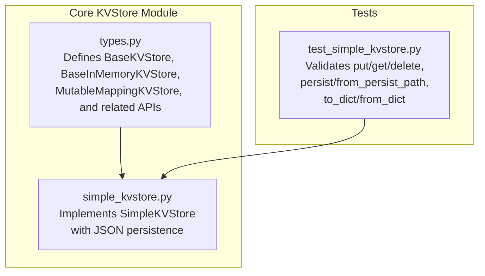
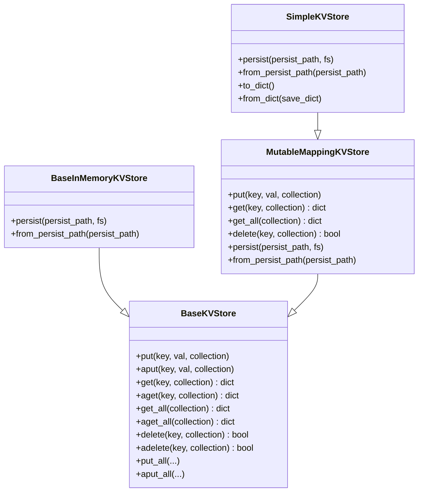
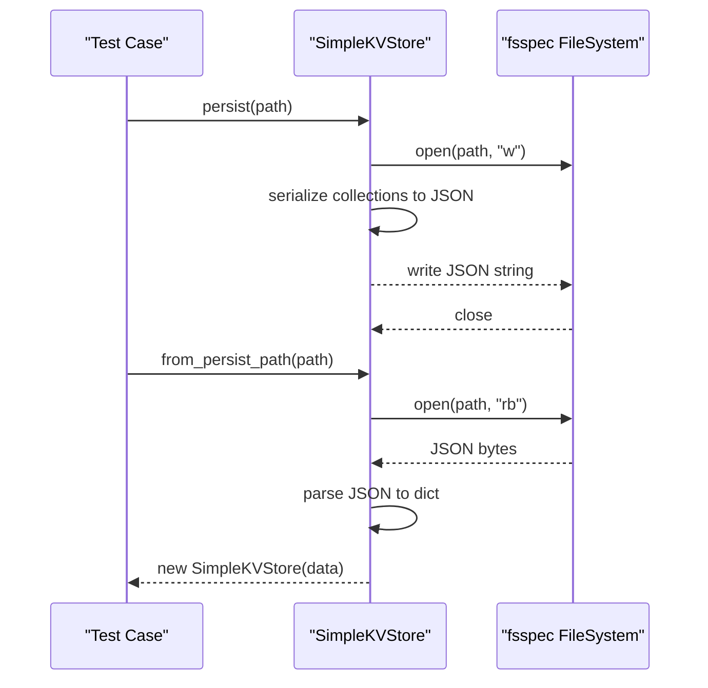
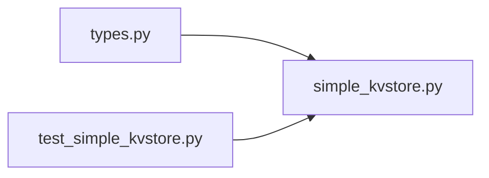

# Key-Value Store API

<cite>
**Referenced Files in This Document**
- [types.py](file://llama-index-core/llama_index/core/storage/kvstore/types.py)
- [simple_kvstore.py](file://llama-index-core/llama_index/core/storage/kvstore/simple_kvstore.py)
- [test_simple_kvstore.py](file://llama-index-core/tests/storage/kvstore/test_simple_kvstore.py)
</cite>

## Table of Contents
1. [Introduction](#introduction)
2. [Project Structure](#project-structure)
3. [Core Components](#core-components)
4. [Architecture Overview](#architecture-overview)
5. [Detailed Component Analysis](#detailed-component-analysis)
6. [Dependency Analysis](#dependency-analysis)
7. [Performance Considerations](#performance-considerations)
8. [Troubleshooting Guide](#troubleshooting-guide)
9. [Conclusion](#conclusion)
10. [Appendices](#appendices)

## Introduction
This document provides detailed API documentation for the Key-Value Store interfaces and implementations in the repository. It focuses on:
- The BaseKVStore abstract interface and its asynchronous counterpart
- The SimpleKVStore implementation, including JSON-based persistence and directory-based storage
- The from_persist_path() class method for loading persisted stores
- Guidance for implementing custom key-value stores, managing arbitrary metadata, and handling serialization
- Key naming conventions, value serialization formats, and performance optimization tips for high-frequency operations

## Project Structure
The key-value store functionality resides under the core storage module and includes:
- An abstract interface definition for key-value stores
- A simple in-memory implementation backed by Python dicts with JSON persistence
- Tests validating basic operations, persistence, and dictionary-based load/save

**Diagram sources**
- [types.py](file://llama-index-core/llama_index/core/storage/kvstore/types.py#L11-L184)
- [simple_kvstore.py](file://llama-index-core/llama_index/core/storage/kvstore/simple_kvstore.py#L1-L66)
- [test_simple_kvstore.py](file://llama-index-core/tests/storage/kvstore/test_simple_kvstore.py#L1-L39)

**Section sources**
- [types.py](file://llama-index-core/llama_index/core/storage/kvstore/types.py#L1-L184)
- [simple_kvstore.py](file://llama-index-core/llama_index/core/storage/kvstore/simple_kvstore.py#L1-L66)
- [test_simple_kvstore.py](file://llama-index-core/tests/storage/kvstore/test_simple_kvstore.py#L1-L39)

## Core Components
This section documents the primary abstractions and their responsibilities.

- BaseKVStore
  - Purpose: Defines the contract for key-value operations including put, get, get_all, delete, and their async counterparts.
  - Notable methods:
    - put(key, val, collection): Synchronous write
    - aput(key, val, collection): Asynchronous write
    - get(key, collection): Synchronous read
    - aget(key, collection): Asynchronous read
    - get_all(collection): Retrieve all entries in a collection
    - aget_all(collection): Async variant of get_all
    - delete(key, collection): Synchronous delete
    - adelete(key, collection): Asynchronous delete
  - Batch operations:
    - put_all and aput_all: Default implementation iterates with batch_size=1; subclasses may override to support larger batches.

- BaseInMemoryKVStore
  - Extends BaseKVStore with persistence and restoration:
    - persist(persist_path, fs): Serialize and write to a filesystem
    - from_persist_path(persist_path): Class method to reconstruct store from persisted data

- MutableMappingKVStore
  - A generic wrapper around a MutableMapping factory to manage collections of key-value pairs.
  - Provides default implementations for put/get/get_all/delete and exposes persist/from_persist_path as not implemented (intended for subclasses).

- SimpleKVStore
  - Concrete implementation backed by an in-memory dict per collection.
  - Implements persist() and from_persist_path() using JSON serialization and fsspec filesystem abstraction.
  - Provides to_dict() and from_dict() helpers for dictionary-based serialization.

Key-value store collections
- Collections are identified by string identifiers. The default collection is "data".
- Values are dictionaries stored per key within a collection.

**Section sources**
- [types.py](file://llama-index-core/llama_index/core/storage/kvstore/types.py#L11-L184)
- [simple_kvstore.py](file://llama-index-core/llama_index/core/storage/kvstore/simple_kvstore.py#L16-L66)

## Architecture Overview
The key-value store architecture separates concerns between interface, in-memory mapping, and persistence. SimpleKVStore composes MutableMappingKVStore and adds filesystem-backed persistence.

**Diagram sources**
- [types.py](file://llama-index-core/llama_index/core/storage/kvstore/types.py#L11-L184)
- [simple_kvstore.py](file://llama-index-core/llama_index/core/storage/kvstore/simple_kvstore.py#L16-L66)

## Detailed Component Analysis

### BaseKVStore Interface
- Responsibilities:
  - Define synchronous and asynchronous operations for storing, retrieving, listing, and deleting key-value pairs within named collections.
  - Provide default batch operation implementations that delegate to single-item operations.
- Design notes:
  - Values are dictionaries; keys are strings.
  - Collections enable logical grouping of related key-value pairs.
  - Async methods mirror sync operations for non-blocking environments.

**Section sources**
- [types.py](file://llama-index-core/llama_index/core/storage/kvstore/types.py#L11-L75)

### BaseInMemoryKVStore
- Adds persistence contracts:
  - persist(): Serializes current state to a given path via a filesystem abstraction.
  - from_persist_path(): Factory method to restore a store from persisted data.

**Section sources**
- [types.py](file://llama-index-core/llama_index/core/storage/kvstore/types.py#L77-L90)

### MutableMappingKVStore
- Manages per-collection mappings using a factory to create underlying MutableMapping instances.
- Implements CRUD operations using copy semantics for safety and immutability of stored values.
- Exposes persist/from_persist_path as not implemented to force subclasses to provide concrete persistence logic.

**Section sources**
- [types.py](file://llama-index-core/llama_index/core/storage/kvstore/types.py#L95-L184)

### SimpleKVStore
- Implementation highlights:
  - Uses Python dict as the underlying mapping per collection.
  - Persists to JSON and loads from JSON using fsspec filesystem abstraction.
  - Supports directory-based persistence by ensuring parent directories exist before writing.
  - Provides to_dict()/from_dict() for in-memory serialization without filesystem I/O.
- Persistence behavior:
  - persist(): Ensures directory exists, opens file for writing, and writes JSON.
  - from_persist_path(): Opens file in binary mode, loads JSON, and constructs a new instance.

**Diagram sources**
- [simple_kvstore.py](file://llama-index-core/llama_index/core/storage/kvstore/simple_kvstore.py#L35-L56)

**Section sources**
- [simple_kvstore.py](file://llama-index-core/llama_index/core/storage/kvstore/simple_kvstore.py#L16-L66)
- [test_simple_kvstore.py](file://llama-index-core/tests/storage/kvstore/test_simple_kvstore.py#L26-L32)

## Dependency Analysis
- Internal dependencies:
  - SimpleKVStore depends on MutableMappingKVStore for core operations and adds filesystem persistence.
  - BaseInMemoryKVStore defines the persistence contract extended by SimpleKVStore.
- External dependencies:
  - fsspec for filesystem abstraction
  - json for serialization
  - logging for debug messages during load

**Diagram sources**
- [types.py](file://llama-index-core/llama_index/core/storage/kvstore/types.py#L1-L184)
- [simple_kvstore.py](file://llama-index-core/llama_index/core/storage/kvstore/simple_kvstore.py#L1-L66)
- [test_simple_kvstore.py](file://llama-index-core/tests/storage/kvstore/test_simple_kvstore.py#L1-L39)

**Section sources**
- [types.py](file://llama-index-core/llama_index/core/storage/kvstore/types.py#L1-L184)
- [simple_kvstore.py](file://llama-index-core/llama_index/core/storage/kvstore/simple_kvstore.py#L1-L66)
- [test_simple_kvstore.py](file://llama-index-core/tests/storage/kvstore/test_simple_kvstore.py#L1-L39)

## Performance Considerations
- In-memory operations:
  - SimpleKVStore uses Python dict per collection; typical O(1) average-time operations for put/get/delete.
- Serialization overhead:
  - JSON serialization occurs on persist/load; consider batching writes and minimizing frequent persistence calls.
- Concurrency:
  - The default MutableMappingKVStore is not thread-safe; guard concurrent access if used in multi-threaded contexts.
- Batch operations:
  - The default put_all/aput_all implementation iterates with batch_size=1. For high-throughput scenarios, implement a subclass that supports larger batch sizes to reduce overhead.
- Collections:
  - Use collections to partition large datasets and reduce contention on hot keys.

[No sources needed since this section provides general guidance]

## Troubleshooting Guide
Common issues and resolutions:
- Persist path directory missing:
  - Ensure the directory exists before persist(); the implementation creates directories if missing.
- Loading from non-existent path:
  - from_persist_path() requires an existing file; handle FileNotFoundError appropriately in calling code.
- Value deserialization errors:
  - JSON parsing expects valid JSON; verify the persisted file format and encoding.
- Thread-safety:
  - Access to SimpleKVStore is not synchronized; protect with locks if accessed concurrently.

**Section sources**
- [simple_kvstore.py](file://llama-index-core/llama_index/core/storage/kvstore/simple_kvstore.py#L35-L56)
- [test_simple_kvstore.py](file://llama-index-core/tests/storage/kvstore/test_simple_kvstore.py#L26-L32)

## Conclusion
The key-value store module provides a clean, extensible abstraction for storing and retrieving dictionary-valued payloads organized by string keys and optional collections. SimpleKVStore offers a practical, filesystem-backed implementation suitable for development and small-scale production use, with straightforward persistence and restoration. For advanced needs, implement custom subclasses to optimize for performance, scale, and specialized storage backends.

[No sources needed since this section summarizes without analyzing specific files]

## Appendices

### API Reference Summary
- BaseKVStore
  - put(key: str, val: dict, collection: str = "data") -> None
  - aput(key: str, val: dict, collection: str = "data") -> None
  - get(key: str, collection: str = "data") -> Optional[dict]
  - aget(key: str, collection: str = "data") -> Optional[dict]
  - get_all(collection: str = "data") -> Dict[str, dict]
  - aget_all(collection: str = "data") -> Dict[str, dict]
  - delete(key: str, collection: str = "data") -> bool
  - adelete(key: str, collection: str = "data") -> bool
  - put_all(kv_pairs, collection: str = "data", batch_size: int = 1) -> None
  - aput_all(kv_pairs, collection: str = "data", batch_size: int = 1) -> None
- BaseInMemoryKVStore
  - persist(persist_path: str, fs: Optional[fsspec.AbstractFileSystem] = None) -> None
  - from_persist_path(persist_path: str) -> Self
- MutableMappingKVStore
  - put/get/get_all/delete and async variants
  - persist/from_persist_path not implemented (subclass responsibility)
- SimpleKVStore
  - persist(persist_path: str, fs: Optional[fsspec.AbstractFileSystem] = None) -> None
  - from_persist_path(persist_path: str, fs: Optional[fsspec.AbstractFileSystem] = None) -> SimpleKVStore
  - to_dict() -> dict
  - from_dict(save_dict: dict) -> SimpleKVStore

**Section sources**
- [types.py](file://llama-index-core/llama_index/core/storage/kvstore/types.py#L11-L184)
- [simple_kvstore.py](file://llama-index-core/llama_index/core/storage/kvstore/simple_kvstore.py#L16-L66)

### Example Workflows
- Basic CRUD with SimpleKVStore:
  - Put a key-value pair, retrieve it, and delete it.
  - Verify behavior across collections.
- Persistence and restoration:
  - Persist to a JSON file, reload from the same path, and confirm data integrity.
- Dictionary-based serialization:
  - Save to a dict and reconstruct a store from it.

**Section sources**
- [test_simple_kvstore.py](file://llama-index-core/tests/storage/kvstore/test_simple_kvstore.py#L15-L39)