# Storage API

<cite>
**Referenced Files in This Document**
- [storage_context.py](file://llama-index-core/llama_index/core/storage/storage_context.py)
- [types.py (docstore)](file://llama-index-core/llama_index/core/storage/docstore/types.py)
- [types.py (index_store)](file://llama-index-core/llama_index/core/storage/index_store/types.py)
- [types.py (kvstore)](file://llama-index-core/llama_index/core/storage/kvstore/types.py)
- [simple_docstore.py](file://llama-index-core/llama_index/core/storage/docstore/simple_docstore.py)
- [keyval_docstore.py](file://llama-index-core/llama_index/core/storage/docstore/keyval_docstore.py)
- [simple_index_store.py](file://llama-index-core/llama_index/core/storage/index_store/simple_index_store.py)
- [keyval_index_store.py](file://llama-index-core/llama_index/core/storage/index_store/keyval_index_store.py)
- [simple_kvstore.py](file://llama-index-core/llama_index/core/storage/kvstore/simple_kvstore.py)
- [utils.py (docstore)](file://llama-index-core/llama_index/core/storage/docstore/utils.py)
- [utils.py (index_store)](file://llama-index-core/llama_index/core/storage/index_store/utils.py)
- [test_storage_context.py](file://llama-index-core/tests/storage/test_storage_context.py)
</cite>

## Table of Contents
1. [Introduction](#introduction)
2. [Project Structure](#project-structure)
3. [Core Components](#core-components)
4. [Architecture Overview](#architecture-overview)
5. [Detailed Component Analysis](#detailed-component-analysis)
6. [Dependency Analysis](#dependency-analysis)
7. [Performance Considerations](#performance-considerations)
8. [Troubleshooting Guide](#troubleshooting-guide)
9. [Conclusion](#conclusion)
10. [Appendices](#appendices)

## Introduction
This document provides comprehensive API documentation for the Storage system in the LlamaIndex core. It focuses on the StorageContext and the primary storage backends: document stores, index stores, and key-value stores. It also covers persistence mechanisms, caching strategies, optimization techniques, and the relationships among storage backends and indices. Guidance is included for implementing custom storage backends, configuring storage contexts, and managing storage performance. Finally, it outlines APIs for storage migration, backup, and recovery operations.

## Project Structure
The storage subsystem is organized around three primary store categories:
- Document Store: persists nodes and related metadata, supports reference document tracking.
- Index Store: persists index structures (e.g., IndexDict) with JSON serialization.
- Key-Value Store: generic in-memory or persisted key-value abstraction used by higher-level stores.

These stores are composed into a StorageContext, which orchestrates persistence and serialization across all components.

**Diagram sources**
- [storage_context.py](file://llama-index-core/llama_index/core/storage/storage_context.py#L52-L149)
- [types.py (docstore)](file://llama-index-core/llama_index/core/storage/docstore/types.py#L24-L273)
- [keyval_docstore.py](file://llama-index-core/llama_index/core/storage/docstore/keyval_docstore.py#L24-L80)
- [simple_docstore.py](file://llama-index-core/llama_index/core/storage/docstore/simple_docstore.py#L20-L107)
- [types.py (index_store)](file://llama-index-core/llama_index/core/storage/index_store/types.py#L13-L56)
- [keyval_index_store.py](file://llama-index-core/llama_index/core/storage/index_store/keyval_index_store.py#L15-L37)
- [simple_index_store.py](file://llama-index-core/llama_index/core/storage/index_store/simple_index_store.py#L19-L77)
- [types.py (kvstore)](file://llama-index-core/llama_index/core/storage/kvstore/types.py#L11-L184)
- [simple_kvstore.py](file://llama-index-core/llama_index/core/storage/kvstore/simple_kvstore.py#L16-L66)

**Section sources**
- [storage_context.py](file://llama-index-core/llama_index/core/storage/storage_context.py#L52-L149)
- [types.py (docstore)](file://llama-index-core/llama_index/core/storage/docstore/types.py#L24-L273)
- [types.py (index_store)](file://llama-index-core/llama_index/core/storage/index_store/types.py#L13-L56)
- [types.py (kvstore)](file://llama-index-core/llama_index/core/storage/kvstore/types.py#L11-L184)

## Core Components
- StorageContext: Central container holding the document store, index store, named vector stores, graph store, and property graph store. Provides creation from defaults, persistence to disk, and serialization to/from dict for simple stores.
- BaseDocumentStore: Defines the document/node persistence API, including CRUD operations, hash management, reference document info, and node retrieval helpers.
- KVDocumentStore: Implements BaseDocumentStore using a BaseKVStore with separate collections for node data, metadata, and reference document info.
- SimpleDocumentStore: Concrete implementation backed by SimpleKVStore, with persistence and dict serialization support.
- BaseIndexStore: Defines index structure persistence API (add/get/delete index structs).
- KVIndexStore: Implements BaseIndexStore using BaseKVStore with a single collection for serialized index structs.
- SimpleIndexStore: Concrete implementation backed by SimpleKVStore, with persistence and dict serialization support.
- BaseKVStore: Generic key-value interface with sync/async operations, batching, and optional persistence hooks.
- SimpleKVStore: In-memory key-value store backed by Python dicts, with JSON-based persistence and dict serialization.

**Section sources**
- [storage_context.py](file://llama-index-core/llama_index/core/storage/storage_context.py#L52-L149)
- [types.py (docstore)](file://llama-index-core/llama_index/core/storage/docstore/types.py#L24-L273)
- [keyval_docstore.py](file://llama-index-core/llama_index/core/storage/docstore/keyval_docstore.py#L24-L80)
- [simple_docstore.py](file://llama-index-core/llama_index/core/storage/docstore/simple_docstore.py#L20-L107)
- [types.py (index_store)](file://llama-index-core/llama_index/core/storage/index_store/types.py#L13-L56)
- [keyval_index_store.py](file://llama-index-core/llama_index/core/storage/index_store/keyval_index_store.py#L15-L37)
- [simple_index_store.py](file://llama-index-core/llama_index/core/storage/index_store/simple_index_store.py#L19-L77)
- [types.py (kvstore)](file://llama-index-core/llama_index/core/storage/kvstore/types.py#L11-L184)
- [simple_kvstore.py](file://llama-index-core/llama_index/core/storage/kvstore/simple_kvstore.py#L16-L66)

## Architecture Overview
The StorageContext composes the following:
- Document Store: BaseDocumentStore (default SimpleDocumentStore) persists nodes and reference document metadata.
- Index Store: BaseIndexStore (default SimpleIndexStore) persists index structures.
- Vector Stores: A dictionary of BasePydanticVectorStore instances keyed by namespace (default namespace plus optional image namespace).
- Graph Stores: GraphStore and PropertyGraphStore (optional) for graph-related persistence.

Persistence is coordinated by StorageContext.persist, which writes each component to dedicated files. Serialization to/from dict is supported for simple stores via to_dict/from_dict.

```mermaid
classDiagram
class StorageContext {
+docstore : BaseDocumentStore
+index_store : BaseIndexStore
+vector_stores : Dict[str, BasePydanticVectorStore]
+graph_store : GraphStore
+property_graph_store : PropertyGraphStore?
+from_defaults(...)
+persist(...)
+to_dict() dict
+from_dict(dict) StorageContext
+vector_store : BasePydanticVectorStore
+add_vector_store(vector_store, namespace)
}
class BaseDocumentStore {
<<interface>>
+persist(persist_path, fs)
+docs : Dict[str, BaseNode]
+add_documents(docs, allow_update, batch_size, store_text)
+async_add_documents(docs, allow_update, batch_size, store_text)
+get_document(doc_id, raise_error) BaseNode?
+aget_document(doc_id, raise_error) BaseNode?
+delete_document(doc_id, raise_error)
+adocument_exists(doc_id) bool
+set_document_hash(doc_id, doc_hash)
+get_document_hash(doc_id) str?
+get_all_document_hashes() Dict[str, str]
+get_all_ref_doc_info() Dict[str, RefDocInfo]?
+get_ref_doc_info(ref_doc_id) RefDocInfo?
+delete_ref_doc(ref_doc_id, raise_error)
}
class KVDocumentStore {
-_kvstore : BaseKVStore
-_namespace : str
-_node_collection : str
-_metadata_collection : str
-_ref_doc_collection : str
-_batch_size : int
}
class SimpleDocumentStore {
+from_persist_dir(persist_dir, namespace, fs)
+from_persist_path(persist_path, namespace, fs)
+persist(persist_path, fs)
+from_dict(save_dict, namespace) SimpleDocumentStore
+to_dict() dict
}
class BaseIndexStore {
<<interface>>
+index_structs() List[IndexStruct]
+async_index_structs() List[IndexStruct]
+add_index_struct(index_struct)
+delete_index_struct(key)
+get_index_struct(struct_id) IndexStruct?
}
class KVIndexStore {
-_kvstore : BaseKVStore
-_namespace : str
-_collection : str
}
class SimpleIndexStore {
+from_persist_dir(persist_dir, fs)
+from_persist_path(persist_path, fs)
+persist(persist_path, fs)
+from_dict(save_dict) SimpleIndexStore
+to_dict() dict
}
class BaseKVStore {
<<interface>>
+put(key, val, collection)
+aput(key, val, collection)
+get(key, collection) dict?
+get_all(collection) Dict[str, dict]
+delete(key, collection) bool
+put_all(...)
+aput_all(...)
}
class SimpleKVStore {
+persist(persist_path, fs)
+from_persist_path(persist_path, fs) SimpleKVStore
+to_dict() dict
+from_dict(save_dict) SimpleKVStore
}
StorageContext --> BaseDocumentStore
StorageContext --> BaseIndexStore
BaseDocumentStore <|.. KVDocumentStore
KVDocumentStore <|.. SimpleDocumentStore
BaseIndexStore <|.. KVIndexStore
KVIndexStore <|.. SimpleIndexStore
KVDocumentStore --> BaseKVStore
KVIndexStore --> BaseKVStore
BaseKVStore <|.. SimpleKVStore
```

**Diagram sources**
- [storage_context.py](file://llama-index-core/llama_index/core/storage/storage_context.py#L52-L149)
- [types.py (docstore)](file://llama-index-core/llama_index/core/storage/docstore/types.py#L24-L273)
- [keyval_docstore.py](file://llama-index-core/llama_index/core/storage/docstore/keyval_docstore.py#L24-L80)
- [simple_docstore.py](file://llama-index-core/llama_index/core/storage/docstore/simple_docstore.py#L20-L107)
- [types.py (index_store)](file://llama-index-core/llama_index/core/storage/index_store/types.py#L13-L56)
- [keyval_index_store.py](file://llama-index-core/llama_index/core/storage/index_store/keyval_index_store.py#L15-L37)
- [simple_index_store.py](file://llama-index-core/llama_index/core/storage/index_store/simple_index_store.py#L19-L77)
- [types.py (kvstore)](file://llama-index-core/llama_index/core/storage/kvstore/types.py#L11-L184)
- [simple_kvstore.py](file://llama-index-core/llama_index/core/storage/kvstore/simple_kvstore.py#L16-L66)

## Detailed Component Analysis

### StorageContext API
- Purpose: Compose and manage all storage backends; provide defaults, persistence, and serialization.
- Key capabilities:
  - from_defaults: Construct with default simple stores or provided custom stores; supports persistent initialization from a directory.
  - persist: Write docstore, index_store, graph_store, property_graph_store, and each named vector store to files under a directory.
  - to_dict/from_dict: Serialize to/from dict when using simple stores; raises if any store is not simple.
  - vector_store property: Backward-compatible access to the default vector store.
  - add_vector_store: Register additional named vector stores.

**Diagram sources**
- [storage_context.py](file://llama-index-core/llama_index/core/storage/storage_context.py#L73-L203)

**Section sources**
- [storage_context.py](file://llama-index-core/llama_index/core/storage/storage_context.py#L52-L278)

### Document Store API
- BaseDocumentStore defines:
  - Persistence contract via persist(persist_path, fs).
  - Document/node CRUD: add_documents, get_document, delete_document, document_exists.
  - Async variants: async_add_documents, aget_document, adelete_document, adocument_exists.
  - Hash management: set_document_hash, set_document_hashes, get_document_hash, get_all_document_hashes, async variants.
  - Reference document info: get_all_ref_doc_info, get_ref_doc_info, delete_ref_doc, async variants.
  - Convenience retrieval: get_nodes, get_node, get_node_dict, async equivalents.
- KVDocumentStore implementation:
  - Uses three collections per namespace: node data, metadata, and reference document info.
  - add_documents prepares node, metadata, and ref_doc KV pairs, merges ref_doc updates, and writes via BaseKVStore.put_all.
  - delete_document removes node and updates ref_doc info accordingly.
  - Hash and ref_doc info are stored in metadata/ref_doc collections.
- SimpleDocumentStore:
  - from_persist_dir/from_persist_path: loads from JSON-backed SimpleKVStore.
  - persist: writes JSON if underlying store supports persist.
  - to_dict/from_dict: serialize/deserialize SimpleKVStore.

**Diagram sources**
- [keyval_docstore.py](file://llama-index-core/llama_index/core/storage/docstore/keyval_docstore.py#L143-L205)

**Section sources**
- [types.py (docstore)](file://llama-index-core/llama_index/core/storage/docstore/types.py#L24-L273)
- [keyval_docstore.py](file://llama-index-core/llama_index/core/storage/docstore/keyval_docstore.py#L24-L670)
- [simple_docstore.py](file://llama-index-core/llama_index/core/storage/docstore/simple_docstore.py#L20-L107)
- [utils.py (docstore)](file://llama-index-core/llama_index/core/storage/docstore/utils.py#L15-L97)

### Index Store API
- BaseIndexStore defines:
  - index_structs, async_index_structs: enumerate all index structs.
  - add_index_struct, delete_index_struct, get_index_struct, async variants.
  - persist contract via persist(persist_path, fs).
- KVIndexStore implementation:
  - Serializes IndexStruct to JSON and stores under a namespaced collection.
  - get_index_struct handles single vs keyed retrieval.
- SimpleIndexStore:
  - from_persist_dir/from_persist_path: loads from JSON-backed SimpleKVStore.
  - persist: writes JSON if underlying store supports persist.
  - to_dict/from_dict: serialize/deserialize SimpleKVStore.

**Section sources**
- [types.py (index_store)](file://llama-index-core/llama_index/core/storage/index_store/types.py#L13-L56)
- [keyval_index_store.py](file://llama-index-core/llama_index/core/storage/index_store/keyval_index_store.py#L15-L143)
- [simple_index_store.py](file://llama-index-core/llama_index/core/storage/index_store/simple_index_store.py#L19-L77)
- [utils.py (index_store)](file://llama-index-core/llama_index/core/storage/index_store/utils.py#L8-L23)

### Key-Value Store API
- BaseKVStore:
  - Core operations: put/get/get_all/delete with collection scoping.
  - Async counterparts: aput, aget, aget_all, adelete.
  - Batch support via put_all/aput_all with default fallback.
- MutableMappingKVStore:
  - Generic wrapper over a factory-producing MutableMapping[str, dict].
  - Manages multiple collections lazily.
  - Exposes persist/from_persist_path for subclasses.
- SimpleKVStore:
  - Concrete implementation using dict factory.
  - JSON-based persist/load and dict serialization.

**Section sources**
- [types.py (kvstore)](file://llama-index-core/llama_index/core/storage/kvstore/types.py#L11-L184)
- [simple_kvstore.py](file://llama-index-core/llama_index/core/storage/kvstore/simple_kvstore.py#L16-L66)

### Relationship Between Storage Backends and Indices
- KVDocumentStore and KVIndexStore both rely on BaseKVStore to maintain separation of concerns:
  - Document store manages nodes and reference document info.
  - Index store manages index structures.
- KVDocumentStore’s ref_doc info enables tracking which nodes belong to a source document, supporting efficient deletion and deduplication.
- KVIndexStore serializes index structures, enabling persistence of index state across runs.

**Section sources**
- [keyval_docstore.py](file://llama-index-core/llama_index/core/storage/docstore/keyval_docstore.py#L24-L80)
- [keyval_index_store.py](file://llama-index-core/llama_index/core/storage/index_store/keyval_index_store.py#L15-L37)

### Implementing Custom Storage Backends
- Custom Document Store:
  - Implement BaseDocumentStore or extend KVDocumentStore.
  - Manage collections for nodes, metadata, and ref_doc info.
  - Provide persistence via BaseKVStore or external storage.
- Custom Index Store:
  - Implement BaseIndexStore or extend KVIndexStore.
  - Serialize/deserialize index structures to/from storage.
- Custom KV Store:
  - Implement BaseKVStore or extend MutableMappingKVStore.
  - Provide persist/from_persist_path for JSON or other formats.
- Integration:
  - Supply custom stores to StorageContext.from_defaults or replace defaults after construction.
  - Ensure compatibility with StorageContext.persist and to_dict/from_dict if using simple stores.

**Section sources**
- [types.py (docstore)](file://llama-index-core/llama_index/core/storage/docstore/types.py#L24-L273)
- [types.py (index_store)](file://llama-index-core/llama_index/core/storage/index_store/types.py#L13-L56)
- [types.py (kvstore)](file://llama-index-core/llama_index/core/storage/kvstore/types.py#L11-L184)

### Configuring Storage Contexts
- Defaults:
  - StorageContext.from_defaults creates simple stores when no explicit stores are provided.
  - If persist_dir is provided, stores are loaded from the directory using from_persist_dir.
- Named Vector Stores:
  - Use add_vector_store or pass vector_stores dict to from_defaults.
  - StorageContext.persist writes each vector store under its namespace.
- Graph Stores:
  - GraphStore and PropertyGraphStore are optional; PropertyGraphStore is lazily initialized and may raise if not present.

**Section sources**
- [storage_context.py](file://llama-index-core/llama_index/core/storage/storage_context.py#L73-L149)

### Managing Storage Performance
- Batch Writes:
  - KVDocumentStore and KVIndexStore accept batch_size; KVDocumentStore batches via BaseKVStore.put_all.
  - Ensure underlying BaseKVStore supports the requested batch_size; otherwise, a NotImplementedError is raised.
- Async Operations:
  - KVDocumentStore exposes async variants for most operations, enabling concurrent writes and reads.
- Collections and Namespaces:
  - KVDocumentStore separates node data, metadata, and ref_doc info into distinct collections to minimize contention.
  - KVIndexStore uses a single collection per namespace for index structs.
- Persistence:
  - SimpleKVStore persists to JSON; consider filesystem performance and durability when selecting persist_path/fs.

**Section sources**
- [types.py (docstore)](file://llama-index-core/llama_index/core/storage/docstore/types.py#L24-L273)
- [keyval_docstore.py](file://llama-index-core/llama_index/core/storage/docstore/keyval_docstore.py#L24-L80)
- [types.py (kvstore)](file://llama-index-core/llama_index/core/storage/kvstore/types.py#L11-L184)
- [simple_kvstore.py](file://llama-index-core/llama_index/core/storage/kvstore/simple_kvstore.py#L16-L66)

### Storage Migration, Backup, and Recovery
- Backup:
  - Use StorageContext.to_dict for simple stores to capture all components in a single dict.
  - Persist individual stores using their persist methods for granular backups.
- Recovery:
  - Load from dict using StorageContext.from_dict for simple stores.
  - Restore individual stores from their persisted files using from_persist_dir/from_persist_path.
- Migration:
  - Migrate between simple stores by exporting to_dict and importing into another StorageContext.
  - For KV-based stores, migrate JSON files between persist paths or filesystems.

**Section sources**
- [storage_context.py](file://llama-index-core/llama_index/core/storage/storage_context.py#L204-L266)
- [simple_docstore.py](file://llama-index-core/llama_index/core/storage/docstore/simple_docstore.py#L93-L102)
- [simple_index_store.py](file://llama-index-core/llama_index/core/storage/index_store/simple_index_store.py#L69-L76)
- [simple_kvstore.py](file://llama-index-core/llama_index/core/storage/kvstore/simple_kvstore.py#L35-L66)

## Dependency Analysis
- Coupling:
  - KVDocumentStore and KVIndexStore depend on BaseKVStore for persistence.
  - SimpleDocumentStore and SimpleIndexStore depend on SimpleKVStore.
- Cohesion:
  - Each store type encapsulates its own persistence and serialization logic.
- External Dependencies:
  - fsspec for filesystem abstraction in persistence.
  - JSON serialization for SimpleKVStore.
- Potential Circularities:
  - No circular imports observed among core storage modules.

**Diagram sources**
- [storage_context.py](file://llama-index-core/llama_index/core/storage/storage_context.py#L52-L149)
- [types.py (docstore)](file://llama-index-core/llama_index/core/storage/docstore/types.py#L24-L273)
- [types.py (index_store)](file://llama-index-core/llama_index/core/storage/index_store/types.py#L13-L56)
- [types.py (kvstore)](file://llama-index-core/llama_index/core/storage/kvstore/types.py#L11-L184)

**Section sources**
- [storage_context.py](file://llama-index-core/llama_index/core/storage/storage_context.py#L52-L149)
- [types.py (docstore)](file://llama-index-core/llama_index/core/storage/docstore/types.py#L24-L273)
- [types.py (index_store)](file://llama-index-core/llama_index/core/storage/index_store/types.py#L13-L56)
- [types.py (kvstore)](file://llama-index-core/llama_index/core/storage/kvstore/types.py#L11-L184)

## Performance Considerations
- Prefer async operations for high-throughput ingestion and retrieval.
- Use batch_size in add_documents and index operations to reduce I/O overhead.
- Choose appropriate filesystems for persist_path/fs to balance latency and durability.
- Keep ref_doc info minimal; avoid storing redundant metadata in ref_doc collections.
- For large-scale deployments, consider external KV stores or databases backing BaseKVStore.

[No sources needed since this section provides general guidance]

## Troubleshooting Guide
- ValueError on node existence:
  - KVDocumentStore.add_documents raises if allow_update is False and a node already exists.
- Missing documents/nodes:
  - get_document/get_node raise errors when raise_error is True; handle gracefully by setting raise_error=False.
- Unsupported batch sizes:
  - BaseKVStore.put_all/aput_all raises NotImplementedError if batch_size != 1 for stores not supporting batching.
- PropertyGraphStore initialization:
  - from_defaults may raise FileNotFoundError if the property graph persistence file is missing; property_graph_store remains None.

**Section sources**
- [keyval_docstore.py](file://llama-index-core/llama_index/core/storage/docstore/keyval_docstore.py#L174-L180)
- [types.py (docstore)](file://llama-index-core/llama_index/core/storage/docstore/types.py#L197-L211)
- [types.py (kvstore)](file://llama-index-core/llama_index/core/storage/kvstore/types.py#L24-L48)
- [storage_context.py](file://llama-index-core/llama_index/core/storage/storage_context.py#L128-L129)

## Conclusion
The LlamaIndex Storage system provides a modular, extensible foundation for persistence across documents, indices, and vector stores. StorageContext centralizes composition and persistence, while BaseDocumentStore, BaseIndexStore, and BaseKVStore define clear interfaces for building custom backends. By leveraging async operations, batching, and proper filesystem selection, users can optimize performance. The system supports robust backup and recovery via dict serialization and file-based persistence.

[No sources needed since this section summarizes without analyzing specific files]

## Appendices

### Example: Using StorageContext with Simple Stores
- Create a StorageContext from defaults.
- Add nodes to docstore and index_structs to index_store.
- Serialize to dict and reload to verify persistence.

**Section sources**
- [test_storage_context.py](file://llama-index-core/tests/storage/test_storage_context.py#L6-L31)