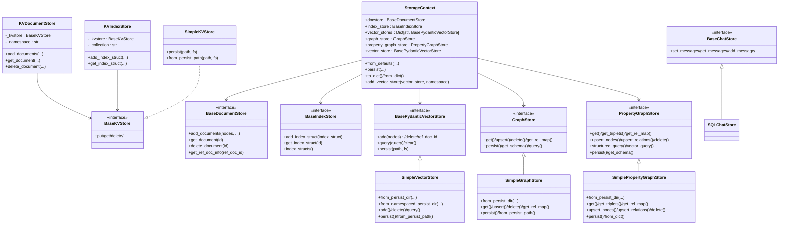

# Storage Backends

<cite>
**Referenced Files in This Document**
- [storage_context.py](file://llama-index-core/llama_index/core/storage/storage_context.py)
- [types.py](file://llama-index-core/llama_index/core/storage/docstore/types.py)
- [keyval_docstore.py](file://llama-index-core/llama_index/core/storage/docstore/keyval_docstore.py)
- [simple_docstore.py](file://llama-index-core/llama_index/core/storage/docstore/simple_docstore.py)
- [types.py](file://llama-index-core/llama_index/core/storage/index_store/types.py)
- [keyval_index_store.py](file://llama-index-core/llama_index/core/storage/index_store/keyval_index_store.py)
- [simple_index_store.py](file://llama-index-core/llama_index/core/storage/index_store/simple_index_store.py)
- [types.py](file://llama-index-core/llama_index/core/storage/kvstore/types.py)
- [simple_kvstore.py](file://llama-index-core/llama_index/core/storage/kvstore/simple_kvstore.py)
- [base.py](file://llama-index-core/llama_index/core/storage/chat_store/base.py)
- [sql.py](file://llama-index-core/llama_index/core/storage/chat_store/sql.py)
- [base.py](file://llama-index-core/llama_index/core/vector_stores/types.py)
- [simple.py](file://llama-index-core/llama_index/core/vector_stores/simple.py)
- [types.py](file://llama-index-core/llama_index/core/graph_stores/types.py)
- [simple.py](file://llama-index-core/llama_index/core/graph_stores/simple.py)
- [simple_labelled.py](file://llama-index-core/llama_index/core/graph_stores/simple_labelled.py)
</cite>

## Table of Contents
1. [Introduction](#introduction)
2. [Project Structure](#project-structure)
3. [Core Components](#core-components)
4. [Architecture Overview](#architecture-overview)
5. [Detailed Component Analysis](#detailed-component-analysis)
6. [Dependency Analysis](#dependency-analysis)
7. [Performance Considerations](#performance-considerations)
8. [Troubleshooting Guide](#troubleshooting-guide)
9. [Conclusion](#conclusion)
10. [Appendices](#appendices)

## Introduction
This document explains storage backend integrations and external storage systems in the codebase. It focuses on:
- The StorageContext container and how it composes document, index, vector, graph, and property graph stores
- The BasePydanticVectorStore interface and its SimpleVectorStore implementation
- Graph store interfaces (GraphStore and PropertyGraphStore) and their SimpleGraphStore and SimplePropertyGraphStore implementations
- Patterns for integrating external storage backends (cloud, databases, vector stores)
- Authentication and connection management considerations
- Guidance for selecting storage backends, performance characteristics, and scaling for production

## Project Structure
The storage subsystem is organized around core interfaces and simple, in-memory implementations, with clear persistence and loading patterns. Key areas:
- Storage context: composes stores and handles persistence/loading
- Document store: stores nodes and reference doc info
- Index store: persists index structures
- KV store: generic key-value abstraction used by higher-level stores
- Chat store: per-user chat history persistence
- Vector stores: embeddings and metadata-backed retrieval
- Graph stores: knowledge graph triplets and labelled property graphs

**Diagram sources**
- [storage_context.py](file://llama-index-core/llama_index/core/storage/storage_context.py#L52-L149)
- [keyval_docstore.py](file://llama-index-core/llama_index/core/storage/docstore/keyval_docstore.py#L24-L80)
- [simple_docstore.py](file://llama-index-core/llama_index/core/storage/docstore/simple_docstore.py)
- [keyval_index_store.py](file://llama-index-core/llama_index/core/storage/index_store/keyval_index_store.py#L15-L37)
- [simple_index_store.py](file://llama-index-core/llama_index/core/storage/index_store/simple_index_store.py)
- [simple_kvstore.py](file://llama-index-core/llama_index/core/storage/kvstore/simple_kvstore.py#L16-L31)
- [base.py](file://llama-index-core/llama_index/core/storage/chat_store/base.py#L11-L50)
- [sql.py](file://llama-index-core/llama_index/core/storage/chat_store/sql.py)
- [base.py](file://llama-index-core/llama_index/core/vector_stores/types.py#L333-L439)
- [simple.py](file://llama-index-core/llama_index/core/vector_stores/simple.py#L64-L91)
- [types.py](file://llama-index-core/llama_index/core/graph_stores/types.py#L215-L270)
- [simple.py](file://llama-index-core/llama_index/core/graph_stores/simple.py#L72-L94)
- [simple_labelled.py](file://llama-index-core/llama_index/core/graph_stores/simple_labelled.py#L20-L39)

**Section sources**
- [storage_context.py](file://llama-index-core/llama_index/core/storage/storage_context.py#L52-L149)
- [keyval_docstore.py](file://llama-index-core/llama_index/core/storage/docstore/keyval_docstore.py#L24-L80)
- [keyval_index_store.py](file://llama-index-core/llama_index/core/storage/index_store/keyval_index_store.py#L15-L37)
- [simple_kvstore.py](file://llama-index-core/llama_index/core/storage/kvstore/simple_kvstore.py#L16-L31)
- [base.py](file://llama-index-core/llama_index/core/storage/chat_store/base.py#L11-L50)
- [base.py](file://llama-index-core/llama_index/core/vector_stores/types.py#L333-L439)
- [types.py](file://llama-index-core/llama_index/core/graph_stores/types.py#L215-L270)

## Core Components
- StorageContext: central container holding a document store, index store, named vector stores, a graph store, and optionally a property graph store. It supports constructing from defaults or from a persistent directory, and can persist all stores to disk or a filesystem abstraction.
- Document store abstractions:
  - BaseDocumentStore: interface for storing nodes and reference doc info
  - KVDocumentStore: implements BaseDocumentStore backed by a BaseKVStore
  - SimpleDocumentStore: in-memory document store
- Index store abstractions:
  - BaseIndexStore: interface for storing index structures
  - KVIndexStore: implements BaseIndexStore backed by a BaseKVStore
  - SimpleIndexStore: in-memory index store
- KV store abstraction:
  - BaseKVStore: minimal key-value interface used by higher-level stores
  - SimpleKVStore: in-memory JSON-backed KV store with persist/load
- Chat store abstractions:
  - BaseChatStore: interface for per-user chat history
  - SQLChatStore: example implementation using SQL
- Vector store abstractions:
  - BasePydanticVectorStore: interface for vector stores with query, add, delete, clear, and persistence
  - SimpleVectorStore: in-memory vector store with JSON persistence and namespace support
- Graph store abstractions:
  - GraphStore: interface for basic triplets
  - PropertyGraphStore: interface for labelled nodes, relations, and structured queries
  - SimpleGraphStore: in-memory triplets store
  - SimplePropertyGraphStore: in-memory labelled property graph store

**Section sources**
- [storage_context.py](file://llama-index-core/llama_index/core/storage/storage_context.py#L52-L149)
- [types.py](file://llama-index-core/llama_index/core/storage/docstore/types.py)
- [keyval_docstore.py](file://llama-index-core/llama_index/core/storage/docstore/keyval_docstore.py#L24-L80)
- [simple_docstore.py](file://llama-index-core/llama_index/core/storage/docstore/simple_docstore.py)
- [types.py](file://llama-index-core/llama_index/core/storage/index_store/types.py)
- [keyval_index_store.py](file://llama-index-core/llama_index/core/storage/index_store/keyval_index_store.py#L15-L37)
- [simple_index_store.py](file://llama-index-core/llama_index/core/storage/index_store/simple_index_store.py)
- [types.py](file://llama-index-core/llama_index/core/storage/kvstore/types.py)
- [simple_kvstore.py](file://llama-index-core/llama_index/core/storage/kvstore/simple_kvstore.py#L16-L31)
- [base.py](file://llama-index-core/llama_index/core/storage/chat_store/base.py#L11-L50)
- [sql.py](file://llama-index-core/llama_index/core/storage/chat_store/sql.py)
- [base.py](file://llama-index-core/llama_index/core/vector_stores/types.py#L333-L439)
- [simple.py](file://llama-index-core/llama_index/core/vector_stores/simple.py#L64-L91)
- [types.py](file://llama-index-core/llama_index/core/graph_stores/types.py#L215-L270)
- [simple.py](file://llama-index-core/llama_index/core/graph_stores/simple.py#L72-L94)
- [simple_labelled.py](file://llama-index-core/llama_index/core/graph_stores/simple_labelled.py#L20-L39)

## Architecture Overview
The storage architecture centers on composition via interfaces and simple implementations. StorageContext orchestrates persistence and loading across stores. Higher-level stores (document, index) rely on a shared BaseKVStore abstraction, enabling pluggable persistence backends.

**Diagram sources**
- [storage_context.py](file://llama-index-core/llama_index/core/storage/storage_context.py#L52-L149)
- [keyval_docstore.py](file://llama-index-core/llama_index/core/storage/docstore/keyval_docstore.py#L24-L80)
- [keyval_index_store.py](file://llama-index-core/llama_index/core/storage/index_store/keyval_index_store.py#L15-L37)
- [simple_kvstore.py](file://llama-index-core/llama_index/core/storage/kvstore/simple_kvstore.py#L16-L31)
- [base.py](file://llama-index-core/llama_index/core/storage/chat_store/base.py#L11-L50)
- [sql.py](file://llama-index-core/llama_index/core/storage/chat_store/sql.py)
- [base.py](file://llama-index-core/llama_index/core/vector_stores/types.py#L333-L439)
- [simple.py](file://llama-index-core/llama_index/core/vector_stores/simple.py#L64-L91)
- [types.py](file://llama-index-core/llama_index/core/graph_stores/types.py#L215-L270)
- [simple.py](file://llama-index-core/llama_index/core/graph_stores/simple.py#L72-L94)
- [simple_labelled.py](file://llama-index-core/llama_index/core/graph_stores/simple_labelled.py#L20-L39)

## Detailed Component Analysis

### StorageContext: Composition and Persistence
- Construction:
  - from_defaults builds stores from scratch or loads from a persistent directory
  - Supports passing explicit stores or namespaces for vector stores
- Persistence:
  - persist writes docstore, index_store, graph_store, optional property graph store, and each named vector store to separate files
  - Uses fsspec filesystem abstraction for remote/local targets
- Serialization:
  - to_dict/from_dict supported only when using simple stores

**Diagram sources**
- [storage_context.py](file://llama-index-core/llama_index/core/storage/storage_context.py#L73-L203)

**Section sources**
- [storage_context.py](file://llama-index-core/llama_index/core/storage/storage_context.py#L73-L203)

### Document Store: KVDocumentStore and SimpleDocumentStore
- KVDocumentStore:
  - Implements BaseDocumentStore using a BaseKVStore
  - Manages three collections: nodes, metadata, and reference doc info
  - Batched insertions and deletions; merges ref doc info across nodes
- SimpleDocumentStore:
  - In-memory document store used by default
  - Provides convenience APIs for typical usage

**Diagram sources**
- [keyval_docstore.py](file://llama-index-core/llama_index/core/storage/docstore/keyval_docstore.py#L143-L205)

**Section sources**
- [keyval_docstore.py](file://llama-index-core/llama_index/core/storage/docstore/keyval_docstore.py#L24-L80)
- [keyval_docstore.py](file://llama-index-core/llama_index/core/storage/docstore/keyval_docstore.py#L207-L245)
- [simple_docstore.py](file://llama-index-core/llama_index/core/storage/docstore/simple_docstore.py)

### Index Store: KVIndexStore and SimpleIndexStore
- KVIndexStore:
  - Persists IndexStruct instances to a BaseKVStore collection
  - Supports async variants for operations
- SimpleIndexStore:
  - In-memory implementation for default usage

**Section sources**
- [keyval_index_store.py](file://llama-index-core/llama_index/core/storage/index_store/keyval_index_store.py#L15-L37)
- [keyval_index_store.py](file://llama-index-core/llama_index/core/storage/index_store/keyval_index_store.py#L38-L89)
- [simple_index_store.py](file://llama-index-core/llama_index/core/storage/index_store/simple_index_store.py)

### KV Store Abstraction: SimpleKVStore
- SimpleKVStore:
  - JSON-backed in-memory store with collections
  - Supports persist/load via fsspec filesystem
  - Used by KVDocumentStore and KVIndexStore

**Section sources**
- [simple_kvstore.py](file://llama-index-core/llama_index/core/storage/kvstore/simple_kvstore.py#L16-L31)
- [simple_kvstore.py](file://llama-index-core/llama_index/core/storage/kvstore/simple_kvstore.py#L35-L66)

### Chat Store: BaseChatStore and SQLChatStore
- BaseChatStore:
  - Defines methods for setting, getting, adding, and deleting messages per key
  - Includes async variants
- SQLChatStore:
  - Example implementation leveraging SQL persistence

**Section sources**
- [base.py](file://llama-index-core/llama_index/core/storage/chat_store/base.py#L11-L79)
- [sql.py](file://llama-index-core/llama_index/core/storage/chat_store/sql.py)

### Vector Stores: BasePydanticVectorStore and SimpleVectorStore
- BasePydanticVectorStore:
  - Defines add, delete, query, clear, and persistence hooks
  - Provides async variants
  - get_nodes and delete_nodes are optional and throw if not implemented
- SimpleVectorStore:
  - Stores embeddings and metadata in-memory
  - Supports JSON persistence and namespace-aware loading
  - Query modes include default, MMR, and learner-based modes
  - Filtering supported via metadata filters

**Diagram sources**
- [base.py](file://llama-index-core/llama_index/core/vector_stores/types.py#L333-L439)
- [simple.py](file://llama-index-core/llama_index/core/vector_stores/simple.py#L174-L316)
- [simple.py](file://llama-index-core/llama_index/core/vector_stores/simple.py#L317-L355)

**Section sources**
- [base.py](file://llama-index-core/llama_index/core/vector_stores/types.py#L333-L439)
- [simple.py](file://llama-index-core/llama_index/core/vector_stores/simple.py#L64-L91)
- [simple.py](file://llama-index-core/llama_index/core/vector_stores/simple.py#L174-L316)
- [simple.py](file://llama-index-core/llama_index/core/vector_stores/simple.py#L317-L355)

### Graph Stores: GraphStore and PropertyGraphStore
- GraphStore:
  - Basic triplets interface: get, upsert, delete, get_rel_map, persist, get_schema, query
- SimpleGraphStore:
  - In-memory triplets store with JSON persistence
- PropertyGraphStore:
  - Labelled nodes (EntityNode, ChunkNode), relations, triplets
  - get, get_triplets, get_rel_map, upsert_nodes, upsert_relations, delete, structured_query, vector_query
- SimplePropertyGraphStore:
  - In-memory labelled property graph with JSON persistence and conversion helpers

**Diagram sources**
- [types.py](file://llama-index-core/llama_index/core/graph_stores/types.py#L215-L270)
- [simple.py](file://llama-index-core/llama_index/core/graph_stores/simple.py#L72-L94)
- [types.py](file://llama-index-core/llama_index/core/graph_stores/types.py#L276-L528)
- [simple_labelled.py](file://llama-index-core/llama_index/core/graph_stores/simple_labelled.py#L20-L39)

**Section sources**
- [types.py](file://llama-index-core/llama_index/core/graph_stores/types.py#L215-L270)
- [simple.py](file://llama-index-core/llama_index/core/graph_stores/simple.py#L72-L94)
- [types.py](file://llama-index-core/llama_index/core/graph_stores/types.py#L276-L528)
- [simple_labelled.py](file://llama-index-core/llama_index/core/graph_stores/simple_labelled.py#L20-L39)

## Dependency Analysis
- Coupling:
  - KVDocumentStore and KVIndexStore depend on BaseKVStore
  - StorageContext composes all store interfaces
  - Simple implementations are used by default and can be replaced by external integrations
- Cohesion:
  - Each store type encapsulates its own persistence/loading logic
- External dependencies:
  - fsspec filesystem abstraction enables local and remote persistence
  - Pydantic-based models for serialization/deserialization

**Diagram sources**
- [storage_context.py](file://llama-index-core/llama_index/core/storage/storage_context.py#L52-L149)
- [keyval_docstore.py](file://llama-index-core/llama_index/core/storage/docstore/keyval_docstore.py#L24-L80)
- [keyval_index_store.py](file://llama-index-core/llama_index/core/storage/index_store/keyval_index_store.py#L15-L37)
- [simple_kvstore.py](file://llama-index-core/llama_index/core/storage/kvstore/simple_kvstore.py#L16-L31)

**Section sources**
- [storage_context.py](file://llama-index-core/llama_index/core/storage/storage_context.py#L52-L149)
- [keyval_docstore.py](file://llama-index-core/llama_index/core/storage/docstore/keyval_docstore.py#L24-L80)
- [keyval_index_store.py](file://llama-index-core/llama_index/core/storage/index_store/keyval_index_store.py#L15-L37)
- [simple_kvstore.py](file://llama-index-core/llama_index/core/storage/kvstore/simple_kvstore.py#L16-L31)

## Performance Considerations
- In-memory simplicity:
  - SimpleVectorStore, SimpleGraphStore, and SimplePropertyGraphStore offer low-latency access suitable for development and small-scale deployments
- Persistence overhead:
  - JSON serialization/deserialization adds CPU cost; consider batching writes and minimizing frequent reloads
- Namespace and multi-store:
  - SimpleVectorStore supports multiple named stores; use namespaces to isolate datasets and reduce contention
- Async operations:
  - Many stores expose async methods; leverage them in high-throughput scenarios
- External backends:
  - Replace Simple* stores with external integrations (cloud, databases, vector DBs) for scalability and durability
  - Ensure the external client handles retries, timeouts, and connection pooling

[No sources needed since this section provides general guidance]

## Troubleshooting Guide
- Persistence errors:
  - SimpleKVStore persist/load uses fsspec; ensure the filesystem path exists and is writable
- Missing metadata filters:
  - SimpleVectorStore raises an error if attempting to filter a store that was persisted without metadata
- Loading from non-existent paths:
  - SimpleGraphStore warns and initializes from scratch if the persist path does not exist
- Unsupported operations:
  - SimpleGraphStore and SimplePropertyGraphStore may raise NotImplementedError for unsupported features (schema, structured queries, vector queries)

**Section sources**
- [simple_kvstore.py](file://llama-index-core/llama_index/core/storage/kvstore/simple_kvstore.py#L35-L66)
- [simple.py](file://llama-index-core/llama_index/core/vector_stores/simple.py#L244-L316)
- [simple.py](file://llama-index-core/llama_index/core/graph_stores/simple.py#L153-L179)
- [simple_labelled.py](file://llama-index-core/llama_index/core/graph_stores/simple_labelled.py#L233-L253)

## Conclusion
The storage subsystem provides a clean separation of concerns through interfaces and simple implementations. StorageContext orchestrates persistence and loading, while BaseKVStore enables pluggable backends. For production, replace simple stores with external integrations (cloud storage, databases, vector databases) and manage authentication and connections via the underlying clients. Use namespaces for multi-tenant or multi-dataset setups, and leverage async APIs for throughput.

[No sources needed since this section summarizes without analyzing specific files]

## Appendices

### Integration Patterns and Examples
- Cloud storage:
  - Use fsspec filesystems (e.g., s3, gcs, azure) with StorageContext.persist and store-specific from_persist_path methods
- Databases:
  - Implement BaseKVStore against relational or document databases; KVDocumentStore/KVIndexStore will transparently persist
- Vector databases:
  - Implement BasePydanticVectorStore to integrate external vector DBs; register multiple namespaces for multi-modal or multi-domain embeddings
- Authentication and connection management:
  - Pass credentials to external clients; wrap with retry/backoff; close connections in shutdown hooks
- Custom storage backends:
  - Implement BaseDocumentStore/BaseIndexStore/BaseKVStore/BaseChatStore/BasePydanticVectorStore/GraphStore/PropertyGraphStore as needed
- Selection criteria:
  - Latency, durability, scale, query capabilities, and ecosystem compatibility
- Scaling considerations:
  - Use async APIs, connection pools, batching, and partitioning strategies; monitor I/O and CPU utilization

[No sources needed since this section provides general guidance]