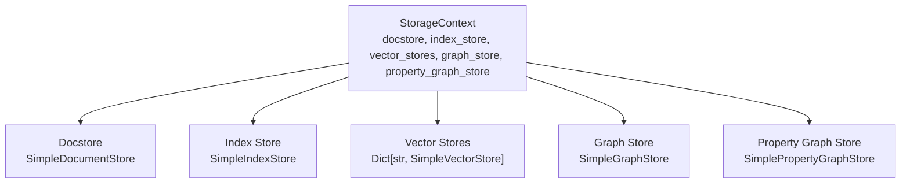
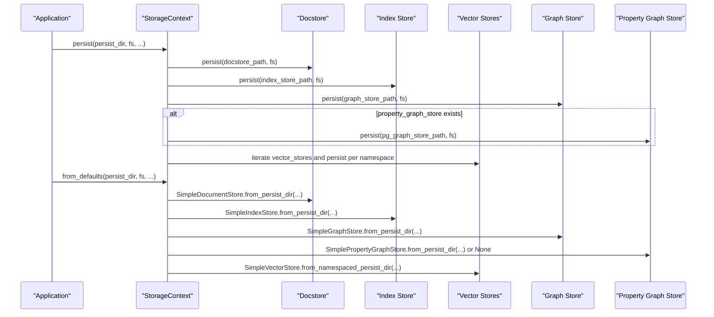
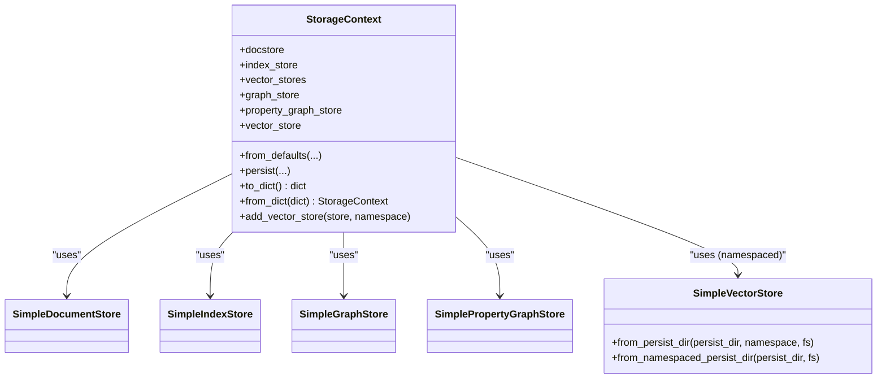

# Storage Context

<cite>
**Referenced Files in This Document**
- [storage_context.py](file://llama-index-core/llama_index/core/storage/storage_context.py)
- [constants.py](file://llama-index-core/llama_index/core/constants.py)
- [simple.py](file://llama-index-core/llama_index/core/vector_stores/simple.py)
- [types.py (graph_stores)](file://llama-index-core/llama_index/core/graph_stores/types.py)
- [types.py (docstore)](file://llama-index-core/llama_index/core/storage/docstore/types.py)
- [types.py (index_store)](file://llama-index-core/llama_index/core/storage/index_store/types.py)
- [test_storage_context.py](file://llama-index-core/tests/storage/test_storage_context.py)
</cite>

## Table of Contents
1. [Introduction](#introduction)
2. [Project Structure](#project-structure)
3. [Core Components](#core-components)
4. [Architecture Overview](#architecture-overview)
5. [Detailed Component Analysis](#detailed-component-analysis)
6. [Dependency Analysis](#dependency-analysis)
7. [Performance Considerations](#performance-considerations)
8. [Troubleshooting Guide](#troubleshooting-guide)
9. [Conclusion](#conclusion)
10. [Appendices](#appendices)

## Introduction
This document provides comprehensive API documentation for the StorageContext class, the central coordination mechanism for all storage backends in the system. It covers:
- The StorageContext role as a container for docstore, index_store, vector_stores, graph_store, and property_graph_store
- The from_defaults() constructor method with all configuration options including persist_dir, fs, and individual store parameters
- The persist() method for saving storage state to disk, including file naming conventions and namespace handling
- The to_dict() and from_dict() serialization methods for simple storage backends
- Vector store namespace management and the vector_store property for backward compatibility
- Practical examples for creating custom storage contexts, configuring persistent storage, and migrating between storage backends

## Project Structure
StorageContext lives in the core storage module and orchestrates several specialized stores:
- Docstore: persists nodes and document metadata
- Index store: persists index structures
- Vector stores: persists embeddings and metadata, with optional namespaces
- Graph store: persists graph data
- Property graph store: persists labeled property graphs (optional)

**Diagram sources**
- [storage_context.py](file://llama-index-core/llama_index/core/storage/storage_context.py#L52-L71)

**Section sources**
- [storage_context.py](file://llama-index-core/llama_index/core/storage/storage_context.py#L52-L71)

## Core Components
- StorageContext: central coordinator for all storage backends
- from_defaults(): factory method to construct StorageContext with defaults or from persisted directories
- persist(): writes all stores to disk with deterministic filenames and namespace-aware vector store persistence
- to_dict()/from_dict(): serialization helpers for simple stores
- vector_store property: backward-compatible accessor to the default vector store
- add_vector_store(): add named vector stores for multi-modal or multi-purpose scenarios

Key responsibilities:
- Provide unified access to all storage backends
- Manage persistence and loading from local or remote filesystems via fsspec
- Support vector store namespaces for multiple modalities (e.g., images)
- Enable migration between simple and backend-specific stores via from_dict/to_dict

**Section sources**
- [storage_context.py](file://llama-index-core/llama_index/core/storage/storage_context.py#L73-L149)
- [storage_context.py](file://llama-index-core/llama_index/core/storage/storage_context.py#L151-L202)
- [storage_context.py](file://llama-index-core/llama_index/core/storage/storage_context.py#L204-L266)
- [storage_context.py](file://llama-index-core/llama_index/core/storage/storage_context.py#L268-L277)

## Architecture Overview
StorageContext coordinates persistence and retrieval across multiple storage backends. The following sequence illustrates saving and loading:

**Diagram sources**
- [storage_context.py](file://llama-index-core/llama_index/core/storage/storage_context.py#L151-L202)
- [storage_context.py](file://llama-index-core/llama_index/core/storage/storage_context.py#L112-L141)

## Detailed Component Analysis

### StorageContext.from_defaults()
Purpose: Construct a StorageContext from either in-memory defaults or from a persisted directory.

Parameters:
- docstore: optional custom document store
- index_store: optional custom index store
- vector_store: optional single vector store (sets default namespace)
- image_store: optional vector store for images (added under the "image" namespace)
- vector_stores: optional mapping of namespace -> vector store
- graph_store: optional graph store
- property_graph_store: optional property graph store
- persist_dir: optional directory for loading existing persisted stores
- fs: optional fsspec filesystem for remote/local access

Behavior:
- Without persist_dir: creates SimpleDocumentStore, SimpleIndexStore, SimpleGraphStore, and a default SimpleVectorStore. If image_store is provided, it is added under the "image" namespace.
- With persist_dir: loads stores from the directory using from_persist_dir methods. Property graph store is loaded if present; otherwise remains None. Vector stores are loaded via from_namespaced_persist_dir unless explicit vector_store or vector_stores are provided.

Notes:
- Backward compatibility: image_store is appended to vector_stores under the "image" namespace.
- Namespace precedence: explicit vector_store overrides vector_stores mapping.

**Section sources**
- [storage_context.py](file://llama-index-core/llama_index/core/storage/storage_context.py#L73-L149)

### StorageContext.persist()
Purpose: Persist all stores to disk with deterministic filenames and namespace-aware vector store persistence.

Parameters:
- persist_dir: directory to persist to (defaults to a constant)
- docstore_fname, index_store_fname, vector_store_fname, image_store_fname, graph_store_fname, pg_graph_store_fname: filename constants for each store
- fs: optional fsspec filesystem

Behavior:
- Computes paths for each store, handling both local paths and fsspec concatenations.
- Persists docstore, index_store, and graph_store.
- If property_graph_store exists, persists it separately.
- Iterates vector_stores and persists each under its namespace using a namespace separator.

File naming conventions:
- Docstore: uses a default filename constant
- Index store: uses a default filename constant
- Graph store: uses a default filename constant
- Property graph store: uses a default filename constant
- Vector stores: filename is "<namespace><separator><default_filename>" where separator is "__" and default filename is a constant

Namespace handling:
- Namespaces are derived from vector_stores keys. The "image" namespace is reserved for image_store when provided.

**Section sources**
- [storage_context.py](file://llama-index-core/llama_index/core/storage/storage_context.py#L151-L202)
- [simple.py](file://llama-index-core/llama_index/core/vector_stores/simple.py#L43-L44)
- [types.py (graph_stores)](file://llama-index-core/llama_index/core/graph_stores/types.py#L25-L27)
- [types.py (docstore)](file://llama-index-core/llama_index/core/storage/docstore/types.py#L11-L13)
- [types.py (index_store)](file://llama-index-core/llama_index/core/storage/index_store/types.py#L8-L10)

### StorageContext.to_dict() and StorageContext.from_dict()
Purpose: Serialize and deserialize a StorageContext composed entirely of simple stores.

Constraints:
- to_dict() only works when all stores are simple implementations (SimpleDocumentStore, SimpleIndexStore, SimpleGraphStore, SimplePropertyGraphStore, and SimpleVectorStore for all namespaces).

to_dict():
- Validates that all stores are simple types
- Serializes vector_stores keyed by namespace
- Serializes docstore, index_store, graph_store, and optionally property_graph_store

from_dict():
- Reconstructs simple stores from serialized dictionaries
- Rebuilds vector_stores mapping from serialized dicts

Usage:
- Ideal for lightweight, in-memory-like persistence and migration between environments
- Not suitable for production vector stores backed by external databases

**Section sources**
- [storage_context.py](file://llama-index-core/llama_index/core/storage/storage_context.py#L204-L266)
- [constants.py](file://llama-index-core/llama_index/core/constants.py#L25-L30)

### Vector Store Namespace Management and vector_store Property
- Namespaces: vector_stores is a Dict[str, BasePydanticVectorStore]. Each key acts as a namespace for the vector store.
- Default namespace: DEFAULT_VECTOR_STORE constant
- Image namespace: IMAGE_VECTOR_STORE_NAMESPACE constant ("image")
- Backward compatibility: vector_store property returns the vector store under the default namespace

Adding stores:
- Use add_vector_store() to register a vector store under a custom namespace

Loading from namespaced persistence:
- SimpleVectorStore.from_namespaced_persist_dir() discovers all stores in a directory by parsing filenames and reconstructing namespaces

**Section sources**
- [storage_context.py](file://llama-index-core/llama_index/core/storage/storage_context.py#L268-L277)
- [simple.py](file://llama-index-core/llama_index/core/vector_stores/simple.py#L109-L145)
- [simple.py](file://llama-index-core/llama_index/core/vector_stores/simple.py#L43-L44)
- [constants.py](file://llama-index-core/llama_index/core/constants.py#L25-L30)

### Class and Method Relationships

**Diagram sources**
- [storage_context.py](file://llama-index-core/llama_index/core/storage/storage_context.py#L52-L71)
- [simple.py](file://llama-index-core/llama_index/core/vector_stores/simple.py#L92-L145)

## Dependency Analysis
- StorageContext depends on:
  - SimpleDocumentStore, SimpleIndexStore, SimpleGraphStore, SimplePropertyGraphStore for default in-memory persistence
  - SimpleVectorStore for default vector persistence and namespaced loading
  - Constants for keys and filenames
  - fsspec for filesystem abstraction
- Coupling:
  - Tight coupling to simple store implementations for to_dict/from_dict
  - Loose coupling to backend stores via interfaces (BaseDocumentStore, BaseIndexStore, BasePydanticVectorStore, GraphStore, PropertyGraphStore)
- Cohesion:
  - High cohesion around storage orchestration and persistence

Potential circular dependencies:
- None observed; StorageContext imports store types but does not import itself

External integration points:
- fsspec filesystems for remote storage (S3, GCS, etc.)
- Backend-specific vector stores via BasePydanticVectorStore interface

**Section sources**
- [storage_context.py](file://llama-index-core/llama_index/core/storage/storage_context.py#L1-L46)
- [constants.py](file://llama-index-core/llama_index/core/constants.py#L25-L30)

## Performance Considerations
- Persistence overhead: Each store is persisted individually; consider batching operations when adding many nodes to minimize repeated writes.
- Namespaced vector stores: Persisting multiple stores increases I/O; consolidate namespaces when feasible.
- Simple stores: to_dict/from_dict is efficient for small datasets but may not scale for large vector stores.
- fsspec filesystems: Network latency and throughput impact persist operations; choose appropriate filesystems for your deployment.

## Troubleshooting Guide
Common issues and resolutions:
- to_dict fails with a ValueError: Ensure all stores are simple implementations (SimpleDocumentStore, SimpleIndexStore, SimpleGraphStore, SimplePropertyGraphStore, and SimpleVectorStore).
- Persisting to remote filesystems: Verify fs connectivity and permissions; ensure paths are constructed correctly using concat_dirs semantics.
- Loading from namespaced directories: If vector_stores fail to load, confirm filenames match the "<namespace>__<filename>" pattern and that the directory listing is accessible.
- Property graph store missing: from_defaults ignores missing property graph store files; explicitly set property_graph_store if required.

Validation references:
- to_dict validation and error conditions
- from_defaults fallback behavior for property graph store
- persist path construction for both local and fsspec modes

**Section sources**
- [storage_context.py](file://llama-index-core/llama_index/core/storage/storage_context.py#L204-L219)
- [storage_context.py](file://llama-index-core/llama_index/core/storage/storage_context.py#L123-L129)
- [storage_context.py](file://llama-index-core/llama_index/core/storage/storage_context.py#L169-L202)

## Conclusion
StorageContext is the central coordination point for all storage backends, enabling flexible configuration, robust persistence, and seamless migration between simple and backend-specific stores. Its namespace-aware vector store management supports multi-modal and multi-purpose embeddings, while the to_dict/from_dict methods provide a practical path for lightweight persistence and portability.

## Appendices

### Examples and Usage Patterns

- Creating a custom storage context with backend-specific stores:
  - Instantiate a backend vector store (e.g., a cloud vector store) and pass it to StorageContext.from_defaults(vector_store=your_vector_store).
  - Add additional vector stores under custom namespaces using add_vector_store(namespace="custom").

- Configuring persistent storage:
  - Call StorageContext.from_defaults(persist_dir="your/storage/dir", fs=your_fsspec_fs) to load existing stores.
  - After building indices and adding nodes, call persist(persist_dir="your/storage/dir", fs=your_fsspec_fs) to save.

- Migrating between storage backends:
  - Use to_dict() to serialize current simple stores.
  - Switch to backend-specific stores and reconstruct using from_dict().
  - Persist the new stores using the same persist_dir to maintain continuity.

Validation via tests:
- The test suite demonstrates basic CRUD operations on nodes and index structs through the storage context, followed by serialization and deserialization.

**Section sources**
- [test_storage_context.py](file://llama-index-core/tests/storage/test_storage_context.py#L6-L31)
- [storage_context.py](file://llama-index-core/llama_index/core/storage/storage_context.py#L204-L266)