# Utility APIs

<cite>
**Referenced Files in This Document**
- [types.py](file://llama-index-core/llama_index/core/types.py)
- [utils.py](file://llama-index-core/llama_index/core/utils.py)
- [__init__.py](file://llama-index-core/llama_index/core/output_parsers/__init__.py)
- [langchain.py](file://llama-index-core/llama_index/core/output_parsers/langchain.py)
- [pydantic.py](file://llama-index-core/llama_index/core/output_parsers/pydantic.py)
- [__init__.py](file://llama-index-core/llama_index/core/postprocessor/__init__.py)
- [node.py](file://llama-index-core/llama_index/core/postprocessor/node.py)
- [__init__.py](file://llama-index-core/llama_index/core/tools/__init__.py)
- [function_tool.py](file://llama-index-core/llama_index/core/tools/function_tool.py)
- [utils.py](file://llama-index-core/llama_index/core/callbacks/utils.py)
</cite>

## Table of Contents
1. [Introduction](#introduction)
2. [Project Structure](#project-structure)
3. [Core Components](#core-components)
4. [Architecture Overview](#architecture-overview)
5. [Detailed Component Analysis](#detailed-component-analysis)
6. [Dependency Analysis](#dependency-analysis)
7. [Performance Considerations](#performance-considerations)
8. [Troubleshooting Guide](#troubleshooting-guide)
9. [Conclusion](#conclusion)

## Introduction
This document describes the Utility APIs in the LlamaIndex codebase with a focus on:
- Output parsers for structured output generation
- Node postprocessors for retrieval-time filtering and reordering
- Tools and tool utilities for integrating external capabilities
- General-purpose helper utilities for data manipulation, validation, conversion, and diagnostics
- Programmatic APIs for working with structured outputs, nodes, and tools
- Debugging, tracing, and instrumentation utilities

It aims to be accessible to both newcomers and advanced users, providing conceptual overviews, code-level diagrams, and practical guidance for building, configuring, and extending these utilities.

## Project Structure
The Utility APIs are organized under core modules:
- Output parsers: structured output formatting and parsing
- Postprocessors: node filtering, ranking, and reordering
- Tools: tool abstractions, function wrappers, and tool selection
- Utilities: general helpers for tokenization, retries, batching, caching, and printing
- Callbacks and tracing: instrumentation and debugging hooks

**Diagram sources**
- [types.py](file://llama-index-core/llama_index/core/types.py#L43-L101)
- [utils.py](file://llama-index-core/llama_index/core/utils.py#L134-L172)
- [utils.py](file://llama-index-core/llama_index/core/utils.py#L229-L348)
- [utils.py](file://llama-index-core/llama_index/core/utils.py#L384-L398)
- [utils.py](file://llama-index-core/llama_index/core/utils.py#L424-L438)
- [utils.py](file://llama-index-core/llama_index/core/utils.py#L552-L569)
- [utils.py](file://llama-index-core/llama_index/core/utils.py#L614-L704)
- [__init__.py](file://llama-index-core/llama_index/core/output_parsers/__init__.py#L1-L14)
- [langchain.py](file://llama-index-core/llama_index/core/output_parsers/langchain.py#L14-L43)
- [pydantic.py](file://llama-index-core/llama_index/core/output_parsers/pydantic.py#L18-L68)
- [__init__.py](file://llama-index-core/llama_index/core/postprocessor/__init__.py#L1-L48)
- [node.py](file://llama-index-core/llama_index/core/postprocessor/node.py#L26-L397)
- [__init__.py](file://llama-index-core/llama_index/core/tools/__init__.py#L1-L36)
- [function_tool.py](file://llama-index-core/llama_index/core/tools/function_tool.py#L67-L449)
- [utils.py](file://llama-index-core/llama_index/core/callbacks/utils.py#L11-L62)

**Section sources**
- [types.py](file://llama-index-core/llama_index/core/types.py#L43-L101)
- [utils.py](file://llama-index-core/llama_index/core/utils.py#L134-L172)
- [utils.py](file://llama-index-core/llama_index/core/utils.py#L229-L348)
- [utils.py](file://llama-index-core/llama_index/core/utils.py#L384-L398)
- [utils.py](file://llama-index-core/llama_index/core/utils.py#L424-L438)
- [utils.py](file://llama-index-core/llama_index/core/utils.py#L552-L569)
- [utils.py](file://llama-index-core/llama_index/core/utils.py#L614-L704)
- [__init__.py](file://llama-index-core/llama_index/core/output_parsers/__init__.py#L1-L14)
- [langchain.py](file://llama-index-core/llama_index/core/output_parsers/langchain.py#L14-L43)
- [pydantic.py](file://llama-index-core/llama_index/core/output_parsers/pydantic.py#L18-L68)
- [__init__.py](file://llama-index-core/llama_index/core/postprocessor/__init__.py#L1-L48)
- [node.py](file://llama-index-core/llama_index/core/postprocessor/node.py#L26-L397)
- [__init__.py](file://llama-index-core/llama_index/core/tools/__init__.py#L1-L36)
- [function_tool.py](file://llama-index-core/llama_index/core/tools/function_tool.py#L67-L449)
- [utils.py](file://llama-index-core/llama_index/core/callbacks/utils.py#L11-L62)

## Core Components
- Output parsers
  - BaseOutputParser defines the contract for parsing and formatting structured outputs.
  - LangchainOutputParser adapts Langchain output parsers into LlamaIndex’s format.
  - PydanticOutputParser extracts and validates JSON against a Pydantic model schema.
- Node postprocessors
  - KeywordNodePostprocessor filters nodes by required/ excluded keywords.
  - SimilarityPostprocessor filters nodes by a similarity cutoff.
  - PrevNextNodePostprocessor and AutoPrevNextNodePostprocessor fetch neighboring nodes or infer direction automatically.
  - LongContextReorder reorders nodes to improve model access to important information.
- Tools
  - FunctionTool wraps arbitrary functions into tools with schema inference, async support, callbacks, and context-aware invocation.
  - Tool selection and calling utilities enable selecting and invoking tools programmatically.
- Utilities
  - Tokenization helpers, retries with exponential backoff, batching iterators, cache directory resolution, progress bars, colored printing, binary resolution, and device inference.
- Instrumentation and tracing
  - trace_method decorator integrates with the callback manager to trace method calls.

**Section sources**
- [types.py](file://llama-index-core/llama_index/core/types.py#L43-L101)
- [langchain.py](file://llama-index-core/llama_index/core/output_parsers/langchain.py#L14-L43)
- [pydantic.py](file://llama-index-core/llama_index/core/output_parsers/pydantic.py#L18-L68)
- [node.py](file://llama-index-core/llama_index/core/postprocessor/node.py#L26-L397)
- [function_tool.py](file://llama-index-core/llama_index/core/tools/function_tool.py#L67-L449)
- [utils.py](file://llama-index-core/llama_index/core/utils.py#L134-L172)
- [utils.py](file://llama-index-core/llama_index/core/utils.py#L229-L348)
- [utils.py](file://llama-index-core/llama_index/core/utils.py#L384-L398)
- [utils.py](file://llama-index-core/llama_index/core/utils.py#L424-L438)
- [utils.py](file://llama-index-core/llama_index/core/utils.py#L552-L569)
- [utils.py](file://llama-index-core/llama_index/core/utils.py#L614-L704)
- [utils.py](file://llama-index-core/llama_index/core/callbacks/utils.py#L11-L62)

## Architecture Overview
The Utility APIs form a cohesive layer that:
- Normalizes structured output via output parsers
- Filters and enriches retrieval results via postprocessors
- Encapsulates external capabilities as tools with consistent interfaces
- Provides general-purpose utilities for robustness and usability
- Integrates with instrumentation for observability

**Diagram sources**
- [types.py](file://llama-index-core/llama_index/core/types.py#L43-L101)
- [langchain.py](file://llama-index-core/llama_index/core/output_parsers/langchain.py#L14-L43)
- [pydantic.py](file://llama-index-core/llama_index/core/output_parsers/pydantic.py#L18-L68)

## Detailed Component Analysis

### Output Parsers
- Purpose: Convert LLM outputs into structured data using Langchain or Pydantic.
- Key APIs:
  - BaseOutputParser: abstract interface for parse/format and message formatting.
  - LangchainOutputParser: wraps a Langchain output parser and injects format instructions into queries.
  - PydanticOutputParser: generates format instructions from a Pydantic schema, extracts JSON, and validates.

```mermaid
sequenceDiagram
participant Caller as "Caller"
participant Parser as "PydanticOutputParser"
participant Schema as "Pydantic Model"
Caller->>Parser : format(query)
Parser-->>Caller : query_with_format_instructions
Caller->>Parser : parse(text)
Parser->>Parser : extract_json_str(text)
Parser->>Schema : model_validate_json(json_str)
Schema-->>Parser : validated_instance
Parser-->>Caller : validated_instance
```

**Diagram sources**
- [pydantic.py](file://llama-index-core/llama_index/core/output_parsers/pydantic.py#L18-L68)

**Section sources**
- [types.py](file://llama-index-core/llama_index/core/types.py#L43-L101)
- [langchain.py](file://llama-index-core/llama_index/core/output_parsers/langchain.py#L14-L43)
- [pydantic.py](file://llama-index-core/llama_index/core/output_parsers/pydantic.py#L18-L68)

### Node Postprocessors
- Purpose: Refine and reorder nodes returned by retrievers to improve downstream quality.
- Key APIs:
  - KeywordNodePostprocessor: filter by required and excluded keywords.
  - SimilarityPostprocessor: filter by similarity score threshold.
  - PrevNextNodePostprocessor: fetch neighboring nodes from the document store.
  - AutoPrevNextNodePostprocessor: infer direction (previous/next/none) using an LLM and expand accordingly.
  - LongContextReorder: reorder nodes to improve model access to important information.

**Diagram sources**
- [node.py](file://llama-index-core/llama_index/core/postprocessor/node.py#L26-L397)

**Section sources**
- [node.py](file://llama-index-core/llama_index/core/postprocessor/node.py#L26-L397)

### Tools and Tool Utilities
- Purpose: Wrap functions and external capabilities into a unified tool interface with schema inference, async support, callbacks, and context awareness.
- Key APIs:
  - FunctionTool: wraps sync/async functions, supports callbacks, partial parameters, schema inference, and conversion to LangChain tools.
  - Utilities: sync_to_async, async_to_sync, extract_param_docs.

**Diagram sources**
- [function_tool.py](file://llama-index-core/llama_index/core/tools/function_tool.py#L67-L449)

**Section sources**
- [function_tool.py](file://llama-index-core/llama_index/core/tools/function_tool.py#L67-L449)

### General Utilities
- Tokenization and retries:
  - get_tokenizer, set_global_tokenizer, count_tokens
  - retry_on_exceptions_with_backoff, aretry_on_exceptions_with_backoff, decorator
- Iteration and batching:
  - iter_batch
- Paths and cache:
  - get_cache_dir
- Progress and printing:
  - get_tqdm_iterable, print_text
- Binary resolution:
  - resolve_binary (bytes, path, URL, data URL)
- Device inference:
  - infer_torch_device

**Diagram sources**
- [utils.py](file://llama-index-core/llama_index/core/utils.py#L614-L704)

**Section sources**
- [utils.py](file://llama-index-core/llama_index/core/utils.py#L134-L172)
- [utils.py](file://llama-index-core/llama_index/core/utils.py#L229-L348)
- [utils.py](file://llama-index-core/llama_index/core/utils.py#L384-L398)
- [utils.py](file://llama-index-core/llama_index/core/utils.py#L424-L438)
- [utils.py](file://llama-index-core/llama_index/core/utils.py#L552-L569)
- [utils.py](file://llama-index-core/llama_index/core/utils.py#L614-L704)

### Instrumentation and Tracing
- Purpose: Add tracing around method calls using the callback manager.
- Key API:
  - trace_method: decorator that wraps methods and enters a trace span during execution.

**Diagram sources**
- [utils.py](file://llama-index-core/llama_index/core/callbacks/utils.py#L11-L62)

**Section sources**
- [utils.py](file://llama-index-core/llama_index/core/callbacks/utils.py#L11-L62)

## Dependency Analysis
- Output parsers depend on:
  - BaseOutputParser for the interface
  - Langchain bridge for LangchainOutputParser
  - Pydantic model schemas for PydanticOutputParser
- Postprocessors depend on:
  - BaseNodePostprocessor and schema types
  - LLM and response synthesizer for auto inference
  - Document store for neighbor traversal
- Tools depend on:
  - FunctionTool and tool metadata
  - Async/sync adapters and schema inference
  - Callbacks and content block conversion
- Utilities depend on:
  - External libraries (tiktoken, transformers, requests, tqdm, torch)
  - Standard library modules for OS and encoding

**Diagram sources**
- [types.py](file://llama-index-core/llama_index/core/types.py#L43-L101)
- [langchain.py](file://llama-index-core/llama_index/core/output_parsers/langchain.py#L14-L43)
- [pydantic.py](file://llama-index-core/llama_index/core/output_parsers/pydantic.py#L18-L68)
- [node.py](file://llama-index-core/llama_index/core/postprocessor/node.py#L150-L363)
- [function_tool.py](file://llama-index-core/llama_index/core/tools/function_tool.py#L67-L449)

**Section sources**
- [types.py](file://llama-index-core/llama_index/core/types.py#L43-L101)
- [langchain.py](file://llama-index-core/llama_index/core/output_parsers/langchain.py#L14-L43)
- [pydantic.py](file://llama-index-core/llama_index/core/output_parsers/pydantic.py#L18-L68)
- [node.py](file://llama-index-core/llama_index/core/postprocessor/node.py#L150-L363)
- [function_tool.py](file://llama-index-core/llama_index/core/tools/function_tool.py#L67-L449)

## Performance Considerations
- Tokenization and batching
  - Use get_tokenizer and count_tokens to estimate costs.
  - Use iter_batch to process large datasets efficiently.
- Retries and backoff
  - Use retry_on_exceptions_with_backoff and aretry_on_exceptions_with_backoff to handle transient failures gracefully.
- Progress reporting
  - Use get_tqdm_iterable to add progress bars when available.
- Binary resolution
  - resolve_binary avoids unnecessary decoding when as_base64 is requested.
- Device inference
  - infer_torch_device selects optimal device for ML workloads.

[No sources needed since this section provides general guidance]

## Troubleshooting Guide
- Output parsing
  - Ensure PydanticOutputParser receives a valid JSON substring; extraction and validation are handled internally.
  - For LangchainOutputParser, confirm the underlying parser’s expectations and format instructions.
- Node postprocessing
  - KeywordNodePostprocessor requires spaCy; install the library if missing.
  - AutoPrevNextNodePostprocessor depends on an LLM and response synthesizer; verify configuration.
- Tools
  - FunctionTool enforces metadata presence; ensure ToolMetadata is provided or constructed via from_defaults.
  - Context-aware functions require a Context parameter; pass it when required.
- Instrumentation
  - trace_method expects a callback manager attribute; ensure it exists on the instance.

**Section sources**
- [pydantic.py](file://llama-index-core/llama_index/core/output_parsers/pydantic.py#L60-L68)
- [langchain.py](file://llama-index-core/llama_index/core/output_parsers/langchain.py#L25-L43)
- [node.py](file://llama-index-core/llama_index/core/postprocessor/node.py#L44-L48)
- [node.py](file://llama-index-core/llama_index/core/postprocessor/node.py#L313-L363)
- [function_tool.py](file://llama-index-core/llama_index/core/tools/function_tool.py#L119-L121)
- [function_tool.py](file://llama-index-core/llama_index/core/tools/function_tool.py#L307-L310)
- [utils.py](file://llama-index-core/llama_index/core/callbacks/utils.py#L32-L39)

## Conclusion
The Utility APIs provide a robust foundation for structured output generation, retrieval-time refinement, tool integration, and general-purpose data manipulation. By leveraging output parsers, postprocessors, tools, and utilities, developers can build reliable, observable, and extensible RAG and agent systems. The included instrumentation and tracing utilities further enhance debugging and performance analysis.